# 第二幕度量

# 第4章 曲面映射: 度量

# 4.1 引言

球面具有完美的外在对称性， 优点就是， 显而易见其内蕴几何也具有同样的一致性. 因为球面的几何一致性， 一个紧贴球面的形状可以在球面上自由地滑动和旋转. 在图2- 5中的曲面上也可以这样， 但不像在球面上那样明显. 事实上一定如此. 上面的讨论说明: 要在一个曲面内判断这个曲面在空间中的实际形状是件很难的事情. 例如， 从内蕴几何的角度来看， 图2- 5中的曲面与球面 (至少在局部上) 是无法区分的.

从这个观点来看， 最好用一个更抽象的模型来把握所有具有相同内蕴几何的曲面的本质. 我们所说的"本质"指的是任意两点间距离决定的所有性质， 因为由此 (而且仅仅由此) 就可以决定内蕴几何. 事实上， 按照高斯对微分几何的基本见解， 只要有一个规则来定义两个邻近点之间的无穷小距离 (即无穷小线段的长度) 就够了. 这个规则就是度量. 有了度量， 只要任意曲线可以分割成无穷多段无穷小线段， 我们就可以用这些无穷小线段的长度的无穷和 (即积分) 来定义曲线的长度. 因此， 我们可以确定几何中的测地线是从一点到另一点的最短路径， 同样可以确定角度.

根据这个见解， 为认识任意一个 (不一定是常曲率的) 曲面  $S$  的本质， 可以有如下策略. 为了避免不知道曲面在空间中的形状的困扰， 我们在一张平整的纸上为曲面  $S$  画一张 (制图学意义上的) 地图. 也就是说， 我们在曲面  $S$  上的点  $\hat{z}$  与平面上的点  $z$  之间建立了一一对应关系 (即一一映射). 当然， 对于球形的大地和夜空， 水手和天文学家几千年来一直在设计这样的地图， 即现在仍然常用的地理图和天体图.

一般来说， 为一张真正弯曲的曲面建立没有变形的地图是不可能的: 如果将剥下来的橘子皮压平到桌面上， 它一定会破. 欧拉在1775年第一个证明了， 为地球绘制一张完美的地图， 也就是说， 地球表面的所有"直线" (测地线) 在地图上都变成直线， 所有的地面距离都可以用地图上的距离乘以一个固定的比例系数来表示， 在数学上是不可能的.

前面的讨论用橘子皮解释了绘制完美地图是不可能的，下面再来看一个几何解释.我们知道地球表面的三角形会有角盈  $\epsilon \neq 0$  ，但是，如果这个三角形可以被压平而不改变它上面的距离，那么它在地图中的图像就是一个满足  $\epsilon = 0$  的欧几里得三角形:这就产生矛盾了.

我们最终会发现，在非欧几何和复数之间存在深刻而神秘的联系.因此，让我们从一开始就想象，我们在一张纸上画的地图就是画在复平面  $\mathbb{C}$  上的.

现在考虑曲面  $s$  上的两个邻近点  $\widehat{z}$  和  $\widehat{q}$  之间的距离  $\delta \widehat{s}$  点  $\widehat{z}$  和点  $\widehat{q}$  在复平面上分别用复数  $z = r\mathrm{e}^{\mathrm{i}\theta}$  和  $q = z + \delta z$  表示，它们之间的(欧几里得)距离为 $\delta s = |\delta z|$  .图 4-1展示了这样一张地图的具体例子(稍后解释).一旦有了从地图上的距离  $\delta s$  计算曲面  $s$  上的距离  $\delta \widehat{s}$  的方法，那么(原则上)我们就知道了关于曲面  $s$  的内蕴几何的一切.

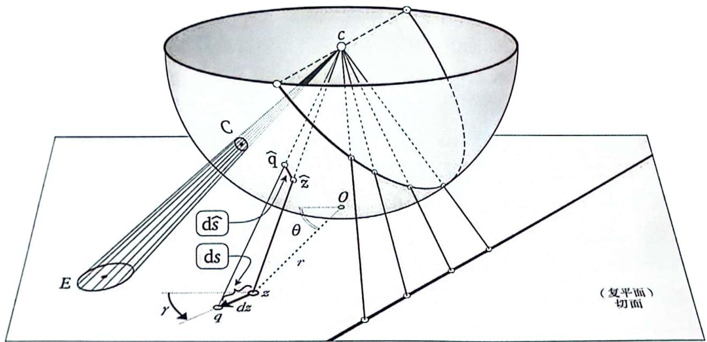  
图 4-1球面的中心投影将测地线映射为直线，将圆映射为椭圆.度量是地图上的距离ds与曲面上的距离  $\mathrm{d}\widehat{s}$  之间的局部比例系数

用  $\delta z$  表示  $\delta \widehat{s}$  的规则称为度量.一般来说，  $\delta \widehat{s}$  依赖于  $\delta z$  的方向及其长度  $\delta s$  记  $\delta z = \mathrm{e}^{\mathrm{i}\gamma}\delta s$  ，则  $\delta \widehat{s}\asymp \Lambda (z，\gamma)$  .再次提醒读者注意，  $\asymp$  表示牛顿的最终相等概念，在序幕中介绍过，这个关系式常用无穷小记号表示为

$$
\mathrm{d}\widehat{s} = \Lambda (z,\gamma)\mathrm{d}s. \tag{4.1}
$$

根据这个公式要从地图上位于点  $z$  处方向为  $\gamma$  的分离量  $\mathrm{d}s$  得到曲面  $s$  上相应的真实分离量  $\mathrm{d}\widehat{s}$ ，就要将  $\mathrm{d}s$  扩大至  $\Lambda (z，\gamma)$  倍.

# 4.2 球面的投影地图

图 4-1展示的是用中心投影法绘制南半球地图的方法，说明了式(4.1)的意义。想象南半球是一个玻璃碗，放在复平面的原点0上，并想象在球心处有一个点光源，将一束光线穿过半球上的点  $\hat{z}$  射到了复平面C上的点  $z$  ，这样就得到了南半球的平面地图，称为投影地图(或投影模型).

如果我们在半球上画一个圆  $c$  ，那么穿过它的光线就会在三维空间中形成一个圆锥，落在复平面  $c$  上形成一个完美椭圆  $E$  ，这是中心投影制图法的一个非常特殊和不寻常的特性.如果  $c$  是一般曲面  $s$  (例如图1- 9中的曲面)上按照内蕴几何定义的圆，则当  $c$  的半径收缩时，它在一般地图上的像  $E$  最终是椭圆.回过头来讨论中心投影中的完美椭圆.显然，  $E$  的主轴是径向的，笔直指向远离玻璃碗与平面的接触点的方向.换言之，如果想象  $\mathbf{d}z$  绕  $z$  旋转，则  $\Lambda (z，\gamma)$  分别在 $\gamma = \theta$  和  $\gamma = \theta +(\pi /2)$  处取得最小值和最大值.

选择如何绘制一个曲面的地图取决于我们希望准确或忠实地表现哪些特征例如，图 4-1说明中心投影地图忠实地表现了直线:地图上的一条直线代表球面上的一个大圆(即测地线).但是，为保证对于直线的忠实表示，我们付出了一些代价，那就是不能准确地表示角的大小:球面上的两条曲线相交的角度(通常)不是它们在地图上对应曲线相交的角度.

实际上，球面上确实存在两组正交曲线，它们映射到平面地图上的曲线也是正交的:这就是经线和纬线.一个纬线圆(即半球上的水平横截线)映射为平面地图上以原点为中心的圆周，经线(半)圆(即半球与过球心的纵向平面的截线)映射为平面地图上通过原点的直线.如上所述，这些圆和直线确实相交成直角.我们现在利用这个事实，推导出球面上的度量在中心投影地图中用极坐标  $(r，\theta)$  表示的公式，通过计算来完成这个任务[练习]并不难，但我们要用牛顿的几何推理(就是在序幕中介绍过的推论方式)取而代之，并在本书里一直这样做.

来看看图 4-2. 在平面地图上做一个角度为  $\delta \theta$  的小旋转，使得点  $z$  在半径为  $r$  的圆周上旋转移动一段距离  $r\delta \theta$  ，则球面上的点  $\hat{z}$  在水平的纬线圆上旋转移动  $\delta s_{1}$  ，接着让点  $z$  径向外移  $\delta r$  ，则点  $\hat{z}$  沿纵向的经线圆向北移动  $\delta s_{2}$  ，由勾股定理，  $\delta \widehat{s}^{2}\asymp \delta \widehat{s}_{1}^{2} + \delta \widehat{s}_{2}^{2}$  ，现在分别计算式中的每一项.(回忆一下，  $\asymp$  是序幕中引人的符号，表示牛顿"最终相等"的概念.)

在图 4-2中，令  $H = c z$  表示在  $\mathbb{R}^{3}$  中从球心  $c$  到复数  $z$  的距离.因为  $\hat{z}$  到  $c$  的距离为  $R$  ，而且旋转变换引起的  $\hat{z}$  和  $z$  到球心  $c$  的距离改变量成比例，所以

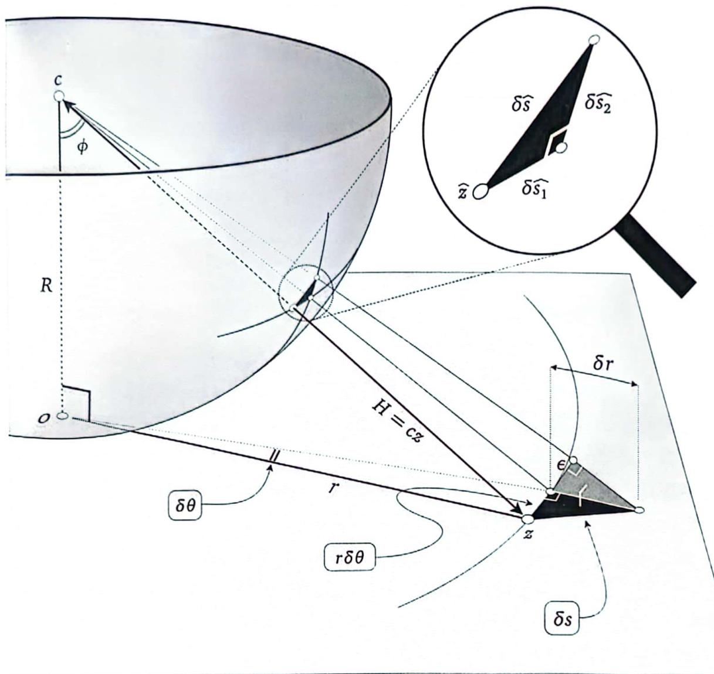  
图 4-2在平面地图上做一个角度为  $\delta \theta$  的小旋转，使得点  $z$  移动  $r\delta \theta$  ，则点  $\widehat{z}$  在水平的纬线上旋转移动  $\delta \widehat{s}_{1}$  ，接着让点  $z$  径向外移  $\delta r$  ，则点  $\widehat{z}$  沿纵向的经线圆向北移动  $\delta \widehat{s}_{2}$

$$
\frac{\mathrm{d}\widehat{s_{1}}}{r\mathrm{d}\theta} \asymp \frac{\delta\widehat{s_{1}}}{r\delta\theta} = \frac{R}{H}.
$$

然后，想象  $H$  是一根长度不变的细绳，一端固定在球心  $c$  上，如果我们让它的自由端在垂直于复平面的平面内向上摆动距离  $e$  ，则点  $\widehat{z}$  相应地按照上式的比例向北移动  $\delta \widehat{s}_{2}$  ，而且，我们可以看出，以  $e$  和  $\delta r$  为边的灰色纵向小三角形最终相似于以  $R$  和  $H$  为边的大三角形  $0cz$  ，于是

$$
\frac{\delta\widehat{s_{2}}}{\epsilon} \asymp \frac{R}{H} \quad \text{且} \quad \frac{\epsilon}{\delta r} \asymp \frac{R}{H} \quad \Rightarrow \quad \frac{\mathrm{d}\widehat{s_{2}}}{\mathrm{d}r} = \frac{R^{2}}{H^{2}}.
$$

最后，由勾股定理有  $H^{2} = R^{2} + r^{2}$  ，用回以无穷小为基础的表示法，描述球面上真实距离的度量可以用中心投影地图的坐标表示为

$$
\mathrm{d}\widehat{s}^{2} = \frac{1}{1 + (r / R)^{2}}\left[\frac{\mathrm{d}r^{2}}{1 + (r / R)^{2}} +r^{2}\mathrm{d}\theta^{2}\right]. \tag{4.2}
$$

在地理学中，通常的做法是把在赤道处的纬度  $\phi$  定义为0，但是我们选择从一个极点开始计量纬度(见图 4-2和图2- 4)。回到图 4-1，我们现在可以通过考察小椭圆  $E$  的形状来量化由地图产生的变形了。当  $c$  收缩时，现在应该能够证明[练习]

$$
\left(\frac{E\text{的长轴}}{E\text{的短轴}}\right) \approx \sec \phi , \tag{4.3}
$$

因此，当  $c$  向北移动到边缘(  $\phi = \pi /2$  )时，它在地图上被映射到无穷远处。

# 4.3 一般曲面上的度量

地图对于航行至关重要，几个世纪以来，数学家们探索了许多不同的方法来绘制地图，这里只简要介绍其中特别重要的一种，其他制图法留到这一幕末尾的习题中探讨。现在我们只想指出:每一种这样的制图法都有各自不同的度量公式，尽管它们表达了同样的内蕴几何。

例如，给地球上某个地方定位的最常用方法是提供它的经度  $\theta$  和纬度  $\phi$  。可以在平面上用这两个角度画出直截了当的地图:横轴坐标为  $\theta$ ，纵轴坐标为  $\phi$  。也就是说，如果一幢房屋在平面地图上有经度  $\theta$  和纬度  $\phi$ ，可以用直角坐标  $(\theta ， \phi)$  表示它的位置。借助图2- 4，易知[练习]度量公式为

$$
\mathrm{d}\widehat{s}^{2} = R^{2}\left[\sin^{2}\phi \mathrm{d}\theta^{2} + \mathrm{d}\phi^{2}\right], \tag{4.4}
$$

它告诉了我们球面上对应于地图上那些邻近点之间的真实距离。这个公式看起来与式(4.2)很不一样，但我们知道，实际上它们表达的是完全相同的内蕴几何。

即使我们把曲面简单地选取为平面，也有无穷多种可能的度量公式。例如，用直角坐标系有  $\mathrm{d}\widehat{s}^{2} = \mathrm{d}x^{2} + \mathrm{d}y^{2}$ ，用极坐标系有  $\mathrm{d}\widehat{s}^{2} = \mathrm{d}x^{2} + r^{2}\mathrm{d}\theta^{2}$ 。

现在，我们来考察普通曲面最一般的度量公式的形式和意义。图 4-3展示了如何给曲面  $\mathcal{S}$  上的一小片画一张一般的地图。对于这一小片上的每个点  $\widehat{z}$ ，我们的第一个目标是指定它的坐标为  $(u， \nu)$ ，使得可以在平面地图上用复数  $z = u + \mathrm{i}\nu$  来表示它。

首先，在这一小片曲面上随意画满一族曲线，对于曲面上的每个点  $\widehat{z}$ ，有且只有一条曲线经过。我们给每一条曲线标记唯一的数  $u$ ，这些曲线称为  $u$  曲线。标数可以很随意， 只要求数值平缓变化， 也就是说， 当我们在曲面上移动越过  $u$  曲线时，  $u$  的值按照确定的变化率变化 (即可微的， 稍后解释可微的意义).

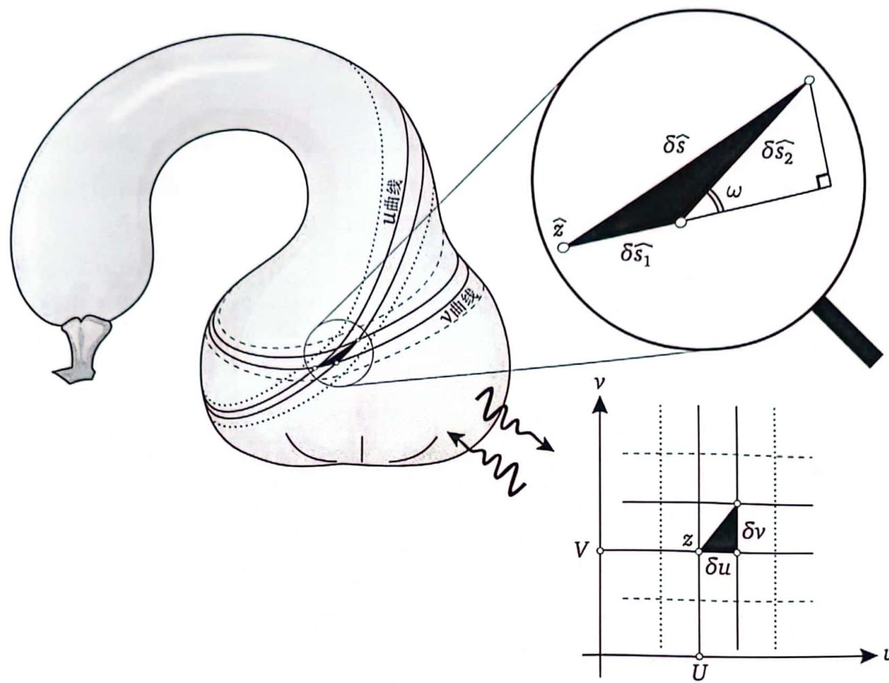  
图 4-3 在普通曲面上画两族参数曲线:  $u$  曲线(  $u =$  常数)和  $\nu$  曲线. 对于曲面上的每个点， 都有一对特定的曲线  $(U，V)$  交于它， 于是在地图上  $z = U + \mathrm{i}V$ . 地图上微小的横移  $\delta u$  最终产生了曲面上沿着  $\nu$  曲线相应比例的移动  $\delta \widehat{s_{1}} \asymp A \delta u$

要完成坐标系， 我们还要画第二族曲线， 画法也很随意， 只要求它们与  $u$  曲线相交， 但不重合. 现在给新曲线标记  $\nu$  值， 也要求它们按照确定的变化率可微地变化 (按照与前面同样的方式). 新曲线族称为  $\nu$  曲线. 这样， 如图 4-3所示， 对于点  $\widehat{z}$ ， 可以用在此相交的唯一一对  $u$  曲线 (例如  $u = U$ ) 和  $\nu$  曲线 (例如  $\nu = V$ ) 来标记. 在地图上可以用复数  $z = U + \mathrm{i}V$  表示  $\widehat{z}$ . 如图 4-3所示， 在地图上  $u$  曲线被映射为垂直直线，  $\nu$  曲线被映射为水平直线.

现在， 我们至少在曲面的某个局部建立了坐标系， 接下来的任务就是找到定义两个邻近点之间距离的度量公式. 在地图上让  $z$  沿着方向  $\delta z = \delta u + \mathrm{i} \delta \nu$  做微小移动. 由于  $u$  值对  $u$  曲线可微， 根据可微的定义， 对应微小变化  $\delta u$，曲面上沿着$\nu$  曲线的微小移动  $\delta \widehat{s_{1}}$  与  $\delta u$  最终成比例.我们设  $A$  为这个比例在这个点处的值:

$$
A \equiv \frac{\partial \widehat{s_{1}}}{\partial u} \times \frac{\delta \widehat{s_{1}}}{\delta u}.
$$

这一点很重要，我们重申:  $A$  是在  $(u， \nu)$  地图水平方向上的局部比例因子，必须在地图上拉伸一小段水平距离获得曲面上的真实距离，从而得出这个因子.

还有另一种形象化的方法，甚至可以不看地图.在图 4-3中，想象  $u$  曲线是按照固定的增量  $\epsilon$  画出来的(即  $u = U， u = U + \epsilon ， u = U + 2\epsilon ， \dots$ )，则  $A$  也可以看作与  $u$  曲线的聚集度(或密度)成反比:  $u$  曲线越密集，曲面上给定的移动  $\delta \widehat{s_{1}}$  引起地图上的变化  $\delta u$  就越大.

同样，(在  $u$  保持不变时)由地图上的微小变化  $\delta \nu$  引起的曲面上的移动  $\delta \widehat{s_{2}}$  与  $\delta \nu$  最终成正比，于是，可以设  $B$  为地图垂直方向上的局部比例因子:

$$
B \equiv \frac{\partial \widehat{s_{2}}}{\partial \nu} \times \frac{\delta \widehat{s_{2}}}{\delta \nu}.
$$

最后，如图 4-3所示，我们记  $\omega$  为  $u$  曲线与  $\nu$  曲线的夹角.这个角显然不是常数:与比例因子  $A$  和  $B$  一样，角  $\omega$  是位置的函数.

现在将勾股定理应用于图 4-3中放大镜里显示的直角三角形:

$$
\delta \widehat{s}^{2} \asymp (\delta \widehat{s_{1}} + \delta \widehat{s_{2}} \cos \omega)^{2} + (\delta \widehat{s_{2}} \sin \omega)^{2} \tag{4.5}
$$

$$
\asymp (A \delta u + B \delta \nu \cos \omega)^{2} + (B \delta \nu \sin \omega)^{2}. \tag{4.6}
$$

经过简化，并用回基于无穷小的符号(这是更标准的表示方法)，我们有**一般曲面的一般度量公式** 
$$
\mathrm{d}\widehat{s}^{2} = A^2 \mathrm{d}u^{2} + B^2 \mathrm{d}\nu^{2} + 2F \mathrm{d}u \mathrm{d}\nu , \quad\mbox{其中 }F=AB cos \omega \tag{4.7}
$$
你应该还会看其他的书，所以我们应该立即说明:在1827年的杰出原作中，高斯决定将这个度量公式记为

$$
\mathrm{d}\widehat{s}^{2} = E \mathrm{d}u^{2} + G \mathrm{d}\nu^{2} + 2F \mathrm{d}u \mathrm{d}\nu ,
$$

 在随后的几个世纪里，几乎所有 的微分几何研究论文和教科书都盲从地延用了$E，F，G$  记号.我们知道  $\sqrt{E} = A$  和  ${\sqrt{G}}=B$  ，前面已经给出了简单的几何解释，因此就不奇怪为什么在许多重要的公式中出现的是  $\sqrt{E}$  和  $\sqrt{G}$  (而不是  $E$  和  $G$  )。结果就是，文献被不必要的平方根弄得乱七八糟，因此，我们将在整本书中继续使用符号  $A$  和  $B$  (代替  $\sqrt{E}$  和  $\sqrt{G}$  )，当你在别处遇到用  $E，F，G$  记号表达的度量公式时，可以像下面这样翻译。
$$
\mbox{记号字典：} E\equiv A^2, G\equiv B^2, F \equiv AB cos \omega\tag{4.8}
$$
一般的度量公式有如下的简化方法。显然，一旦我们画出了  $u$  曲线族，就可以画出它们的*正交曲线族*，并选择这个正交曲线族作为  $\nu$  曲线。在这种结构中始终有  $\omega = (\pi /2)$  ，从而  $F = 0$  ，因此，对于一般的曲面，我们总是可以建立一个局部的正交坐标系$ (u，\nu)$ ，使得度量公式为
$$
\boxed{\mathrm{d}S^{2} = A^{2}\mathrm{d}u^{2} + B^{2}\mathrm{d}\nu^{2}.}
$$

然而请注意，通常不可能用一个  $(u，\nu)$  坐标系覆盖整个曲面，即使非正交坐标系也不行，问题出在你无法避免两条  $u$  曲线(和/或  $\nu$  曲线)相交的情况发生，在这种情况下，在交点处就会有两个不同的  $u$  值.事实上，我们将会在第19章中看到，对于每个封闭曲面(除了甜甜圈以外)这些问题都是不可避免的.

例如，在地球表面，假设我们选择  $u$  曲线为纬线圆(不一定要用  $u =$  纬度)，那么其正交曲线(即  $\nu$  曲线)一定是经线圆:所有的大圆都相交于南极和北极.因此，在南极点和北极点一定有无限个  $\nu$  值.

# 4.4 度量曲率公式

假设我们只有曲面  $S$  的一个度量公式(4.9)，没有掌握  $S$  的任何直接几何知识，也不知道坐标  $u$  和  $\nu$  本身的几何意义，那么这个曲面是什么样的呢?就  $S$  的内蕴几何而言，这个公式告诉了我们一切，但这只是在原理上.我们如何真正从这个公式获取有用的信息呢?

如果我们(通过图2- 3)知道每个点的曲率  $\kappa$ ，则能清楚地了解曲面  $S$  的本质和形状，又因为从度量可以知道关于内蕴几何的一切信息，所以它一定包含(特别是)关于曲率的信息，因此，我们可以假设存在一个  $\kappa$  的公式，而且，由于度量公式的对称性，显然， $\kappa$  的公式在同时交换  $u\leftrightarrow \nu$  与  $A\leftrightarrow B$  时也是对称的.

下面这个  $\mathcal{K}$  的公式美得令人惊叹:

$$
\mathcal{K} = -\frac{1}{A B}\left(\partial_{v}\left[\frac{\partial_{v}A}{B}\right] + \partial_{u}\left[\frac{\partial_{u}B}{A}\right]\right). \tag{4.10}
$$

要得到这个简单而优美的公式，路还很长：第四幕中的第27章首先利用几何方法推导出这个公式，第五幕中的38.8.2节通过计算(使用嘉当的微分形式)再次推导出这个公式。但现在，我们认为它是来自未来的超先进技术，就像《星际迷航》里23世纪的相位枪:现在就可以用它向目标开火，尽管我们对它的工作原理一无所知。

例如，在欧几里得度量  $\mathrm{d}\hat{s}^{2} = \mathrm{d}r^{2} + r^{2}\mathrm{d}\theta^{2}$  中有  $u = r， v = \theta ， A = 1， B = r$ ，所以就得到了我们已知的结果:

$$
\mathcal{K} = -\frac{1}{r}\left(\partial_{\theta}\left[\frac{\partial_{\theta}1}{r}\right] + \partial_{r}\left[\frac{\partial_{r}r}{1}\right]\right) = -\frac{1}{r} (\partial_{r}1) = 0.
$$

此外，在球面坐标度量公式(4.4)中有  $u = \theta ， v = \phi ， A = R， B = R$ ，再次得到了我们已知的结果:

$$
\mathcal{K} = -\frac{1}{R^{2}\sin\phi}\left(\partial_{\phi}\left[\frac{\partial_{\phi}R\sin\phi}{R}\right] + \partial_{\theta}\left[\frac{\partial_{\theta}R}{R\sin\phi}\right]\right) = -\frac{\partial_{\phi}\cos\phi}{R^{2}\sin\phi} = +\frac{1}{R^{2}}.
$$

虽然计算比较长，但我们鼓励你亲自动手尝试将这个公式应用于球面的射影度量公式(4.2)，也应该得到  $\mathcal{K} = +(1 / R^{2})$

在进入下一节之前，看看稍后需要的另一个结果，度量告诉我们怎样将地图上的一小段距离转换为曲面上的距离。但是，我们应该如何转换面积呢?在图 4-3中，地图上一个小矩形的面积为  $\delta u\delta \nu$ ，它在曲面上有一个对应平行四边形，其面积最终等于  $(A\delta u)(B\delta \nu \sin \omega)$ 。因此，利用式(4.7)，曲面上的无穷小面积元  $dA$  由如下公式表示：

$$
\mathrm{d}A = \sqrt{(AB)^{2} - F^{2}}\mathrm{d}u\mathrm{d}\nu . \tag{4.11}
$$

我们通常会指定使用正交坐标系，此时  $F = 0$ ，这个公式简化为

$$
\mathrm{d}A = AB\mathrm{d}u\mathrm{d}\nu . \tag{4.12}
$$

# 4.5 共形地图

虽然球面投影地图具有保持直线不变的优点，但是**对于几乎所有的目的，为了保持角度不变而放弃保持直线不变会好得多**。**如果一张地图能保持角的大小和指向都不变，则称为共形的；如果它保持角的大小不变，而使角的指向相反，则称为反共形的。**我们所说的两曲线的夹角是指它们交点处两切线的夹角，见图 4-4。

> 通俗解读：

> 什么是共形地图？

> 在地图投影中：

- > 有些地图保持**直线不变**（比如墨卡托投影）
- > 有些地图保持**角度不变**，称为**共形地图**

> 对于大多数应用来说，**保持角度（而不是直线）更重要！**

我们所说的两曲线的夹角是指它们交点处两切线的夹角，见图 4-4.

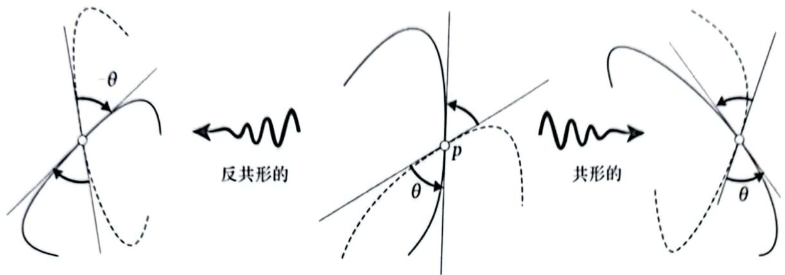  
图 4-4 在中间，两条曲线相交于点  $\pmb{p}$  ，它们的夹角（从短划线到实线）定义为它们的切线的夹角  $\theta$  ，**共形地图**（右图）保持夹角的大小和指向都不变；**反共形地图**（左图)保持夹角的大小不变，并使角的指向相反

根据度量公式(4.1)，**一个地图是共形的，当且仅当扩张因子  $\Lambda$  不依赖于从  $z$  出发的无穷小向量  $\mathrm{d}z$  的方向  $\gamma$：
$$ { }
\boxed{\mbox{共形地图}\iff  d\hat s =\Lambda(z) ds} \tag{4.13}
$$

>  注释：通俗解读
>
> **数学定义：共形映射的条件**
>
> 共形映射意味着，在某点 $z$ 附近，任意方向的小位移 $dz$ 被统一地缩放：
>
> $$
> \boxed{\text{共形} \iff d\hat s = \Lambda(z) \cdot ds}
> $$
> 其中：
>
> - $\Lambda(z)$ 是 **缩放因子**，只跟位置有关，不依赖方向。
> - 也就是说：无论朝哪个方向走，地图上都只是放大 $\Lambda$ 倍。

共形地图的一大优点是

> 曲面  $\mathcal{S}$  上的一个无穷小图形在共形地图中表示为相似图形，与原图形仅大小不同:  $\mathcal{S}$  上图形的线性大小是地图上图形的线性大小的  $\Lambda$  倍。

事实上，18世纪的数学家所称的**无穷小相似**，就是现代术语中的**共形概念**。

显然，由结论(4.13)右边的等式可推出共形性，现在通过图 4-5说明反过来也是可以的。>

>  注释： 反向推理：如果边长比都等于 $\Lambda$，也说明是共形！ 

图 4-5左图是曲面的*共形*地图，其中的三角形在向一个点收缩。此时，曲面上对应的曲线三角形就会收缩到一个直线三角形，用序幕里介绍的术语来说就是，地图上的三角形与曲面上的三角形是最终相似的，即存在某个与三角形的边  $\delta s_{1}$  和  $\delta s_{2}$  的方向无关的  $\Lambda$ ，使得
$$
\frac{\delta\widehat{s_{1}}}{\delta s_{1}} \asymp \frac{\delta\widehat{s_{2}}}{\delta s_{2}} \asymp \Lambda .
$$

于是，我们证明了，由共形性可推出结论(4.13)右边的等式

  
图 4-5 当地图上的三角形（左图）收缩时，它与曲面上的共形映像（右图)是**最终相似**的：  $\frac{\delta\widehat{s_{1}}}{\delta s_{1}} \asymp \frac{\delta\widehat{s_{2}}}{\delta s_{2}}$

在讨论一般度量公式(4.7)时，显然可以只考虑曲面上由  $u$  曲线和  $\nu$  曲线组成正交坐标系的情形，地图上与其对应的是由纵横直线组成的正交坐标系.但是在这个阶段，一般来说，两个方向上的拉伸因子  $A$  和  $B$  是不同的，所以地图上的无穷小圆就拉伸为曲面上的椭圆了，而且夹角也会改变.

现在考虑更特殊的情形：拉伸因子在所有方向上都是相同的，即  $A = B = \Lambda$  于是无穷小圆映射为无穷小圆，*角度保持不变*。在这种情况下，  $(u， \nu)$  坐标称为**共形坐标**(或**等温坐标**)，式(4.9)简化为欧几里得度量的简单倍数:

$$
\boxed{\mathrm{d}\widehat{s}^{2} = \Lambda^{2}[\mathrm{d}u^{2} + \mathrm{d}\nu^{2}].} \tag{4.14}
$$

这是一个很强的限制条件，以至于有人担心这样的地图可能根本不存在。但是，高斯在1822年发现，对于一般曲面，*总是*有可能(至少局部地)画出一张这样的地图。值得注意的是，这个证明(见第97页习题8)依赖于*复数*——事实上，**复分析和共形地图之间有很深的联系**，这是下一节的主题.

曲率公式 (4.10) 已经很优美了， 但是现在可以变得*更加*优美. 回忆一下二阶拉普拉斯微分算子  $ \nabla^{2}$ :

$$
\nabla^{2} \equiv \partial_{u}^{2} + \partial_{\nu}^{2}. \tag{4.15}
$$

现在， 有了条件  $A = B = \Lambda$ ， 容易 [练习] 将式 (4.10) 简化为

$$
\mathcal{K} = -\frac{\nabla^{2} \ln \Lambda}{\Lambda^{2}}. \tag{4.16}
$$

> 注释：即，曲率 $\mathcal{K}$ 由缩放因子 $\Lambda$ 的变化率（即 $\ln \Lambda$ 的拉普拉斯）决定。非常优雅的公式！

# 4.6 讲一点儿可视化的复分析

即使我们将曲面  $S$  选为平面， 讨论平面到平面的共形映射， 这也仍然是一个丰富而深刻的研究领域。 需要强调的是， 这些共形映射与复数错综复杂的纠缠关系是无法避免的， 本节只准备进行简单的介绍。 (在这一幕的后面将给出更多具体的例子.) 我的***第一本书《复分析》中全面介绍了复分析中的精彩结果是如何从这个几何的基础性问题中产生**的， 在此冒昧地向你推荐它.

**每个曲面  $S$  一定有共形地图， 而且是无穷多种共形地图！**我们首先要指出， 为生成满足度量公式 (4.14)
$$
\mathrm{d}\widetilde{s} = \Lambda (u, \nu) \mathrm{d}s
$$
的共形  $(u， \nu)$  坐标系， 特定的  $u$  曲线和与之正交的  $\nu$  曲线并不需要有什么独特之处.

真正神奇的是共形映射  $F: \mathbb{C} \rightarrow \mathcal{S}$  本身. **给定一个共形映射  $F$ ， 通过对复平面  $\mathbb{C}$  上的  $(u， \nu)$  坐标网格做旋转、伸缩和平移， 就可以在曲面  $S$  上创建无穷多个不同的共形  $(\widetilde{u}， \widetilde{\nu})$  坐标系， (利用映射  $F$  ) 得到曲面  $S$  上全新的  $\widetilde{u}$  曲线和与之正交的  $\widetilde{\nu}$  曲线.  $S$  上这个全新的正交  $(\widetilde{u}， \widetilde{\nu})$  坐标系与原先的坐标系一样， 也是共形的.**

我们引入一些记号来充分解释这一点，按照复分析中的惯例，可以认为  $z =$ $u + i \nu$  位于复平面  $\mathbb{C}$  的一个副本上，它在复函数  $z\mapsto \widetilde{z} = f(z)$  下的像  $\widetilde{z} = \widetilde{u} +\widetilde{\nu}$位于复平面  $\mathbb{C}$  的另一个副本上：
$$
z \mapsto \widetilde{z} = \widetilde{u} + \mathrm{i}\widetilde{\nu} = f(z) = f(u + \mathrm{i}\nu).
$$

在我们刚刚讨论过的例题里，有  $f(z) = a\mathrm{e}^{\mathrm{i}\tau}z + w$  ，它由拉伸(实数)  $a$  倍、旋转(角度)  $\tau$  、平移(复数)  $w$  组成.

将映射  $f$  与映射  $F$  复合，得到从复平面  $\mathbb{C}$  到曲面  $\mathcal{S}$  的新共形映射  $\widetilde{F} \equiv F \circ f$ 。如果  $z$  沿着小复数  $\delta z$  的方向移动距离  $|\delta z|$  ，则它在第一个映射  $z \mapsto \widetilde{z} = f(z)$  的像从  $\widetilde{z}$  出发，沿着  $\delta \widetilde{z}$  的方向移动距离  $|\delta \widetilde{z} |$  (其中  $\delta \widetilde{z}$  是  $\delta z$  的像)，显然有
$$
\delta \widetilde{z} = a\mathrm{e}^{\mathrm{i}\tau}\delta z. \tag{4.17}
$$
>  注意，这里没有出现常数平移项 $w$，这是因为我们分析的是 **微分变化**（infinitesimal change）$\delta z$，而 **平移项在微分中会消失**。
>
> 由$\tilde z =f(z)$知，$\delta f(z) =\delta \tilde z$。而 $f(z)= a\mathrm{e}^{\mathrm{i}\tau}z + w$，从而 $\delta\tilde z = \delta f(z) = \delta (a\mathrm{e}^{\mathrm{i}\tau}z + w)= a\mathrm{e}^{\mathrm{i}\tau} \delta z $

于是，距离  $\delta s = |\delta z|$  被拉伸  $a$  倍，所以  $\delta \widetilde{s} = |\delta \widetilde{z} | = a\delta s$  ，接着，在第二个映射  $F$  的作用下(这时映射到曲面  $s$  上)，距离  $\delta \widetilde{s}$  被拉伸  $\Lambda (\widetilde{z})$  倍，其中  $\Lambda (\widetilde{z})$  是共形度量因子.于是，  $\delta s$  在复合映射  $\widetilde{F}$  下的拉伸因子是这两个拉伸因子的乘积:
$$
\mathrm{d}\hat{z} = \widetilde{\Lambda} (z)\mathrm{d}s,\quad \mbox{其中 } \widetilde{\Lambda} (z) = a\Lambda (\widetilde{z}).
$$

这只勉强触及了表面，为了解释原因，我们简单地引用复分析中的如下基本事实，详情请参见《复分析》，你一定研究过一些有用的常见实函数，例如  $x^{m}， \mathrm{e}^{x}， \sin x$  ，只要将自变量换成复数  $z$  ，每一个这样的实函数  $f(x)$  就能唯一延拓为复函数  $f(z)$  。像之前一样，可以把它想象成从一个复平面  $\mathbb{C}$  到另一个复平面  $\mathbb{C}$  的映射。**复分析的神奇之处是，所有这些自然出现的映射  $f(z)$  自动地都是共形的。**

例如，图 4-6说明了平方映射

$$
z \mapsto \widetilde{z} = f(z) = z^{2} = \left[r\mathrm{e}^{\mathrm{i}\theta}\right]^{2} = r^{2}\mathrm{e}^{\mathrm{i}2\theta}
$$

的作用，它将每个复数的模平方，辐角加倍，如你所见，左边那些小"正方形"变成右边的相似"正方形"。当然，这两组"正方形"只在收缩到一点时才是真正的正方形。同样，左图中黑色的  $\mathbb{T}$  形越小，就与被映射到右图中的  $\mathbb{T}$  形像越相似。

为了看出这有多神奇，**假设随机写下两个实函数  $\widetilde{u}$  和  $\widetilde{\nu}$  (实变量  $u$  和  $\nu$  的函数)，然后将它们强制合并成单一的复映射  $f(u， \nu) = \widetilde{u} + \mathrm{i}\widetilde{\nu}$  ，那么  $f$  根本不可能是共形的，我们将会看到，这也意味着导数  $f'(z)$  不可能存在!**

我们重做一次之前的分析，但现在用 导数  $f'(z)$ 存在的一般映射  $f(z)$  (称为解析映射)替换线性函数红色。正如我们刚才指出的， 解析映射非常罕见，但还是包括了从数学和物理学中自然产生的所有有用函数。

> 解析映射和共形映射是什么关系
>
>   什么是共形映射？
>
> - 共形映射是在每一点处都保持角度的映射。
> - 在复变函数中，解析函数如果导数不为零，则它在该点是共形的。

> 哪些解析映射不是共形的？
>
> 1. 在某些点导数为零的解析函数（如 \( f(z) = z^n \) 在原点）。
> 2. 在某些区域虽然解析，但包含奇点、支点等的函数。
>
> ### 所以：
>
> - **解析 + 导数 ≠ 0 ⇒ 共形**
> - **解析 + 导数 = 0 ⇒ 非共形（在该点）**

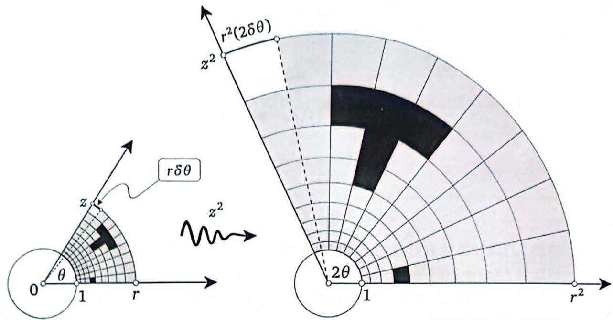  
图 4-6 映射  $z \mapsto f(z) = z^{2}$  (  $z$  的所有幂都一样) 是共形的， 所以左图中的小"正方形"格子被映射为右图中的近似正方形. 当正方形的大小取极限收缩到0时， 这些近似正方形会最终变成真正的正方形

现在， 与式 (4.17) 类似， 我们有

$$
\delta \widetilde{z} \asymp f'(z) \delta z = a \mathrm{e}^{\mathrm{i} \tau} \delta z. \tag{4.18}
$$

主要的区别是，  现在伸缩系数  $a(z)$  和旋转角  $\tau (z)$  都依赖于位置  $z$，而不是在整个复平面  $\mathbb{C}$  上不变. 例如， 在图 4-6中， 我们可以看到网格左上角的白色"正方形"比下面毗连实轴的黑色"正方形"扩大得更多一些， 所以  $a(z)$  在黑色"正方形"内比在白色"正方形"内小. 同样， 这个黑色"正方形"很明显没有旋转， 所以这里的  $\tau = 0$ ， 但白色"正方形"显然必须经过旋转才能得到它的像.

如果  $f'(z) \neq 0$ ， 由式 (4.18) 可知， 每一个从点  $z$  出发的微小复箭头  $\delta z$ ， 经过同样的拉伸  $a$  和旋转  $\tau$ ， 都能得到从点  $\widetilde{z} = f(z)$  出发的像箭头  $\delta \widetilde{z}$ . 如图 4-7所示， 从点  $z$  出发的两个  $\delta z$  之间的夹角， 将与它们的像 [从点  $\widetilde{z} = f(z)$  出发的两个  $\delta \widetilde{z}$ ] 之间的夹角相同. 由此可知，  可微复映射都是自动共形的.

我们知道导数 $f'(z)$  描述了共形映射的局部性质， 并在《复分析》中引入了一些 (非标准) 术语来刻画这个性质的几何意义. 我们称局部拉伸因子  $a$  为伸缩， 称局部旋转角度  $\tau$  为**扭转**， 称伸缩和扭转的组合 (将原始图形转换为像) 为**伸扭**. 综上，

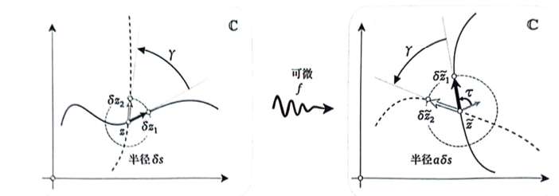

图 4-7 伸扭。可微复映射$f(z)$的局部作用是**伸扭**（由**伸缩**和**逆转**复合而成的变换），用复数描述为$ f^{\prime}(z) = f(z)$ 的伸扭 $=$  (伸缩)  $\mathrm{e}^{\mathrm{i}(\mbox{扭转})} $。设 $\delta_{1,2}$是从 $z$出发的任意两个小复数，它们**相等地伸扭**为从 $\tilde z=f(z)$出发的两个复数 $\delta\widetilde z_{1,2}  \asymp ae^{i\tau}$，所以两条曲线的夹角 $\gamma$ 保持不变：$f$是*共形*的。
$$
f^{\prime}(z) = f \mbox{  在  $z$  处的伸扭  $=$  (伸缩) } \mathrm{e}^{\mathrm{i\mbox{ 扭转}}} = a\mathrm{e}^{\mathrm{i}\tau}
$$
在讨论空间曲面上的共形度量公式之前，我们再次回到  $f(z) = z^{2}$ ，演示如何借助图 4-6利用几何方法推导出平方函数的伸扭。

考虑图 4-6中有一个顶点为  $z = r\mathrm{e}^{\mathrm{i}\theta}$  的白色"正方形"。它经过点  $z$  、辐角为  $\theta$  的径向边被映射为经过点  $z^{2}$  、辐角为  $2\theta$  的径向边，即这条边在映射作用下扭转了角度  $\theta$ ，所以
$$
\tau =\mbox{扭转}= \theta.
$$
为了求出拉伸因子  $a$ ，注意白色"正方形"加黑的外边(它最终等于经过点  $z$  、连接两个白点的那段圆弧)。它对应的圆心角为  $\delta \theta$ ，长度最终等于  $r\delta \theta$ 。因为平方映射使得辐角加倍，所以这段弧的像(称为像弧)对应的圆心角为  $2\delta \theta$ ，又因为像弧在半径为  $r^{2}$  的圆周上，所以这段像弧的长度最终为  $r^{2}(2\delta \theta)$ 。因此，
$$
\mbox{(像弧) }\approx \mbox{ 原弧} \implies a = \mbox{ 伸缩 }=2r.
$$
于是，我们得到结论:
$$
\left( z^2\right)^\prime = z^2 \mbox{ 的伸缩 }=\mbox{ 伸缩 } e^{i\mbox{扭转}}=2r e^{i\theta}=2z.
$$
 这个结果与实函数的结果  $\left(x^{2}\right)^{\prime} = 2x$  看起来完全一样，但它包含的意义要多得多。

将这个几何方法推广到幂函数  $z^{m}$ ，不难得到  $\left(z^{m}\right)^{\prime} = m z^{m - 1}$  [练习]。其他重要映射的伸扭也可以用纯几何的方法推导出来，详情请参见《复分析》。

现在回到我们的主要关注点：曲面上的共形坐标，我们可以把简单的线性函数重新放到极其丰富的可微(即共形)映射  $f(z)$  里，再次定义从复平面  $\mathbb{C}$  到曲面  $S$  的复合映射  $\widetilde{F} \equiv F \circ f$ ，新的度量公式为

$$
\mathrm{d}\hat{s} = \widetilde{\Lambda} (z) \mathrm{d}s, \quad \text{其中} \widetilde{\Lambda} (z) = (\text{伸缩}) \Lambda (\widetilde{z}) = |f'(z)| \Lambda (\widetilde{z}). 
$$

只要有一个共形映射  $F: \mathbb{C} \mapsto S$ ，任选一个解析映射  $f: \mathbb{C} \mapsto \mathbb{C}$ ，然后变换到  $S$ ，就可以构作从曲面  $S$  到自身的共形映射。为看清这一点，考虑作用在  $S$  上的复合映射

$$
\widehat{f} \equiv F \circ f \circ F^{-1}. \tag{4.20}
$$

首先， $F^{- 1}$  是从曲面  $S$  到复平面  $\mathbb{C}$  的共形映射；其次， $f$  将  $\mathbb{C}$  共形映射到  $\mathbb{C}$ ；最后， $F$  将复平面  $\mathbb{C}$  共形映射到曲面  $S$ ，因为这三个映射都保持角度不变，所以复合映射也保持角度不变，从而复合映射  $\widehat{f}: S \mapsto S$  的确是共形的。

在下一节中，我们将遇到一个非常重要的例子，即球面  $S = \mathbb{S}^{2}$  上的共形映射  $F$ ，稍后，我们将用这个映射  $F$ ，经由映射(4.20)，将球面  $\mathbb{S}^{2}$  的旋转变换表示为复函数[由式(6.10)给出]，这些旋转变换不仅是共形的，而且是在球面上(保向)等距的。

# 4.7 球面的共形球极地图

喜帕恰斯(约公元前150年)可能是第一个绘制球面共形地图的人，他使用的方法如图 4-8所述，即所谓的**球极平面投影法**。到了公元125年，托勒密(他通常被认为是该方法的发现者)用这种方法绘制了天体在天球上的位置。

这个投影法类似于中心投影，不同的是点光源在北极  $N$ ，而不是在球心，投影到的是一个横截赤道的平面，而不是南极的切平面。穿过球面  $\Sigma$  上点  $\widehat{z}$  的光线射到复平面  $\mathbb{C}$  上的一点  $z$  (称为点  $\widehat{z}$  的**球极像**)。这样我们就建立了从  $\mathbb{C}$  上的点到  $\Sigma$  上的点一一对应的关系，所以也可以说  $\widehat{z}$  是  $z$  的球极像，因为上下文清楚地表明我们考虑的是从  $\mathbb{C}$  到  $\Sigma$  的映射，还是从  $\Sigma$  到  $\mathbb{C}$  的映射，所以，球极像是  $\widehat{z}$  还是  $z$  一目了然，不会引起混淆。

注意以下立即可得的事实：

(i)  $\Sigma$  的南半球被映射到  $\mathbb{C}$  上圆周  $|z| = R$  的内部，特别地，南极  $S$  被映射到复平面的原点0；(ii) 球面  $\Sigma$  赤道上的每个点被映射到复平面  $\mathbb{C}$  的圆周  $|z| = R$  上(即映射到自身)；(iii) 在复平面  $\mathbb{C}$  上，圆周  $|z| = R$  的外部被映射到  $\Sigma$  的北半球，但北极  $N$  不是复平面  $\mathbb{C}$  上任何有限点的像。

然而，很明显，随着  $z$  (在任何方向上)越来越远离原点，像  $\widehat{z}$  越来越接近北极  $N$  。在这之后，直到第二幕结束，我们都将采用复分析中惯例，将  $\Sigma$  取成单位球面，它的每个点以其球极像的复数标记，这个球面称为黎曼球面。北极  $N$  就是无穷远点的具体表现。这样的复平面称为扩充复平面。

图 4-8说明了以下事实:

**平面上直线的球极像是球面  $\Sigma$  上的一个圆周，这个圆周沿着平行于原像直线的方向经过北极  $N$。**

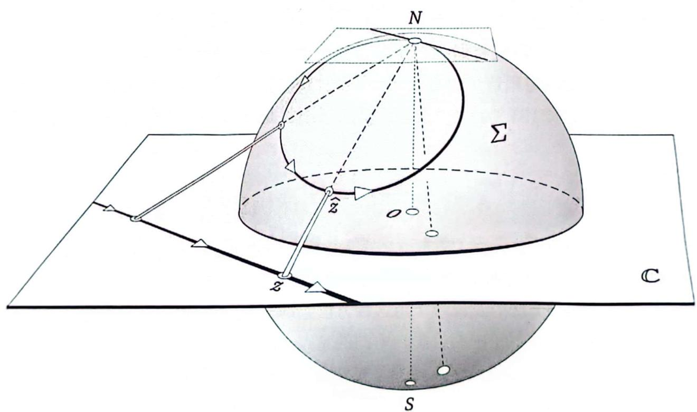  **图 4-8 球极平面投影**：从北极  $N$  发出的光透过玻璃球面  $\Sigma$  ，照在复平面  $\mathbb{C}$  上。**球面  $\Sigma$  上经过北极  $N$  的圆周在复平面  $\mathbb{C}$  上的影子是一条直线，它平行于圆周在北极  $N$  的切线**

要弄清这一点，首先观察到，当点  $z$  沿着图 4-8所示的直线运动时，连接北极  $N$  和点  $z$  的直线扫出了一个经过北极  $N$  的平面的一部分。于是球极像  $\widehat{z}$  沿着这个平面与球面  $\Sigma$  的交线运动，其轨迹是经过北极  $N$  的圆周。

其次，注意到球面  $\Sigma$  在北极  $N$  的切平面平行于平面  $\mathbb{C}$  。我们用第三个平面与这两个平行平面相交，得到两条平行的直线，一条是原像直线，另一条是圆周在北极  $N$  的切线。所以，圆周在北极  $N$  的切线平行于原像直线。

由此可知， 球极平面投影是保持角度不变的$^{\text {①}}$ . 图 4-9 显示了两条相交于点  $z$  的直线， 它们的球极平面投影像都是经过北极  $N$ 的圆周.

  **图 4-9 球极平面投影是共形的. ** 当平面上的直线绕点  $z$  旋转时，球面上的像圆在北极  $N$  的切线与它一起绕  $N$  旋转，所以它们在  $z$  和  $N$  处的旋转角相等。***由对称性，球面上在点  $\hat z$  处的旋转角与在  $N$  处的旋转角相等，从而也与平面上在点  $z$  处的旋转角相等，这样就证明了球极平面投影是共形的*（为什么？)**

注意到两个圆周在两个交点( $\hat z$  和北极 $N$ ) 处夹角的大小是相同的，这是因为球面上的图形关于由球心和两个圆心决定的平面具有镜像对称性。

> 注：如果你在橘子表面上画任意两个相交的圆，这就会变得非常清楚。（事实上，圆周关于直径对称，而经过圆心的直线就是直径，所以圆周关于经过圆心的直径对称；同理，球面关于经过球心的平面对称。所以，球面及其上面的两个圆周关于由球心和两个圆心决定的平面都是对称的，即这里所说的镜像对称。

又因为圆在北极  $N$  处的切线与平面上的原像直线平行，所以图 4-9中所示在点  $z$  和  $\hat{z}$  处的两个角具有相等的大小。但是，在说球极平面投影是"共形的"之前，我们必须定义球面上角度的方向.

根据我们的约定， 图 4-9 所示在点  $z$  处的角 (从黑色线条到白色线条) 是正的， 也就是说， 当从平面上方向下看时，它是逆时针的。从图 4-9 可以看出， 在点  $\hat z$ 处的角是负的 (顺时针)。 然而， 如果我们从球内部向外看这个角， 它是正的。因此，

> 如果我们用从球面  $\Sigma$  内部向外看到的角来定义  $\Sigma$  上角的方向，那么球极平面投影就是共形的.

历史注释：值得注意的是，托勒密在公元125年左右首次将球极平面投影法付诸实际应用，从此这种方法广为人知。但是，直到近1500年后，球极平面投影的**共形性**这个至关重要的美丽性质才被发现。这是托马斯·哈里奥特在1590年左右首先发现的——是的，就是在1603年发现：球面的角盈与面积关系的基本公式(1.3)的那个托马斯·哈里奥特!

由共形性可知，球面的度量具有式(4.13)的形式，即：
$$
\boxed{\mbox{共形地图}\iff  d\hat s =\Lambda(z) ds} \tag{4.13}
$$
如图 4-10所示，球面上一个半径为  $\delta \widehat{s}$  的小圆周最终映射为平面上一个半径为  $\delta s$  的圆周，其中
$$
\delta \widehat{s} \asymp \Lambda \delta s.
$$

现在我们来求出这个  $\Lambda$ 。

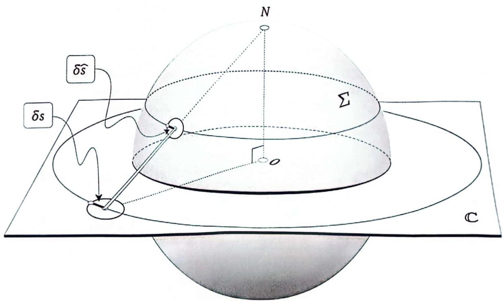  
图 4-10 共形性意味着球面上一个半径为  $\delta \widehat{s}$  的小圆周最终映射为平面上一个半径为的  $\delta s$  圆周。要找到度量公式，必须求出它们半径的比值，为此我们选择  $\delta \widehat{s}$  沿着图中所示的纬线圆方向

因为  $\Lambda$  仅依赖于点  $\widehat{\mathbf{z}}$ ，与半径  $\delta \widehat{s}$  及其方向无关，所以我们可以自由地选取一个方向使得几何分析尽量简单。于是，我们选取水平方向，即沿着纬线圆的方向。

在球极平面投影的作用下，球面上的纬线圆被均匀放大，生成一个以原点为圆心，经过点  $z$  的圆周，而  $\delta s$  指向点  $z$ 。当点  $\hat{z}$  沿着经过它的纬线圆转动时，点  $z$  也在平面上和它一样地转动，它们的移动的距离与它们到北极  $N$  的距离成比例。于是，

$$
\frac{\delta \widehat{s}}{\delta s} = \frac{N \widehat{z}}{N z}.
$$

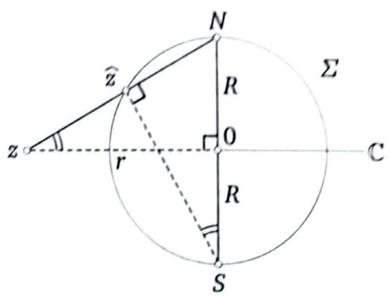  
图 4-11 三角形  $N \widehat{z} S$  相似于三角形  $N 0 z$

图 4-11显示的是图 4-10中经过三点  $N， \widehat{z}， z$  的纵剖面。三角形  $N \widehat{z} S$  相似于三角形  $N 0 z$ ，所以
$$
\frac{N \widehat{z}}{2 R} = \frac{R}{N z}.
$$

结合前面得到的结果，我们有

$$
\frac{\delta \widehat{s}}{\delta s} = \frac{2 R^{2}}{[N z]^{2}}.
$$

最后，令  $r = |z|$ ，利用勾股定理，从三角形  $N 0 z$  可知  $[N z]^{2} = R^{2} + r^{2}$ ，于是 球极地图的共形度量公式为
$$
\mathrm{d} \widehat{s} = \frac{2}{1 + (r / R)^{2}} \mathrm{d} s. \tag{4.22}
$$

 这是我们第一次尝试共形曲率公式(4.16)，即 $\mathcal{K} = -\frac{\nabla^{2} \ln \Lambda}{\Lambda^{2}}$，当然会得到  $\mathcal{K} = (1 / R^{2})$ 。建议你用以下两种方式确认这个结果。一是，记  $r^{2} = x^{2} + y^{2}$ ，利用拉普拉斯算子在直角坐标系里最初的形式，即式(4.15) $\nabla^{2} \equiv \partial_{u}^{2} + \partial_{\nu}^{2}$。二是，利用拉普拉斯算子在极坐标系里的如下形式：
$$
\nabla^{2} = \partial_{r}^{2} + \frac{1}{r} \partial_{r} + \frac{1}{r^{2}} \partial_{\theta}^{2}. \tag{4.23}
$$

> 已知球极投影的共形度量公式为
>
> $$
> \mathrm{d} \widehat{s} = \frac{2}{1 + (r / R)^{2}} \mathrm{d} s, \tag{4.22}
> $$
>
> 因此，共形因子为
>
> $$
> \Lambda(r) = \frac{2}{1 + (r/R)^2}
> $$
>
> 我们希望使用共形曲率公式 (4.16) 来验证其对应的高斯曲率 $\mathcal{K}$：
>
> $$
> \mathcal{K} = -\frac{\nabla^{2} \ln \Lambda}{\Lambda^{2}}. \tag{4.16}
> $$
>
> 我们将使用两种方式来确认结果 $\mathcal{K} = \frac{1}{R^2}$。
>
> 先取 $ \Lambda(r)$ 的对数：
> $$
> {\rm ln} \Lambda(r)= {\rm ln}2 - {\rm ln}\left( 1+\frac{r^2}{R^2}\right)
> $$
> 在极坐标系中，拉普拉斯算子的表达式为：
>
> $$
> \nabla^{2} = \partial_{r}^{2} + \frac{1}{r} \partial_{r} + \frac{1}{r^{2}} \partial_{\theta}^{2}. \tag{4.23}
> $$
>
> 由于 $\Lambda(r)$ 与 $\theta$ 无关，最后一项为零，因此我们只需计算：
> $$
> \nabla^{2} {\rm ln} \Lambda(r) = \frac{d^2}{dr^2} {\rm ln} \Lambda + \frac{1}{r} \frac{d}{dr} {\rm ln} \Lambda(r). \tag{4.23}
> $$
> 先计算一阶导数：
> $$
> \frac{d}{dr} {\rm ln} \Lambda =-\frac{2r}{r^2+R^2}
> $$
> 再计算二阶导数：
> $$
> \frac{d^2}{dr^2} {\rm ln} \Lambda =-\frac{2(R^2-r^2)}{(r^2+R^2)^2}
> $$
> 因此，拉普拉斯为
> $$
> \nabla^{2} {\rm ln} \Lambda =- \frac{2(R^2-r^2)}{(r^2+R^2)^2}-\frac{2}{r^2+R^2}=-\frac{4R^2}{(r^2+R^2)^2}.
> $$
> 代入式 (4.16) 得,
> $$
> \mathcal{K}=-\frac{\nabla^{2} {\rm ln} \Lambda}{\Lambda^2}=-\left(-\frac{4R^2}{(r^2+R^2)^2} \right) \cdot \left(\frac{(r^2+R^2)^2}{4} \right)=\frac{1}{R^2}
> $$
>
> ### 方法一：直角坐标系中的拉普拉斯算子
>
> 记 $r^{2} = x^{2} + y^{2}$，根据拉普拉斯算子在直角坐标系里的形式：
>
> $$
> \nabla^{2} \equiv \partial_{u}^{2} + \partial_{\nu}^{2} \tag{4.15}
> $$
>
> 计算 $\ln \Lambda(r)$ 的二阶偏导，并代入公式 (4.16)。
>
> ---
>
> ### 方法二：极坐标中的拉普拉斯算子
>
> 由于 $\Lambda$ 仅依赖 $r$，可省略关于 $\theta$ 的项。于是：
>
> $$
> \nabla^2 \ln \Lambda(r) = \frac{d^2}{dr^2} \ln \Lambda(r) + \frac{1}{r} \frac{d}{dr} \ln \Lambda(r)
> $$
>
> 然后带入公式 (4.16)，计算出 $\mathcal{K}$：
>
> $$
> \mathcal{K} = \frac{1}{R^2}
> $$
>
> 验证球极地图确实保持了球面曲率。

# 4.8 球极平面投影公式

在本节中，我们要 推导球面  $\Sigma$  上的点  $\hat{z}$  和它在  $\mathbb{C}$  上的球极平面投影  $z$  之间坐标关系的显式公式。为简化问题，我们*仅考虑  $R = 1$  的标准情形*。

令点  $z$  的直角坐标为  $ {z} = {x} + {i} {y}$  ，球面  $\Sigma$  上点  $\hat{{z}}$  的直角坐标为  $(X，Y，Z)$。我们选择  $X$  轴和  $Y$  轴分别与平面  $\mathbb{C}$  的  ${x}$  轴和  ${y}$  轴重合，  $Z$  轴正半轴经过北极  $N$. 为了让你适应这两个坐标系，请验证以下事实:  $\Sigma$  的方程为  $X^{2} + Y^{2} + Z^{2} = 1$  ，北极  $N$  的坐标为(0，0，1)，南极  $s$  的坐标为  $(0，0， - 1)$  ，以及  $\mathbf{1} = (1，0，0)$  ，  $\mathbf{i} = (0，1，0)$

已知球面  $\scriptstyle{\boldsymbol{\Sigma}}$  上点  $\hat{\pmb{z}}$  的坐标为  $(X，Y，Z)$  ，它的球极像为  $\pmb {z} = \pmb {x} + \mathbf{i}\mathbf{y}$  ，我们来求联系二者的公式，设点  $\hat{\pmb{z}}$  到平面  $\mathbf{c}$  的垂足为  $\pmb{z}^{\prime} = X + \mathbf{i}Y$  ，显然，球极像  $\pmb{z}$  与垂足  $\pmb{z}^{\prime}$  具有相同的方向，所以

$$
z = \frac{|z|}{|z^{\prime}|} z^{\prime}.
$$

图 4-12a 绘出了过北极  $N$  和点  $\hat{\pmb{z}}$  的球面  $\scriptstyle{\boldsymbol{\Sigma}}$  和平面  $\mathbf{c}$  的纵剖面，显然，点  $\hat{\pmb{z}}$  和  $\pmb{z}$  都在这个纵剖面上，由图 4-12a中所示分别以  $N\hat{\pmb{z}}$  和  $N z$  为斜边的两个直角三角形的相似性，立即可得[练习]:

$$
{\frac{|z|}{|z^{\prime}|}}={\frac{1}{1-Z}}.
$$

由此得到第一个球极平面投影公式:

$$
x + \mathrm{i}y = \frac{X + \mathrm{i}Y}{1 - Z}. \tag{4.24}
$$

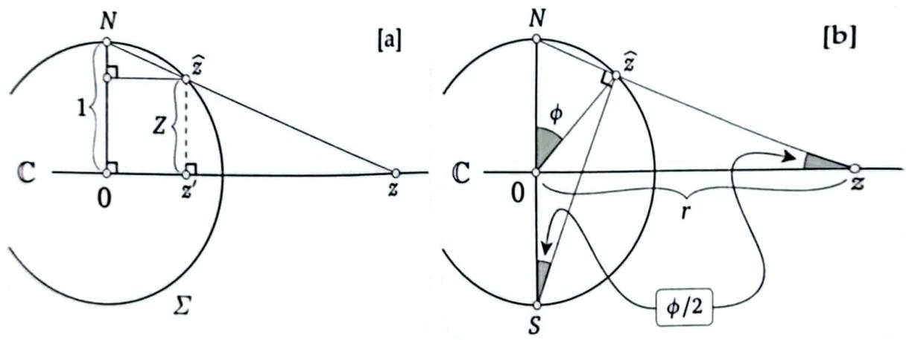  
图 4-12[a]由相似三角形可知  $|z| / |z^{\prime}| = 1 / (1 - Z)$  .[b]  $r = \cot (\phi /2)$

为方便使用，我们反过来求出用  $\pmb{z}$  的坐标表示的  $\hat{\pmb{z}}$  的坐标，因为[练习]

$$
|z|^{2} = \frac{1 + Z}{1 - Z},
$$

我们有[练习]

$$
\boxed{X + \mathrm{i}Y = \frac{2z}{1 + |z|^{2}} = \frac{2x + \mathrm{i}2y}{1 + x^{2} + y^{2}},\quad Z = \frac{|z|^{2} - 1}{|z|^{2} + 1}.} \tag{4.25}
$$

用三维坐标  $(X，Y，Z)$  表示球面  $\Sigma$  上的点常常是很有用的，但肯定是不自然的，因为球面的内蕴几何是二维的。使用更自然的(二维)球面极坐标  $(\phi ，\theta)$ ，会得到一个特别整齐的球极平面投影公式。

回忆一下，我们知道  $\theta$  表示绕  $z$  轴旋转的角度，  $\theta = 0$  定义为过  $X$  轴正半轴的纵向半平面。因此，对于平面  $\mathbb{C}$  上的点  $z$ ，  $\theta$  就是正实轴到  $z$  的通常角度。如图 4-12b所示，  $\phi$  定义为球面  $\Sigma$  上从北极  $N$  到点  $\widehat{z}$  的圆心角。例如，赤道表示为  $\phi = (\pi /2)$ 。按照惯例，  $0\leqslant \phi \leqslant \pi$ 。

假设点  $\widehat{z}$  的的坐标为  $(\phi ，\theta)$ ，它的球极像为  $z$ ，显然有  $z = r\mathrm{e}^{\mathrm{i}\theta}$ ，于是我们只需求出  $r$  关于  $\phi$  的函数。从图 4-12b可知，三角形  $N\widehat{z} S$  和  $N\mathrm{D}z$  相似[练习]，又因为  $\angle N S\widehat{z} = (\phi /2)$ ，所以  $r = \cot (\phi /2)$  [练习]。由此得到第二个球极平面投影公式:

$$
z = \cot (\phi /2)\mathrm{e}^{\mathrm{i}\theta}. \tag{4.26}
$$

罗杰·彭罗斯爵士提出过球极平面投影的一个漂亮的不同解释，我们会在第108页习题33里介绍怎么用这个公式建立彭罗斯的新解释。

为了说明这个公式的一个应用，我们简单讨论一下表示对径点的复数之间的关系。回忆一下，一对对径点就是球的直径的两个端点。例如，南极和北极互为对径点。我们要证明

如果  $\widehat{p}$  和  $\widehat{q}$  是球面  $\Sigma$  上的一对对径点，则它们的球极像  $p$  和  $q$  有如下关系:

$$
q = -(1 / \overline{{p}}).
$$

注意到  $p$  和  $q$  实际上是对称的(这是显然的)，我们有  $p = - (1 / \overline{{q}})$ 。现在证明式(4.27):如果  $\widehat{p}$  的坐标是  $(\phi ，\theta)$ ，则  $\widehat{q}$  的坐标是  $(\pi - \phi ，\pi +\theta)$ 。于是，

$$
q = \cot \left[\frac{\pi}{2} -\frac{\phi}{2}\right]\mathrm{e}^{(\pi +\theta)} = -\frac{1}{\cot(\phi / 2)}\mathrm{e}^{\mathrm{i}\theta} = -\frac{1}{\cot(\phi / 2)\mathrm{e}^{-\mathrm{i}\theta}} = -\frac{1}{\overline{{p}}}.
$$

第96页习题7是式(4.27)的初等几何证明。

# 4.9 球极平面投影的保圆性

本节致力于证明一个美丽、令人惊讶且至关重要的事实:

球极平面投影是保圆的! (4.28)

我们已经知道，每一个共形映射都将无穷小圆周映射为无穷小圆周。球极平面投影不仅如此，还将球面上任意大小、任意位置的有限圆周映射为平面上的正圆周，尽管球面上的圆心不被映射为平面上的圆心。我们指出，当球面上的圆周靠近北极  $N$  时，它的像特别大;如果圆周经过  $N$ ，它的像就会变成图 4-8所示的直线。

《复分析》3.4.2节最后给出了命题(4.28)漂亮、完全概念化的几何解释，在此代之以计算性的处理。

单位球面  $\Sigma$  上的每一个圆周都是  $\Sigma$  与一个平面的交线，这个平面到球心  $O$  的距离小于1:

$$
l X + m Y + n Z = k, \qquad \text{其中} l^{2} + m^{2} + n^{2} \geqslant k^{2}.
$$

把式(4.25)代入这个平面方程，得到这个平面与球面  $\Sigma$  的交线在平面  $\mathbb{C}$  上的球极平面投影曲线，其方程为[练习]

$$
2l x + 2m y + n(x^{2} + y^{2} - 1) = k(x^{2} + y^{2} + 1).
$$

如果  $k = n$ ，则这个圆周在球面  $\Sigma$  上经过北极  $N$ ，它的像是一条直线(当然如此!)，其方程为  $l x + m y = n$  [练习]。如果  $k \neq n$ ，配方，将方程写为[练习]

$$
\left[x - \frac{l}{k - n}\right]^{2} + \left[y - \frac{m}{k - n}\right]^{2} = \frac{l^{2} + m^{2} + n^{2} - k^{2}}{(k - n)^{2}}.
$$

这是一个圆，其中

$$
\mathbb{R} \cdot \mathcal{L} = \left(\frac{l}{k - n}, \frac{m}{k - n}\right), \quad \text{半径} = \frac{\sqrt{l^{2} + m^{2} + n^{2} - k^{2}}}{|k - n|}.
$$

(评论:这是一个非常好的例子，说明计算极具魅力，但也很有腐蚀能力。我们调用"魔鬼机器"(见序幕)在短短几行中完成工作，证明了结果。但我们站在这里，完全不知道为什么结果是真的!)

有了保圆性，借助图1- 5容易证明:球面上的测地线(即大圆)在地图上表现为圆周，它与赤道相交于一条直径的两个端点。

# 第5章 伪球面和双曲平面

# 5.1 贝尔特拉米的洞察

在1830年左右，随着罗巴切夫斯基和波尔约发现双曲几何，对平行线的长期研究达到高潮，几乎与此同时，随着高斯在1827年发现微分与几何的联系，一条完全不同的平行线——对微分几何的研究也达到高潮，就像球面上最初平行的线最终会相交一样，这两条思想的平行线也会以强有力而富有成效的方式相交.

1868年，意大利几何学家欧金尼奥·贝尔特拉米（见图5- 1）认识到，来自看似不相关思想领域的两个结果之间可能存在联系，一方面，他知道兰伯特的结果(1.8)——后来被高斯、罗巴切夫斯基和波尔约重新发现——即在双曲几何中，一个三角形的角盈是一个负常数与其面积的乘积，另一方面，他也知道局部高斯- 博内定理

贝尔特拉米有一个深刻的认识：如果能找到一个常负曲率  $\mathcal{K} = - (1 / R^{2})$  的曲面，那么通过式（2.6)，在这个曲面上构作的测地线三角形都会自动服从双曲几何的中心定律：

$$
\mathcal{E}(\Delta) = -\frac{1}{R^{2}}\mathcal{A}(\Delta).
$$

  
图5-1 欧金尼奥·贝尔特拉米（1835—1900）

当时，罗巴切夫斯基和波尔约发现的双曲几何已经在不明不白之中沉寂了近

40年，虽然因其匪夷所思被一些人诋毁，但还是被大多数人忽视了，现在，贝尔特拉米终于有了一个想法，可以把它建立在一个可靠而直观的基础上，也许双曲几何仅仅是常负曲率曲面的内蕴几何！一场长达2000多年的斗争就此走向尾声.

# 5.2 曳物线和伪球面

贝尔特拉米已经知道，图2- 6所示的伪球面确实是具有常负曲率  $\kappa = - (1 / R^{2})$  的曲面，其中  $R$  为底圆半径。(我们将在本节中证明这个事实。)更具体地说，他认识到这个曲面的局部几何服从罗巴切夫斯基和波尔约的抽象非欧几何定律。这种抽象的双曲几何学被理解为发生在一个无限的双曲平面上，这个平面与欧几里得平面几乎一模一样，服从欧几里得几何的前四个公设，但是平行线服从双曲公设(1.1)，而不是欧几里得几何的平行公设。

尽管伪球面的常负曲率可以确保它忠实地体现这个公设的局部结果，但是伪球面仍然不会成为整个双曲平面的模型。这是因为，它在两个方面与是欧几里得平面不同:(1)伪球面类似于一个圆柱面，而不是平面;(2)伪球面上的一条线段不能沿两个方向无限延长，它会撞到边缘。(正如我们之前提到的，希尔伯特在1901年发现，这样的边缘是所有常负曲率曲面的基本特征——这不是内蕴的，而是试图迫使这样的曲面适应普通欧几里得三维空间造成。)

贝尔特拉米认识到了这两个障碍，下一节将说明，他如何通过构作一个伪球面的共形映射，一下子就克服了这两个障碍。现在还是先考虑如何构作伪球面。

试试下面的实验。拿一个小而重的物体(例如镇纸)，在上面系一根细绳。现在把物体放在桌面上，并让细绳与桌面边缘垂直，然后沿着桌面边缘移动细绳的自由端来拖动它。你会看到重物沿着图5- 2所示的曲线移动， $Y$  轴代表桌面边缘。这

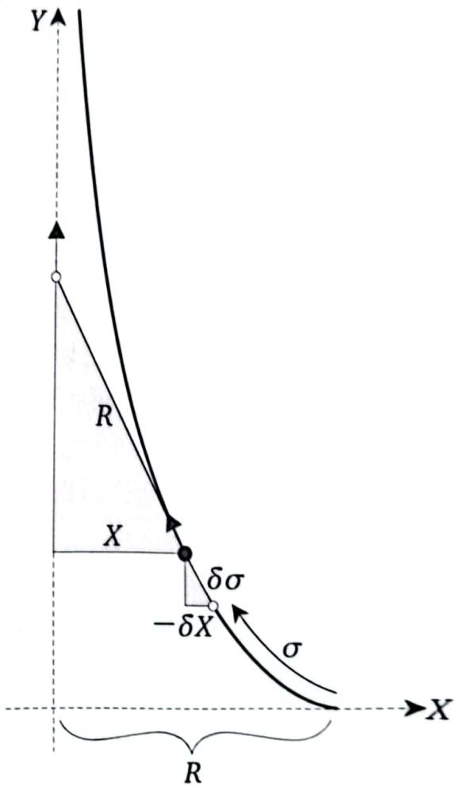  
图5-2 曳物线.把一个物体系在一根长为 $R$  的细绳上，沿  $X$  轴平放(细绳的自由端位于原点)。当细绳的自由端沿  $Y$  轴移动时，物体被拖着沿图示曲线运动，这条曲线称为曳物线

条曲线称为曳物线， $Y$  轴(曲线渐近地接近它)称为曳物线的轴。牛顿在1676年首先研究了曳物线。

如果细绳的长度为  $R$ ，那么轨迹线具有如下几何性质:从一个切点到相应切线与  $Y$  轴交点的长度为常数  $R$ 。牛顿认为这是与曳物线的定义等价的性质。

回到图5- 2，设  $\sigma$  为曳物线的弧长，  $\sigma = 0$  对应于所拖动物体的起始位置  $X = R$  ，当物体将要通过  $(X，Y)$  时，令  $\delta X$  表示当物体沿着曳物线移动一段距离  $\delta \sigma$  时  $X$  发生的微小变化，从图5- 2中两个三角形的最终相似性，可以推出

$$
\frac{-\mathrm{d}X}{\mathrm{d}\sigma} = \frac{X}{R}.
$$

因此

$$
X = R\mathrm{e}^{-\sigma /R}. \tag{5.1}
$$

现在让曳物线绕其轴旋转一周，生成图2- 6所示的曲面，这就是半径为  $R$  的伪球面，(图5- 3展示了作者自己制作的伪球面.)1839年，高斯的学生明金就知道这个曲面具有常曲率，该发现成为双曲几何受到关注的催化剂，值得注意的是，早在此约一个半世纪前(1693年)，克里斯蒂安·惠更斯就研究过这个曲面

为了证明伪球面的曲率不变性，先求其度量公式，为此要建立一个好用的坐标系.我们着手在伪球面上建立一个非常自然的正交坐标系，看看图5- 4a(请先忽略图5- 4b)要建立坐标系，对于曲面上任意指定的一点，我们要回答两个问题:

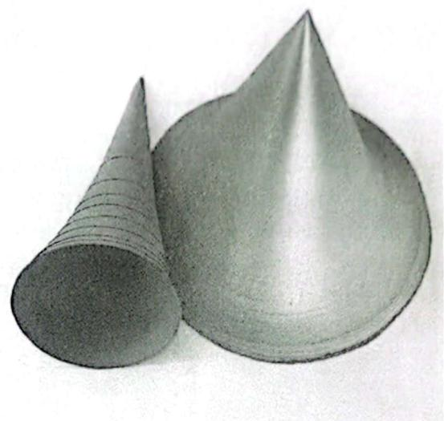  
图5-3作者自己制作的伪球面，由锥面组成，而锥面由半径为  $R$  的圆盘做成．为了方便看清其结构，将上半部分取下来了

(i)这个点在哪一条曳物线母线上?(ii)这

个点在这条母线的什么地方?我们指定  $x$  为曳物线绕其轴的旋转角，这就回答问题(i);指定  $\sigma$  为从曳物线底部到这一点的弧长，这就回答了问题(ii).

曲线  $x =$  常数是伪球面的曳物线母线(它们显然都是测地线)，曲线  $\sigma =$  常数是伪球面的横截圆周(它们显然不是测地线)这个横截圆周的半径是图5- 2中的  $X$  坐标，所以，由式(5.1)有

伪球面上经过点  $(x，\sigma)$  的  $\sigma =$  常数的横截圆周的半径为  $X = R\mathrm{e}^{- \sigma /R}$

如图5- 4a所示，增量  $\mathrm{d}x$  使得点  $(x，\sigma)$  走过的弧长为  $X\mathrm{d}x$  ，于是，度量公式

为

$$
\mathrm{d}\hat{s}^{2} = X^{2}\mathrm{d}x^{2} + \mathrm{d}\sigma^{2} = \left(R\mathrm{e}^{-\sigma /R}\right)^{2}\mathrm{d}x^{2} + \mathrm{d}\sigma^{2}. \tag{5.2}
$$

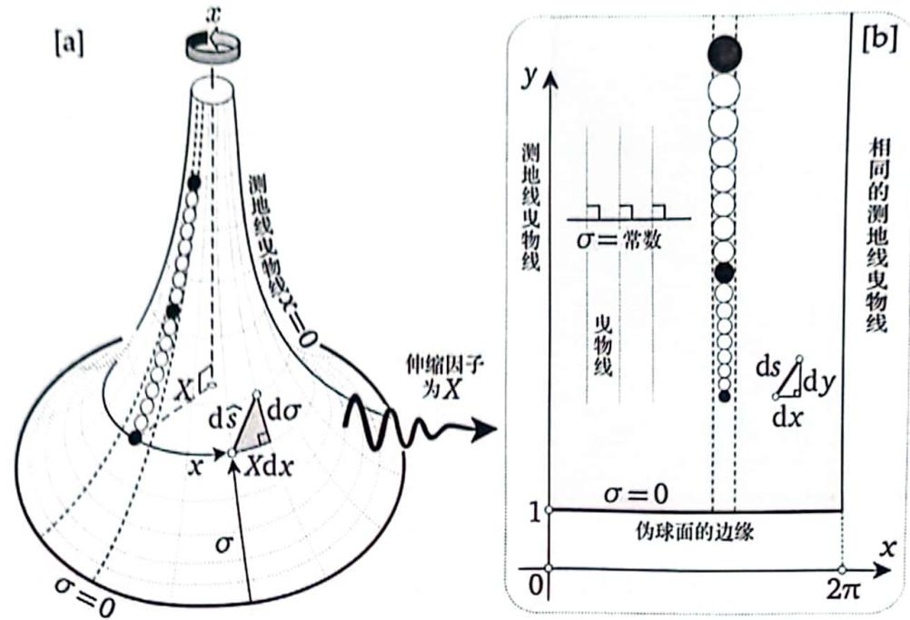  
图5-4 伪球面的共形地图. 首先， 选择绕轴旋转的角度为  $x$  坐标. 其次， 由于图示的无限小三角形的相似性， 共形性决定了  $y$  坐标服从  $\mathrm{d}y / \mathrm{d}\sigma = 1 / X$

最后， 将式 (5.2) 代入曲率公式 (4.10)， 得到

$$
\mathcal{K} = -\frac{1}{R\mathrm{e}^{-\sigma / R}}\partial_{\sigma}\left[\frac{\partial_{\tau}(R\mathrm{e}^{-\sigma / R})}{1}\right] = -\frac{1}{R^{2}},
$$

从而证实了以下关于双曲几何的关键事实， 这就是贝尔特拉米需要解释的:

伪球面具有常负曲率  $\mathcal{K} = - (1 / R^{2})$ ， 其中  $R$  是底圆半径. (5.3)

这个命题具有重要的数学意义和历史意义， 在本书中我们会尽可能直接地给出它的几何解释. 事实上， 后面会给出这个命题的两个几何证明: 在第三幕用外在几何证明， 在第四幕用内蕴几何证明.

在继续讨论之前， 我们建议你自己做一个伪球面! 除此之外， 我们实在想不出更好的方法来建立对伪球面的几何感觉. 为理解这个结构背后的想法， 可以想象旋转图5- 2来构作伪球面. 在这个过程中， 无论拖拽物体的位置在哪里， 因为拖动物体的细绳长为  $R$ ， 下端与曳物线相切， 上端在  $Y$  轴上， 旋转的细绳总是生成固定母线长度  $R$  的 (与伪球面相切的) 圆锥面.

准备一摞纸， 尽可能多 (但要剪得动)， 沿三条边钉在一起. 拿一个可以放在纸内的最大圆形碗碟， 在纸上描出它的边缘， 沿着这个圆切出相同的圆盘. 重复这个步骤， 直到你拥有至少20个圆盘——越多越好! 在第一个圆盘上剪一个小楔口， 把边缘粘到一起， 形成一个很浅的圆锥面. 取出下一个圆盘， 剪出稍微大

一点儿的楔口，把边缘粘在一起，做成一个稍微高一点儿的圆锥面，但仍具有相同的母线长度。把这个新的圆锥面放在之前的圆锥面上，然后重复、再重复……你就可以看到自己亲手做的伪球面了!

# 5.3 伪球面的共形地图

为了创建类似于欧几里得平面的无限双曲平面地图，首先在复平面  $\mathbb{C}$  上构作伪球面的共形地图。在地图上选择角  $x$  作为横轴，见图5- 4b。于是伪球面的见物线母线就是纵轴。伪球面上坐标为  $(x， \sigma)$  的点在地图上表示为直角坐标为  $(x， y)$  的点，我们把它看作复数  $z = x + \mathrm{i}y$ 。

如果对地图没有特别的要求，可以简单地选择  $y = y(x， \sigma)$  为  $x$  和  $\sigma$  的任意函数。但现在我们要求地图必须是共形的，即必须将伪球面上的无限小三角形映射为地图上的相似无限小三角形，更一般地，必须将伪球面上的任何小图形映射为地图上看起来同样的图形(仅大小不同)。在决定绘制这样一张共形地图之后，我们就不能随意选择  $y$  坐标了。为什么呢?首先，由  $x =$  常数表示的见物线母线正交于由  $\sigma =$  常数表示的横截圆周，所以它们在共形地图中的像也是正交的。因此， $\sigma =$  常数的像一定是地图上的水平直线  $y =$  常数。由此我们推断， $y = y(\sigma)$  是只与变量  $\sigma$  有关的函数。

其次，考虑在伪球面的横截圆周  $\sigma =$  常数(半径为  $X$  )上连接点  $(x， \sigma)$  和  $(x + \mathrm{d}x， \sigma)$  的弧。如图5- 4所示，根据  $x$  的定义，这段弧对应的圆心角为  $\mathrm{d}x$ ，所以它在伪球面上的弧长为  $X \mathrm{d}x$ 。这两个点在地图上的像有相同的高度，它们之间的距离为  $\mathrm{d}x$ 。因此，伪球面上的这段弧被映射为地图上的直线段，伸缩因子为  $X$ 。

因为地图是共形的，所以从点  $(x， \sigma)$  出发，沿任意方向的无穷小线段都具有相同的伸缩因子  $(1 / X) = (1 / R) \mathrm{e}^{\sigma /R}$ 。换句话说，度量公式为

$$
\mathrm{d}\widehat{s} = X \mathrm{d}s.
$$

最后，考虑图5- 4a中伪球面最上面的黑色圆盘。设想这是一个无穷小圆盘，例如它的直径为  $\epsilon$ 。在地图上，它的像是另一个圆盘，其直径为  $(\epsilon /X)$ ，这个像的直径可以更生动地解释为:观察者站在伪球面的轴上，并且与原像圆盘保持在同一高度，看向原像圆盘的视角。假设我们将伪球面上的圆盘向下移动，每次移动距离  $\epsilon$ ，直至到达伪球面的边缘。图5- 4a展示了由此产生圆盘链，它们彼此相切，

大小相同。当圆盘沿伪球面向下移动时，它距离轴越来越远，从轴上相同的高度来观察它，视角会越来越小。因此，在地图上的像圆盘似乎会随着向下移动而逐渐缩小。在图5- 4a中，伪球面上三个相距  $8\epsilon$  的黑色圆盘是大小相同的，但是它们在图5- 4b所示地图中的像圆盘就大小不同了。

对伪球面的地图有了一定的了解之后，我们实际计算一下伪球面上的点  $(x， \sigma)$  在地图上对应的  $y$  坐标。根据以上观察(或者直接根据图5- 4中三角形是相似的这一要求)，我们有

$$
\frac{\mathrm{d}y}{\mathrm{d}\sigma} = \frac{1}{X} = \frac{1}{R}\mathrm{e}^{\sigma /R} \quad \Longrightarrow \quad y = \mathrm{e}^{\sigma /R} + C,
$$

其中  $c$  为常数.  $c$  的标准选择是0，从而

$$
y = \mathrm{e}^{\sigma /R} = (R / X). \tag{5.4}
$$

于是，整个伪球面在地图上的像完全在直线  $y = 1$  (这是伪球面边缘的像)的上方，用地图坐标表示的度量公式为

$$
\mathrm{d}\widehat{s} = \frac{R\mathrm{d}s}{y} = \frac{R\sqrt{\mathrm{d}x^{2} + \mathrm{d}y^{2}}}{y}. \tag{5.5}
$$

为了方便后续使用，注意地图中一个边长分别为  $\mathrm{d}x$  和  $\mathrm{d}y$  的无限小矩形在伪球面上的原像是一个与之相似、边长分别为  $(R\mathrm{d}x / y)$  和  $(R\mathrm{d}y / y)$  的无限小矩形。因此，伪球面上的真实面积  $\mathrm{d}A$  与地图上看到的面积  $\mathrm{d}x\mathrm{d}y$  有如下关系:

$$
\mathrm{d}A = \frac{R^{2}\mathrm{d}x\mathrm{d}y}{y^{2}}. \tag{5.6}
$$

[当然，这个公式是式(4.12)在  $A = B = (R / Y)$  时的特例。]

# 5.4 贝尔特拉米-庞加莱半平面

我们现在有一个类圆柱形、有边缘的伪球面共形地图: $\{(x， y): 0 \leqslant x < 2\pi ， y \geqslant 1\}$ 。为了创造无限双曲平面地图，贝尔特拉米知道他必须去掉上面这两个形容词。注意，选择不同的  $R$ ，虽然对几何参数的定量是不同的，但对几何性质的定性都是一样的，所以做如下特定选择不会有坏处:

几乎所有的双曲几何书籍和论文，都做出了特定选择  $R = 1$ ，使得  $\kappa = - 1$ 。在本节中，我们也采用这种传统选择。

如果有人希望从这个特例回到一般情形，只需要在特例(  $R = 1$  )的公式中插入一个合适的  $R$  的幂.例如，面积公式要乘以  $R^{2}$

为了去掉"类圆柱形的"这个形容词，想象一下，用一个(半径为1的)标准圆柱形油漆滚筒刷墙，在滚筒滚动一圈之后，你在墙上刷了一个宽度为  $2\pi$  的带形区域，滚筒表面的每一个点都被映射到墙上这个带形区域内的一个特定点，要粉刷整面墙，只需继续滚动这个油漆滚筒即可!现在，假设我们的油漆滚筒采用伪球面的形式，为了让它适合平坦的墙面，必须首先利用式(5.5)将伪球面拉伸成圆柱面，然后就可以像之前一样，继续滚动油漆滚筒(假设水平滚动)如果一个质点沿着墙面上的一条水平线移动，那么伪球面上对应的质点就会绕伪球面上的水平圆周(即  $\sigma =$  带数)转一圈又一圈，这样，"类圆柱形的"这个形容词就被成功移除了.现在我们有伪球面地图  $\{(x，y)\colon - \infty < x< \infty ，y\geqslant 1\}$

下一个问题，处理伪球面的"边缘"，同样可以用共形地图轻易解决，图5- 5的左边是伪球面上的一个质点沿曳物线母线向下运动的图像，当然，质点的路线在伪球面边缘(  $\sigma = 0$  )上的某一点  $\widehat{p}$  处被迫中断，  $\widehat{p}$  对应着直线  $y = 1$  上的点  $p$  但在地图上，点  $p$  和其他点一样，质点可以毫无障碍地向下移动到  $y = 0$  的点  $q$  处，这时，伪球面上的真实距离ds仍由标准化双曲度量给出:

$$
\boxed{\begin{array}{c}{\boxed{\begin{array}{c}{\boxed{\begin{array}{c}{\boxed{\begin{array}{c}{\boxed{\begin{array}{c}{\boxed{\begin{array}{c}{\boxed{\begin{array}{c}{\boxed{\begin{array}{c}{\boxed{\begin{array}{c}{\boxed{\begin{array}{c}{\boxed{\begin{array}{c}{\boxed{\begin{array}{c}{c}}}}}}}}}}}}}}}}}}}}}}}}}}}}}}}}}}}}}}}}}}}}}}}}}}}}}}}}}}}}}}}}}}}}}}}}}}}}}}}}}}}}}}}}}}}}}}}}}}}}}}}}}}}}}}}}}}}}}}}}}}}}}}}}}}}}}}}}}}}}}}}}}}}}}}}}}}}}}}}}}}}}}}}}}}}}}}}}}}}}}}}}}}}}}}}}}}}}}}}}}}}}}}}}}}}}}}}}}}}}}}}}}}}}}}}}}}}}}}}}}}}}}}}}}}}}}}}}}}}}}}}}}}}}}}}}}}}}}}}}}}}}}}}}}}}}}}}}}}}}}}}}}}}}}}}}}}}}}}}}}}}}}}}}}}}}}}}}}}}}}}}}}}}}}}}}}}}}}}}}}}}}}}}}}}}}}}}}}}}}}}}}}}}}}}}}}}}}}}}}} =}}}}}}}}}}}}}}}}}}}}}}}}}}}}}}}}}}}}}}}}}}}}}}}}}}}}}}}}}}}}}}}}}}}}}}}}}}}}}}}}}}}}}}}}}}}}}}}}}}}}}}}}}}}}}}}}}}}}}}}}}}}}}}}}}}}}}}}}}}}}}}}}}}}}}}}}}}}}}}}}}}}}}}}}}}}}}}}}}}}}}}}}}}}}}}}}}}}}}}}\}}}}}}}}}}}}}}}}}}}}}}}}}}}}}}}}}}}}}}}}}}}}}}}}}}}}}}}}}}}}}}}}}}}}}}}}}}}}}}}}}}}}}}}}}}}}}}}}}}}}}}}}}}}}}}}}}}}}}}}}}}}}}}}}}}}}}}}}}}}}}}}}}}}}}}}}}}}}}}}}}}}}}}}}}}}}}}}}}}}}}}}}}}}}}}}}}}}}}}}{}}}}}}}}}}}}}}}}}}}}}}}}}}}}}}}}}}}}}}}}}}}}}}}}}}}}}}}}}}}}}}}}}}}}}}}}}}}}}}}}}}}}}}}}}}}}}}}}}}}}}}}}}}}}}}}}}}}}}}}}}}}}}}}}}}}}}}}}}}}}}}}}}}}}}}}}}}}}}}}}}}}}}}}}}}}}}}}}}}}}}}}}}}}}}}}}}}}}}}})}}}}}}}}}}}}}}}}}}}}}}}}}}}}}}}}}}}}}}}}}}}}}}}}}}}}}}}}}}}}}}}}}}}}}}}}}}}}}}}}}}}}}}}}}}}}}}}}}}}}}}}}}}}}}}}}}}}}}}}}}}}}}}}}}}}}}}}}}}}}}}}}}}}}}}}}}}}}}}}}}}}}}}}}}}}}}}}}}}}}}}}}}}}}}}}}}}}}}}
$$

为什么停在点  $q$  呢?答案是，质点永远不会到达那么远，因为在伪球面上，  $p$  和  $q$  距离无限远!考虑图5- 5左边所示，在直线  $y = 2$  上直径为ds的小圆盘  $D$  它在伪球面上的真实大小是  $\mathrm{d}\widehat{s} = \mathrm{d}s / y$  ，最终等于在直线  $y = 0$  上  $h$  处观察它的视角[练习].现在想象  $D$  以稳定的速度沿伪球面向下移动，它在地图中的表观大小肯定会收缩，使得在点  $h$  处观察它的视角不变，在地图中，它到达  $y = 1$ $y = 1 / 2$  ，……，一直向下移动!

假设圆盘  $D$  从  $y = 2$  走到  $y = 1$  用时为一个单位，则在下一个单位时间到达  $y = 1 / 2$  ，然后到达  $y = 1 / 4$  ，……，这些点间隔相同的双曲距离:

$$
\ln 2 = \int_{1}^{2}{\frac{\mathrm{d}y}{y}} = \int_{1 / 2}^{1}{\frac{\mathrm{d}y}{y}} = \int_{1 / 4}^{1 / 2}{\frac{\mathrm{d}y}{y}} = \dots .
$$

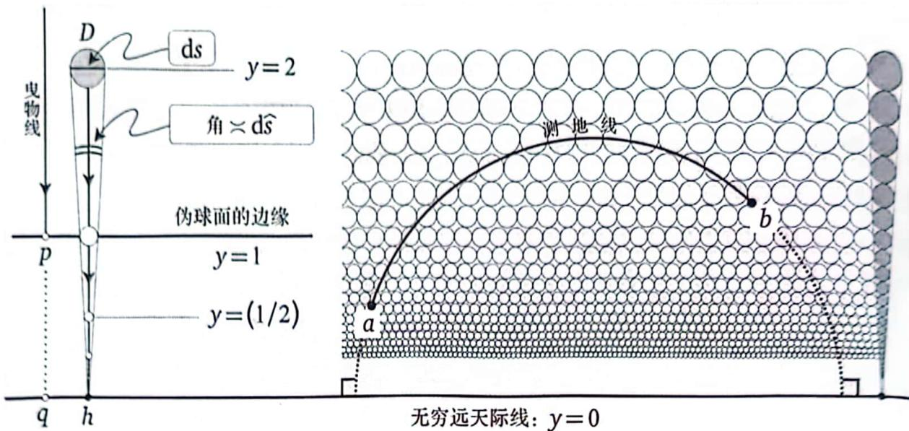  
图5-5 左边顶部圆盘  $D$  的双曲直径是站在无穷远天际线  $y = 0$  上  $h$  处观察  $D$  的（欧几里得）视角。当  $D$  向下移动时，它在（右边）地图上的像就会收缩。右边的圆盘是伪球面上同样大小圆盘的像，伪球面上的测地线是在地图上走过最少圆盘的路径  $ab$

因此，从地图上看运动变慢了，圆盘  $D$  在每一个单位时间内只走过了它到  $y = 0$  的一半距离。这样， $D$  永远到不了  $y = 0$ 。(这种现象就是"芝诺悖论"，又称"芝诺的报复"!)

最终，我们拥有如下具体模型

双曲平面  $\mathbb{H}^{2}$  :度量公式为  $\mathrm{d}\widehat{s} = \frac{\mathrm{d}s}{y}$  的整个阴影半平面  $y > 0$  (5.8)

实轴  $y = 0$  上的每一个点到双曲平面上每一个普通点的距离都是无限远的，严格来说，直线  $y = 0$  不是双曲平面的一部分。直线  $y = 0$  上的点称为理想点(或无穷远点)。整条直线  $y = 0$  称为天际线(或视界)。

尽管贝尔特拉米在1868年(比庞加莱早14年)就发现了这张地图，但它现在被普遍称为庞加莱半平面。然而，为了恢复历史平衡，我们固执地把这张地图称为贝尔特拉米- 庞加莱半平面。

我们来更生动地解释这张地图的度量公式。图5- 5最右边是一串纵向排列的圆盘，它们用双曲度量的直径是相等的，都等于  $\epsilon$  (即图5- 4a中伪球面上的那一串圆盘)。在它的左边，我们用这样的圆盘填满了双曲平面的其余部分，它们有相等的双曲直径  $\epsilon$ 。因此，任何曲线的双曲长度，即伪球面上曲线的真实长度，最终等于它所截圆盘的数量乘以  $\epsilon$ 。这就清楚地表明，从  $a$  到  $b$  的最短路径是截到

最少圆盘的路径， 因此其近似的形状如图 5- 5 所示.

如果你已经按照我们之前的建议制作了自己的伪球面模型， 也可以通过在相似高度的两点之间拉直一条细绳来观察测地线的形状. 在不能拉直细绳紧贴模型表面的区域 (例如沿着曳物线母线)， 你可以利用第 15 页方法 (1.7) 介绍的胶带法来试试， 它在任何地方都有效.

我们的下一个任务是确认图 5- 5 所示的有趣事实: 几乎每一条测地线在地图上的形状都是一个与天际线成直角的完美半圆周. 唯一不是这种形状的测地线是曳物线母线， 它们的形状是纵向半直线， 也可以看作半圆的半径趋向无穷大的极限情况.

# 5.5 利用光学来求测地线

本节将利用物理学观点 (特别是光学观点) 来解释双曲几何模型中的测地线为什么在贝尔特拉米- 庞加莱半平面上是半圆形的. 我们的灵感来自于 1662 年发现的费马原理:

光沿用时最少的路径从一个地方传播到另一个地方.

我们将从牛顿式推理开始对物理学进行短暂的探索， 看看如何通过对费马原理的几何分析来解释当光线从空气进入水中时为什么会突然弯折 (称为折射). 这解释了为什么 [练习] 当你把勺子放入一杯茶时它看起来是弯折的.

在图 5- 6 中， 一束光线从  $a$  点出发， 以与铅垂线夹角为  $\theta_{1}$  的方向， 在空气中以速度  $\nu_{1}$  传播， 并到达水面上的  $p$  点. 然后， 光线被折射成与铅垂线夹角为  $\theta_{2}$  的方向在水中继续传播， 速度降低为  $\nu_{2}$ ， 最后到达水中的  $b$  点. 早在公元 130 年， 托勒密就做过这样的实验， 并且编制了一张相当精确的角度  $\theta_{1}$  和  $\theta_{2}$  对照表. 但

是， 托勒密没有弄清楚这两个角度之间的精确数学关系， 在接下来的几个世纪里，科学家们也一直没弄清楚这个关系.

  
图5-6 斯涅尔定律:为了使光在相邻的两条路线上传播所用的时间相等，在空气里因路程加长而多用的时间必须与在水里减速所增加的时间相等，所以有  $\sin \theta_{1} / \nu_{1} = \sin \theta_{2} / \nu_{2}$

最后，荷兰数学家维勒布罗德·斯涅尔(1580—1626)在1621年发现了正确的规律，现在普遍称为斯涅尔定律:

这个  $n$  值(称为折射率)依赖于界面两边的物质，对于空气/水界面，  $n \approx 1.33$

为什么光线会在界面处发生弯折，至少在定性上利用费马原理可以说得清楚。如果光线沿直线从  $a$  走到  $b$ ，那么它就会浪费宝贵的时间在水中相对缓慢地传播，而不是在空气中快速传播。定量地说，当时间(关于位置  $p$ )的导数为零时，就会出现使传播时间最小化所需的弯折量。

从几何角度来看，如果  $p$  的位置使得光线传播耗时最小，那么，当  $p$  点发生无限小的位移  $\epsilon$  时，耗时(关于一阶的  $\epsilon$ )应该不会变化。但是，正如我们在图5- 6中看到的，这个位移导致光在空气中传播的路线增加了一段，增加的一段长度最

终等于  $\epsilon \sin \theta_{1}$ ， 因此多耗时  $(\epsilon \sin \theta_{1}) / \nu_{1}$  。此外， 光在水中传播的路线缩短了， 减少的耗时最终等于  $(\epsilon \sin \theta_{2}) / \nu_{2}$  。因为耗时的净变化为 0 ， 所以这两个单独的耗时变化必须相等。因此， 消除  $\epsilon$  后，

$$
\frac{\sin \theta_{1}}{\nu_{1}} = \frac{\sin \theta_{2}}{\nu_{2}}. \tag{5.11}
$$

这不仅证明了斯涅尔定律 (5.10)， 而且做出了一个物理预测， 这个预测在直接实验中得到了证实: 折射率是两种材料中的光速之比，  $n = (\nu_{1} / \nu_{2})$  。

如图 5- 7 所示， 假设水在一个玻璃杯的底部。光线从空气中出发， 穿过水层， 到达杯子底部的玻璃内， 会如何弯折呢? 假设光线在玻璃内的传播速度为  $\nu_{3}$ ， 就有同样的定律

$$
\frac{\sin \theta_{1}}{\nu_{1}} = \frac{\sin \theta_{2}}{\nu_{2}} = \frac{\sin \theta_{3}}{\nu_{3}}.
$$

更一般地， 如果我们有一个  $m$  层的复合材料， 水平铺设的每一层单质都很薄， 光在第  $i$  层单质的传播速度为  $\nu_{i}$ ， 则光在复合材料中的传播服从定律:

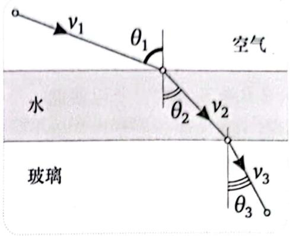  
图5-7 斯涅尔定律适用于多层材料

$$
\frac{\sin \theta_{i}}{\nu_{i}} = \text{常数} = k, \quad i = 1,2, \dots , m.
$$

更进一步， 想象光通过一块非均质材料， 其密度在每一个水平面  $y =$  常数上都是相同的， 并且随着  $y$  连续变化。在高度  $y$  处的光速为  $\nu (y)$ ， 在高度  $y$  处的光线入射角为  $\theta (y)$  (与界面法线的夹角)。那么， 广义斯涅尔定律是

$$
\frac{\sin \theta(y)}{\nu(y)} = k. \tag{5.12}
$$

你可能会说: 这些都很有趣， 但这和证明双曲平面中的测地线都是半圆周有什么关系?! 好吧， 现在回头再看看图 5- 5， 假设伪球面上的点  $\widehat{a}$  和  $\widehat{b}$  对应于双曲平面  $\mathbb{H}^{2}$  上的点  $a$  和  $b$  。想象一个质点沿着伪球面上的不同路径， 以恒定不变的速度 (比如 1) 从  $\widehat{a}$  运动到  $\widehat{b}$  。质点在伪球面上的这些运行路径在双曲平面上也有对应的从  $a$  到  $b$  的路径， 但质点的速度不均匀: 从图 5- 5 可以看到， 如果质点在伪球面上以恒定的速度向下移动， 双曲平面上对应像点的移动会减慢。

关键在于地图是共形的， 所以速度减慢只取决于质点所在的位置， 而与质点的运动方向无关。假设我们以单位速率从  $\widehat{a}$  点向四面八方发射出大量的质点， 在

无穷小时间  $\epsilon$  后， 这些质点在伪球面上会形成一个圆心为  $\hat{a}$  、半径为  $\epsilon$  的圆圈。由模型 (5.8) 可知， 这个圆圈在双曲平面上的像是一个圆心为  $a$  、半径为  $\epsilon y$  的圆圈， 其中  $y$  是的  $a$  高度。换句话说， 从点  $a$  射出的质点速度为  $\nu (y) = y$ : 离天际线越近， 质点速度越慢。

质点在伪球面上从  $\hat{a}$  到  $\hat{b}$  的任意路线上花费的时间当然与在双曲平面上从  $a$  到  $b$  的对应路线上花费的时间是相同的， 伪球面的测地路径是两点之间的最短路

线， 也是耗时最少的路线， 所以， 双曲平面上的测地线也是从  $a$  到  $b$  的最快路线: 双曲平面上沿测地线的运动当然服从费马原理， 所以双曲平面上测地线的形状由广义斯涅尔定律决定! 将  $\nu (y) = y$  代入式 (5.12)， 在图 5- 8 中答案就清晰可见了:

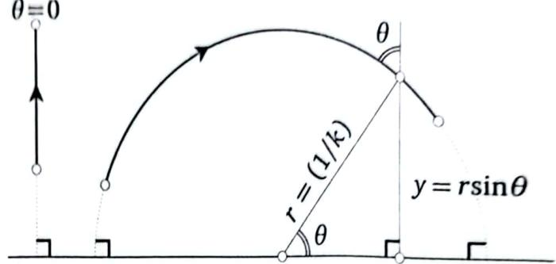  
天际线 图5-8双曲测地线一定服从广义斯涅尔定律  $(\sin \theta /y)$ $= k$  ，所以是半圆周和垂直于天际线的半直线

双曲平面  $\mathbb{H}^{2}$  (贝尔特拉米- 庞加莱半平面模型)上的测地线满足  $(\sin \theta /y) = k$  如果  $k\neq 0$  ，则测地线是圆心在天际线上、半径  $r = (1 / k)$  的半圆周.如果  $k = 0$  ，则测地线是纵向半直线  $\theta = 0$

(5.13)

在 11.7.5 节， 我们还要给出这个重要事实 (基于角动量) 的第二个物理解释。

# 5.6 平行角

现在我们回到起点， 看看双曲公设 (1.1)。在掌握了双曲平面上测地线的形状后， 从图 5- 9 可以清楚地看到: 在双曲平面上确实存在无穷多的直线 (以短划线表示)  $①$ ， 它们经过点  $p$ ， 而且不与直线  $L$  相交。我们称这样的直线超平行于  $L$ ， 这就直观地验证了双曲公设。

从图 5- 9 还可以看到， 在双曲平面上， 有且只有两条直线在双曲平面内没有与  $L$  相交， 而是在天际线上与  $L$  相交， 它们恰好是所有与  $L$  相交的直线和所有超平行线的分界线。这两条线称为  $L$  的渐近线  $②$ 。

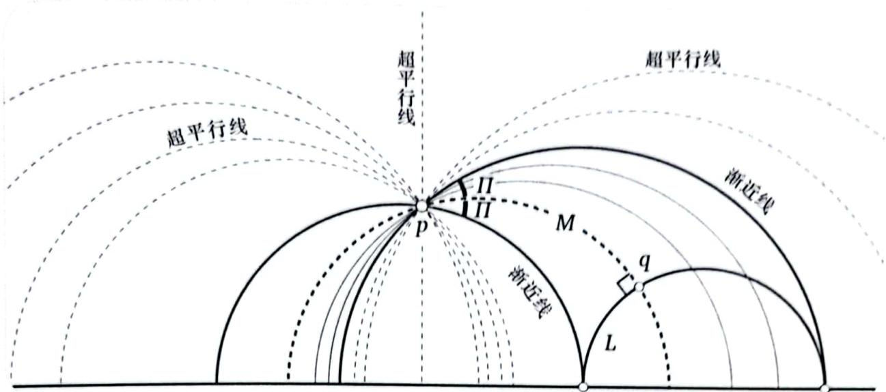  
图5-9 直观地验证双曲公设: 存在无限多的直线 (超平行线) (图中的短划线) 过点  $p$  与给定直线  $L$  不相交

从图5- 9还可以清楚地看到， 如同在欧几里得几何中一样， 只有一条经过点  $p$  的直线  $M$  (虚线) 与  $L$  垂直相交 (交点为  $q$ ). 有了垂线  $M$ ， 就可以按照通常的方式定义点  $p$  到直线  $L$  的距离， 即  $M$  上线段  $pq$  (双曲的， 如  $\mathrm{d}\widehat{s}$  ) 的长度  $D$ .

事实上， 如图5- 9所示， 过点  $p$  的两条渐近线有一个夹角，  $M$  就是这个夹角的平分线， 这在目前还不是很明显.  $M$  与任意一条渐近线的夹角称为平行角， 通常记为  $\pi$ . 当直线  $M$  绕点  $p$  旋转时， 它与  $L$  的交点会向天际线  $y = 0$  (即无穷远处) 移动，  $\pi$  能告诉你  $M$  旋转多远就可以不与  $L$  相交了.

罗巴切夫斯基和波尔约都发现， 角  $\pi$  与点  $p$  到直线  $L$  的双曲距离  $D$  之间存在重要的关系:

$$
\begin{array}{r}{\boxed{\phantom{\frac{1}{2}}\tan (\pi /2) = \mathsf{e}^{-D}.}} \end{array} \tag{5.14}
$$

上式称为波尔约- 罗巴切夫斯基公式.

因此， 如果  $p$  接近  $L$ ， 则  $\pi \approx (\pi /2)$ ， 类似于欧几里得几何的结果几乎也成立: 从点  $p$  出发的射线 (半直线) 大约有一半最终会与直线  $L$  相交. 当然， 在欧几里得几何里， 无论点  $p$  距离直线  $L$  多远， 从点  $p$  出发的射线都有一半会与直线  $L$  相交. 但是， 在双曲平面上就不一样了， 当点  $p$  逐渐远离直线  $L$  时， 从点  $p$  出发的射线与直线  $L$  相交的比例会减少到 0 ! 这个现象， 从图5- 9可定性地看出， 从式 (5.14) 可定量地看出.

必须认识到， 伪球面或真正双曲平面上的微观居民无法看出测地线之间有什

么差别——每一条直线(即测地线)都是一样的。因此，在内蕴几何里，地图上表现为纵向半直线的测地线与表现为半圆的测地线是完全不可区分的。

但是，半圆在天际线上有两个端点，纵向半直线在天际线上似乎只有一个端点，这是怎么回事呢?答案是，除了天际线上的这些点，在无穷远处还有一个点，所有的纵向半直线都在此处相交。由模型(5.8)可知，当我们沿着两条相邻的纵向半直线向上移动时，它们之间的距离随着  $1 / y$  趋于0，并且它们在无穷远处收敛到一个单点。这在伪球面上尤为明显。

在强调双曲平面上的两种直线在数学上相同之后，我们现在来个180度的大转弯，强调它们在心理上是不同的。也就是说，站在这个非欧几何的世界之外，通过我们的地图往里看，我们可能会发现，某些数学关系在纵向半直线的情况下更容易看清楚，因为这种情况比半圆周的情况更简单(但不太典型)。

使得这个想法真正有用的是双曲平面  $\mathbb{H}^{2}$  上刚体运动(例如，绕点  $p$  旋转)的存在性。这种保持距离不变的运动称为等距变换，它是下一章的主题。现在，注意到双曲平面也有等距变换，可以通过适当地旋转(刚性移动)双曲平面，使得其中的半圆形测地线变成纵向半直线形的测地线。

例如，回到图5- 9，我们可以将  $\mathbb{H}^{2}$  绕  $p$  旋转，直到  $L$  变成纵向半直线，成为图5- 10所示的情况，这种形式更简单。容易验证图5- 10中标记的角度[练习]，由此可以看出  $M$  是点  $p$  两条渐近线夹角的平分线。这意味着，在

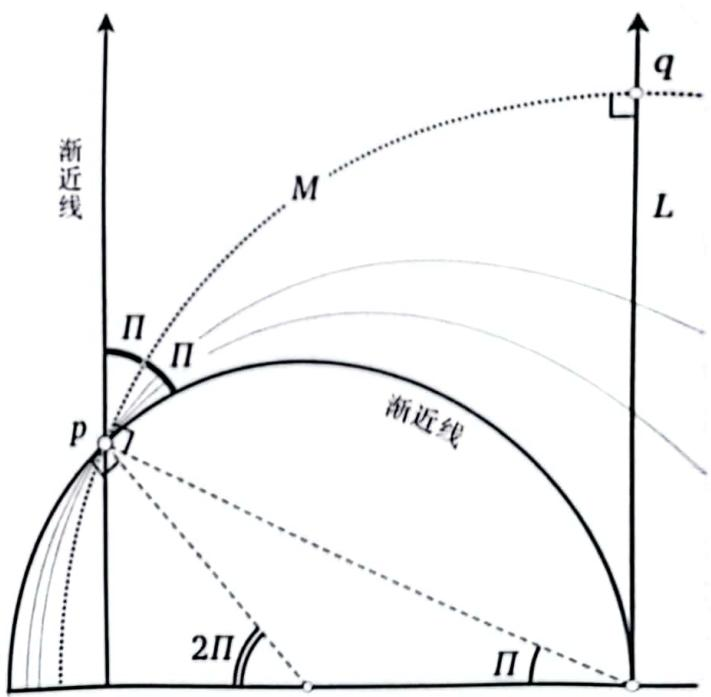  
图5-10与图5-9相同的几何，但双曲平面绕点  $p$  旋转直到  $L$  处于竖直方向。这张简化图可以用来推导波尔约-罗巴切夫斯基公式(5.14)

我们做旋转之前，当图5- 9中的  $L$  在一般位置时，  $M$  确实是角平分线。

同样，这幅新图上更简单的几何关系也使得我们更容易证实波尔约- 罗巴切夫斯基公式(5.14)的正确性，详情请参阅《复分析》6.3.6节。

# 5.7 贝尔特拉米-庞加莱圆盘

贝尔特拉米- 庞加莱上半平面及其度量公式  $\mathrm{d}\widehat{s} = \mathrm{d}s / y$  只是描述抽象双曲平面  $\mathbf{H}^{2}$  的一种方法，还有其他几种模型.虽然从定义上看，所有这些模型在内蕴几何上都是相同的，但它们在心理上并不相同:某一个特定的事实或公式可能很难在一个模型中看清楚，在另一个模型中却是显而易见的.因此，在试图把握双曲几何的奇迹时，善于在不同模型之间转换是一项很有用的技能.

我们只准备介绍一个特别有用的著名模型，这个模型是绘制在单元圆盘上的，见图5- 11. 像上半平面一样，这也是一个共形模型，其中的测地线也被表示成圆弧，与天际线相交成直角，但现在表示无限远天际线的是这个圆盘的边界(单位圆).如果  $r$  是一点到圆盘中心的距离，新的度量公式是(见第105页习题25)

$$
\mathrm{d}\widehat{s} = \frac{2}{1 - r^{2}}\mathrm{d}s. \tag{5.15}
$$

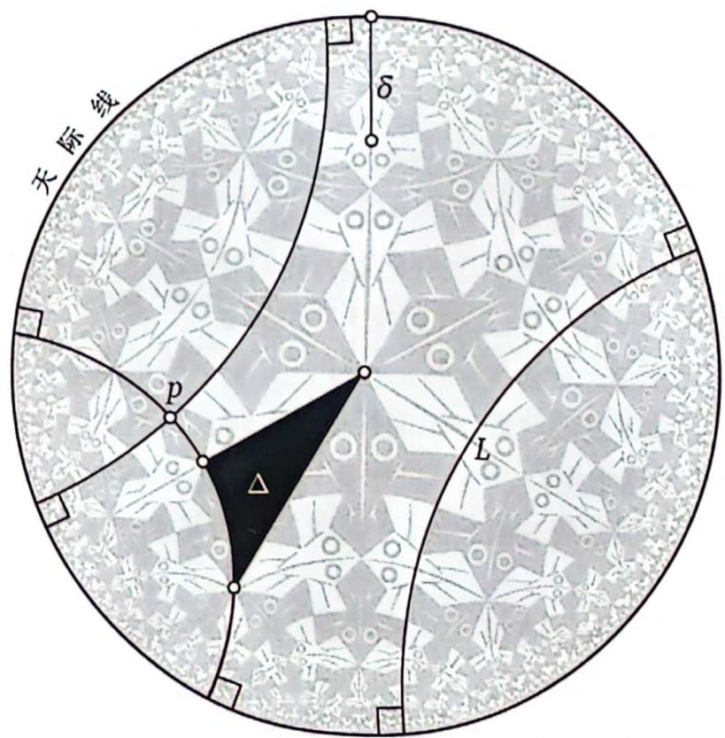  
图5-11贝尔特拉米-庞加莱圆盘模型的双曲平面.背景是埃舍尔的《圆极限I》加黑的是双曲线，它们是与无限远边界圆(天际线)正交的直径和圆弧.显然，它们满足双曲公设(1.1)且  $\mathcal{E}(\Delta)< 0$  ，版权信息:M.C.Escher's Circle Limit  $\circledcirc$  2020 The M.C.Escher Company-The Netherlands.All rights reserved.mcescher 网站

更详尽的内容请参阅《复分析》或 Stillwell (2010). 你可以借助共形曲率公式 (4.16) 证明 [练习] 这个曲而具有常负曲率  $\kappa = - 1$ ， 至少可以确认这就是双曲平面  $\mathbb{H}^{2}$ .

这个模型也是贝尔特拉米首次发现的， 与半平面模型一起发表在 1868 年的同一篇论文里， 见 Stillwell (1996). 14 年后， 庞加莱重新发现了这个模型， 使之被广泛称为"庞加莱圆盘". 与前面一样， 我们坚定不移地支持将这个模型同时归功于他们两位， 称之为贝尔特拉米- 庞加莱圆盘， 或者争议更少的共形圆盘模型.

1958 年， 英国著名几何学家 H. S. M. 考克斯特 (1907- 2003) 向荷兰艺术家 M. C. 埃舍尔 (1898- 1972) 介绍了  $\mathbb{H}^{2}$  的共形圆盘模型， 由此引发埃舍尔创作出了著名系列版画《圆极限》， 图 5- 11 就是其中第一张的复制品. 这里有意把全图印得颜色淡一些， 把双曲直线做了加黑突出处理. [这张图的想法直接来自 Penrose (2005， 图 2.12). ] 从中我们看到， 确实有无穷多条双曲直线通过点  $p$  与  $L$  不相交， 服从双曲公设 (1.1). 圆的直径也是双曲直线， 所以图 5- 11 的三角形  $\Delta$  是真正的双曲三角形. 注意， 明显可见 (而且容易证明)  $\mathcal{E}(\Delta) < 0$ ， 正如它应该的那样.

当你盯着图 5- 11 看的时候， 试着把自己想象成其中的一条鱼. 你的大小和形状与其他的鱼完全一样， 你可以永远沿着一条直线游泳， 不会看到周围环境或其他鱼的任何变化. 但从外面看地图， 距离的压缩会让你看起来像是在沿着一条圆形路径绕圈， 并且在前进的过程中不断缩小. 事实上， 如果  $\delta \equiv (1 - r)$  是图 5- 11 中所示鱼到天际线的欧几里得距离， 我们看一下靠近地图边缘的一点， 会发现式 (5.15) 意味着 [练习] (鱼的表观大小)  $\propto \delta$ .

在第 105 页习题 25 中你会看到， 实际上有一个简单的共形变换， 可以将这个新圆盘模型与之前讲过的共形半平面模型联系起来， 从而解释新圆盘模型的共形性. 利用计算机做这个变换， 可以将图 5- 11 变成图 5- 12， 后者不是埃舍尔本人的创作， 但他肯定会很欣赏这张图的. [此图经许可从 Stillwell (2005， 第 195 页) 复制而来.]

让我们停下来喘口气， 回顾一下我们已经走了多远吧. 我们在本书开始时讲的故事  ${ }^{2}$  已经有了一个圆满的结局， 算是结束了吧. 2000 多年来， 围绕平行公设的困惑和怀疑一直困扰着欧几里得几何学. 现在， 贝尔特拉米给出了对双曲几何学的具体解释， 作为一种合理的选择， 数学界持续了 2000 多年的压抑终于得以畅快宣泄. 这真是结束第二幕的好地方!

也可能不是……

  
图5-12 变换的埃舍尔《圆极限I》：（经由约翰·史迪威教授）从共形圆盘模型图5-11变换为共形半平面模型. 版权信息：M. C. Escher's Circle Limit I © 2020 The M. C. Escher Company-The Netherlands. All rights reserved. mcescher 网站

# 第6章 等距变换和复数

# 6.1 引言

伟大的数学思想不仅使得过去的谜团不再神秘，还会揭示新的谜团:甘尽苦来!我们现在就要看一看微分几何与数学其他领域以及物理学之间的新奇联系.

这些新奇联系中的第一个是三种常曲率几何(欧几里得几何、球面几何和双曲几何)和复数之间的联系.

我们曾要求你想象在复平面上绘制曲面的地图，然而，敏锐的读者会注意到到目前为止，我们很少使用复数的基本结构，这种情况马上就要改变了，但是，我们首先需要对等距映射的概念做一些更一般的考察.

等距映射一定保持每个角的大小不变，其中还保持角的方向(顺时针或逆时针)不变的映射称为正向的，使得角的方向反转的映射称为反向的，因此，正向的等距变换是一种非常特殊的共形映射，反向的等距变换是一种非常特殊的反共形映射，例如，在平面上，旋转是正向的等距变换，而关于一条直线的反射变换是反向的等距变换.

接下来我们观察到，关于复合运算，

给定曲面  $s$  上所有的等距变换组成的集合(包括正向等距变换和反向等距变换)具有群  $\mathcal{G}(S)$  的结构.

为了证实这一点，设  $e =$  (什么都不做)，并设  $a，b，c$  为  $s$  的任意三个等距变换，则  $\mathcal{G}(S)$  满足以下群的公理.

·由于e显然保持距离不变，所以e∈G(S).而且，因为aoe=a=eoa，我们推断e是群的单位元.

·如果我们先做变换a，然后再做变换b(两者都保持距离不变)，那么两者的复合变换也保持距离不变:boa∈G(S).

·由于变换a保持距离不变，其逆变换也保持距离不变，所以a- ∈G(S).

- 多个(不一定是等距的)变换的复合服从结合律:  $(a \circ b) \circ c = a \circ (b \circ c)$ . 请注意，正向等距变换和反向等距变换的复合运算具有类似  $(+)$  和  $(-)$  的乘法的规律:  $(+) (+) = (+)， (+) (-) = (-)， (-) (-) = (+)$ . 由此可见，

正向等距变换构成全群  $\mathcal{G}(S)$  的一个子群  $\mathcal{G}_{+}(S)$ .

然而，反向等距变换根本不会构成一个群.但它们确实属于全群  $\mathcal{G}(S)$ ，那么，它们与  $\mathcal{G}_{+}(S)$  有什么关系呢?

给定反向等距变换  $\xi$ ，它的逆映射  $\xi^{1}$  也是反向等距变换.设  $\zeta$  是任意一个反向等距变换——想象它可以取遍所有可能的反向等距变换.那么，  $\xi^{- 1} \circ \zeta \in \mathcal{G}_{+}(S) \Rightarrow \zeta \in \xi \circ \mathcal{G}_{+}(S)$ . 同理，  $\zeta \in \mathcal{G}_{+}(S) \circ \xi$ . 因此，

如果  $\xi$  是任意一个反向等距变换，则所有反向等距变换组成的集合为  $\xi \circ \mathcal{G}_{+}(S) = \mathcal{G}_{+}(S) \circ \xi$ ，因此，  $\mathcal{G}(S)$  是全对称群，且

$$
\mathcal{G}(S) = \mathcal{G}_{+}(S) \cup [\xi \circ \mathcal{G}_{+}(S)] = \mathcal{G}_{+}(S) \cup [\mathcal{G}_{+}(S) \circ \xi ].
$$

每个曲面  $S$  是否都具有非平凡的等距变换群  $\mathcal{G}(S)$  呢?答案是否定的，因为等距变换也必须保持曲率不变，假设一个等距变换将点  $p$  处的一个非常小(最终为零)的三角形  $\Delta$  映射到点  $p^{\prime}$  处的一个全等三角形  $\Delta^{\prime}$ ，则

$$
\mathcal{K}(p) \asymp \frac{\mathcal{E}(\Delta)}{\mathcal{A}(\Delta)} = \frac{\mathcal{E}(\Delta^{\prime})}{\mathcal{A}(\Delta^{\prime})} \asymp \mathcal{K}(p^{\prime}).
$$

由此可知，曲颈南瓜(如图1- 9所示)这样的非正则曲面没有(非平凡的)等距变换.

然而，存在等距变换的曲面  $S$  不一定是常曲率曲面.例如，任何旋转曲面都存在等距变换，正是由于旋转曲面的结构，这种(典型的)非常曲率曲面的确存在等距变换群，事实上，绕旋转曲面的轴的旋转是正向等距变换，关于过旋转曲面的轴的平面的反射是反向等距变换，也可能存在其他的等距变换.

曲面  $S$  的对称性越大，曲面上的等距变换群就越大，对称性最大的三种情况就是具有常曲率的三种曲面:  $\mathcal{K} = 0$ ，  $\mathcal{K} > 0$  和  $\mathcal{K} < 0$ . 在外在几何里，具有这种

几何性质的典型曲面是欧几里得平面、球面和伪球面。然而，等距的概念属于内蕴几何。例如，双曲平面  $\mathbb{R}^{2}$  的贝尔特拉米- 庞加莱半平面地图事实上比伪球面更好地描述了双曲几何。下面的讨论就与这个地图(或共形圆盘模型)有关。

我们先简要地陈述这三种对称性最大的几何与复数之间令人惊奇的联系，稍后再详细讨论。主要结果:

所有三种常曲率几何都具有(正向等距变换)对称群  $G_{+}(S)$ ，它们都是复平面的默比乌斯变换  $z \mapsto M(z) = \frac{az + b}{cz + d}$  (其中  $a， b， c， d$  为复数)群的子群。

# 6.2 默比乌斯变换

仅从以上结果就可以看出，默比乌斯变换在现代数学里是极为重要的(我们将会看到，它在物理学里也是同等重要的)。现在总结我们需要用到的一些变换的某些性质。

·分解为较简单的变换.将  $\begin{array}{r}{z\mapsto M(z) = \frac{a z + b}{c z + d}} \end{array}$  分解[练习]为以下变换序列

(i)  $\begin{array}{r}{z\mapsto z + \frac{d}{c}} \end{array}$  ，是一个平移;(ii)  $z\mapsto (1 / z)$  ，是一个复反演;(iii)  $\begin{array}{r}{z\mapsto -\frac{(a d - b c)}{c^{2}} z} \end{array}$  ，是一个扩张和一个旋转的复合;(iv)  $\begin{array}{r}{z\mapsto z + \frac{a}{c}} \end{array}$  ，是另一个平移.

注意:如果  $(ad - bc) = 0$  ，则  $M(z)$  将整个复平面压缩到单个像点  $(a / c)$  。在此特殊情况下，  $M(z)$  是不可逆的，称为奇异的。在讨论默比乌斯变换时，我们总是假设  $M(z)$  是非奇异的，也就是  $M(z)$  是可逆的[即  $(ad - bc) \neq 0$  ]。

在以上四个变换中，只有第二个变换(或称互反映射)需要进一步研究，其余的我们都很熟悉。

·关于圆周的反演.映射  $z\mapsto (1 / z)$  是理解默比乌斯变换的关键.如《复分析》中一样，本书称这个互反映射为复反演，在极坐标系里，  $z = r\mathrm{e}^{\mathrm{i}\theta}$  的复反演的像为  $1 / (r\mathrm{e}^{\mathrm{i}\theta}) = (1 / r)\mathrm{e}^{- \mathrm{i}\theta}$  :像的长度是原像长度的倒数，像的辐角是原像辐角的相反数(见图6- 1a).请特别注意，复反演是如何将单位圆周外(内)的一点映射到单位圆周内(外)的.图6- 1a还展示了将复反演分解为两步的方法，这个方法有特别丰富的成果.

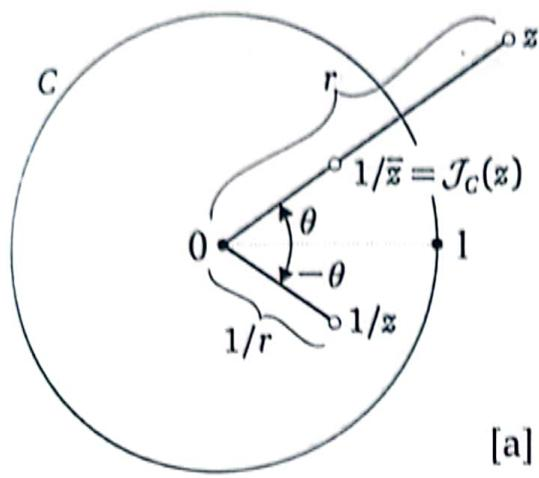  
[a]

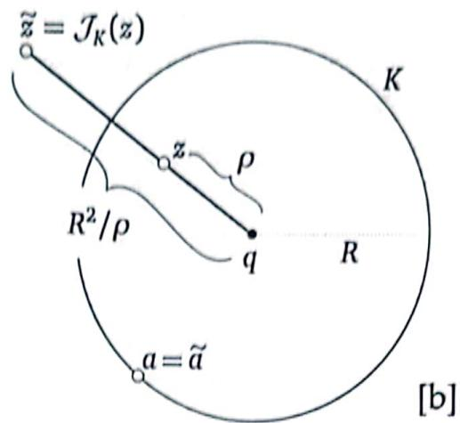  
图6-1[a]复反演是几何反演与共轭的复合.[b]关于一般圆周的几何反演

(1)将点  $z = r\mathrm{e}^{i\theta}$  变到方向和相同、长度为其倒数的地方，即点  $(1 / r)\mathrm{e}^{\mathrm{i}\theta} =$ $(1 / \overline{{z}})$

(2)做复共轭变换(即关于实轴的反射)，也就是将  $(1 / \overline{{z}})$  变到  $\overline{{(1 / \overline{{z}})}} =$ $(1 / z)$

你可以自己验证一下，改变这两个映射的先后次序是不重要的，不影响最后的结果。(请注意，并不都是这样的，例如序列(6.3)中几个映射，改变次序后的结果就可能不一样.)

步骤(2)在几何上是平凡的，我们来看看步骤(1)，它称为几何反演，简称反演，这个变换可不简单，显然，单位圆周  $c$  在映射中扮演重要的角色:反演将  $c$  的内部和外部交换，圆周  $c$  上的每个点都是不动点(也就是将这个点映射到自身).因此，我们记这个映射为  $z\mapsto \mathcal{J}_{c}(z) = (1 / \overline{{z}})$  ，称 $\mathcal{J}_{c}$  为"关于  $c$  的反演"(这比前面的名称更准确些)

这个术语增加的准确性很重要，如图6- 1b所示，有一个自然的方式把关于  $\mathcal{J}_{c}$  的反演推广到关于任意圆周  $K$  (例如，圆心为  $q$  、半径为  $R$  的圆周)的反演，显然，这个"关于  $K$  的反演"记为  $z\mapsto \widetilde{z} = \mathcal{J}_{K}(z)$  ，也应该是  $K$  的内部和外部的交换，而且使得  $K$  上的每个点保持不变，如果  $\rho$  是从  $q$  到  $z$  的距离，我们可以定义  $\widetilde{z} = \mathcal{J}_{K}(z)$  为在从  $q$  到  $z$  的方向上到  $q$  的距离为  $(R^{2} / \rho)$  的点，你可以亲自验证，只要想象将图6- 1a乘以因子  $R$  ，就肯定会得到这个定义.

- 反演是黎曼球面关于赤道的反射变换。如果我们利用球极平面投影将复数从平面上逆映射到单位球面上，从而创建黎曼球面，反演的效果就会简单得惊人:

黎曼球面的赤道平面  $\mathbb{C}$  上关于单位圆周的反演诱导出黎曼球面关于  $\mathbb{C}$  的反射。

为了验证效果(6.4)，我们来看图6- 2，其中显示了黎曼球面的纵向截面。点  $\hat{\mathbf{z}}$  被球极平面投影到  $\hat{\mathbf{z}}$ ，再关于赤道平面反射到  $\hat{\mathbf{z}}$ ，最后被球极平面投影到  $\hat{\mathbf{z}}$ 。容易看出[练习]三角形  $NOZ$  与三角形  $zON$  相似，从而有  $\left|\hat{\mathbf{z}}\right| / 1 = 1 / \left|\hat{\mathbf{z}}\right|$ 。因此， $\widetilde{\mathbf{z}} = \mathcal{J}_{C}(\mathbf{z})$ ，这就是效果(6.4)。

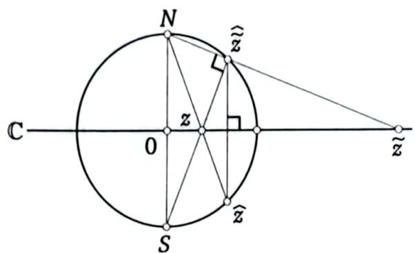  
图6-2黎曼球面的纵向截面。球面关于赤道平面  $\mathbb{C}$  的反射使得  $\widehat{\mathbf{z}}\mapsto \widehat{\mathbf{z}}$  和  $\mathbf{z}\mapsto \widetilde{\mathbf{z}} = \mathcal{J}_{C}(\mathbf{z})$

注意，图6- 2还表明，关于单位圆周的反演等价于先做以南极为光源的球极平面投影，再做以北极为光源的球极平面投影(或反之)。

- 反演是保圆的。根据命题(4.28)，复平面  $\mathbb{C}$  中的圆周  $K$  被投影到球面  $\Sigma$  上的圆周，球面关于其赤道平面的反共形反射(反演)将其映射到  $\Sigma$  上的另一个圆周，最后映射回  $\mathbb{C}$  中的圆周  $\mathcal{J}_{C}(K)$ 。如图6-3所示。

如果改成从复平面  $\mathbb{C}$  中的一条直线开始，根据事实(4.21)，会得到  $\Sigma$  上的一个经过北极  $N$  的圆周，这个圆周被反射成一个经过南极  $S$  的圆周，再投影回  $\mathbb{C}$  中一个经过0的圆周。相反，因为反演交换圆周内外的点，经过0的圆周  $K$  被映射成直线  $\mathcal{J}_{C}(K)$ 。如图6-4所示。

我们可以把第二个结果看作第一个结果的极限情况，直线是圆周的极限形式。事实上，在黎曼球面上，复平面上的直线就是恰好经过北极的圆周。有了这种统一的语言，我们可以总结如下:

反演是反共形映射，将圆周映射为圆周。(6.5)

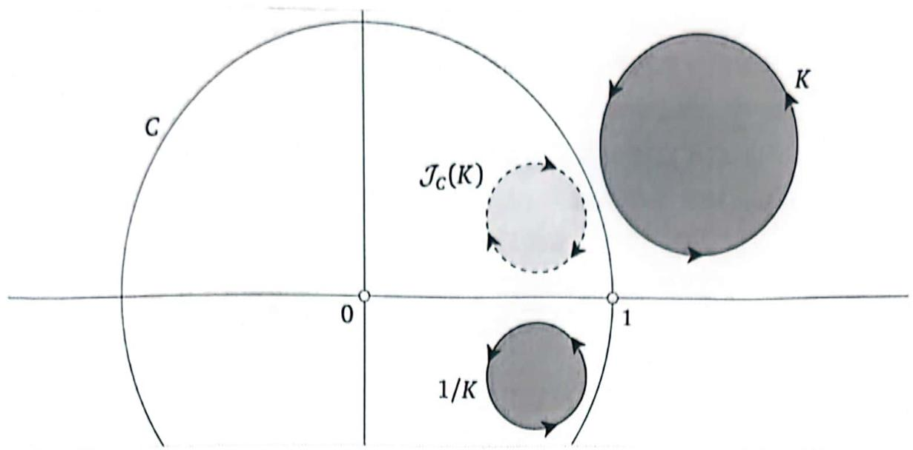  
图6-3 关于单位圆  $C$  圆周的复反演将定向圆周  $K$  映射为  $(1 / K)$ ， 并且将沿  $K$  前进方向左侧的阴影区域映射为沿  $(1 / K)$  前进方向左侧的阴影区域

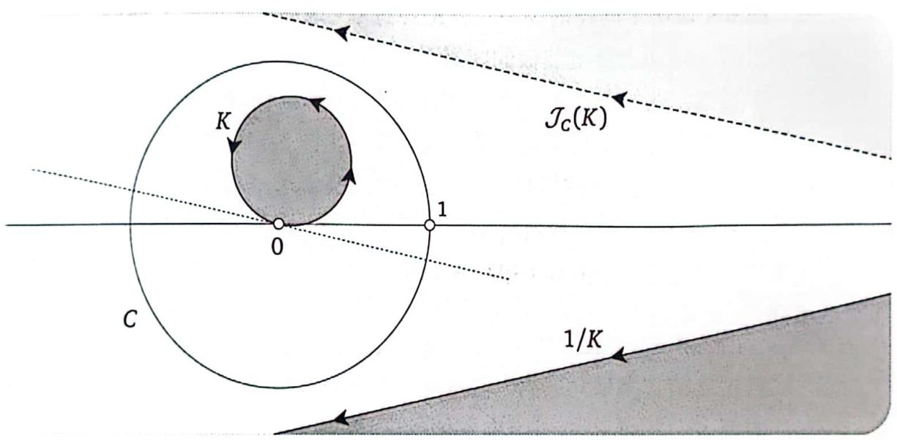  
图6-4 关于单位圆  $C$  圆周的复反演将定向圆周  $K$  映射为  $(1 / K)$ ， 并且将沿  $K$  前进方向左侧的阴影区域映射为沿  $(1 / K)$  前进方向左侧的阴影区域

- 复反演是黎曼球面的旋转. 考虑在这个几何反演后接着取共轭，  $z \mapsto \overline{z}$ ， 那么最终的结果就是复反演. 但是， 共轭对黎曼球面的作用是另一种反射， 这次是关于经过实轴的纵向平面的反射. 你可以很容易地验证 (也许要借助一个橘子)， 两个关于经过实轴的纵向平面的反射的复合是围绕该轴的一个旋转:

复反演  $z \mapsto (1 / z)$  是黎曼球面绕实轴旋转角度  $\pi$ . 因此它是共形的，将圆周映射到圆周.

我们也可以使用球极平面映射公式(4.26)提供第二个证明.自己验证一下，如果  $\hat{\mathbf{z}}$  的坐标为  $(\phi ，\theta)$  ，围绕实轴旋转  $\pi$  会将它带到一个坐标点  $(\pi - \phi ， - \theta)$  ，因此，旋转后的点对应的复数是

$$
\cot \left[\frac{\pi}{2} -\frac{\phi}{2}\right] \mathrm{e}^{\mathrm{i}(-\theta)} = \frac{1}{\cot(\phi / 2)} \mathrm{e}^{-\mathrm{i}\theta} = \frac{1}{\cot(\phi / 2)} \mathrm{e}^{\mathrm{i}\theta} = \frac{1}{z},
$$

这就是我们要证明的.

图6- 3说明了反演和复反演对定向圆周  $K$  的作用.注意:圆周  $K$  前进方向左侧区域(图6- 3所示的深色区域，即  $K$  的内部)是如何被映射到  $(1 / K)$  前进方向左侧区域的.如果  $K$  包含0，那么  $(1 / K)$  的方向将被映射反转，但"左侧  $\mapsto$  左侧"规律仍然有效.你应该自己验证一下，可以直接验证，也可以利用结论(6.6).

图6- 4说明了同样的现象，当  $K$  穿过0(球面上的南极)时，  $(1 / K)$  是一条直线(球面上穿过北极的圆周)

事实上，这给出了半平面和圆盘内部之间的一个共形映射，正是从共形半平面模型(图5- 12)构作共形圆盘模型(图5- 11)的方法.[第105页习题25给出了这个映射的显式默比乌斯变换公式，《复分析》6.3.10节有完整解释.]

- 保角性和保圆性.如图6-3和图6-4所示，利用"圆周"新的一般定义，由序列(6.3)和效果(6.4)立即可知，

默比乌斯变换是共形的，它将每一个定向圆周  $K$  映射为定向圆周  $\hat{K}$  ，并将  $K$  前进方向左侧的区域映射为  $\hat{K}$  前进方向左侧的区域.

- 矩阵表示.有了黎曼球面，在几何上，我们就可以认为无穷远点  $\infty$  和其他点是一样的——它就是北极点.由结论(6.6)可知，复反演引起黎曼球面发生一个交换南极和北极的旋转，这就使得  $0 = 1 / \infty$  和  $\infty = 1 / 0$  在字面上是正确的.

如果我们能去除无穷大在代数层面的特殊角色就好了.为此，我们采用射影几何的思想，将黎曼球面上的每个点表示为  $\mathbb{C}^{2}$  上一对复数  $[3_{1}，3_{2}]$  的比:  $z = (3_{1} / 3_{2})$

复数的有序对  $[\mathfrak{z}_{1}，\mathfrak{z}_{2}]^{\mathfrak{z}}$  称为复数  $z$  的射影坐标，或齐次坐标，为了保证这个比值是适定的，我们要求  $[\mathfrak{z}_{1}，\mathfrak{z}_{2}]\neq [0，0]$  ，对于满足  ${}^{*}\mathfrak{z}_{1}$  为任意复数，  $\mathfrak{z}_{2}\neq 0^{\mathfrak{n}}$  的每个有序复数对  $[\mathfrak{z}_{1}，\mathfrak{z}_{2}]$  ，恰有一个普通的有限点  $z = (\mathfrak{z}_{1} / \mathfrak{z}_{2})$  与之对应，但是，每一个复数  $z$  对应于一个无穷的射影坐标集  $[k_{31}，k_{32}] =$ $k[3_{1}，3_{2}]$  ，其中  $k$  是任意非零复数，例如，复数i可以表示为  $[1 + \mathrm{i}，1 - \mathrm{i}]$  也可以表示为[- 1，i]或  $[3 + 2\mathrm{i}，2 - 3\mathrm{i}]$  ，这只是i的无穷多个射影坐标中的三个例子.

现在，无穷远点可以表示为具有形式  $[\mathfrak{z}_{1}，0]$  的一对复数，它并不特殊

正如  $\mathbb{R}^{2}$  空间中的线性变换都可以用一个  $2\times 2$  的实矩阵表示一样， $\mathbb{C}^{2}$  空间中的线性变换都可以用一个  $2\times 2$  的复矩阵表示:

$$
\left[ \begin{array}{l}{\mathfrak{z}_{1}}\\ {\mathfrak{z}_{2}} \end{array} \right]\longrightarrow \left[ \begin{array}{l}{\mathfrak{w}_{1}}\\ {\mathfrak{w}_{2}} \end{array} \right] = \left[ \begin{array}{l l}{a} & b\\ {c} & d \end{array} \right]\left[ \begin{array}{l}{\mathfrak{z}_{1}}\\ {\mathfrak{z}_{2}} \end{array} \right] = \left[ \begin{array}{l}{a_{31} + b_{32}}\\ {c_{31} + d_{32}} \end{array} \right].
$$

如果把  $[\mathfrak{z}_{1}，\mathfrak{z}_{2}]$  和  $[\mathfrak{w}_{1}，\mathfrak{w}_{2}]$  分别看作  $\mathbb{C}$  中  $z = (\mathfrak{z}_{1} / \mathfrak{z}_{2})$  及其像  $w = (\mathfrak{w}_{1} / \mathfrak{w}_{2})$  在 $\mathbb{C}^{2}$  中的射影坐标，上述  $\mathbb{C}^{2}$  中的线性变换就诱导了  $\mathbb{C}$  中的下述(非线性)变换:

$$
z = \frac{\mathfrak{z}_{1}}{\mathfrak{z}_{2}}\longmapsto w = \frac{\mathfrak{w}_{1}}{\mathfrak{w}_{2}} = \frac{a_{31} + b_{32}}{c_{31} + d_{32}} = \frac{a(\mathfrak{z}_{1} / \mathfrak{z}_{2}) + b}{c(\mathfrak{z}_{1} / \mathfrak{z}_{2}) + d} = \frac{a z + b}{c z + d}.
$$

这正是最一般的默比乌斯变换!

于是，每一个默比乌斯变换  $M(z)$  对应一个  $2\times 2$  矩阵  $[M]$

$$
M(z) = \frac{a z + b}{c z + d}\longleftrightarrow [M] = \left[ \begin{array}{l l}{a} & b\\ {c} & d \end{array} \right].
$$

而且，表示两个默比乌斯变换的复合的矩阵就是两个对应矩阵的乘积:

$$
[M_{2}\circ M_{1}] = [M_{2}][M_{1}]. \tag{6.8}
$$

同样，表示默比乌斯逆变换的矩阵就是对应矩阵的逆矩阵:

$$
[M^{-1}] = [M]^{-1}. \tag{6.9}
$$

由此易得[练习]:非奇异默比乌斯变换构成一个群，这是我们前面提到过的事实.

因为默比乌斯变换的系数不是唯一的，所以默比乌斯变换对应的矩阵也不是唯一的:如果  $k$  是任意非零常数，则矩阵  $k[M]$  与  $[M]$  对应同一个默比乌斯变换.然而，如果限定  $(a d - b c) = 1$  ，将矩阵  $[M]$  规范化，那么一个默

比乌斯变换的对应矩阵就只有两种可能:一个是  $[M]$ ， 另一个是  $- [M]$ 。换言之， 以比乌斯变换对应的矩阵在"不计正负号的情况下"是唯一的。这个表面看似平凡的事实， 在数学和物理学中都具有深刻的意义， 详见 Penrose and Rindler (1984， 第 1 章) 和 Penrose (2005， 11.3 节).

# 6.3 主要结果

现在可以叙述并证明主要结果 (6.2) 更详细的版本.

所有三种常曲率几何的对称群  $\mathcal{G}_{+}(S)$  都是默比乌斯变换群的子群.

1. 欧几里得几何(  $\kappa = 0$  ):

$$
E(z) = \mathrm{e}^{\mathrm{i}\theta}z + k.
$$

注意  $z \mapsto \overline{z}$  是反向等距变换， 是关于实轴的反射。于是结论 (6.1)

告诉我们整个等距变换群是  $\mathcal{G} = \{E(z)\} \cup \{E(\overline{z})\}$

2. 球极地图中的球面几何(  $\kappa = +1$  ):

$$
S(z) = \frac{a z + b}{-\overline{b} z + \overline{a}}, \quad \text{其中} |a|^2 + |b|^2 = 1. \tag{6.10}
$$

注意  $z \mapsto \overline{z}$  是反向等距变换， 是球面关于过实轴的纵向平面的反射。于是结论 (6.1) 告诉我们整个等距变换群是  $\mathcal{G} = \{S(z)\} \cup \{S(\overline{z})\}$

3. 贝尔特拉米-庞加莱半平面地图中的双曲几何(  $\kappa = -1$  ):

$H(z) = \frac{a z + b}{c z + d}$ ， 其中  $a， b， c， d$  为实数， 且  $(a d - b c) = 1$

(6.11)

注意  $z \mapsto - \overline{z}$  是反向等距变换， 是关于虚轴的反射。于是结论 (6.1) 告诉我们整个等距变换群是  $\mathcal{G} = \{H(z)\} \cup \{H(- \overline{z})\}$

有了关于矩阵的结果 (6.8) 和 (6.9)， 就容易证明以上三个集合都是群。我们还注意到， 在球面几何中的矩阵是一种特殊类型， 在物理学中起着重要作用。这类矩阵称为酉矩阵， 也就是说， 将它取共轭， 再做转置 (这两个操作的复合记为 *)， 则 [练习] 可得到逆变换的矩阵:

$S$  是酉矩阵，意味着  $[S][S]^{\ast} =$  单位矩阵.

欧几里得平面的变换  $E(z)$  是一个关于  $\theta$  的旋转接一个关于  $k$  的平移， 这显然是平面内最一般的刚体运动。所以， 我们现在跳过这个问题， 将精力投入  $\kappa = \pm 1$

的情况。这些情况有一些令人惊奇的结果， 证明这些结果更有挑战性。在这项工作中， 我们不打算停下来对这些结果做几何评判， 而是建议你参阅《复分析》。现在， 我们要炫耀一下我们建立的度量机器具有的计算能力。

为此， 需要介绍一点儿复分析的知识。我们在4.6节讲过， 复映射  $z \mapsto w = f(z)$  的导数  $f'(z)$  和在一年级微积分中定义的一模一样， 所有通常的微分公式都没有变。于是， 可以将导数的除法公式应用于规范化 [即  $(ad - bc) = 1$ ] 的默比乌斯变换， 得到

$$
M(z) = \frac{az + b}{cz + d} \Rightarrow M'(z) = \frac{1}{(cz + d)^2}. \tag{6.12}
$$

回顾式(4.19)， 复函数的导数被赋予"伸扭"的几何功能， 所以它比实函数的普通导数具有更丰富的意义， 也更具魔力。

我们现在回来讨论主要结果。根据欧拉在1775年首先证明的结果， 球面的刚体运动就是旋转。大约在1819年， 高斯第一个认识到， 这些旋转运动可以表示为形式如式(6.10)的默比乌斯变换。

取球面半径为1， 可以将球极度量公式(4.22)用复数  $z$  写成

$$
\mathrm{d}\widehat{s} = \frac{2}{1 + |z|^2} |\mathrm{d}z|.
$$

要证明映射  $z \mapsto w = S(z) = \frac{az + b}{- bz + \overline{a}}$  是正向等距映射， 我们必须证明

$$
\frac{2}{1 + |w|^2} |\mathrm{d}w| = \frac{2}{1 + |z|^2} |\mathrm{d}z|. \tag{6.13}
$$

直接计算可得[练习]

$$
1 + |w|^2 = \frac{1 + |z|^2}{| - \overline{b}z + \overline{a}|^2}.
$$

由式(6.12)可得

$$
\left|\frac{\mathrm{d}w}{\mathrm{d}z}\right| = |S'(z)| = \frac{1}{| - \overline{b}z + \overline{a}|^2} = \frac{1 + |w|^2}{1 + |z|^2},
$$

这就验证了式(6.13)， 从而证明了主要结果的第2部分。(但是， 这并未证明这些是仅有的正向等距映射。这个问题要用以后的几何分析来解决。)

然而， 我们这些凡夫俗子(甚至高斯)怎么能猜到这些默比乌斯变换的形式呢?! 这里有一个简单的论点， 仅仅基于我们目前所知道的: 如果旋转使球面上的点  $\widehat{z}$  移动到  $\widehat{M(z)}$ ， 那么它也使  $\widehat{z}$  的对径点移动到  $\widehat{M(z)}$  的对径点。但是， 我们知道对径点的球极平面映射像具有结论(4.27)所示的关系， 所以

$$
M\left(-\frac{1}{z}\right) = -\frac{1}{\widehat{M(z)}}.
$$

于是

$$
\frac{a\left[-\frac{1}{\bar{z}}\right] + b}{c\left[-\frac{1}{\bar{z}}\right] + d} = -\frac{\overline{c z + d}}{\overline{a z + b}} \Rightarrow \frac{-b\overline{z} + a}{d\overline{z} - c} = \frac{\overline{c}\overline{z} + \overline{d}}{\overline{a}\overline{z} + \overline{b}},
$$

由此明显有  $c = - \overline{b}$  和  $d = \overline{a}$ ，这正是式(6.10)的形式!

第105页习题27会给出一个具体的例子，说明怎么用默比乌斯变换来表示旋转，并给出一个构件性证明，证明每个旋转都是形如式(6.10)的默比乌斯变换

最后考虑双曲平面.由度量公式(5.7)可知，我们必须证明  $z \mapsto w = H(z) = \frac{a z + b}{c z + d}$  满足

$$
\frac{|\mathrm{d}w|}{\mathrm{Im}w} = \frac{|\mathrm{d}z|}{\mathrm{Im}z}. \tag{6.14}
$$

直接计算可得[练习，注意到  $\overline{a} = a， \dots$  ]

$$
\mathrm{Im}w = \frac{w - \overline{w}}{2\mathrm{i}} = \frac{\mathrm{Im}z}{|c z + d|^{2}}.
$$

由式(6.12)可得

$$
\left|\frac{\mathrm{d}w}{\mathrm{d}z}\right| = |H'(z)| = \frac{1}{|c z + d|^{2}} = \frac{\mathrm{Im}w}{\mathrm{Im}z},
$$

这就验证了式(6.14)，从而证明了主要结果的第3部分

双曲等距变换不仅包含类似于旋转和平移的普通运动，还包含第三种类型的刚体运动，称为极限旋转，在通常的欧几里得几何里没有与之对应的运动形式。极限旋转是  $\mathbb{H}^{2}$  中普通旋转运动的极限:旋转中心从无穷远点出发，逐渐接近天际线  $y = 0$ ，旋转运动最终变成天际线上的一个点。详见《复分析》6.3.7节和6.3.8节。

# 6.4 爱因斯坦的时空几何学

既然仅仅默比乌斯变换群的子群就对几何学具有如此深刻的意义，我们自然要问，整个默比乌斯变换群是否具有更加非凡的功力。

整个默比乌斯群至少在看似没有关系的两个知识领域里扮演着至关重要的基础性作用，这两个知识领域是相对论和三维双曲几何。事实上，这不是巧合，这两个主题之间存在深刻的联系。但是，我们不能在此探讨这件事，建议阅读Penrose (2005， 18.4节)，那里对此有非常精彩的论述。

第一个作用可以毫不夸张地称为"基本原理":

默比乌斯群描述了空间和时间的对称性， 或者更准确地说， 描述了爱因斯坦统一时空的对称性.

显然， 在此详细探讨爱因斯坦的狭义相对论既不合适， 也不可行. 然而， 对于以前没有学习过这个理论的读者， 我们将尽量讲得充分一些， 以便帮助你理解这个理论与默比乌斯群的特殊联系.

爱因斯坦理论的起点是关于大自然的一个非凡而奇异的实验事实:

对于在匀速相对运动中的所有观察者， 光的传播速率都是相同的.

在 1905 年， 爱因斯坦首先认识到， 只有在这些观察者对空间和时间的量度不一致的情况下才可能出现这个现象!

为了量化这个理论， 我们将一个事件  $\mathfrak{E}$  的时间  $T$  和三维空间坐标  $(X，Y，Z)$  合并成四维时空中的单一四维向量  $(T，X，Y，Z)$ . 这是事件  $\mathfrak{E}$  的空间和时间坐标， 我们称之为第一观察者.

当然， 第一观察者向量的空间分量不具有绝对意义: 如果第二观察者使用同一个原点， 但坐标轴相对于第一观察者坐标轴做了旋转， 那么， 第二观察者应该是同一事件  $\mathfrak{E}$  的不同空间坐标  $(\widetilde{X}，\widetilde{Y}，\widetilde{Z})$ . 如果这两个观察者之间没有相对运动， 就应该有  $\widetilde{X}^{2} + \widetilde{Y}^{2} + \widetilde{Z}^{2} = Y^{2} + Y^{2} + Z^{2}$ ， 因为这表示到事件发生点的距离的平方.

与此相反， 我们习惯认为时间分量  $T$  确实具有绝对意义. 然而， (被无数实验验证了的) 爱因斯坦理论告诉我们这是错误的. 如果两个 (瞬间重合的) 观察者处于相对运动中， 则他们对事件发生时间的认识会不一致. 进而， 他们对  $(X^{2} + Y^{2} + Z^{2})$  的值的认识也不再一致， 这就是著名的洛伦茨收缩.

只有当两个观察者的相对速度非常接近不可能达到的光速 (约每秒 186000 英里) 时， 这种效应才会被察觉. 例如， 即使第二个观察者以步枪子弹的速度 (每小时 2000 英里) 远离第一个观察者， 他们的时钟之间的差距即使经过一生 (比如 85 年) 的积累， 也只有百分之一秒左右! 相对于光的速度， 我们蜗牛般的存在只是个偶然， 这个偶然把爱因斯坦的发现的真相掩盖了数千年 (并且仍然在

日复一日地继续掩盖)

如果第二个物体以接近光速的速率运行，则时间和空间的畸变是巨大的，遍布全球的粒子加速器每天都在证实这个现象。在这样不同寻常的环境下，时空中是否存在某些方面具有绝对意义，使得均速相对运动的两个观察者看到的时空是一致的?

令人惊讶的是，爱因斯坦的回答是"存在!":时空确实具有与所有观察者无关的绝对结构。因此，爱因斯坦本人非常不喜欢(并多年拒绝接受)将这个理论命名为"相对论"，他认为应该称之为"绝对论"。

为方便起见，我们定义光速为1，爱因斯坦发现:存在观察者与事件之间的时空区间，使得两个观察者看到的时空区间的值是一致的。这个时空区间是由其平方定义的:

$$
\mathbf{\widetilde{J}}^{2}\equiv T^{2} - (X^{2} + Y^{2} + Z^{2}) = \widetilde{T}^{2} - (\widetilde{X}^{2} + \widetilde{Y}^{2} + \widetilde{Z}^{2}). \tag{6.15}
$$

闵可夫斯基意识到，这种区间是距离概念的正确推广，适合用于时空。时空的等距变换/对称性保持这种区间不变。但是，它与通常的距离大不相同:不同事件之间的区间的平方可以是0，甚至为负数。

我们来提供在  $\mathbf{\widetilde{J}}^{2} > 0$  的情形下关于】更生动的解释，前面已经说过，我们假设两个观察者(相互之间做匀速相对运动)在一个特定的地点和时间瞬间重合，将其定义为一个原始事件，记为  $\mathfrak{D}$ 。(当然，要精确定义这个事件，必须假设我们的观察者像质点一样，位于一个确定的位置。)现在假设第一个观察者(巧合地或故意地)在事件  $\mathfrak{E}$  发生的时刻到达这个事件发生的地点。在他看来，他一直坐在那儿未曾移动，而两个事件  $\mathfrak{D}$  和  $\mathfrak{E}$  就在他坐的地点  $(X = Y = Z = 0)$  发生，所以事件  $\mathfrak{D}$  和  $\mathfrak{E}$  之间的时空区间(对所有观察者都是一致的)就是  $\mathbf{\widetilde{J}} = \mathbf{\widetilde{T}}$

如果观察者戴着一块手表在匀速运动中从一个事件到达另一个事件，那么这两个事件之间的不变时空区间  $\mathbf{\widetilde{J}}$  就是手表上走过的时间。

然后，想象事件  $\mathfrak{D}$  产生了一个电火花，它向所有的方向发射出光子(光的粒子)。如果两个观察者都关注同一个光子，他们看到的就是一致的，沿着光子在时空中轨迹上的每一个事件都有  $\mathbf{\bar{\tau}} = 0$  。这个指向一个特定光线且"长度"消失的四维向量称为零向量。

洛伦茨变换  $\mathcal{L}$  是时空的线性变换，是  $4\times 4$  矩阵，它将一个观察者对一个事件的观察  $(T，X，Y，Z)$  映射为另一个观察者对同一个事件的观察  $(\widetilde{T}，\widetilde{X}，\widetilde{Y}，\widetilde{Z})$  。换言之，  $\mathcal{L}$  是保持  $\mathbf{\bar{\tau}}^{2}$  这个量不变的线性变换，而且两个观察者对这个量的观察是一致的。

我们再回过头来考虑那个电火花，它向所有方向发射出去的光子形成一个球面。球心位于原点，半径随着时间以光速增大。在时间  $T = 1$  时，这些光子形成了一个半径为1的球面，现在选择用黎曼球面来表示它。于是，现在可以认为这个球面是由同时标记了时空坐标  $(1，X，Y，Z)$  的点组成的，这些点也可以用式(4.25)中球极平面投影定义的复数表示。

将射影坐标描述的  $z = (z_{1} / z_{2})$  代入球极平面投影公式(4.25)，就得到

$$
X = \frac{3_{1}\overline{{3_{2}}} + 3_{2}\overline{{3_{1}}}}{|_{3_{1}}|^{2} + |_{3_{2}}|^{2}},\qquad Y = \frac{3_{1}\overline{{3_{2}}} - 3_{2}\overline{{3_{1}}}}{\mathrm{i}(|_{3_{1}}|^{2} + |_{3_{2}}|^{2})},\qquad Z = \frac{|_{3_{1}}|^{2} - |_{3_{2}}|^{2}}{|_{3_{1}}|^{2} + |_{3_{2}}|^{2}}.
$$

但是，每一束光线等同于这束光线方向上的任意一个零向量。如果令  $T = 1$  ，我们可以选择一个标量因子  $|_{3_{1}}|^{2} + |_{3_{2}}|^{2}$  乘以上述表达式，就消去了分母(也就是，取  $T = |_{3_{1}}|^{2} + |_{3_{2}}|^{2}$  )。这个新的零向量  $(T，X，Y，Z)$  (沿着原来的时空方向)可以表示为

$$
\begin{array}{l}{{T=|_{31}|^{2}+|_{32}|^{2},}}\\ {{X=_{31}\overline{{3}}_{2}+_{32}\overline{{3}}_{1},}}\\ {{Y=-\mathrm{i}(_{31}\overline{{3}}_{2}-_{32}\overline{{3}}_{1}),}}\\ {{Z=|_{31}|^{2}-|_{32}|^{2}.}}\end{array}
$$

容易将这些公式转换为以下形式[练习]:

$$
\left( \begin{array}{cc}T + Z & X + \mathrm{i}Y \\ X - \mathrm{i}Y & T - Z \end{array} \right) = 2 \left( \begin{array}{cc}3_{1}\overline{3_{1}} & 3_{1}\overline{3_{2}} \\ 3_{2}\overline{3_{1}} & 3_{2}\overline{3_{2}} \end{array} \right) = 2 \left( \begin{array}{c}3_{1} \\ 3_{2} \end{array} \right) \left(\overline{3_{1}} -\overline{3_{2}}\right),
$$

也就是

$$
\left( \begin{array}{cc}T + Z & X + \mathrm{i}Y \\ X - \mathrm{i}Y & T - Z \end{array} \right) = 2 \left( \begin{array}{c}3_{1} \\ 3_{2} \end{array} \right) \left( \begin{array}{c}3_{1} \\ 3_{2} \end{array} \right)^{*}, \tag{6.17}
$$

其中"*"仍表示共轭转置。

现在，时空区间可以简洁地表示为这个矩阵的行列式:

$$
\begin{array}{r}{\mathbf{\nabla}^{2} = T^{2} - (X^{2} + Y^{2} + Z^{2}) = \operatorname *{det}\left( \begin{array}{l l}{T + Z} & {X + \mathrm{i}Y}\\ {X - \mathrm{i}Y} & {T - Z} \end{array} \right).} \end{array} \tag{6.18}
$$

容易看出[练习]，这个放大了的时空向量仍然是零向量，理应如此

现在已经利用球极平面投影用复数表示了光线，通过式(6.17)，我们来看看复平面  $\mathbb{C}$  上的默比乌斯变换  $\widetilde{\mathbf{z}} \mapsto \widetilde{\mathbf{z}} = M(\mathbf{z})$  作用于这束闪光的效果，也就是

$$
\begin{array}{r}{\left[ \begin{array}{l}{\mathfrak{z}_{1}}\\ {\mathfrak{z}_{2}} \end{array} \right]\longmapsto \left[ \begin{array}{l}{\widetilde{\mathfrak{z}}_{1}}\\ {\widetilde{\mathfrak{z}}_{2}} \end{array} \right] = [M]\left[ \begin{array}{l}{\mathfrak{z}_{1}}\\ {\mathfrak{z}_{2}} \end{array} \right].} \end{array}
$$

代入式(6.17)，得到(光线的轨迹生成的)零向量的线性变换:

$$
\begin{array}{r}{\left(\begin{array}{l l}{T+Z}&{X+\mathrm{i}Y}\\ {X-\mathrm{i}Y}&{T-Z}\end{array}\right)\mapsto\left(\begin{array}{l l}{\widetilde{T}+\widetilde{Z}}&{\widetilde{X}+\mathrm{i}\widetilde{Y}}\\ {\widetilde{X}-\mathrm{i}\widetilde{Y}}&{\widetilde{T}-\widetilde{Z}}\end{array}\right)=[M]\left(\begin{array}{l l}{T+Z}&{X+\mathrm{i}Y}\\ {X-\mathrm{i}Y}&{T-Z}\end{array}\right)[M]^{*}.}\end{array} \tag{6.19}
$$

最后，想象这个线性变换作用于所有时空向量(不仅仅是零向量).因为 $\operatorname *{det}[M] = 1 = \operatorname *{det}[M]^{*}$  ，由式(6.18)可得这个线性变换保持时空区间不变:

$$
\widetilde{\mathbf{J}}^{2}=\operatorname*{det}\left\{\left[M\right]\left(\begin{array}{l l}{T+Z}&{X+\mathrm{i}Y}\\ {X-\mathrm{i}Y}&{T-Z}\end{array}\right)\left[M\right]^{*}\right\}=\mathbb{J}^{2}.
$$

于是，

复平面  $\mathbb{C}$  上的每一个默比乌斯变换都生成时空中唯一的洛伦茨变换.反过来，可以证明(详见Penrose and Rindler，1984，第1章)每一个洛伦茨变换都对应唯一(不论正负号)的默比乌斯变换.

这么漂亮的"神来之作"，即使在专业物理学家中也非众所周知

因此，每个默比乌斯变换或洛伦茨变换从根本上等价于下面要介绍的四个原型之一.基本思想是关注变换的不动点，变换把该点映射为自身:  $M(\mathbf{z}) = \mathbf{z}$

显然 [练习] 这产生了一个二次方程. 二次方程有两个解 (可能是不同的， 也可能重合)， 所以默比乌斯变换有两个不动点. 如果这两个不动点是不同的， 可以把它们想象成北极和南极， 这就产生了图 6- 5a~6- 5c 中的三个原型. 如果这两个不动点重合， 可以把它们都想象成北极， 这就产生了图 6- 5d 中的第四个原型.

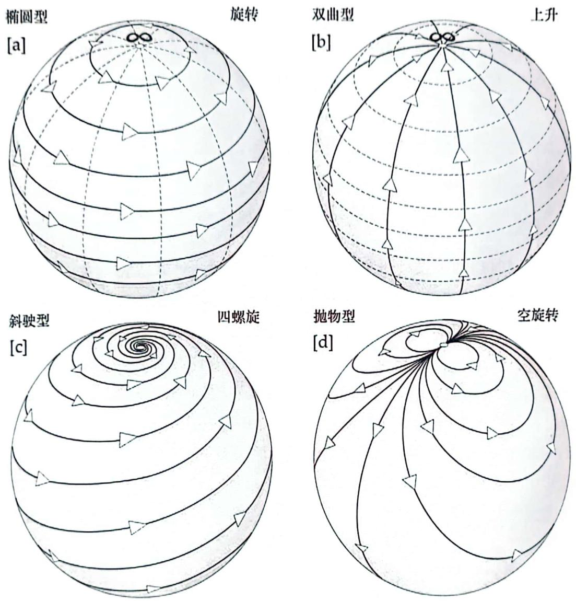  
图 6-5 默比乌斯变换和洛伦茨变换的分类. 这四种类型的变换各有两个名称， 将它看作复平面 C 上的变换时用左侧名称， 将它看作时空中的变换时用右侧名称

为了使这四种洛伦茨变换更加生动， 想象你自己乘坐一艘宇宙飞船， 遨游在星际空间中， 看着舷窗外散布在天球上四面八方的无数星星. 把这个天球想象成

一个单位球， 你在球心， 射向你眼睛的星光与天球相交于一点， 它们被标记在球面上. 我们还假设你的宇宙飞船与球面对齐， 北极就在你的正前方.

现在， 如果你启动侧向推进器， 使宇宙飞船围绕球面的南北轴旋转， 你看到的星场将围绕你旋转， 如图 6- 5a 所示. 这种洛伦茨变换当然叫作旋转. 在复平面中对应的默比乌斯变换也是一个旋转，  $M(z) = \mathrm{e}^{\mathrm{i}a}z$ ， 这种类型称为椭圆型.

假设你不再旋转， 而是启动强大的主发动机. 几乎在一瞬间， 宇宙飞船会以接近光速的速率  $\nu$  直接向天球的北极飞去. 如图 6- 5b 所示， 你会看到星星朝着你前进的方向蜂拥而来——这与大多数科幻电影的描述正好相反! 这种洛伦茨变换叫作上升. 在复平面中对应的默比乌斯变换是简单的扩张，  $M(z) = \rho z$ ， 扩张系数为实数  $\rho$ ， 这种类型称为双曲型. 事实上 (见第 108 页习题 34)， 扩张系数  $\rho$  与航天器速度  $\nu$  有关:

$$
\rho = \sqrt{\frac{1 + \nu}{1 - \nu}}. \tag{6.21}
$$

如果你同时启动主发动机和侧向推进器， 前面两种效应将联合起来， 使得星图朝着你前进的方向螺旋运动， 如图 6- 5c 所示. 这种洛伦茨变换叫作四螺旋， 对应的默比乌斯变换为  $M(z) = \rho \mathrm{e}^{\mathrm{i}a}z$ ， 称为斜驶型.

如图 6- 5d 所示， 洛伦茨变换的最后一种类型叫作空旋转， 这时两个不动点在北极重合了. 很难对这个时空变换给出生动的物理描述， 对应的默比乌斯变换称为抛物型， 它是复平面  $\mathbb{C}$  上的平移:  $M(z) = z + \tau$ ， 也就是每一个复数都沿着平行于  $\tau$  的直线运动. 从第 50 页图 4- 8 可知， 所有这些直线都被球极平面投影为经过北极的圆周， 它们在北极的切线都平行于  $\tau$ ， 所以就有图 6- 5d 这样的形式. 注意， 当越来越接近北极时， 球面上的运动会越来越小， 直到北极， 使其成为仅有的不动点.

# 6.5 三维双曲几何

值得注意的是， 无论是罗巴切夫斯基还是波尔约， 都没有着手发展二维非欧几何. 相反， 两人从一开始就各自寻找一种替代三维欧几里得空间的双曲型理论， 双曲平面自然地出现在了这个双曲三维空间中.

我们曾经在上半平面中引入如下度量， 建立了双曲平面的共形地图:

$$
\mathrm{d}\widehat{s} = \frac{\mathrm{d}s}{\mathrm{d}x\mathrm{d}y\mathrm{d}z} = \frac{\sqrt{\mathrm{d}x^{2} + \mathrm{d}y^{2}}}{y}. \tag{6.22}
$$

为了将这个地图推广到三维双曲空间  $\mathbb{H}^{3}$ ， 考虑三维欧几里得空间  $(X，Y，Z)$  中的水平  $(X，Y)$  平面上方的半空间  $Z > 0$ 。现在可以通过取如下度量公式来建立  $\mathbb{H}^{3}$  的共形模型:  $①$

$$
\mathrm{d}\widehat{s} = \frac{\mathrm{d}s}{\mathrm{d}x\mathrm{d}y\mathrm{d}z} = \frac{\sqrt{\mathrm{d}X^{2} + \mathrm{d}Y^{2} + \mathrm{d}Z^{2}}}{Z}. \tag{6.23}
$$

$(X，Y)$  平面(  $Z = 0$  )上的点都是无穷远点，这个边界平面就是二维的天际面，我们将它视为复平面  $\mathbb{C}$ ，取坐标为  $X + \mathrm{i}Y$ 。

从这个结构立即可以得出，每个纵向半平面都是双曲平面  $\mathbb{H}^{2}$ 。见图6- 6，并与图5- 5比较。(可以想象这个空间充满了同样大小的双曲球面，随着越来越临近天际面，球面的欧几里得大小就会越来越小。)

  
图6-6 三维双曲空间  $\mathbb{H}^{3}$ 。双曲平面表现为纵向半平面和正交于天际面  $\mathbb{C}$  的半球面。两个这样的平面相交于双曲直线:纵向半直线，或正交于  $\mathbb{C}$  的半圆周

我们想象光线在这样一个纵向平面内传播，对称性限定它始终在这个平面内，

所以， 前面对光线传播路线的分析仍然适用. 于是，

$\mathbb{H}^{3}$  的测地线是纵向半直线和正交于天际面  $\mathbb{C}$  的半圆周.

在二维双曲空间  $\mathbb{H}^{2}$  中的测地线有两种: 一种特殊， 是纵向半直线; 另一种典型， 是正交于天际线的半圆周. 同样， 在三维双曲空间  $\mathbb{H}^{3}$  中的双曲平面也有两种: 一种特殊， 是纵向半平面; 另一种典型， 是正交于天际面  $\mathbb{C}$  的半球面， 如图 6- 6 所示.

我们来看看为何如此， 想象你住在  $\mathbb{H}^{3}$  里. 你说的"平面"是什么意思呢? 假设我递给你一个中心位于点  $p$  的无限小圆盘  $D$ . 为了(唯一地)将这个圆盘延伸为一个无限大的"平面"  $H$ ， 你可能需要将它的直径延长为无限长的双曲线， 即正交于天际面  $\mathbb{C}$  的半圆周. 如果圆盘是竖直的， 这显然会得到包含  $D$  的纵向半平面. 如果圆盘  $D$  不是竖直的， 这个结构就会生成一个正交于  $\mathbb{C}$  的半球面  $H$ ， 这里  $D$  与  $H$  在点  $p$  的切平面重合. 此外， 容易看出， 这个半球面的中心就是  $D$  在点  $p$  的(欧几里得)法线与天际面  $\mathbb{C}$  的交点.

假设图6- 6中的半球面就是这个  $H$ ， 考虑图中经过点  $p$  的纵向平面与  $H$  的交线. 显然， 这条交线是  $D$  的直径延伸成的双曲直线. 这是因为， 由  $H$  的构件，  $H$  在点  $p$  的切平面与  $D$  重合. 现在设经过点  $p$  的纵向直线为  $L$ . 如果让经过点  $p$  的纵向平面绕直线  $L$  旋转一周， 这个纵向平面与  $H$  的交线就会扫过整个  $H$ ， 这证实了  $H$  确实是  $D$  扩展成的唯一双曲平面. 因此，

$\mathbb{H}^{3}$  中的双曲平面是纵向半平面和正交于天际面  $\mathbb{C}$  的半球面.

显然， 纵向半平面就是双曲平面， 有两个理由: 一是生活在  $\mathbb{H}^{3}$  空间中的居民称它为平面， 二是它的内蕴几何就是  $\mathbb{H}^{2}$  空间的几何. 那么， 半球面形的平面是否也同样是双曲平面呢? 也就是说， 如果我们在这样的一个半球面上， 用其外围空间  $\mathbb{H}^{3}$  的双曲度量 (6.23) 来测量距离， 是否真的会得到  $\mathbb{H}^{2}$  呢?

答案是肯定的: 每一个半球面的内蕴几何都是  $\mathbb{H}^{2}$  的几何. 如果你生活在  $\mathbb{H}^{3}$  空间中， 那么， 每一个方向与另一个任意的方向是一样的， 每一条直线与另一条任意的直线是一样的， 每一个平面与另一个任意的平面是一样的. 将几何反演推广到三维空间， 就有可能提供一个自然的几何解释， 证明存在将纵向双曲平面变成半球面形平面的运动， 因此它们的内蕴几何一定是相同的. 不过， 现在我们还是做一个计算来回答这个问题.

如果我们在半径为  $R$  的半球面上建立球面坐标系(经度和纬度)，则  $Z =$ $R\cos \phi$  ，将式(4.4)代入双曲度量公式(6.23)，得到

$$
\mathrm{d}\widehat{s} = \frac{\sin^{2}\phi \mathrm{d}\theta^{2} + \mathrm{d}\phi^{2}}{\cos^{2}\phi}. \tag{6.24}
$$

要看清楚这个公式的确就是  $\mathbb{H}^{2}$  的度量，我们可以引入新的坐标系，将这个度量公式转换成标准形式(6.22)(见第106页习题28)，或者使用内蕴度量的曲率公式(4.10)来验证[练习]  $k = 1$

我们来介绍  $\mathbb{H}^{3}$  的一对简单等距变换，度量公式(6.23)显然不会因为下述水平坐标面上的欧几里得平移而改变:

同样，双曲距离也不会因为空间在下述以原点为中心的欧几里得扩张而改变:

$$
(X,Y,Z)\mapsto k(X,Y,Z) = (k X,k Y,k Z),
$$

其中  $k > 0$  是扩张系数，因为在这里ds和  $z$  都乘了相同的伸缩因子  $k$  ，所以ds没有改变.

将这个扩张与平移结合起来，可见以天际面上任意点为中心的扩张都是等距变换，有了这两种等距变换就可以再次验证，所有半球面形的平面一定具有相同的内蕴几何，因为任意两个半球面形的平面都可以通过刚体运动重合:首先通过天际面上的平移使得它们具有同一个中心，然后通过扩张使得它们的半径相等.

任意一个等距变换一定会将一个平面变换成另一个平面，这就是说，天际面C上的边界圆周一定会被变换成另一个边界圆周，事实证明(尽管我们不能在这里证明)这种保圆性是很重要的，有了保圆性就足以完全确定所涉及的复映射:它们只能是默比乌斯变换!

反过来，复平面C上的任何默比乌斯变换都会诱导出整个  $\mathbb{H}^{3}$  空间中的唯一变换，因为  $\mathbb{H}^{3}$  中的每个点  $p$  都是由三个平面的交点唯一确定的，这三个(半球面形的)平面在天际面  $\mathbb{C}$  上就是三个圆周，由默比乌斯变换的保圆性，这三个圆周的像是三个新的圆周，它们在  $\mathbb{H}^{3}$  中就是三个新的半球面形的平面，相交于点  $p$  的像，还可以证明，这个诱导出来的变换是  $\mathbb{H}^{3}$  中的正向等距变换，综上所述，就得到了庞加莱(Poincaré，1883)的伟大发现:

三维空间  $\mathbb{H}^{3}$  中的正向等距变换群是  $\mathbb{C}$  上的默比乌斯变换群

如果你是在  $\mathbb{H}^{3}$  的世界里长大的，读的是  $\mathbb{H}^{3}$  的学校，就会学到三角形的内角和总是小于两个直角之和，每一条直线都有经过同一点的无穷多条平行线，等等。但是，你在大学最终会学到一种理论几何学，它与你的日常经验不一致，例如每一个三角形的内角和都严格地等于  $\pi$ ，无论这个三角形有多大!为了直观地理解这种奇异的现象，数学家们试图构建一个模型曲面，在这个曲面上，这种"欧几里得"几何实际上是成立的，值得注意的是，他们成功了!

从寓言回到现实吧，实际上是瓦赫特(高斯的一个学生)在1816年第一次发现了这样一个曲面，后来罗巴切夫斯基和波尔约又独立地重新发现了它，罗巴切夫斯基把它命名为极限球面，根据图6- 6，一个典型的极限球面就是一个普通的欧几里得球面，它位于(接触)天际面上，令人惊讶的是，如果使用双曲度量(6.23)来测量距离，极限球面内的几何结构确实就是一个平坦的欧几里得平面!参见第107页习题30和第107页习题32.

贝尔特拉米提供了一种更简单的理解方法，由于将几何反演推广到三维双曲空间，可以交换纵向半平面和半球面，他观察到，通过反演和刚体运动，一个典型的极限球面可以变成  $z =$  常数  $= k$  ，在这个水平面内，双曲度量(6.23)简化为

$$
\mathrm{d}\overline{s} = \frac{\sqrt{\mathrm{d}X^{2} + \mathrm{d}Y^{2}}}{k},
$$

这显然就是欧几里得度量

回想一下，希尔伯特证明了在欧几里得空间中不能构作一个完整的双曲平面。双曲空间中存在的极限球面就是完整的欧几里得平面，这使得欧几里得几何也从属于双曲几何，从而说明了双曲几何的优越性。事实上，球面几何也包含在内。研究证明， $\mathbb{H}^{3}$  中居民所称的球面(即与中心的双曲距离不变的点的集合)实际上也出现在我们的模型中，就是欧几里得球面，但它有一个不同的中心。此外，这样的双曲球面具有恒定正曲率的内蕴几何:它看起来像球面，实际上也是球面!详见第107页习题31。

我们已经多次接受了这样的概念:某些智能生物生活在一个非欧几何世界(比如  $\mathbb{H}^{3}$ )里，这并没有你认为的那么怪异。1915年，爱因斯坦发现我们居住的实际时空不是平坦的!事实上，能量和物质扭曲了时空的结构，产生了一种复杂的曲率形态，既有正的也有负的，在不同的地方、不同的时间和不同的方向上都有不同的曲率。①

然而，在正常情况下，曲率的量小得出奇，以至于三角形内角和与  $\pi$  的差完全无法察觉。这就造成一个错觉:我们的世界是服从欧几里得几何定律的。这种

错觉是如此完美，如此令人信服，以至于它影响了我们 4000 多年.

尽管如此，爱因斯坦还是在 1915 年发现了时空曲率的微妙模式，这是极其重要的，甚至在日常生活中也是如此. 它有一个名字……那就是引力!

# 第7章 第二幕的习题

# 曲面映射:度量

1. 曲率  $k$  与坐标的选取无关，从平坦的欧几里得度量开始，

$$
\mathrm{d}\hat{s}^{2} = \mathrm{d}x^{2} + \mathrm{d}y^{2}.
$$

(i)如果  $x = u^{2}\cos \nu$  H  $y = u^{2}\sin \nu$  ，解释坐标系  $(u，\nu)$  的几何意义，并证明其正交性.

(ii)通过计算坐标系  $(u，\nu)$  的度量证明其正交性，再用式(4.10)验证新的度量仍然是平坦的，即曲率  $\kappa = 0$

(iii)再次做坐标变换，证明双曲线  $x = u^{2} - \nu^{2} =$  常数的正交轨迹是  $y = 2u\nu =$  常数，对这个共形坐标系再做一次(ii)中的操作，利用式(4.10)或式(4.16)验证  $\kappa = 0$

2. 中心投影，考虑图 4-1所示的球面中心投影法

(i)证明:球面上的无穷小圆周变形成椭圆，其形状由式(4.3)决定

(ii)解释这样的变形为什么是对称的:如果选取平面上的无穷小圆周，它在球面上的逆像是同样形状的椭圆

3. 中心投影，用计算重新推导中心投影的度量公式(4.2)

4. 中心投影，将球面中心投影的度量公式(4.2)代入曲率公式(4.10)，验证 $\kappa = +1 / R^{2}$

5.  $n$  边形的角盈，证明欧几里得平面上  $n$  边形的内角和为  $(n - 2)\pi$  ，从而证明将角盈定义为  $\mathcal{E}\equiv \left[$  内角和  $\left] - (n - 2)\pi$  是合理的.现在，令  $\Delta_{p}$  是弯曲曲面上包含点  $p$  的一个小  $n$  边形，(用测地线)连接点  $p$  与每一个顶点，将这个 $n$  边形分解为  $n$  个三角形，证明式(2.1)对  $n$  边形仍然成立.

6. 球极平面投影的度量公式，假设在图 4-10中，我们选择8指向正北方(而不是图中所示的指向正西方).用以下两种方式证明这同样可以得到度量公式(4.22).

(i)用计算的方法;

(ii)用几何的方法

7. 对径点，图7-1为黎曼球面  $\Sigma$  与经过点  $\bar{p}$  及其对径点  $\bar{q}$  的平面相交生成的纵向横截面，证明:三角形  $pON$  和三角形  $NOq$  相似，推导出式(4.27).

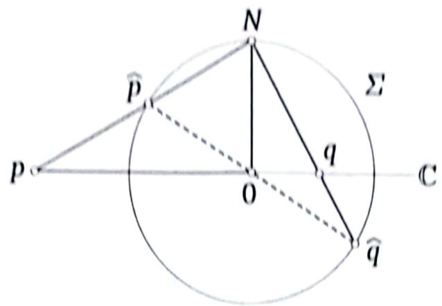  
图7-1 习题7的图

8. 共形("等温")坐标，给定一般  $(u， \nu)$  坐标系的一般曲面的度量公式(4.7)，

$$
\mathrm{d}\widehat{s}^{2} = \Lambda^{2}\mathrm{d}u^{2} + B^{2}\mathrm{d}\nu^{2} + 2F\mathrm{d}u\mathrm{d}\nu ,
$$

我们的目标是求共形的  $(U， V)$  坐标系，使得，如果  $Z = U + \mathrm{i}V$ ，则

$$
\mathrm{d}\widehat{s}^{2} = \Lambda^{2}(\mathrm{d}U^{2} + \mathrm{d}V^{2}) = \Lambda^{2}\mathrm{d}Z\mathrm{d}\overline{Z}.
$$

令  $M = \sqrt{A^{2}B^{2} - F^{2}}$  为从  $(u， \nu)$  地图到曲面上的面积放大因子，从而式(4.11)变成  $\mathrm{d}\Lambda = M\mathrm{d}u\mathrm{d}\nu$ .

(i)证明:度量公式有复因式分解

$$
\mathrm{d}\widehat{s}^{2} = \left[A\mathrm{d}u + \frac{(F + \mathrm{i}M)}{A}\mathrm{d}\nu \right]\left[A\mathrm{d}u + \frac{(F - \mathrm{i}M)}{A}\mathrm{d}\nu \right].
$$

(ii)假设存在复积分因子  $\Omega$  使得

$$
\Omega \left[A\mathrm{d}u + \frac{(F + \mathrm{i}M)}{A}\mathrm{d}\nu \right] = \mathrm{d}U + \mathrm{i}\mathrm{d}V = \mathrm{d}Z.
$$

证明:此时  $(U， V)$  的确是曲面上的共形坐标系

$$
\mathrm{d}\widehat{s}^{2} = \Lambda^{2}(\mathrm{d}U^{2} + \mathrm{d}V^{2}) = \Lambda^{2}\mathrm{d}Z\mathrm{d}\overline{Z}, \quad \text{其中} \quad \Lambda = \frac{1}{|\Omega|}.
$$

(iii)利用  $\mathrm{d}f = (\partial_{u}f)\mathrm{d}u + (\partial_{\nu}f)\mathrm{d}\nu$  证明

$$
\partial_{u}Z = \Omega A \quad \text{且} \quad \partial_{\nu}Z = \Omega \left[\frac{F + \mathrm{i}M}{A}\right].
$$

(iv)证明

$$
[F + \mathrm{i}M]\partial_{u}Z = A^{2}\partial_{\nu}Z.
$$

(v)上式两边乘以  $[F - \mathrm{i}M]$ ，得出

$$
B^{2}\partial_{u}Z = [F - \mathrm{i}M]\partial_{\nu}Z.
$$

(vi)利用复等式的实部和虚部分别相等，推导  $U$  的变化率和  $V$  的变化率之间的如下关系式.

$$
\begin{array}{c c}{{\partial_{u}U=\frac{1}{M}\left[A^{2}\partial_{v}V-F\partial_{u}V\right],}}&{{\qquad\partial_{v}U=\frac{1}{M}\left[F\partial_{v}V-B^{2}\partial_{u}V\right];}}\\ {{\partial_{u}V=\frac{1}{M}\left[F\partial_{u}U-A^{2}\partial_{v}U\right],}}&{{\qquad\partial_{v}V=\frac{1}{M}\left[B^{2}\partial_{u}U-F\partial_{v}U\right].}}\end{array}
$$

(vii)假设  $\partial_{u}\partial_{v}\Phi = \partial_{v}\partial_{u}\Phi = 0$  ，那么  $\Phi = U$  和  $\Phi = V$  都是下述贝尔特拉米- 拉普拉斯方程的解.

$$
\partial_{v}\left[\frac{A^{2}\partial_{v}\Phi - F\partial_{u}\Phi}{M}\right] + \partial_{u}\left[\frac{B^{2}\partial_{u}\Phi - F\partial_{v}\Phi}{M}\right] = 0.
$$

这个方程是椭圆型的.根据椭圆型偏微分方程的一般理论，这个方程肯定有解，从而证实了的确存在共形坐标系!

(viii)设  $(x，y)$  是第二对共形坐标，满足

$$
\mathrm{d}\bar{s} = \lambda^{2}(\mathrm{d}x^{2} + \mathrm{d}y^{2}).
$$

令  $u = x$  和  $\nu = y$  ，证明  $A = B = \lambda$  ，  $F = 0$  ，  $M = \lambda^{2}$  ，利用(vi)证明 $(x + \mathrm{i}y)$  平面和  $(U + \mathrm{i}V)$  平面之间的局部映射是一个伸扭，其特征是著名的柯西- 黎曼方程:

$$
\partial_{x}U = \partial_{y}V,\quad \partial_{y}U = -\partial_{x}V.
$$

(对这些现象的完整讨论请参见《复分析》.)

(ix)在这种情况下，可将贝尔特拉米- 拉普拉斯方程化为拉普拉斯方程:

$$
\partial_{x}^{2}\Phi +\partial_{y}^{2}\Phi = 0.
$$

9. 共形曲率公式，将共形曲率公式(4.16)应用于球面的球极平面投影的度量公式(4.22)，验证  $K = +1 / R^{2}$

10. 阿基米德-兰伯特投影，考虑  $(x，y)$  平面上的矩形  $(0\leqslant x\leqslant 2\pi R， - R\leqslant y\leqslant R)$  ，想象:首先将矩形的左右两边用胶带粘在一起，生成一个高为2R的圆柱面，再将这个圆柱面套在半径为  $R$  的球面外，使得圆柱面紧贴球面的赤道，如图7-2所示，对于球面上每一点，经过该点，作垂直于圆柱面中心轴的水平径向直线，并向外将该点投影到圆柱面上，展开圆柱面，就得到了球面在矩形上的地图，这就是阿基米德-兰伯特投影，约公元前250年，阿基米德就研究过这个投影法，2000多年后，兰伯特重新发现了这个投影法，并

于 1772 年公布于众. 兰伯特的开创性论文是第一个关于地图制作的系统性数学研究， 阐明了该 (投影) 制图法保留了哪些性质不变.

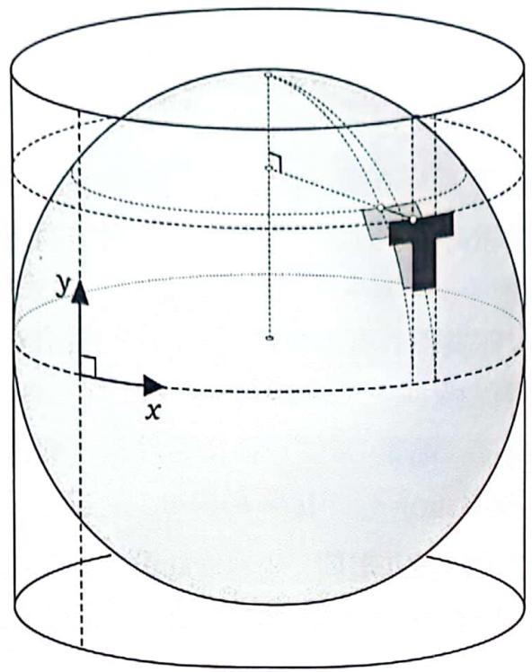  
图 7-2 习题 10 的图

(i) 证明 (最好用几何方法): 这时有球面度量公式

$$
\mathrm{d}\widehat{s}^{2} = \frac{R^{2} - y^{2}}{R^{2}}\mathrm{d}x^{2} + \frac{R^{2}}{R^{2} - y^{2}}\mathrm{d}y^{2}.
$$

(ii) 利用曲率公式 (4.10) 验证  $\mathcal{K} = +1 / R^{2}$ .

(iii) 利用式 (4.12) 证明这个投影是保持面积不变的. 例如， 图 7- 2 中所示的两个 T 形面积相等. 这个结果意味着， 整个球面的面积等于圆柱面的面积， 即最初矩形的面积:  $(2\pi R)(2R) = 4\pi R^{2}$ . 阿基米德对这个结果 (以及体积的相关发现) 感到非常自豪， 请他的朋友将这个图刻在他的墓碑上. 大约一个半世纪之后， 公元前 75 年， 当西塞罗找到阿基米德的墓时， 已经是野草丛生， 但墓碑上的圆柱面和球面仍然清晰可见.

(iv) 利用上面的结果 (不用积分法)， 证明: 球冠  $0 \leqslant \phi \leqslant \Phi$  的面积  $\mathcal{A}$  为

$$
\mathcal{A} = 2\pi R^{2}(1 - \cos \Phi).
$$

11. 圆柱面中心投影. 重新考虑上题中在圆柱面上对球面作图的问题， 这次将圆柱面向上和向下无限延伸. 我们再次将球面投影到圆柱面上， 但这次想象在球心有一个点光源， 投射到圆柱面上. 这就是圆柱面中心投影.

(i) 画出投影示意图，证明:  $y = R \cot \phi$ . ①

(ii) 利用 (i) 的结果，或者直接用几何方法，证明:现在有度量公式

$$
\mathrm{d}\widehat{s}^{2} = \frac{R^{2}}{R^{2} + y^{2}} \mathrm{d}x^{2} + \frac{R^{4}}{(R^{2} + y^{2})^{2}} \mathrm{d}y^{2}.
$$

(iii) 利用曲率公式 (4.10) 验证  $\kappa = +1 / R^{2}$

12. 墨卡托投影. 前两道习题介绍了将球面投影到圆柱面上的两种方法，它们都具有如下两个性质:(1) 经线  $\theta =$  常数)被映射为圆柱面上具有相同  $\theta$  的纵向母线;(2) 纬线圆  $\phi =$  常数)被映射为圆柱面的水平横截圆周. 1569 年，格拉尔杜斯·墨卡托发现了第三种投影法，它也具有这两个性质，而且是头形的，这是其关键优势.

(i) 用几何方法论证，如果  $\delta \widehat{s}$  是球面上沿着纬线圆的微小运动，则上述两个性质蕴涵  $\delta \widehat{s} \simeq \sin \phi \delta s$ ，其中  $\delta s = \delta x$  是圆柱面上的水平运动.

(ii) 为了保证这个地图是共形的，必须保证沿所有方向的无穷小运动的标量因子都相等. 假设  $\delta \widehat{s}$  是沿经线的运动，并记球面上的点  $(\theta ， \phi)$  在圆柱面上的像的高度为  $y = f(\phi)$ ，证明:

$$
f^{\prime}(\phi) = -\frac{R}{\sin\phi}.
$$

(iii) 如果要求赤道上的点都被映射到  $x$  轴上，证明(如果你仍然记得积分技巧，也可以通过计算推导出)墨卡托投影由下式决定:

$$
y = f(\phi) = R \ln \frac{1 + \cos \phi}{\sin \phi}.
$$

(注意:在墨卡托的时代，对数和微积分都是未知的，那么他是怎么做到的?!参见 Hayes et al. (2004， 第 18 章)，这一章是奥塞尔曼写的，写得非常好.)

(iv) 如果你按照固定的罗盘方向驾驶飞机或船只，就会沿着斜驶线航行(见图 6- 5c)，斜驶线也称为恒向线. 把圆柱面展开，平放在桌面上，就得到了一张标准的墨卡托平面航海图. 你的斜驶线在航行图中是什么样的?(提示:无须计算，只利用共形性!)

13. 不可能存在的好地图. 在上面几道习题里， 我们遇到了球面的两个特别的地图， 一个保持面积不变， 另一个保持角不变. 是否存在球面的一个地图， 既保持面积不变， 又保持角不变? 证明: 任何弯曲的曲面都不可能有这样的地图， 不仅仅是球面.

# 伪球面和双曲平面

14. 波利亚关于斯涅尔定律的力学证明. 波利亚 (Pólya， 1954， 第 149-152 页) 提出了如下关于斯涅尔定律的奇妙力学解释， 也为我们提供了思考双曲平面上测地线的另一种思路. 图 7-3 是图 5-6 的修改版， 其中空气和水的界面被替换为一根无摩擦的杆. 杆上有一个可滑动的环  $p$ ， 环上系着两根长度固定的绳子. 如图 7-3 所示， 绳子挂在钉在点  $a_{i}$  的铁钉上， 铁钉是无摩擦的. 绳子系着重物， 重量为  $m_{i}$ . 重物位于  $a_{i}$  正下方， 与其距离为  $h_{i}$ .

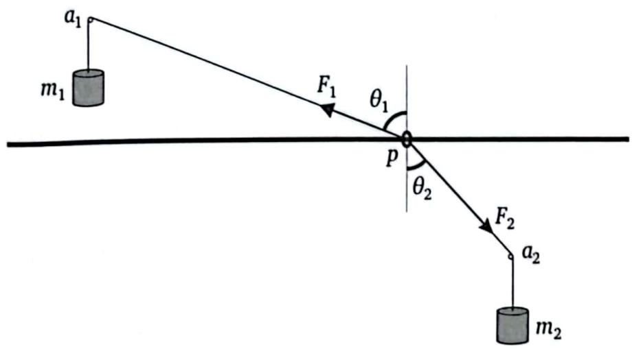  
图7-3 习题14的图

(i) 考虑系统的势能， 证明: 当  $m_{1} h_{1} + m_{2} h_{2}$  取最大值时， 系统达到平衡.

(ii) 当系统达到平衡时， 作用于环的两个拉力  $F_{1}$  和  $F_{2}$  的水平分量相互抵消. 证明:

$$
m_{1} \sin \theta_{1} = m_{2} \sin \theta_{2}.
$$

(iii) 令绳子从点  $a_{i}$  到点  $p$  的长度为  $l_{i}$ ， 则  $l_{i} + h_{i} =$  常数. 取  $m_{i} = (1 / \nu_{i})$ ， 其中  $\nu_{1}$  和  $\nu_{2}$  分别是最初光学问题中光在空气和水中的传播速度. 证明:

(i)中的力学问题变成了最初寻求耗时最少的传播路线的光线问题，具有同样的数学关系式

$$
\frac{l_{1}}{\nu_{1}} +\frac{l_{2}}{\nu_{2}} \text {取最小值.}
$$

(iv)用(ii)中的力学结果证明斯涅尔定律

15. 假设光在  $(x，y)$  平面上的传播速度为  $\nu = 1 / \sqrt{1 - y}$ ， 证明: 测地线是抛物线. 描绘这些抛物线.

16. 曳物线的参数化，我们将空间的  $(X，Y，Z)$  坐标系转换成柱面极坐标系，也就是，在  $(X，Y)$  平面建立通常的  $(r，\theta)$  极坐标系，再补充  $z$  坐标，因此，在柱面极坐标系中的欧几里得度量是

$$
\mathrm{d}s^{2} = \mathrm{d}r^{2} + r^{2}\mathrm{d}\theta^{2} + \mathrm{d}Z^{2}.
$$

在平面  $\theta = 0$  [也就是  $(X，Z)$  平面]上，设质点在时刻  $t$  的位置为

$$
X = r = \operatorname {sech}t, \quad Z = t - \tanh t.
$$

考虑这个质点的轨迹曲线

(i)证明这条曲线就是曳物线:曲线上每个点沿该点的切线到  $z$  轴的距离是固定不变的，这个固定的距离是什么?[注记:要了解用质点运动轨迹表示曳物线的一些有趣历史和漂亮几何，见 Stillwell(2010，第 341-342 页).]

(ii)证明:这条曲线绕  $z$  轴旋转生成的曲面是半径为1的伪球面，曲面的度量公式为

$$
\mathrm{d}\hat{s}^{2} = \tanh^{2}t \mathrm{d}t^{2} + \operatorname {sech}^{2}t \mathrm{d}\theta^{2}.
$$

(iii)利用式(4.10)验证  $\kappa = - 1$

(iv)证明:如果引入新坐标系  $x = \theta$  和  $y = \cosh t$ ，则曲面的度量公式为标准形式(5.7).

17. 球面在柱面极坐标系下的面积公式，在上题中引入的柱面极坐标系下，单位球面的北半球的面积元为

$$
\mathrm{d}\mathcal{A} = \frac{r \mathrm{d}r \mathrm{d}\theta}{\sqrt{1 - r^{2}}}.
$$

(i)通过计算证明这个公式

(ii)利用牛顿最终相等的概念，用几何方法证明这个公式

(iii)用积分计算整个半球面的面积

18. 伪球面具有有限面积. 利用式 (5.5) 和式 (4.12) 证明: 半径为  $R$  的无界伪球面具有有限面积  $2\pi R^{2}$ . 这是惠更斯在 1693 年发现的.

19. 自己做一个伪球面! 准备 10 张纸， 叠成一摞， 沿着三条边把它们钉在一起. 用圆规 (或倒扣的盘子、大碗) 在这摞纸上画出一个最大的圆周， 在圆的中心打孔. 用一把大剪刀， 沿着圆周将这摞纸剪成 10 个完全相同的圆盘， 半径都为  $R$ . 重复上述过程， 得到 20 个完全相同的圆盘.

(i) 在第一个圆盘上剪掉一个很窄的扇形， 把边缘粘到一起， 形成一个很浅的圆锥面. 对剩下的圆盘逐个重复上述步骤， 依次稍微加大剪掉的扇形的角度， 使得形成的圆锥面越来越高、越来越尖. (也可以将所有的圆盘都剪出一个同样的窄缝， 然后将窄缝两边的纸重叠不同的角度并粘在一起形成圆锥面， 这样可能更容易.) 最后粘成的那个细长圆锥面， 应该只用四分之一 (或更小) 面积的圆盘.

(ii) 按照你做圆锥面的次序， 将它们摞起来. 这样， 你就制成了半径为  $R$  的伪球面的一部分. 解释为什么.

(iii) 用同样的思路制作一张圆盘状的"双曲纸". 例如， 如果你能从伪球面上切出一个圆盘， 就做成了. 将剪下的圆盘紧贴在伪球面上， 验证它可以在伪球面上自由移动和旋转. [详细说明见 Henderson (1998， 第 32 页). ]

20. 伪球面上的测地线. 在上题中， 你已经做了一个伪球面模型. 按照步骤 (1.7) 在伪球面模型上用胶带粘出一段典型的测地线， 然后将这段测地线向两个方向延长， 一次延伸一条胶带. 注意伪球面上的测地线向上延伸的奇怪方式: 它螺旋向上延伸了有限距离后， 就调转头螺旋向下延伸.

(i) 利用贝尔特拉米-庞加莱上半平面， 在数学上证明: 只有曳物线母线是无限向上延伸的测地线.

(ii) 设  $L$  是一条典型的测地线，  $\alpha$  是  $L$  在伪球面边缘  $\sigma = 0$  与曳物线母线的夹角，  $\sigma_{\max}$  是  $L$  在伪球面上向上延伸的最大距离. 证明:  $\sigma_{\max} = |\ln \sin \alpha |$ .

21. 共形曲率公式. 证明: 在具有度量 (4.14) 的共形映射的情况下， 一般曲率公式 (4.10) 可简化为式 (4.16).

22. 常曲率旋转曲面. 想象一个质点以单位速率沿  $(x， y)$  平面上的一条曲线运动， 它在时刻  $t$  的位置是  $[x(t)， y(t)]$ . 再想象这个平面绕  $x$  轴旋转的角度为  $\theta$ ， 当  $\theta$  从 0 到  $2\pi$  时， 上面所说的曲线生成一个旋转曲面.

(i) 解释为什么  $\dot{x}^{2} + \dot{y}^{2} = 1$ ， 其中变量上方的点表示关于时间的导数.

(ii) 利用几何方法证明: 曲面上的度量公式为  $\mathrm{d}\hat{s}^{2} = \mathrm{d}t^{2} + y^{2}\mathrm{d}\theta^{2}$ .

(iii) 从式 (4.10) 推导出  $\kappa = - \ddot{y} /y$ .

(iv) 分别求出三种常曲率  $\kappa = 0$  、  $\kappa = +1$  和  $\kappa = - 1$  情况下的通解  $y(t)$ .

(v) 借助 (i) 的结果， 求出质点在这三种情况下的速度.

(vi) 画出上述三种情况的解曲线和由它们旋转生成的曲面， 可以利用计算机. 特别地， 当  $\kappa = +1$  时， 验证确实得到了图 2- 5 所示曲面中的一个. 同样， 当  $\kappa = - 1$  时， 除了伪球面以外， 还有别的曲面， 看起来像两个伪球面在狭窄的颈部被粘在一起.

23. 环面的曲率. 设  $c$  是平面上以点  $o$  为圆心、以  $r$  为半径的圆周，  $l$  是平面上的一条直线， 点  $o$  到直线  $l$  的距离为  $R(>r)$ ， 如图 7-4 所示. 让圆周  $c$  绕直线  $l$  旋转生成环面  $T$ .

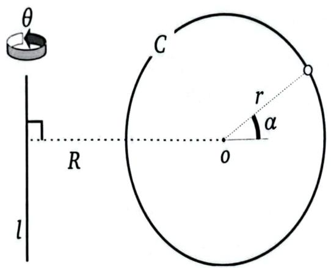  
图7-4 习题23的图

(i) 设  $a$  为图中所示圆周上的旋转角，  $\theta$  为图中所示圆周绕对称轴  $l$  的旋转角， 利用几何方法证明:  $T$  上的度量公式为

$$
\mathrm{d}\hat{s}^{2} = r^{2}\mathrm{d}a^{2} + (R + r\cos \alpha)^{2}\mathrm{d}\theta^{2}.
$$

(ii) 利用式 (4.10) 证明: 环面的曲率为

$$
\kappa = \frac{1}{r(r + R\sec\alpha)}.
$$

(iii) 画出  $\sec \alpha$  的图像， 再画出  $(r + R\sec \alpha)$  的图像， 最后画出  $\kappa$  的图像， 由此验证这个  $\kappa$  的公式与从图 2- 2 得到的经验结果一致.

(iv) 在环面  $T$  上的何处  $\kappa = 0$ ? 利用上述公式验证这个结果.

(v) 从上述公式可知  $\lim_{R \to \infty} \mathcal{K} = 0$ . 给出这个结果的几何解释.

(vi) 利用式 (4.12) 求出整个环面  $T$  的面积.

(vii) 验证你的面积公式与帕普斯重心定理是一致的. (如果你以前没有学过这个定理， 找本有相关内容的书读读， 或在网上查阅.)

(viii) 证明环面的总曲率为零:

$$
\oint_{T} \mathcal{K} \mathrm{~d} A = 0.
$$

在第三幕， 你将明白这个结果并不意外.

# 等距变换和复数

24.  $z^{m}$  的伸扭. 推广图 4-6 中的几何论证， 证明  $z^{m}$  的伸扭由  $(z^{m})' = m z^{m - 1}$  (这个公式与实函数的导数公式一样) 决定. 现在我们明白这为什么是对的.

25. 贝尔特拉米-庞加莱圆盘的度量. 由图 6-4 可知默比乌斯变换可以将半平面映射成圆盘. 稍后我们将说明， 将图 5-12 所示的  $\mathbb{H}^{2}$  的上半平面模型映射到图 5-11 所示的  $\mathbb{H}^{2}$  的圆盘模型的， 正是如下这个特定的默比乌斯变换:

$$
z \mapsto w = D(z) = \frac{\mathrm{i} z + 1}{z + \mathrm{i}}.
$$

为了推导圆盘模型的度量公式 (5.15)， 考虑 (在半平面模型中的) 从  $z$  出发的无穷小向量  $\mathrm{d} z$  被伸扭成 (在圆盘模型中) 从  $w$  出发的无穷小向量  $\mathrm{d} w = D'(z) \mathrm{~d} z$  的过程. 根据定义， 向量  $\mathrm{d} w$  的双曲长度  $\mathrm{d} \widehat{s}$  就是  $\mathrm{d} z$  的双曲长度. 证明:

$$
\frac{2 \left| \mathrm{d} w \right|}{1 - |w|^{2}} = \frac{| \mathrm{d} z|}{\mathrm{Im} z} = \mathrm{d} \widehat{s},
$$

从而证明式 (5.15).

26. 贝尔特拉米-庞加莱圆盘的曲率. 利用共形曲率公式 (4.16) 证明: 图 5-11 所示度量为 (5.15) 的贝尔特拉米-庞加莱圆盘具有常负曲率  $\mathcal{K} = -1$ .

27. 黎曼球面的默比乌斯旋转. 黎曼球面的每一个旋转都是形如式 (6.10) 的默比乌斯变换， 我们的目的是要为这个命题提供一个构作性的半几何证明. 我们的方法与威尔逊之前发表的方法 (Wilson， 2008， 第 42-44 页) 基本相同. (注

意:对应的矩阵群记为SU(2):这里的"S"来自special"的首字母，意思是正规化的，也就是它的行列式等于1;"U"来自"unitary"的首字母;"2"表示  $2\times 2$  矩阵).令  $R_{z}^{\theta}$  表示黎曼球面在  $(X，Y，Z)$  空间中绕正半  $z$  轴顺时针旋转  $\theta$  ，所以  $R_{z}^{\theta}(z) = \mathrm{e}^{\mathrm{i}\theta}z$

(i)求群SU(2)中表示  $R_{z}^{\theta}$  的矩阵  $\left[R_{z}^{\theta}\right]$

(ii)说明为什么结果(6.6)可以表示为

$$
\left[R_{X}^{\pi}\right] = \pm \left[ \begin{array}{cc}0 & \mathrm{i} \\ \mathrm{i} & 0 \end{array} \right] \in SU(2).
$$

(iii)参考式(4.24)，用图示说明对应于  $R_{X}^{(\pi /2)}$  的复映射是

$$
z = \frac{X + \mathrm{i}Y}{1 - Z} \longmapsto R_{X}^{(\pi /2)}(z) = \frac{X - \mathrm{i}Z}{1 - Y}.
$$

(iv)验证  $R_{X}^{(\pi /2)}(z)$  事实上是默比乌斯变换，假设它是默比乌斯变换，猜猜它的形式，用图示验证  $\mathrm{- i} \mapsto 0$  ，因此，分子一定是  $(z + \mathrm{i})$  乘以常数.同样，通过寻找旋转到北极的点来确定分母.这就得到表示  $R_{X}^{(\pi /2)}(z)$  的分式函数.再令  $0 \mapsto \mathrm{i}$  ，确定这个分式函数的常数因子.所以，如果  $R_{X}^{(\pi /2)}(z)$  是默比乌斯变换，那么它只能是

$$
R_{X}^{(\pi /2)}(z) = \frac{z + \mathrm{i}}{\mathrm{i}z + 1}.
$$

(v)验证  $R_{X}^{(\pi /2)}(z)$  满足(iii)中的等式，从而证明它确实具有(iv)中的形式.(提示:在(iv)中让分子分母同乘以  $(X - \mathrm{i}Z)$  ，但只展开分母的乘法，在分母的计算结果中利用  $X^{2} + Y^{2} + Z^{2} = 1$  就得到了(iii)中的等式.)

(vi)证明:在群SU(2)中，  $R_{X}^{(\pi /2)}(z)$  可以表示为

$$
\left[R_{X}^{(\pi /2)}\right] = \frac{1}{\sqrt{2}} \left[ \begin{array}{cc}1 & \mathrm{i} \\ \mathrm{i} & 1 \end{array} \right].
$$

(vii)用几何语言解释为什么  $\left[R_{X}^{(\pi /2)}\right]^{2} = \left[R_{X}^{\pi}\right]$  ，并用直接计算验证这个等式.

(viii)用几何语言解释为什么对于任意角  $\alpha$  有

$$
\left[R_{Y}^{\alpha}\right] = \left[R_{X}^{-(\pi /2)}\right]\left[R_{Z}^{\alpha}\right]\left[R_{X}^{(\pi /2)}\right],
$$

并论证  $\left[R_{Y}^{\alpha}\right] \in SU(2)$

(ix)最后，考虑绕任意轴  $A$  的一般旋转.先将  $A$  旋转到  $(X，Y)$  平面上，再将  $A$  旋转到  $Y$  轴，证明这个旋转可以表示为群SU(2)中的矩阵，从而得出结论.

28.  $\mathbf{H}^{2}$  在  $\mathbf{H}^{3}$  中的度量. 我们已经知道，  $\mathbb{H}^{3}$  中典型的双曲平面是球心位于天际面的半球面， 度量公式可以表示为式(6.24). 现在探讨度量公式的不同形式.

(i) 定义  $u \equiv \tan \phi$ ， 证明: 度量公式 (6.24) 变成

$$
\mathrm{d}\widehat{s}^{2} = u^{2}\mathrm{d}\theta^{2} + \frac{\mathrm{d}u^{2}}{1 + u^{2}}.
$$

并利用式(4.10)验证  $\kappa = - 1$

(ii) 用  $u \equiv 1 / \sinh \xi$  定义新自变量  $\xi$ ， 证明 (i) 中的度量公式变为共形的:

$$
\mathrm{d}\widehat{s}^{2} = \frac{\mathrm{d}\theta^{2} + \mathrm{d}\xi^{2}}{\sinh^{2}\xi},
$$

并利用式(4.16)验证  $\kappa = - 1$

(iii) 最后， 求从  $(\theta ， \xi)$  平面到  $(x， y)$  平面的共形映射， 使得 (ii) 中的共形双曲度量公式取标准形式 (5.7):

$$
\mathrm{d}\widehat{s}^{2} = \frac{\mathrm{d}x^{2} + \mathrm{d}y^{2}}{y^{2}}.
$$

(提示: 令  $\mathrm{d}y / y = \mathrm{d}\xi /\sinh \xi$ .)

29. 在  $\mathbf{H}^{3}$  中的半球面  $\mathbf{H}^{2}$  的曲率. 利用曲率公式 (4.10) 证明: 在  $\mathbb{H}^{3}$  中， 球心位于天际面的半球面按照度量公式 (6.24) 的确是双曲平面  $\mathbb{H}^{2}$ ， 也就是具有负的常曲率  $\kappa = -1$ .

30. 极限球面: 度量和曲率. 我们已经知道，  $\mathbb{H}^{3}$  中典型的极限球面表现为在天际面  $\mathbb{C}$  上的球面. 参考度量公式 (6.24) 的推导过程， 证明: 这样一个极限球面的度量公式为

$$
\mathrm{d}\widehat{s}^{2} = \frac{\sin^{2}\phi \mathrm{d}\theta^{2} + \mathrm{d}\phi^{2}}{(1 + \cos\phi)^{2}}.
$$

利用曲率公式 (4.10) 验证极限球面的内蕴几何是欧几里得平面:  $\kappa = 0$ .

31.  $\mathbb{H}^{3}$  中的球面. 考虑位于  $\mathbb{H}^{3}$  天际面上方、半径为  $R$ ， 中心高度为  $kR$  的欧几里得球面. 参考度量公式 (6.24) 的推导过程， 证明: 这个球面的度量公式为

$$
\mathrm{d}\widehat{s}^{2} = \frac{\sin^{2}\phi \mathrm{d}\theta^{2} + \mathrm{d}\phi^{2}}{(k + \cos\phi)^{2}}.
$$

利用曲率公式 (4.10) 验证正文中的论断: 如果这个球面完全在天际面的上方 (也就是  $k > 1$ )， 那么这个曲面本质上是真正的球面， 具有正的常曲率  $\kappa = k^{2} - 1$ . (注意: 前面两题的结论分别是本题当  $k = 0$  和  $k = 1$  时的特殊情况.)

32. 极限球面的度量. 可以用另一种方法得到习题 30 的结论. 定义坐标  $r$  满足

$$
\mathrm{d}r = \frac{\mathrm{d}\phi}{1 + \cos\phi}.
$$

证明:极限球面的度量公式(见习题30)可以写成  $\mathrm{d}\bar{s}^{2} = \mathrm{d}r^{2} + r^{2}\mathrm{d}\theta^{2}$ ，这就是欧几里得平面的极坐标度量公式.

33. 彭罗斯用复数直接标记光线的方法，在正文中，借助黎曼球面，通过球极平面投影，就可以用复数来标记光线，罗杰·彭罗斯爵士(参见Penrose and Rindler，1984，第1卷，第13页)发现了另一种非凡的方法，将光线与复数直接关联起来，设点  $p$  位于复平面(天际面)的原点正上方一个单位，现在想象，从点  $p$  发射一束闪光，同时，复平面  $\mathbf{c}$  以光速  $(= 1)$  向上(沿  $\phi = 0$  的方向)向着点  $p$  运动，(你可以想象整个平面向上飞速运动，产生平面波.)将从点  $p$  沿方向  $(\theta ，\phi)$  发射出来的光子  $F$  的速度分解成垂直和平行于  $\mathbf{c}$  的分量，求出光子  $F$  撤到  $\mathbf{c}$  的时间，证明光子  $F$  在点  $z = \cot (\phi /2)\mathrm{e}^{\mathrm{i}\theta}$  处撞到  $\mathbf{c}$  ，因此，彭罗斯的构作方法等价于球极平面投影法!

34. 爱因斯坦的像差公式，回顾狭义相对论:沿着  $z$  轴的"上升"产生洛伦茨变换公式，

$$
\widetilde{T} = \frac{T + \nu Z}{\sqrt{1 - \nu^{2}}},\quad \widetilde{X} = X,\quad \widetilde{Y} = Y,\quad \widetilde{Z} = \frac{Z + \nu T}{\sqrt{1 - \nu^{2}}}.
$$

(i)证明这个变换可以改写成

$$
\widetilde{T} +\widetilde{Z} = \rho (T + Z),\quad \widetilde{X} = X,\quad \widetilde{Y} = Y,\quad \widetilde{T} -\widetilde{Z} = (1 / \rho)(T - Z),
$$

其中

$$
\rho = \sqrt{\frac{1 + \nu}{1 - \nu}}.
$$

(ii)利用式(6.19)证明:这个上升可以用一个旋量变换表示，

$$
\left[ \begin{array}{c}\widetilde{s}_{1} \\ \widetilde{s}_{2} \end{array} \right] = \left[ \begin{array}{cc}\sqrt{\rho} & 0 \\ 0 & 1 / \sqrt{\rho} \end{array} \right]\left[ \begin{array}{c}\dot{s}_{1} \\ \dot{s}_{2} \end{array} \right].
$$

(iii)因此，这就验证了图6- 5b和式(6.21)声称的结论

(iv)如果在启动宇宙飞船的发动机之前，星星出现的方向为  $(\theta ，\phi)$  ，当你沿着方向  $\phi = 0$  上升的速度达到  $\nu$  时，星星出现的新方向为  $(\theta ，\overline{{\phi}})$  满足

$$
\cot {\frac{\widetilde{\phi}}{2}} = \rho \cot {\frac{\phi}{2}},
$$

1905年，爱因斯坦发现了这个更优雅、更令人难忘的标准像差公式.

(v)论证星场表现得像要一起聚集到北极，也就是，朝着你前进的方向.

(vi)当宇宙飞船的速度接近光速时，星场会发生什么?(!)