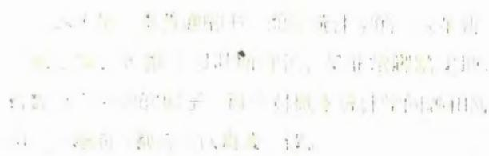
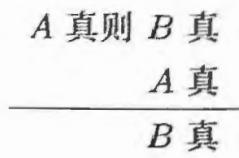

# 概率论沉思录

[美] 埃德温·汤普森·杰恩斯（E. T. Jaynes）/ 著  廖海仁/译

NAMNou

概率论作为逻辑的延伸, 是所有科学推断的基础。杰恩斯表明, 概率论的应用范围远比传统频率派所设定的要广泛。本书收集了概率统计的各种线索, 将概率论和统计推断融合, 简洁统一, 生动地讨论了其在数学、物理学、经济学、化学、生物学中的广泛应用, 揭开了众多悖论背后的玄机。尤其关注贝叶斯理论, 证明了当概率和客观频率之间存在对应关系时, 贝叶斯概率分布总会平滑地转化为客观频率分布。

本书内容全面, 附有大量练习, 适合涉及数据分析的各领域工作者阅读, 也可作为相关专业课程的教科书和参考书。

# 图书在版编目(CIP)数据

概率论沉思录/(美)埃德温·汤普森·杰恩斯著; 摩海仁译. - - 北京:人民邮电出版社,2024.6

(图灵数学经典)

ISBN978- 7- 115- 64336- 0

I.①概… II.①埃…②廖… III.①概率论 IV.③O211

中国国家版本馆CIP数据核字(2024)第086548号

# 内容提要

本书将概率论和统计推断融合在一起,用新的观点生动地描述了概率论在物理学、数学、经济学、化学和生物学等领域中的广泛应用,特别阐述了贝叶斯理论的丰富应用,弥补了其他概率论和统计学教材的不足,全书分为两部分:第一部分包括10章,讲解抽样理论、假设检验、参数估计等概率论的原理及其初级应用;第二部分包括12章,讲解概率论的高级应用,如在物理测量、通信理论中的应用,本书还附有大量习题,内容全面,体例完整。

本书内容不局限于某一特定领域,适合涉及数据分析的各领域工作者阅读,也可作为本科生和研究生相关课程的教材。

著 [美]埃德温·汤普森·杰恩斯(E.T.Jaynes)

译 摩海仁

责任编辑 杨琳

责任印制 胡南

人民邮电出版社出版发行 北京市丰台区成寿寺路11号

邮编100164 电子邮件315@ptpress.com.cn

网址https://www.ptpress.com.cn

三河市中晟雅豪印务有限公司印刷

开本:  $700\times 1000$  1/16

印张:47.5 2024年6月第1版

字数:905千字 2024年6月河北第1次印刷

著作权合同登记号图字:01- 2020- 0431号

定价:179.80元

读者服务热线:(010)84084456- 6009印装质量热线:(010)81055316

反盗版热线:(010)81055315

广告经营许可证:京东市监广登字20170147号

# /埃德温·汤普森·杰恩斯/

E.T.Jaynes

1922—1998，著名数学物理学家，曾任圣路易斯华盛顿大学和斯坦福大学教授，在统计力学和概率统计推断方面有杰出贡献。1957年发表了热力学的最大熵解释。1963年与弗雷德·卡明斯一起以完全量子化的方式模拟了电磁场中二能级原子的演化，该模型称为杰恩斯- 卡明斯模型。杰恩斯大力提倡将概率论解释为逻辑的延伸。

# /廖海仁/

Liao Hairen

本科毕业于清华大学物理系，北京大学空间物理学硕士。中国第22次南极科学考察队队员，曾在南极中山站越冬4个月。目前从事机器学习算法研发工作，2013年全球RTB广告DSP算法大赛主要组织者之一。

# 概率论沉思录

[美] 埃德温·汤普森·杰恩斯（E. T. Jaynes）著廖海仁/译

人民邮电出版社北京

# 版权声明

This is a Simplified Chinese edition of the following title published by Cambridge University Press:

Probability Theory: The Logic of Science (9780521592710)

© E. T. Jaynes 2003

This Simplified Chinese edition for the People's Republic of China (excluding Hong Kong. Macau and Taiwan) is published by arrangement with the Press Syndicate of the University of Cambridge, Cambridge, United Kingdom.

POSTS & TELECOM PRESS 2024

This Simplified Chinese edition is authorized for sale in the People's Republic of China (excluding Hong Kong, Macau and Taiwan) only. Unauthorised export of this Simplified Chinese edition is a violation of the Copyright Act. No part of this publication may be reproduced or distributed by any means, or stored in a database or retrieval system, without the prior written permission of Cambridge University Press and POSTS & TELECOM PRESS.

Copies of this book sold without a Cambridge University Press sticker on the cover are unauthorized and illegal.

本书封面贴有 Cambridge University Press 防伪标签, 无标签者不得销售.

本书简体中文版由 E. T. Jaynes 授权人民邮电出版社有限公司独家出版, 并仅限在中华人民共和国境内 (不包括香港特别行政区、澳门特别行政区及台湾省) 销售.

未经出版者事先书面许可, 不得以任何方式或途径复制或传播本书内容.

版权所有, 侵权必究.

谨以此书献给并纪念看到真理且将其记录、保存下来的哈罗德·杰弗里斯爵士

# 编者序

埃德温·汤普森·杰恩斯于1998年4月30日去世。去世之前，他请我帮助完成并出版他的这本概率论著作。我为此苦恼了一段时间，因为我知道杰恩斯希望完成本书，这一点毫无疑问。遗憾的是，后面大部分章节（杰恩斯设想的关于应用的第二部分）要么缺失，要么不完整，而且前面的一些章节中也有缺失的片段。我本可以写完后面的章节并填补缺失的片段，但是，如果我这么做，本书就不再是杰恩斯的著作，而是杰恩斯和布雷特索斯特的合著作品，并且无法分辨哪些文字出自哪位作者。最后，我决定让有缺陷的章节保持原状——本书仍是杰恩斯的著作。

有许多不同长度的缺失片段，杰恩斯是通过插入“未完待续”来标识的。我本可以在正文中留下这些标识，但是这将使本书显得很难看且很不完整。杰恩斯希望本书既可以充当参考书也可以充当教科书，因此在大多数章节中散布着问题框（练习）．最终，我决定引入“新编练习”来代替“未完待续”．如果你能回答这些问题，就说明已经掌握了缺失的内容。

杰恩斯曾想在书中保留一系列实现某些计算过程的计算机程序．我原本也打算在书中保留这些程序，但是，随着时间的推移，许多程序显然已经不再可用：它们是用BASIC语言以一种非常晦涩的方式写成的（不是BASIC晦涩，而是程序本身晦涩）因此，我删除了这些程序，并在必要时插入了几句话，以引导人们使用必要的软件工具来实现计算

书中还缺少许多参考资料信息，必须补充．通常，通过作者和日期可以找到一个或多个可能的参考资料．当有多个候选资料，而我又无法确定杰恩斯引用的是哪一个时，我就会列出多个参考资料并修改引文．有时候信息非常模糊，以至于找不到合适的候选资料．幸运的是，我能够删除这些引文而不产生不利影响．为了使读者能够区分引用材料和其他资料来源，杰恩斯带注释的原始参考资料分为两部分：引用文献（reference list）和参考文献（bibliography）

虽然我是本书出版的主要负责人，但并不是唯一付出努力的人。杰恩斯的些挚友帮助我完成了这项工作，其中包括Tom Grandy、Ray Smith、Tom Loredo、Myron Tribus 和John Skilling，我要感谢他们的帮助。我还要感谢Joe Ackerman允许我抽出大量时间来悉心出版本书。

G.拉里·布雷特索斯特

# 前言

本书的读者应该:(1)熟悉应用数学,具有相关专业本科高年级及以上文化程度;(2)了解需要进行推断的某一学科,如物理学、化学、生物学、地质学、医学、经济学、社会学、工程学、运筹学等,学习本书不需要事先熟悉概率论与统计学,事实上,对这一领域知之甚少或许更理想,因为这样需要抛弃的固有观念会较少.

我们关注的是概率论及其所有常规数学知识,不过审视视角比标准教科书更广,第1章之后的每一章中都有一些新结论,我们认为这些结论是有趣且有用的.书中的许多应用超出了传统概率论的范畴,但是我们认为其结论不言而喻,它们阐述的理论将成为未来的"传统概率论"内容.

# 历史

本书是我的思想多年演化的产物,我对概率论的兴趣最初来自阅读哈罗德杰弗里斯的著作(HaroldJeffreys,1939)我意识到他的观点能让我们以一种与众不同的视角看待理论物理学的所有问题,随后,考克斯(R.T.Cox,1946)香农(Shannon,1948)和波利亚(Polya,1954)的著作陆续为我开启了新思想的一扇扇大门,我对这些探索的兴趣持续了大约40年之久,在这个更加广阔、永恒的理性思维世界中,理论物理学的当前问题似乎只是短期内的细枝末节.

本书的写作其实源于1956年在斯坦福大学举办的一系列讲座的笔记,这些讲座的目的是讲解波利亚关于"数学与合情推理"的令人振奋的新著作,他将我们直观的"常识"分解为一组基本的定性条件,并且表明:数学家一直在使用它们来引导发现的过程,而且这种引导必然发生在找到严格证明之前,这些结果很像詹姆斯·伯努利的《猜度术》(JamesBernoulli,1713)中古典概率论的内容,在它的基础上,拉普拉斯在18世纪晚期发展出了分析概率论,但是波利亚认为

这种相似性只是定性的。

波利亚对这种定性一致性做出了完整而详尽的展示, 说明合情推理与概率论之间一定存在更多联系。幸运的是, 应用考克斯的一致性定理足以证明这一点。将波利亚的定性条件与考克斯的一致性定理结合起来就能证明: 如果合情程度由实数表示, 那么只能确定唯一一套用于推断的定性规则。也就是说, 与其矛盾的任何其他规则都必然会违反一条基本的合理性条件或者一致性原则。

但是, 最终结果只是丹尼尔·伯努利和拉普拉斯已经得出的概率论的标准规则。那又有什么值得大惊小怪的呢? 这里重要的新特征是: 这些规则现在被视为唯一有效的一般性逻辑原则, 不涉及"偶然性"或"随机变量"。因此, 它们的应用范围远远大于20世纪早期发展起来的传统概率论。结果就是, "概率论"与"统计推断"之间的假想区别消失了, 该领域不仅实现了逻辑上的统一性和简单性, 而且在应用中有更强的效力与灵活性。

因此, 这些讲座把重点放在推演波利亚观点的定量规则上, 以便将该规则用于科学推断的一般性问题。几乎所有的推断问题都产生于不完全的信息, 而非"随机性"。第5章将介绍波利亚的生平及这项工作是如何开始的。

一旦涉及应用, 哈罗德·杰弗里斯的著作就又成为我关注的焦点。他凭着直觉获得了许多洞见, 并且几乎预见了我后来遇到的每一个问题。本书的献词只是我对他的感激之情的部分体现。对他著作的更多评论及其对我的影响分散在多个章节中。

1957~1970年, 这些讲座不断在其他许多大学和研究实验室举办, 内容不断增加。在这一过程中, 人们逐渐明白, 传统的"统计推断"的突出困难很容易被理解和克服。但是, 取而代之的规则在概念上非常微妙, 需要深入思考才能明白如何正确运用。人们过去认为运用拉普拉斯的概率论方法会导致某些不可克服的困难, 从而拒绝这些方法。他们最终明白这些困难只是由误用概率论方法造成的, 通常是因为没有明确地定义问题或者没有意识到看似微不足道的信息存在重要的影响。一旦意识到这一点, 原先的困难就很容易被克服。我们的"扩展逻辑"方法与通常的"随机变量"方法之间的各种关系以不同的形式出现在几乎每一章中。

最终, 我积累的材料多到无法被囊括在一系列简短的讲座中, 本书的用途也演化到了教学之外。在克服原有困难之后, 我们发现已经有了处理新问题的强大工具。大约自1970年以来, 材料一直在以同样的速度增加, 但是主要来自我及同事的研究活动。我们希望本书的最终版本能体现材料来源的多样性, 既可用作教

科书,也可川作参考书.事实上,我的好儿批学生已经把川川儿个版本的笔记传授给了他们的学生.

综上所述,我们在这里引用查尔斯·达尔文在《物种起源》绪论中所写的话:"我希望读者原谅我赘述这些个人的细枝末节,我只是想借此说明,我未曾仓促立论而已."人们可能会认为30年前的著作在今天已经过时了.幸运的是,杰弗里斯、波利亚和考克斯的著作是基础性且永恒的,其中的真理并不随着时间而改变,其重要性反而会随着时间的推移而上升.他们对于推断本质的洞察在30年前只是令人好奇,而今在几个科学领域中愈显重要,并会在未来100年的所有领域中都至关重要.

# 基础

凭借多年将概率论应用于数以百计实际问题的经验,我们对概率论基础的看法已经变得非常复杂,不能简单地使用"是此非彼"这样的词语来表述.比如,我们的概率系统在风格、哲学和目标上都与柯尔莫哥洛夫系统截然不同.我们认为"通过分析不完全信息的逻辑来分配概率的原则"在概率论中占至少一半的比重,而这一原则在柯尔莫哥洛夫系统中根本不存在.

我们最终却惊讶地发现,我们几乎在所有技术问题上都与柯尔莫哥洛夫一致,与其批评者不一致.正如附录A所述,针对所有实际目标,柯尔莫哥洛夫系统的每个公理都可以从波利亚和考克斯的合理性和一致性条件中导出.简而言之,我们认为我们的概率系统与柯尔莫哥洛夫系统并不矛盾,只是在寻求更深厚的逻辑基础,使其朝着现代应用所需要的方向扩展.在这一努力过程中,许多问题已经解决,那些尚未解决的问题将成为开拓新领域的契机.

又比如,似乎每个人乍一看都认为我们的系统与德菲内蒂概率系统非常接近.事实上我也曾这样认为.但是最终我们同样惊讶地发现,两者之间只存在些许松散的哲学一致性.在许多技术问题上,我们与德菲内蒂持截然不同的观点.在我们看来,他对于无限集合的处理方式打开了一个潘多拉魔盒,其中充满无用、不必要的悖论.非聚集性与有限可加性的示例将在第15章中讨论.

无限集合的悖论如今已呈病态式扩散,以致威胁到概率论的根基,需要立即通过"手术"剔除.我们的系统在"手术"后会自动避免这种悖论.正确应用我们的基本规则不会产生这种悖论,因为这些规则只适用于有限集合,以及产生于有明确定义和良好表现的有限集合极限的无限集合.这种悖论的产生是由于:(1)不指定任何极限过程就直接定义无限集合的性质;(2)对于无限集合提出依赖于如

何取极限的问题.

例如，对于“一个整数是偶数的概率是多少”这个问题，答案可以是开区间（0.1）中的任何一个实数，这取决于使用什么极限过程来定义“所有整数的集合”（正如条件收敛的数列可以根据各项的排列顺序收敛到任一数值）

在我们看来，至少在概率论中，无限集合根本不能说真实“存在”或者说拥有任何数学性质——除非我们已经指定了从有限集合生成它的极限过程。换句话说，我们在高斯、克罗内克和庞加莱的旗帜下航行，而不是在康托尔、希尔伯特和布尔巴基的旗帜下。我们希望那些对此感到震惊的读者能研读数学家莫里斯·克莱因的著作（Morris Kline，1980），了解他对布尔巴基主义的控诉，然后耐心地阅读本书，从而看到我们的方法的优势。这种例子散见于本书的每一章。

# 比较

许多年来，一直存在着“频率派”与“贝叶斯”推断方法之争，而我一直是贝叶斯一方的公开支持者。截至1981年的情况记录在早期的一本书（Jaynes，1983）中。在这类早期的著作中，双方都有一种强烈的倾向，就是在哲学或意识形态层面进行争论。我们现在不再这样做了，因为我们拥有已证明的定理以及大量示例，已经不再需要诉诸这样的论证。贝叶斯方法的优越性现已在上百个领域中得到充分验证。人们可以与哲学争论，却不能与计算机的输出结果争论。这种输出结果对我们说：“无论你们的哲学如何，这是实际执行的结果。”只要两种方法的最终结果存在显著差异，我们就会在书中详细指出。因此，我们将继续为贝叶斯方法热情辩护，但需要提醒读者注意的是，现在的论证手段是引用事实，而不是宣称哲学或意识形态方面的优越性。

然而，无论是贝叶斯方法还是频率派方法，都不是普遍适用的。因此，在这本一般性的著作中，我们采用一种更广阔的视角。我们的主题很简单：作为扩展逻辑的概率论。这一新的认知相当于意识到概率论的数学规则不仅仅是计算“随机变量”频率的规则，它们也是进行任何形式的推断（即合情推理）的唯一一致性规则，必须得到广泛的应用。

确实，所有贝叶斯计算方法都自动归属于我们规则的特殊情况，所有频率派计算方法也是如此。然而，我们的基本规则比这两者中的任何一个都更广泛。在许多应用中，我们的计算方法不属于两种派别中任何一派的范畴。

我们目前看到的情况是：只使用抽样分布的传统的频率派方法只对许多特别简单、理想化的问题适用．它们代表了概率论中最少见的特殊情形，因为它们预先假设了在实际问题中很难满足的条件（独立重复随机试验，但没有相关的先验

信息）这种方法难以满足科学的实际需求。

信息）这种方法难以满足科学的实际需求。此外，频率派方法没有提供消除冗余参数或考虑先验信息的技术手段，在没有充分统计量或从属统计量时甚至不能使用数据中的所有信息。由于缺乏必要的理论原则，人们被迫根据直觉而不是概率论选择一个统计量，然后被迫发明了在概率论规则中并不存在的特定工具（如无偏估计、置信区间、尾区显著性检验等）每个特定工具都可以在它所为之发明的小范围内使用。但是，正如考克斯定理所确定的那样，这种随意的工具在应用于极端情况时总会导致不一致甚至荒谬的结论。我们将看到许多这样的示例。

频率派方法的这些错误都可以使用贝叶斯方法纠正，贝叶斯方法适于解决“完善”（well- developed）的推断问题。正如哈罗德·杰弗里斯阐明的那样，它们拥有一流的分析工具，能够毫不费力地处理令频率派方法失效的技术难题。它们能自动确定最佳估计量和算法，同时考虑先验信息，并允许合理使用冗余参数，即使在极端的情况下也会继续产生合情的结果而不会失效。因此，它们使我们能够解决甚至无法使用频率派术语讨论的复杂问题。我们的主要目标之一是说明所有这些功能如何包含在作为扩展逻辑的概率论的简单规则之中，而不需要——事实上也没有空间——使用任何特定工具。

在使用贝叶斯方法之前，一个问题必须从“探索阶段”演化到具有足够的结构来确定所有需要的工具（模型、样本空间、假设空间、先验概率、抽样分布）几乎所有的科学问题都一定会经历一个有推断需求的初始探索阶段。这时，频率派的假设是无效的，而贝叶斯工具还不可用。实际上，某些问题永远不会从探索阶段演化到下一步。这个阶段的问题需要从不完全的信息中分配概率的更基础方法。

为达到这一目标，最大原理提供了目前最清晰的理论依据，最大方法在计算上高度发展，也带有一个与贝叶斯方法一样强大且通用的分析工具，为了使用最大原理，我们必须定义样本空间，但不需要模型或抽样分布，实际上，最大化会从数据中为我们生成一个模型，这个模型在许多不同的标准评估下都

是最优的. 因此, 在存在样本空间而没有模型的情况下使用最大熵原理, 何乐而不为呢?

贝叶斯和最大熵方法在另一个方面也有不同. 两种方法都能根据已知信息获得最优的推断, 但是我们可以为贝叶斯方法选择一个模型, 以表达某些关于所观察现象的先验知识或者可行的假设. 通常, 这种假设超出了数据中可直接观察的范围, 在这种意义上, 我们可以说贝叶斯方法是 (或者至少可能是) 推测性的. 如果额外的假设是正确的, 那么我们期望贝叶斯方法的结果将改进最大熵方法; 如果额外假设是错误的, 贝叶斯推断则可能会比最大熵方法更糟.

最大熵是一种非推测性过程, 因为它在样本空间和可用数据的证据之外不做任何假设. 因此, 它只预测可观测的事实 (未来或过去的观测值的函数) 而不是可能只在我们的想象中存在的参数值. 正是出于这一原因, 当我们对原始数据之外的知识所知甚少时, 最大熵是适当的 (最安全的) 工具. 它可以使我们避免得出基于数据本身无法保证的结论. 但是, 当信息非常模糊, 甚至可能难以定义适当的样本空间时, 人们能否找到比最大熵更基础的原理呢? 这里还有很多运用创造性思维的空间.

目前, 在许多重要且非凡的应用实例中, 最大熵是我们需要的唯一工具. 本书的第二部分将详细探讨这些内容. 通常, 它们比第一部分的一般性应用需要更多的领域内专业知识. 例如, 所有的统计力学应用都是如此, 当前非常成功的最大熵谱分析和图像重建算法也是如此. 然而, 我们认为, 当知道合适的模型和假设空间从而能融入更多先验信息时, 后两种应用将演变为适合使用贝叶斯方法的情况.

我们有许多理论内容需要解释, 所以没有花很多笔墨用于举例. 幸运的是, 有三本书在很大程度上弥补了这一缺陷, 应该视为本书的补充材料: Bayesian Spectrum Analysis and Parameter Estimation (Bretthorst, 1988)、Maximum Entropy in Action (Buck & Macaulay, 1991) 和 Data Analysis - A Bayesian Tutorial (Sivia, 1996). 这三本书中的观点与我们的观点一致, 并包含大量数值示例. 当然, 这些著作没有本书中这么多的理论内容. 此外, 1981 年以来的年度最大熵研讨会 (MAXENT workshops) 的会议公报汇集了大量有用的应用实例.

# 心理活动

正如人们从波利亚的例子中预期的那样, 作为扩展逻辑的概率论再现了人类心理活动的许多方面, 有时展示出了令人惊讶甚至不安的细节. 在第 5 章, 我们的方程式展现了一个人说真话但不被相信的现象. 其中, 尽管倾听者一直在进行一致性推理, 但这个推理使他不相信对方说了真话. 我们的概率论解释了为什么

以及在什么情况下会发生这种情况。

我们的方程式还重现了一个更复杂的现象：意见分歧，人们可能认为公开讨论公共事务易于产生普遍的共识，但事实恰恰相反。我们反复观察到，当一些有争议的问题被激烈讨论几年后，社会会分裂为两个极端的阵营，几乎不可能找到保持中立观点的人。作为扩展逻辑的概率论表明，获知相同信息的两个人如何在相反的方向上强化自己的观点，以及需要采取哪些措施来避免这种情况发生。

在这些方面，概率论显然在告诉我们一些东西，关乎我们做直觉判断时的思维方式。这些东西是我们原先可能没有意识到的。有些人也许会对这些启示感到不适，其他人则可能会在其中发现心理学、社会学或法学研究的实用工具。

# “安全性”

我们不仅仅关注数学和逻辑等抽象问题。本书的主要作用之一是揭示先验信息会对人们从给定数据中所得结论产生的巨大影响。如果只关注当前的数据而忽略科学家关于所考察现象的先验信息，就不能对当前讨论的许多问题（例如环境公害或食品添加剂的毒性）做出合理的判断。这可能导致人们高估或低估危险。

当判断放射性物质的影响或某些物质的毒害时，一种常见的错误是采用没有阈值效应的线性响应模型（即模型中没有考虑剂量率，低于某剂量率不会产生不良影响）。对于重金属离子（汞、铅等）这样的累积毒物，可以假定没有阈值效应；即使有，也只能非常缓慢地被消除。但是，对于几乎所有有机物质（如糖精或甜蜜素），有限代谢率的存在意味着一定存在有限的阈值剂量率。低于该剂量率，物质会迅速分解、消除或发生化学变化，从而不造成不良影响。如果事实并非如此，一直在吃各种食物的人类绝不可能繁衍到现在。

事实上，我们吃过的每一口食物都含有数十亿种复杂的分子，绝大部分结构和生理作用从未被确定过——其中数百万种超过一定剂量就可能有毒甚至致命。不用怀疑，我们每天都在摄入数千种比糖精更危险的物质。但是，由于这些物质的数量远远低于其毒性阈值，所以是安全的。目前，除了一些普通药物，我们实际上不知道绝大多数物质的阈值。

因此，在这种领域进行推断的目标应该不仅是估计响应曲线的斜率，更重要的是确定是否存在阈值效应；如果有，估计其大小（最大安全剂量）。以一种糖替代品为例，如果当其剂量是实际中可能添加量的1000倍以上时会产生可以忽略不计的癌症发病率，这就不能成为反对使用该替代品的理由。事实上，为了发现任何不良影响而必须使用千倍剂量确实是一种确凿的证据，但证明的不是被测物质的危险性，而是其安全性。千倍剂量的糖危险得多，导致的不是几乎检测不到的

有害影响，而是立即死于糖尿病昏迷。然而，还没有人提议禁止在食物中使用糖。

千倍剂量效应无关紧要，因为我们不会服用千倍剂量。在使用糖替代品的情况下，重要的问题是：与正常剂量相比，糖替代品和糖的毒性阈值分别是多少？如果糖替代品的阈值更高，那么合情的结论是糖替代品作为食品成分实际上比糖更安全。根据不允许阈值效应存在的模型来分析数据，无论数据有多好，都可能得出错误的结论。如果我们希望检测某一现象是否存在，就必须使用至少允许这一可能性存在的模型。

之所以在前言中强调这一点，是因为类似的错误结论不仅正在造成经济上的巨大浪费，而且在给公共健康和安全带来不必要的风险。社会用于处理这些问题的资源有限，任何花费在虚假危险上的努力都意味着真正的危险无人问津。更糟糕的是，目前最常用的数据分析程序无法纠正这种错误：再多的新数据都无法消除内置于模型中、无人置疑的错误前提。使用能正确表达科学家关于工作机制的先验信息的模型可以防止这种错误发生。

这些考虑并不是先验信息在推断中至关重要的唯一原因，科学本身也可能由于没有使用合适的先验信息而无法进步。要明白这一点，请注意前一段的一个必然推论：坚持根据旧观念（即未被质疑的旧模型）分析的新数据不能使我们脱离旧观念。无论记录和分析的数据有多少，我们都可能会不断重复地犯相同的错误，错过本能从实验中找到的极其重要的结论。这就是忽略先验信息可能造成的影响。无论再怎么通过随机模型分析抛硬币的数据，也不能导致我们发现牛顿力学，尽管牛顿力学本身就确定了这些数据。

从新观念出发，旧数据也可以让我们对现象产生全新的见解。在核磁共振数据的贝叶斯频谱分析中有一个令人印象深刻的例子。新观念使我们能够做出更准确的定量测定，这是先前通过傅里叶变换的数据分析方法完全无法获得的。当数据集根据错误的假设被“肢解”（或者说得更委婉些，“过滤”）时，其中的重要信息可能会被不可逆转地破坏。正如人们已经认识到的那样，这种情况经常发生在计量经济学里消除长期趋势或做季节性调整的正统方法中。但是，旧的数据集如果未被旧的假设破坏，则可能会在我们的先验信息取得进展时获得新生。

# 陈述风格

本书第一部分阐述原则和初级应用，其中大多数章的开头以几页的篇幅直接讨论问题的性质。首先，我们试图解释看待所讨论问题的建设性方法，以及导致过去错误的逻辑陷阱。之后才诉诸数学，解决一些相同类型的问题，直到读者可以通过数学上的直接推广继续向前推进。第二部分阐述更高级的应用，从一开始

就专注于数学.

我从许多经验中学到, 首先强调问题的逻辑而不是数学在早期阶段是必要的. 对于现在的学生来说, 数学是最容易的部分: 一旦问题被简化为一个明确的数学习题, 大多数学生可以毫不费力地解决它并且不断地推广它, 不需要书本或老师的进一步帮助. 让他们感到困惑、不确定如何前进的通常是概念性问题 (如何在现实问题和抽象数学之间建立初始联系).

最近的事实表明, 任何莽撞到将自己的工作描述为"严格"的人都难免栽跟头. 因此, 我们只声称不会故意提出错误的论证. 我们也意识到, 要面向广泛、形形色色的读者写作. 对于他们中的大多数人来说, 意义的明晰比数学上的狭义"严格"更重要.

将重点放在逻辑和清晰度上还有两个更重要的原因. 首先, 没有什么论证比它的前提更可靠. 正如哈罗德·杰弗里斯指出的, 那些极为强调数学严格性的人正是对现实世界缺乏确定感的人, 他们将论证与不切实际的前提联系起来, 从而切断了与现实世界的联系. 杰弗里斯将这种情形比喻为试图通过在石膏中锚入钢梁来加固建筑物. 能凭直觉说明结论为什么正确的论证实际上更值得信赖, 更有可能在科学中获得永恒的地位, 而不是在未作理解的情况下展示所谓"数学严格性"的论证.

其次, 我们必须认识到, 在已经拥抱了无限集合理论的数学中没有真正值得信赖的严格性标准. 与杰弗里斯的比喻类似, 莫里斯·克莱因 (Morris Kline, 1980, 第351页) 说: "会有人用无限集合的理论或者选择公理设计桥梁吗? 桥梁难道不会倒塌吗?" 今天, 唯一拥有真正严格性的是有限整数的有限集合上的基本算术运算. 如果将这一点铭记于心, 我们自己的桥梁将是最安全的, 是不会倒塌的.

当然, 只要对结果有意义, 我们就遵循这种有限集合策略, 但是不要盲从. 特别是, 计算与逼近的技巧和基本原则所处的层次不同. 因此, 一旦通过严格地应用基本规则导出结论, 就可以使用任何方便的分析方法进行计算或逼近 (例如用积分代替求和), 不必展示如何生成作为有限集合极限的不可数集合.

相比"正统"统计文献, 我们更加严格地遵守概率论的数学法则. "正统"统计文献的作者们反复使用前面提到的凭直觉获得的特定工具, 随意且不圆满地处理问题, 而概率论法则本可以唯一且最优地处理这些问题. 正是对概率论数学法则的严格遵守使我们避免了正统统计学中的人造悖论与矛盾. 这将在第15章和第17章详细讨论.

同样重要的是, 这一策略通常以两种方式简化了计算: (1) 避免了确定"统计量"的抽样分布的问题, 数据的证据完全展示在很容易写出的似然函数之中;

(2)可以在计算之初消除冗余参数,从而减少搜索算法的维度。如果问题中存在多个参数,这就可能意味着相对于最小二乘法或最大似然算法有数量级上的参数减少。布雷特索斯特(Bretthorst,1988)的贝叶斯计算机程序充分展示了这些优点:相较于以前使用的方法,这个程序在某些情况下从数据中提取信息的能力有了重大改进。对于使用复杂贝叶斯模型所能做到的事而言,这仅仅是冰山一角。我们预计这一领域在不久的将来将得到迅猛的发展。

在能力与通用性方面,学会使用作为扩展逻辑的概率论的科学家比仅掌握了一堆无关的特定工具的人具有更大的优势。随着问题复杂性的增加,这种相对优势也会扩大。因此,我们认为,由于实际需要,未来所有定量科学的工作者都会以本书阐明的方式使用概率论。这一趋势已经在计量经济学、天文学、磁共振波谱学等领域中得到了证实。要在一个新的领域中取得进展,就需要对传统和权威持一种健康的怀疑与批判态度,这种传统和权威在整个20世纪都阻碍了我们的进步。

最后,需要提醒一些读者的是,不要试图在本书的文字中寻找并不存在的微妙含义。当然,我们将解释和使用概率统计的所有标准术语,因为这是我们的主题。除此之外,尽管关注逻辑推理的本质会导致我们讨论的许多问题与逻辑学家和哲学家们讨论的相同,但是我们的语言与他们的生硬术语还是有很大差别的:没有语言技巧,没有晦涩难懂的元语言,只是平实的叙述。我们认为这能将我们的信息清楚地传达给任何真正想要了解它的人。在任何情况下我们都确信,不停地追问"你说的'存在'究竟是什么意思'并不能让我们明白更多。

# 致谢

除了从杰弗里斯、考克斯、波利亚和香农的著作中获得灵感之外,我还受益于与大约300名学生的互动。他们努力找出我的错误,迫使我更加深入地思考许多问题。此外,许多年来,我的想法也得益于与许多同事的讨论。下面列出一些同事的名字(姓氏按照一些人喜欢的逆字母顺序排列):Arnold Zellner、Eugene Wigner、George Uhlenbeck、John Tukey、William Sudderth、Stephen Stigler、Ray Smith、John Skilling、Jimmie Savage、Carlos Rodriguez、Lincoln Moses、Elliott Montroll、Paul Meier、Dennis Lindley、David Lane、Mark Kac、Harold Jeffreys、Bruce Hill、Mike Hardy、Stephen Gull、Tom Grandy、Jack Good、Seymour Geisser、Anthony Garrett、Fritz Fröhner、Willy Feller、Anthony Edwards、Morrie de Groot、Phil Dawid、Jerome Cornfield、John Parker Burg、David Blackwell和George Barnard。尽管我并不完全赞同他们的观点,但是这些观点已经以各种方式融入了本书各章节。即使我们在某些问题上意见不一致,我也相信这些坦诚的

私人讨论能够使我避免误解他们的立场,同时澄清自己的思想。我对他们的耐心表示感谢。

埃德温·汤普森·杰恩斯

1996年7月

# 目 录

# 第一部分 原则和初级应用

# 第1章 合情推理 2

1.1 演绎推理与合情推理 2

1.2 与物理理论的类比 5

1.3 思维计算机 6

1.4 推理机器人 7

1.5 布尔代数 8

1.6 完备运算集合 11

1.7 基本的合情条件 16

1.8 评注 18

1.8.1 普通语言与形式逻辑 19

1.8.2 吹毛求疵 21

# 第2章 定量规则 23

2.1 乘法规则 23

2.2 加法规则 29

2.3 定性属性 33

2.4 数值 35

2.5 记号与有限集合策略 41

2.6 评注 42

2.6.1 主观与客观 43

2.6.2 哥德尔定理 43

2.6.3 维思图 46

2.6.4 柯尔莫哥洛夫公理 47

# 第3章 初等抽样论 49

3.1 无放回抽样 49

3.2 逻辑与倾向 57

3.3 根据不精确信息推理 61

3.4 期望 63

3.5 其他形式和推广 64

3.6 作为数学工具的概率 65

3.7 二项分布 66

3.8 有放回抽样 69

3.9 相关性检正 72

3.10 简化情形 77

3.11 评注 78

# 第4章 初等假设检验 82

4.1 先验概率 82

4.2 使用二元数据检验二元假设 85

4.3 超出二元情形的不可扩展性 92

4.4 多重假设检验 94

4.5 连续概率分布函数 102

4.6 检验无数假设 104

4.7 简单假设与复合假设 109

4.8 评注 110

4.8.1 词源 110

4.8.2 已有成就 111

# 第5章 概率论的怪异应用 113

5.1 特异功能 113

5.2 斯图尔特夫人的心灵感应

能力 114

5.2.1 关于正态近似 115

5.2.2 回到主题 116

5.3 意见分歧与趋同 120

5.4 视觉感知——进化出"贝

叶斯性" 125

5.5 海王星的发现 126

5.5.1 关于备择假设 128

5.5.2 回到牛顿理论 130

5.6 赛马和天气预报 132

5.7 关于直觉的悖论 136

5.8 贝叶斯法理学 137

5.9 评注 139

# 第6章初等参数估计 141

6.1 坑子问题的逆 141

6.2  $N$  和  $R$  均未知 142

6.3 均匀先验 144

6.4 预测分布 146

6.5 截断均匀先验 148

6.6 四先验 149

6.7 二项式孩子先验 151

6.8 变化为连续参数估计 154

6.9 使用二项分布进行估计 154

6.10 复合估计问题 158

6.11 简单贝叶斯估计:定量

先验信息 159

6.12 定性先验信息的影响 167

6.13 先验的选择 168

6.14 关于计算 169

6.15 杰弗里斯先验 171

6.16 全部要点 173

6.17 区间估计 175

6.18 方差的计算 176

6.19 泛化与渐近形式 177

6.20 矩形抽样分布 180

6.21 小样本 182

6.22 数学技巧 182

6.23 评注 184

# 第7章中心分布、高斯分布或正态

分布 187

7.1 吸引现象 187

7.2 赫歇尔- 麦克斯韦推导 189

7.3 高斯推导 190

7.4 高斯推导的历史重要性 191

7.5 兰登推导 193

7.6 为什么普遍使用高斯分布? 195

7.7 为什么普遍成功? 198

7.8 应该使用什么估计量? 199

7.9 误差抵消 201

7.10 抽样频率分布之近无关性 203

7.11 出色的信息传输效率 204

7.12 其他抽样分布 205

7.13 作为保险工具的偶尔参数 206

7.14 更多一般性质 207

7.15 高斯函数的卷积 208

7.16 中心极限定理 209

7.17 计算准确度 211

7.18 高尔顿的发现 213

7.19 种群动力学与达尔文进化 216

7.20 蜂鸟和花的进化 217

7.21 在经济学中的应用 219

7.22 木星和土星的巨大时差 220

7.23 分解为高斯分布 221

7.24 埃尔米特多项式解 222

7.25 傅里叶变换关系 223

7.26 终有希望 224

7.27 评注 226

# 第8章充分性与辅助性 229

8.1 充分性 229

8.2 费希尔充分性 231

8.2.1 示例 232

8.2.2 布莱克韦尔- 拉奥定理 233

8.3 广义充分性 234

8.4 带冗余参数的充分性 235

8.5 似然原理 236

8.6 辅助性 238

8.7 广义辅助信息 239

8.8 渐近似然:费希尔信息 242

8.9 结合不同来源的证据 243

8.10 合并数据 245

8.11 萨姆的坏温度计 247

8.12 评注 249

8.12.1 样本重复使用的错误 249

8.12.2 民间定理 251

8.12.3 先验信息的作用 252

8.12.4 技巧和花招 252

# 第9章重复实验:概率与频率 255

9.1 物理实验 255

9.2 孤陋寡闻的机器人 258

9.3 归纳推理 260

9.4 是否有一般性归纳法则? 261

9.5 重数因子 264

9.6 分拆函数算法 265

9.7 熵算法 268

9.8 另一种视角 272

9.9 熵最大化 273

9.10 概率和频率 275

9.11 显著性检验 276

9.12  $\psi$  和  $\chi^{2}$  的比较 282

9.13 卡方检验 284

9.14 推广 286

9.15 哈雷的死亡率表 287

9.16 评注 291

9.16.1 非理性主义者 291

9.16.2 进信 293

# 第10章 随机试验物理学 295

10.1 有趣的关联 295

10.2 历史背景 296

10.3 如何在抛硬币与掷骰子中作弊 298

10.4 一手牌 302

10.5 一般随机试验 304

10.6 再论归纳 306

10.7 但是量子理论呢? 307

10.8 云层下的力学 309

10.9 关于硬币与对称性的更多

讨论 310

10.10 抛掷的独立性 315

10.11 无知者的傲慢 318

# 第二部分 高级应用

# 第11章 离散先验概率: 熵原理 320

11.1 一种新的先验信息 320

11.2 最小化  $\sum p_{i}^{2}$  322

11.3 熵: 香农定理 323

11.4 沃利斯推导 327

11.5 一个示例 329

11.6 推广: 更严格的证明 331

11.7 最大熵分布的形式性质 333

11.8 概念问题-频率对应 340

11.9 评注 345

# 第12章 无知先验和变换群 346

12.1 我们要做什么? 346

12.2 无知先验 347

12.3 连续分布 348

12.4 变换群 351

12.4.1 位置和比例参数 351

12.4.2 泊松率 355

12.4.3 未知成功概率 355

12.4.4 贝特朗问题 358

12.5 评注 365

# 第13章 决策论: 历史背景 368

13.1 推断与决策 368

13.2 丹尼尔·伯努利的建议 369

13.3 保险的理论依据 371

13.4 熵与效用 372

13.5 诚实的天气预报员 373

13.6 对丹尼尔·伯努利和拉普

拉斯的反应 374

13.7 沃尔德的决策论 376

13.8 最小损失参数估计 380

13.9 问题的重新表述 382

13.10 不同损失函数的影响 385

13.11 通用决策论 387

13.12 评注 388

13.12.1 决策论的"客观

性" 388

13.12.2 人类社会中的损

失函数 391

13.12.3 杰弗里斯先验的

新视角 393

13.12.4 决策论并不基础 393

13.12.5 另一维度 394

# 第14章 决策论的简单应用 396

14.1 定义和基础 396

14.2 充分性和信息 398

14.3 损失函数和最优性能准则 400

14.4 离散例子 402

14.5 我们的机器人将如何做? 407

14.6 历史评述 407

14.7 小部件问题 409

14.7.1 阶段2的解 412

14.7.2 阶段3的解 414

14.7.3 阶段4的解 418

14.8 评注 419

# 第15章 概率论中的悖论 420

15.1 悖论如何生存和发展? 420

15.2 序列求和的简单方式 421

15.3 非聚集性 422

15.4 翻滚的四面体 424

15.5 有限次抛掷的解 427

15.6 有限与可列可加性 432

15.7 博雷尔-柯尔莫哥洛夫悖论 435

15.8 边缘化悖论 438

15.9 讨论 446

15.9.1 DSZ示例5 448

15.9.2 小结 451

15.10 结果最终有用吗? 452

15.11 如何批量生产悖论 453

15.12 评注 454

# 第16章 正统方法:历史背景 458

16.1 早期问题 458

16.2 正统统计社会学 459

16.3 费希尔、杰弗里斯和奈曼 461

16.4 数据前和数据后考量 467

16.5 估计量的抽样分布 468

16.6 亲因果与反因果偏差 470

16.7 什么是真实的,概率还是

现象? 473

16.8 评注 474

# 第17章 正统统计学原理与病理 476

17.1 信息损失 476

17.2 无偏估计量 477

17.3 无偏估计的病理 482

17.4 抽样方差的基本不等式 484

17.5 周期性:中央公园的天气 487

17.6 贝叶斯分析 492

17.7 随机化的愚蠢 496

17.8 费希尔:洛桑农业研究所

的常识 498

17.9 缺失数据 499

# 17.10 时间序列中的趋势和季

节性 500

17.10.1 正统方法 500

17.10.2 贝叶斯方法 501

17.10.3 贝叶斯和正统估

计的比较 504

17.10.4 改进的正统估计 506

17.10.5 效果的正统准则 508

17.11 一般情况 509

17.12 评注 514

# 第18章  $A_{p}$  分布与连续法则 518

18.1 旧机器人的记忆存储 518

18.2 相关性 520

18.3 令人惊讶的结果 521

18.4 外层和内层机器人 524

18.5 应用 526

18.6 拉普拉斯连续法则 528

18.7 杰弗里斯的异议 530

18.8 鲈鱼还是鲤鱼? 531

18.9 连续法则什么时候有用? 532

18.10 推广 533

18.11 证实和证据的权重 535

18.12 卡尔纳普的归纳法 537

18.13 可交换序列中的概率与

频率 539

18.14 频率预测 540

18.15 一维中子倍增 542

18.15.1 蜘毒解 543

18.15.2 拉普拉斯解 544

18.16 德菲内蒂定理 548

18.17 评注 550

# 第19章 物理测量 552

19.1 条件方程的简化 552

19.2 重表述为决策问题 554

19.3 欠定情形:  $\pmb{K}$  奇异 557

19.4 超定情形:  $\pmb{K}$  非奇异 557

19.5 结果的数值计算 558

19.6 估计的精度 559

19.7 评注 561

# 第20章 模型比较 563

20.1 问题表述 564

20.2 公正的法官与残酷的现实

主义者 565

20.2.1 参数预先已知 565

20.2.2 参数未知 566

20.3 简单性概念何在? 567

20.4 示例: 线性响应模型 569

20.5 评注 573

# 第21章 离群值与稳健性 576

21.1 实验者的困境 576

21.2 稳健性 578

21.3 双模模型 580

21.4 可交换选择 581

21.5 一般贝叶斯解 582

21.6 确定异常值 584

21.7 一个远离值 585

# 第22章 通信理论导论 587

22.1 理论起源 587

22.2 无噪声信道 588

22.3 信息来源 593

22.4 英语有统计性质吗? 595

22.5 已知字频的最佳编码 597

22.6 依据二元字母频率知识的

更好编码 599

22.7 与随机模型的关系 602

22.8 噪声通道 605

# 附录A 概率论的其他流派 609

A.1 柯尔莫耶洛夫概率系统 609

A.2 德菲内蒂概率系统 614

A.3 比较概率 615

A.4 对普遍可比性的反对 617

A.5 关于网格理论的推测 618

# 附录B 数学形式与风格 620

B.1 记号和逻辑层次结构 620

B.2 我们的"谨慎"策略 621

B.3 威廉·费勒对于测度论的

态度 622

B.4 克罗内克与魏尔斯特拉斯

的比较 624

B.5 什么是合法数学函数? 626

B.5.1 德尔塔函数 628

B.5.2 不可微函数 629

B.5.3 腾造的不可微函数 629

B.6 无限集合计数? 632

B.7 豪斯多夫球体悖论与数学

病理学 633

B.8 我应该发表什么? 635

B.9 数学礼仪 636

# 附录C 卷积和累积量 639

C.1 累积量和矩的关系 641

C.2 示例 643

# 引用文献 645

# 参考文献 677

# 译后记 701

一位物理学家的概率观 701

概率论公理与可列可加性 704

也论无穷大 707

随机变量的迷雾 708

波利亚的合情推理 709

杰弗里斯概率论 710

丹尼斯·林德利的概率统计思想...712

概率派、客观贝叶斯派、主观贝

叶斯派,究竟谁正确?...713

概率论与因果推断...716

本书的影响...717

概率观世界...718

删译同缘...719

致谢...720

人名索引...721

术语索引...733

第一部分原则和初级应用

# 第1章 合情推理

当前,实际的逻辑学只擅长处理确定的、不可能的或者完全可疑的事情.幸运的是,这三者都不需要我们推理,因此,这个世界真正的逻辑是概率演算的逻辑,它考虑的是一名理性思考者的大脑中已经或者应该存在的概率大小.①

詹姆斯·克拉克·麦克斯韦(JamesClerkMaxwell,1850)

假设在某个黑夜,一名警察在空荡荡的街上巡逻,突然,他听到防盗报警器的响声,他立即向街对面看过去,发现一家珠宝店的窗户被砸破了,一名戴着面具的男子从破碎的窗户里爬了出来,身后还背着一个装满了昂贵珠宝的袋子,警察会毫不犹豫地判定这名男子是坏人,但他是通过什么推理过程得出这个结论的呢?让我们先来看看这类问题的一般性质.

# 1.1 演绎推理与合情推理

只要稍微想一想,我们就会明白,警察的结论并非是依靠证据做演绎推理得出的,实际上,完全可能存在这名男子无辜的合理解释,比如,这名男子是珠宝店的老板,刚从化妆舞会回家,没有带钥匙,正当他经过自己的店面时,从一辆路过的卡车里甩出来的石头砸碎了窗玻璃,他为了保护自己的财产,才从窗户带走了珠宝.

尽管警察的推理过程并非逻辑演绎推理,我们仍然会认为它具有一定程度的有效性,已有的证据并不能使该男子是坏人这件事确信无疑(certain),但确实使这件事变得极其合理可信(plausible)②,在学习任何数学理论之前,我们或多

或少已经精于此类推理。在现实生活中,我们经常会碰到这种情况:没有足够的信息来进行演绎推理,但是又不得不马上采取行动。例如,判断今天是否会下雨,然后采取相应的行动。

尽管我们对此并不陌生,但合情结论的形成是一个非常微妙的过程。虽然历史上对这个问题的讨论已经延续了24个世纪,但至今还没有人对该过程做出过完全令人满意的分析。本书将阐述一些有用且激动人心的新进展,其中,明确的定理将取代相互矛盾的直觉判断,确定的规则将取代特定的处理流程——这些规则由一些几乎不可避免的基本的理性准则确定。

所有对这些问题的讨论都是从举例说明演绎推理与合情推理之间的区别开始的。归功于亚里士多德的《工具论》(公元前4世纪),演绎推理通常最终可以分解为以下两种强三段论的重复应用:

和它的逆

A真则B真

B假A假

这是我们希望能一直使用的推理模式。但是,如上所述,在我们面临的几乎所有实际情况中,都没有适当的信息来进行这种推理。我们不得不依赖于以下弱三段论:

A真则B真

A变得更合情

证据并不能证明A真,但验证其结果之一(B真)能让我们对A真更有信心。例如,我们定义:

$A\equiv$  最迟在上午10点开始下雨;

$B\equiv$  天空会在上午10点之前变得多云。

上午9:45观察到大空多云并不能从逻辑上保证随后一定会下雨,然而,我们的常识遵从弱段论:如果马云密布,可能会促使我们改变计划,并表现得好像我们相信随后会下雨。

这个例子还表明,人前提"  $A$  真则  $B$  真"只表示  $B$  是  $A$  的逻辑结果,两者并不一定存在物理上的因果关系(若是因果关系,  $B$  只能在  $A$  之后发生)。上午10点下雨不是9:45多云的物理原因,然而,正确的逻辑关系也不是由  $B$  推出  $A$  这种并不确定的因果方向(多云  $\Rightarrow$  下雨),而是由  $A$  推出  $B$  这种确定但非因果的逻辑方向(下雨  $\Rightarrow$  多云)。

我们在一开始就强调我们关注的是逻辑关系,原因是一些关于推理的讨论和应用由于未能看到逻辑蕴涵关系与物理因果关系之间的区别,而陷人了严重的错误,西蒙和雷舍尔(Simon&Rescher,1966)曾深人分析了这种区别,他们指出,所有试图将蕴涵关系解释为因果关系的行为都会导致第二种三段论(1.2)中的  $A$  与  $B$  之间产生不可置换性,也就是说,如果将大前提解释为"  $A$  是  $B$  的物理原因",那么我们将很难接受"非  $B$  是非  $A$  的物理原因",在第3章我们将看到,用物理因果关系来解释合情推理也好不到哪里去。

另一种弱三段论使用了同样的大前提:

A真则  $B$  真

$B$  变得更不合情

在这种情况下,证据并不能证明  $B$  假,但是,保证  $B$  真的一个可能的依据已经被排除了,所以我们对  $B$  真的信心会减少,科学家接受或拒绝某理论的推理过程几乎全部由第二或第三种三段论组成。

现在来看,前述警察的推理过程甚至不属于以上几种模式中的任何一种,它用一种更弱的三段论来描述最合适:

A真则  $B$  更合情

$B$  真 (1.5)

$A$  变得更合情

尽管抽象地用  $A$  和  $B$  来描述的这种论证模式看似存在明显的缺陷,但我们意识到警察的结论仍然有很强的说服力,有某种东西让我们相信,在这一特定情况下,警察的论证几乎与演绎推理有同样的效力。

这些例子表明,大脑在做合情推理的过程中不仅会判断某件事是变得更合情还是变得更不合情,而且会以某种方式来评估合情的程度。10点之前下雨的合情程度非常依赖天空在9:45是否乌云密布,大脑会同时使用旧信息与新数据来决

定如何行动。我们会试图回忆关于云与间的过往经验以及前一大晚上的天气预报来做判断。

为了说明警察也在使用过往经验来做判断,我们只需要改变这种经验即可。假设类似事件每天晚上都会发生多次,每个警察几乎都碰到过,但是那名男子每次都被证明是心空无辜的。很快,警察们将学会忽略这些无关紧要的事件。

因此,在推理过程中,我们非常依赖先验信息来评估新问题的合情程度。这种推理过程是无意识的,几乎是即时的。为了隐藏其复杂性,我们称之为常识。

数学家乔治·波利亚写了一本关于合情推理的书(George Pólya,1945,1954),举了一大批有意思的例子,表明我们在做合情推理时存在确定的规则(尽管在他的著作中,这些规则是以定性的形式给出的)。以上弱三段论模式出现在《数学与猜想(第二卷):合情推理模式》中。强烈建议读者阅读波利亚的这部著作,它是本书很多思想的最初来源。下面将展示波利亚的原则如何以定量的形式给出,并提供有用的应用。

显然,上面描述的演绎推理有一种性质,即我们可以用(1.1)和(1.2)进行一系列推理,所得结论和前提一样有说服力。对于另外的推理模式(1.3~(1.5),在经过几步推理后,结论的可靠性可能发生改变。但是,在它们的定量形式中,我们发现结论的可靠性在很多情况下可能接近于演绎推理(就像警察的例子让我们相信的那样)。波利亚向我们展示了,即使是纯数学家,在大多数时候其实也在使用这种弱三段论模式进行推理。当然,在发表一个新定理时,数学家将努力发明一种仅依赖于演绎推理的证明方式。然而,在得到该定理的推理过程中,难免使用弱三段论模式(比如,用类比的方法得到后续的猜测)。斯特凡·巴拿赫也曾经表述过类似的想法(引自S. Ulam,1957):

优秀的数学家在定理之间看到类比,伟大的数学家在类比之间看到类比。

作为出发点,我们先来看看与另一个领域非常有启发性的类比,它本身也是基于合情推理的。

# 1.2 与物理理论的类比

在物理学中,我们很快就发现世界太过复杂,无法一次性地进行总体分析。只有"分而治之",才能取得进展。有时候,我们可以发明一种数学模型来重现某一小部分的若干特征,每当发生这种情况时,我们就会感觉已经取得了进展。这些模型称为物理理论。随着知识的进步,我们能够发明越来越好的模型,这些模型能够越来越准确地再现现实世界中越来越多的特征。没有人知道这个过程是否存

在自然的终点, 是否将无限期继续下去.

在试图理解常识时, 我们将采取类似的方法, 我们不会试图一下子全部理解, 但是如果能够构建可以再现其一些特征的理想化数学模型, 我们就认为取得了进展. 我们希望当前构建的所有模型在未来被更全面的模型取代, 我们不知道这个过程是否存在自然的终点.

与物理理论做类比比与纯粹方法做类比更加深刻. 通常, 我们最熟悉的事情是最难以理解的. 绝大多数人不知道的物理现象 (例如铁和镍的紫外光谱的差异) 能通过详尽的数学细节来解释, 然而面对像一片草叶的生长这样的普通事实的复杂性, 现代科学却显得无能为力. 因此不应该对我们的模型期望太高. 对于人们最熟悉的一些心理活动特征, 我们可能会发觉很难构建适当的模型, 必须对此做好心理准备.

还有更多类比. 在物理学中, 我们常常发现任何知识的进步都会带来巨大的实用价值, 但是这些价值具有不可预测的性质. 例如, 伦琴发现的 X 射线带来了医学诊断的新方法; 麦克斯韦发现了磁场旋度方程式的一个额外项, 使得全球准实时通信成为可能.

我们关于常识的数学模型也表现出了实用的特征. 任何成功的模型, 即使只能重现常识的一小部分特征, 也会在某个应用领域中被证明是常识的强大扩展. 在这个领域内, 模型使我们能够解决涉及复杂细节的推理问题. 如果没有模型的帮助, 我们永远不会试图解决这些问题.

# 1.3 思维计算机

模型有一种类型完全不同的实际应用. 很多人喜欢说: "人类永远不能制造出可以代替人类大脑的机器, 人类大脑能做机器做不到的许多事情." 对于这个问题, 冯·诺伊曼在 1948 年普林斯顿大学举办的一次演讲中给出了一个美妙的回答, 我有幸参加了那次演讲. 对于听众的典型问题 ("当然, 机器并不能真正思考, 是吗?"), 他回答说:

你们坚持认为有一些事情机器是不能做的, 但是如果你们能确切地告诉我机器不能做什么, 那么我总能制造一台能做这件事的机器!

原则上, 机器不能为我们执行的操作仅是那些我们无法清晰描述的事情, 或者无法在有限步骤内完成的事情. 当然, 有些人会想到哥德尔不完备性定理、不可判定性、图灵机永不停止, 等等. 但要回答所有这些疑问, 我们只需要指出人类大脑能完成这些任务就够了. 正如冯·诺伊曼指出的那样, 制造 "思维机器" 的

唯一真正限制是我们自己的局限性,因为我们不知道"思维"的确切含义。

但在对常识的研究过程中,我们将得到一些关于思维机制的明确观点。每当我们通过一组明确的操作来构建一个能够重现部分常识的数学模型时,都展示了如何"构建一台机器"(即编写一个计算机程序)对不完全的信息进行操作,并通过应用上述弱三段论的定量版本进行合情推理而不是演绎推理。

实际上,针对某些特定的推理问题开发这种计算机软件是当前该领域中最活跃和最有用的趋势之一。实际处理的问题可能是:给定大量数据,包括10000个单独的观察实例,根据这些数据和已知的先验信息,确定关于其内部工作机制的100种可能的假设的相对合情性。

我们凭借常识可能足以在两种后果截然不同的假设中做出判断。但是,在处理100个差别不大的假设时,如果不借助计算机及指导编程的完善数学理论,我们就会感到无能为力。换句话说,在警察的弱三段论(1.5)中,是什么决定了A的合情性是大幅增加到几乎确定的程度,还是只提升了可以忽略不计的一点点,使得数据B几乎无关紧要?本书的目标是发展一种数学理论,以目前可能的最大深度和一般性来问答这个问题。

我们期望数学理论对计算机编程有用,思维计算机的思想在发展数学理论时也能反过来提供心理学上的帮助。人类大脑进行推理时所用的问题带有情绪及各种怪诞的误解。如果未曾卷入对某些问题的辩论,就几乎不可能对这件事有任何看法。总之,这些问题不仅以我们目前的知识水平难以判断,而且与我们的目标无关。

显然,人类大脑的实际运作方式非常复杂,我们不能假装能解释它的全部奥秘。无论如何,我们并没有试图解释,更不用说重现人类大脑的所有反常现象和不一致性。这是一个有趣而重要的问题,但不是这里要研究的主题。我们的主题是逻辑的规范原理,而不是心理学或神经生理学的原理。

因此,我们不应问:"我们怎样才能建立人类常识的数学模型?"我们要问:"遵循表达理想化常识的明确原理,我们怎样才能构建一个能够进行有用的合情推理的机器?"

# 1.4 推理机器人

为了将注意力集中于有建设性的方面,而非有争议的无关紧要的方面,我们将发明一个虚拟的生命体。它的大脑由我们设计,以便它能根据某些确定的规则进行推理。这些规则是从简单的合理性条件推导出来的,在我们看来,这些合情条件是人类大脑进行合情推理所需要满足的:我们认为,如果一个理性的人发现自己违反了一个合情条件,会希望修正自己的想法。

原则上,我们可以自由采用任何规则,这是我们定义将研究何种机器人的方法。将推理机器人的推理方式与你的推理方式进行比较,如果你发现没有任何相似之处,可以拒绝使用我们的机器人,根据自己的喜好设计不同的机器人。如果你发现它的推理方式与你的非常类似,并且决定相信这个机器人可以帮助你解决推断问题,那么这将是该理论成功的标志,但不是前提。

我们的机器人将对命题进行推理。如前所述,我们用斜体大写字母(A、B、C,等等)来表示各种命题,并且暂时要求所使用的命题必须对机器人具有明确的意义,必须属于一种简单、明确的逻辑类型(非真即假)也就是说,除非特殊说明,我们只关注二值逻辑,即亚里士多德逻辑。我们不要求通过任何切实可行的调查研究确定这种"亚里士多德命题"的真假性。事实上,我们无法做到这点通常就是需要机器人帮助的原因。例如,我认为以下两个命题都是正确的:

$A \equiv$  贝多芬和柏辽兹从未见过面;

$B \equiv$  贝多芬的音乐比柏辽兹的音乐具有更持久的价值,

尽管柏辽兹最好的音乐可以与任何人最好的音乐媲美。

命题  $B$  是我们的机器人目前思考不了的,而命题  $A$  是可以的,尽管当下不太可能确定  $A$  的真假。在我们的理论发展之后,一个有趣的问题是,现在是否可以放宽类似  $A$  这样的亚里士多德命题的限制,以便机器人能帮助我们处理类似  $B$  这样更模糊的命题(参见第18章关于  $A_{p}$  分布的部分)。

# 1.5 布尔代数

为了更正式地陈述这些想法,我们引入了一些常用符号逻辑(或称布尔代数)的记号。之所以称为布尔代数,是因为乔治·布尔(George Boole,1854)引入了类似下文中的记号。当然,演绎逻辑本身的原理在布尔引人记号的好几个世纪之前就已得到了很好的理解,正如我们将看到的,布尔代数的所有结果都已作为特殊情况包含在了拉普拉斯(Laplace,1812)给出的合情推理规则中。符号

AB (1.6)

称为逻辑积或合取,表示命题"  $A$  和  $B$  都为真"。显然,陈述它们的顺序无关紧要:  $AB$  和  $BA$  说的是同样的事情。表达式

称为逻辑和或析取,表示"  $A$  和  $B$  两个命题中至少有一个为真",并且  $j B + A$  的含义相同,这些符号只是命题的简写方式,并不代表数值。

给定两个命题  $A$  和  $B$ ,如果一个为真当且仅当另一个为真,我们说它们具有相同的真值,这可能只是一个简单的重言式(即  $A$  和  $B$  明显在说同样的事情),也可能是在经过艰难的数学推导后最终证明  $A$  是  $B$  的充分必要条件。从逻辑的角度来看,这无关紧要,一旦确定  $A$  和  $B$  具有相同的真值,那么它们就是逻辑上等价的命题。意思是说,涉及一个命题真实性的任何证据都同样与另一个命题的真实性相关,并且在任何进一步推理中,它们都有同样的含义。

显然,两个具有相同真值的命题有相同的合情性,这应该是合情推理的最原始的公理。如果不是因为布尔(Boole,1854,第286页)本人在这一点上犯了错误,这可能显得不值一提,他错误地认为两个实际上不同的命题是一致的,并且没有看出两者的不同合情性产生了矛盾。三年后,布尔(Boole,1857)给出一个修正的理论,取代了他早期书中的理论,凯恩斯(Keynes,1921,第167~168页)和杰恩斯(Jaynes,1976,第240~242页)对这个事件有进一步的评论。

在布尔代数中,等号用于表示相同的真值而不是相等的数值:  $A = B$  这个布尔代数的"等式"断言左侧的命题与右侧的命题具有相同的真值,与通常一样,符号"≡"的意思是"按定义等于"。

在表示复杂命题时,我们以与普通代数相同的方式使用括号,即表示命题组合的顺序(有时我们仅使用它们来使表达更清晰,尽管它们并非严格必要的)。在没有括号的情况下,遵守代数优先级的规则,经常使用计算器的人对此很熟悉: $A B + C$  表示  $(A B) + C$  而非  $A(B + C)$ 。

命题的否定由上横线表示:

$A$  和  $\overline{A}$  之间的关系是相互的:

无所谓哪个命题带上横线,哪个命题不带上横线,但还是要注意,必须无歧义地使用上横线。例如,根据上述约定,我们有

它们是完全不同的命题,实际上,  $\overline{A B}$  不是逻辑积  $\overline{A B}$ ,而是逻辑和:  $\overline{A B} = \overline{A} + \overline{B}$ 。

理解了这些,就知道布尔代数由一些相当简单而明显的基本等式表征,具有以下性质。

幂等性:  $\left\{ \begin{array}{l}A A = A, \\ A + A = A. \end{array} \right.$

交换性:

结合性:

分配性:

对偶性:

应用这些性质可以进一步证明任意数量的关系,其中一些并不显而易见,例如,我们现在将使用较为基本的定理:

# 蕴涵关系

命题

$$
A \Rightarrow B \tag{1.14}
$$

读作 " $A$  蕴涵  $B$ ",并不断言  $A$  为真或  $B$  为真,只意味着  $A \overline{B}$  为假,或者说  $(\overline{A} + B)$  为真。这也可以写成逻辑方程  $A = A B$ 。也就是说,给定(1.14),如果  $A$  为真,则  $B$  一定为真;或者,如果  $B$  为假,则  $A$  一定为假。这正是强三段论(1.1)和(1.2)表达的内容。

此外,如果  $A$  为假,(1.14)对  $B$  无法说明任何事;如果  $B$  为真,(1.14)对  $A$  也没无法说明任何事。但这些正是弱三段论(1.3)和(1.4)确实传达了一些信息的情况。在这一点上,"弱三段论"一词具有一定的误导性:基于弱三段论的合情推理理论并不是一种"弱化"的逻辑形式,而是拥有传统演绎逻辑中不存在的新内容的逻辑的扩展。我们将在下一章清楚地看到[见(2.69)和(2.70)],演绎逻辑是推理规则的特例。

# 陷阱

注意,在普通语言中,"A蕴涵B"表示B在逻辑上可以从A中推导出来但是,在形式逻辑中,"A蕴涵B"仅表示命题A和AB具有相同的真值,一般来说,在逻辑上B是否可以从A中推导出来并不仅仅取决于命题A和B,还依赖于我们接受为真且可以在演绎推理中使用的一系列命题  $(A,A^{\prime},A^{\prime \prime},\dots)$  的总和。德维纳茨(Devinatz,1968,第3页)和哈密顿(Hamilton,1988,第5页)给出了把蕴涵关系作为二元运算的真值表,说明只有当A真且B假时  $A\Rightarrow B$  为假,在所有其他情况下  $A\Rightarrow B$  都为真。

乍一看这似乎令人吃惊。但是请注意,实际上,若A和B都为真,则  $A = AB$ ,因此  $A\Rightarrow B$  为真。在形式逻辑中,每一个真命题都蕴涵所有其他真命题。此外,若A为假,则对于任何Q,AQ也为假,因此  $A = AB$  和  $A = A\overline{B}$  都为真,所以  $A\Rightarrow B$  和  $A\Rightarrow \overline{B}$  都为真。一个假命题蕴涵所有命题。如果我们试图将蕴涵关系解释为逻辑可推导性(即B和  $\overline{B}$  都可以从A中推导出来),那么每个假命题在逻辑上都是自相矛盾的。尽管命题"贝多芬比柏辽兹更长寿"是假的,但在逻辑上一点儿矛盾也没有(贝多芬确实比许多与柏辽兹同时代的人寿命更长)。

显然,仅仅知道命题A和B都为真,并不能提供足够的信息来判断是否可以从其中一个命题推导出另一个命题,即使加上一些其他命题作为辅助工具也是如此。在第2章末尾讨论的哥德尔定理中,命题的逻辑可推导性问题占有核心地位。日常语言与形式逻辑中"蕴涵"含义的巨大差异是一个陷阱,如果没有正确理解,可能会导致严重的错误。在我们看来,"蕴涵"这个词是一个差劲的选择,而在传统的逻辑阐述中并没有充分强调这一点。

# 1.6 完备运算集合

我们注意到推理机器人的设计中需要演绎逻辑的一些性质,我们已经定义了四种运算符或者说"联结词"。通过这些运算,从两个命题A和B开始,可以定义其他命题:逻辑积(合取)AB,逻辑和(析取)  $A + B$ ,蕴涵关系  $A\Rightarrow B$ ,否定  $\overline{A}$ 。通过各种可能的方式组合这些运算,可以产生任意数量的新命题,例如

$$
C\equiv (A + \overline{B})(\overline{A} +A\overline{B}) + \overline{A} B(A + B). \tag{1.15}
$$

然后我们会产生许多疑问:这样生成的新命题有多少?是有无限多,还是存在这些运算下的有限闭集?通过A和B定义的每个命题是否都可以由此表示,还是需要上述四种之外的其他联结词?或者说这四种已经过度完备了,以至于其中一些可以省掉?什么是足以产生A和B的所有"逻辑函数"的最小完备运算集合?

如果我们不只有两个命题  $A$  和  $B$  ,而是有  $n$  个命题  $\{A_{1},\ldots ,A_{n}\}$  ,那么对于生成  $\{A_{1},\ldots ,A_{n}\}$  的所有可能的逻辑函数,这组运算符是否完备?

所有这些问题都很容易回答,其结论对于逻辑、概率论和计算机设计很有用。广义地说,我们要问的是,从目前的角度来看,是否可以(1)增加函数数量,(2)减少运算符的个数。第一个问题可以通过注意到以下这一点简化:两个命题,即使以类似(1.15)的方式写出看起来大相径庭,但是如果具有相同的真值,那么从逻辑的角度来看就是相同的命题。例如,留待读者验证的是:(1.15)中的  $C$  在逻辑上与蕴涵关系  $C = (B\Rightarrow A)$  等价。

由于在目前阶段,我们仅将注意力放在亚里士多德命题上,任何类似(1.15)的逻辑函数  $C = f(A,B)$  只有两个可能的函数值:真或假。同样,自变量  $A$  和  $B$  也只能取这两个值。

在这一点上,逻辑学家可能会反对我们的记号法。他会说:"符号  $A$  已经被定义为代表某个固定命题,其真值不能改变。因此如果想考虑逻辑函数,那么应该引入新的符号  $z = f(x,y)$ ,而不是  $C = f(A,B)$ ,其中  $x,y,z$  是'命题变量',其值是具体命题  $A,B,C$ 。"但是,如果  $A$  代表某一固定但未确定真假的命题,那么它同样可能是真或假的。只要理解像(1.15)这样的等式定义的逻辑函数对于  $A$  和  $B$  的所有可能值都是正确的,我们就可以达到同样的灵活性。因此,这里我们使用变量命题而不是命题变量。

我们关心的是,具有形式  $C = f(A,B)$  的逻辑函数仅在离散空间  $S$  的  $2^{2} = 4$  个点上有定义,即  $A$  和  $B$  的取值范围是  $\{\mathrm{TT},\mathrm{TF},\mathrm{FT},\mathrm{FF}\}$ 。并且,在每个点上,函数  $f(A,B)$  可以独立地取两个值  $\{\mathrm{T},\mathrm{F}\}$ 。因此,总共有  $2^{4} = 16$  个不同的逻辑函数  $f(A,B)$ 。一个涉及  $n$  个命题的表达式  $B = f(A_{1},\dots ,A_{n})$  是在  $M = 2^{n}$  个点的空间  $S$  上的逻辑函数,正好有  $2^{M}$  个这样的函数。

在  $n = 1$  时,有4个逻辑函数  $\{f_{1}(A),\dots ,f_{4}(A)\}$ ,它们可以通过枚举定义。在一个真值表中列出所有可能的值如下。

<table><tr><td>A</td><td>T</td><td>F</td></tr><tr><td>f1(A)</td><td>T</td><td>T</td></tr><tr><td>f2(A)</td><td>T</td><td>F</td></tr><tr><td>f3(A)</td><td>F</td><td>T</td></tr><tr><td>f4(A)</td><td>F</td><td>F</td></tr></table>

仔细观察,这些函数显然只是

$$
\begin{array}{l}f_{1}(A) = A + \overline{A}, \\ f_{2}(A) = A, \\ f_{3}(A) = \overline{A}, \\ f_{4}(A) = \overline{A A}. \end{array} \tag{1.16}
$$

所以,我们通过枚举证明了,一种运算符(析取、合取和否定)足以生成单个命题的所有逻辑函数.

对于一般的  $n$  值,首先考虑一些特殊的函数,其中每个函数在  $S$  的一个且仅一个点上为真.对于  $n = 2$ ,存在  $2^{n} = 4$  个这样的函数

<table><tr><td>A,B</td><td>TT</td><td>TF</td><td>FT</td><td>FF</td></tr><tr><td>f1(A,B)</td><td>T</td><td>F</td><td>F</td><td>F</td></tr><tr><td>f2(A,B)</td><td>F</td><td>T</td><td>F</td><td>F</td></tr><tr><td>f3(A,B)</td><td>F</td><td>F</td><td>T</td><td>F</td></tr><tr><td>f4(A,B)</td><td>F</td><td>F</td><td>F</td><td>T</td></tr></table>

可以很清楚地看出,这些函数只是四种基本的合取式:

$$
\begin{array}{r}f_{1}(A,B) = AB, \\ f_{2}(A,B) = A\overline{B}, \\ f_{3}(A,B) = \overline{A} B, \\ f_{4}(A,B) = \overline{A} B. \end{array} \tag{1.17}
$$

(1.17)

现在考虑在  $S$  的某些指定点上为真的任意逻辑函数,例如,定义为

<table><tr><td>A,B</td><td>TT</td><td>TF</td><td>FT</td><td>FF</td></tr><tr><td>f5(A,B)</td><td>F</td><td>T</td><td>F</td><td>T</td></tr><tr><td>f6(A,B)</td><td>T</td><td>F</td><td>T</td><td>T</td></tr></table>

的  $f_{5}(A,B)$  和  $f_{6}(A,B)$ ,我们断言,这些函数是在相同的点上为真的合取函数(1.17)的逻辑和(这不是显而易见的,应该仔细验证)因此,我们有

$$
\begin{array}{c}f_{5}(A,B) = f_{2}(A,B) + f_{4}(A,B) \\ = A\overline{B} +\overline{A}\overline{B} \\ = (A + \overline{A})\overline{B} \\ = \overline{B}, \end{array} \tag{1.18}
$$

以及

$$
\begin{array}{r l} & {f_{0}(A,B) = f_{1}(A,B) + f_{3}(A,B) + f_{4}(A,B)}\\ & {\qquad = A B + \overline{{A}} B + \overline{{A}}\overline{{B}}}\\ & {\qquad = B + \overline{{A}} B}\\ & {\qquad = \overline{{A}} +B.} \end{array} \tag{1.19}
$$

也就是说, $\int_{0}(A,B)$  是蕴涵关系: $\int_{0}(A,B) = (A\Rightarrow B)$ ,其真值表已在上面讨论过。任何在  $S$  中至少一点上取值为真的逻辑函数都可以通过基本合取式(1.17)的逻辑和构造,总共有  $2^{4} - 1 = 15$  个这样的函数。剩余一个是在所有点上均为假的函数,只要定义为矛盾的命题即可: $\int_{16}(A,B)\equiv A\overline{{A}}$ 。

这种方法(在逻辑教科书中称为"简化为规范析取范式")对于任何  $n$  都成立。例如,在  $n = 5$  的情况下,有  $2^{5} = 32$  个基本合取式

$$
\{A B C D E,A B C D\overline{{E}},A B C\overline{{D}} E,\dots ,\overline{{A}}\overline{{B}}\overline{{C}}\overline{{D}}\overline{{E}}\} \tag{1.20}
$$

和  $2^{32} = 4294967296$  个不同的逻辑函数  $f_{i}(A,B,C,D,E)$ ,其中4294967295个可以写为基本合取式的逻辑和,还有一个是矛盾式:

$$
f_{4294967296}(A,B,C,D,E)\equiv A\overline{{A}}. \tag{1.21}
$$

因此,人们可以通过"思想构造"验证三种运算

足以生成所有可能的逻辑函数。更简洁地说,它们构成了一个完备集合。

(1.12)中的对偶性表明一个更小的集合就足够了: $A$  与  $B$  的析取等价于它们均为假的否定:

$$
A + B = \overline{{\overline{{A}}\overline{{B}}}}. \tag{1.23}
$$

因此,两种运算(AND和NOT)已经构成了演绎逻辑的完备集合。这一事实对于我们确定是否有合情推理的完备规则集合至关重要,详见第2章。

显然,我们不能删除这两种运算中的任意一种,只留下另一种。也就是说,合取运算AND不能简化为否定运算NOT,否定运算NOT也不能通过任意数量的AND运算实现。但是,仍然存在这样的可能性:合取与否定都可以简化为尚未引入的另一种运算,因此单个逻辑运算可以构成一个完备集合。

令人惊喜的是,有不止一种(而是两种)这样的运算。与非运算(NAND)定义为AND的否定:

$$
A\uparrow B\equiv \overline{{A B}} = \overline{{A}} +\overline{{B}}, \tag{1.24}
$$

可以读作"  $A$  与非  $B^{\prime \prime}$  ,我们立即可以得到:

$$
\overline{{A}} = A\uparrow A,
$$

$$
A B = (A\uparrow B)\uparrow (A\uparrow B), \tag{1.25}
$$

$$
A + B = (A\uparrow A)\uparrow (B\uparrow B).
$$

因此,每个逻辑函数都可以仅用NAND构建,与之类似,或非运算(NOR)定义为:

$$
A\downarrow B\equiv \overline{{A + B}} = \overline{{A}}\overline{{B}}, \tag{1.26}
$$

它也足以生成所有的逻辑函数:

$$
\overline{{A}} = A\downarrow A,
$$

$$
A + B = (A\downarrow B)\downarrow (A\downarrow B), \tag{1.27}
$$

$$
A B = (A\downarrow A)\downarrow (B\downarrow B).
$$

人们可以在设计计算机和逻辑电路时利用这一点,一个"逻辑门"是除了公共接地端之外还具有两个输入端和一个输出端的电路,输入端和输出端相对于接连端的电压只能取两个值:比如  $+3$  伏或"上",代表"真";0伏或"下",代表"假"因此,与非门的输出为"上"当且仅当至少一个输入为"下",输出为"下"当且仅当两个输入均为"上";对于或非门,当且仅当两个输入均为"下"时,输出才会为"上".

逻辑电路的标准组件之一是"四与非门",即在一个半导体芯片上包含四个独立与非门的集成电路,给定足够数量的"四与非门",不需要其他电路组件就可以通过各种方式的相互连接来生成任何所需的逻辑函数.

对于我们的目标来说,这一段对于演绎逻辑的简短讨论已经足够,许多教科书中有进一步的讨论,例如,柯匹(Copi,1994)对亚里士多德逻辑做了现代处理,对于特别强调哥德尔不完备性、可计算性、可判定性及图灵机等的非亚里士多德形式,可参见哈密顿的著作(Hamilton,1988)

现在转向我们的扩展逻辑,它们将根据以下讨论的条件进行推导,我们将这些条件称为"合情条件"(desiderata)而不是"公理"(axiom),因为它们并不断言任何东西是真的,只是表明什么是理想的目标,这些目标是否可以无矛盾地实现,以及它们是否是逻辑的唯一扩展方式,是第2章中的数学分析需要解决的问题.

# 1.7 基本的合情条件

对于每一个要推理的命题,我们的推理机器人会根据我们给予的证据分配定程度的合情性。一旦接收到新的证据,它就必须考虑新的证据并且调整分配。为了能在它的"大脑"电路中存储与修改这些合情性的分配,必须将其与某种确定的物理量关联,比如电压、脉冲时间或者进制编码的数值,等等。我们的工程师会设计这些细节。对于目前的目的,这意味着在合情程度与实数之间必须有某种关联:

(I) 用实数表示合情程度. (1.28)

合情条件(I)实际上决定于机器人的"大脑"必须执行某种确定的物理过程来运作。但是,看起来(见附录A)它在理论上也是必要的。我们还没有见过哪一种一致性的概率理论缺乏与合情条件(I)功能等价的性质。

我们采取一种自然但非至关重要的约定:更高的合情性对应更大的数值。另外,假定存在一种连续性也是方便的。虽然在目前阶段这还很难确切地描述,但是从直觉上说,合情性的微小增加应该对应数值的微小增大。

一般来说,机器人为某个命题A分配的合情性依赖于我们是否告诉它另一个命题B的真假。根据凯恩斯(Keynes,1921)和考克斯(Cox,1961)的记号,我们用符号

$$
A|B \tag{1.29}
$$

表示这一点,可以读作"给定B为真,A为真的(条件)合情性"或者简读作"给定B的A"。它代表某个实数。因此,

$$
A|BC \tag{1.30}
$$

(可以读作"给定BC的A")表示给定B和C都为真,A为真的合情性。此外,

$$
A + B|CD \tag{1.31}
$$

表示给定C和D都为真,A和B至少有一个为真的合情性,依此类推。我们已经决定使用更大的数值表示更大的合情性,因此,

$$
(A|B) > (C|B) \tag{1.32}
$$

表示"给定B为真,A比C更合情"。在这种记号中,合情性的符号可以不加括号,但是为清晰起见,我们经常会添加括号。因此,(1.32)与

$$
A|B > C|B \tag{1.33}
$$

表达的是同样的意思,但是(1.32)显得更清晰。

为了避免不可解决的问题,我们不会要求机器人根据相互矛盾的前提进行推理,这样也不可能有正确的答案,因此,当  $B$  和  $C$  相互矛盾时,我们不试图定义  $A|BC$ ,每当出现这样的符号时,就意味着  $B$  和  $C$  是兼容的命题。

此外,我们也不希望这个机器人以与人类思维方式相悖的方式思考,因此,我们将以一种至少在定性上与人类推理方式类似的方式来设计它,如前述第一段论和许多其他相似的模式那样。

因此,假设它拥有的旧信息  $C$  更新到  $C^{\prime}$ ,从而更新了  $A$  的合情性:

$$
(A|C^{\prime}) > (A|C). \tag{1.34}
$$

但是给定  $A$ ,  $B$  的合情性没有改变:

$$
(B|AC^{\prime}) = (B|AC). \tag{1.35}
$$

这当然只能导致  $A$  和  $B$  同时为真的合情性增加,而不能导致其减少:

$$
(AB|C^{\prime}) \geq (AB|C). \tag{1.36}
$$

并且  $A$  为假的合情性必须减少:

$$
(\overline{A} |C^{\prime}) < (\overline{A} |C). \tag{1.37}
$$

这种定性条件简单地给出了机器人推理的"方向感"。它没有提及合情性改变的多少,只体现了我们的连续性假设(这也是定性地与常识相符的条件)要求:如果  $A|C$  只做微小的变化,那么只会引起  $AB|C$  和  $\overline{A} |C$  的微小变化。我们使用这些定性条件的具体方式将在下一章给出,那时我们将了解为什么需要它们。目前我们将它们简单地概括为:

(II) 定性地与常识相符. (1.38)

最后,我们希望为机器人提供另一个理想的性质(诚实的人总是努力这样做,但并不总是能做到):它总是一致地推理。这里强调的是"一致"这个词的三个常见含义。

(IIIa) 如果可以通过多种方式推理出结论,那么每种可能的方式都必须给出相同的结果。

(IIIb) 机器人总是考虑它拥有的与问题有关的所有证据,它不会随意忽略一些信息,只根据剩余信息得出结论。换句话说,机器人是完全无意识形态的。

(IIIc) 机器人总是通过分配相同的合情性来表示相同的知识状态。也就是说,如果在遇到两个问题时机器人的知识状态是相同的(除了可能的命题标记之外),那么它必须为两者分配相同的合情性。

合情条件 (I) (II) (IIIa) 是机器人"大脑"内部运作的基本"结构性"条件,而 (IIIb)和(IIIc)是"接1"条件,表明机器人的行为应如何与外部世界关联.

到此为止,大多数人会惊讶于我们对合情条件的寻找已经结束.事实证明,上述这些条件唯一决定了机器人的推理规则,即只有一套满足所有这些性质的处理合情性的数学运算规则.这些规则将在第2章中推导出来.

(在大多数章节的最后,我们将插入一段非正式的评注,其中收集了各种评论、背景材料等.跳过它们不会影响我们理解总体论证的脉络.)

# 1.8 评注

正如广告商、推销员以及各种宣传机构非常了解的那样,人类思想很容易被各种花言巧语所欺骗,从而违背以上合情条件.我们将尽力确保他们在我们的机器人面前不能成功.

这里强调机器人和人类大脑之间的另一个差别.根据合情条件(I),机器人关于任何命题的心理状态将由一个实数表示.现在很明显的是,我们对任何特定命题的态度可能不止一个"维度".我们对一个命题的判断,不仅在于它是否合情,还可能在于它是否可取、是否重要、是否有用、是否有趣、是否好笑、是否合乎道德,等等.如果我们假设这些判断中的每一个维度都可以用一个数值表示,那么对人类心理状态的充分完备描述将由多维空间中的向量来表示.

并非所有命题都需要多个维度.例如,命题"水的折射率小于1.3"不会激发任何情绪,因此它产生的心态只有极少的维度.然而,命题"你的岳母刚刚毁了你的新车"会激发多维度的心理反应.一般来说,日常生活的情况会涉及多个维度.正是出于这个原因,我们认为,最常见的心理活动通常是模型最难以重现的.也许我们能通过这一点理解为什么科学和数学是最成功的人类活动:它们处理的是激发最简单的心理状态的命题,这些心理状态受人类思维的不完美性的干扰最少.

当然,出于多种目的,我们不希望我们的机器人采用其他维度产生的这些人类特征.事实上,正是由于计算机不受情感因素的影响,它们不会对长的问题感到厌倦,也不会像人类那样追求隐藏动机,这使得它们比人类更适合执行某些任务.

插人这些评论是为了指出,本书中的理论还有很大的推广与扩展空间.这可能会激励其他人探索心理活动的"多维理论",而这种理论会越来越精确地模拟人类大脑的行为.这些并非都是坏事.这种理论一旦成功,可能具有超出我们目前

想象的重要性.①

然而, 就目前而言, 我们不得不满足于一种更保守的做法. 是否有可能建立一种一致的"一维"合情推理模型? 显然, 如果我们能够设法通过单个实数唯一地表示合情程度, 并且忽略刚刚提到的其他维度, 那么问题将变得最为简单.

值得强调的是, 我们绝没有断言实际人类思维中的合情程度只有唯一的数值度量. 我们的工作不是假设——实际上是猜测——任何这样的事情, 而是探索是否可能在没有矛盾的情况下在我们的机器人中建立这样的对应关系.

但对某些人来说, 我们似乎已经做了不必要的假设, 从而限制了理论的一般性. 为什么必须用实数来表示合情程度? 难道一种基于定性排序关系系统的"比较"理论[如  $(A|C) > (B|C)$ ] 不足以表示它吗? 这一点将在附录A中进一步讨论, 其中描述了概率论的其他方法, 并提到我们已经进行了一些尝试来建立人们认为在逻辑上更简单或更具一般性的比较理论. 但结果却并非如此. 因此, 尽管完全可能以其他方式建立基础理论, 但最终结果并不会有所不同.

# 1.8.1 普通语言与形式逻辑

我们应该注意形式逻辑的语句与普通语言的语句之间的区别. 人们有可能认为后者只是一种不太精确的表达形式. 但是, 在仔细考察后, 我们发现两者的实际关系似乎并不是这样. 在我们看来, 精心组织的普通语言不一定比形式逻辑更不精确. 普通语言的规则更复杂, 因此能比形式逻辑表达更丰富的内容.

特别是, 因为普通语言除了陈述逻辑之外还常用于其他目的, 所以能够表达微妙的差别, 不直接说出来也能做出暗示. 形式逻辑则不具备这些功能. A先生为了证实自己的客观性, 说: "我相信我所看到的." B先生回应道: "他看不到他不相信的东西." 从形式逻辑的角度看, 他们说的似乎是同样的意思. 但是从普通语言的角度来看, 这两个句子具有传达相反含义的意图和效果.

下面是一个更能说明问题的例子, 摘自某数学教科书. 设  $L$  是平面中的直线,  $S$  是该平面中的一个无限点集, 将其中的每个点都投影到  $L$ . 现在考虑以下语句.

(I) 极限的投影是投影的极限. (II) 投影的极限是极限的投影.

它们具有相同的语法结构"  $A$  是  $B$  "和"  $B$  是  $A$  ", 因此逻辑上看起来是等价的. 然而, 在该教科书中, (I) 被认为是正确的, 但 (II) 一般不正确, 理由是当集合的

极限不存在时, 投影的极限可能存在.

正如我们从例子中看到的那样, 在普通语言 (甚至数学教科书) 中, 我们已经学会了使用精确的措辞表达意义的细微差别. 但是在看到这样的例子之前, 我们可能意识不到这一点. 我们将 "A 是 B" 解释为, 首先断言 A 存在, 作为一种大前提, 而该语句的其余部分被理解为以该前提为条件. 换句话说, 在普通语言的语法中, 动词 "是" 意味着主语和宾语之间存在差别. 而形式逻辑和传统数学中等号  $\mathbf{\omega}^{\ast} = \mathbf{\omega}^{\ast}$  的两边却没有差别. (但是, 在计算机语言中, 我们会遇到诸如  $\mathbf{J} = \mathbf{J} + \mathbf{1}$  之类的语句, 每个人似乎都能看懂. 现在等号两边终于有了隐含的差别.)

另一个有趣的例子是古老的格言 "知识就是力量", 它在人际关系和热力学中都是非常有说服力的真理. 一个化学贸易杂志的广告撰稿人将这句话调整为 "力量就是知识", 这就是荒谬、离谱的错误了.

在英语中, 动词 "is" 与其他任何动词一样, 在使用时要有主语和谓词, 但很少有人注意到这个动词有两种完全不同的含义. 母语为英语的人可能需要付出一些努力才能看出以下语句有不同的含义: "The room is noisy" (房间里很吵) 和 "There is noise in the room" (房间里有噪声). 但是, 在土耳其语中, 这两种意思是用不同的词语表达的, 区分得非常清楚, 如果用错词将无法理解. 具体来说, 后一种说法是本体论的, 断言某种东西的物理存在; 前一种说法是认识论的, 只表达说话者的个人感知.

普通语言 (至少是英语) 有一种普遍的倾向: 通过语法形式将认识论的语句伪装成本体论的语句. 当前概率论的一个主要错误来源就是没有认识到这一点. 以本体论的意义解释认识论语句, 是断言一个人的思想和感觉是自然界中存在的事实. 我们称之为 "思维投射谬误", 要注意它会对随后的语句造成各种问题. 这种问题并不局限于概率论. 一旦指出这一点, 就可以明显地看出, 许多哲学家和格式塔心理学家的话语, 以及一些物理学家解释量子理论的尝试, 由于一再陷入思维投射谬误而沦为无意义.

这些例子说明, 当我们尝试将普通语言的复杂语句翻译成形式逻辑的简单语句时, 需要小心谨慎. 当然, 普通语言通常不如形式逻辑那样精确. 但是, 因为每个人都明白这一点, 并且时刻警惕, 所以没有那么危险.

我们对机器人能掌握普通语言的所有微妙差别的期望实在太高了, 毕竟人类也需要花费大约 20 年的时间才能掌握. 在这方面, 我们的机器人像一个小孩子一样——它从字面上解释所有语句并将事实脱口而出, 而不考虑这可能会冒犯谁.

我不清楚设计一种能够识别这些精细意义的新模型机器人有多么困难, 更不

清楚这有多么令人期待。当然,人类大脑能立刻解决原则上的问题。但是在实践中,冯·诺伊曼提出的原则依然在发挥作用:我们设计的机器人无法做到这一点,除非有人发展出"细微差别识别"理论,将此过程简化为明确规定的一组操作。我们很乐意将此工作留给其他人。

无论如何,我们现在的模型机器人是相当现实的,因为目前几乎所有重要的概率计算都是由计算机执行的。无论编程人员是否这样想,他们都不可避免地根据一些关于机器人应该如何表现的先入为主的观念来设计机器人"大脑"的一部分。但是,现在的计算机程序很少能满足我们所有的合情条件。实际上,大多数计算机程序是直观的特定流程,根本没有考虑任何明确定义的合情条件。

任何这样的特定技巧应该都可以在一些特殊的应用领域中使用,这是选择它们的标准,但正如第2章的证明所示,任何与概率论规则冲突的特定技巧在超出其有限应用范围时都会产生明显的不一致性。我们的目标是直接从一致性条件出发,以一种能应用于所有合情推理问题的方式,一劳永逸地发展出推理的一般性原理,避免这种情况发生。

# 1.8.2 吹毛求疵

从以上内容明显可以看出,本书使用术语"布尔代数"指代传统的二值逻辑,其中用A这样的符号代表特定的命题。一个吹毛求疵者向我们抱怨:"一些数学家对这些术语的用法与你们略有不同,其中A指的是一类命题。"这两种用法并没有冲突,我们也了解这种更广泛的含义,但是认为并没有必要使用它。

我们称为"布尔代数"的这套规则和符号系统有时被称为"命题演算"(propositional calculus)。该术语似乎意味着我们还需要另一套称为"谓词演算"(predicate calculus)的规则和符号系统。然而,这些新符号其实只是原有短语的简写。比如,"全称量词"(universal qualifier) $\forall$ 是"对于所有"(for all)的简写,"存在量词"(existential qualifier) $\exists$ 是"存在一个"(there is a)的简写。如果我们只用直白的语言写出语句,就会自动使用所需的谓词演算,并且更加清晰明了。

二值逻辑中第二种强三段论的有效性有时也会受到质疑。然而,在当前的数学中,似乎仍然可以通过展示反例来否定一个所谓的定理:如果我们能从一系列语句中推出矛盾,它们就是不相容的;一个命题可以通过归谬法来证明,即从其否定中得出矛盾,这对我们来说已经足够了,我们非常满足于遵循这种悠久的传统。我们持这种立场的安全感来自这样一种信念:虽然逻辑未来可能向前发展,但几乎不可能倒退。一种新的逻辑可能会对亚里士多德逻辑无法得出结果的情形得到新结果。实际上,我们在这里试图创立的正是这种新逻辑。但可以肯定的是,如

果发现的新逻辑在亚里士多德逻辑适用的领域中与之冲突,我们会认为这是新逻辑的致命缺陷。

因此,对于那些感觉被二值演绎逻辑束缚的人,我们只能说:"如果你愿意,尽管去探索其他可能性。如果发现了不包含在二值逻辑或我们的扩展逻辑中,但是在科学推断中有用的新结果,请尽快告诉我们。"实际上,文献中已经有许多相互矛盾的多值逻辑。在附录A中,我们引用的一些论据表明,其中并没有二值逻辑不包含的有用内容。也就是说,应用于一组命题的  $n$  值逻辑,要么等价于应用于更大集合的二值逻辑,要么包含内在的不一致性。

我们的经验与以下猜想是一致的:在实践中,多值逻辑似乎不是用来寻找新的有用结果的,而是试图解决二值逻辑中所谓的困难的,特别是在量子理论、模糊集和人工智能领域中。但仔细研究后,所有这些困难都被证明只是思维投射谬误的示例,需要的是直接修正概念,而不是新的逻辑。

# 第2章 定量规则

概率论只不过是把常识用数学公式表达了出来。

——拉普拉斯(Laplace,1819)

我们已经定义了问题,现在可以通过简单的数学推导来得到合情条件的推论。这些合情条件大致如下:

(I)用实数表示合情程度;

(II)定性地与常识相符;

(III)具有一致性。

本章将完全致力于推导出满足这些合情条件的合情推理定量规则。这些规则有漫长、复杂、惊人的历史,其中充满了一般科学方法论的经验教训(参见某些章末尾的评注)。

# 2.1 乘法规则

我们首先寻找将逻辑积AB的合情性与A和B的合情性相关联的一致性规则,也就是找到AB|C的表达式.由于推理过程有些微妙,让我们从几个不同的角度来考察.

作为第一个视角,请注意决定AB为真的过程可以分解为两个关于A和B的基本决策.机器人可以

(1)判定  $B$  为真;  $(B|C)$

(2)接受  $B$  为真,判定  $A$  为真.  $(A|BC)$

也可以

(1)判定A为真;  $(A|C)$

(2)接受A为真,判定  $B$  为真.  $(B|AC)$

在每种情况下,我们都将对应于该步骤的合情性表示如上。

现在,让我们用语言描述第一个流程.为了使AB为真,B必须为真.因此,需要合情性BC.此外,如果B为真,则进一步需要A为真,所以也需要合情性ABC.但是,如果B为假,那么不管是否知道A的合情性——由ABC表示,AB当然都为假.如果机器人首先考虑B,那么A的合情性只有在B为真

时才有意义. 因此, 如果机器人知道  $B|C$  和  $A|BC$ , 则它不需要  $A|C$ .  $A|C$  并没有增加什么关于  $AB$  的新信息.

同样, 并不需要知道  $A|B$  和  $B|A$ . 在不知道信息  $C$  的情况下,  $A$  或  $B$  可能具有的合情性与机器人知道  $C$  为真时的判断无关. 例如, 如果机器人已经知道地球是圆的, 那么在对今天的宇宙学问题做判断时, 就不需要考虑如果不知道地球是圆的, 它可能具有的观点 (即它需要考虑的额外可能性).

当然, 由于逻辑积是可交换的, 即  $AB = BA$ , 所以我们可以在上述语句中互换  $A$  和  $B$ . 也就是说,  $A|C$  和  $B|AC$  的知识都适用于确定  $AB|C = BA|C$ . 机器人必须从任意一个流程获得相同的  $AB|C$  值, 这是我们的一致性条件之一, 即合情条件 (IIIa) 所决定的.

我们可以更明确地陈述这一点.  $AB|C$  是  $B|C$  和  $A|BC$  的某个函数:

$$
(AB|C) = F[(B|C), (A|BC)]. \tag{2.1}
$$

现在, 如果这里的推理并不显而易见, 那么, 让我们考察一下可能的替代方案. 例如, 我们可能会想到,

$$
(AB|C) = F[(A|C), (B|C)] \tag{2.2}
$$

可能是一种可行的函数形式. 但是很容易证明, 这种形式不能满足定性合情条件 (II). 给定  $C$ , 命题  $A$  可能非常合情, 命题  $B$  也可能非常合情, 但  $AB$  仍然可能非常合情或非常不合情.

例如, 你遇到的一个人有蓝色的眼睛, 这非常合情; 这个人的头发是黑色的, 也非常合情; 这个人既有蓝色眼睛又有黑色头发, 同样是合情合理的. 然而, 你遇到的人左眼是蓝色的, 这非常合情; 这个人的右眼是棕色的, 也非常合情; 这个人既有蓝色左眼又有棕色右眼, 就极其不合情了. 如果试图使用 (2.2), 我们就无法将这些影响考虑在内. 我们的机器人不能用这种函数关系像人类那样 (哪怕是定性地) 进行推理.

但是我们还会想到其他可能性. 可以采用如下尝试所有可能性的方法——"穷举法"的一种, 引入实数

$$
u = (AB|C), v = (A|C), w = (B|AC), x = (B|C), y = (A|BC). \tag{2.3}
$$

如果  $u$  表示为  $v, w, x, y$  中的两个或更多个量的函数, 则存在 11 种可能性. 你可以写出每一个, 并将每一个函数的自变量替换为各种极端条件, 如棕色的右眼和蓝色的左眼 (它的抽象陈述是:  $A$  真蕴涵  $B$  假). 其他极端条件包括  $A = B, A = C, C \Rightarrow \overline{A}$  等. 通过这个有些单调乏味的分析, 特里布斯 (Tribus, 1969) 发现, 在某些极端情况下, 除了两个函数关系之外的所有函数都会定性地违背常识. 这两个函

数是  $u = F(x,y)$  和  $u = F(w,v)$ , 正是我们之前的推理已经提出的两种函数形式.

我们现在应用第1章中讨论的定性需求,给定先验信息的变化  $C\rightarrow C^{\prime}$ ,使  $B$  变得更合情,但  $A$  不变:

$$
B|C^{\prime} > B|C, \tag{2.4}
$$

$$
A|B C^{\prime} = A|B C. \tag{2.5}
$$

常识要求  $AB$  只能变得更合情,而不能相反:

$$
AB|C^{\prime}\geqslant AB|C, \tag{2.6}
$$

等号当且仅当  $A|BC$  对应于不可能时成立,同样,给予先定信息  $C^{\prime \prime}$ ,使得

$$
\begin{array}{c}{{B|C^{\prime\prime}=B|C,}}\\ {{A|B C^{\prime\prime}>A|B C.}}\end{array} \tag{2.8}
$$

我们要求

$$
AB|C^{\prime \prime}\geqslant AB|C, \tag{2.9}
$$

等号只有在给定  $C$  时  $B$  不可能的情况下才能成立(尽管  $A|BC$  没有定义,但在给定  $C^{\prime \prime}$  时  $AB$  可能仍然是不可能的)此外,函数  $F(x,y)$  必须是连续的,否则(2.1)右侧一个合情性值的小幅度增大可能导致  $AB|C$  大幅度增大.

总之,  $F(x,y)$  必须是  $x$  和  $y$  的连续单调递增函数,如果假设它是可微的(这并不必要,见(2.13)后面的讨论),那么有

$$
F_{1}(x,y)\equiv \frac{\partial F}{\partial x}\geqslant 0, \tag{2.10a}
$$

等号当且仅当  $y$  代表不可能时成立,另外也有

$$
F_{2}(x,y)\equiv \frac{\partial F}{\partial y}\geqslant 0, \tag{2.10b}
$$

等号当且仅当  $x$  代表不可能时成立,注意,为了以后考虑,在这种记号体系中, $F_{i}$  表示关于  $F$  的第  $i$  个参数的微分,无论它可能是什么.

接下来,我们施加"结构一致性"合情条件(IIIa).假设我们试图找到三个命题同时为真的合情性  $ABC|D$ .由布尔代数的结合性:  $ABC = (AB)C = A(BC)$ ,我们可以用两种不同的方式做到这一点,如果规则是一致的,无论通过哪一种顺序执行运算,一定会得到相同的结果,我们可以先认为  $BC$  是一个命题,然后应用(2.1):

$$
(ABC|D) = F[(BC|D),(A|BCD)], \tag{2.11}
$$

最后,对合情性  $BC|D$  再次应用(2.1),得到

$$
(ABC|D) = F\{F[(C|D),(B|CD)],(A|BCD)\} . \tag{2.12a}
$$