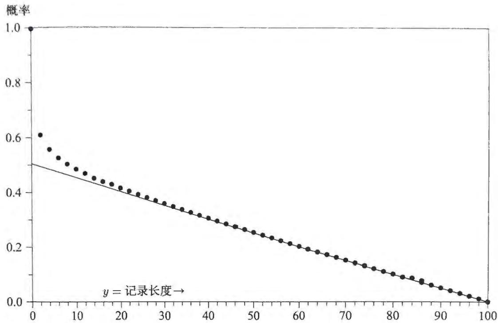

矩阵  $M$  原则上是无限维的,但对于第  $n$  步,只有前面  $n + 1$  行和列是必需的。向量  $\boldsymbol{p}^{(n)}$  原则上也是无限维的,但是当  $i > n$  时  $p_{i}^{(n)} = 0$  。那么先验概率  $p_{i}^{(n)}$  的精确解就是  $M^{n}$  第一列:

$$
p_{i}^{(n)} = M_{i,0}^{n} \tag{15.21}
$$

(注意这旨在表示  $(M^{n})_{i,0}$ ,而不是  $(M_{i,0})^{n}$  )

现在让我们看看这一先验如何在我们的贝叶斯推断问题中使用。将数据和待检验的假设表示为

$$
D\equiv y(n) = i,\quad H\equiv y(n - 1) = \alpha , \tag{15.22}
$$

这是与问题相关的数据  $x$  和参数  $\theta$  的唯一部分。根据上面所述,它们的先验概率为

$$
p(D|I) = M_{i,0}^{n},\quad p(H|I) = M_{\alpha ,0}^{n - 1}. \tag{15.23}
$$

抽样分布为

$$
p(D|H|I) = \left\{ \begin{array}{ll}3 / 4\delta (i,\alpha +1) + 1 / 4\delta (i,\alpha -1), & \alpha >0, \\ \delta (i,1), & \alpha = 0. \end{array} \right. \tag{15.24}
$$

因此,贝叶斯定理给出  $\alpha$  的后验概率为

$$
p(H|D I) = p(H|I)\frac{p(D|H I)}{p(D|I)} = \frac{M_{\alpha,0}^{n - 1}}{M_{i,0}^{n}}\left\{ \begin{array}{l l}{3 / 4\delta (i,\alpha +1) + 1 / 4\delta (i,\alpha -1),} & {\alpha >0,}\\ {\delta (i,1),} & {\alpha = 0.} \end{array} \right.
$$

(15.25)

这样当且仅当  $\alpha = i + 1$  时,最终湮灭  $A$  才发生,因此有限  $n$  的精确解为

$$
p(A|D n I) = \frac{M_{i + 1,0}^{n - 1}}{4M_{i,0}^{n}}, \tag{15.26}
$$

其中  $i = y(n)$  是充分统计量。另一种表达方式是注意到(15.26)的分母是

$$
4M_{i,0}^{n} = 4\sum_{j}M_{i,j}M_{j,0}^{n - 1} = 3M_{i - 1,0}^{n - 1} + M_{i + 1,0}^{n - 1}, \tag{15.27}
$$

因此  $A$  的后验几率为

$$
o(A|D n I)\equiv \frac{p(A|x n I)}{p(\overline{{A}}|x n I)} = \frac{1}{3}\frac{M_{i + 1,0}^{n - 1}}{M_{i - 1,0}^{n - 1}}, \tag{15.28}
$$

从他们的评论来看,KSS想到的问题的精确解是(15.26)或(15.28)在  $n\rightarrow +\infty$  时的极限。

此问题有限  $n$  的解由于反射边界的存在而变得很复杂。如果没有反射边界,上述矩阵元素  $M_{1,0}$  将为  $3 / 4$ ,问题将简化为最简单的随机游走问题。这个问题的

解为我们提供了(15.26)的一个很好近似,而(15.26)实际在极限时为我们的问题提供了精确解,让我们研究这个替代的问题阐述方式,因为它的最终结果很简单,并且其推导过程在某一点上具有启发性,而这一点在上述精确解中并不明显。

每一步都有概率  $p$  向上移动一个单位、概率  $q = 1 - p$  向下移动一个单位的问题的递归关系定义为

$$
f(i|n + 1) = p f(i - 1|n) + q f(i + 1|n), \tag{15.29}
$$

其中  $f(i|n)$  是在  $n$  步中移动距离为  $i$  的概率,在初始条件  $f(i|n = 0) = \delta (i,0)$  下,标准教科书解是  $n$  次试验中  $r$  次成功的二项分布,  $f_{0}(i|n) = b(r|np)$ ,其中  $r = (n + i) / 2$ 。在我们的问题中,第一步必须向上移动,  $y(1) = 1$ ,因此初始条件为  $f(i|n = 1) = \delta (i,1)$ ,并使用二项递归(15.29)后的解为  $f(i|n) = f_{0}(i - 1|n - 1) = b(r|n - 1,p)$ ,其中同样有  $r = (n + i) / 2$ 。

但是对于  $p = 3 / 4$ ,这与(15.19)并不完全相同,因为它忽略了反射边界,如果在序列早期发生太多"失败"(即湮灭),则记录的长度可能减少到0,从而迫使下一步向上的概率为1,而不是  $3 / 4$ 。(15.19)考虑了所有这些因素,换句话说,在(15.29)的解中,当  $n$  很小时,某些概率会漂移到  $y< 0$  的区域中,但是如果  $p = 3 / 4$ ,该值几乎可以忽略不计,最终它们全部返回到  $y > 0$  区域中。

当  $n$  非常大时,解随漂移远离反射边界,几乎所有概率都存在于区域  $\hat{y} - \sqrt{n} < y< \hat{y} +\sqrt{n}$  中,其中  $\hat{y}\equiv (p - q)n = n / 2$  因此根据(15.29)得出的结论变得非常准确(在极限范围内是精确的)。

抽样分布(15.24)不变,但是我们需要对  $i$  和  $\alpha$  的先验做二项式近似,后者是  $n - 1$  步后的记录长度,在第一次抛掷时没有湮灭的可能性,因此在  $n - 1$  次抛掷之后,我们知道  $n - 2$  次抛掷中可能发生了湮灭,概率为  $1 / 4$ 。因此,前  $n - 1$  次抛掷中有  $m$  次湮灭的先验概率是二项式  $b(m|n - 2,1 / 4)$

$$
f(m)=p(m|n)=\binom{n-2}{m}\left(\frac{1}{4}\right)^{m}\left(\frac{3}{4}\right)^{n-2-m},\qquad 0\leqslant m\leqslant n-2. \tag{15.30}
$$

那么  $\alpha$  的先验概率,替换(15.28)中的分子,是

$$
p(\alpha |n) = f\left(\frac{n - 1 - \alpha}{2}\right), \tag{15.31}
$$

对此我们发现先验期望  $E(\alpha |I) = n / 2$ 。同样,在分母中,我们需要  $y(n) = i$  的先验,这只需要对(15.31)做替换  $n - 1\rightarrow n,\alpha \rightarrow i$ 。

给定  $y$ , $\alpha$  的可能值是  $\alpha = y\pm 1$ ,因此若记  $m\equiv (n - y) / 2$ ,最终湮灭的后

验几率是

$$
\begin{array}{r}{\mathbf{\Phi}_{o} = \frac{p(A|y n)}{p(A|y n)} = \frac{p(\alpha = y + 1|y n)}{p(\alpha = y - 1|y n)} = \frac{(1 / 4)\binom{n - 2}{m - 1}(1 / 4)^{m - 1}(3 / 4)^{n - 1 - m}}{(3 / 4)\binom{n - 2}{m}(1 / 4)^{m}(3 / 4)^{n - 2 - m}}.} \end{array} \tag{15.32}
$$

但是,乍一看令人震惊的是,分子分母中的因子  $(1 / 4)$  和  $(3 / 4)$  相互抵消,因此结果仅取决于阶乘

$$
o = \frac{m!(n - 2 - m)!}{(m - 1)!(n - 1 - m)!} = \frac{n - y}{n - 2 + y}, \tag{15.33}
$$

最终湮灭的后验概率简化为

$$
p(A|y n) = \frac{o}{1 + o} = \frac{n - y}{2(n - 1)}, \tag{15.34}
$$

这与试图直接在无限集合上进行推理来解决问题的人提出的解完全不相似,抽样概率  $p = 3 / 4, q = 1 / 4$  在前面的讨论中非常重要,但在这里的解中根本没有出现

但是现在思考一下,给定  $n$  和  $y(n)$ ,我们知道湮灭可能发生在  $n - 1$  次抛掷中的任何一次,但它实际上确实发生在  $(n - y) / 2$  次抛掷中,我们没有在那些次抛掷中发生湮灭的信息,因此在最终抛掷(或在第一次抛掷后的任何一次抛掷)中湮灭的后验概率当然是

$$
\frac{n - y}{2(n - 1)}. \tag{15.35}
$$

通过相当长的计算,我们直接根据概率论原理导出了(15.34),但是只要对这个问题有一点儿直观的理解,我们就可以不用任何计算将其推理出来!

在图15- 1中,我们将精确解(15.26)与渐近解(15.34)进行了比较,当  $n > 20$  时,两者在数值上的差别可以忽略不计,那么为什么有那么多人认为答案应该是  $1 / 4$  呢?也许注意到  $y$  的先验期望为  $E(y|I) = (n + 1) / 2$  将有所帮助,所以最终湮灭的期望概率为

$$
p(A|nI) = \frac{n - E(y|I)}{2(n - 1)} = \frac{1}{4}. \tag{15.36}
$$

如果观察到的记录长度  $y$  是期望值,则最终湮灭的后验概率确实为  $1 / 4$  如果新信息只是我们所期望的,则它不会改变我们的估计,而只会使我们对估计结果更有信心,但是如果观察到的  $y$  与之前的预期不同,则这告诉我们湮灭的实际次数,当然此信息会优先于我们可能具有的任何  $(1 / 4,3 / 4)$  之间的初始概率分配,这就是它们在后验几率中消去的原因,因此,尽管我们最初感到惊讶,但是贝叶斯定理在这里做得很好,最初提出的问题的确切解也由(15.35)取  $n\rightarrow +\infty$  的极限得到

$$
p(A|xI) = \frac{1}{2} (1 - z), \tag{15.37}
$$

其中  $z\equiv \lim y(n) / n$

  
图15-1  $n = 100$  次抛掷"强烈不一致"问题的解.实线  $=$  近似值,(15.34);点线  $=$  精确解,(15.26)

总之,现在这两种声称的非聚集性的共同特征很明显,在第一种情况下,没有提及有限数  $M, N$  的存在,其比值  $M / N$  是解所依赖的关键量。在第二种情况下,基本上是同样的原因:未能引入序列的长度  $n$  以及观察记录的长度  $y(n)$ ,同样会导致丢失关键信息——在这种情况下是解依赖的充分统计量  $y / n$ 。在这两种情况下,通过将无穷极限假设为一开始就已经完成的东西,人们正在丢弃找到解所需的最重要的信息。

虽然以上讨论很长,但是我们很难找到一个更具指导意义的例子,说明在涉及无限集合的情况下为什么必须以及如何进行概率演算,以及如果不听从高斯的建议会发生什么可怕的事情。

# 15.6 有限与可列可加性

在这一点上,读者可能会感到疑惑:"为什么有人关心非聚集性?它会导致什么不同?"实际上,非聚集性本身并不有趣,它只是掩盖真正问题的烟幕弹。德菲内蒂的追随者或许会说,根本的问题是"有限可加性"的技术性问题。我们要回答的是,"有限可加性"也是烟幕弹,因为它的用途几乎与听起来相反。

在第2章中,我们推导出了互斥命题的加法规则(2.85):如果使用布尔代数

的陈述,  $A \equiv A_{1} + A_{2} + \dots +A_{n}$  是有限数量的互斥命题的析取, 那么

$$
p(A|C) = \sum_{i = 1}^{n}p(A_{i}|C). \tag{15.38}
$$

简单地说,我们的概率具有"有限可加性"当  $n\rightarrow +\infty$  时,假设加法规则中的求和项是可数项的和,并且形成一个收敛级数,那么取极限似乎是无害的,这时我们的概率将被称为可列可加的,但是(尽管我们不知道这在实际问题中如何发生)如果求和项不能形成收敛级数,我们将认为无穷极限没有意义,并且拒绝取极限,在我们的概率论中,很难明白人们能在这种完全直接的情况之外提出任何实质性问题

传统概率论颠倒了我们的过程,认为在提出可加性问题之前,无穷极限从一开始就已经完成了,然后才来关心无限集合区间上命题的可加性问题,费勒(Feller,1966年,1971年版,第107页)写道:

令  $F$  是给每个区间  $I$  分配有限值  $F\{I\}$  的函数,如果将区间  $I$  划分为

有限多个不重叠的区间  $I_{1},\dots ,I_{n}$ $F\{I\} = F\{I_{1}\} +\dots +F\{I_{n}\}$  ,则此

函数称为(有限)可加的

然后费勒(第108页)给出了一个示例,说明为什么希望用可列可加性代替有限可加性:

在  $R^{1}$  中,对于任何区间  $I = (a,b),b< +\infty$  令  $F\{I\} = 0$  ,当  $I =$ $(a, + \infty)$  时令  $F\{I\} = 1$  ,这一区间函数是可加的,但很怪异,因为它违反了函数  $F\{(a,b)\}$  当  $b\rightarrow +\infty$  时应该趋于  $F\{(a, + \infty)\}$  的自然连续性要求.

上述示例显示了加强有限可加性的必要性,如果将区间  $I$  划分为可数的多个区间  $I_{1},I_{n},\dots$  ,满足  $\begin{array}{r}{F\{I\} = \sum_{k}F\{I_{k}\}} \end{array}$  ,则可以说区间函数  $F$  是可列可加的,或者是  $\sigma$  可加的

然后,他补充说,在上述怪异函数的例子中,"可列可加性"的条件是"显然不满足的"(请读者以此问题作为练习,清晰地解释为什么这是显然的)

在上述怪异函数的例子中发生了什么?当然,怪异并不在于缺乏连续性(因为连续性不是在任何情况下都必要的),而是有更糟糕的事情,假设那些区间由某个变量  $x$  占据,区间函数  $F\{I\}$  代表变量属于区间  $I$  的概率  $p(x \in I)$ ,那么对于  $x$  的任何有限区间将分配 0 概率,而概率 1 赋给无限区间。如果我们假设无限区间是已经完成的,这几乎是不可理解的,但是如果我们听从高斯的建议,考虑通

过有限项取极限,就可以理解发生了什么,假设我们有一个正常归一化的PDF:

$$
p(x|r)={\left\{\begin{array}{l l}{1/r,}&{0\leqslant x< r,}\\ {0,}&{r\leqslant x< +\infty.}\end{array}\right.} \tag{15.39}
$$

只要  $0< r< +\infty$  ,就没有什么奇怪的,我们可以用一个区间函数来描述:

$$
F(a,b) = \int_{a}^{b}\mathrm{d}x p(x|r) = \left\{ \begin{array}{l l}{(b - a) / r,} & {0\leqslant a\leqslant b\leqslant r< +\infty ,}\\ {(r - a) / r,} & {0\leqslant a\leqslant r\leqslant b< +\infty ,}\\ {0,} & {0\leqslant r\leqslant a\leqslant b< +\infty ,} \end{array} \right. \tag{15.40}
$$

它是可列可加的,显然也是有限可加的,随着  $r$  的增加,密度函数变得越来越小,并且散布在更宽的区间内,但是只要  $r< +\infty$  ,我们就有一个定义良好且不自相矛盾的数学函数.

如果试图在讨论可加性之前将  $p(x|r)$  的极限描述为已经完成的东西,那么我们就创建了费勒的怪异例子,我们尝试使概率密度在任何地方都为0,但积分为1. 但是,不论是根据从高斯开始的许多古典数学家的警告,还是根据我们自己的基本常识,都没有这种东西.

诉诸有限可加性是解决实际问题的一种"邪道"要了解为什么这种可加性在传统概率论中很重要,让我们注意当执行与上述建议相应的操作顺序时会发生什么,我们在实数轴上分配连续单调递增的累积概率函数  $G(x)$  ,它具有自然的连续性:

$$
G(x)\rightarrow \left\{ \begin{array}{l l}{1,} & {x\rightarrow +\infty ,}\\ {0,} & {x\rightarrow -\infty ,} \end{array} \right. \tag{15.41}
$$

那么,对于区间  $I = (a,b)$  上的函数  $F$  可以定义为  $F\{I\} = G(b) - G(a)$  显然,这一区间函数根据定义是可列可加的,也就是说,可以选择满足  $a< x_{1}< x_{2}< \dots < b$  的  $x_{k}$  ,使得我们可以将区间  $(a,b)$  分成任意多的非重叠子区间  $\{I_{0},I_{1},\dots ,I_{n}\} =$ $\{(a,x_{1}),(x_{1},x_{2}),\dots ,(x_{n},b)\}$  ,那么  $F\{I\} = F\{I_{k}\}$  一定是正确的.如果  $G(x)$  是可微的,则其导数  $f(x)\equiv G^{\prime}(x)$  可以解释为可归一化的概率密度:  $\int \mathrm{d}x f(x) = 1$

最终,我们看到,这一切的意义是:"有限可加性"是"颠倒逼近极限的正确顺序,从而陷入得到无法归一化的概率分布的困境"的代名词,费勒一下子就看到了这一点,警告读者不要使用它,并着手在避免由此导致的许多无用和没有必要的情论的情况下来发展自己的概率理论.①

正如我们在第6章看到的那样:在计算过程的最后取极限  $r \rightarrow +\infty$  可能得出有用的结果;从  $p(x|r)$  推导出的其他概率可能逼近确定、有限和简单的极限值。现在我们已经看到,试图在计算开始时就取极限可能会导致无意义的结果,因为重要的信息在我们使用之前就可能丢失了。

真正的问题是:我们是否将诸如无限集合上的均匀概率分布之类的东西作为概率论中的合法数学对象?我们是否相信无限数量的0可以加起来等于1?就像德菲内蒂和他的追随者一样,在使用一种奇怪的语言讨论这些问题时,诉诸"有限可加性"似乎是在以一种迁回的方式回答"是"。像柯尔莫哥洛夫和费勒那样,诉诸"可列可加性"似乎是以与高斯同样的精神、以同样迁回的方式在回答"否"。

这些术语都是烟幕弹,因为"有限可加性"听起来像是一个更加谨慎的术语,而"可列可加性"则有点冒险。德菲内蒂似乎确实认为有限可加性是较弱的假设。他批评那些没有更令人信服的理由,仅仅出于"数学上的便利"而引入可列可加性的人不诚实。正如我们所看到的那样,在问题的开始直接跳入无限集合是更大的判断错误,这对于概率论的后果要严重得多。在这里,不仅仅是"数学上的便利"而已。

在第3章中,我们在为有放回抽样引入二项分布时注意到了相同的心理现象。那些有意丢弃相关信息的人发明了"随机化"一词,以掩盖事实,并使得他们看起来似乎在做一些值得尊敬的事情。那些鲁莽、不负责任地使用无限大的人经常会诉诸"有限可加性"这个词,使得他们看起来似乎在数学上比其他人更谨慎。

# 15.7 博雷尔-柯尔莫哥洛夫悖论

在大多数情况下,从离散概率到连续概率的过渡是平稳的,以显然的方式进行且毫无意外。但是,关于连续概率密度存在一个微妙之处。它一点都不显然,除非我们理解它,否则可能导致错误的计算。下面的例子持续使许多疏忽大意的人陷入圈套。

假设  $I$  是先验信息,根据该先验信息, $(x,y)$  是方差为1且相关系数为  $\rho$  的二变量正态PDF:

$$
p(\mathrm{d}x\mathrm{d}y|I) = \frac{\sqrt{1 - \rho^{2}}}{2\pi}\exp \left\{\frac{1}{2} (x^{2} + y^{2} - 2\rho x y)\right\} \mathrm{d}x\mathrm{d}y. \tag{15.42}
$$

我们可以对  $x$  或  $y$  进行积分以获得边缘PDF(为对  $x$  进行积分,做变换  $x^{2} + y^{2} - 2\rho x y = (x - \rho y)^{2} + (1 - \rho^{2})y^{2}$ ,依此类推):

$$
p(\mathrm{d}x|I) = \sqrt{\frac{1 - \rho^{2}}{2\pi}}\exp \left\{-\frac{1}{2} (1 - \rho^{2})x^{2}\right\} \mathrm{d}x, \tag{15.43}
$$

$$
p(\mathrm{d}y|I) = \sqrt{\frac{1 - \rho^{2}}{2\pi}}\exp \left\{-\frac{1}{2}\big(1 - \rho^{2}\big)y^{2}\right\} \mathrm{d}y. \tag{15.44}
$$

到目前为止,一切都是例行的.但是现在,当  $y = y_{0}$  时  $x$  的条件PDF是多少?我们也许认为只需要在(15.42)中使得  $y = y_{0}$  并重新归一化即可:

$$
p(\mathrm{d}x|y = y_{0}I) = A\exp \left\{-\frac{1}{2}\big(x^{2} + y_{0}^{2} - 2\rho x y_{0}\big)\right\} \mathrm{d}x, \tag{15.45}
$$

其中  $A$  是归一化常数.但是不能保证这是有效的,因为我们只是基于直觉得到了(15.45).这并不是直接应用概率论的基本规则从(15.42)中导出的.在第2章中,我们针对离散情况得出了这些规则:

$$
p(A B|X) = p(A|B X)p(B|X), \tag{15.46}
$$

通过通常的规则给出的离散条件概率为

$$
p(A|B X) = \frac{p(A B|X)}{p(B|X)}, \tag{15.47}
$$

这通常被视为条件概率的定义,如果我们定义离散命题,可以严格应用我们的规则进行计算

$$
\begin{array}{l}A\equiv x\in \mathrm{d}x, \\ B\equiv y\in (y_{0}< y< y_{0} + \mathrm{d}y). \end{array} \tag{15.48}
$$

然后我们应该使用(15.42)和(15.44)代替(15.45),

$$
p(A|B I) = p(\mathrm{d}x|\mathrm{d}y I) = \frac{p(\mathrm{d}x\mathrm{d}y|I)}{p(\mathrm{d}y|I)} = \frac{1}{\sqrt{2\pi}}\exp \left\{-\frac{1}{2} (x - \rho y_{0})^{2}\right\} \mathrm{d}x. \tag{15.49}
$$

由于  $\mathrm{d}y$  抵消了,因此取极限  $\mathrm{d}y\rightarrow 0$  不会导致什么不同

考虑(15.45)中的归一化常数,我们发现(15.45)和(15.49)其实是一样的.那么,为什么辛辛苦苦来推导(15.49)呢?导致(15.45)的快速论证方式不是也给了我们正确答案吗?

这是印证我们15.1节中的开篇评论的一个很好的例子,即从一个错误命题出发可能导致正确或错误的结果,导致我们得到(15.45)的推理这次给出了正确结果,但是它同样可以产生我们想要的(15.45)之外的其他任何结果.这取决于我们选择的方程的特定形式.为了产生悖论,假设我们使用变量  $(x,u)$  代替  $(x,y)$  其中

$$
u\equiv \frac{y}{f(x)}, \tag{15.50}
$$

其中  $0< f(x)< +\infty$  ,例如,  $f(x) = 1 + x^{2}$  或  $f(x) = \cosh (x)$  ,等等.雅可比行列式是

$$
\frac{\partial(x,u)}{\partial(x,y)} = \left(\frac{\partial u}{\partial y}\right)_{x} = \frac{1}{f(x)}, \tag{15.51}
$$

于是PDF(15.42)用新变量表示是

$$
p(\mathrm{d}x\mathrm{d}u|I) = \frac{\sqrt{1 - \rho^{2}}}{2\pi}\exp \left\{-\frac{1}{2}\left(x^{2} + u^{2}f^{2}(x) - 2\rho u f(x)\right)\right\} f(x)\mathrm{d}x\mathrm{d}u.
$$

同样,我们可以对  $u$  进行积分,得到边缘分布  $p(\mathrm{d}x|I)$ ,容易看出它与(15.43)相同;或者对  $x$  进行积分,得到  $p(\mathrm{d}u|I)$  与转换为变量  $u$  的(15.44)相同。到目前为止一切都挺好。

但是现在,假设给定  $u = 0$ , $x$  的条件PDF是多少?如果遵循得到(15.45)的推理过程,即只需在(15.52)中设置  $u = 0$  并重新归一化,我们发现

$$
p(\mathrm{d}x|u = 0I) = A\exp \left\{-\frac{1}{2} x^{2}\right\} f(x)\mathrm{d}x. \tag{15.53}
$$

但是根据(15.50),条件  $u = 0$  等于  $y = 0$ ,因此看起来结果应该与(15.45)相同,且  $y_{0} = 0$ 。但是(15.53)与(15.45)差一个额外的系数  $f(x)$ ,该系数甚至可以是任意的!

许多人对这一结果感到惊讶,觉得难以置信。他们一遍遍地强调:"但是条件  $u = 0$  与  $y = 0$  完全相同,怎么可能会有不同的结果呢?"我们在第4章中已经警告过这一现象可能发生,但也许太含糊了。当时实际上没有产生错误,因为我们的问题中只有一个参数。现在,我们需要仔细检查推导过程,以明白错误发生的原因及其解决方案。

我们在第1章中已经指出,不能试图定义以矛盾前提为条件的概率。对于这种问题,可能没有唯一解。我们通过定义"样本空间"或"假设空间"来开始每个问题,该"样本空间"或"假设空间"列出了我们在该问题中应考虑的条件范围。在当前问题中,离散假设的形式为" $a \leqslant y \leqslant b$ ", $y$  在正测度  $b - a$  的区间中。那么,当测度为0时说" $y = 0$ ",我们的意思是什么呢?我们可能只是指某些涉及正测度的命题序列的极限,例如,当  $\epsilon \rightarrow 0$  时

$$
A_{\epsilon} \equiv |y| < \epsilon . \tag{15.54}
$$

命题  $A_{\epsilon}$  将点  $(x, y)$  限制在逐渐变窄的水平区间上,但是对于任何  $\epsilon > 0$ , $A_{\epsilon}$  是具有确定正概率的离散命题,因此通过乘法规则,假设  $H \equiv x \in \mathrm{d}x$  的条件概率

$$
p(H|A_{\epsilon}I) = \frac{p(HA_{\epsilon}|I)}{p(A_{\epsilon}|I)} \tag{15.55}
$$

是定义良好的,并且其  $\epsilon \rightarrow 0$  的极限也是定义良好的量。也许这个极限就是我们说  $p(H|y = 0I)$  时的含义。

但是命题"  $y = 0$  "也可以很好地定义为逐渐变细的楔形的序列极限

$$
B_{\epsilon} \equiv |a| < \epsilon |x|. \tag{15.56}
$$

对于所有  $\epsilon > 0$ ,  $p(H|B_{\epsilon}I)$  也如(15.55)一样定义明确。尽管序列  $\{A_{\epsilon}\}$  和  $\{B_{\epsilon}\}$  趋于相同的极限  $y = 0$ ,条件密度则趋于不同的极限:

$$
\begin{array}{r l} & {\underset {\epsilon \rightarrow 0}{\lim}p(H|A_{\epsilon})\propto g(x),}\\ & {\underset {\epsilon \rightarrow 0}{\lim}p(H|B_{\epsilon})\propto |x|g(x),} \end{array} \tag{15.57}
$$

我们可以使用任意非负函数  $f(x)$  代替  $|x|$ 。由此可见,仅仅指定"  $y = 0$  "而不加任何其他限定是不明确的,它只告诉我们趋于一个度量为0的极限,但没有告诉我们趋于极限的任何数量信息。

这里,我们又增加了一个示例说明为什么必须严格遵守第2章中得出的推理规则。直觉方法可能造成灾难,而且由于它只是有时失效,所以特别危险。尽管违反概率论规则的直觉方法在某些情况下可能会得到正确的结果,但在其他情况下肯定会导致灾难。每当我们在某一空间上具有概率密度,并且希望在测度为0的子空间上生成另一个概率密度时,唯一安全的流程是通过类似(15.55)的过程取明确定义的极限。通常,最终结果必将依赖于指定的极限操作。这初听起来非常违反直觉,但是当理解其原因时,它就会变得显而易见。

基于这一悖论的著名难题涉及从球体表面到球体上大圆的传递。给定表面均匀的概率密度,任何球体大圆对应的条件密度是多少?直观上,每个人都会马上说,根据几何对称性,它也必须是均匀的。但是,如果我们分别指定通过纬度  $- \pi /2 \leq \theta \leq \pi /2$  与经度  $- \pi \leq \phi \leq \pi$  的指定点,则似乎无法获得此结果。如果那个大圆是赤道,定义为  $|\theta | < \epsilon$  取极限  $\epsilon \rightarrow 0$ ,我们具有期望的均匀分布  $p(\phi) = (2\pi)^{- 1}$ $(- \pi < \phi \leqslant \pi)$ 。但是如果它是由  $|\phi | < \epsilon$  取极限  $\epsilon \rightarrow 0$  定义的格林威治子午线,我们有  $p(\theta) = (1 / 2)\cos (\theta)$ $(- \pi /2 \leqslant \theta \leqslant \pi /2)$ ,密度在赤道达到最大值,在极点为0。

关于这两种结果中的哪一种是"正确的",在出色的概率论学者之间有着许多徒劳的激烈争论。作者曾在科学家和统计学家的专业会议上多次见到这种争论。几乎每个人都认为自己完全了解什么是大圆,因此很难让大家明白,除非我们指定取极限的方式,否则"大圆"一词是不明确的。直观的对称性论证无意识地假设是取赤道极限,而一瓣瓣吃橙子的人可能会以另一个假设为前提。

# 15.8 边缘化悖论

随着戴维、斯通和齐德克的论文(Dawid, Stone & Zidek, 1973,以下用DSZ表示)的发表,翻滚四面体问题持续发酵,成为概率论中引起狂热的一个典型例

子,在一段时间内似乎威胁着整个概率论的一致性基础。边缘化悖论比上面的讨论更为复杂,因为它不是源于单个错误,而是源于逻辑和直觉错误的结合。更为危险的是,这两种错误恰好相互支持。DSZ的论文首次发表时,它似乎欺骗了该领域的每位专家,唯一的例外是弗雷泽,他作为DSZ论文的讨论者之一,看出论文的结论是错误的,并正确地指出了原因,但是没有人听他的。

边缘化悖论与其他悖论不同的是,它提出后立即得到了强烈的支持。因此,它对科学推断的破坏能力远超其他任何一种悖论。但是,如果正确理解它,这一现象在科学推断中就有有用的应用。边缘化作为构建无信息先验的潜在有用手段,在杰恩斯的文章(Jaynes,1980)中得到了不完全的讨论。这个相当深的主题目前仍然处于研究状态,其中的主要定理可能尚不清楚。

在本章中,我们只是将边缘化作为概率论历史中一段怪诞时期的故事。通过迫使贝叶斯主义者修改一些看似简单快捷的推理流程来完成一件好事。我们通过DSZ的方式来说明原始的悖论,遵循他们的记号,直到我们明白为什么不能这样做。它从一个常规的看似无害的冗余参数问题开始。

一位一丝不苟的贝叶斯主义者  $B_{1}$  研究数据  $x\equiv (x_{1},\dots,x_{n})$  和多维参数  $\theta$  的问题,他将参数分解为两个分量  $\theta = (\eta ,\zeta)$  ,仅对  $\zeta$  的推断感兴趣,因此他的模型由问题陈述中假定的某个抽样分布  $p(x|\eta \zeta)$  定义,而  $\eta$  是要积分消去的冗余参数,因此对于先验  $\pi (\eta ,\zeta)$  ,  $B_{1}$  获得  $\zeta$  的边缘后验PDF:

$$
p(\zeta |x) = \int \mathrm{d}\eta p(\eta \zeta |x) = \frac{\int\mathrm{d}\eta p(x|\eta\zeta)\pi(\eta,\zeta)}{\int\mathrm{d}\zeta\int\mathrm{d}\eta p(x|\eta\zeta)\pi(\eta,\zeta)}, \tag{15.58}
$$

这一标准结果总结了  $B_{1}$  关于  $\zeta$  的所有知识。现在的问题是,我们可以为此分配什么样的先验  $\pi (\eta ,\zeta)$  。当然,我们的答案是:

任何正常先验,或者正常先验的极限序列,比如(15.58)中的积分比率收敛产生  $\zeta$  的正常后验PDF,都可以被我们的理论允许认为是参数先验信息的可能表征。然后,(15.58)将根据该知识状态得出正确的结论。

这不必由特定问题的任何特殊情况来限定。我们认为,严格遵守这一策略不会产生任何含混不清或者矛盾之处。但是,不严格遵守它则可能导致任何事情。

但是,DSZ根本不这么看,他们着眼于一种特殊的情况,并指出在许多情况下,数据  $x$  可以分为两个分量:  $x = (y,z)$  ,使得"  $z$  的抽样分布与冗余参数  $\eta$  无关"。他们将这一性质(DSZ,(1.2))写成

$$
p(z|\eta \zeta) = \int \mathrm{d}y p(yz|\eta \zeta) = p(z|\zeta), \tag{15.59}
$$

它本身看起来通常很可能成立,但是没有任何深远的意义。举例来说,如果  $\eta$  是位置参数,则在刚性平移下不变的任何函数  $z(x)$  都将具有独立于  $\eta$  的抽样分布。如果  $\eta$  是比例参数,则在比例变化下不变的任何函数  $z(x)$  都将具有此性质。如果  $\eta$  是旋转角,则在旋转下不变的任何数据分量都将满足条件。DSZ 发现以下情况:当(15.59)成立且  $B_{1}$  给  $\eta$  分配非正常先验时, $\zeta$  的边缘后验 PDF"仅仅是  $z$  的函数"。鉴于(15.59),DSZ 大概会写成

$$
p(\zeta |yz) = p(\zeta |z). \tag{15.60}
$$

此时来了一位懒惰的贝叶斯主义者  $B_{2}$ ,他"总是在推断时晚到一步",(15.59)和(15.60)的结果让他有了一个奇怪的想法。根据写出的(15.60)似乎可以看出数据的  $y$  分量与关于  $\zeta$  的推断无关,可以抛弃。(15.59)的形式似乎表明  $\eta$  也可能与模型无关,可以删去。因此,他建议简化计算方法。他的直觉判断是,给定(15.59)和(15.60),我们应该可以通过在简化模型  $p(z|\zeta)$  中直接应用贝叶斯定理,更轻松地得到  $\zeta$  的边缘 PDF,其中完全不出现  $(y,\eta)$ 。因此,如果  $B_{2}$  分配先验  $\pi (\zeta)$  他将获得后验分布

$$
p(\zeta |z) = \frac{p(\zeta|\zeta)\pi(\zeta)}{\int\mathrm{d}\zeta p(z|\zeta)\pi(\zeta)}. \tag{15.61}
$$

但是令他感到诧异的是,无论给  $\zeta$  分配怎样的先验,他都无法重现  $B_{1}$  的结果(15.58)。我们应该从中得出什么结论呢?

对于DSZ来说, $B_{2}$  的推理似乎很有说服力。基于这种直观的"归约原理",他们认为  $B_{1}$  和  $B_{2}$  显然应该获得相同的结果。因此,其中一人一定犯了某种错误。他们将指控指向  $B_{1}$  :" $B_{2}$  的结果表明  $B_{1}$  关于  $\zeta$  的后验分布具有自相矛盾的非贝叶斯性。"他们将原因归结于使用了  $\eta$  的非正常先验。

对于我们来说,情况似乎大不相同。 $B_{2}$  的结果不是通过应用我们的概率论规则得出的。(15.61)只是一个直观的猜测,读者可以验证,它在数学上并不是(15.58)15.59)(15.60)的推论。因此,(15.61)并不是概率论对  $B_{1}$  问题的有效应用。如果直觉表明并非如此,那么这种直觉就需要纠正——就像在其他悖论中一样。

在这个阶段,我们面临的不只是一个混乱,而是三个。上面使用的记号在某些角度隐藏了一些关键点。

(1)尽管结果(15.60)"只是  $z$  的函数",因为  $y$  在(15.60)中不显式出现,但对于不同的先验  $\eta$ ,它是  $z$  的不同函数。也就是说,从(15.58)可以看出,它仍然是先验  $\eta$  的泛函。根据这种依赖性,概率论告诉我们关于  $\eta$  的先验信息仍然很重要。一旦我们意识到这一点,就会发现  $B_{2}$  之所以与  $B_{1}$  得出了不同的结论,并不是因为  $B_{1}$  犯了错误,而是由于  $B_{1}$  考虑了  $B_{2}$

忽略的相关先验信息。

(2)真正的问题远不止于此.我们需要意识到,当前使用正统统计记号具有基本的模糊性,这使得(15.59)和(15.60)的含义不确定,这种模糊性只有通过哈罗德·杰弗里斯(Jeffreys,1939)引入并在本书第2章和附录B中使用的记号才能澄清,根据我们的记号,我们知道  $p(yz|\eta \zeta)$  代表以模型中存在的两个参数  $\eta ,\zeta$  的特定数值为条件  $y,z$  的联合概率(密度)但是,  $p(z|\zeta)$  又代表什么呢?这大概并不是说  $\eta$  根本没有数值!

事实上,如果一个正统人士希望引用一个根本不存在  $\eta$  的不同模型,他将使用相同的记号  $p(z|\zeta)$  ,因此,严格来说,我们似乎应该总是将记号  $p(z|\zeta)$  解释为该不同模型,但这不是(15.59)的意思,它是指仍存在 $\eta$  的模型,但是  $z$  的概率与其数值无关,这样看来,通过正统记号表达真正意义的唯一方法将(15.59)重新写为

$$
\frac{\partial}{\partial\eta} p(z|\eta \zeta) = 0. \tag{15.62}
$$

(3)这种及另外一种模糊性:在(15.60)中也存在,这里的意思不仅仅是表明  $p(\zeta |yz)$  与  $y$  的数值无关,严格说来,记号  $p(\zeta |z)$  一定是指代完全不给出数据  $y$  的不同模型,现在还有一种额外的不确定性,即任何后验概率必然依赖于先验概率,但是(15.60)的记号中却未引用任何先验信息.我们开始明白边缘化悖论为什么如此令人困惑!

有一种看待此问题的更好方式,能避免所有以上混乱而又使用DSZ的数学,如果将这些方程式置于不同场景中,将对  $B_{2}$  有更宽容的态度,懒惰的贝叶斯主义者  $B_{2}$  发明了一种违反概率论规则的快捷方法,但是我也可以认为他本身并没有什么错,只是一个只给了  $\eta$  的简化模型  $p(z|\zeta)$  并且不知道  $(\eta ,y)$  存在的无知之人,那么(15.61)对于  $B_{2}$  所拥有的不同知识状态是有效的推断,而且无论分解性(15.60)是否成立都是有效的.尽管方程是相同的,因为我们通过  $B_{1}$  的边缘

抽样分布  $p(z|\zeta)$  定义了  $B_{2}$  的模型,但是这种看待方式避免了很多混淆:虽然  $B_{1}$  和  $B_{2}$  都做了有效的推断,但涉及的是两个不同的问题。

这两种新的模糊性都源于正统记号没有明确指出正在考虑的模型。但是,这可以通过包含先验信息  $I$  进行纠正, $I$  是包含模型完整定义和背景的命题。如果我们遵循杰弗里斯的示例,并将(15.58)和(15.61)的右边正确地写为  $p(\zeta |yzI_{1})$  和  $p(\zeta |zI_{2})$ ,问题的差异就会清晰可见,不存在形式上的矛盾。先验信息  $I_{1}$  指完整的抽样分布  $p(yz|\eta \zeta)$ ,而  $I_{2}$  仅通过  $p(z|\zeta)$  指定模型,没有考虑  $(\eta ,y)$ 。 $B_{1}$  和  $B_{2}$  根据不同的先验信息得出不同的结论,这并不比它们根据不同的数据得出不同的结论更为奇怪。

练习15.2 考虑第三位贝叶斯主义者  $B_{3}$  的情况,他具有与  $B_{1}$  相同的关于  $\eta ,\zeta$  的先验信息,但没有获得数据分量  $y$ 。这样  $y$  根本不会出现在  $B_{3}$  的方程中。他的模型是边缘抽样分布  $p(z|\eta \zeta I_{3})$ 。证明,尽管如此,如果(15.59)仍然成立(按照如(15.62)所示的解释),则  $B_{2}$  和  $B_{3}$  的结论始终一致, $p(\zeta |zI_{3}) = p(\zeta |zI_{2})$ ,且为了证明这一点,没有必要诉诸(15.60)。保留数据  $y$  会自动使得任何有关  $\eta$  的先验知识与  $\zeta$  的推断无关。深入思考这一点,直到可以用语言解释为什么这在直觉上是显而易见的。

# 应对更大的灾难

到目前为止,我们仅仅拥有通过不恰当的记号表达的误导人的方程组,但是现在又出现了两种错误相互强化的情况。为了支持  $B_{1}$  犯错误的论点,DSZ提供了一个证明,即如果  $B_{1}$  使用了正常先验分布,就不会出现这种悖论(即  $B_{1}$  和  $B_{2}$  的结果不一致)。让我们同样使用他们的记号来检查他们的证明。在一般正常联合先验分布  $\pi (\eta ,\zeta)$  的情况下,(15.58)中的积分收敛且为正,因此如果乘以分母,则既不会乘以也不会除以0。这样

$$
p(x|\eta \zeta) = p(yz|\eta \zeta) = p(y|z\eta \zeta)p(z|\eta \zeta) = p(y|z\eta \zeta)p(z|\zeta), \tag{15.63}
$$

其中我们使用了乘法规则(15.59)。这样(15.58)变成

$$
p(\zeta |yz)\int \mathrm{d}\zeta \int \mathrm{d}\eta p(y|z\eta \zeta)p(z|\zeta)\pi (\eta ,\zeta) = \int \mathrm{d}\eta p(y|z\eta \zeta)p(z|\zeta)\pi (\eta ,\zeta). \tag{15.64}
$$

但是现在我们假设(15.60)仍然成立,因为积分是绝对收敛的,我们可以在(15.64)的两边通过积分消掉  $y$ ,其中  $\int \mathrm{d}\eta \pi (\eta ,\zeta) = \pi (\zeta)$ ,(15.64)简化为

$$
p(\zeta |z)\int \mathrm{d}\zeta p(z|\zeta)\pi (\zeta) = p(z|\zeta)\pi (\zeta), \tag{15.65}
$$

这与(15.61)相同.DSZ得出结论:如果  $B_{1}$  使用正常先验,则  $B_{1}$  和  $B_{2}$  得出的结论必然是一致的——据此可以得出,与他们的直觉一致,悖论是由于  $B_{1}$  使用非正常先验造成的.

但是(15.65)的证明使用了相互矛盾的假设,正如弗雷泽认识到的,如果  $B_{1}$  使用正常先验,则(15.60)不可能成立,也就不可能得出(15.65).难怪DSZ仅在非正常先验条件下得到(15.60).这一点很容易通过一个特定的例子说明,之后,为什么它通常是正确的就变得显而易见了,下面我们将完全使用杰弗里斯的记号法,以便我们能始终区分这两个问题.

# 变化点问题

假设观察到  $n$  个连续独立的正实数指数分布的数  $\{x_{1},\dots ,x_{n}\}$  ,已知(根据模型定义)其中前  $\zeta$  个数的期望值为  $1 / \eta$  ,其余  $n - \zeta$  个数的期望值为  $1 / (c\eta)$  其中  $c$  是已知的且  $c\neq 1$  ,而  $\eta$  和  $\zeta$  未知,我们想根据数据估计序列变化发生在哪一点.  $x\equiv (x_{1},\dots ,x_{n})$  的抽样密度为

$$
p(x|\eta \zeta I_{1}) = e^{-\zeta}\eta^{n}\exp \left\{-\eta \left(\sum_{i = 1}^{\zeta}x_{i} + c\sum_{i = \zeta +1}^{n}x_{i}\right)\right\} ,\quad 1\leqslant \zeta \leqslant n. \tag{15.66}
$$

如果  $\zeta = n$  则没有变化,(15.66)中的最后一项和就不存在,  $c$  从模型中消失,由于  $\eta$  是比例参数,因此观测比率  $z_{i}\equiv x_{i} / x_{1}$  的抽样分布应该独立于  $\eta$  确实,将数据  $x = (y,z)$  分成表示标度的  $y\equiv x_{1}$  和比率  $(z_{2},\dots ,z_{n})$  ,并且注意到体积元变换为  $\mathrm{d}x_{1}\dots \mathrm{d}x_{n} = y^{n - 1}\mathrm{d}y\mathrm{d}z_{2}\dots \mathrm{d}z_{n}$  ,我们发现  $z\equiv (z_{2},\dots ,z_{n})$  的联合抽样分布仅依赖于  $\zeta$

$$
p(z_{2}\cdot \cdot \cdot z_{n}|\eta \zeta I_{1}) = \int_{0}^{+\infty}\mathrm{d}y c^{n - \zeta}\eta^{n}y^{n - 1}\exp \{\eta y Q(\zeta ,z)\} = \frac{c^{n - \zeta}(n - 1)!}{Q(\zeta,z)^{n}} = p(z|\zeta I_{1}), \tag{15.67}
$$

其中  $z_{1}\equiv 1$  且

$$
Q(\zeta ,z)\equiv \sum_{i = 1}^{\zeta}z_{i} + c\sum_{i = \zeta +1}^{n}z_{i} \tag{15.68}
$$

是可以根据数据得知的函数,令  $B_{1}$  选择在  $1\leqslant \zeta \leqslant n$  中正常归一化的离散先验分布  $\pi (\zeta)$  ,在  $0< \eta < +\infty$  中的独立先验  $\pi (\eta)\mathrm{d}\eta$  那么  $B_{1}$  关于  $\zeta$  的边缘后验分布,根据(15.66)为

$$
p(\zeta |y z I_{1})\propto \pi (\zeta)c^{n - \zeta}\int_{0}^{+\infty}\mathrm{d}\eta \exp \{-\eta y Q\} \pi (\eta)\eta^{n}, \tag{15.69}
$$

根据(15.67),  $B_{2}$  关于  $\zeta$  的的后验分布(15.61)为

$$
p(\zeta |z I_{2})\propto \pi (\zeta)p(z|\zeta) = \frac{\pi(\zeta)c^{-\zeta}}{[Q(\zeta,z)]^{n}}, \tag{15.70}
$$

其中没有出现  $\pi (\eta)$  但是正如上述讨论所述,  $B_{1}$  有关  $\zeta$  的知识不仅依赖于  $\eta$  和  $\zeta$  而[同样强烈地依赖于他为冗余参数分配的先验  $\pi (\eta)$

思考一下,我们会看到只需要一点儿常识就立即能预想到这种结果,如果我们对于  $\eta$  除了其为正之外一无所知,那么关于变化点  $\zeta$  的唯一证据,定来自  $x_{i}$  的相对值,例如比率  $x_{i} / x_{1}$  从哪个  $i$  开始发生变化?另外,假设我们确切知道  $\eta$  的值,那么显然不仅比率  $x_{i} / x_{1}$  ,而且  $x_{i}$  的绝对值都将与对  $\zeta$  的推断有关,那么,  $x_{i}$  是接近  $1 / \eta$  还是  $1 / (c\eta)$  会告诉我们  $x_{i} / x_{1}$  的比值不能告诉我们的  $i< \zeta$  或  $i > \zeta$  的信息,这些额外信息将使我们能更好地估计  $\zeta$  ,如果我们仅有  $\eta$  的部分先验信息,那么关于  $x_{i}$  的绝对值信息将没有多大帮助,但仍然具有相关性,因此,正如弗雷泽所指出的那样,(15.60)不可能成立.

但是现在  $B_{1}$  发现使用非正常先验

$$
\pi (\eta) = \eta^{-k},\quad 0< \eta < +\infty , \tag{15.71}
$$

其中  $k$  是使得积分(15.69)收敛的任何实数,导致分离性质(15.60),并得到后验PDF

$$
p(\zeta |z I_{1})\propto \frac{\eta(\zeta)c^{-\zeta}}{[Q(\zeta,z)]^{n - k + 1}}, \tag{15.72}
$$

它仍然通过  $k$  依赖于赋予  $\eta$  的先验.我们看到,除了当  $k = 1$  时他们具有相同的先验外,没有其他先验  $\pi (\zeta)$  能导致  $B_{2}$  与  $B_{1}$  保持一致,但是这一结果并不只是对于变化点模型成立,如以下练习所示,它是一般成立的.

练习15.3证明在  $\eta$  是  $y$  的比例参数的意义上,  $k = 1$  的先验总是无信息先验.也就是说,如果抽样分布具有泛函形式

$$
p(y z|\eta \zeta) = \eta^{-1}h(z,\zeta ;y / \eta), \tag{15.73}
$$

那么(15.59)成立,  $B_{1}$  和  $B_{2}$  当且仅当使用先验  $\pi (\eta)\propto \eta^{- 1}$  时保持一致.

在我们看来,这是令人满意的结果,没有任何情论,当  $k = 1$  时只是杰弗里斯先验,通过几种不同的准则,我们已经明白它对于任何比例参数  $\eta$  都是"完全无信息的"。当然,带着这种没有额外信息的先验,  $B_{1}$  确实应该与  $B_{2}$  达成一致.

DSZ完全不这么认为,他们相信自己的直觉,坚持认为这其中存在严重的悖论,并且认为  $B_{1}$  由于使用非正常先验而犯了错误,所以故事继续进行,DSZ又展示了出现这种"悖论"的更多例子——都是在使用非正常先验时产生的,所有这些展示似乎是收集了大量证据表明使用非正常先验是造成不一致性的罪魁祸首,但是,由于相信(15.65)的证明已经做了处理,他们没有检查在正常先验的情况下

会发生什么,因此举出了一连串的示例,而没有发现证明中的错误。

为了弥补这一疏漏,并且明确地揭示(15.65)中的错误,我们只需要检查任一DSZ示例,看看在正常先验  $\pi (\eta)$  的情况下会发生什么,在变化点问题中,无论先验是什么,  $B_{1}$  的结果(15.69)通过乘积  $y Q(\zeta ,z)$  的函数依赖于  $y$  和  $z$  那么对于什么函数  $f(y Q)$  分离性质(15.60)成立呢?显然,充分必要条件是  $y$  和  $\zeta$  出现在不同的因子中:在(15.58)中的积分收敛的情况下,我们要求积分具有函数形式

$$
\int_{0}^{+\infty} \mathrm{d}\eta \mathrm{e}^{-\eta y Q} \pi (\eta) \eta^{n} = f(y Q) = g(y,z) h(\zeta ,z), \tag{15.74}
$$

因为这时,也只有这时  $y$  在  $p(\zeta |y z)$  的归一化过程中能消去,答案显然是:如果函数  $\ln y + \ln Q(\zeta)$  有  $\ln g(y) + \ln h(\zeta)$  的形式,唯一的可能是线性函数  $\ln f(y Q) = a(\ln y + \log Q)$  或者  $f(y Q) = (y Q)^{a}$  ,其中  $a(z,n)$  可能依赖于  $z$  和  $n$  ,但是这时,注意到拉普拉斯变换是唯一可逆的,并且

$$
\int_{0}^{+\infty} \mathrm{d}\eta \mathrm{e}^{-\eta y Q} \eta^{a - 1} = \frac{(a - 1)!}{(y Q)^{a}}, \tag{15.75}
$$

我们看到,与DSZ的假设相反,除非先验是非正常形式  $\pi (\eta) = \eta^{- k}$  (  $0< \eta < +\infty$  ),否则(15.60)不可能成立。

练习15.4证明这一结果也是一般性成立的,也就是说,不仅是对于变化点问题,而且是对于任何类似练习15.3那样的问题,其中  $\eta$  是  $y$  的比例参数,有着  $\pi (\eta) = \eta^{- k}$  形式的先验,对于某些函数  $g$  和  $h$  ,都将导致形式为  $\int \mathrm{d}\eta p(y z|\eta \zeta)\pi (\eta) = g(y,z) h(\zeta ,z)$  的分解,其中(15.60)成立,因此,DSZ的许多示例本质上是重复的,他们只是一遍遍地说明相同的论点。

显然,任何使积分(15.74)收敛的  $k$  值都将导致定义良好的  $\zeta$  的后验分布。但是,如前所述,如果将非正常先验作为正常先验序列的极限,那么更广泛类别的  $k$  值也会这样。

但是使用正常先验  $\pi (\eta)$  必然意味着分离性质(15.60)无法保持,例如,选择

先验  $\pi (l)\times \eta^{u}\mathrm{e}^{- b\eta}$  ,那么(15.69)将变成

$$
p(\zeta |y\geq I_{1})\times \frac{\pi(\zeta)r}{(b + y Q)^{u + \mu + \tau}},\qquad \tag{15.76}
$$

只要先验是正常的(即  $b > 0$  ),那么数据  $y$  就不能被分离出来,但仍然是相关的。因此,正如我们根据(15.75)预期的那样,(15.60)并不成立。"悖论"消失了,不是因为  $B_{1}$  和  $B_{2}$  达成了一致,而是因为  $B_{2}$  根本无法使用"归约原理"。确实,在任一DSZ示例中,使用任何我们可以进行积分的先验  $\pi (l)$  都会产生类似的(15.65)的反例。为什么许多年来这没有被发现呢?我们注意到了导致这种情况的某些情形。

# 15.9 讨论

有些人否认存在"完全无知"之类的东西,更不用说"完全无信息先验"了。从导言来看,阐明这一点似乎是DSZ的最初目标。一些讨论者继续强调与他们一致的观点。但是他们的论证是口头的,只是表达了他们的直觉。数学最终证实了"完全无知"的观念。杰弗里斯先验的性质正是我们自然应该假设一个无信息先验应有的性质,而且这相当普遍(只要  $\eta$  是比例参数)。

从技术上讲,许多类似练习15.3那样的不同结果的出现表明,完全无知的概念是一致且有用的。杰弗里斯先验在许多不同且独立的推理中唯一地出现,这一事实表明,修改或抛弃它是不可能的。正如在该领域中常见的那样,过去杰弗里斯思想所遭遇的困难并不意味着这是杰弗里斯思想本身的缺陷,而仅仅是他的批评者错误地运用了概率论。

练习15.3表明我们之前的结论(先验  $\mathrm{d}\eta /\eta$  对比例参数  $\eta$  是无信息的)是正确的。这不是基于直观的判断,而是根据概率论规则所能导出的定理。当然,我们的最终目标始终是诚实地表示我们实际拥有的先验信息。但是,无论从概念上还是数学上,"完全无知"的概念都是推断流程中有效且必要的组成部分,因为它是所有推断的起点,就像0的概念是算术的必要组成部分一样。

在对DSZ论文的后续讨论中,没有人注意到其中(15.65)的证明有一个明显的反例(对于示例5,可以明显看出  $B_{1}$  和  $B_{2}$  对于所有先验——无论是正常的还是非正常的——都会不一致)。只有弗雷泽对DSZ的结论表示怀疑,他指出,DSZ

……提出可以通过将先验限制为正常先验来避免混乱。这是解决困难的一种奇怪的提议——因为这意味着在感兴趣的情况下,我们无法消去变量,因此无法得到边缘似然。

但是, 就像诺查丹玛斯的预言一样, 这些话对于任何人来说似乎都太神秘了, 直到他找到其中的错误为止, 这都难以理解. 弗雷泽 (以及我们) 的观点是, 当  $B_{1}$  使用正常先验时, 由于 (15.60) 不再是正确的, 那么  $B_{2}$  通常无法应用 "归约原理". 换句话说, 当  $B_{1}$  使用正常先验时, 这不会使得  $B_{1}$  和  $B_{2}$  达成一致. 在 (15.74) 和 (15.75) 中, 我们证明了在变化点问题中,  $B_{1}$  和  $B_{2}$  的一致性要求  $B_{1}$  使用非正常先验, 这与 DSZ 的结论相反.

显然, 对于理解了以上分析的人来说, 在变化点问题中发现的情形实际上是相当普遍的. 因为如果一个人同时知道  $y$  和  $\eta$ , 那么除非抽样分布完全独立, 即  $p(y z | \eta \zeta) = p(y | \eta) p(z | \zeta)$ , 该信息必然与  $\zeta$  的推断相关. 除了在这种十分简单的情况下, 如果一个人知道  $y$ , 那么关于  $\eta$  的部分信息必然仍与  $\zeta$  的推断相关; 同样地, 如果一个人知道  $\eta$ , 那么关于  $y$  的部分信息也将与  $\zeta$  的推断相关.

但是常识可以告诉我们, 在无限域上的任何正常先验  $\pi (\eta)$  都会提供有关  $\eta$  的信息, 因为它提供了  $\eta$  几乎肯定位于其间的上限和下限. 这样来看, 弗雷泽以上所说的话的意思就很明显了——而且是一般性的.

无论如何, 结果是几乎每个人都未经批判地接受了 DSZ 的结论, 而没有仔细检查他们的论证过程. 正需要 DSZ 结论正确的反贝叶斯主义者们, 急切地抓住了这一点, 认为它是整个贝叶斯主义的丧钟. 在这种压力下, 著名的贝叶斯主义者林德利崩溃了, 为没有犯的罪认了罪, 英国皇家统计学会对 DSZ 表示感谢. 感谢他们对推断的理解所做出的重大贡献.

结果是, 自从 1973 年以来, 又出现了大量文章, 拒绝在任何情况下使用非正常先验, 理由是 DSZ 已证明它们会产生不一致性. 令人难以置信的是, 在所有这些讨论中, 从来没有谈及正常先验也不会 "纠正" 所谓的不一致性的事实. 这样, 边缘化悖论与非聚集性一样, 在概率统计领域的文献中被固化, 并被当作真理来教授. 因此, 科学推断遭受了需要数十年的时间才能恢复的严重挫折.

没有人注意到, 杰弗里斯 (Jeffreys, 1939, 3.8 节) 很早以前就已经发现并正确解释了这种 "悖论". 这是在估计二元正态分布中的相关系数  $\rho$  时, 其中位置参数是无关紧要的冗余参数. 他在 (10) 和 (24) 中给出了  $B_{1}$  结果的两个示例, 分别与冗余参数的不同先验信息相对应, 它们的差表明先验信息的影响. 然后, 他在 (28) 中给出  $B_{2}$  的结果, 与 (24) 一致的结果表明位置参数的均匀先验对  $\rho$  是无信息的.

盖塞尔和康菲尔德 (Geisser & Cornfield, 1963) 在研究多元正态分布的先验时独立地发现了这一点. 他们认为  $B_{1}$  和  $B_{2}$  的结果差异 (3.10) 和 (3.26)) 不是矛盾的, 因为  $B_{2}$  的结果不是该问题的有效解, 他们非常恰当地称其为 "伪后验

分布".DSZ引用了这项工作,但是面对这种差异,他们仍然对"J约原理"比对概率论规则更有信心.

除了示例5外,在所有这些示例中,有一个有趣的现象,尽管悖论对于在某一无限类  $c$  中的一般非正常先验存在,但在该类中总是存在一个特定的非正常先验,悖论会消失,  $B_{1}$  和  $B_{2}$  最终达成了一致.DSZ注意到了这个奇怪的事实,但似乎没有意识到它的重要性,我们认为,这是迄今为止所有边缘化研究工作中所发现的最重要的事实.

任何使得  $B_{1}$  和  $B_{2}$  保持一致的先验  $\pi (\eta)$  必须对于  $\eta$  (而且更重要的是,对于  $\zeta$  )完全无知,这意味着,与怀疑完全无知的概念正相反,在边缘化现象中,不诉诸任何其他概念(例如和群不变性),我们第一次直接根据概率论的乘法和加法规则得到了完全无知的客观定义.

这同样是非常令人满意的结果,但是为什么这在DSZ的示例5中似乎不正确呢?这里还有一些重要的新东西要学习.

# 15.9.1 DSZ示例5

假设我们有从标准正态分布  $N(\mu ,\sigma)$  抽样出的  $n$  个观测数据  $D = \{x_{1},\dots ,x_{n}\}$  以及先验信息  $I$  为正常先验PDF

$$
p(\mathrm{d}\mu \mathrm{d}\sigma |I) = f(\mu ,\sigma)\mathrm{d}\mu \mathrm{d}\sigma , \tag{15.77}
$$

我们有参数的正常联合后验分布

$$
p(\mathrm{d}\mu \mathrm{d}\sigma |D I) = g(\mu ,\sigma)\mathrm{d}\mu \mathrm{d}\sigma , \tag{15.78}
$$

其中

$$
g(\mu ,\sigma) = \frac{f(\mu,\sigma)L(\mu,\sigma)}{\int\mathrm{d}\mu\int\mathrm{d}\sigma f(\mu,\sigma)L(\mu,\sigma)}. \tag{15.79}
$$

似然函数为

$$
L(\mu ,\sigma) = \sigma^{-n}\exp \left\{-\frac{n}{2\sigma^{2}}\left[s^{2} + (\mu -\overline{{x}})^{2}\right]\right\} , \tag{15.80}
$$

其中,像往常一样,  $\overline{{x}}\equiv n^{- 1}\sum x_{i}$  和  $s^{2}\equiv n^{- 1}\sum (x_{i} - \overline{{x}})^{2}$  是充分统计量.尽管我们假定先验  $f(\mu ,\sigma)$  可归一化,但是实际上并不需要在(15.79)中进行归一化,因为任何归一化常数都会在分子分母同时出现并相互抵消.

只要  $s^{2} > 0$  ,似然就在积分区域  $- \infty < \mu < +\infty ,0\leqslant \sigma < +\infty$  内有界,在正常先验的情况下,可以保证(15.79)的中积分收敛,从而导致正常的后验PDF.此外,如果先验有  $m,k$  阶矩,

$$
\int_{\infty}^{+\infty}\mathrm{d}\mu \int_{0}^{+\infty}\mathrm{d}\sigma \mu^{m}\sigma^{k}f(\mu ,\sigma)< +\infty , \tag{15.81}
$$

后验分布一定有更高阶矩( $\mu$  的所有阶矩以及  $\sigma$  的至少  $k + n$  阶矩). 因此解在数学上是表现良好的.

但是现在假定我们要故意制造麻烦,宣布只对量

$$
\zeta \equiv \frac{\mu}{\sigma} \tag{15.82}
$$

感兴趣.做变量变换  $(\mu ,\sigma)\to (\zeta ,\sigma)$  ,体积元变换为  $\mathrm{d}\mu \mathrm{d}\sigma = \sigma \mathrm{d}\zeta \mathrm{d}\sigma$  ,因此  $p(\mathrm{d}\zeta |D I_{1}) = h_{1}(\zeta)\mathrm{d}\zeta ,B_{1}$  的边缘后验PDF是

$$
h_{1}(\zeta) = \int_{0}^{+\infty}\sigma \mathrm{d}\sigma g(\sigma \zeta ,\sigma), \tag{15.83}
$$

考虑到  $g$  具有高阶矩,只要  $n > 1$  ,这里就没有收敛问题,到目前为止,没有任何会产生问题的迹象.

现在我们将针对特定的能逼近非正常先验的正常先验来检查解,考虑共轭先验概率

$$
f(\mu ,\sigma)\mathrm{d}\mu \mathrm{d}\sigma \propto \sigma^{-\gamma -1}\exp \left\{-\beta /\sigma -\alpha \mu^{2}\right\} \mathrm{d}\mu \mathrm{d}\sigma , \tag{15.84}
$$

它在  $(\alpha ,\beta ,\gamma) > 0$  时是正常的,并且当  $(\alpha ,\beta ,\gamma)\to 0$  时倾向于杰弗里斯无信息先验  $\mathrm{d}\mu \mathrm{d}\sigma /\sigma$  ,这将导致联合后验PDF,  $p(\mathrm{d}\mu \mathrm{d}\sigma |D I) = g(\mu ,\sigma)\mathrm{d}\mu \mathrm{d}\sigma$  具有密度函数

$$
g(\mu ,\sigma)\propto \sigma^{-n - \gamma -1}\exp \left\{-\frac{\beta}{\sigma} -\alpha \mu^{2} - \frac{n}{2\sigma^{2}}\left[s^{2} + (\mu -\overline{{x}})^{2}\right]\right\} , \tag{15.85}
$$

从中,我们将通过积分(15.83)计算  $\zeta$  的边缘后验PDF,结果依赖于两个充分统计量  $(\overline{{x}},s)$  ,但用不同的量  $R,r$  更容易表示,这两个量

$$
R^{2}\equiv n\big(\overline{{x}}^{2} + s^{2}\big) = \sum x_{i}^{2},\quad r\equiv \frac{n\overline{{x}}}{R} = \frac{\sum x_{i}}{\sqrt{\sum x_{i}^{2}}} \tag{15.86}
$$

也构成一组联合充分统计量,根据(15.85)和(15.83)我们发现函数形式  $p(\mathrm{d}\zeta |D I_{1}) = h_{1}(\zeta |r,R)\mathrm{d}\zeta$  ,其中

$$
h_{1}(\zeta |r,R)\propto \exp \left\{-\frac{n\zeta^{2}}{2}\right\} \int_{0}^{+\infty}\mathrm{d}\omega \omega^{n + \gamma -1}\exp \left\{-\frac{1}{2}\omega^{2} + r\zeta \omega -\beta R^{-1}\omega -\alpha \zeta^{2}R^{2}\omega^{-2}\right\} .
$$

只要  $\alpha$  或  $\beta$  为正数,结果就依赖于弗雷泽预测的两个充分统计量,但是随着  $\alpha ,\beta$  趋于0,我们将逼近一个非正常先验,统计量  $R$  对  $\zeta$  的信息量越来越少,当  $\alpha ,\beta$  都消失时,对于  $R$  的依赖将消失:

$$
h_{1}(\zeta |r,R)\to h_{1}(\zeta |r)\propto \exp \left\{-\frac{n\zeta^{2}}{2}\right\} \int_{0}^{+\infty}\mathrm{d}\omega \omega^{n + \gamma -1}\exp \left\{-\frac{1}{2}\omega^{2} + r\zeta \omega \right\} . \tag{15.88}
$$

如果只考虑  $\alpha = \beta = 0$  的极限情况而不考虑取极限的过程,那么似乎只有  $r$  是  $\zeta$  充分统计量,就像(15.60)中那样,注意到  $r$  的抽样分布仅依赖于  $\zeta$  而不依赖于

$\mu$  和  $\sigma$  :

$$
p(r^{\prime}\mu \sigma)\propto \left(n - r^{2}\right)^{(n - 3) / 2}\int_{0}^{+\infty}\mathrm{d}\omega \omega^{n - 1}\exp \left\{\frac{1}{2}\omega^{2} + r\zeta \omega \right\} . \tag{15.89}
$$

这种假设似乎得到了印证.鉴于分布(15.88)和(15.89)的结果,有人可能会认为,我们应该能够通过将贝叶斯定理应用于简化抽样分布(15.89)而得出相同的结果.然而,这样想的人会沮丧地发现分布(15.89)不是分布(15.88)的因子,也就是说,比率  $h_{1}(\zeta |r) / p(r|\zeta)$  同时依赖于  $r$  和  $\zeta$  ,杰弗里斯无信息先验  $\gamma = 0$  的确使两个积分相等,但仍存在  $(n - r^{2})$  的额外因子.因此,即使  $(\mu ,\sigma)$  的杰弗里斯无信息先验,也无法使得  $B_{1}$  和  $B_{2}$  达成一致.没有任何先验  $p(\zeta |I_{2})$  可以根据 $B_{2}$  的抽样分布(15.89)得出  $B_{1}$  的后验分布(15.88).

由于悖论对于正常先验仍然存在,因此这是(15.65)的另一个反例.但是这对我们来说有着更深的意义.  $B_{1}$  使用但为  $B_{2}$  所忽略的信息是什么?它不是冗余参数的先验概率.模型中存在冗余参数的事实本身就已经构成了  $B_{1}$  推断的先验信息,而  $B_{2}$  则忽略了这一信息.

意识到这一点,我们可以从更广阔的角度审视整个主题.我们已经发现(15.60)对于边缘化不是必不可少的关系.现在我们看到,冗余参数  $\eta$  也不是必不可少的!如果存在  $B_{1}$  考虑而  $B_{2}$  没有考虑的与  $\zeta$  有关的先验信息——无论是否涉及  $\eta$  ——那么两位贝叶斯主义者必然会得出不同的结论.换句话说,DSZ考虑的只是真实现象的一个非常特殊的情况.

这种情况在我的文章(Jaynes1980,(79)之后)中曾有讨论,其中以上现象被称为"  $\zeta$  超定"现象.使用(15.58)中的原始记号,并且用  $I_{1}$  表示  $B_{1}$  的先验信息,可以证明  $B_{1}$  与  $B_{2}$  达成一致的一般充分必要条件是

$$
\int \mathrm{d}\eta p(y|z\eta \zeta I_{1})\pi (\eta) = p(y|z\zeta I_{1}) \tag{15.90}
$$

对于所有可能的样本  $y,z$  均独立于  $\zeta$  用  $S_{\theta} = S_{\zeta}\otimes S_{\eta}$  表示划分为子空间的参数空间,这可以写成

对于  $\zeta \in S_{\zeta}$  和所有  $y,z$  有  $\int_{S_{\eta}}\mathrm{d}\eta p(y|z\eta \zeta)\pi (\eta) = p(y|zI_{1})p(z|\zeta),$  (15.91)

或者更有启发性的

$$
\int_{S_{\eta}}\mathrm{d}\eta K(\zeta ,\eta)\pi (\eta) = \lambda f(\zeta). \tag{15.92}
$$

这是一个弗雷德霍姆积分方程,其核函数为  $B_{1}$  的似然  $K(\zeta ,\eta) = p(yz|\zeta \eta)$  ,"驱动力"是  $B_{2}$  的似然  $f(\zeta) = p(z|\zeta)$  ,而  $\lambda (y,z)\equiv p(y|zI_{1})$  是可根据(15.92)确定的未知函数.但是现在,我们更深地明白了"无信息"的含义,对于每个不同的

数据  $(y,z)$ ,都有一个不同的积分方程。因此,要使单个先验  $\pi (\eta)$  符合"无信息"要求,它必须同时满足许多(通常是无数多的)不同积分方程。

乍一看,似乎没有人相信有任何先验能满足要求。从数学的角度来看,这种情况似乎是超定的,使得人们对无信息先验概念产生了怀疑。但是,在很多例子中这种先验确实存在。在杰恩斯的文章(Jaynes,1980)中,他更详细地分析了这些积分方程的结构,并表明示例5的不同状态是由于核函数的"不完全性"所致。

更具体地说,  $S_{\zeta}$  上所有  $L^{2}$  函数的集合构成希尔伯特空间  $H_{\zeta}$  。对于任何指定的数据  $x = (y,z)$ ,随着  $\eta$  在  $S_{\eta}$  范围内变化,依赖于  $\zeta$  的函数  $K(\zeta ,\eta)$  张成某一子空间  $H_{\zeta}^{\prime}(y,z)\in H_{\zeta}$  。如果  $H_{\zeta}^{\prime} = H_{\zeta}$ ,核函数称为完全的。如果核函数是不完全的,那么如果有任何数据  $(y,z)$ ,其中  $f(\zeta)$  不在  $H_{\zeta}^{\prime}$  中,则方程(15.92)可能没有解。在这种情况下, $(y,\eta)$ (无论其数值如何)的存在本身已经构成了与  $B_{1}$  的推断有关的先验信息,因为将它们引入模型会将  $B_{1}$  的可能似然函数(来自不同的数据  $y,z$ )的空间从  $H_{\zeta}$  限制到  $H_{\zeta}^{\prime}$  。在这种情况下,  $H_{\zeta}$  的收缩不能通过  $S_{\eta}$  上的先验恢复,  $B_{1}$  和  $B_{2}$  不可能保持一致。

总的来说,关键是任何一个数据集  $x$  的积分方程仅对  $\pi (\eta)$  施加非常弱的条件,从而确定其在一个微小子空间  $H(x)\in H_{\zeta}$  上的投影。当我们考虑不同的数据集时,  $H(x)$  像天上的星星一样散布在整个希尔伯特空间  $H_{\zeta}$  中。所有这些都有存在的空间,因此积分方程组最终具有非平凡的解。

# 15.9.2 小结

根据以上讨论结果,再看看上述等式,我们发现,其实根本没有任何悖论或矛盾。人们不应该期望能根据贝叶斯定理从分布(15.89)得出分布(15.88),因为它们是两个不同问题的后验分布和抽样分布,其中的模型具有不同的参数。(15.88)是具有两个参数  $(\zeta ,\sigma)$  的问题  $P_{1}$  的参数  $\zeta$  的正确边缘后验PDF。但是,尽管对  $\sigma$  进行积分形成边缘PDF,但是结果仍然依赖于  $\sigma$  的先验。本来就应该如此,因为如果  $\sigma$  已知,那么它与推断高度相关;如果未知,则我们拥有的任何关于它的先验信息仍然一定是相关的。

反之,(15.89)可以解释为  $\zeta$  是唯一参数的问题  $P_{2}$  的有效抽样分布。先验信息中甚至不包括参数  $\sigma$ ,而该参数在  $P_{1}$  是被积分消去的。如果先验概率密度为  $f_{2}(\zeta)$ ,那么将产生后验PDF

$$
h_{2}(\zeta)\propto f_{2}(\zeta)\int \mathrm{d}\omega \omega^{n - 1}\exp \left\{-\frac{1}{2}\omega^{2} + r\zeta \omega \right\} , \tag{15.93}
$$

这是与分布(15.88)不同的函数形式。鉴于之前杰弗里斯以及盖塞尔和康菲尔德

的工作,人们很难说这种情况是全新的或令人震惊的,更不用说有什么矛盾了。

40年前,杰弗里斯之所以不受DSZ所犯错误的影响,是因为:(1)他认为概率论的乘法和加法规则足以进行推断,并且它们优于诸如归约原理之类的基于直觉的特定工具;(2)他从一开始就认识到,所有推断不仅依赖于数据,还依赖于先验信息——因此,他的形式概率记号是  $P(A|BI)$ ,始终带着先验信息  $I$ ,其中包括模型的设定。

今天,在我们看来令人难以置信的是,竟然有人没有意识到先验信息的必要作用就可以研究任何一个推断问题。他们能使用什么推理逻辑呢?然而,那些接受过"正统"概率论训练的人似乎没有意识到这一点。他们完全不提先验信息,更不用说在方程中使用符号代表先验信息了,因此也没有办法表示以不同先验信息为条件的两个概率,所以他们在不同的先验信息对结果产生影响时会感到无可奈何。

# 15.10 结果最终有用吗?

我们可以从大多数悖论中挖掘出一些有价值的东西。在杰恩斯的文章(Jaynes,1980)中写道,边缘化悖论可能对"完全无知"的老问题做出重要且有益的贡献。如何定义"完全无知"的概念?如何构造"完全无知"的先验?在前面的章节中,我们从熵和对称性(变换群)的角度进行了讨论。现在,边缘化提出了构造无信息先验的又一个原则。

许多情形是已知的。我们在DSZ的文章中看到了一些例子,其中的问题中有我们感兴趣的参数  $\zeta$ ,以及不感兴趣的冗余参数  $\eta$ 。这样, $\zeta$  的后验PDF将依赖于分配给  $\eta$  的先验以及充分统计量。现在,对于某一特定的先验  $p(\eta |I)$ ,某一充分统计量可能会从边缘分布  $p(\zeta |DI)$  中消失,就像  $R$  在分布(15.88)中那样。乍一看令人感到吃惊的是,剩余的充分统计量的抽样分布可能反过来如分布(15.89)中一样仅依赖于  $\zeta$ 。

换句话说,假设一个问题对于参数  $(\zeta ,\eta)$  有一组充分统计量  $(t_{1},t_{2})$ 。现在,如果存在某个函数  $r(t_{1},t_{2})$ ,其抽样分布仅依赖于  $\zeta$ ,即  $p(r|\zeta \eta I) = p(r|\zeta I)$ ,这定义

了一个具有不同先验信息  $I_{2}$  的伪问题,其中根本不存在参数  $\eta$ . 那么可能存在一个先验  $p(\eta |I)$ ,其后验边缘分布  $p(\zeta |DI) = p(\zeta |rI)$ ,仅依赖于充分统计量的  $r$  分量. 这种情况发生在上面研究的示例中,但是现在可能有更多信息. 对于  $\eta$  的先验,  $\zeta$  的伪后验 PDF 可能与原始问题中的边缘 PDF 相同. 如果先验使得边缘后验分布和伪后验分布变得一致,那么应该如何解释呢?

假设我们从伪问题开始. 看起来如果引入一个新参数  $\eta$  及使用先验  $p(\eta |I)$  不会造成什么不同,那么它根本没有传达有关  $\zeta$  的任何信息:先验一定在相当基本的意义上表达了对于  $\zeta$  的"完全无知". 在所有情况下,我们都发现在无限区域上有此性质的先验  $p(\eta |I)$  一定是非正常的. 这支持了以上结论,因为如前所述,常识应该可以告诉我们,在无限区域上的任何正常先验必然会提供有关  $\eta$  的信息;它会对  $\eta$  可能存在的合理值范围提供一定的限制,无论我们将"合理"解释为"具有  $99\%$  的概率"还是"具有  $99.9\%$  的概率",等等.

可以将以上观察扩展为构建位置和比例参数之外的无信息先验的一般技术吗?这是目前概率论中尚未有结论而正在研究的课题,因此我们将其答案留待将来揭晓.

# 15.11 如何批量生产悖论

在研究了一些悖论之后,我们可以认识到它们的共同特征. 从根本上说,流程性的错误始终是不遵守概率论的乘法和加法规则. 通常,这种机制是粗心大意地处理无限集合与极限,有时是尝试用直观的特定工具(如  $B_{2}$  的"归约原理")代替概率论规则. 的确,可以通过以下简单流程批量生产通过粗心大意地处理无限集合与极限而引起的悖论.

(1)从数学上定义良好的情况开始,例如有限集合、归一化的概率分布或收敛积分,其中一切都表现良好,大家对于正确解没有疑问.

(2)取极限——无限大小、无限集合、零测度、非正常 PDF 或其他形式——而不指定如何取极限的过程.

(3)提一个答案依赖于如何取极限过程的问题.

这肯定会产生悖论,其中一个定义明确的问题具有多个看似正确的答案,并且没法在它们之间做出正确的选择. 潜在的问题是,如果我们只看极限而不看取极限的过程,就看不清错误的来源.

因此,毫不奇怪的是,那些坚持在无限集合上直接计算概率的人已经研究了数十年的有限可加性和非聚集性,并且撰写了数十篇看似学术价值很高的论文.

同样,那些坚持以概率为 0 的命题为条件计算概率的人,虽然面前有着无限看似学术的研究和发表论文的机会,但没有希望得到任何有意义或有用的结果。

在本章开头的引语中,高斯想到的就是类似的情况。每当发现有这样的无限集合或者独立于任何极限过程的极限数学性质"存在"的信念时,我们就可能看到上述类型的悖论。但是请注意,这绝不是禁止我们使用无限集合来定义命题。因此,命题

$$
G \equiv 1 \leqslant x \leqslant 2 \tag{15.94}
$$

定义在一个不可数的集合上,但它仍然是一个离散的命题。我们可以在有限数量的此类命题的样本空间上分配概率  $P(G|I)$ ,而不会违反我们的"有限集合概率"策略。我们没有在无限集合上直接分配任何概率。

但是,如果用一个变量  $z$  代替上限 2,我们可能(几乎总是这样)发现这定义了一个行为良好的函数  $f(z) \equiv P(G|zI)$ 。在计算过程中,正如第 6 章所述,我们可以自由使用此函数可能具有的任何解析性质。即使  $f(z)$  不是解析函数,我们也可以从中定义其他解析函数,例如通过积分变换。这样,我们就可以通过离散代数或连续分析方法处理我们所能想象的任何实际应用,而不会丧失考克斯定理对我们的保护。

# 15.12 评注

在本章和第 5 章中,我们已经看到了两种不同的悖论。一种是"概念生成"的悖论,例如第 5 章的亨佩尔悖论,它们是由于对概率论规则的错误直觉引起的;另一种是"数学生成"的悖论,例如非聚集性悖论,它们主要是由于对无限大的不小心使用而引起的。边缘化悖论是复合型悖论的例子,它是由同时发生概念错误和数学错误而造成,并且两者相互增强。数学中,似乎没有什么可以防止我们免于概念错误,但是我们可能会问是否有防止犯数学错误的更好方法。

回到第 2 章,我们看到概率论规则可以从用考克斯泛函方程表达的一致性必备条件导出。证明过程适用于有限的命题集合,但是当有限集合的计算结果可以通过数学上表现良好的方式取极限扩展到无限集合时,我们也接受该极限。

有人可能会认为,将考克斯的证明泛化,以便能直接应用于无限集合是可能的,并且会更加优雅。的确,这也是我多年以来一直相信并试图实现的。但是,至少自从贝特朗的工作(Bertrand,1889)开始,人们一直在文献中提出各种悖论。这些悖论都是由于试图将概率论规则直接应用于无限集合而引起的。我们前面刚刚看到了一些代表性的示例及其后果。由于近年来这种悖论急剧增多,人们必须对无限集合持更加谨慎的看法。

基于大约 40 年对实际问题的数学处理经验, 我们的结论是, 至少在概率论中, 无限集合应该仅仅被视为特定 (即明确指定) 有限集合序列的极限. 同样, 非正常 PDF 仅在作为定义良好的正常 PDF 序列的极限时才有意义. 只有当我们试图背离这一基本原则, 将无穷极限视为已经完成的东西而不考虑任何极限过程时, 才会产生数学上的悖论. 确实, 迄今为止的经验表明, 几乎任何试图背离我们建议的 "有限集合" 策略的努力都有可能产生悖论, 其中两种同样有效的推理方法会得出相互矛盾的结果.

这里研究的悖论使得我们在无限集合上能够完全自由工作的希望破灭. 不幸的是, 博雷尔- 柯尔莫哥洛夫和边缘化悖论很少出现, 这会使得经验不足的人过度自信. 只要人们处理不引起悖论的问题, 本章开始时提到的心理现象——即 "你不能与成功争论"——就将占主导地位. 当然, 我们对此的答复是: "你可以而且应该与通过欺诈手段获得的成功进行争论."

# 我曾经犯的错误

多年以来, 由于使用非正常先验的贝叶斯计算总是得出合乎情理且正确的结果, 我与其他人犯了同样错误. 因此, 正如前面提到的心理现象那样, 关于非正常先验的警告没有引起我们的注意. 最后, 边缘化悖论迫使我们认识到, 我们只是在当前选择的问题中才幸运地得到了合理、正确的结果. 如果我们希望考虑非正常先验, 那么唯一正确的方法是将其作为正常先验序列的定义良好的极限来处理. 如果正确的极限过程对于某一参数  $\alpha$  产生的非正常后验 PDF, 那么概率论告诉我们, 先验信息和数据信息量太少, 从而无法对  $\alpha$  做出任何推断. 那么唯一的补救方法是寻找更多的数据或先验信息, 概率论并不能预先保证它会对每个问题为我们得出有用答案.

通常, 由于似然函数中的额外信息, 后验 PDF 的表现会比先验 PDF 更好, 并且正确的极限流程会产生比任何正常先验 PDF 解析上更简单的有用的后验 PDF. 过去通过贝叶斯分析获得的最普遍有用的结果就是这种类型的, 因为它们往往是十分简单的问题, 其中的数据确实比先验信息有信息量得多, 以至于非正常先验也会给出合理的近似值——基于所有实际目的都已经足够好——非常接近严格正确的结果 (近似值与严格正确的结果通常有 6 个或更多有效数字是一致的).

但是, 在将来, 我们不能指望情况总是这样, 因为我们在该领域中正在转向更加复杂的问题, 其中先验信息变得至关重要, 而解是通过计算机计算得到的. 在这些情况下, 想要使用非正常先验是完全错误的. 这通常会导致计算机崩溃, 而

且即使避免了崩溃, 得到的结论也几乎总是错误的. 但是, 由于似然函数是有界的, 正常先验的解析解总是能够正确收敛到有限结果. 因此, 总是可能以某种方式 (比如避免下溢等) 编写计算机程序, 以确保在给定正常先验条件下不会崩溃. 因此, 尽管以边缘化为由对非正常先验进行的批评是没有道理的, 但在未来, 我们必然要考虑正常先验仍然是事实.

# 补充说明

我曾把本章的初稿提供给许多感兴趣的人, 征求他们的意见和建议. 鉴于这里对一直以来神秘而令人困惑的问题所做的澄清, 一些人在私下和公开场合表达了他们的赞赏, 甚至有些吹毛求疵者也没有提出什么异议. 只有一种资料展示出第 5 章中提到的心理现象, 这与亨佩尔悖论有关. 有人坚持在他看来直觉上正确的原则, 而且当概率分析揭示其中的错误时, 他没有抓住这个机会来"教育"自己的直觉, 而是拒绝概率分析的结果. 对他来说, 他直觉上的原则优先于概率论规则.

如果仅仅是应该优先考虑什么的问题, 那么似乎没有任何解决方法. 如果有人不相信考克斯定理和我们凭经验所证实的内容, 那么我们将只能与他保持不一致. 但是, 如果问题是数学上可以证明的事实, 那么除了提出该原理的人之外, 所有人都可以立即明辨是非. 人们可能会如此坚持自己的立场, 以至于与之相悖的数学证明以及无论多少反例都对他没有什么影响. 这就是曾经发生的事情.

在翻滚四面体问题的讨论中, 我们指出了之前讨论中的错误, 并根据概率论规则给出了精确解 (15.26) 和渐近解 (15.18). 只要稍加思考我们便可以明白最终结果 (15.34) 其实从一开始就很显然. 这就足够了: 这是一个数学上可证明的事实, 数学就摆在我们面前, 每位读者都可以自己判断.

边缘化悖论的情况也非常相似. 本说明的真正目的是强调此处的问题. DSZ (第 194 页) 声称已经证明了  $B_{1}$  和  $B_{2}$  的不一致性"在  $B_{1}$  使用正常先验分布时不可能出现". 我们指出, 他们的证明是基于相互矛盾的假设的. 另外, (1) 我们指出了原始 DSZ 文章声称已经证明的结果的一个反例 (示例 5, 通过检查可以明显看出对于正常或非正常先验都会产生不一致); (2) 我们在 (15.76) 中给出了另一个反例, 其中  $B_{1}$  使用正常先验, 但  $B_{1}$  和  $B_{2}$  仍然不一致, 因为  $B_{1}$  关于  $\zeta$  的后验分布依赖于数据  $y$  和先验  $p(\eta |I_{1})$ . 正如常识告诉我们的, 在  $B_{1}$  对  $\eta$  使用有信息的正常先验时一定如此. 实际上, 我们可以将其作为练习让读者验证, 如果你检查当  $B_{1}$  使用正常先验时会发生什么, 就会发现 DSZ 的每个例子都是一个很好的反例. 当然, 在我们考虑的是两个独立问题的简单情况下, 当  $B_{1}$  使用正常先验时,  $B_{1}$  和  $B_{2}$  会达成一致. 这时, 抽样分布可以通过形式  $p(yz|\eta \zeta) = p(y|\eta)p(z|\zeta)$

分解, 而且先验  $p(\eta \zeta |I_{1})$  也可以同样分解.

但是如果基本分解定理是无效的, 那么整个边缘化就会崩溃. 正如哈罗德·杰弗里斯很久以前所解释的那样, 如果正确地运用概率论规则, 就不会有悖论. 同样, 这是数学上可以证明的事实. 我们已经提供了相关的数学知识, 因此我们认为没有必要继续对此进行辩论, 每位读者都可以自己判断.

# 第16章 正统方法: 历史背景

所有这些关于隐形关联的不可思议的假说已经流传了许多年。我相信, 最重要的是使人们认识到他们做了大量多余假设。如果需要, 我宁可夸大相反的观点, 也不要沿着错误的路线继续前行。

——冯·亥姆霍兹 (H. von Helmholtz, 1868)

本章和第13章关注的是本书所涉及主题的历史, 而不是其现状。概率论在1900年以前有着复杂而灿烂的历史, 施蒂格勒 (Stigler, 1986c) 对此进行了叙述, 但是现在我们关注的是最近的发展。在大约  $1900 \sim 1970$  年, 一种思想流派完全统治了这一领域, 以至于人们将其称为"正统统计学"。我们必须了解它, 因为这是当今大多数活跃的统计学家所学习的东西, 其思想收录在许多教科书中并在大学中被教导和大力提倡。

在第17章中, 我们将探讨由此产生的"正统"统计实践, 并将其效果与使用本书阐述的作为逻辑的概率论方法的效果进行比较。但是要了解这一学科不可思议的发展过程, 首先需要了解当时人们所面临的问题, 为处理这些问题而发展起来的社会学, 主要人物的角色与个性, 以及正统统计对于科学推断的一般态度。

# 16.1 早期问题

科学推断起源于  $18 \sim 19$  世纪, 源于天文学和大地测量学的需要, 其主要人物是丹尼尔·伯努利、拉普拉斯、高斯、勒让德、泊松等, 我们今天将他们称为数学物理学家。当时的理论在拉普拉斯手中发展到了巅峰, 这是一种"贝叶斯"理论。

占主导地位的思维方式在几十年的时间里逐渐发生转变。我们所关心时代的开始 (1900年) 大致以非物理学家进入并开始以完全不同的思想接管该领域为标志, 其结束 (1970年) 大致以这些思想反过来在我们当前的"贝叶斯革命"中遭受一致攻击为标志。

正如我们在第10章中所分析的那样, 在此期间, 非物理学家认为概率论是"机会"或"随机性"的物理理论, 与逻辑无关, 而"统计推断"被认为是一个基于不同原理的完全不同的领域。但是, 在抛弃了概率论原理之后, 他们似乎无法就这些新的推断原理达成共识, 甚至连统计推断中的推理是演绎还是归纳也存在争议。

最早的问题可以追溯到18世纪,当然是最简单的问题,它根据抽样分布形式为  $p(x|\theta) = f(x - \theta)$  的数据  $D = \{x_{1},\dots ,x_{n}\}$  估计一个或多个位置参数  $\theta$  但是,这实际上并不是一个严肃的限制,因为如果人们已经比较准确地知道所涉及的量,那么即使是纯比例参数问题也将近似成为位置参数问题,在天文学和大地测量学中通常是这样的.

因此,如果抽样分布具有函数形式  $f(x / \sigma)$  ,并且已知  $x$  和  $\sigma$  分别大约等于 $x_{0}$  和  $\sigma_{0}$  ,那么我们实际上是在对小校正  $q\equiv x - x_{0}$  和  $\delta \equiv \sigma - \sigma_{0}$  进行推断.展开  $\delta$  的幂并仅保留线性项,我们有

$$
\frac{x}{\sigma} = \frac{x_{0} + q}{\sigma_{0} + \delta} = \frac{1}{\sigma_{0}} (x - \theta +\dots), \tag{16.1}
$$

其中  $\theta \equiv x_{0}\delta /\sigma_{0}$  ,因此,我们可以定义一个新的抽样分布函数

$$
h(x - \theta)\propto f(x / \sigma), \tag{16.2}
$$

这样,我们至少在近似地考虑一个位置参数问题,如果人们已经相当准确地知道所涉及的数量,那么几乎任何问题都可以做线性化,转化为位置参数问题,19世纪的天文学家很好地利用了这一点,我们也应该这么做.

直到19世纪末,实践才发展到从形式为

$$
p(x|\theta \sigma) = f(\frac{x - \theta}{\sigma})\frac{1}{\sigma} \tag{16.3}
$$

的抽样分布中同时估计位置参数  $\theta$  和比例参数  $\sigma$  的问题,正如我们在第7章所研究的那样,这一问题伴随二维高斯分布在高尔顿(Galton,1886)那里有着惊人的发展,几乎正统统计学的所有发展都与这三个问题或以假设检验形式重新描述的问题有关,其中大部分只是与第一个问题有关,但是,即使是这个看似十分简单的问题,也关于其原理引发了根本的分歧和激烈的争论.

# 16.2 正统统计社会学

在上述发展期间,物理学、化学、生物学、医学和经济学领域需要分析数据的一般工作者不可能理解数据分析的理论原理,因为此时这种原理还不存在,因此,被认可的数据分析方法是各种不同的、互不相关的、以操作手册形式出现的特定方法,告诉人们"先这么做…然后那么做…不要问为什么"

费希尔的《研究人员的统计方法》(Fisher,1925)是这些操作手册中最具影响力的.经过  $1925\sim 1960$  年13个版本的发展,它成为科学统计实践的权威图书,以至于医学检验等领域的研究人员发现,如果他们不遵循费希尔的方法,就不可能发表论文.

费希尔的操作手册中包括最大似然参数估计(MLE)、方差分析(ANOVA)、

置信分布、随机试验设计以及各种显著性检验,这些构成了他书中的大部分内容。与之竞争的奈曼- 皮尔逊学派提供了无偏估计量、置信区间和假设检验。这两个学派的特定工具的组合被称为正统统计学,尽管他们围绕各自思想理念的细节争论不休。正因为缺乏统一的推断原理,这种分歧和争论才得以长期存在,没有一种大家都可以接受的标准能解决其间的意见分歧。

每当出现已发表的操作手册中未涉及的新的真实科学问题时,科学家就会咨询专业统计学家,就如何分析和收集数据征询意见。这里发展出了统计学家与客户的关系,就像医生与病人的关系一样,其中的原因也是一样的。如果有简单的统一原则(就像我们今天所阐述的理论一样),就容易学习它们并将其应用于任何问题。每位科学家都可以成为自己的统计学家。但是,在缺乏统一原则的情况下,数据分析人员需要的所有逻辑上互不相关的经验流程集合就会非常庞大,正如患者可能需要的所有逻辑上不相关的药物和治疗方法的集合一样,除了医学专业人员,一般人很难全部学习、掌握它们。

毫无疑问,这种操作手册在当时很有用,可以使科学家在分析和解释数据及发表结论时有章可循。只要问题足够简单,就可以使用操作手册上的流程,并且这些流程具有一定的直观意义,即使它们并非源于任何基本原则。然后,只要正统统计方法的拥护者表现得符合好医生的职业标准(注意到某些治疗方法有效,但是坦率地承认引发疾病的真正原因尚不清楚,因此欢迎进行进一步的研究以填补缺失的知识),这些方法就不会遭受任何批评。

但这不是正统统计学家的行为方式。他们采取敌对的态度,每个人都捍卫自己的小领地以防入侵,并反对一切寻找缺失的统一推断原则的企图。费希尔(Fisher, 1956)和肯德尔(Kendall, 1963)攻击奈曼和沃尔德寻求决策理论中的统一原则的尝试。费希尔(在许多文章中,例如Fisher, 1933)、克拉默(Cramér, 1946)、费勒(Feller, 1950)、奈曼(Neyman, 1952)、冯·米泽斯(von Mises, 1957),甚至是公认的贝叶斯主义者萨维奇(Savage, 1954, 1981)都指责拉普拉斯和杰弗里斯认为概率论是扩展逻辑,并在此基础上寻求统一的推断原则是犯了形而上学的错误。我们无法解释他们为什么对此感到如此确定,因为他们在数学上都非常专业,应该可以很好地理解什么构成和不构成证明。然而,他们没有像考克斯那样考察作为逻辑的概率论的一致性,也没有像波利亚那样考察概率论与常识的对应关系。他们甚至不管作为扩展逻辑的概率论在实践中是如何工作的,因为杰弗里斯在他的著作中已经做了充分的展示,可以进行检查。实际上,他们根本没有提供任何有说服力的论证或事实证据来支持其立场,他们只是重复"主观"和"客观"的意识形态口号,这些口号与逻辑上的一致性和结果的有用性无关。

我们同样无法解释为什么詹姆斯·伯努利和凯恩斯(他们与拉普拉斯和杰弗里斯基本上表达了相同的观点)没有受到批评。显然,事件的发展一定与人的性格有关。让我们研究其中一些人的性格。

# 16.3 费希尔、杰弗里斯和奈曼

罗纳德·艾尔默·费希尔爵士(1890—1962)是1925～1960年该领域的领军人物。他的女儿琼·费希尔·博克斯(Box, 1978)曾对他的一生做出过一些描述。在技术上,费希尔具有深刻直观的理解,并且对遗传学做出了源源不断的重大贡献。从事地球物理学工作的哈罗德·杰弗里斯爵士(1891—1989)没有产生这样的影响力。他在一生中的大部分时间里是费希尔及其追随者嘲讽的对象。

费希尔早期的名声(1915～1925)建立在他的数学能力的基础上:给定数据 $D \equiv \{x_{1}, \dots , x_{n}\}$ ,对此我们假定具有参数  $\theta \equiv \{\theta_{1}, \dots , \theta_{m}\}$  的多维高斯分布  $p(D|\theta)$ ,如何根据数据给出这些参数的最优估计?很明显,根据作为逻辑的概率论,在任何推断问题中,我们总是要以已知的相关信息为条件来计算未知的感兴趣参数的概率,在这种情况下是  $p(\theta |DI)$ 。

但是正统主义者以  $p(\theta |DI)$  不是频率因而毫无意义为由而拒绝了这一点。他们认为  $\theta$  不是"随机变量",只是一个未知常数。因此我们需要选择数据的某个函数  $f(D)$  作为  $\theta$  的"估计量"。任何候选估计量的优劣都应仅由其抽样分布  $p(f|\theta)$  确定。数据始终被认为是类似从坛子中抽取球一样从总体中抽取而获取到的,并且  $p(f|\theta)$  被认为是多次重复抽取的极限频率。一个好的估计量是其抽样分布主要集中在真实值  $\theta$  的很小邻域中的估计量。

但是正如我们在第13章中所指出的那样,由于正统统计中没有构造"最优"估计量的一般理论原则,必须从每个新问题中凭直觉来猜测各种函数  $f(D)$ ,然后通过确定其抽样分布,了解它们在真实值附近的集中程度以对其进行检验。因此,计算估计量的抽样分布是正统统计中至关重要的工作,没有它就无法选择最优估计量。

数据的某些复杂函数(例如抽样相关系数)的抽样分布的计算可能会成为一个非常困难的数学问题,但是费希尔对此很擅长,并首次发现了许多这样的抽样分布。用更现代的语言和记号表述的费希尔推导的技术细节可以在范伯格和欣克利的著作(Feinberg & Hinkley, 1980)中找到。

许多人想知道费希尔是如何获得多维空间直觉,从而能够解决这些问题的。我们要指出的是,在产出这些结果之前,费希尔花了一年(1912～1913年)时间做理论物理学家詹姆士·琼斯爵士的助手。詹姆士·琼斯爵士当时正在准备他的

动力学理论著作的第二版,每天都在使用高维多元高斯分布(称为麦克斯韦速度分布)进行计算工作。

但是似乎没人注意到,杰弗里斯能够绕开费希尔的计算方式,仅使用几行基本代数运算就得出这些参数估计的结果。对于使用作为逻辑的概率论的杰弗里斯来说,在没有任何强有力的先验信息的情况下,最优估计量始终是由似然函数确定的。似然函数可以通过检查  $p(D|\theta)$  写出来。这自动为他构建了最优估计量,无须直觉判断,也无须计算估计量的抽样分布。费希尔的复杂计算需要空间直觉,尽管作为数学结果本身是有意思的,但是对于实际推断来说却没有必要。

费希尔后来在该领域的统治地位,更多地源于他张扬的个性和所担任职务赋予的世俗权力,而非他的技术工作。他掌握着许多学生和下属的工作与命运。他在洛桑农业研究所工作了14年(1919~1933年),在此期间,他的助手和学生越来越多。后来,他成为伦敦大学学院的优生学系主任,最后在1943年成为剑桥大学鲍尔弗遗传学教授,他还曾担任凯斯学院的院长。1929年,他被选为英国皇家学会会员,并于1952年被封为爵士。

在地球物理学领域,哈罗德·杰弗里斯也表现出极强的能力。他在1925年被选为英国皇家学会会员,1946年成为剑桥大学普卢姆天文学教授,并于1953年被封为爵士。哈罗德爵士和杰弗里斯夫人的《数学物理方法》(Sir Harold & Lady Jeffreys,1946)多年来一直是该领域的标准教科书。但是杰弗里斯一生都在剑桥大学圣约翰学院安静而谦虚地工作,在地球物理学领域之外几乎看不见他的身影。他只培养了一名概率论方向的博士生(V.S.Huzurbazar)。

与之形成鲜明对比的是,费希尔自我意识很强,自负无比,他在统计学领域内四处驰骋,猛烈地攻击其他所有人的工作。不知道什么原因,在早期阶段,费希尔接受了一种"概率"只能表示随机试验中频率的极限的教条思想。但是,他通常将概率表示为两个无限大数的比率,而不是有限数比率的极限,并且说任何概率的其他含义都是形而上学的胡说,不值得科学家考虑。费希尔的这种观点可能来自哲学家约翰·维恩,他是剑桥大学凯斯学院的前任院长,费希尔在1909~1912年间曾在该学院读本科。在一本出了三个版本的非常有影响力的著作中,维恩嘲笑拉普拉斯作为逻辑的概率论的思想。费希尔的早期工作与此很类似。

但是,我们看到,在费希尔写的最后一本书(Fisher,1956)中,他似乎已经没有那么坚定了。实际上,他对拉普拉斯遭受维恩的批评做了辩护,并暗示维恩

掌握的数学知识不够, 没有理解拉普拉斯的意思. 他对杰弗里斯的批评这时也大大减少了. 注意到这一点, 一些人认为, 如果费希尔今天还活着, 他将是一位贝叶斯主义者. ①

无论是在科学还是艺术领域, 每个富有创造力的人都必须在其职业生涯的开始阶段与传统做斗争. 这种传统会更多地试图压制而不是理解新的思想. 《生物统计学》杂志的主编卡尔·皮尔逊 (1857- 1936), 在费希尔早期尝试发表文章时充当了这种角色. 为此, 费希尔从未原谅过皮尔逊. 但奇怪的是, 在费希尔的最后一本书中, 他对皮尔逊的攻击比以往任何时候都强烈和个人化. 这是很难理解的, 因为到 1956 年, 费希尔在这场论战中早已获胜. 皮尔逊已经去世 20 年了, 人们普遍认为费希尔在所有有分歧之处都是对的. 为什么怨恨在其失去意义之后仍持续了 30 年呢? 这也充分说明了费希尔的性格.

如今, 费希尔的文章最容易在两本 “著作文集” (Fisher, 1950, 1974) 中找到. 他关于推断原理的文章具有有趣的模式: 它们是从一两段挑起论战、对杰弗里斯使用贝叶斯定理 (当时称为逆概率) 的谴责开始, 然后他提出了一个能直观地看到正确解的问题, 并以一种非常有效、正确的方式进行了必要的计算. 但是, 就在进一步的逻辑论证将迫使他看到他只是在以自己的方式重新发现和运用贝叶斯定理的结果时, 文章就突然结束了.

哈罗德·杰弗里斯 (Jeffreys, 1939) 直接使用作为逻辑的概率论更轻松地得出了相同的结果. 这也会自动得出结果的有效范围以及关于如何推广的更多信息, 而这些信息费希尔从来没有得到过. 但是, 每当杰弗里斯试图指出这一点时, 他就被铺天盖地的批评所淹没. 这些批评无视他的数学论证和有效结果, 而只是抨击他的思想理念. 他被指认的罪过是他并不需要概率是频率, 因此承认某一假设的概率的观念. 似乎没有人意识到这样一个事实, 即正是这种更广泛的概率观念为他提供了计算上的优势.

我们在第 14 章中讨论过的耶日·奈曼也以与费希尔同样的思想理念理由拒绝了杰弗里斯的工作 (但反过来, 费希尔也拒绝了他的工作). 奈曼也对杰弗里斯进行了尖刻的嘲讽. 这些嘲讽也远远超出了奈曼正确而杰弗里斯错误的范围. 例如, 奈曼 (Neyman, 1952, 第 11 页) 对一个涉及两个坛子里有五个球的问题进行了热烈的讨论. 这个问题如此简单, 以至于今天会被认为不适合作为大学生的家庭作业, 而杰弗里斯 (Jeffreys, 1939, 7.02 节) 显然是对的.

鉴于所有这些情况, 很高兴看到哈罗德·杰弗里斯最终比他的批评者活得更长, 而且他的著作无论从理论上还是在实用层面上都得到了认可. 在他生命的最后几年, 他满意地看到剑桥大学里——从北部的卡文迪许物理实验室到南部的分子生物学实验室——充满了研究和应用他的方法的年轻科学家. 使用新的计算机工具, 他们证明了杰弗里斯方法对于当前科学问题的适用性.

盖塞尔 (Geisser, 1980) 和莱恩 (Lane, 1980) 回顾了 20 世纪 30 年代英国期刊中费希尔和杰弗里斯在这些问题上的交流, 其中包含许多有趣的细节. 但是, 我们想对他们的评论添加一些额外的评论, 因为作为物理学家同行, 我们更能欣赏杰弗里斯的动机, 这些动机与我们今天关心的应用高度相关.

首先, 我们需要认识到, 他们之间的很大一部分分歧源于他们面对的问题截然不同. 费希尔研究的是生物学问题, 其中既没有先验信息, 也没有指导理论 (这是在 DNA 螺旋时代到来之前), 而且数据采集非常像从伯努利坛子中抽取球. 杰弗里斯研究的是地球物理学问题, 其中有大量强有力的先验信息和高度发展的指导理论 (牛顿力学给出了弹性和地震波传播的理论以及物理化学和热力学原理), 而数据获取与从坛子中抽取球没有任何相似之处. 费希尔在他的方法手册 (Fisher, 1925, 第 1 节) 中将统计学定义为对总体的研究, 而杰弗里斯则认为几乎所有的分析都是推断问题, 其中没有总体.

在晚年, 耶日·奈曼也能意识到这种差异. 他的传记作者康斯坦斯·里德 (Reid, 1982, 第 229 页) 这样引用奈曼的话: "问题在于, 我们统计学家所说的现代统计学是生物学家在巨大的压力下发展起来的. 结果是, 我们几乎没有发展出什么方法能直接应用于天文学问题."

费希尔强势地提出了相反的观点: 已经成功解决他的生物学问题的方法也必须是所有科学推断的一般基础. 费希尔从未看到的是, 从杰弗里斯的角度来看, 费希尔的生物学问题无论是从数学还是概念上来说都是微不足道的. 杰弗里斯 (Jefreys, 1939) 只用寥寥几行对此进行了处理, 作为贝叶斯定理的最简单的应用, 更简单地得到了费希尔的结果, 然后转而继续去分析超出费希尔方法的更复杂的问题. 杰弗里斯 (Jeffreys, 1939, 第 7 章) 接下来以更一般的方式总结了自己的方法与费希尔和奈曼方法的不同.

随着科学发展到需要处理越来越复杂的推断问题, 正统统计方法的缺陷造成的麻烦会越来越大. 面对一个存在许多冗余参数但是没有充分或辅助统计量的问

题, 费希尔几乎没有办法, 而奈曼则毫无办法. 因此, 两人都没有尝试解决实验科学家所面临的最实际的推断问题: 两个变量均存在未知误差的线性回归问题. 不同领域的几代科学家们徒劳地搜索统计学文献, 以寻求这个问题的答案. 但是对于贝叶斯方法 (Zellner, 1971; Bretthorst, 1988) 来说, 冗余参数仅是小的技术细节, 不会妨碍人们找到直接有用的解. 受过良好的贝叶斯训练的科学家、工程师、生物学家和经济学家们现在正在自己寻找适合其问题的正确解. 贝叶斯方法可以轻松地适应多种不同的先验信息, 从而得到正统统计学中具有灵活性的未知参数.

但是, 我们也认识到费希尔在他所处理问题上的高超能力. 一个诚实的人只有一直将自己限制在处理不会明显暴露自己所用方法的缺陷的问题上, 才会长期坚持自己的理念. 如果费希尔尝试去解决更复杂的问题, 我们认为他会很快意识到杰弗里斯方法的优势. 正如我们在第 13 章和第 17 章中所论证的那样, 其中的数学将迫使他意识到这一点, 而这与所有思想理念无关. 如前所述, 可能费希尔在其生命的最后阶段才开始意识到这一点.

其次, 我们注意到参与论战的人员的学术品格和个性截然不同. 在任何领域, 狂热者最可靠、最容易辨识的标志是缺乏幽默感. 费希尔的同事们曾谈到他们参与会议的经历: 对于一些别人只会一笑置之的无害言论, 费希尔可能会勃然大怒. 连他的学生 (例如 Kendall, 1963) 也注意到费希尔身上有他自己很容易从别人身上找到的性格缺陷, 正如人们所说的, "每当他画肖像时, 他都是在画自画像".

哈罗德·杰弗里斯一直保持沉着镇定, 从不让这些学术上的争论影响自己的生活和心态. 甚至在他 90 多岁的时候, 我初识他时与他的交流也是一种很愉快的体验, 因为他仍然保持着揶揄的、略带调皮的幽默感. 19 世纪和 20 世纪最伟大的理论物理学家麦克斯韦和爱因斯坦也曾表现出相同的人格特质, 许多认识他们的人证实了这一点.

不用说 (由于费希尔的方法在数学上只是杰弗里斯方法的特殊情况), 费希尔从来没有举出一个特定的示例, 在其中运用他的方法能给出令人满意的结果, 而运用杰弗里斯的方法则不能. 因此, 我们在费希尔的话中几乎看不到任何说明实际问题的实际结果的部分. 通常, 费希尔只是对杰弗里斯的全部的理念错误以及他的不悔改表示恼怒. 他几乎不尝试分析技术细节, 这只能显示出他自己对杰弗里斯的误解.

例如, 杰弗里斯 (Jeffreys, 1932) 漂亮地推导出了我们在第 12 章中已经提到过的比例参数的  $\mathrm{d}\sigma /\sigma$  先验. 给定两个来自高斯分布的观测值  $x_{1}$  和  $x_{2}$ , 那么

第三个观测值的预测概率密度为

$$
p(x_{3}|x_{1}x_{2}I) = \int \mathrm{d}\mu \int \mathrm{d}\sigma p(x_{3}|\mu \sigma I)p(\mu \sigma |x_{1}x_{2}I). \tag{16.4}
$$

如果最初  $\sigma$  完全未知,则我们对  $\sigma$  的估计应该遵循数据差  $\left|x_{2} - x_{1}\right|$ ,其结果是第三次观测值介于  $x_{1}$  和  $x_{2}$  之间的预测概率应为  $1 / 3$ ,与  $x_{1}$  和  $x_{2}$  的值无关(独立抽样时,三个观察值的每个排列都具有相同的概率)。杰弗里斯表明这仅对  $\mathrm{d}\sigma /\sigma$  先验成立。

但是,费希尔(Fisher,1933)没有掌握预测分布的概念,因此将其作为关于抽样分布  $p(x_{3}|\mu \sigma I)$  ——其实是完全不同的东西——的陈述。他得出结论说,杰弗里斯犯了一个荒谬的基本错误,然后对杰弗里斯的所有工作展开了长达七页的攻击。这充分显示了他自己对杰弗里斯所做的工作完全缺乏理解。所有想了解导致统计学领域数十年来迟迟没有进展的概念障碍的读者,都应该非常仔细地阅读一下费希尔的这篇文章。

但是在杰弗里斯的话语中,没有对费希尔的误解,也没有嘲笑和大量思想理念标语的堆积,在整个过程中他始终保持一种令人感到困惑的幽默感。杰弗里斯所看到的,不是费希尔对特定生物学问题的实际处理流程中的任何错误,而是他的方法对处理更一般性问题的不完整性,以及他武断主张的前提缺乏任何正当理由。特别是,人们必须凭空想象一个假设的无限总体,实际数据被从中抽取出来,并且每一个概率都必须具有唯一客观"真实"值,而与人类信息无关。杰弗里斯的整体目标是使用概率来表示人类信息。此外,杰弗里斯总是很温和地表达自己的观点。

例如,关于费希尔,察觉到以上内容的杰弗里斯(Jeffreys,1939,第325页)写道:"事实上,尽管他偶尔会反对逆概率,但我认为他在运用它时所取得的成就比一些承认逆概率的人更大。"另一个例子是,杰弗里斯有一次抱怨说,费希尔"使他的工作变得无意义"。费希尔对此进行了猛烈抨击,并欣喜若狂地写道:"我也不想否认这一点。"盖塞尔(Geisser,1980)得出结论说杰弗里斯略逊一筹,而我们看到的是,杰弗里斯对费希尔偏离主题并落入他为其设置的小陷阱这一事实置之一笑。

在谈论他们之间的一些分歧之后,我们应该补充的是,作为有能力的科学家,费希尔和杰弗里斯必然在更基本的事情上保持一致,特别是对于归纳在科学中的作用。奈曼不是科学家,而是数学家。他试图声称他的方法是完全演绎的。例如,在奈曼(Neyman,1952,第210页)中,他说:"……在统计估计的常规过程中,没有对应于'归纳推理'的阶段……所有的推理都是演绎性的,并得出确定的公式及性质。"但是,奈曼(Neyman,1950)又愿意谈论归纳行为。

费希尔和杰弗里斯都意识到, 所有科学知识都是从观察到的事实中通过归纳推理获得的. 这自然而然地否认了奈曼关于推断不使用归纳, 以及哲学家卡尔·波普尔关于归纳不可能的观点. 我们在第 9 章的末尾讨论了这一主张. 杰弗里斯在私人谈话 (其中一次作者在场) 而非公开场合中表达了自己的这一观点. 费希尔公开地将波普尔和奈曼的责难比作思想控制. 正如他 (Fisher, 1956, 第 7 页) 所说的那样: "对于早期在自由学术氛围中成长起来的人来说, 在意识形态化运动中, 有一种可怕的基本观念是: 严格来说, 推理不能应用于经验数据中以得出关于现实世界的有效推断."

确实, 费希尔和杰弗里斯对波普尔的反应可能是 18 世纪所发生的事情的重演. 费希尔 (Fisher, 1956, 第 10 页)、施蒂格勒 (Stigler, 1983) 和萨贝尔 (Zabell, 1989) 提供了相当好的证据——在我们看来很全面, 但这似乎还不足以证明——表明托马斯·贝叶斯早在 1748 年就发现了他的研究结果, 这项工作的最初动机是他不满 18 世纪的哲学家大卫·休谟声称归纳不可能. 我们可以猜想, 贝叶斯试图给出一个明确的反例, 但发现这比起初预期的要困难一些, 因此推迟发表了他的研究结果. 这将为许多令人费解的事实提供一个简洁自然的解释.

# 16.4 数据前和数据后考量

两种方法的根本差别在于它们与数据的关系. 正统统计实践一开始仅限于考虑数据前问题. 也就是说, 它能给出以下形式问题的正确答案.

(A) 在看到数据之前, 你预期会获得什么数据? 
(B) 如果用未知数据通过某种已知算法估计参数, 你预期估计值的准确性如何? 
(C) 如果待检验的假设为真, 那么我们获得指示其为真的数据的概率是多少? 当然, 作为逻辑的概率论会自动包括所有抽样分布的计算. 因此, 在此类问题中, 我们将进行相同的计算并得出相同的结果. 最糟糕的情况是在术语上存在分歧.

正如我们反复强调的那样, 几乎所有科学推断的实际问题都与数据后问题有关.

$\left(\mathrm{A}^{\prime}\right)$  看到数据后, 我们是否感到惊讶?

$\left(\mathrm{B}^{\prime}\right)$  看到数据后, 可以做哪些参数估计, 可以声明怎样的估计精度?

$\left(\mathrm{C}^{\prime}\right)$  以数据为条件, 假设为真的概率是多少?

正统统计因其不同的哲学而无法处理数据后问题. 正统统计的基本原则是, 需要进行推断的原因不在于人类对于真正运作原因的无知, 而是自然本身的 "随机性".

我们称之为一种"思维投射谬误". 这导致人们相信, 概率陈述只能针对随机变量而不能针对未知的固定参数进行. 但是, 尽管"随机性"被认为是变量的真实客观属性, 但正统统计从未对术语"随机变量"做出能实际使用的任何定义, 根据此定义, 我们可以确定某个特定量 (例如一个罐子中豆子的数量) 是否为"随机变量".

因此, 尽管"哪个量是随机的"这个问题对于正统统计学家所做的一切至关重要, 但是我们无法解释他们实际上是如何决定的. 我们只能观察到他们所做的决定. 出于某种原因, 数据始终被认为是随机的, 几乎所有其他东西都被认为是非随机的. 但据我们所知, 正统统计中没有原理可以预测这种选择. 确实, 在实际情况下, 数据通常是唯一确定和已知的东西, 而问题中的几乎所有其他东西都是未知且只能是猜测的. 因此相反的选择似乎更加自然.

这种正统统计选择的结果是, 正统统计理论不接受固定参数或假设的先验概率或后验概率, 因为它们不能被视为随机变量. 然后, 我们希望检查正统统计如何设法将数据前问题的答案当作数据后问题的答案. 通常, 这出于数学上的偶然才是可能的, 例如参数和估计量的对称性.

# 16.5 估计量的抽样分布

我们已经注意到为什么正统统计文献的大部分工作必定致力于计算、逼近和比较估计量的抽样分布. 这是正统统计判断估计量的唯一标准. 在一个新问题中, 可能需要找到许多不同估计量的抽样分布, 然后才能确定哪个是最优估计量.

在贝叶斯分析中, 估计量的抽样分布并不具有相同的重要性, 因为我们确实具有所需要的理论原理. 如果估计量是根据贝叶斯定理和指定损失函数导出的, 那么我们从完全一般的定理中知道, 无论其抽样分布如何, 它都是所定义问题的最优估计. 实际上, 估计量的抽样分布在数据后推断中不起功能性作用, 因此, 除非我们对一些数据前问题——例如, 在计划实验及确定要获取哪些数据以及何时停止收集数据时——感兴趣, 否则我们根本没有理由提及它.

除了这种反面 (非功能性) 原因外, 还有一个应该将注意力从估计量的抽样分布中抽离出来的更重要的正面原因: 这不是推断质量的适当准则. 假设一名科学家正在估计物理参数  $\alpha$ , 例如行星的质量. 如果在多次重复测量中, 估计量的抽样分布确实等于长期频率, 那么其宽度将回答数据前问题:

(Q1) 在我们可能得到的所有数据集中,  $\alpha$  的估计值会有多大变化? 但是这与科学家关心的问题无关. 科学家关心的是数据后问题:

(Q2)通过我们实际拥有的数据集  $D$  确定的  $\alpha$  值有多准确?

根据作为逻辑的概率论,这方面的正确度量是参数的后验分布的宽度,而不是估计量的抽样分布的宽度,由于这是正统统计与贝叶斯学派之间争论的主要内容,我们需要理解为什么有时它们是相同的,从而导致数据前和数据后考量之间的混淆,在下一章中,我们将看到它们不同时会产生的一些惊人后果.

从历史上讲,自拉普拉斯时代以来,具有上述对称性的高斯抽样分布一直在科学推断中占据主导地位,假设我们有一个数据集  $D = \{y_{1},\dots ,y_{n}\}$  和抽样分布

$$
p(D|\mu \sigma I)\propto \exp \left\{-\sum_{i}{\frac{(y_{i} - \mu)^{2}}{2\sigma^{2}}}\right\} , \tag{16.5}
$$

其中  $\sigma$  已知,那么具有均匀先验的  $\mu$  的贝叶斯后验PDF为

$$
p(\mu |D\sigma I)\propto \exp \left\{-\frac{n(\mu - \overline{{y}})^{2}}{2\sigma^{2}}\right\} , \tag{16.6}
$$

从中可以得出  $\mu$  的数据后估计(均值  $\pm$  标准差)

$$
(\mu)_{\mathrm{est}} = \overline{{y}}\pm \frac{\sigma}{\sqrt{n}}, \tag{16.7}
$$

这表明样本均值  $y\equiv n^{- 1}\sum y_{i}$  是充分统计量,然后,如果正统统计学家决定使用 $y$  作为  $\mu$  的估计量,他会发现其抽样分布为

$$
p(\overline{{y}} |\mu \sigma I)\propto \exp \left\{-\frac{n(\overline{{y}} - \mu)^{2}}{2\sigma^{2}}\right\} , \tag{16.8}
$$

这将导致他做出数据前估计

$$
(\overline{{y}})_{\mathrm{est}} = \mu \pm \frac{\sigma}{\sqrt{n}}. \tag{16.9}
$$

这样,尽管(16.7)和(16.9)在概念上具有完全不同的含义,但它们在数学上几乎相同,以至于贝叶斯主义者和正统主义者将对  $\mu$  做出相同的实际数值估计并声明相同的精度,在像这样的具有充分统计量但没有余参数的问题中,存在数学上的对称性(近似或精确的),如果我们没有强有力的先验信息可以破除这种对称性,那么数据前和数据后问题的答案将是密切相关的.

这种由偶然造成的等价性导致了统计学上的扭曲局面,正统方法在高斯分布情况中表现最好——不仅是出于第7章中说明的原因,还因为如果没有先验信息,这种对称性将是精确的,那么数据前和数据后结果在数值上是相同的,在这种有限证据的基础上,正统主义者试图声称其方法具有普遍有效性,但是,如果先验是柯西抽样分布,

$$
p(y|\mu) = \frac{1}{\pi}\left[\frac{1}{1 + (y - \mu)^{2}}\right], \tag{16.10}
$$

那么两者之间的差别将永远不会被忽视,因为数据前和数据后问题的答案是如此不同,以至于常识永远不会混淆两个问题的回答.在这种情况下,使用无信息先验,  $\mu$  的贝叶斯后验PDF是

$$
p(\mu |DI) \propto \prod_{i = 1}^{n} \frac{1}{1 + (\mu - y_i)^2}, \tag{16.11}
$$

尽管在分析上不方便,结果仍然是显而易见的.在数值上,(后验均值  $\pm$  标准差)或(后验中值  $\pm$  四分位数差)的估计值很容易通过计算机计算得到.但是这个问题没有充分统计量,因此也没有很好的分析解.

但是正统学派从来没有对这个问题找到过满意的估计量!如果再次尝试使用样本均值  $\overline{y}$  作为估计量,使我们感到沮丧的是,其抽样PDF为

$$
p(\overline{y} | \mu I) \propto \frac{1}{1 + (\overline{y} - \mu)^2}, \tag{16.12}
$$

这与(16.10)相同.根据正统统计的准则,根据任何数量的观察值得出的估计结果并不会比根据单一观察值得出的估计结果更好.尽管费希尔指出,对于大样本,样本中值往往比样本均值更集中在真实  $\mu$  附近,但是根据正统统计标准,即使在大样本的极限情况下,也没有理由认为这是最优估计量.这个问题在正统统计中至今仍然悬而未决.

我们预期,按照正统统计的准则,无论是贝叶斯后验均值还是后验中值估计,都将比目前任何已知的正统估计值要好得多.简单的计算机实验将能够证实或驳斥这一猜想.我们怀疑是否有人会做这样的实验,因为贝叶斯主义者不关心这个问题,而受过良好教育的正统主义者永远不会主动验证任何贝叶斯结果.①

# 16.6 亲因果与反因果偏差

对正统方法的一种批评不是意识形态上的,而是它们具有技术上的缺陷(浪费信息).我们将在下一章对此进行讨论.实际上,这些缺陷使我们的推断都倾向于朝同一个方向偏离.结果是,当我们检验一种新现象时,正统方法会认为对不真实现象的信任是一种灾难,但是毫不在意没有觉察到真实现象的后果.

公平地说,在这一点上,我们应该牢记历史,该领域的早期工作者采取的是更糟的方法.正如我们在第5章中提到的那样,即使没有已知物理机制可以解释,

未受过训练的头脑也总是会从最牵强的巧合中发现因果关系。

约翰内斯·开普勒(1571—1630)被迫浪费了很多时间为其资助人提供星座运势服务(他私下对此也有抱怨)。无论多少表明这种做法无效的证据都不能动摇人们对星座运势的信念。直到今天,仍有很多人是在作为占星家而不是天文学家生活。

在18世纪和19世纪,科学界仍然充斥着对许多实际不存在的因果关系的迷信观念。拉普拉斯(Laplace,1812)曾对此有警告。他所说的话在今天看来似乎是老生常谈,在当时却惊世骇俗。我们从本章开头亥姆霍兹的引语中可以看出他的愤怒。因为人们普遍相信的各种没有物理机制和证据支持的因果作用使得生理学取得进步几乎变得不可能。路易斯·巴斯德(1822—1895)生命中的大部分时间耗费在努力克服自然发生的普遍信念上。

尽管按照现在的标准,当时的公共卫生状况很差,但是数百种植物被认为具有神奇的药用性质,同时西红柿被认为是有毒的。直到1910年,仍有"科学"报道称毒葛会释放出一种"臭气",感染那些经过而没有实际接触它们的人,尽管只需要做一个最简单的对照实验就能立刻证明这种说法不成立。

今天,科学知识已经远远超越了这种状况,但基本常识几乎没有进展。一个流行的大米品牌包装上的烹饪说明告诉我们必须使用密闭容器,因为"是蒸汽在煮饭"。由于蒸汽不与大米直接接触,因此这似乎可以与毒葛释放臭气的迷信相提并论。可以肯定的是,有对照实验表明,水的温度可以烹饪食物。但是至少这个迷信没有什么害处。

其他无意识创造的迷信可能造成很大的伤害。如果一个夏天特别热,我们可能会被可怕的警告所包围:地球将很快变得太热而无法维持生命。如果第二年冬天异常寒冷,同一批灾难贩子将在那里呼喊冰河时代即将到来。灾难贩子们两次都将获得新闻媒体最全面且表示认同的报道。这些新闻媒体工作者记忆短暂,并相信自己正在从事公共服务,将灾难贩子的捣蛋能力放大了1000倍。他们实际上是在鼓励以越来越不负责任的方式进行灾难宣传,以此作为免费个人宣传的可靠手段。

1991年,对电力和癌症都没有什么概念的一些人,只是暗示家庭周围60Hz的弱电磁场会致癌,新闻媒体就立即相信了这种传言,并在广播和电视上的黄金时间进行了全面报道。这使得未受过教育的公众感到恐慌。他们设立了纠察队,进行抗议游行,以防把电线安装在需要的地方。所有人都知道公众享有免受虚假广告欺诈的权利,那么我们何时才能免受虚假和不负责任的新闻报道的欺诈呢?

为了应对这种未经训练的人看到本不存在的因果关系的普遍倾向,负责任的科学需要持怀疑的态度。这需要有力的证据来证明一种效应的存在,特别是吸引

了大众眼球的东西。因此,我们对于正统方法在接受新效应时所持的保守态度是很容易理解和有同感的。

另外,怀疑主义也可能走向极端。正统方法偏于保守的确有助于遏制不负责任的行为,但是今天它也可能阻止我们识别出真实而重要的效应。科学史中有许多这样的例子:一些重要的科学发现源于有人在数据中看到了小的意外,正统的显著性检验会将这些意外视为随机误差。瑞利勋爵发现氩和维克托·赫斯发现宇宙射线是我们立即能想到的例子。当然,他们并没有像灾难贩子那样从单一观察中得出结论;相反,他们通过对单个令人惊讶的观察结果进行仔细的检查,最终得到了新现象的大量证据。幸运的是,物理学家和天文学家在实际工作中没有使用正统的显著性检验,他们自己固有的常识是一种更安全、更强大的推理工具。

在其他领域,尤其是医药领域,我们会怀疑,由正统统计方法控制的编辑政策会阻止多少重要发现的发表。由于研究人员能够获得的一个数据集没有达到正统统计检验所需要达到的显著性水平,编辑们拒绝发表关于某个效应的第一个证据。这很可能会破坏科学出版的全部目的:因为三四个这样的数据集累积起来可能成为这一效应的强有力证据。但是,除非第一个数据集能够成功发布,否则永远找不到这种证据。

杂志编辑如何才能认识到科学发现不是一个一步的过程,而是一个多步的过程,因此让一些未通过正统统计检验的第一个证据得以发表,同时又不会因此而引起不负责任、吸引眼球者的大量出现?这个问题确实很难,我们也不知道完整的答案。

在整本书中,我们注意到,当正统统计被用于支持某种现象的不合理信念或更常见的不合理怀疑时,具有指导意义的科学案例的历史都是错误的。在每种情况下,贝叶斯分析——考虑所有证据,而不仅仅是一个数据集的证据——都能得出更具说服力的结论。因此,使用贝叶斯推理标准的编辑政策将对解决这个问题大有帮助。

正统方法的反效应偏差可以在以下事实中体现出来:费勒和其他人嘲笑"周期寻求者"从经济时间序列、天气、太阳黑子数和地震等现象中寻求并不存在的周期性,认为他们不负责任。可以想到,的确可能存在这种情况,但是责难者没有列举我们可验证的具体示例,因此我们并不知道实际的例子。在经济学中,对商业

周期的信念也存在周期性变化。像经济学家亚瑟·伯恩斯一样, 那些只看一眼数据图的人, 马上就能看到周期。那些像费希尔、费勒、图基 (Blackman & Tukey, 1958) 这样使用正统数据分析方法的人却找不到这种周期。那些像布雷特索斯特 (Bretthorst, 1988) 一样使用作为逻辑的概率论的人, 会比以上任何一个群体考虑更多的证据, 也许能、也许不能找到周期。一般来说, 某些正统主义的怀疑论者看不到实际效应的原因是, 他们使用的数据分析方法不仅忽略了先验信息, 而且违反了似然原理, 因此浪费了数据中的某些信息。我们将在第 17 章中对此进行说明。

# 16.7 什么是真实的, 概率还是现象?

正统主义者不愿意看到因果效应, 即使它们是真实的。这也带来了另一种心理上的危险, 因为它最终会演变为相信存在"随机过程", 其中根本没有任何原因在起作用, 而概率本身是唯一真实的物理现象。当任何对因果关系的探索受到反对和阻止时, 科学就会停滞不前。

相信现实世界中存在"随机过程", 也就是说, "随机性"而不是"确定性"是某一过程的真实物理属性, 独立于人类信息而存在, 这是思维投射谬误的另一个示例: 将自身的无知归结于自然。当前的概率论文献中充斥着这样一种说法, 即"高斯随机过程"完全取决于其第一矩和第二矩。如果清楚地表明这仅仅是抽象数学模型的定义属性, 那么谁也不会对此有任何反对意见。但是它总是以暗示人们这是描述一个真实物理过程的客观真实属性的语言形式出现。一个从表面意义上相信这种事情的人, 除了能注意到第一矩和第二矩不会有动力更深入地调查原因, 因此可能永远找不到起作用的真实过程。

人们扔掉了对于理解物理过程来说很重要的信息, 这不仅是不理性的, 而且如果将这种思想付诸实践, 可能会造成灾难性的后果。确实, 就每一个别事件都有特定原因而言, 没有所谓的"随机过程"。将疾病或者机器故障视为某些正统统计教科书中所述的"随机过程"的人会认为, 在收集有关人类疾病或者机器故障的统计数据时, 他正在测量一个控制因子——人生病或者机器发生故障的真实物理"倾向"——仅此而已。

然而, 在涉及我们真正感兴趣的东西时, 这种愚蠢通常很快就会消失。每个人的每一种疾病都有确定的原因。幸运的是, 路易斯·巴斯德在 19 世纪就理解这一点, 今天我们的医学研究人员也理解这一点。在医学上, 人们不仅收集有关疾病发生率的统计信息, 还会开展大量有组织的研究工作来找到具体情况下的具体原因。

同样, 每台机器故障都有确定的原因。如果有飞机坠毁, 联邦航空公司官员

到达后, 必要时会花数月的时间筛查所有证据, 以确定确切的原因. 只有追求个例的具体原因, 才能提高公共卫生水平以及机器的安全性与可靠性.

# 16.8 评注

从本章的讨论中可以得出的一个教训是: 在科学社会学中, 科学家和统计学家之间的关系正在发生一种深刻的变化. 这是与理论理解和计算能力方面的最新进展同时发生的.

学会了本书阐述的简单、统一的推断原理的科学家不会向统计学家寻求建议, 因为他现在可以自己解决具体的数据分析问题, 并在必要时编写新的计算机程序, 所需要的时间会比在一本统计书中找到它们或雇用统计学家解决它们更少. 而且, 他对正统方法的缺陷也时刻保持着警惕, 并避免使用持续推荐这些方法的统计学家的所有建议. 每个参与数据分析的科学家都可以成为自己的统计学家.

另一个重要的一般性结论是: 在分析数据时 (尤其是在寻找新效应时), 科学家不得不在看到太少和看到太多之间非常谨慎地找到折中方案. 只有通过实现所有可能的"分辨能力"的推断方法——考虑所有相关先验信息、所有先前获得的数据以及似然函数中的信息——才能在两种危险之间找到安全的路线并得出合理的结论. 作为逻辑的概率论自动考虑了与我们的信息相一致的所有条件 (我们的基本合情条件要求如此). 因此, 除非我们提供错误信息或者隐瞒真实的相关信息, 否则它不会得出误导人的结论.

很多年来, 由于无法考虑所有相关证据, 正统的数据分析方法一直在误导我们, 并产生越来越严重的经济和社会后果. 通常, 正统方法无法找到效应存在的重要证据, 这些证据非常明显, 只要看一眼数据就可以发现. 很少见的是, 没有注意到强有力先验信息的正统方法可能会产生幻象, 看到实际不存在的效应. 我们在本书中同时记录了这两种情况, 并看到在所有情况下贝叶斯分析能如何自动避免这种困难.

# 沟通障碍

作为贝叶斯主义者与仅仅受过抽样理论训练的人之间存在沟通障碍的一个例子, 我曾经发表过一个演讲, 其中提到一个众所周知的基本定理: 参数的后验期望是最小化期望误差平方的估计量.

听众中有一位抽样理论学家对此表示强烈反对, 因为在他的词典中, "期望"

和“估计量”不仅是不同的东西，而且是性质完全不同的东西：估计量是数据的函数，但是期望是所有可能数据的平均值，是参数的函数。因此，当我说最优估计量是后验期望时，在他听起来就像我说苹果是橙子一样。他不仅否定该定理，而且认为我已经失去理智，并且不了解统计术语的含义。

你将如何回应这一异议？问题在于，“后验期望”一词对他而言是毫无意义的，因为他否认存在诸如后验分布之类的任何东西，因此也无法理解后验期望确实是数据的函数，是可能的估计量。除非他完全转变思维方式，否则这个简单的定理对他来说似乎完全是胡说八道。我们如何在不冒犯反对者——因此完全不再相互联系——的前提下解释这一点？

意识到这些沟通障碍是由看似不可调和的理念差异逐渐发展为术语上的根本差异引起的，萨维奇（Savage，1954）写道：“……自巴别塔①以来，很少发生如此彻底的意见分歧和沟通中断的情况”。杰恩斯的文章（Jaynes，1986a）中对过去的沟通障碍进行了更完整的讨论。如今，借助丰富、强大且廉价的计算设施，我们可以通过展示实际效果来绕过并解决这些问题。本书的目的之一就是解释如何进行这种展示。

在20世纪三四十年代，不仅存在沟通障碍，而且统计上小花招盛行。每个人都希望被视为道德的，而反对罪恶。因此频率派统计学家采用了发明一些褒义词（例如无偏、有效、一致最有效、可容许的、健壮）的手段来描述自己的方法，几乎迫使别人将贬义的反义词（例如有偏、不可容许的）应用到所有其他方法上。

从长远来看，玩这种把戏的人都只会掉进自己设的陷阱里，因为他们喜欢的方法都是不源于第一原理的任意特定工具。鉴于考克斯定理的存在，所有这些方法都有严重的缺陷，只有通过他们拒绝的贝叶斯方法才能克服这些缺陷。显而易见，正如我们在第17章中所证明的那样，“有偏”估计可能比“无偏”估计更接近真实，“不可容许”的流程可能比“可容许”的流程要好得多。如今，这些充满感情色彩的术语只会阻碍进步，对科学造成伤害。

# 第17章 正统统计学原理与病理

作为实用的统计理论,我们的理论之后的发展涉及……所有使用的复杂性,一方面是贝叶斯定理,另一方面是似然理论的技巧。似然理论似乎避免了使用贝叶斯定理的必要,但实际上是将使用贝叶斯定理的责任转移给了应用统计学家或最终使用其结果的人。

——诺伯特·维纳(Nobert Wiener,1948)

据我们所知,诺伯特·维纳从未在已发表的工作中实际应用贝叶斯定理。然而,他意识到人们在所涉及的统计工作中超出抽样分布的范围时使用贝叶斯定理的逻辑必要性。在本章中,我们将研究在一些简单问题中不使用贝叶斯方法的后果。在这些问题中从未出现过类似第15章中的悖论。

在第16章中,我们注意到,正统主义者对贝叶斯方法的攻击本质上总是基于理念或意识形态的,而从未检查贝叶斯方法给出的实际结果。我们对具有数学能力的人会使用此类论证感到惊讶。为了公平地比较,我们在这里需要采取相反的策略,并专注于正统主义者从未提及的明显事实。因为贝叶斯方法在正统文献中总是被严重地歪曲,所以我们现在必须尽力避免误解正统方法。一方面,只要正统方法在某个问题上的确产生了令人满意的结果,就必须承认,而不能仅仅出于意识形态的理由对它进行谴责。另一方面,当一种通用的正统方法导致侮辱我们智商的结果时,我们将毫不犹豫地批评它。

我们的目标是理解以下问题:在什么情况下以及在什么方面,正统结果与贝叶斯结果会不同?在实际应用中,这将导致什么后果?考克斯定理给我们提供了所有的理论支持,我们所有的实际比较仅仅是在许多不同的情况下证实该定理的结论。

# 17.1 信息损失

要覆盖所有方面并不容易,因为正统统计学不是一个连贯的理论体系,不可以通过一次性分析进行证实或驳斥。它是一些独立的特定工具的松散集合。这些特定工具是由许多不同的人基于不同的直觉理由发明和提出的。这些人之间也经常产生意见分歧。

但是,人们总是可以看到,除了未能使用先验信息外,正统方法什么时候以

及为什么一定会浪费一些数据中的信息.考虑根据数据集  $D\equiv \{x_{1},\dots ,x_{n}\}$  估计参数  $\theta$  的问题.其中每一条数据都是  $R^{n}$  空间中的一个点,正统方法要求我们在看到数据之前选择一个估计量  $b(D)\equiv b(x_{1},\dots ,x_{n})$  ,然后仅仅通过  $b(x)$  进行估计.指定  $b(x)$  的观测值是定位  $n - 1$  维流形(  $R^{n}$  的子空间)上的样本点.指定实际数据集  $D$  也会告诉我们这一点及其在流形上的位置,如果流形上的位置与  $\theta$  无关,那么  $b(D)$  就是一个充分统计量,这时,除非存在其他情况(例如有强有力的先验信息),否则无论其宣称的理论依据怎样,正统方法在实用上都将是令人满意的.否则,指定  $D$  会传递通过指定统计量  $b(D)$  所没有传递的  $\theta$  的额外信息.

换句话说,在给定实际数据集  $D$  的情况下,正统主义者可能选择的所有估计量  $\{b_{1},b_{2},\dots \}$  都将是已知的,因此贝叶斯定理可以同时使用所有可能估计量中包含的所有信息,如果没有充分统计量,则可以为当前数据集选择最优估计量.

如果估计量不是充分统计量,那么它的抽样分布对我们来说无关紧要,因为对于不同的数据集,我们将使用不同的估计量,在第8章和第13章中,我们从不同的角度较为详细地讲解了这一点,同样的考虑也适用于假设检验:贝叶斯方法可以使用数据中的所有相关信息,但是基于单个统计量的正统方法则不能,除非它是充分统计量,如果它不是充分统计量,则因为它从数据中提取了更多信息,我们期望贝叶斯方法会更好(更准确或更可靠)一旦理解了这一点,就很容易构造任意多示例来证明这一点.

从奈曼- 皮尔逊正统统计阵营中,我们得到了无偏估计量、置信区间和假设检验等工具,这实际上是一种决策理论,这种思想或多或少地为赫伯特·西蒙(Herbert Simon,1977)在经济学中,埃里希·莱曼(Erich Lehmann,1986)在假设检验中,以及戴维·米德尔顿(David Middleton,1960)在电气工程学中所采用.

从费希尔的阵营中,我们得到了最大似然原理、方差分析、实验设计中的随机化,以及大量专门的"尾部"显著性检验,幸运的是,在所有这些显著性检验中,基本逻辑是相同的,因此无须分别对其进行分析,在生物学和医学检验中,这些方法几乎是被强制使用的,此外,费希尔还提倡置信概率和以辅助统计量为条件的推断,大多数统计学家拒绝使用置信概率,我们在第8章中讨论了以辅助统计量为条件的推断,并且证明它在数学上等价于在没有先验信息时应用贝叶斯定理.

# 17.2 无偏估计量

给定具有某个参数  $\alpha$  的抽样分布  $p(x|\alpha)$  以及包含  $n$  个观测值  $D\equiv \{x_{1},\dots ,$ $x_{n}\}$  的数据集,存在多种估计  $\alpha$  的正统统计原理,特别是使用无偏估计量和最大似然,在使用无偏估计量时,我们选择观测值的某一函数  $\beta (D) = \beta (x_{1},\dots ,x_{n})$

作为"估计量"。奈曼- 皮尔逊学派认为它应该是"尤偏的",这意味着它对抽样分布的期望等于  $\alpha$  的真实值:

$$
\langle \beta \rangle = E(\beta) = \int \mathrm{d}x_{1}\dots \mathrm{d}x_{n}\beta (x_{1},\dots ,x_{n})p(x_{1},\dots ,x_{n}|\alpha) = \alpha . \tag{17.1}
$$

如(13.20)所述,抽样分布的期望平方误差等于两个正数项的和,

$$
\big\langle (\beta -\alpha)^{2}\big\rangle = (\langle \beta \rangle -\alpha)^{2} + \mathrm{var}(\beta), \tag{17.2}
$$

其中正统学派称之为  $\langle \beta \rangle$  的抽样方差"(更准确地说是  $\beta$  的抽样分布的方差) $\mathrm{var}(\beta) = \langle \beta^{2}\rangle - \langle \beta \rangle^{2}$ 。目前,我们不寻找在第15章和附录B中讨论过的那种数学上的病态,而是寻找逻辑上的病态(问题的基本表述中存在概念上的错误)。即使所有数学都表现良好,这种逻辑病理学仍然存在。因此,我们假定对于所有要考虑的估计量,都存在该抽样分布的前二阶矩  $\langle \beta \rangle ,\langle \beta^{2}\rangle$ 。如果引入第四阶矩  $\langle \beta^{4}\rangle$ ,我们也会自动假设它存在,这是附录B中提倡的一般数学策略。然后,无偏估计量的确具有使(17.2)右边一项消失的优点,但是这并不意味着能因此选择最小化平方误差。让我们更仔细地研究这一点。

消除偏差和最小化方差哪个更重要?从(17.2)可以看出,它们具有同等的重要性。如果减少其中一个不足以补偿另一个的增加,就没有任何好处。但这就是正统统计学家通常做的事情!作为最常见的示例,克拉默(Cramér,1946,第351页)考虑了根据  $n$  个独立观测值  $\{x_{1},\dots ,x_{n}\}$  估计抽样分布  $p(x_{1}|\mu_{2})$  的方差  $\mu_{2}$  的问题

$$
\mu_{2} = \langle x_{1}^{2}\rangle -\langle x_{1}\rangle^{2} = \langle x_{1}^{2}\rangle . \tag{17.3}
$$

在(17.3)及以后,我们假设  $\langle x_{1}\rangle = 0$ ,因为如果不是这样,只要做一个简单变换就能实现这一点。简单计算表明样本方差(现在正确地称为样本的方差,因为它表示样本内数据的变化,而未考虑任何概率分布)

$$
m_{2}\equiv \overline{{x^{2}}} -\overline{{x}}^{2} = \frac{1}{n}\sum_{i = 1}^{n}x_{i}^{2} - \left[\frac{1}{n}\sum_{i = 1}^{n}x_{i}\right]^{2} \tag{17.4}
$$

对于抽样分布  $p(x_{1},\dots ,x_{n}|\mu_{2}) = p(x_{1}|\mu_{2})\dots p(x_{n}|\mu_{2})$  有期望

$$
\langle n_{2}\rangle = \frac{n - 1}{n}\mu_{2}. \tag{17.5}
$$

因此,作为  $\mu_{2}$  的估计量,它具有负偏差。按照正统统计学家的论证,我们应该使用无偏估计量来纠正这一问题

$$
M_{2} = \frac{n}{n - 1} m_{2}. \tag{17.6}
$$

确实,这似乎非常必要,以至于在大多数正统统计文献中,术语"样本方差"定义为  $M_{2}$  而不是  $m_{2}$ 。

当然,现在真正重要的是我们所做估计的总误差。我们将误差分解为两个抽