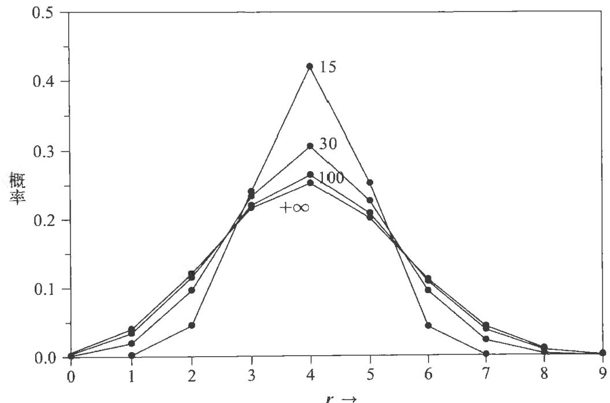

但是,我们也可以先把  $A B$  作为一个命题来考虑。由此,可以通过另一种顺序推理,得到不同的表达式:

$(A B C^{\prime}D) = F[(C^{\prime}D),(A B|C^{\prime}D)] = F\{(C^{\prime}D),F[(B|C D),(A|B C^{\prime}D)]\} .$  (2.12b)要让此规则代表一种一致的推理方式,则两个表达式(2.12a)和(2.12b)必须始终相等。在这种情况下,机器人进行一致性推理的必要条件是,函数必须满足函数方程

$$
F[F(x,y),z] = F[x,F(y,z)]. \tag{2.13}
$$

这个方程在数学上有着悠久的历史,阿贝尔(N.H.Abel,1826)最早在书中使用了这个方程。奥采尔在他的关于函数方程的巨著(Aczel,1966)中,非常恰当地称之为"结合方程",并列出了98条讨论或使用它的参考文献。奥采尔没有假定可微性,推导出了该方程的一般解(2.27)。遗憾的是,他的证明过于繁复,占用了他书中11页的篇幅(第  $256\sim 267$  页)(另见Aczel,1987)。我们在这里给出考克斯(R.T.Cox,1961)假定了可微性的较短证明。另外参见附录B中的讨论。

显然,(2.13)有一个平凡解:  $F(x,y) =$  常数。但这违反了我们的单调性需求(2.10),并且在任何情况下都对我们的目的没有用处。除非(2.13)有非平凡解,否则这种方法将失效。因此,我们寻求的是最一般的非平凡解。使用缩写

$$
u\equiv F(x,y),\quad v\equiv F(y,z), \tag{2.14}
$$

但仍视  $x,y,z$  为自变量,待解的函数方程为

$$
F(x,v) = F(u,z). \tag{2.15}
$$

遵循(2.10)的记号,对  $x$  和  $y$  微分,我们有

$$
\begin{array}{c}{{F_{1}(x,v)=F_{1}(u,z)F_{1}(x,y),}}\\ {{F_{2}(x,v)F_{1}(y,z)=F_{1}(u,z)F_{2}(x,y).}}\end{array} \tag{2.16}
$$

(2.16)

从上面的方程中消去  $F_{1}(u,z)$ ,并记  $G(x,y)\equiv F_{2}(x,y) / F_{1}(x,y)$ ,得到

$$
G(x,v)F_{1}(y,z) = G(x,y). \tag{2.17}
$$

显然,(2.17)的左侧必须独立于  $z$ 。现在,(2.17)可以等价地写成

$$
G(x,v)F_{2}^{\prime}(y,z) = G(x,y)G(y,z). \tag{2.18}
$$

分别用  $U$  和  $V$  表示(2.17)和(2.18)的左侧,可以验证  $\partial V / \partial y = \partial U / \partial z$ 。因此, $G(x,y)G(y,z)$  必须独立于  $y$ 。具有此属性的最一般函数  $G(x,y)$  是

$$
G(x,y) = r\frac{H(x)}{H(y)}, \tag{2.19}
$$

其中  $r$  是常数,函数  $H(x)$  是任意的。在本例中,由函数  $F$  的单调性知  $G > 0$ ,因此要求  $r > 0$ ,并且  $H(x)$  在定义域中不会改变符号。使用(2.19),则(2.17)

和(2.18)变为

$$
\begin{array}{l}{{F_{1}(y,z)=\frac{H(v)}{H(y)},}}\\ {{F_{2}(y,z)=r\frac{H(v)}{H(z)}.}}\end{array} \tag{2.20}
$$

关系  $\mathrm{d}v = \mathrm{d}F(y,z) = F_{1}\mathrm{d}y + F_{2}\mathrm{d}z$  变为如下形式:

$$
\frac{\mathrm{d}v}{H(v)} = \frac{\mathrm{d}y}{H(y)} +r\frac{\mathrm{d}z}{H(z)}. \tag{2.22}
$$

积分后可得

$$
w[F(y,z)] = w(v) = w(y)w^{r}(z), \tag{2.23}
$$

其中,

$$
w(x)\equiv \exp \left\{\int^{r^{x}}\frac{\mathrm{d}x}{H(x)}\right\} . \tag{2.24}
$$

积分没有下限,表示  $w$  中可以有任意乘法因子,对(2.15)取函数  $w(\cdot)$  并应用(2.23),得到  $w(x)w^{r}(v) = w(u)w^{r}(z)$ 。再次应用(2.23),我们的函数方程变为

$$
w(x)w^{r}(y)[w(z)]^{r^{2}} = w(x)w^{r}(y)w^{r}(z). \tag{2.25}
$$

因此,只有当  $r = 1$  时,我们才能得到非平凡解。最终结果可以表示为以下两种形式之一:

$$
w[F(x,y)] = w(x)w(y), \tag{2.26}
$$

$$
F(x,y) = w^{-1}[w(x)w(y)]. \tag{2.27}
$$

逻辑积的结合性与可交换性要求所寻找的关系必须采取如下函数形式:

$$
w(AB|C) = w(A|BC)w(B|C) = w(B|AC)w(A|C), \tag{2.28}
$$

今后称之为乘法规则。根据其构造函数(2.24),  $w(x)$  一定是连续单调正值函数,根据  $H(x)$  的符号的正负增大或减小。在当前阶段,它是任意的。

(2.28)已被推导为要达成合情条件(IIIa)的一致性而必须满足的必要条件。反过来,很明显,(2.28)也足以确保任意数量的联合命题的这种一致性。例如,以(2.12)的方式连续分解  $ABCDEFGC|H$  的方法有很多种,但只要满足(2.28),它们都会产生相同的结果。

定性地与常识相符的要求对函数  $w(x)$  施加了额外的条件。例如,在(2.28)的第一种形式中,假设当给定  $C$  时  $A$  是确定的,那么,在由  $C$  的知识产生的"逻辑环境"中,命题  $AB$  和  $B$  是相同的:一个为真当且仅当另一个为真。根据我们在第1章中讨论的最原始的公理,具有相同真值的命题必须具有相同的合情程度:

$$
A B|C = B|C, \tag{2.29}
$$

向扎我们行

$$
A|B C^{\prime} = A|C^{\prime}. \tag{2.30}
$$

这是因为,如果当给定  $C$  时  $A$  是确定的(即  $C$  蕴涵  $A$  ),那么,当给出任何与  $C$  不矛盾的其他信息  $B$  时,  $A$  仍然是确定的.在这种情况下,(2.28)变为

$$
w(B|C) = w(A|C)w(B|C). \tag{2.31}
$$

无论  $B$  对机器人有多么合情或不合情,它都必须成立.所以,我们的函数  $w(x)$  必须具有如下性质:

现在假设当给定  $C$  时  $A$  是不可能的,那么当给定  $C$  时命题  $AB$  也是不可能的:

$$
AB|C = A|C. \tag{2.33}
$$

如果当给定  $C$  时  $A$  已经变得不可能(即  $C$  蕴涵  $\overline{A}$  ),那么,当给出任何不与  $C$  矛盾的进一步信息  $B$  时,  $A$  仍然是不可能的:

$$
A|B C = A|C. \tag{2.34}
$$

在这种情况下,(2.28)变为

$$
w(A|C) = w(A|C)w(B|C). \tag{2.35}
$$

无论  $B$  具有怎样的合情性,这个等式都必须成立.只有两个可能的  $w(A|C)$  值满足这个条件:0或  $+\infty (- \infty$  被排除了,否则,根据连续性,  $w(B|C)$  必须能够取负值,这与(2.35)矛盾).

总之,定性地与常识相符要求  $w(x)$  是连续单调正值函数.它可能增大,也可能减小.如果是增函数,它的范围必须是从0(不可能)到1(确定).如果是减函数,它的范围必须是从  $+\infty$  (不可能)到1(确定).到目前为止,我们的条件根本没有说明它们如何在这些范围内变化.

然而,这两种可能的表示在内容上没有什么不同.给定符合上述标准并且用  $+\infty$  表示不可能的任意函数  $w_{1}(x)$  ,我们可以定义同样符合上述标准并且用0表示不可能的新函数  $w_{2}(x)\equiv 1 / w_{1}(x)$  .因此,如果我们现在选择  $0\leqslant w(x)\leqslant 1$  作为约定,将不会失去一般性.也就是说,就内容而言,与我们的合情条件一致的所有可能性都包含在这种形式中.(正如读者可以验证的那样,我们也可以选择相反的约定.从这一点开始发展整个理论及其所有应用,也会很顺利,虽然其方程式的形式不太常见,却有相同的内容.)

# 2.2 加法规则

由于我们现在考虑的命题属于亚里士多德逻辑类型,它们必须是非真即假的,其逻辑积  $A\overline{{A}}$  总是假的,逻辑和  $A + \overline{{A}}$  总是真的.  $A$  为假的合情性必须在某种程度上取决于它为真的合情性,如果我们定义  $w\equiv w(A|B)$  和  $v\equiv w(\overline{{A}} |B)$  ,则必定存在某种函数关系

$$
v = S(u), \tag{2.36}
$$

显然,定性地与常识相符要求  $S(u)$  是  $0\leqslant u\leqslant 1$  的连续单调递减函数,并且有极值  $S(0) = 1$  和  $S(1) = 0$  ,但它不能是具有这些属性的任意函数,因为它必须与对于  $A B$  或  $A\overline{{B}}$  的乘法规则一致:

$$
\begin{array}{r}{w(A B|C) = w(A|C)w(B|A C),}\\ {w(A\overline{{B}} |C) = w(A|C)w(\overline{{B}} |A C).} \end{array} \tag{2.38}
$$

应用(2.36)和(2.38),(2.37)变为:

$$
w(A B|C) = w(A|C)S[w(\overline{{B}} |A C)] = w(A|C)S\left[\frac{w(A\overline{{B}}|C)}{w(A|C)}\right]. \tag{2.39}
$$

我们再次应用交换性:  $w(A B|C)$  关于  $A$  和  $B$  对称,因此一致性要求

$$
w(A|C)S\left[\frac{w(A\overline{{B}}|C)}{w(A|C)}\right] = w(B|C)S\left[\frac{w(B\overline{{A}}|C)}{w(B|C)}\right]. \tag{2.40}
$$

这对于所有命题  $A,B,C$  都必须成立,特别地,给定任意新命题  $D$  ,当

$$
\overline{{B}} = A D \tag{2.41}
$$

时(2.40)必须成立,在条件(2.41)下,从前面的(1.13)可知

$$
A\overline{{B}} = \overline{{B}},\qquad B\overline{{A}} = \overline{{A}}, \tag{2.42}
$$

这样,我们可以在(2.40)中进行替换

$$
\begin{array}{r}{w(A\overline{{B}} |C) = w(\overline{{B}} |C) = S[w(B|C)],}\\ {w(B\overline{{A}} |C) = w(\overline{{A}} |C) = S[w(A|C)].} \end{array} \tag{2.43}
$$

令

$$
x\equiv w(A|C),\quad y\equiv w(B|C), \tag{2.44}
$$

(2.40)就变成了函数方程

$$
x S\left[\frac{S(y)}{x}\right] = y S\left[\frac{S(x)}{y}\right],\quad 0\leqslant S(y)\leqslant x,0\leqslant x\leqslant 1, \tag{2.45}
$$

这表明,为与乘法规则一致,  $S(x)$  必须具有缩放属性,在  $y = 1$  的特殊情况下,它变为

$$
S[S(x)] = x, \tag{2.46}
$$

这表明  $S(x)$  是自反函数:  $S(x) = S^{- 1}(x)$  。因此,从(2.36)可以得出  $u = S(v)$  但这只体现了一个明显的事实,即  $A$  和  $\overline{A}$  之间的关系是自反的,至于字母和带上横线的字母哪个表示原命题,哪个表示命题的否定,都无关紧要,之前在(1.8)中我们就注意到了这一点,即使当时这还不够明显,现在我们也应该完全意识到了.

(2.45)给出的有效定义域的推导如下,由于命题  $D$  是任意的,通过  $D$  的各种选择,我们可以得到  $w(D|AC)$  在

$$
0\leqslant w(D|A C)\leqslant 1 \tag{2.47}
$$

内的所有值,但是  $S(y) = w(AD|C) = w(A|C)w(D|AC)$  ,所以(2.47)就是  $0\leqslant$ $S(y)\leqslant x$  ,如(2.45)所述,该区域对于  $x$  和  $y$  是对称的:  $x$  和  $y$  互换,它同样成立,几何上,它由  $xy$  平面中单位正方形(  $0\leqslant x,y\leqslant 1$  )内、曲线  $y = S(x)$  上方(含该曲线)的所有点组成

实际上,该曲线的形状已经由(2.45)对在它上方无限小处的点的论述确定这是因为,如果我们令  $y = S(x) + \epsilon$  ,那么随着  $\epsilon \rightarrow 0^{+}$  ,(2.45)中的两项会以不同的速率趋于  $S(1) = 0$  ,因此,一切都取决于当  $\delta \rightarrow 0$  时  $S(1 - \delta)$  趋于0的具体方式,为了研究这一点,我们用

$$
\frac{S(x)}{y} = 1 - \exp \{-q\} \tag{2.48}
$$

定义一个新变量  $q(x,y)$  ,然后,我们可以选择  $\delta = \exp \{- q\}$  ,用

$$
S(1 - \delta) = S(1 - \exp \{-q\}) = \exp \{-J(q)\} \tag{2.49}
$$

定义函数  $J(q)$  ,并找出当  $q\rightarrow +\infty$  时  $J(q)$  的渐近形式

现在视  $x$  和  $q$  为自变量,从(2.48)得到

$$
S(y) = S[S(x)] + \exp \{-q\} S(x)S^{\prime}[S(x)] + O(\exp \{-2q\}). \tag{2.50}
$$

利用(2.46)及其导数  $S^{\prime}[S(x)]S^{\prime}(x) = 1$  ,得到

$$
\frac{S(y)}{x} = 1 - \exp \{-(\alpha +q)\} +O(\exp \{-2q\}), \tag{2.51}
$$

其中

$$
\alpha (x)\equiv \ln \left[\frac{-x S^{\prime}(x)}{S(x)}\right] > 0. \tag{2.52}
$$

通过这些替换,函数方程(2.45)变为

$$
J(q + \alpha) - J(q) = \ln \left[\frac{x}{S(x)}\right] + \ln (1 - \exp \{-q\}) + O(\exp \{-2q\}), \tag{2.53}
$$

$$
0< q< +\infty ,0< x\leqslant 1.
$$

当  $q\rightarrow +\infty$  时,最后两项以指数方式快速变为0,因此  $J(q)$  必定是渐近线性的:

$$
J(q)\sim a + bq + O(\exp \{-q\}), \tag{2.54}
$$

且具有正斜率

$$
b = \alpha^{-1}\ln \left[\frac{x}{S(x)}\right]. \tag{2.55}
$$

在(2.54)中,没有周期为  $\alpha$  的周期项,因为(2.53)必须对于连续的不同  $x$  值保持成立,进而对于连续的  $\alpha (x)$  值成立。但是,根据定义, $J$  只是  $q$  的函数,因此(2.55)的右侧必须独立于  $x$ 。利用(2.52)可以得到

$$
\frac{x}{S(x)} = \left[\frac{-x S'(x)}{S(x)}\right]^{\delta}, \qquad 0 < b < +\infty . \tag{2.56}
$$

也可以变形一下,则  $S(x)$  必须满足微分方程:

$$
S^{m - 1}\mathrm{d}S + x^{m - 1}\mathrm{d}x = 0, \tag{2.57}
$$

其中  $m \equiv 1 / b$  是正常数。满足  $S(0) = 1$  的唯一解是

$$
S(x) = (1 - x^{m})^{1 / m}, \qquad 0 \leqslant x \leqslant 1, 0 < m < +\infty . \tag{2.58}
$$

反过来,我们可以立即验证(2.58)是(2.45)的解

通过一种不同的证明方式,考克斯(R.T.Cox,1946)首先得出了结果(2.58)。他在证明中假定了  $S(x)$  二次可微。另外,奥采尔(Aczel,1966)在没有假定可微性的情况下得出了相同的结果。(但是,在目前的应用中,假设可微性无伤大雅。这是因为,如果函数方程导致我们得到不可微的函数,我们就可以认为它违反常识,从而拒绝整个理论。)无论如何,(2.58)都是满足函数方程(2.45)和左边界条件  $S(0) = 1$  的最一般函数。然后,我们会发现它自动满足正确的右边界条件  $S(1) = 0$ 。

由于对函数方程(2.45)的推导使用了(2.41)对  $B$  的特殊选择,我们到目前为止只表明了(2.58)是满足一般的一致性要求(2.40)的必要条件。要检查其是否充分,将(2.58)代入(2.40)。我们得到

$$
w^{m}(A|C) - w^{m}(A\overline{B} |C) = w^{m}(B|C) - w^{m}(B\overline{A} |C), \tag{2.59}
$$

这是由(2.28)和(2.38)可以轻易得到的等式。因此,(2.58)是  $S(x)$  在(2.40)意义下的一致性的充分必要条件。

到目前为止,我们的结果可总结如下。逻辑积的结合性要求合情性  $x = A|B$  的单调函数  $w(x)$  必须遵守乘法规则(2.28)。我们的结果(2.58)指出,这个函数也必须遵守加法规则:对于正数  $m$  有

$$
w^{m}(A|B) + w^{m}(\overline{A} |B) = 1. \tag{2.60}
$$

当然,乘法规则也可以写成

$$
w^{m}(A B|C) = w^{m}(A|C)w^{m}(B|A C) = w^{m}(B|C)w^{m}(A|B C). \tag{2.61}
$$

我们发现  $m$  的值实际上无关紧要,这是因为,无论  $m$  取什么值,都可以定义个新函数

$$
p(x) \equiv u^{rn}(x). \tag{2.62}
$$

这样,我们的规则将变成

$$
\begin{array}{c}p(AB|C) = p(A|C)p(B|AC) = p(B|C)p(A|BC), \\ p(A|B) + p(\overline{A} |B) = 1. \end{array} \tag{2.64}
$$

事实上,这并没有丧失一般性,因为我们对函数  $w(x)$  施加的唯一要求是,它是定义于不可能性  $w = 0$  和确定性  $w = 1$  之间的连续单调递增函数,如果  $w(x)$  满足此条件,那么  $w^{m}(x)$  (  $0 < m < +\infty$  )也是如此。因此,使用不同的  $m$  值并不能给我们带来  $w(x)$  的任意性中所没有的自由度,我们的合情条件所允许的所有可能性都包含在(2.63)和(2.64)中,其中  $p(x)$  是任意连续单调递增函数,值域为  $0 \leqslant p(x) \leqslant 1$  。

是否需要更多的关系来得到一套完备的合情推理规则,以便确定任意逻辑函数  $f(A_1, \dots , A_n)$  的合情性呢?在乘法规则(2.63)和加法规则(2.64)中,我们得到了合取  $AB$  和否定  $\overline{A}$  的合情性公式。在(1.23)之后的讨论中,我们已经注意到合取和否定是运算的完备集合,可以从中构造所有逻辑函数。

因此,大家可能会猜测,我们应该已经完成了对基本规则的探索。通过反复应用乘法规则和加法规则,我们应该可以得到  $\{A_1, \dots , A_n\}$  生成的布尔代数中任意命题的合情性。

为了验证这一点,我们首先寻找逻辑和  $A + B$  的公式。反复应用乘法规则和加法规则,可以得到

$$
\begin{array}{r l} & {p(A + B|C) = 1 - p(\overline{{A}}\overline{{B}} |C)}\\ & {\qquad = 1 - p(\overline{{A}} |C)p(\overline{{B}} |\overline{{A}} C)}\\ & {\qquad = 1 - p(\overline{{A}} |C)[1 - p(B|\overline{{A}} C)]}\\ & {\qquad = p(A|C) + p(\overline{{A}} B|C)}\\ & {\qquad = p(A|C) + p(B|C)p(\overline{{A}} |B C)}\\ & {\qquad = p(A|C) + p(B|C)[1 - p(A|B C)].} \end{array} \tag{2.65}
$$

最后,我们有

$$
p(A + B|C) = p(A|C) + p(B|C) - p(AB|C). \tag{2.66}
$$

在应用中,这个广义加法规则是最有用的公式之一。显然,原始加法规则(2.64)是(2.66)在  $B = \overline{A}$  时的特例。

练习2.1 能否从乘法规则和加法规则中得到类似(2.66)的  $p(C|A + B)$  的一般性公式?如果能,推导出该公式;如果不能,解释原因。

练习2.2假设有一组命题  $\{A_{1},\dots ,A_{n}\}$  ,它们对于信息  $X$  是互斥的:  $p(A_{i}A_{j}|$ $X) = p(A_{i}|X)\delta_{i j}$  证明  $p(C|(A_{1} + A_{2} + \dots +A_{n})X)$  是合情性函数  $p(C|A_{i}X)$  的加权平均值:

$$
\begin{array}{c}{{p(C|(A_{1}+\cdots+A_{n})X)=p(C|A_{1}X+A_{2}X+\cdots+A_{n}X)}}\\ {{=\frac{\sum_{i}p(A_{i}|X)p(C|A_{i}X)}{\sum_{i}p(A_{i}|X)}.}}\end{array} \tag{2.67}
$$

为了扩展结果(2.66),我们在(1.17)之后注意到,除相互矛盾之外的任何逻辑函数都可以用规范析取范式表示为基本合取式的逻辑和,如(1.17)。现在,任何一个基本合取式  $\{Q_{i}, 1 \leqslant i \leqslant 2^{n}\}$  的合情性都可以通过重复应用乘法规则确定,然后,重复应用(2.66)将产生  $Q_{i}$  的任意逻辑和的合情性。事实上,这些合取是互斥的,所以我们会发现[见后面的(2.85)],这可以简化为一个最多有  $2^{n} - 1$  项的简单和式  $\sum_{i} p(Q_{i} | C)$ 。

因此,正如合取和否定是演绎逻辑的一组完备运算集,上述乘法规则和加法规则在以下意义上是合情推理的一组完备规则集:每当背景信息足以确定基本合取式的合情性时,我们的规则就足以确定  $\{A_{1}, \dots , A_{n}\}$  生成的布尔代数中每个命题的合情性。因此,在  $n = 4$  的情况下,我们需要  $2^{4} = 16$  个基本合取式的合情性,从而我们的规则将确定布尔代数中  $2^{16} = 65536$  个命题的合情性。

然而,这几乎总是比我们在实际应用中需要的更多。如果背景信息足以确定一些基本合取式的合情性,那么这些合情性对于我们关注的一小部分布尔代数来说可能已经足够了。

# 2.3 定性属性

现在让我们检验一下基于(2.63)和(2.64)的推理理论如何与演绎逻辑理论及第1章一开始提到的各种定性三段论相关联。显而易见的是,在  $p(A | B) \rightarrow 0$  或  $p(A | B) \rightarrow 1$  的极限情形下,加法规则(2.64)表述了亚里士多德逻辑的原始假设:若  $A$  为真,则  $\overline{A}$  必定为假,等等。

实际上,所有这些逻辑都包括两种强三段论(1.1)和(1.2)及从它们推演出的所有内容。现在使用蕴涵标记(1.14)来表示大前提,(1.1)和(1.2)变为

$$
\begin{array}{c c}{{A\Rightarrow B}}&{{A\Rightarrow B}}\\ {{A\stackrel{\boxplus}{\boxplus}}}&{{B\stackrel{\boxplus}{\boxplus}}}\\ {{B\stackrel{\boxplus}{\boxplus}}}&{{A\stackrel{\boxplus}{\boxplus}}}\end{array}, \tag{2.68}
$$

它们有无穷无尽的推论。如果我们用  $C$  表示它们的大前提,即

$$
C\equiv A\Rightarrow B, \tag{2.69}
$$

那么,这两种三段论分别对应乘法规则(2.63)的以下形式:

$$
p(B|AC) = \frac{p(AB|C)}{p(A|C)}, \quad p(A|\overline{B} C) = \frac{p(A\overline{B}|C)}{p(\overline{B}|C)}. \tag{2.70}
$$

从(2.68)我们得到  $p(AB|C) = p(A|C)$  和  $p(A\overline{B} |C) = 0$ ,因此(2.70)简化为

$$
p(B|AC) = 1, \quad p(A|\overline{B} C) = 0. \tag{2.71}
$$

这正是三段论(2.68)陈述的内容。因此,关系很简单:亚里士多德演绎逻辑是我们的合情推理规则在机器人对其结论越来越确信时的极限形式。

但是,我们的规则也包含了演绎逻辑中没有的内容:弱三段论(1.3)和(1.4)的定量形式。为了表明那些原创性的定性陈述总是可以从当前规则中推演出来,请注意第一种弱三段论

$$
\frac{A\Rightarrow B}{\frac{B\boxplus}{A\boxplus\boxplus\boxplus\boxplus\boxplus\boxplus}} \tag{2.72}
$$

对应乘法规则的如下形式:

$$
p(A|BC) = p(A|C)\frac{p(B|AC)}{p(B|C)}. \tag{2.73}
$$

但是,根据(2.68)有  $p(B|AC) = 1$ 。由于  $p(B|C)\leqslant 1$ ,(2.73)表明

$$
p(A|BC)\geqslant p(A|C), \tag{2.74}
$$

正如(2.72)所述。同样,第二种弱三段论

$$
\frac{A\Rightarrow B}{\frac{A\boxplus}{B\boxplus\boxplus\boxplus\boxplus\boxplus\boxplus}} \tag{2.75}
$$

对应乘法规则的如下形式:

$$
p(B|\overline{A} C) = p(B|C)\frac{p(\overline{A}|BC)}{P(\overline{A}|C)}. \tag{2.76}
$$

从(2.74)可以得到  $p(\overline{A} |BC) \leqslant p(\overline{A} |C)$ ,因此(2.76)表明

$$
p(B|\overline{A} C) \leqslant p(B|C), \tag{2.77}
$$

正如(2.75)所述

最后,警察推理所使用的三段论(1.5),虽然抽象地来看似乎非常弱,但也包含在形式为(2.73)的乘法规则中,现在用  $C$  代表背景信息[在(1.5)中没有明确指出,因为它的必要性在那时还不明显],则大前提"  $A$  真则  $B$  更合情"的形式是

$$
p(B|AC) > p(B|C). \tag{2.78}
$$

(2.73)立刻给出

$$
p(A|BC) > p(A|C), \tag{2.79}
$$

正如(1.5)所述

现在我们有的不只是定性陈述(2.79).在第1章我们就考虑过,但是当时没有回答的问题是:是什么决定了证据  $B$  是将  $A$  提升到几乎确定的程度,还是对  $A$  的合情性产生几乎可以忽略不计的影响呢?(2.73)给出的答案是:因为  $p(B|AC)$  不会大于1,所以只有当  $p(B|C)$  非常小时,  $A$  的合情性才会大幅增加,几乎可以肯定观察到男子的行为(  $B$  )使他有罪(  $A$  ),因为这种行为在已知背景信息的条件下是非常不可能发生的:没有警察见过无辜的人这样做,此外,如果知道  $A$  为真只能使  $B$  的合情性有微不足道的增加,那么观察到  $B$  反过来也只能使  $A$  的合情性有几乎可以忽略不计的增加

我们还可以对这种类型给出更多的比较,事实上,许多作者已经注意到并且证明了这些规则与常识的完全定性对应关系,其中包括凯恩斯(Keynes,1921)杰弗里斯(Jeffreys,1939)、波利亚(Polya,1945,1954)考克斯(R.T.Cox,1961)、特里布斯(Tribus,1969)、德菲内蒂(de Finetti,1974a,b)和罗森克兰茨(Rosenkrantz,1977)我们在前言和第1章中简要描述了波利亚的处理方式,刚刚则更全面地重述了考克斯的处理方式,但是,我们现在的目标是向前推进到定量化的应用,所以要回到理论发展本身.

# 2.4 数值

到目前为止,我们已经发现了机器人操作合情性的最一般化的一致性规则,前提是它必须将合情性与实数相关联,以便它的"大脑"可以通过执行某些明确的物理过程来运作,虽然我们对这些规则的常见形式和刚刚提到的定性属性感到欢欣鼓舞,但两个明显的情况表明我们设计机器人"大脑"的工作尚未完成.

首先,虽然规则(2.63)和(2.64)对不同命题的合情性必须怎样关联做了一些

限制,但我们似乎还没有找到我们的机器人可以进行合情推理的唯一规则,只是找到了无数可能的规则,单调函数  $p(x)$  的不同选择,似乎对应着不同的规则,具有不同的内容。

其次,到目前为止,没有什么规则告诉我们在问题开头应该如何给合情性实际赋值,以便机器人开始计算,机器人如何将背景信息的初始编码转化为合情性的确定数值呢?为此,我们必须诉诸(1.39)中尚未使用的"接口"合情条件(IIIb)和(IIIc)。

以下分析用有趣和意外的方式回答了这两个问题,考虑合情性  $(A_{1} + A_{2} + A_{3}|B)$  的值,即三个命题  $\{A_{1},A_{2},A_{3}\}$  中至少一个为真的合情性,我们可以通过两次应用广义加法规则(2.66)来找到这个合情性,第一次应用(2.66)得到

\[ p(A_{1}+A_{2}+A_{3}|B)=p(A_{1}+A_{2}|B)+p(A_{3}|B)- p(A_{1}A_{3}+A_{2}A_{3}|B), \] (2.80)其中我们将  $(A_{1} + A_{2})$  作为一个命题,并且应用了逻辑关系

$$
(A_{1} + A_{2})A_{3} = A_{1}A_{3} + A_{2}A_{3}. \tag{2.81}
$$

再次应用(2.66)得到七项,分组如下:

$$
\begin{array}{r l} & {p(A_{1} + A_{2} + A_{3}|B) = p(A_{1}|B) + p(A_{2}|B) + p(A_{3}|B)}\\ & {\qquad -p(A_{1}A_{2}|B) - p(A_{2}A_{3}|B) - p(A_{3}A_{1}|B)}\\ & {\qquad +p(A_{1}A_{2}A_{3}|B).} \end{array} \tag{2.82}
$$

现在假设这些命题是互斥的,即证据  $B$  蕴涵没有两个命题可以同时为真:

$$
p(A_{i}A_{j}|B) = p(A_{i}|B)\delta_{i j}. \tag{2.83}
$$

这样,(2.82)的最后四项都为0,我们有

$$
p(A_{1} + A_{2} + A_{3}|B) = p(A_{1}|B) + p(A_{2}|B) + p(A_{3}|B). \tag{2.84}
$$

添加更多命题  $A_{4},A_{5}$  等,通过数学归纳法很容易证明,如果我们有  $n$  个两两互斥的命题  $\{A_{1},\dots ,A_{n}\}$ ,那么(2.84)可以推广为

$$
p(A_{1} + \dots +A_{m}|B) = \sum_{i = 1}^{m}p(A_{i}|B),\qquad 1\leqslant m\leqslant n. \tag{2.85}
$$

从现在开始,我们将不断使用此规则

在概率论的传统论述中,(2.85)通常被作为看似很随意的基本公理引人,本书的方法表明,该规则可从简单的一致性定性条件中推导出来,我们力图避免将(2.85)视为原始的基本关系(参见2.6节)

现在假定命题  $\{A_{1},\dots ,A_{n}\}$  不仅是互斥的,而且是穷尽的,即背景信息  $B$  决定了其中一个且仅一个必须为真,在这种情况下,当  $m = n$  时,和式(2.85)必

须等于1:

$$
\sum_{i = 1}^{n}p(A_{i}|B) = 1. \tag{2.86}
$$

仅凭这一点还不足以确定每个数值  $p(A_{i}|B)$  .根据信息  $B$  的不同细节,可能有许多不同的选择是可行的,一般来说,通过  $B$  的逻辑分析找到  $p(A_{i}|B)$  可能是一个难题,事实上,这是一个开放性问题,因为  $B$  中可能包含的各种复杂信息没法穷尽,因此,将该信息转换为  $p(A_{i}|B)$  的数值的复杂数学问题也没有尽头,正如我们将要看到的,这是当前最重要的研究问题之一,可以将信息  $B$  转化为  $p(A_{i}|B)$  的数值的每一个新原理,都将为该理论开辟一类有用的新应用.

然而,有一种情况下的答案特别简单,只需要直接应用已经给出的原理,但是,我们现在正进入一个非常微妙的领域,过去一个多世纪以来,这个领域一直是混乱和争议的根源,在该理论的早期阶段,就像在初等几何中一样,我们的直觉往往比逻辑分析走得更远,以至于逻辑分析的重要性经常被忘记,问题随之而来:直觉虽然能让我们更快地得出相同的最终结论,但没有让我们正确理解其有效范围,结果就是,该理论的发展停滞了大约150年,因为不同的人对于这些问题总是基于相互矛盾的直觉进行辩论,而不是基于逻辑论证.

因此,我们必须要求读者压制住所有直觉,让自己完全受以下逻辑分析的引导,我们要非常谨慎地阐明以下要点,如果不能清楚地理解它,此后我们将面临概念上的巨大困难.

我们考虑两个不同的问题,问题I是前面刚刚构想的问题:我们有一个互斥且穷尽的命题集合  $\{A_{1},\dots ,A_{n}\}$  ,试求  $p(A_{i}|B)_{\mathrm{I}}$  的值,问题II与问题I的不同在于,前两个命题  $A_{1}$  和  $A_{2}$  互换了下标,当然,这些下标完全是任意的,哪个命题称为  $A_{1}$  ,哪个称为  $A_{2}$  并没有差别,因此,在问题II中,我们也有一个互斥和穷尽的命题集合  $\{A_{1}^{\prime},\dots ,A_{n}^{\prime}\}$  ,其中

$$
\begin{array}{r l} & {A_{1}^{\prime}\equiv A_{2},}\\ & {A_{2}^{\prime}\equiv A_{1},}\\ & {A_{k}^{\prime}\equiv A_{k},\quad 3\leqslant k\leqslant n.} \end{array} \tag{2.87}
$$

对于  $i = 1,2,\dots ,n$  ,试求  $p(A_{i}^{\prime}|B)_{\mathrm{II}}$  的数值

在交换下标后,我们有了两个不同但密切相关的问题,显然,无论机器人对问题I中的  $A_{1}$  有怎样的知识状态,都必须与对问题II中  $A_{2}^{\prime}$  的知识状态相同.因为它们是相同的命题,而且在两个问题中给定的背景信息  $B$  是相同的,在这两

个问题中, 机器人都在考虑相同的命题  $\{A_{1}, \dots , A_{n}\}$ . 因此必须有

$$
p(A_{1}|B)_{\mathrm{I}} = p(A_{2}^{\prime}|B)_{\mathrm{II}}, \tag{2.88}
$$

类似地有

$$
p(A_{2}|B)_{\mathrm{I}} = p(A_{1}^{\prime}|B)_{\mathrm{II}}. \tag{2.89}
$$

上述两个方程称为变换方程, 它们只描述了这两个问题是如何相互关联的, 因此对于任何信息  $B$  都必须成立, 无论问题 I 中的命题  $A_{1}$  和  $A_{2}$  对于机器人来说是多么合情合理或难以置信, 都是如此.

现在假设信息  $B$  对于命题  $A_{1}$  和  $A_{2}$  没有区别, 也就是说, 如果它关于一个命题说明了什么, 那么它关于另一个命题也说明了同样的东西, 因此它没有包含可以让机器人偏向某一命题的理由. 在这种情况下, 问题 I 和问题 II 不仅是相关的, 而且是完全等同的: 机器人在问题 II 中关于命题集合  $\{A_{1}^{\prime}, \dots , A_{n}^{\prime}\}$  的知识状态, 包括它们的下标, 与问题 I 中关于命题集合  $\{A_{1}, \dots , A_{n}\}$  的相同.

现在我们在 (1.39) 和 (IIIc) 的意义上应用一致性合情条件. 它表明, 必须分配等同的合情性值来表示等同的知识状态. 我们用方程表示这个陈述:

$$
p(A_{i}|B)_{\mathrm{I}} = p(A_{i}^{\prime}|B)_{\mathrm{II}}, \quad i = 1, 2 \dots , n, \tag{2.90}
$$

称为对称方程. 结合 (2.88)、(2.89) 和 (2.90) 可以得到:

$$
p(A_{1}|B)_{\mathrm{I}} = p(A_{2}|B)_{\mathrm{II}}. \tag{2.91}
$$

换句话说, 在问题 I 中, 命题  $A_{1}$  和命题  $A_{2}$  必须被赋予相同的合情性. (当然, 在问题 II 中也是如此.)

在这一点上, 根据你的个性和对这个主题的背景知识, 你可能会对 (2.91) 的结果感到赞许, 也可能会非常失望. 我们刚刚给出的论证是用来给合情性赋值的群不变性原则的第一个"婴儿"版本. 在第 6 章中, 当我们考虑给"无信息先验"赋值的一般性问题时, 它会被大幅扩展.

更一般地, 假设  $\{A_{1}^{\prime \prime}, \dots , A_{n}^{\prime \prime}\}$  是  $\{A_{1}, \dots , A_{n}\}$  的任意排列. 问题 III 是确定  $p(A_{i}^{\prime \prime}|B)$  的值. 如果排列由  $A_{i}^{\prime \prime} \equiv A_{i}$  确定, 将有  $n$  个如下形式的变换方程:

$$
p(A_{i}|B)_{\mathrm{I}} = p(A_{k}^{\prime \prime}|B)_{\mathrm{III}}. \tag{2.92}
$$

它们表明了问题 I 和问题 III 是如何相互关联的. 对于任意给定的信息  $B$ , 这些关系都成立.

但是, 如果信息  $B$  对于所有命题  $A_{i}$  都没有区别, 那么, 对于问题 III 中的命题集合  $\{A_{1}^{\prime \prime}, \dots , A_{n}^{\prime \prime}\}$  和问题 I 中的集合  $\{A_{1}, \dots , A_{n}\}$ , 机器人有完全相同的知识状态. 同样, 我们的一致性合情条件要求机器人对于等同的知识状态中赋予等

同的合情性,从而导出  $n$  个对称条件:

$$
p(A_{k}|B)_{1} = p(A_{k}^{\prime \prime}|B)_{11},\qquad k = 1,2,\dots ,n. \tag{2.93}
$$

根据(2.92)和(2.93),我们得到形如

$$
p(A_{i}|B)_{1} = p(A_{k}|B)_{1} \tag{2.94}
$$

的  $n$  个等式.现在,对于任何我们定义问题III的特定排列,这些关系都必须成立.有  $n!$  种这样的排列,因此实际上有  $n!$  个等价的问题.对于给定的  $i$  ,(2.94)中的下标  $k$  将遍历所有其他  $n - 1$  个下标,因此,唯一的可能性是所有  $p(A_{i}|B)_{1}$  都相等(实际上,如果考虑单个置换的  $n$  阶循环,它也必须成立)由于  $\{A_{1},\dots ,A_{n}\}$  是穷尽的,(2.86)必须成立,从而唯一的可能性是

$$
p(A_{i}|B)_{1} = \frac{1}{n},\qquad 1\leqslant i\leqslant n. \tag{2.95}
$$

我们终于得出了一组确定的数值!根据凯恩斯的著作(Keynes,1921),我们将这个结果称为无差别原则

尽管我们警告了不要使用直觉,但读者也许已经凭直觉得出了同样的结论,并且不需要刚刚那样曲折的推理,如果是这样,那么至少这种直觉与我们的合情条件是一致的,但是,若直截了当地凭直觉写出(2.95),就不能让人认识到这个结果的重要性和唯一性,要看到其唯一性,请注意,如果机器人给出与(2.95)不同的赋值,那么仅通过下标的重新排列,我们就可以看到另一个问题:机器人会对相同的知识状态赋予不同的合情性

要明白其重要性,请注意,(2.95)实际上回答了本节一开始提出的两个问题它表明给予机器人的信息如何产生确定的数值,从而可以开始计算(这在特殊情况下可以大幅一般化).此外,它还显示了更为重要的东西,这在直觉上并不明显:给予机器人的信息确定了量  $p(x) = p(A_{i}|B)$  的数值,而不是我们开始定义的合情性  $x = A_{i}|B$  的数值,这在一般情况下也是正确的

认识到这一点,为本节开头提出的第一个问题提供了美妙的答案,在找到乘法规则和加法规则之后,我们似乎还没有找到任何唯一的推理规则,因为单调函数  $p(x)$  的不同选择将导致不同的一套套规则(即具有不同内容的一套套规则)但是,现在我们看到,无论选择什么函数  $p(x)$  ,都会得到相同的结果(2.95)以及 $p$  的相同数值,此外,正如乘法规则和加法规则所表明的那样,可以完全通过操纵量  $p$  来执行机器人的推理过程,机器人的最终结论可以用  $p$  而不是  $x$  来表示

因此,我们现在看到,函数  $p(x)$  的不同选择仅对应于我们设计机器人内部存储器电路的不同方式,对于每个要推理的命题  $A_{i}$  ,机器人都需要一个存储器地址,用于存储根据所有数据信息得到的代表  $A_{i}$  合情程度的数值,当然,它也可

以不存储数值  $p_{i}$ ,而是存储  $p_{i}$  的任何严格单调函数的值。无论在内部使用什么函数,机器人的外部可观察行为都是一样的。

一旦我们意识到这一点,就可以明显地看到,与其说  $p(x)$  是  $x$  的任意单调函数,不如反过来说:

合情性  $x \equiv A|B$  是  $p$  的任意单调函数,定义在  $0 \leqslant p \leqslant 1$  的范围内。由数据严格确定的是  $p$ ,而不是  $x$ 。

因此,唯一性问题由结果(2.95)自动解决了。尽管看起来不是如此,但实际上我们的机器人可以用来进行合情推理的一致规则只有一套。另外,我们开始提到的合情性  $x \equiv A|B$  实际上已经完全消失了!我们将不再需要使用它们。

既然可以完全通过量  $p$  实现我们的合情推理理论,最后就来引入其技术名称吧。从现在开始,我们将称这些量为概率。到目前为止,我们一直在刻意避免使用"概率"这个词,因为它虽然众所周知,对我们来说却是一个技术术语,应该有确切的含义。但是,在证明其数值由问题中的数据唯一确定之前,我们没有理由假设量  $p$  具有任何确切的意义。

现在我们看到,量  $p$  定义了可以测量合情程度的一种特定尺度。所有可能的单调函数在原则上都可以很好地服务于此目的,我们之所以选择这个特定的函数,不是因为它更正确,而是因为它更方便。也就是说,量  $p$  遵循最简单的组合规则:乘法规则和加法规则。因此, $p$  的数值直接由我们的信息确定。

这种情况类似于热力学中的情况。所有可能的经验温标  $t$  都是彼此的单调函数,我们之所以最终决定使用开尔文温标  $T$ ,不是因为它比其他温标更正确,而是因为它更方便。也就是说,热力学定律在这个特定的温标中具有最简单的形式( $dU = T\mathrm{d}S - P\mathrm{d}V$ , $\mathrm{d}G = - S\mathrm{d}T + V\mathrm{d}P$ ,等等)。因此,在实验可直接测量的意义上,开尔文温标的温度数值是"刚性固定的",与任何特定物质(如水或汞)的性质无关。

还可以马上从(2.95)导出对于我们的直觉同样有吸引力的另一个规则。考虑概率论中的传统"伯努利坛子"问题:坛子中的10个球具有相同的大小和重量,标号为  $\{1,2,\dots ,10\}$ ,其中的3个(标号为4,6,7)是黑球,另外7个是白球。我们摇动坛子并随机抽取一个球。(2.95)中的背景信息  $B$  由这两句陈述组成。我们取出一个黑球的概率是多少?

定义命题: $A_{i} \equiv$  取出的第  $i$  个球( $1 \leqslant i \leqslant 10$ )。由于背景信息对这10种可能性没有区别,所以(2.95)适用,机器人分配概率值

$$
p(A_{i}|B) = \frac{1}{10}, \qquad 1 \leqslant i \leqslant 10. \tag{2.96}
$$

说"取出一个黑球"就是"取出的球标号为4、6或7":

这些都是压斥的命题(即它们表示压斥的事件),因此(2.85)适用,机器人的结论是

正如直觉已经告诉我们的那样.更一般地,如果有  $N$  个这样的球,命题  $A$  被定义为在任意指定的  $M$  个球的子集上为真(  $0\leqslant M\leqslant N$  ),在其补集上为假,我们有

$$
p(A|B) = \frac{M}{N}. \tag{2.99}
$$

这正是詹姆斯·伯努利(JamesBernoulli,1713)给出的概率的原始数学定义,它在接下来的150年中被大多数作者使用.例如,拉普拉斯的巨著《分析概率论》(Laplace,1812)以这句话开头:

事件的概率是满足条件的实例数量与所有实例数量之比,前提是没有任何事情导致我们预期这些实例中的任何一个会比其他实例发生得更多,也就是对我们来说,它们是等可能的.

练习2.3一旦我们得到数值  $a = P(A|C)$  和  $b = P(B|C)$  ,乘法规则和加法规则就对它们的合取和析取的可能数值设置了一些限制.假设  $a\leqslant b$  ,证明:合取的概率不能超过最小可能命题的概率,即  $0\leqslant P(A B|C)\leqslant a$  ;析取的概率不能小于最大可能命题的概率,即  $b\leqslant P(A + B|C)\leqslant 1$  ,然后证明:如果  $a + b > 1$  那么对于析取,不等式有更强的形式;如果  $a + b< 1$  ,那么对于合取,不等式有更强的形式.这些必须满足的一般不等式有助于检测概率计算中的错误.

# 2.5 记号与有限集合策略

现在介绍在本书其余部分中使用的记号(在附录B中有更全面的讨论).从现在开始,我们的正式概率符号将使用大写字母  $P$

$$
P(A|B), \tag{2.100}
$$

这意味着其参数是命题.参数为数值的概率通常用其他函数符号表示,例如

$$
f(r|np), \tag{2.101}
$$

它表示普通数学函数.进行这种区分是为了避免符号含义的模糊性.这是概率论领域最近的一个问题.然而,为了与现有文献中惯用的较随意的符号保持一致,我

们有时会放宽标准,允许使用小写字母  $p\colon p(x|y)$  、  $p(A|B)$  或  $p(x|B)$  ,其参数可以是数值、命题或两者的任意组合,因此,含有小写字母  $p$  的表达式的含义只能根据上下文来判断.

值得注意的是,我们的一致性定理仅适用于命题的有限集合上的概率,原则上,每个问题都必须从这种有限集合上的概率开始,只有当有限集合的极限产生定义良好且表现良好的结果时,才允许扩展到无限集合,更一般地,在涉及无限集合的任何数学运算中,安全的流程都是遵循有限集合策略:

仅将算术和分析的通常过程应用于具有有限数量的项的表达式

在完成计算之后,观察所得的有限表达式随着项数无限增多如何表现

在制定这种行为准则时,我们只遵循从阿基米德到高斯的数学家认为在所有数学领域中为了避免无意义而必须遵守的原则,但是后来,无限集合理论和测度论的普及导致一些人忽视它,寻求直接使用测度论的捷径,然而请注意,此行为准则与勒贝格的原始测度定义一致,当存在行为良好的极限时,它会自动导致我们得到正确的测度论结果,实际上,这就是勒贝格找到他最初结果的过程.

危险在于,目前的测度论记号预设了极限已经实现,但不包含表示使用哪种极限过程的符号,然而,正如我们在前言中所述,同样表现良好的不同的极限过程通常会导致不同的结果,当没有表现良好的极限时,任何直接使用极限的尝试都可能导致无意义的结果,只看极限而不看极限过程,就无法看到导致无意义结果的原因.

这是对第15章中无限集合悖论的简介,届时我们将看到忽略这一行为准则,试图直接在无限集合上计算概率而不考虑有限集合极限的一些结果,这些结果好则模棱两可,坏则荒谬.

# 2.6 评注

我们用两章篇幅进行严格推理,回顾了拉普拉斯约180年前的观点(2.99).在本书的其余部分中,我们将尝试理解这中间的奇异历史,这个故事非常复杂,将在接下来的10章中逐步展开,作为开头,让我们考虑使用概率论作为扩展逻辑经常会遇到的一些问题.

# 2.6.1 主观与客观

这两个词在概率论中被滥用了,下面澄清我们对它们的用法,在我们发展的理论中,任何概率赋值都必然是"主观的",因为它只描述了一种知识状态,而不是任何可以在物理实验中测量的东西,不可避免地,有人会问:"谁的知识状态?"答案是:"推理机器人,或拥有相同的信息并根据本章推导中使用的合情条件推理的任何其他人。"

任何拥有相同的信息,但与我们的机器人得出不同结论的人,必然违反了一个合情条件,虽然无人有权禁止这样的违规行为,但在我们看来,一个理性的人如果发现自己正在违反任何一个合情条件,就会愿意改变自己的想法(无论如何,他肯定难以说服知道这种违规行为的其他人接受他的结论)

与此同时,我们的接口条件(IIIb)和(IIIc)的作用,又使得这些概率赋值是完全"客观的",因为它们与不同用户的个性无关,它们是根据问题给出的陈述来描述(或者说编码)信息的一种手段,与你我对于所涉及命题可能拥有的个人感受(希望、恐惧、价值判断等)无关,这种意义上的"客观性"正是成为受人敬重的科学推断理论所需要的。

# 2.6.2 哥德尔定理

为了回答另一个不可避免被问到的问题,我们概述本章中已经证明和没有证明的内容,确定我们的乘法规则和加法规则的主要构造性需求是"结构一致性"的合情条件(IIIa),当然,它并不意味着我们的规则已被证明是一致的,它仅仅意味着,其他任何通过实数表示合情程度的规则,如果内容与我们的不同,将会导致不一致性或者违反其他合情条件。

哥德尔(KurtGodel,1931)著名的定理指出,没有数学系统能够证明自身的一致性,这是否会阻止我们证明作为扩展逻辑的概率论的一致性呢?我们不准备完全回答这个问题,但也许可以稍微澄清一些情况。

首先,要确保"不一致性"对我们和逻辑学家来说意味着同样的事情,如果我们的规则不一致,就意味着合法应用这些规则可能得出相互矛盾的结果,例如,通过两种合法的方式应用规则,可能会分别导出  $P(A|BC) = 1 / 3$  和  $P(A|BC) = 2 / 3$ 。考克斯的函数方程意在防止这种情况发生,当一个逻辑学家说公理系统  $\{A_{1}, A_{2}, \ldots , A_{n}\}$  不一致时,他的意思是可以从中推出矛盾:某个命题  $Q$  及其否定  $\overline{Q}$  都能被推导出来。实际上,这与我们所理解的不一致性并没有本质上的不同。

为了理解哥德尔定理的结果,关键是理解矛盾的命题  $\overline{A} A$  蕴涵无论真假的所有命题,这是逻辑的基本原理。(给定任意两个命题  $A$  和  $B$ ,我们有  $A \Rightarrow (A + B)$ 。

因此  $\overline{A} A \Rightarrow \overline{A} (A + B) = \overline{A} A + \overline{A} B \Rightarrow B$ . ) 然后令  $A = \{A_{1}, A_{2}, \dots , A_{n}\}$  是一种数学理论背后的公理系统,  $T$  是可以从中推导出来的任意命题或定理:

$$
A \Rightarrow T. \tag{2.102}
$$

现在,无论  $T$  断言什么,可以从公理推导出  $T$  的事实都不能证明公理之间没有矛盾。这是因为,即使存在矛盾,  $T$  当然也可以从这些公理中推导出来!

对于我们的问题来说,这是哥德尔定理的核心思想。正如费希尔(Fisher, 1956)所注意到的,它向我们展示了哥德尔的结果为什么在直觉上是正确的。我们不认为逻辑学家会接受把费希尔的简单论证作为完整的哥德尔定理的证明。然而对于我们大多数人来说,这比哥德尔冗长而复杂的论证更有说服力。

现在假设公理中存在不一致性,那么  $T$  的否定(以及矛盾命题  $\overline{T} T$ )也可以从这些公理推导出来:

$$
A \Rightarrow \overline{T}. \tag{2.103}
$$

因此,如果存在不一致性,可以通过展示任意命题  $T$  及其否定  $\overline{T}$  都能从公理中推导出来以证明其存在。然而,在实践中,可能并不容易找到这样一个能看出如何同时证明  $T$  和  $\overline{T}$  的  $T$ 。

显然,如果我们能够找到一套可行的流程,能在公理之间存在不一致性时定位其不一致之处,就可以证明一组公理的一致性。哥德尔定理似乎意味着不存在这样的流程。但事实上,它只是表明不存在可以从被检测系统的公理中推导出来的流程。

我们发现概率论的情况与此接近,它是一个强大的分析工具,可以找到一组命题,并检测出其中可能存在的矛盾,概率论的基本原则是,以矛盾前提为条件的概率不存在(这时假设空间变成空集)。因此,可以让我们的机器人这样工作:写一个计算机程序,来计算以一组命题  $E = (E_{1}, E_{2}, \dots , E_{n})$  为条件的概率  $p(B|E)$ 。即使在检查时从表面上看不出  $E$  的任何矛盾,只要  $E$  中隐藏着矛盾,计算机程序就会崩溃。

我们凭借"经验"发现了这一点。经过一番思考后,我们意识到这不是令人

沮丧的理由, 而是一个有价值的诊断工具. 这个工具警告我们要当心不可预见的特殊情况, 其中我们对问题的表述可能无效.

如果计算机程序没有崩溃, 而是输出有效的结果, 就可以知道作为条件命题的  $E_{i}$  之间是一致的, 并且我们已经完成了人们可能认为根据哥德尔定理不可能完成的任务. 但是我们使用概率论所依据的原则并不是从被测试命题中推导出来的, 因此当然没有任何麻烦. 重要的是要理解哥德尔定理证明了什么和没有证明什么.

当哥德尔定理首次出现时, 其更一般的结论是, 一个数学系统可能包含某些在该系统内不可判定的命题. 这似乎是对逻辑学家们的一个巨大的心理打击, 他们最初将此看作实现目标的巨大阻碍. 然而稍加思考我们就知道, 其实许多非常简单的问题是通过演绎逻辑不可判定的. 存在这样的情形: 人们可以证明某种属性必然存在于有限集合的某个元素中, 却不可能知道具体是哪一个元素具有该属性. 例如, 两个人是某个事件仅有的证人, 他们给出相反的证词后都死了. 我们只知道有一个人一定撒谎了, 但是不能确定是哪一个.

在这个例子中, 不可判定性不是命题或事件的固有属性, 它只表示我们自己信息的不完全性. 对于抽象数学系统而言也是如此: 一个命题在系统中不可判定, 只意味着系统中的公理没有提供足够的信息来判定它. 但是, 原来公理集合之外的新公理可能会提供之前缺失的信息, 并使命题最终变得可判定.

将来, 随着科学家们越来越倾向于从信息的角度进行思考, 哥德尔定理将被更多地视为老生常谈, 而不是悖论. 实际上, 在我们看来, “不可判定性” 仅表示问题需要合情推理而不是演绎推理. 作为扩展逻辑的概率论正是专门针对这些问题而设计的.

这些考虑似乎显示了一种可能性: 通过引用概率论之外的原则而进入更广阔的领域, 可能能够证明我们的概率论规则的一致性. 目前, 这对我们而言似乎还是一个悬而未决的问题.

不用说, 正确应用我们的规则不会发现任何不一致的地方, 尽管我们的一些计算会对这些规则的可用性进行严格的检验. 经过仔细的检查后总是可以证明, 某些表面上的不一致性源于对规则的误用. 然而, 在考克斯定理 (它会告诉我们在何处寻找不一致性) 的指导下, 我们总是能轻松指出文献中普遍存在的特定规则的不一致性. 这些特定规则与这里的规则不同, 唯一依据是其发明者的直觉判断. 本书中有很多这样的例子, 特别是在第 5 章、第 15 章和第 17 章中.

例如,即使上面定义的  $B$  与企鹅无关,我们也可以将其分解为析取

$$
B = B C_{1} + B C_{2} + B C_{3} + \dots +B C_{N}. \tag{2.107}
$$

其中  $C_{k} \equiv$  南极洲的企鹅数量是  $k$ . 通过使  $N$  足够大,我们肯定能得到一个有效的布尔代数陈述. 但这是无事找事,而且无法帮我们推断屋顶是否会漏水的命题.

即使我们的问题存在有意义的解决方案,也可能没有任何用处,例如,"今天下雨"的命题可以解析为每个雨滴的每种可能轨迹的枚举,但我们看不出这将如何有助于气象学家预测降雨,在真正的问题中,这种分解会有一个自然的结束点,超出这一点,分解就没有任何意义,只会变成一个空洞的形式化练习,我们将在8.11节中明确地阐释,温度计损坏的具体方式是否会影响萨姆从所读数据中得出的结论?

在某些情况下,一个与问题背景相关的解决方案能成为一个有用的计算工具(2.98)是一个小例子,只要可以,我们将很乐意利用这一点,但一般不能指望它.

即使  $A$  和  $B$  在我们的问题中都能以有意义且有用的方式分解,也很少会出现它们可以解析为同一组基本命题  $\omega_{i}$  的情况,而且我们始终有权通过在讨论中引入更多命题  $D$  、  $E$  、  $F$  来扩充我们的背景知识,我们很难期望所有这些命题都能继续被表达为同一组基本命题  $\omega_{i}$  的析取,这样的假设将对我们理论的一般性施加非常不必要的限制.

因此,合取  $A B$  应被简单地视为  $A$  和  $B$  都为真的陈述,在问题中尝试做任何其他含义的解读(例如集合的交集)都是错误的.  $p(A B|C)$  本身也应该被认为是一个基本量,不一定能解析为更基本的量(尽管如果它可以如此分解,这可能是计算它的好方法). 我们遵循布尔的原始记号  $A + B$  和  $A B$  ,而不是更常见的  $A \vee B$  和  $A \wedge B$  (或  $A \cup B$  和  $A \cap B$  ,每个人都会将它们与集合理论联系起来)以便尽可能地摆脱这种混乱.

因此,与其说维恩图证明或解释了(2.104),我们更愿意说,在这种特殊情况下,(2.104)解释并证明了维恩图,但正如我们接下来所述,维恩图在概率论的历史中发挥了重要的作用.

# 2.6.4 柯尔莫哥洛夫公理

1933年,柯尔莫哥洛夫(Kolmogorov,1933)提出了一种用集合论和测度论的语言表达概率论的方法,这种语言此后变得非常流行,以至于今天的许多数学结果不是以最初的发现者命名的,而是以首先用这种语言重述它们的人命名的.例如,在连续群理论中,术语"赫尔维茨不变积分"消失了,被"哈尔测度"所取代,由于这种习惯,一些现代著作(特别是数学家写的)给人一种概率论是从

# 2.6.3 维恩图

毫无疑问,一些读者会问:"经过冗长且看似漫无目的的推演而得到的广义加法规则(2.66),在我们的新记号中现在记为

$$
P(A + B|C) = P(A|C) + P(B|C) - P(AB|C), \tag{2.104}
$$

为什么我们不用维恩图来解释它呢?这能使它的含义更加清晰."(在维恩图中我们绘制两个圆,分别标记为  $A$  和  $B$  ,其相交部分标记为  $A B$  ,且这两个圆都在圆  $c$  内.)

维恩图确实是一个有用的工具,在这个特例中说明了为什么负号项会出现在(2.104)中,但它也可能误导人,因为它暗示了比(2.104)的实际意义更多的直觉内容,看看维恩图,我们不免会问:"图中的点代表着什么?"如果该图用来说明(2.104),那么可以假定  $A$  的概率是由圆  $A$  的面积表示的,因此,圆  $A$  和圆  $B$  覆盖的总面积是它们各自面积的总和减去重叠部分的面积,与(2.104)完全对应

现在,可以用多种方式把圆  $A$  分解为非重叠的子区域,这些子区域意味着什么呢?由于它们的面积是可相加的,如果维恩图仍然适用,那么它们必然代表  $A$  可以分解为一些互斥的子命题的析取,如果我们对无穷极限没有数学上的顾虑,可以想象将  $A$  一直细分为图中的各个点,因此,这些点必然代表  $A$  可以被解析成的一些最终的"基本"命题  $\omega_{i}$  当然,一致性要求我们假设  $B$  和  $C$  也可以被解析为这些相同的命题  $\omega_{i}$

我们已经贸然得出结论:被我们赋予概率的命题对应于某个空间中的点集,逻辑析取  $A + B$  代表集合的并集,合取  $A B$  代表它们的交集,而概率是这些集合的可加测度,但是我们正在发展的一般概率理论并没有这种结构,所有这些都只是维恩图的属性

在发展我们的推断理论时,必须特别注意避免会限制其使用范围的限制性假设,原则上,它适用于任何具有明确意义的命题,上述特例中的命题碰巧是关于集合的陈述,因此维恩图是(2.104)的适当解释,但是我们推理的大多数命题,例如,

$$
A\equiv \widehat{\mathcal{A}}\times \widehat{\mathcal{A}}\times \widehat{\mathcal{A}}\times \widehat{\mathcal{A}}\times \widehat{\mathcal{A}}\times \widehat{\mathcal{A}}\times \widehat{\mathcal{A}}\times \widehat{\mathcal{A}}\times \widehat{\mathcal{A}}\times \widehat{\mathcal{A}}\times\widehat{\mathcal{A}}\times \widehat{\mathcal{A}}\times \widehat{\mathcal{A}}\times \widehat{\mathcal{A}}\times \widehat{\mathcal{A}}\times \widehat{\mathcal{A}}\times \widehat{\mathcal{A}}\times \widehat{\mathcal{A}}\times \widehat{\mathcal{A}}\times \mathcal{A}\times \mathcal{A}\times \mathcal{A}\times \mathcal{A}\times \mathcal{A}\times \mathcal{A}\times \mathcal{A}\times \mathcal{A}\times \mathcal{A}\times \mathcal{A}\times \mathcal{A}\times \mathcal{A}\times \mathcal{A}\times \mathcal{A}\times \mathcal{A}\times\mathcal{A}\times \mathcal{A}\times \mathcal{A}\times \mathcal{A}\times \mathcal{A}\times \mathcal{A}\times \mathcal{A}\times \mathcal{A}\times \mathcal{A}\times \mathcal{A}\times \mathcal{A}\times \mathcal{A}\times \mathcal{A}\times \mathcal{A}\times \mathit{\mathcal{A}}\times \mathcal{A}\times \mathcal{A}\times \mathcal{A}\times \mathcal{A}\times \mathcal{A}\times \mathcal{A}\times \mathcal{A}\times \mathcal{A}\times \mathcal{A}\times \mathcal{A}\times \mathcal{A}\times \mathcal{A}\times \mathcal{A}\times\mathcal{A}\times\mathcal{A}\times\mathcal{A}\times\mathcal{A}\times\mathcal{A}\times\mathcal{A}\times\mathcal{A}\times\mathcal{A}\times\mathcal{A}\times\mathcal{A}\times\mathcal{A}\times\mathcal{A}\times\mathcal{A}\times\mathcal{A}\times\mathit{\mathcal{A}}\times\mathcal{A}\times\mathcal{A}\times\mathcal{A}\times\mathcal{A}\times\mathcal{A}\times\mathcal{A}\times\mathcal{A}\times\mathcal{A}\times\mathcal{A}\times\mathcal{A}\times\mathcal{A}\times\mathcal{A}\times\mathcal{A}\times\mathcal{A}\times
$$

$$
B\equiv \frac{1}{2} x\frac{1}{2} x\frac{1}{2} x\frac{1}{2} x\frac{1}{2} x\frac{1}{2} x\frac{1}{2} x\frac{1}{2} x\frac{1}{2} x\frac{1}{2} x\frac{1}{2} x\frac{1}{2} x\frac{1}{2} x\frac{1}{{\frac{1}{2}}} x\frac{1}{{\frac{1}{2}}} x\frac{1}{{\frac{1}{2}}} x\frac{1}{{\frac{1}{2}}} x\frac{1}{{\frac{1}{2}}} x\frac{1}{{\frac{1}{2}}} x\frac{1}{{\frac{1}{2}}} x\frac{1}{{\frac{1}{2}}} x \tag{2.106}
$$

只是描述事实的陈述性语句,它们在问题的具体背景下或许能、或许不能分解为更多的基本命题

当然,人们总是可以通过引入无关紧要的东西来强制实施这样的解决方案

柯尔莫哥洛夫开始的印象。

柯尔莫哥洛夫对维恩图暗示的内容(见2.6.3节)进行了形式化和公理化。乍一看,这个系统看起来与我们的完全不同,需要一些讨论才能看出它们之间的密切关系。在附录A中,我们描述了柯尔莫哥洛夫系统,并且表明,最初似乎是他随意提出的(柯尔莫哥洛夫也因此遭到批评)概率测度的四个公理,其实在本章中都作为满足我们一致性要求的结论被推导了出来。因此,我们将发现我们在许多技术问题上支持柯尔莫哥洛夫,反对他的批评者。首先基于柯尔莫哥洛夫理论学习概率论的读者请阅读附录A。

然而,我们的概率系统在概念上与柯尔莫哥洛夫的系统不同,因为我们不用集合来解释命题,而是将概率分布解释为不完全信息的载体。这导致的部分结果是,我们的系统拥有柯尔莫哥洛夫系统中根本没有的分析资源。这使我们能够阐述和解决更多问题,特别是所谓的病态问题和逆概率问题,而柯尔莫哥洛夫系统则认为这些问题超出了概率论的范畴。这些问题正是目前应用中最受关注的问题。

# 第3章 初等抽样论

到目前为止,我们拥有的数学工具包括基本的乘法规则和加法规则:

$$
P(AB|C) = P(A|BC)P(B|C) = P(B|AC)P(A|C), \tag{3.1}
$$

$$
P(A|B) + P(\overline{A} |B) = 1. \tag{3.2}
$$

从中可以导出广义加法规则:

$$
P(A + B|C) = P(A|C) + P(B|C) - P(AB|C). \tag{3.3}
$$

根据一致性合情条件(IIIc),我们还得到了无差别原则:如果以  $B$  为背景信息时假设  $\{H_{1},H_{2},\dots ,H_{N}\}$  是互斥且完备的,并且  $B$  不倾向于其中的任何一个,那么

$$
P(H_{i}|B) = \frac{1}{N},\quad 1\leqslant i\leqslant N. \tag{3.4}
$$

从(3.3)和(3.4),我们得到了伯努利坛子规则:如果  $B$  说明  $A$  在诸  $H_{i}$  中的  $M$  个子集上为真,在其余  $N - M$  个子集上为假,那么

$$
P(A|B) = \frac{M}{N}. \tag{3.5}
$$

只需要以上规则就可以得到概率论中的很多结论,意识到这一点很重要

实际上,当前所教的传统概率论以及许多通常被认为超出概率论领域的重要结论,几乎都可以从上述基础规则中导出,我们将在接下来的几章中详细阐明这一点,在第11章中,我们将回到机器人"大脑"的基础开发,届时,我们将对为了探索更高级的应用还需要哪些原则拥有更清楚的认识

当然,相比于我们希望以后完成的严肃的科学推断,本章给出的概率论的基本应用是相当简单和朴素的,然而,我们仔细考察它们的原因不仅仅是教学形式的需要,不了解这些最简单应用的逻辑是数十年来阻碍科学推断的发展——因此也阻碍了科学本身的发展——的主要因素之一,因此,即使是已经熟悉初等抽样论的读者,在研究更复杂的问题之前,也应该仔细消化本章的内容

# 3.1 无放回抽样

让我们通过定义以下命题使得伯努利坛子问题更加明确

$B\equiv$  一个坛子中有  $N$  个球,这些球除了带有不同的标号  $(1,2,\dots ,N)$  和分为两种颜色以外,其

他各个方面都相同,其中  $\Lambda I$  个为红色,剩余 $N - M$  个为白色,  $0\leqslant M\leqslant N$  ,我们从坛子中随机抽取一个球,观察并记录它的颜色,将它放在一边,然后重复这个过程,直到取出  $n$  个球,  $0\leqslant n\leqslant N$

$R_{i}\equiv$  第  $i$  次取出的是红球 $\mathbb{W}_{i}\equiv$  第  $i$  次取出的是白球

根据  $B$  ,每次只能取出红球或白球,因此可以得到

$$
P(R_{i}|B) + P(W_{i}|B) = 1,\quad 1\leqslant i\leqslant N. \tag{3.6}
$$

这相当于说,在信息  $B$  的"逻辑背景"下,以下命题是互否的:

$$
\overline{{R_{i}}} = W_{i},\qquad \overline{{W_{i}}} = R_{i}. \tag{3.7}
$$

并且,对于第一次抽取,(3.5)变为

$$
\begin{array}{l}{{P(R_{1}|B)=\frac{M}{N},}}\\ {{P(W_{1}|B)=1-\frac{M}{N}.}}\end{array} \tag{3.9}
$$

让我们清晰地理解其意义:概率赋值(3.8)和(3.9)不是对坛子及其容纳物的任何物理属性的断言,而是在抽取前对机器人知识状态的描述,事实上,如果机器人的知识状态与刚刚定义的  $B$  不同(例如,它知道坛子中红球和白球的实际位置,或者它不知道  $N$  和  $M$  的真实值),那么它对  $R_{1}$  和  $W_{1}$  的概率赋值将会不同.但是坛子本身的物理属性是一样的.

因此,通过对坛子进行实验来"验证"(3.8)的说法是不合逻辑的.这就像试图通过对狗进行实验来验证男孩对狗的爱一样,在这个阶段,我们关注的是不完全信息的一致性推理逻辑,而不是对将从坛子中抽出什么球的物理事实的断言(由于信息  $B$  的不完全性,这在任何情况下都是不可能的)

最终,我们的机器人将能进行一些非常可信的物理预测,这些预测可以接近(但只有在极端简化的情况下才能达到)逻辑演绎的确定性,但是,在我们声明可以很好地预测什么量以及为此需要什么样的信息之前,需要进一步发展我们的理论,换句话说,机器人在各种知识状态下分配的概率与实验中可观察的事实之间的关系不是可以随意假设的,我们有理由只使用那些可以从概率论规则推导出的关系,正如我们现在试图做的那样.

当我们询问与第二次抽取相关的概率时,机器人的知识状态就会出现变化

例如,问机器人:前两次取出的都是红球的概率是多少?根据乘法规则,这是

$$
P(R_{1}R_{2}|B) = P(R_{1}|B)P(R_{2}|R_{1}B). \tag{3.10}
$$

在最后一项中,机器人必须考虑到在第一次抽取中已经取走了一个红球,所以只剩下  $\aleph - 1$  个球,其中  $M - 1$  个是红球.因此

$$
P(R_{1}R_{2}|B) = \frac{M}{N}\times \frac{M - 1}{N - 1}. \tag{3.11}
$$

这样继续下去,前  $r$  次取出的都是红球的概率为

$$
\begin{array}{r}{P(R_{1}R_{2}\cdot \cdot \cdot R_{r}|B) = \frac{M(M - 1)\cdot\cdot\cdot(M - r + 1)}{N(N - 1)\cdot\cdot\cdot(N - r + 1)}}\\ {= \frac{M!(N - r)!}{(M - r)!N!},\qquad r\leqslant M.} \end{array} \tag{3.12}
$$

如果我们通过伽马函数来定义阶乘  $n! = \Gamma (n + 1)$  ,那么  $r\leqslant M$  的限制条件是没有必要的,因为负整数的阶乘是无限大,而且当  $r > M$  时,(3.12)自动变为0.

前  $w$  次取出的都是白球的概率是类似的,可以通过交换  $M$  和  $N - M$  得到:

$$
P(W_{1}W_{2}\cdot \cdot \cdot W_{w}|B) = \frac{(N - M)!(N - w)!}{(N - M - w)!N!}. \tag{3.13}
$$

然后,已知前  $r$  次取出红球,在第  $r + 1,r + 2,\dots ,r + w$  次取出白球的概率,也可以由(3.13)给出,只要考虑到  $N$  和  $M$  已经分别减少到了  $N - r$  和  $M - r$

$$
P(W_{r + 1}\cdot \cdot \cdot W_{r + w}|R_{1}\cdot \cdot \cdot R_{r}B) = \frac{(N - M)!(N - r - w)!}{(N - M - w)!(N - r)!}. \tag{3.14}
$$

这样,根据(3.12)和(3.14),利用乘法规则,在  $n$  次抽取中"先取出  $r$  个红球,然后取出  $w = n - r$  个白球"的概率是

$$
P(R_{1}\cdot \cdot \cdot R_{r}W_{r + 1}\cdot \cdot \cdot W_{n}|B) = \frac{M!(N - M)!(N - n)!}{(M - r)!(N - M - w)!N!}, \tag{3.15}
$$

其中已经消去了公因子  $(N - r)!$

虽然这个结果是以某个特定顺序抽取红球和白球得到的,但是在  $n$  次抽取中,以任何指定顺序抽取刚好  $r$  个红球的概率是相同的.为了看清这一点,对 (3.15)应用关系式

$$
\frac{M!}{(M - r)!} = M(M - 1)\cdot \cdot \cdot (M - r - 1), \tag{3.16}
$$

并且类似地展开其他阶乘比,(3.15)的右侧变成了

$$
\frac{M(M - 1)\cdot\cdot\cdot(M - r + 1)(N - M)(N - M - 1)\cdot\cdot\cdot(N - M - w + 1)}{N(N - 1)\cdot\cdot\cdot(N - n + 1)}. \tag{3.17}
$$

现在假设以任意顺序抽取  $r$  个红球和  $n - r$  个白球,其概率是  $n$  个因子的乘积:每次取出红球时,都有一个因子"坛子中的红球数/坛子中球的总数";每次取出

白球时也是如此.每抽取一次,坛子中的球就减少一个.因此,对于第  $k$  次抽取,无论前一次取出什么颜色的球,分母中都会出现因子  $N - k + 1$

就在取出第  $k$  个红球之前,无论这是第  $k$  次还是第更多次抽取,坛子中都会有  $M - k + 1$  个红球.因此,取出第  $k$  个红球会使分子中出现因子  $M - k + 1$  就在取出第  $k$  个白球之前,坛子中有  $N - M - k + 1$  个白球,因此取出第  $k$  个白球会使分子中出现因子  $N - M - k + 1$  ,无论这是第  $k$  次还是第更多次抽取.因此,当取出所有  $n$  个球(其中  $r$  个为红球)时,我们会在分子和分母中积累与(3.17)中完全相同的因子,不同的抽取顺序只会置换分子中因子的顺序.因此,(3.15)给出了在  $n$  次抽取中以任意指定顺序取出恰好  $r$  个红球的概率.

请注意,在此结果中,乘法规则被以特定的方式扩展,向我们展示了如何将计算组织成因子的乘积,其中每个因子都是在给定所有先前抽取结果时某一次特定抽取的概率.但是,乘法规则还可以通过许多其他方式扩展,以不同于先前抽取的其他信息为条件给出因子,所有这些计算必然有相同的结果是一个非平凡的一致性性质,第2章的推导过程确保了这一点.

接下来,我们要问机器人:无论顺序如何,在  $n$  次抽取中恰好取出  $r$  个红球的概率是多少?红球和白球出现的不同顺序是互斥的事件,因此我们必须对所有顺序的概率求和,但由于每项都等于(3.15),我们只需将它乘以二项式系数

$$
{\binom{n}{r}}={\frac{n!}{r!(n-r)!}}, \tag{3.18}
$$

它表示在  $n$  次抽取中恰好取出  $r$  个红球的可能顺序的数量,可以将其称为事件  $r$  的重数.例如,在三次抽取中恰好取出三个红球只有

$$
{\binom{3}{3}}=1 \tag{3.19}
$$

种方式,即  $R_{1}R_{2}R_{3}$  ,因此事件  $r = 3$  的重数为1. 但是,在三次抽取中恰好取出两个红球可以有

$$
{\binom{3}{2}}=3 \tag{3.20}
$$

种方式,即  $R_{1}R_{2}W_{3}$  ,  $R_{1}W_{2}R_{3}$  和  $W_{1}R_{2}R_{3}$  ,因此事件  $r = 2$  的重数为3.

练习3.1为什么重数因子(3.18)不是  $n!$  ?毕竟在我们开始讨论时,规定球除了有颜色外,还带有标签  $(1,2,\dots ,N)$  ,从而可以区分红球之间的不同排列.这使得在(3.18)中,分母中的  $r!$  是可区分的排列.

提示:在(3.15)中,我们没有指定要取出哪些红球和哪些白球

将(3.15)和(3.18)相乘,我们可以将这些因子重组为三个二项式系数.定义 $A\equiv$  "在  $n$  次抽取中以任意顺序取出  $r$  个红球",以及函数

$$
h(r|N,M,n)\equiv P(A|B), \tag{3.21}
$$

我们有

$$
h(r|N,M,n) = \frac{\binom{M}{r}\binom{N - M}{n - r}}{\binom{N}{n}}, \tag{3.22}
$$

通常将其简写为  $h(r)$  .按惯例  $x! = \Gamma (x + 1)$  ,当  $r > M$  或  $r > n$  或  $(n - r)>$ $(N - M)$  时,(3.22)会自动变为0.

出于附录B中解释的原因,我们在这里使用了一些符号上的技巧,关键在于,在使用大写字母  $P$  的正式概率符号  $P(A|B)$  中,参数  $A$  和  $B$  总是代表命题.如果我们希望使用普通数值作为参数,那么为了保持一致性,应该定义新的函数符号,例如  $h(r|N,M,n)$  ,尝试使用像  $P(r|N M n)$  这样的记号,从而忽略  $A$  和  $B$  中包含的定性规定,将导致对等式产生误解而造成严重的错误(例如后面讨论的边缘化悖论)然而,正如第2章所述,我们遵循大多数当代概率论著作的习惯,在本书中还采用了使用小写字母  $p$  的概率符号  $p(A|B)$  或  $p(r|n)$  ,它既允许参数是命题,也允许参数是代数变量,在这种情况下,必须根据上下文来判断参数的含义.

结果(3.22)称为超几何分布,因为它与高斯超几何函数的幂级数表示的系数有关,高斯超几何函数为

$$
F(a,b,c;t) = \sum_{r = 0}^{\infty}\frac{\Gamma(a + r)\Gamma(b + r)\Gamma(c)}{\Gamma(a)\Gamma(b)\Gamma(c + r)}\frac{t^{r}}{r!}. \tag{3.23}
$$

如果  $a$  或  $b$  是负整数,则级数会终止,该函数成为多项式,容易验证生成函数

$$
G(t)\equiv \sum_{r = 0}^{n}h(r|N,M,n)t^{r} \tag{3.24}
$$

等于

$$
G(t) = \frac{F(-M, - n,c;t)}{F(-M, - n,c;1)}, \tag{3.25}
$$

其中  $c = N - M - n + 1$  ,显然  $G(1) = 1$  ,根据(3.24),这表明超几何分布已经正确归一化了.根据(3.25),  $G(t)$  满足二阶超几何微分方程,并且具有许多在计算中有用的其他性质.

尽管超几何分布  $h(r)$  看起来很复杂,但它具有一些非常简单的性质.令

$h(r^{\prime}) = h(r^{\prime} - 1)$  并求解  $r^{\prime}$ , 可以得到  $r$  在一个单位内的最概然值. 解方程得

$$
r^{\prime} = \frac{(n + 1)(M I + 1)}{N + 2}. \tag{3.26}
$$

如果  $r^{\prime}$  是整数, 那么  $r^{\prime}$  和  $r^{\prime} - 1$  都是最概然值. 如果  $r^{\prime}$  不是整数, 则存在唯一的最概然值

$$
\hat{r} = \mathrm{INT}(r^{\prime}), \tag{3.27}
$$

也就是小于等于  $r^{\prime}$  的最大整数. 因此, 正如人们直观预期的那样, 抽取样本中红球的最概然比例  $f = r / n$  几乎等于最初在该坛子中的红球比例  $F = M / N$ . 这是物理预测的第一个粗略例子: 预测我们在信息中给定的数量  $F$  与根据理论得出的物理实验中可测量的数量  $f$  之间的关系.

分布  $h(r)$  的宽度表示机器人预测  $r$  的精度. 我们可以通过计算累积概率分布来回答许多这样的问题. 累积概率分布是找到  $R$  个或更少个红球的概率. 如果  $R$  是整数, 累积概率分布定义为

$$
H(R) \equiv \sum_{r = 0}^{R} h(r). \tag{3.28}
$$

为了进行规范化, 我们定义  $H(x)$  为所有非负实数  $x$  的阶梯函数. 具体定义如下:  $H(x) \equiv H(R)$ , 其中  $R = \mathrm{INT}(x)$  是小于等于  $x$  的最大整数.

概率分布  $h(r)$  的中位数定义为, 使得  $r < m$  和  $r > m$  的概率相等的数  $m$ . 严格来说, 根据此定义, 离散分布一般没有中位数. 如果存在满足  $H(R - 1) = 1 - H(R)$  且  $H(R) > H(R - 1)$  的整数  $R$ , 则  $R$  是唯一的中位数; 如果存在满足  $H(R) = 1 / 2$  的整数  $R$ , 那么在  $R \leqslant r < R^{\prime}$  范围内的任意  $r$  都是中位数, 其中  $R^{\prime}$  是  $H(x)$  的下一个跳跃点; 否则没有中位数.

对于大多数目的, 我们可以采取更为宽松的定义. 如果  $n$  相当大, 那么将使得  $H(R)$  最接近  $1 / 2$  的  $R$  值称为"中位数"是合理的. 基于同样的理由, 使得  $H(R)$  最接近  $1 / 4$  和  $3 / 4$  的  $R$  值分别称为"下四分位数"和"上四分位数". 如果  $n \gg 10$ , 我们可以将使得  $H(R)$  最接近  $k / 10$  的  $R$  值称为"  $k$  分位数", 依此类推. 当  $n \rightarrow +\infty$  时, 这些宽松的定义与严格的定义一致.

$H(R)$  的细节通常并不重要, 对于我们而言, 知道中位数和四分位数就足够了. 这样, "中位数  $\pm$  四分位间距" 将为机器人的预测以及可能的精度提供很好的描述. 也就是说, 根据给予机器人的信息,  $r$  的真值位于该区间内外的可能性几乎相同. 同样地, 机器人为其位于第 1 个和第 5 个六分位数之间分配的概率为  $5 / 6 - 1 / 6 = 2 / 3$  (换句话说, 几率为  $2:1$ ), 为其位于第 1 个和第 9 个十分位数之间分配的几率为  $8:2 = 4:1$ , 等等.

虽然人们过去通常使用这些分布的繁冗的近似公式,但是现在通过计算机可以轻松地计算精确的分布。例如,普雷斯等人的著作(W.H.Press et al., 1986)中给出了两个程序,它们能计算任何  $a, b, c$  值的广义复超几何分布。表3- 1和表3- 2分别给出了  $N = 100, M = 10, n = 50$  和  $N = 100, M = 50, n = 10$  的超几何分布。在后一种情形中,不可能取出10个以上的红球,因此,对于所有  $r > 10$  的值,  $h(r) = 0, H(r) = 1$ ,这在表中未列出。人们可以立即注意到  $h(r)$  中相同的数,说明超几何分布具有对称性:

$$
h(r|N, M, n) = h(r|N, n, M), \tag{3.29}
$$

即它在交换  $M$  和  $n$  时值不变。无论我们是从包含50个红球的坛子中抽取10个球,还是从包含10个红球的坛子中抽出50个球,在取出的样本中找到  $r$  个红球的概率是相同的。通过仔细考察(3.22)可以很容易地验证这一点,从超几何函数(3.23)中  $a$  和  $b$  的对称性也可以看出这一点。

表3-1超几何分布:  $N = 100,M = 10,n = 50$  

<table><tr><td>r</td><td>h(r)</td><td>H(r)</td></tr><tr><td>0</td><td>0.000 593</td><td>0.000 593</td></tr><tr><td>1</td><td>0.007 237</td><td>0.007 830</td></tr><tr><td>2</td><td>0.037 993</td><td>0.045 824</td></tr><tr><td>3</td><td>0.113 096</td><td>0.158 920</td></tr><tr><td>4</td><td>0.211 413</td><td>0.370 333</td></tr><tr><td>5</td><td>0.259 334</td><td>0.629 667</td></tr><tr><td>6</td><td>0.211 413</td><td>0.841 080</td></tr><tr><td>7</td><td>0.113 096</td><td>0.954 177</td></tr><tr><td>8</td><td>0.037 993</td><td>0.992 170</td></tr><tr><td>9</td><td>0.007 237</td><td>0.999 407</td></tr><tr><td>10</td><td>0.000 593</td><td>1.000 000</td></tr></table>

从表3- 1和表3- 2可以明显看出的另一种对称性是分布关于峰值的对称性: $h(r|100,50,10) = h(10 - r|100,50,10)$ 。然而,一般情况并非如此。如表3- 3所示,将  $N$  从100改为99会导致关于峰值略微不对称。表3- 1和表3- 2中"关于峰值对称"的来源如下:如果我们交换  $M$  和  $N - M$ ,并同时交换  $r$  和  $n - r$ ,那么实际上是交换了"红色"和"白色"的定义,所以分布不变,即

$$
h(n - r|N, N - M, n) = h(r|N, M, n). \tag{3.30}
$$

当  $M = N / 2$  时,这会转化为在表3- 1和表3- 2中观察到的对称性:

$$
h(n - r|N, M, n) = h(r|N, M, n). \tag{3.31}
$$

根据(3.29),当  $n = N / 2$  时一定是关于峰值对称的。

表3-2 超几何分布:  $N = 100,\Lambda I = 50,n = 10$  

<table><tr><td>r</td><td>h(r)</td><td>H(r)</td></tr><tr><td>0</td><td>0.000 593</td><td>0.000 593</td></tr><tr><td>1</td><td>0.007 237</td><td>0.007 830</td></tr><tr><td>2</td><td>0.037 993</td><td>0.045 824</td></tr><tr><td>3</td><td>0.113 096</td><td>0.158 920</td></tr><tr><td>4</td><td>0.211 413</td><td>0.370 333</td></tr><tr><td>5</td><td>0.259 334</td><td>0.629 667</td></tr><tr><td>6</td><td>0.211 413</td><td>0.841 080</td></tr><tr><td>7</td><td>0.113 096</td><td>0.954 177</td></tr><tr><td>8</td><td>0.037 993</td><td>0.992 170</td></tr><tr><td>9</td><td>0.007 237</td><td>0.999 407</td></tr><tr><td>10</td><td>0.000 593</td><td>1.000 000</td></tr></table>

表3-3 超几何分布:  $N = 99,M = 50,n = 10$  

<table><tr><td>r</td><td>h(r)</td><td>H(r)</td></tr><tr><td>0</td><td>0.000 527</td><td>0.000 527</td></tr><tr><td>1</td><td>0.006 594</td><td>0.007 121</td></tr><tr><td>2</td><td>0.035 460</td><td>0.042 581</td></tr><tr><td>3</td><td>0.108 070</td><td>0.150 651</td></tr><tr><td>4</td><td>0.206 715</td><td>0.357 367</td></tr><tr><td>5</td><td>0.259 334</td><td>0.616 700</td></tr><tr><td>6</td><td>0.216 111</td><td>0.832 812</td></tr><tr><td>7</td><td>0.118 123</td><td>0.950 934</td></tr><tr><td>8</td><td>0.040 526</td><td>0.991 461</td></tr><tr><td>9</td><td>0.007 880</td><td>0.999 341</td></tr><tr><td>10</td><td>0.000 659</td><td>1.000 000</td></tr></table>

超几何分布 (3.22) 还有两种直观上并不显而易见的对称性. 接下来问机器人第二次取出红球的概率  $P(R_{2}|B)$ . 这与 (3.8) 的计算方法不同, 因为机器人知道, 在第二次抽取之前, 坛子中只有  $N - 1$  个球, 而不是  $N$  个球. 但它不知道第一次取出的球是什么颜色的, 所以不知道现在坛子里的红球数是  $M$  还是  $M - 1$ . 那么, 伯努利坛子规则 (3.5) 的前提就不存在, 看起来问题是不确定的.

然而, 问题其实是确定的. 以下是我们在概率计算中使用实用技术的第一个例子, 它将一个命题分解为更简单的命题, 如第 1 章和第 2 章所述. 机器人知道  $R_{1}$  或  $W_{1}$  是真的, 因此使用布尔代数可以得到

$$
R_{2} = (R_{1} + W_{1})R_{2} = R_{1}R_{2} + W_{1}R_{2}. \tag{3.32}
$$

应用加法规则和乘法规则可以得到

$$
\begin{array}{r l} & {P(R_{2}|B) = P(R_{1}R_{2}|B) + P(W_{1}R_{2}|B)}\\ & {\qquad = P(R_{2}|R_{1}B)P(R_{1}|B) + P(R_{2}|W_{1}B)P(W_{1}|B).} \end{array} \tag{3.33}
$$

因为

$$
P(R_{2}|R_{1}B) = \frac{M - 1}{N - 1}, \quad P(R_{2}|W_{1}B) = \frac{M}{N - 1}, \tag{3.34}
$$

所以

$$
P(R_{2}|B) = \frac{M - 1}{N - 1} \times \frac{M}{N} + \frac{M}{N - 1} \times \frac{N - M}{N} = \frac{M}{N}. \tag{3.35}
$$

复杂性消失了,第一次和第二次取出红球的概率相同,让我们看看这种规律是否会持续下去,对于第三次抽取,有如下等式:

$$
R_{3} = (R_{1} + W_{1})(R_{2} + W_{2})R_{3} = R_{1}R_{2}R_{3} + R_{1}W_{2}R3 + W_{1}R_{2}R_{3} + W_{1}W_{2}R_{3},
$$

所以

$$
\begin{array}{l}{{P(R_{3}|B)=\frac{M}{N}\times\frac{M-1}{N-1}\times\frac{M-2}{N-2}+\frac{M}{N}\times\frac{N-M}{N-1}\times\frac{M-1}{N-2}}}\\ {{=\frac{N-M}{N}\times\frac{M}{N-1}\times\frac{M-1}{N-2}+\frac{N-M}{N}\times\frac{N-M-1}{N-1}\times\frac{M}{N-2}}}\\ {{=\frac{M}{N}.}}\end{array} \tag{3.37}
$$

所有的复杂性再一次消失了,如果不知道任何其他次抽取的结果,机器人在任何次抽取中取出红球的概率总是与伯努利坛子规则(3.5)相同,这是第一个并不显而易见的对称性,我们不会在这里证明其一般性,因为它是一个更一般的结果的特例,参见后面的(3.118).

(3.32)和(3.36)所示的计算方法如下:将想求的概率对应的命题解析为互斥的子命题,然后应用加法规则和乘法规则,如果很好地选择子命题(即它们在问题的背景中具有简单的含义),那么子命题的概率通常是可计算的,如果没有很好地选择子命题(如2.6.3节中企鹅的例子),那么这个流程当然对我们没有帮助.

# 3.2 逻辑与倾向

3.1节的结果给我们提出了一个新问题,当计算在第  $k$  次抽取中取出红球的概率时,在前面某次抽取中取出什么颜色的信息显然是相关的,因为更早的抽取结果会影响第  $k$  次抽取时坛子中红球的数量  $M_{k}$ 。那么,后面某次抽取的颜色是否相关?乍一看这似乎不可能,因为之后抽取的结果不会影响  $M_{k}$  的值,例如,一篇众所周知的统计力学文献(Penrose,1979)将"当前事件的概率只能取决于前面发生的事件,而不取决于后面发生的事件"作为基本公理。作者认为这是"因果律"的必要物理条件.

因此,正如第1章中的说明,我们再次强调,推断关心逻辑关系,而逻辑关系可能与物理因果作用相关,也可能无关,为了说明为什么后而发生的事件的信息与前面发生的事件的概率有关,假设已知坛子里只有一个红球和一个白球: $N = 2, M = 1$  (背景信息  $B$ )。如果只给定此信息,那么在第一次抽取时取出红球的概率为  $P(R_{1}|B) = 1 / 2$ 。但是,如果机器人得知在第二次抽取时取出红球,它将非常确定第一次不可能取出红球:

$$
P(R_{1}|R_{2}B) = 0. \tag{3.38}
$$

一般地,根据乘法规则,我们有

$$
P(R_{j}R_{k}|B) = P(R_{j}|R_{k}B)P(R_{k}|B) = P(R_{k}|R_{j}B)P(R_{j}|B). \tag{3.39}
$$

但是我们已经知道,对于所有  $j$  和  $k$  有  $P(R_{j}|B) = P(R_{k}|B) = M / N$ 。因此,对于所有  $j$  和  $k$  有

$$
P(R_{j}|R_{k}B) = P(R_{k}|R_{j}B). \tag{3.40}
$$

概率论告诉我们,后面抽取的结果与前面抽取的结果具有完全相同的作用!尽管在第  $k$  次抽取后的抽取不会物理地影响坛子中红球的数量  $M_{k}$ ,但后面抽取结果的信息与前面抽取结果的信息对第  $k$  次抽取的知识状态具有相同的影响,这是第二个并不显而易见的对称性。

这个结果会让持有"概率意义"思想的某些流派相当不安,尽管人们普遍认同逻辑蕴涵关系与物理因果关系不同,但是很倾向于将概率  $P(A|B)$  解释为  $B$  对  $A$  的某种部分因果作用,这不仅在前面提到的彭罗斯的著作(Penrose,1979)中很明显,更引人注目的是,这在哲学家卡尔·波普尔(KarlPopper)阐述的概率的"倾向"理论中也很明显.①

在我们看来,类似(3.40)的关系从倾向理论的角度是很难解释的,尽管简单的例子(3.38)使其逻辑必要性显而易见,无论如何,这里展现的逻辑推断理论在

前景和结果上都与彭罗斯和波普尔设想的物理因果关系理论有根本上的不同。显然,逻辑推断可以应用于物理因果关系假设没有意义的许多问题。

这并不意味着我们禁止引入"倾向"或"物理因果"的概念。关键是要明白,无论是否存在倾向,逻辑推断都是适用且有用的。如果将这样的概念(即存在某种倾向)表述为定义明确的假设,那么我们的概率论形式就可以分析其含义(参见3.10节)。此外,我们可以根据证据,对照备择假设来检验这个假设,正如我们可以检验任何有良好定义的假设一样。的确,概率论最普遍、最重要的应用之一就是确定是否存在因果关系的证据:一种新药是否更有效?一种新工程设计是否更可靠?新的反犯罪法是否会减少犯罪率?我们将在第4章开始对假设检验的研究。

在所有科学中,逻辑推断都具有更普遍的适用性。我们认同,物理作用只能随着时间向前传播,但是逻辑推断在前后两个方向上都可以很好地传播。考古学家发现的一件人造物能改变他对几千年前的事件的认识。如果不是这样,考古学、地质学和古生物学将不可能存在。夏洛克·福尔摩斯的推理旨在根据现有的证据推断过去发生的事件。600米外的军乐队发出的声音传入你的耳朵,改变了你对乐队2秒钟之前演奏的乐曲的知识状态。聆听托斯卡尼尼的贝多芬交响曲录音,会改变你对多年前托斯卡尼尼指挥的交响乐团如何演绎贝多芬音乐的知识状态。

这表明了(我们将在以后验证),一种非平衡现象的正确理论(例如声音传播),也要求承认并使用后向逻辑推断,尽管它们并不表示物理原因。关键是,我们对任何现象(无论是在物理学、生物学、经济学还是任何其他领域中)做出的最佳推断,都必须参考我们拥有的所有相关信息,无论这些信息是在现象发生之前还是之后的。这应该被认为是常识,而不是悖论。在本章的最后(练习3.6),读者将有机会通过计算考虑前向因果影响的后向推断来直接证明这一点。

更一般地,考虑概率分布  $p(x_{1},\dots ,x_{n}|B)$ ,其中  $x_{i}$  表示第  $i$  次试验的结果,并且可以取不止两个值(红色和白色),比如,  $x_{i} = 1,2,\dots ,k$  标记  $k$  和不同的颜色。如果该概率在  $x_{i}$  的任何排列下都是不变的,则它仅取决于表示"结果  $x_{i} = 1$  出现多少次,  $x_{i} = 2$  出现多少次,等等"的样本数  $(n_{1},\dots ,n_{k})$ 。这种分布称为可交换的。稍后我们将发现,可交换分布具有许多有趣的数学特性和重要应用。

回到我们的坛子问题,从超几何分布是可交换的这一事实可以明显看出,每次抽取必须与其他次抽取具有相同的相关性,无论其时间顺序或者在序列中的位置如何。这并不限于超几何分布,对于任何可交换分布(即只要序列中事件的概率与其顺序无关)都是正确的。因此,多思考一下,从物理因果关系的角度难以解释的这些对称性,从逻辑的角度来看就会变得显而易见。

让我们定量地计算这一影响。假设  $j< k$ ,则命题  $R_{j}R_{k}$  (在第  $j$  和第  $k$  次

均取出红球)在布尔代数中与以下命题等价:

$$
R_{j}R_{k} = (R_{1} + \mathbb{W}_{1}^{\prime})\cdot \cdot \cdot (R_{j - 1} + \mathbb{W}_{j - 1}^{\prime})R_{j}(R_{j + 1} + \mathbb{W}_{j + 1}^{\prime})\cdot \cdot \cdot (R_{k - 1} + \mathbb{W}_{k - 1}^{\prime})R_{k}
$$

将上式以(3.36)的方式扩展为

$$
2^{j - 1}\times 2^{k - j - 1} = 2^{k - 2} \tag{3.42}
$$

个命题的逻辑和,其中每一个命题代表诸如

$$
\mathbb{W}_{1}^{\prime}R_{2}\mathbb{W}_{2}\cdot \cdot \cdot R_{j}\cdot \cdot \cdot R_{k} \tag{3.43}
$$

的  $k$  个结果的完整序列.概率  $P(R_{j}R_{k}|B)$  是它们所有的概率的总和.但我们知道,在给定  $B$  的情况下,任何一个序列的概率都与红球和白球出现的顺序无关.因此,我们可以变换每个序列,将  $R_{j}$  移动到第一个位置,将  $R_{k}$  移动到第二个位置.也就是说,我们可以将序列  $\mathbb{W}_{1}^{\prime}\cdot \cdot \cdot R_{j}\cdot \cdot \cdot$  替换为  $R_{1}\cdot \cdot \cdot \mathbb{W}_{j}^{\prime}\cdot \cdot \cdot$  ,等等.重新组合它们,我们得到  $R_{1}R_{2}$  后面跟着第  $3,4,\dots ,k$  次抽取的所有可能结果.换句话说,  $R_{j}R_{k}$  的概率等同于

$$
R_{1}R_{2}(R_{3} + W_{3}^{\prime})\cdot \cdot \cdot (R_{k} + W_{k}^{\prime}) = R_{1}R_{2} \tag{3.44}
$$

的概率.这样,我们有

$$
P(R_{j}R_{k}|B) = P(R_{1}R_{2}|B) = \frac{M(M - 1)}{N(N - 1)}, \tag{3.45}
$$

类似地,有

$$
P(W_{j}R_{k}|B) = P(W_{1}R_{2}|B) = \frac{(N - M)M}{N(N - 1)}. \tag{3.46}
$$

因此,根据乘法规则,对于所有  $j< k$  有

$$
P(R_{k}|R_{j}B) = \frac{P(R_{j}R_{k}|B)}{P(R_{j}|B)} = \frac{M - 1}{N - 1}, \tag{3.47}
$$

$$
P(R_{k}|W_{j}B) = \frac{P(W_{j}R_{k}|B)}{P(W_{j}|B)} = \frac{M}{N - 1}. \tag{3.48}
$$

根据(3.40),结论(3.47)和(3.48)对所有  $j\neq k$  都成立.

如前所述,许多人会对这个结论感到震惊,我们将再次用不同的语言来解释它.机器人知道坛子里最初包含  $M$  个红球和  $N - M$  个白球.然后,如果得知前面取出了一个红球,便知道后面抽取时会少一个红球.问题就变成,我们从  $N - 1$  个球的坛子开始,其中  $M - 1$  个是红球.(3.47)只是对应于(3.37)对于不同初始值的答案.

但是,为什么知道后面的抽取结果具有同样的作用呢?这是因为,如果机器人知道后面会取出红球,那么实际上必须将坛子中的红球之- - "搁置"起来,以使这

成为可能。由于有了此信息,本可以在前面取出的红球数就减少了一个。(3.38)是这种情况的特例,其结论显而易见。

# 3.3 根据不精确信息推理

现在,我们尝试将这种理解应用于一个更复杂的问题。假设机器人得知在后面的抽取中至少会取出一个红球,但不知道是在哪一(几)次。也就是说,采用布尔代数命题的形式,新信息是

$$
R_{\mathrm{later}} \equiv R_{k + 1} + R_{k + 2} + \dots + R_{n}. \tag{3.49}
$$

该信息至少减少了一个可用于第  $k$  次抽取的红球数量,但是  $R_{\mathrm{later}}$  是否具有与  $R_{n}$  完全相同的含义并不明显。为了对此进行考察,我们再次应用乘法规则的对称性:

$$
P(R_{k}R_{\mathrm{later}}|B) = P(R_{k}|R_{\mathrm{later}}B)P(R_{\mathrm{later}}|B) = P(R_{\mathrm{later}}|R_{k}B)P(R_{k}|B). \tag{3.50}
$$

从而可以得到

$$
P(R_{k}|R_{\mathrm{later}}B) = P(R_{k}|B) \frac{P(R_{\mathrm{later}}|R_{k}B)}{P(R_{\mathrm{later}}|B)}, \tag{3.51}
$$

等式右侧的所有量都很容易计算。

看到(3.49),人们可能会做如下推理:

$$
P(R_{\mathrm{later}}|B) = \sum_{j = k + 1}^{n} P(R_{j}|B). \tag{3.52}
$$

但这是错误的,因为除非  $M = 1$ ,否则事件  $R_{j}$  不是互斥的。而且如(2.82)所示,这里需要更多的项。这种计算方法非常烦琐。

为了更好地组织计算,请注意,  $R_{\mathrm{later}}$  的否定是"在后面的所有抽取中都取出白球":

$$
\overline{R_{\mathrm{later}}} = W_{k + 1} W_{k + 2} \dots W_{n}. \tag{3.53}
$$

因此,  $P(\overline{R_{\mathrm{later}}}|B)$  是在后面的所有抽取中都取出白球的概率,而不管前面抽取时发生什么情况(即机器人不知道前面抽取时发生了什么情况)。利用可交换性,这与在前  $n - k$  次抽取中取出白球的概率相同,而与在以后抽取中发生的情况无关。根据(3.13)可以得到

$$
P(\overline{R_{\mathrm{later}}}|B) = \frac{(N - M)!(N - n + k)!}{N!(N - M - n + k)!} = \binom{N - M}{n - k} \binom{N}{n - k}^{-1}. \tag{3.54}
$$

同样,对于"  $N - 1$  个球,其中  $M - 1$  个是红球"的情形,  $P(\overline{R_{\mathrm{later}}}|R_{k}B)$  有相

同的结果:

$$
P(\overline{{R_{\mathrm{later}}}} |R_{k}B) = \frac{(\bar{N} - M)!!(\bar{N} - n + k - 1)!}{(\bar{N} - 1)!(\bar{N} - M - n + k)!} = \binom{N - M}{n - k}\binom{N - 1}{n - k}^{-1}. \tag{3.55}
$$

现在(3.51)变为

$$
P(R_{k}|R_{\mathrm{later}}B) = \frac{M}{N - n + k}\times \frac{\binom{N - 1}{n - k} - \binom{N - M}{n - k}}{\binom{N}{n - k} - \binom{N - M}{n - k}}. \tag{3.56}
$$

作为验证,注意到,如果  $n = k + 1$  ,上式简化为  $(M - 1) / (N - 1)$  ,正如我们所料.

目前,我们对(3.56)的兴趣不太在于数值,而在于理解结果的逻辑.因此,我们将其特殊化为最简单的情况.假设我们从一个包含  $N = 4$  个球(其中  $M = 2$  个是白球)的坛子中抽取  $n = 3$  次,并询问在第二次和第三次抽取中至少取出一个红球的信息如何影响在第一次抽取中取出红球的概率.在(3.56)中代入  $N = \frac{1}{4}$ $M = 2,n = 3,k = 1$

$$
P(R_{1}|(R_{2} + R_{3})B) = \frac{6 - 2}{12 - 2} = \frac{2}{5} = \frac{1}{2}\times \frac{1 - 1 / 3}{1 - 1 / 6}, \tag{3.57}
$$

最后一个式子对应于(3.51).将此与先前计算的概率比较:

$$
P(R_{1}|B) = \frac{1}{2},\qquad P(R_{1}|R_{2}B) = P(R_{2}|R_{1}B) = \frac{1}{3}. \tag{3.58}
$$

令人吃惊的是

$$
P(R_{1}|R_{\mathrm{later}}B) > P(R_{1}|R_{2}B). \tag{3.59}
$$

最初,大多数人认为这里应该是小于号,也就是说,知道在后面的抽取中至少取出一个红球,应该比信息  $R_{2}$  更大地减少第一次抽取中取出红球的机会.但是,在本例中数值很小,所以可以直接检查对(3.51)的计算.现在,要通过广义加法规则(2.82)计算  $P(R_{\mathrm{later}}|B)$  ,只需要一个额外的项即可:

$$
\begin{array}{c}{{P(R_{\mathrm{later}}|B)=P(R_{2}|B)+P(R_{3}|B)-P(R_{2}R_{3}|B)}}\\ {{=\frac{1}{2}+\frac{1}{2}-\frac{1}{2}\times\frac{1}{3}=\frac{5}{6}.}}\end{array} \tag{3.60}
$$

我们同样可以将  $R_{\mathrm{later}}$  分解成互斥的命题来计算:

$$
\begin{array}{c}{{P(R_{\mathrm{later}}|B)=P(R_{2}W_{3}|B)+P(W_{2}R_{3}|B)+P(R_{2}R_{3}|B)}}\\ {{=\frac{1}{2}\times\frac{2}{3}+\frac{1}{2}\times\frac{2}{3}+\frac{1}{2}\times\frac{1}{3}=\frac{5}{6}.}}\end{array} \tag{3.61}
$$

现在,我们以三种不同的方式计算了(3.57)中的分母,结果相同,都是  $1 - 1 / 6$  如果这三个结果不相同,就会发现我们的规则存在不一致之处,这是我们在第2章

中试图通过考克斯的函数方程论证避免的情况。这个例子很好地展示了一致性在实践中意味着什么,并且表明如果我们的规则没有一致性会带来什么问题。

同样,我们可以通过独立计算来检查(3.51)的分子:

$$
\begin{array}{c}{{P(R_{\mathrm{later}}|R_{1}B)=P(R_{2}|R_{1}B)+P(R_{3}|R_{1}B)-P(R_{2}R_{3}|R_{1}B)}}\\ {{{}}}\\ {{=\frac{1}{3}+\frac{1}{3}-\frac{1}{3}\times0=\frac{2}{3},}}\end{array} \tag{3.62}
$$

确认结果(3.57)是对的。因此,我们别无选择,只能接受不等式(3.59)并尝试直观地理解它,让我们推理如下:信息  $R_{2}$  让可用于第一次抽取的红球数减一,同时让可用于第一次抽取的坛子中的总球数减一,从而得到  $P(R_{1}|R_{2}B) = (M - 1) / (N - 1) = 1 / 3$ 。信息  $R_{\mathrm{later}}$  让可用于第一次抽取的"有效红球数"减一以上,但让可用于第一次抽取的坛子中的总球数减二(因为它向机器人说明以后要进行两次抽取,要减去两个球)。因此,我们尝试将结果(3.57)解释为

$$
P(R_{1}|R_{\mathrm{later}}B) = \frac{(M)_{\mathrm{eff}}}{N - 2}, \tag{3.63}
$$

尽管我们不太确定这意味着什么,给定  $R_{\mathrm{later}}$ ,可以确定至少有一个红球被取出。根据乘法规则,两个红球被取出的概率是

$$
\begin{array}{c}{{P(R_{2}R_{3}|R_{\mathrm{later}}B)=\frac{P(R_{2}R_{3}R_{\mathrm{later}}|B)}{P(R_{\mathrm{later}}|B)}=\frac{P(R_{2}R_{3}|B)}{P(R_{\mathrm{later}}|B)}}}\\ {{=\frac{(1/2)\times(1/3)}{5/6}=\frac{1}{5}.}}\end{array} \tag{3.64}
$$

(3.64)

这是因为  $R_{2}R_{3}$  蕴涵  $R_{\mathrm{later}}$ ,即布尔代数的关系是  $R_{2}R_{3}R_{\mathrm{later}} = R_{2}R_{3}$ 。凭直觉,在给定  $R_{2}R_{3}$  时有两个红球被取出的概率为  $1 / 5$ ,因此减去的有效红球数为  $1 + 1 / 5 = 6 / 5$ 。第一次抽取剩余的"有效"红球数是  $4 / 5$ 。确实,(3.63)变成

$$
P(R_{1}|R_{\mathrm{later}}B) = \frac{4 / 5}{2} = \frac{2}{5}, \tag{3.65}
$$

与我们直接计算出但不太直观的结果(3.57)一致

# 3.4 期望

观察此结果的另一种方法更加直观,并且能推广到远远超出当前问题的范围。读者可能都熟悉期望的概念,但由于它第一次出现在本书中,所以我们先定义它。如果变量  $X$  可以取  $n$  个互斥且完备的值  $x_{1}, \dots , x_{n}$ ,机器人为它们分配的概率为  $p_{1}, \dots , p_{n}$ ,那么量

$$
\langle X\rangle = E(X) = \sum_{i = 1}^{n} p_{i} x_{i} \tag{3.66}
$$

称为  $X$  的期望(在较早的文献中称为数学期望或期望值)它是根据概率对可能值进行加权的加权平均值,统计学家和数学家通常使用记号  $E(X)$  表示期望,然而,物理学家已经使用  $E$  表示能量和电场,一般使用记号  $\langle X \rangle$  表示期望,我们在本书中同时使用两种表示法:它们具有相同的含义,但有时其中一种更直观。

就像很久之前出现的大多数标准术语一样,在我们看来,"期望"一词似乎并不恰当,因为几乎没有任何人"期望"找到这个值,确实,它通常是一个不可能的值。但是,由于几个世纪以来的传统,我们沿用这个名称。

给定  $R_{\mathrm{later}}$  ,对第一次抽取时坛子中红球数的期望是什么?与  $R_{\mathrm{later}}$  一致的三种互斥的可能性为

$$
R_{2}W_{3}, W_{2}R_{3}, R_{2}R_{3}, \tag{3.67}
$$

其中  $M$  分别为1.1,0,并且其概率分别为(3.64)和(3.65):

$$
P(R_{2}W_{3}|R_{\mathrm{later}}B) = \frac{P(R_{2}W_{3}|B)}{P(R_{\mathrm{later}}|B)} = \frac{(1 / 2)\times(2 / 3)}{5 / 6} = \frac{2}{5}, \tag{3.68}
$$

$$
P(W_{2}R_{3}|R_{\mathrm{later}}B) = \frac{2}{5}, \tag{3.69}
$$

$$
P(R_{2}R_{3}|R_{\mathrm{later}}B) = \frac{1}{5}. \tag{3.70}
$$

所以,

$$
\langle M\rangle = 1\times {\frac{2}{5}} + 1\times {\frac{2}{5}} + 0\times {\frac{1}{5}} = \frac{4}{5}. \tag{3.71}
$$

因此,我们在(3.63)中凭直觉称为  $M$  的"有效"数值的  $(M)_{\mathrm{eff}}$  就是  $M$  的期望。

现在,我们可以用更加令人信服的方式陈述(3.63):当已知红球的比例  $F = M / N$  时,可以应用伯努利坛子规则,  $P(R_{1}|B) = F$  当  $F$  未知时,红球的概率是  $F$  的期望:

$$
P(R_{1}|B) = \langle F\rangle \equiv E(F). \tag{3.72}
$$

如果  $M$  和  $N$  都未知,则期望是关于  $M$  和  $N$  的联合概率分布的。

概率在数值上等于某个比例的期望是一条一般性法则,在许多更为复杂的情况下同样适用,它是物理预测中最实用、最常用的法则之一。我们可以证明,更一般的结果(3.56)可以通过(3.72)的方式计算出来,这里将其作为练习留给读者。

# 3.5 其他形式和推广

超几何分布(3.22)可以用多种方式表示。我们可以将9个阶乘按二项式系数组织起来,得到如下形式:

$$
h(r|N,M,n) = \frac{\binom{n}{r}\binom{N - n}{M - r}}{\binom{N}{M}}. \tag{3.73}
$$

但是  $M$  和  $n$  可交换的对称性仍然不明显,要看出这一点,我们必须完整写出(3.22)或(3.73),看到式子中的所有阶乘。

我们还可以用更对称的形式重写(3.22),以帮助记忆:从包含  $R$  个红球和  $W$  个白球的坛子中抽取  $n = r + w$  次,恰好取出  $r$  个红球和  $w$  个白球的概率是

$$
h(r) = \frac{\binom{R}{r}\binom{W}{w}}{\binom{R + W}{r + w}}. \tag{3.74}
$$

这种形式很容易推广,假设坛子中有  $k$  种不同颜色(不仅仅是两种颜色)的球,颜色1的球有  $N_{1}$  个,颜色2的球有  $N_{2}$  个,……,颜色  $k$  的球有  $N_{k}$  个。正如读者可能会验证的那样,在  $n = \sum r_{i}$  次抽取中取出  $r_{1}$  个颜色1的球,  $r_{2}$  个颜色2的球,……,  $r_{k}$  个颜色  $k$  的球的概率是广义超几何分布:

$$
h(r_{1}\dots r_{k}|N_{1}\dots N_{k}) = \frac{\binom{N_{1}}{r_{1}}\dots\binom{N_{k}}{r_{k}}}{\binom{\sum N_{i}}{\sum r_{i}}}. \tag{3.75}
$$

# 3.6 作为数学工具的概率

根据结果(3.75),我们可以得到许多二项式系数恒等式,例如,我们可能决定不区分颜色1和颜色2。也就是说,这两种颜色的球都被视为有颜色  $a$ 。根据(3.75),一方面,我们必须有

$$
h(r_{a},r_{3},\dots ,r_{k}|N_{a},N_{3},\dots ,N_{k}) = \frac{\binom{N_{a}}{r_{a}}\binom{N_{3}}{r_{3}}\dots\binom{N_{k}}{r_{k}}}{\binom{\sum N_{i}}{\sum r_{i}}}, \tag{3.76}
$$

其中

$$
N_{a} = N_{1} + N_{2},\quad r_{a} = r_{1} + r_{2}. \tag{3.77}
$$

但是,对于满足(3.77)的  $r_{1}$  和  $r_{2}$  的任何值,事件  $r_{a}$  都有可能发生。因此,另一方面,我们必须有

$$
h(r_{a},r_{3},\dots ,r_{k}|N_{a},N_{3},\dots ,N_{k}) = \sum_{r_{1} = 0}^{r_{a}}h(r_{1},r_{a} - r_{1},r_{3},\dots ,r_{k}|N_{1},\dots ,N_{k}). \tag{3.78}
$$

比较 (3.76) 和 (3.78), 我们有

$$
\binom{N_{a}}{r_{a}}=\sum_{r_{1}=0}^{r_{a}}\binom{N_{1}}{r_{1}}\binom{N_{2}}{r_{a}-r_{1}}. \tag{3.79}
$$

以这种方式继续下去, 我们可以得出许多更复杂的二项式系数恒等式. 例如,

$$
\binom{N_{1}+N_{2}+N_{3}}{r_{a}}=\sum_{r_{1}=0}^{r_{a}}\sum_{r_{2}=0}^{r_{1}}\binom{N_{1}}{r_{1}}\binom{N_{2}}{r_{2}}\binom{N_{3}}{r_{a}-r_{1}-r_{2}}. \tag{3.80}
$$

在许多情况下, 概率推理是推导纯数学结果的有力工具. 费勒的著作 (Feller, 1950, 第 2 章和第 3 章) 和本书的后续章节中给出了更多示例.

# 3.7 二项分布

尽管数学上有些复杂, 但是超几何分布是由一个概念上非常清晰、简单的问题引起的. 该问题仅存在有限的可能性, 并且上述结果是准确的. 为了引入一个数学上更简单但概念上更困难的问题, 我们研究超几何分布的一种极限形式.

超几何分布之所以复杂, 是因为它考虑了坛子内容的不断变化. 知道任何一次抽取的结果都会改变其他次取出红球的概率. 但是, 如果坛子中的球数  $N$  比取出的球数大得多 (  $N \gg n$  ), 那么该概率的变化很小. 在极限  $N \rightarrow +\infty$  时, 我们应该得到一个更简单的结果, 没有这种依赖性. 为了验证这一点, 我们将超几何分布 (3.22) 写为

$$
h(r|N,M,n) = \frac{\left[\frac{1}{N^{r}}\binom{M}{r}\right]\left[\frac{1}{N^{n - r}}\binom{N - M}{n - r}\right]}{\left[\frac{1}{N^{n}}\binom{N}{n}\right]}. \tag{3.81}
$$

第一个因子是

$$
\frac{1}{N^{r}}\binom{M}{r}=\frac{1}{r!}\frac{M}{N}\left(\frac{M}{N}-\frac{1}{N}\right)\left(\frac{M}{N}-\frac{2}{N}\right)\cdots\left(\frac{M}{N}-\frac{r-1}{N}\right), \tag{3.82}
$$

取极限  $N \rightarrow +\infty , M \rightarrow +\infty , M / N \rightarrow f$ , 我们有

$$
\frac{1}{N^{r}}\binom{M}{r} \rightarrow \frac{f}{r!}. \tag{3.83}
$$

类似地, 我们有

$$
\begin{array}{c}{{\frac{1}{N^{n-r}}\binom{N-M}{n-r}\rightarrow\frac{(1-f)^{n-r}}{(n-r)!},}}\\ {{\frac{1}{N^{n}}\binom{N}{n}\rightarrow\frac{1}{n!}.}}\end{array} \tag{3.85}
$$

原则上,我们应该采用(3.81)中乘积的极限,而不是极限的乘积。但是,(3.81)中的因子都是良好定义的,每个因子都有自己独立的极限,因此结果是相同的。超几何分布变成

$$
h(r|N,M,n) \to b(r|n,f) \equiv \binom{n}{r} f^{r}(1 - f)^{n - r}, \tag{3.86}
$$

称为二项分布,因为现在生成函数(3.24)变成了

$$
G(t) \equiv \sum_{r = 0}^{n} b(r|n,f)t^{r} = (1 - f + ft)^{n}, \tag{3.87}
$$

它是牛顿二项式定理的一个示例。

图3- 1比较了  $N = 15,30,100$  且  $M / N = 0.4, n = 10$  的三个超几何分布与  $n = 10, f = 0.4$  的二项分布。所有的分布都在  $r = 4$  处取得峰值,所有的分布具有相同的一阶矩  $\langle r \rangle = E(r) = 4$ ,但二项分布更广。

  
图3-1 超几何分布（  $N = 15,30,100, + \infty$  ）

当  $r = 0$  或  $r > 6$  时,  $N = 15$  的超几何分布为零,因为如果从只包含6个红球和9个白球的坛子中取出10个球,不可能取出少于1个或多于6个红球。当  $N > 100$  时,超几何分布与二项分布非常接近,以至于在大多数情况下使用哪一个都可以。第7章总结了二项分布的分析性质。在第9章中,我们结合显著性检验,发现二项分布在有限样本空间中出于纯粹的组合原因是精确的,见(9.46)。

我们可以对广义超几何分布(3.75)执行类似的极限过程。作为练习,请证明,

如果所有  $\mathcal{N}_{t} \rightarrow +\infty$ ,且满足

$$
f_{i} \equiv \frac{N_{i}}{\sum N_{j}} \tag{3.88}
$$

趋于常数,那么,广义超几何分布(3.75)会变成多项分布

$$
m(r_{1} \dots r_{k} | f_{1} \dots f_{k}) = \frac{r!}{r_{1}! \cdots r_{k}!} f_{1}^{r_{1}} \dots f_{k}^{r_{k}}, \tag{3.89}
$$

其中  $r \equiv \sum r_{i}$ ,并且,如(3.87)所示,可以定义  $k - 1$  个变量的生成函数,从中我们可以证明(3.89)已经正确归一化,并得出其他许多有用的结果.

练习3.2假设一个坛子中有  $N = \sum N_{i}$  个球,其中有  $N_{1}$  个颜色1的球,  $N_{2}$  个颜色2的球,,  $N_{k}$  个颜色  $k$  的球.我们无放回地抽取  $m$  个球,每种颜色的球至少有一个的概率是多少?假设  $k = 5$  ,所有  $N_{i} = 10$  ,为了使获得全部颜色的球的概率不小于  $90\%$  ,需要抽取多少个球?

练习3.3假设在上一个练习中,初始时  $k$  是未知的,但我们知道坛子中恰有50个球.从中抽取20个球,我们发现有3种不同的颜色.现在我们对  $k$  知道什么?从演绎推理中(即确定地)我们知道  $3 \leqslant k \leqslant 33$ ,你能得到  $k$  很可能的更窄的范围  $k_{1} \leqslant k \leqslant k_{2}$  吗?

提示:这个问题超出了本章的抽样论的范畴,因为,像大多数真正的科学问题一样,其答案在某种程度上取决于我们的常识判断.但是,我们的概率论规则足以处理它,具有合理常识的人得出的结论也不会有明显的差异.

练习3.4有M个坛子(编号为1到M),把M个球(也编号为1到M)扔进坛子中,使每个坛子中都有一个球.如果一个球及其坛子的编号相同,那么就说有一个匹配.证明:至少有一个匹配的概率为

$$
h = \sum_{k = 1}^{M} \frac{(-1)^{k + 1}}{k!}. \tag{3.90}
$$

当  $M \rightarrow +\infty$  时,它收敛至  $1 - 1 / \mathrm{e} \approx 0.632$ .对于许多人来说,结果是令人吃惊的,因为无论  $M$  多么大,都有相当大的可能性根本没有匹配.

练习3.5将N个球扔进M个坛子中,显然有MN种方法.如果机器人认为这些方法具有相同的可能性,那么每个坛子中至少有一个球的概率是多少?

# 3.8 有放回抽样

到目前为止,我们仅考虑了无放回抽样的情形,对于许多实际情况而言,这显然是合适的.例如,在质量控制过程中,我们所谓的"抽取一个球"可能是从一箱类似产品(例如电灯泡)中取出一个,并对其检测,直至其损坏.在化学实验中,可能是称取未知蛋白质的样品,然后将其溶化于热硫酸中以测量其中的氮含量,无论对于哪种情况,都无法想象能再次"抽取同一个球"

但是,如果我们假设检测的破坏性较小,从坛子中取出球并记录球的"颜色"(即相关属性)后,可以在抽取下一个球之前将其放回坛子中,这种有放回抽样的情况在概念上要复杂得多,但是由于我们通常会做一些假设,它在数学上要比无放回抽样更简单,让我们回到连续取出两个红球的概率问题.用  $B^{\prime}$  表示与以前相同的背景信息(除了有放回外),我们仍然有类似(3.9)的等式:

$$
P(R_{1}R_{2}|B^{\prime}) = P(R_{1}|B^{\prime})P(R_{2}|R_{1}B^{\prime}). \tag{3.91}
$$

显然,第一个因子仍是  $M / N$  ,但是第二个因子是多少呢?

回答这个问题通常很困难,需要进行大量额外的分析,比如背景信息  $B^{\prime}$  是否包含我们都拥有的一些简单但高度相关的常识性信息,我们放回坛子的那个红球会怎样?如果我们只是将它丢人坛子,然后立即抽取另一个球,由于它被放在其他球的上面(或球的最上层),会比坛子中位置未知的其他球更有可能被取出.但这动摇了我们计算的全部基础,因为得出(3.11)的伯努利坛子规则不再能给出取出任何特定(第  $i$  个)球的概率.

# 离题:关于现实与模型的说明

这里面临的困难是,我们原来由于对称性(只要在球的任何排列下机器人的知识状态不变)不关心的许多事情,突然变得至关重要,根据我们的合理性条件之一,机器人必须考虑它拥有的所有相关信息,现在抽取任何指定球的概率取决于许多细节,例如坛子的具体大小和形状,球的大小,第一个球被放回的具体方法,球和坛子的弹性,球和球之间的摩擦系数,以及抽取第二个球的确切方式,等等,在对称情况下,所有这些细节都是无关紧要的.

即使掌握了所有这些相关信息,我们也不认为由世界上最好的科学家和数学家组成的团队,加上世界上所有计算设施的支持,能够解决这个问题,他们可能甚至不知道从何人手,但是,这个问题在原则上并不是不能解决的,只是太复杂,不值得花时间来考虑,那么我们该怎么办呢?

在概率论中,有一个非常巧妙的技巧可以解决过于困难的问题,无论问题多

困难,我们都可以通过以下方式解决。

(1) 使它更加困难。

(2) 通过重新定义"解决",使得我们可以解决它。

(3) 发明一个高深且听起来很技术化的词语来描述这个流程,以达到隐藏工作本质并令人肃然起敬的效果。

在有放回抽样的情况下,我们采用以下策略。

(1) 将球扔进去之后,摇摇坛子。无论问题最初多么复杂,现在又复杂了几个数量级,因为除了上述所有因素之外,问题的答案还取决于我们摇动坛子的确切方式。

(2) 我们现在断言,摇动已经使所有这些细节变得无关紧要,因此又回到了适用于伯努利坛子规则的简单问题。

(3) 我们发明一个冠冕堂皇的词语"随机化"来描述我们已经做的事情。这显然只是委婉的说法,其真正含义是:在信息变得过于复杂以至于我们无法处理时,故意丢弃相关信息。

我们用简洁的话描述了这个过程,因为某些作者给概率论创造的神秘印象需要"解毒剂"。对于某些人来说,宣布问题中已经进行了"随机化"可以达到与"驱魔人驱散恶魔"相同的神奇目的和效果:它会合理化随后的计算过程,并使他们不再受到批评。我们这些不可知论者常常羡慕那些虔诚的信徒,因为他们能轻易地获得我们永远无法拥有的安全感。

但是,为了捍卫这个过程,我们必须承认,它通常会产生对正确解的有用近似。复杂的细节虽然在原则上无可否认是相关的,但可能对某些特别简单的问题的答案影响不大。例如,当  $n$  足够小时,在  $n$  次试验中取出  $r$  个红球的概率。但是原则上,模糊性的因素必定会在此时出现。因为,虽然我们可能会凭直觉认为这产生了很好的近似,但是我们没有任何证据,更不用说对近似程度的可靠估计了:近似程度想必会随着更多次的摇动而提高。

这种模糊性是显而易见的,特别是针对以下事实:不同的人对于需要多少次摇动来证明步骤(2)存在普遍的分歧。例如,美国政府赞助的一档全国性电视节目就引发了一场"小骚动",当时有人认为通过从鱼缸中取出数字来确定年轻人的服役顺序"不公平":因为没有充分摇动鱼缸,所以没有使抽取"真正随机"。但是,如果问他们:"这对谁不公平?"他们只能回答:"对那些号码在最上层的人,我不知道他们是谁。"但是无论经过多少次的摇动,事实依然如此!那么摇动起到了什么作用呢?

摇动不会使结果"随机",因为该术语作为现实世界的属性基本上没有意义,它没有适用于现实世界的明确定义,认为"随机性"是自然界中存在的某种真实性质,是思维投射谬误的一种形式,实际上是说:"我不知道详细的原因,因此,大自然也不知道."摇动起到的作用是截然不同的,它不会以任何方式影响大自然的运作,只能确保没有人能对结果施加主观的作用,因此,没有人会因为随后"固定的"结果被指控.

在这一点上,你可能会指责我们吹毛求疵,因为在做了这些说明之后,我们还是将像其他人一样继续使用随机化解决方案,但是请注意,我们反对的不是随机化过程本身,只是坦诚地承认自己做了什么:我们不是在解决实际问题,而是在做出现实的妥协,并且对近似答案感到满意,这是我们在应用数学的所有领域中都必须做的事情,没有理由期望概率论会有所不同.

我们反对的是相信随机化会以某种方式使后续等式变得精确,以至于可以将答案置于各种极端条件下,并在应用于现实世界时继续相信结果的正确性,这种信念导致的最严重、最常见的错误是极限定理的推导(即当进行有放回抽样时,没有什么可以阻止我们通过取极限  $n \rightarrow +\infty$  获得通常的"大数定律").如果我们没有认识到初始等式的近似本质,就会自欺欺人地认为自己已经证明了在真实的重复实验中不正确的结论(例如,概率和极限频率的同一性).

这里潜藏的危险特别大,因为数学家们通常将这些极限定理视为概率论中最重要与复杂的成果,并且使用的语言倾向于暗示他们是在证明真实世界的性质.我们的观点是,这些定理是已定义和分析的抽象数学模型的有效性质,问题是:该模型在多大程度上与现实世界相似?可以肯定地说,没有任何极限定理可以直接应用于现实世界,这是因为没有任何数学模型可以捕获现实世界中所有与之相关的情况.任何认为自己在证明现实世界的性质的人都是思维投射谬误的受害者.

# \* \* \*

让我们回到(3.91).现在,我们可以对该等式右侧的第二个因子给出什么样的答案?在第二次抽取时取出红球的概率  $P(R_{2}|R_{1}B^{\prime})$  显然不仅取决于  $N$  和  $M$  还取决于已经取出并放回红球的事实,但是,后者的依赖非常复杂,以至于在现实中无法考虑,因此我们摇动坛子进行"随机化",然后宣布  $R_{2}$  和  $R_{1}$  不相关: $P(R_{2}|R_{1}B^{\prime}) = P(R_{2}|B^{\prime}) = M / N$  ,在取出并放回第二个球之后,我们再次摇动坛子,声明已经"随机化",有  $P(R_{3}|R_{2}R_{1}B^{\prime}) = P(R_{3}|B^{\prime}) = M / N$  ,依此类推.在这种近似下,每一次试验中取出红球的概率都为  $M / N$

这不仅是对我们在(3.37)中学到的知识的重复,此处的新结果是,对于机器人可能拥有的有关其他试验情况的任何信息,结论都成立.这使我们知道,在  $n$  次

试验中恰好取出  $r$  个红球的概率与顺序无关,这个概率是

$$
\binom{n}{r}\left(\frac{M}{N}\right)^{r}\left(\frac{N-M}{N}\right)^{n-r}, \tag{3.92}
$$

这就是二项分布(3.86).在包含有限的  $N$  个球的坛子中进行有放回的随机化抽样,具有与无放回抽样在取极限  $N\rightarrow +\infty$  时大致相同的效果.

显然,对于较小的  $n$  来说,这个近似非常好.但是,对于较大的  $n$  来说,这些小的误差会累积(具体取决于我们如何摇动坛子等因素),直到(3.92)具有误导性的程度.让我们通过简单但现实的问题推广来证明这一点.

# 3.9 相关性校正

假设根据精细的逻辑分析,抽取并放回一个红球会略微增加下一次抽取红球的概率使其增加了  $\epsilon >0$  ,抽取并放回一个白球会略微降低下一次抽取红球的概率使其降低了  $\delta >0$  ,而且更早的抽取与最近一次抽取的影响  $\epsilon$  和  $\delta$  相比可以忽略不计.如果愿意,你可以将此效应称为一种小的"倾向性",至少它表达了一种仅在时间上向前作用的物理因果关系.那么,令  $c$  代表上述所有背景信息(包括以上相关性的陈述和抽取  $n$  个球的信息),记  $p\equiv M / N$  ,我们有

$$
\begin{array}{r l} & {P(R_{k}|R_{k - 1}C) = p + \epsilon ,}\\ & {P(R_{k}|W_{k - 1}C) = p - \delta ,}\\ & {P(W_{k}|R_{k - 1}C) = 1 - p - \epsilon ,}\\ & {P(W_{k}|W_{k - 1}C) = 1 - p + \delta .} \end{array} \tag{3.93}
$$

据此,按照任意特定顺序抽取  $r$  个红球和  $n - r$  个白球的概率为

$$
p(p + \epsilon)^{c}(p - \delta)^{c^{\prime}}(1 - p + \delta)^{w}(1 - p - \epsilon)^{w^{\prime}}, \tag{3.94}
$$

上式假定第一次取出的是红球.反之,如果第一次取出的是白球,那么(3.94)中的第一个因子应该是  $1 - p$  ,这里,  $c$  是取出红球接着取出红球的次数,  $c^{\prime}$  是取出白球接着取出红球的次数,  $w$  是取出白球接着取出白球的次数,  $w^{\prime}$  是取出红球接着取出白球的次数.显然,

$$
c + c^{\prime} = \left\{{ \begin{array}{l l}{r - 1,}\\ {r,} \end{array} }\right.\qquad w + w^{\prime} = \left\{{ \begin{array}{l l}{n - r,}\\ {n - r - 1,} \end{array} }\right. \tag{3.95}
$$

根据第一次取出的是红球或白球,分别对应于第一行或第二行

当  $r$  和  $n - r$  较小时,(3.94)中的  $\epsilon$  和  $\delta$  造成的差别较小,该等式实际上可以简化为

$$
p^{r}(1 - p)^{n - r}, \tag{3.96}
$$

如同在二项分布 (3.92) 中一样. 随着次数的增加, 我们可以使用以下关系

$$
\left(1 + \frac{\epsilon}{p}\right)^{c} \simeq \exp \left\{\frac{\epsilon c}{p}\right\} , \tag{3.97}
$$

(3.94) 变成

$$
p^{r}(1 - p)^{n - r} \exp \left\{\frac{\epsilon c - \delta c}{p} + \frac{\delta w - \epsilon w^{\prime}}{1 - p}\right\} . \tag{3.98}
$$

现在, 抽取  $r$  个红球和  $n - r$  个白球的概率取决于红球和白球出现的顺序. 当给定的数值  $c, c^{\prime}, w, w^{\prime}$  足够大时, 与 (3.92) 相比, 概率可以变得任意大 (或任意小).

如果我们假设  $N = 2M, p = 1 / 2$ , 可以很清楚地看到这种效应, 在这种情况下肯定有  $\epsilon = \delta$ . 此时, (3.98) 中带指数的因子变成

$$
\exp \left\{2 \epsilon [(c - c^{\prime}) + (w - w^{\prime})]\right\} . \tag{3.99}
$$

这表明: (i) 随着抽取次数  $n$  趋于无限大, 结果包含"长串"(即连续长串红球或长串白球)的概率相比"随机"近似给出的值可以变得任意大; (ii) 当  $\epsilon c$  等数值的数量级为 1 时, 这一效应变得相当明显. 因此, 如果  $\epsilon = 10^{- 2}$ , 只要  $n < 100$ , 就可以合理地相信随机近似的结果, 在此范围之外使用随机近似则可能是自欺欺人. 确实, 在实际的重复实验中, 尽管每次实验的条件似乎都相同, 但还是能观察到长串现象发生 (尽管这在随机近似中是极不可能的), 这是非常有名的实际现象.

现在我们考虑, 由 (3.93) 表达的相关性如何影响以前的一些计算结果. 第一次抽取的概率当然与 (3.8) 相同, 现在我们使用记号

$$
p = P(R_{1}|C) = \frac{M}{N}, \quad q = 1 - p = P(W_{1}|C) = \frac{N - M}{N}. \tag{3.100}
$$

对于第二次抽取, 与 (3.35) 不同, 可以得到

$$
\begin{array}{r l} & {P(R_{2}|C) = P(R_{2}R_{1}|C) + P(R_{2}W_{1}|C)}\\ & {\qquad = P(R_{2}|R_{1}C)P(R_{1}|C) + P(R_{2}|W_{1}C)P(W_{1}|C)}\\ & {\qquad = (p + \epsilon)p + (p - \delta)q}\\ & {\qquad = p + (p\epsilon -q\delta).} \end{array} \tag{3.101}
$$

继续进行第三次抽取, 可以得到

$$
\begin{array}{r l} & {P(R_{3}|C) = P(R_{3}|R_{2}C)P(R_{2}|C) + P(R_{3}|W_{2}C)P(W_{2}|C)}\\ & {\qquad = (p + \epsilon)(p + p\epsilon -q\delta) + (p - \delta)(q - p\epsilon +q\delta)}\\ & {\qquad = p + (1 + \epsilon +\delta)(p\epsilon -q\delta).} \end{array} \tag{3.102}
$$

可以看到  $P(R_{k}|C)$  不再独立于  $k$ , 相关概率分布不再可交换. 但是, 当  $k \rightarrow +\infty$  时,  $P(R_{k}|C)$  是否趋于某个极限呢?

按照(3.101)和(3.102)中的方法再执行几步,几乎不可能通过归纳法猜测出一般的  $P(R_{k}|C)$  。对于此计算,我们需要一种更强大的方法。如果将第  $k$  次试验的概率写为向量形式

$$
V_{k} \equiv \left[ \begin{array}{c} P(R_{k}|C) \\ P(\dot{W}_{k}|C) \end{array} \right], \tag{3.103}
$$

那么(3.93)可以用矩阵形式表示:

$$
V_{k} = M V_{k - 1}, \tag{3.104}
$$

其中

$$
M = \left( \begin{array}{cc} p + \epsilon & p - \delta \\ q - \epsilon & q + \delta \end{array} \right). \tag{3.105}
$$

这定义了概率的马尔可夫链,  $M$  称为转移矩阵。这样,(3.101)和(3.102)的推导过程可以立即执行到我们需要的任意步:

$$
V_{k} = M^{k - 1}V_{1}. \tag{3.106}
$$

因此,要获得一般解,我们只需找到  $M$  的特征向量和特征值。  $M$  的特征多项式为

$$
C(\lambda) \equiv \operatorname *{det}(M_{ij} - \lambda \delta_{ij}) = \lambda^{2} - \lambda (1 + \epsilon + \delta) + (\epsilon + \delta), \tag{3.107}
$$

所以  $C(\lambda) = 0$  的根是特征值

$$
\begin{array}{c} \lambda_{1} = 1, \\ \lambda_{2} = \epsilon + \delta . \end{array} \tag{3.108}
$$

现在,对于特征值为  $\lambda$  的任意  $2 \times 2$  矩阵

$$
M = \left( \begin{array}{cc} a & b \\ c & d \end{array} \right), \tag{3.109}
$$

对应的(未归一化的)右特征向量为

$$
\begin{array}{r}{{\pmb x}=\left(\begin{array}{c}{{b}}\\ {{\lambda-a}}\end{array}\right),}\end{array} \tag{3.110}
$$

这样立即有  $M x = \lambda x$  。因此,我们的特征向量为

$$
x_{1}={\binom{p-\delta}{q-\epsilon}},\quad x_{2}={\binom{1}{-1}}. \tag{3.111}
$$

因为  $M$  不是对称矩阵,所以上述特征向量不是正交的。不过,如果使用(3.111)定义转移矩阵

$$
S = \left( \begin{array}{cc} p - \delta & 1 \\ q - \epsilon & -1 \end{array} \right), \tag{3.112}
$$

可知其逆为

$$
S^{-1}=\frac{1}{1-\epsilon-\delta}\left(\begin{array}{c c}{{1}}&{{1}}\\ {{q-\epsilon}}&{{-p-\delta}}\end{array}\right), \tag{3.113}
$$

这可以直接用矩阵乘法来验证:

$$
S^{-1}M S = \Lambda = \left( \begin{array}{cc}\lambda_{1} & 0 \\ 0 & \lambda_{2} \end{array} \right), \tag{3.114}
$$

其中  $\Lambda$  是对角矩阵.那么,对于任意  $r$  (无论是正数、负数甚至复数),有

$$
M^{r} = S\Lambda^{r}S^{-1}, \tag{3.115}
$$

也就是

$$
M^{r}=\frac{1}{1-\epsilon-\delta}\left(\begin{array}{c c}{{p-\delta+[\epsilon+\delta]^{r}[q-\epsilon]}}&{{[p-\delta][1-(\epsilon+\delta)^{r}]}}\\ {{[q-\epsilon][1-(\epsilon+\delta)^{r}]}}&{{q-\epsilon+[\epsilon+\delta]^{r}[p-\delta]}}\end{array}\right), \tag{3.116}
$$

又因为

$$
V_{1}=\binom{p}{q}, \tag{3.117}
$$

所以(3.106)的一般解是

$$
P(R_{k}|C)=\frac{(p-\delta)-(\epsilon+\delta)^{k-1}(p\epsilon-q\delta)}{1-\epsilon-\delta} \tag{3.118}
$$

可以验证,这与(3.100)(3.101)和(3.102)一致.看看(3.118),可以清楚为什么几乎不可能通过归纳法猜测出一般公式.当  $\epsilon = \delta = 0$  时,(3.118)简化为  $P(R_{k}|C) = p$ ,这提供了我们曾经在(3.37)之后承诺的证明.

尽管我们以  $\epsilon$  和  $\delta$  很小且为正数开始讨论,但实际上并没有使用该假设.因此,无论它们的值如何,对于我们定义的抽象模型,解(3.118)都是准确的.这使我们能够讨论两种有趣的极端情况.因为(3.93)中的所有数都必须是概率(即  $[0,1]$  中的数),所以  $\epsilon$  和  $\delta$  即使不是很小,也至少必须有界.这要求

$$
-p\leqslant \epsilon \leqslant q,\qquad -q\leqslant \delta \leqslant p, \tag{3.119}
$$

从而

$$
-1\leqslant \epsilon +\delta \leqslant 1. \tag{3.120}
$$

根据(3.119),  $\epsilon +\delta = 1$  的充分必要条件是  $\epsilon = q$  且  $\delta = p$ ,转移矩阵简化为单位矩阵

$$
M=\left(\begin{array}{cc}1 & 0 \\ 0 & 1\end{array}\right), \tag{3.121}
$$