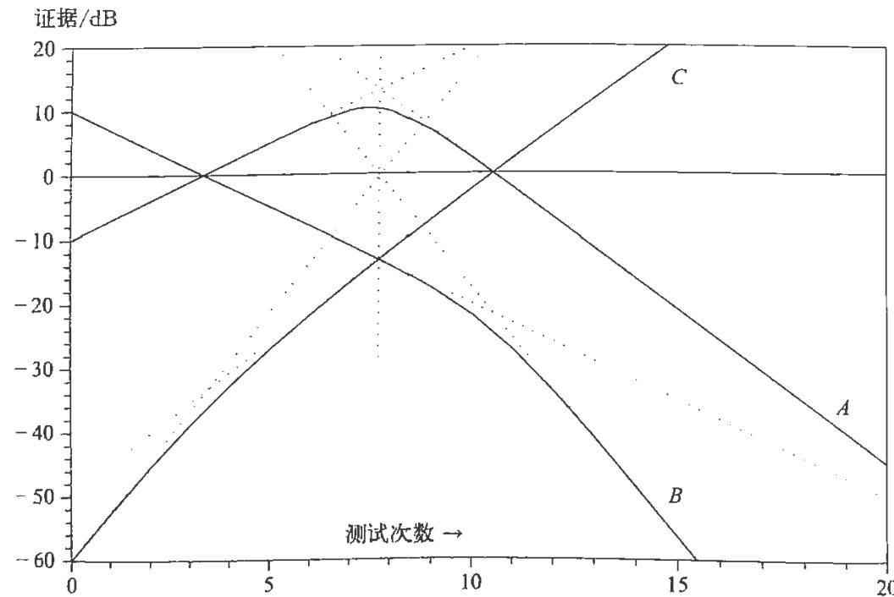

没有"转移".这是一种正相关性很强的退化情况,在第一次试验中碰巧取出的颜色肯定也会在所有后续试验中被取出来:对于所有  $k$  有

$$
P(R_{k}|C^{\prime}) = p. \tag{3.122}
$$

同样,如果  $\epsilon +\delta = - 1$  ,转移矩阵必定是

$$
M={\binom{0}{1}}\quad1). \tag{3.123}
$$

这里只有转移,即负相关性很强,在第一次抽取后颜色肯定会交替出现:

$$
P(R_{k}|C)=\left\{\begin{array}{l l}{{p,}}&{{\ddagger k\ \mathcal{H}\ \mathcal{H}\ \mathcal{H}\ \mathcal{H}\ \mathcal{H}\ \mathcal{H}\ \mathcal{H}\ \mathcal{H}\ \mathcal{H}\ \mathcal{H}\ \mathcal{H}\ \mathcal{H}\ \mathcal{H}\ \mathcal{H}\ \mathcal{H}\ \mathcal{H}\ \mathcal{H}\ \mathcal{\mathcal{H}}\ \mathcal{\mathcal{H}}\ \mathcal{\mathcal{H}}\ \mathcal{\mathcal{H}}\ \mathcal{\mathcal{H}}\ \mathcal{\mathcal{H}}\ \mathcal{\mathcal{H}}\ \mathcal{\mathcal{H}}\ \mathcal{\mathcal{H}}\ \mathcal{\mathcal{H}}\ \mathcal{\mathcal{H}}}}\\ {{q,}}&{{\ddagger k\ \mathcal{H}\ \mathcal{H}\ \mathcal{H}\ \mathcal{H}\ \mathcal{H}\ \mathcal{H}\ \mathcal{H}\ \mathcal{H}\ \mathcal{H}\ \mathcal{H}\ \mathcal{H}\ \mathcal{H}\ \mathcal{H}\ \mathcal{H}\ \mathcal{H}\ }}\end{array}\right. \tag{3.124}
$$

这种情况是很不现实的,因为强烈的直觉告诉我们,  $\epsilon$  和  $\delta$  应该是正数.当然,无论使用什么逻辑分析法来分配数值  $\epsilon$  ,在顶层增加一个红球必然会增加(而不是减少)下一次抽取中取出红球的概率.但是,如果  $\epsilon$  和  $\delta$  一定不为负,则(3.120)中的下界实际上为零,并且只有在  $\epsilon = \delta = 0$  时才能达到.那么,(3.105)中的  $M$  变为奇异矩阵,回到了已经讨论过的二项分布的情况.

在现实情况下,  $0< |\epsilon +\delta |< 1$  ,(3.118)的最后一项随  $k$  呈指数衰减.因此,(3.118)的极限是

$$
P(R_{k}|C)\rightarrow \frac{p - \delta}{1 - \epsilon - \delta}. \tag{3.125}
$$

尽管这些单次试验的概率像在可交换分布中那样变成了稳定值,但内在的相关性仍起作用,并且极限分布不可交换.为了看出这一点,考虑条件概率  $P(R_{k}|R_{j}C)$  注意到,对于任何向量  $V_{k - 1}$  ,马尔可夫链(3.104)均成立,无论它是否依照(3.106)从  $V_{1}$  生成,我们就可以发现这一点.因此,如果给定在第  $j$  次试验中出现红球,则

$$
V_{j}={\binom{1}{0}}. \tag{3.126}
$$

根据(3.104),我们有

$$
V_{k} = M^{k - j}V_{j},\quad j\leqslant k, \tag{3.127}
$$

使用(3.115)可以得到

$$
P(R_{k}|R_{j}C) = \frac{(p - \delta) + (\epsilon + \delta)^{k - j}(q - \epsilon)}{1 - \epsilon - \delta},\qquad j< k, \tag{3.128}
$$

其极限与(3.125)相同.前向推断得到了期望的结果:稳定值(3.125)加上随距离

呈指数衰减的项.但后向推断是不同的,请注意,一般的乘法规则仍然适用:

$$
P(R_{k}R_{j}|C) = P(R_{k}|R_{j}C)P(R_{j}|C) = P(R_{j}|R_{k}C)P(R_{k}|C). \tag{3.129}
$$

由于我们已经知道  $P(R_{k}|C) \neq P(R_{j}|C)$ ,所以可以得到

$$
P(R_{j}|R_{k}C) \neq P(R_{k}|R_{j}C). \tag{3.130}
$$

后向推断仍然是可能的,但不像可交换序列那样与前向推断具有相同的公式

我们稍后将会看到,该示例是一个常见且重要的物理问题的最简单版本:马尔可夫近似中的不可逆过程,另一个常见的技术术语是一阶自回归模型,可以把它推广到任意维度的矩阵以及多步(而不是单步)或连续有记忆作用的情况,但是,基于前面提到的原因(统计力学文献中对推断和因果关系的混淆),解的后向推断部分几乎总是被遗漏了,有人试图通过对前向推断的解从时间上做向后推算来进行后向推断,从而得到了很奇怪且不自然的结果,因此,读者可以做以下练习进行探索.

练习3.6 利用(3.118)和(3.129),找到与结果(3.128)对应的后向推断的显式公式  $P(R_{j}|R_{k}C)$ . (a) 用简单直观的方式解释前向推断和后向推断之间存在差异的原因.(b) 后向推断与前向推断的后推有何不同?直觉上哪个更合理?(c) 后向推断是否也会衰减到稳定值?如果是这样,类似于可交换性的属性是否对于充分分离的事件成立?例如,如果仅考虑每10次或每100次抽取,我们能否在该子集中得到可交换分布?

# 3.10 简化情形

对于满足不等式(3.119)的任何  $\epsilon$  和  $\delta$ ,上面的(3.100)~(3.130)均成立,在对它们进行考察时,我们注意到,如果满足

$$
p\epsilon = q\delta , \tag{3.131}
$$

结果可以显著简化,此时我们有

$$
\frac{p - \delta}{1 - \epsilon - \delta} = p, \qquad \frac{q - \epsilon}{1 - \epsilon - \delta} = q, \qquad \epsilon + \delta = \frac{\epsilon}{q} \tag{3.132}
$$

并且,我们的主要结果(3.118)和(3.128)简化为

$$
P(R_{k}|C) = p \quad \text{对所有} k \text{成立}, \tag{3.133}
$$

\(P(R_{k}|R_{j}C) = P(R_{j}|R_{k}C) = p + q\left(\frac{\epsilon}{q}\right)^{|k - j|} \quad \text{对所有} k \text{和} j \text{成立.} \tag{3.134}
\]

该分布仍然不可交换,因为条件概率(3.134)仍取决于试验的间隔  $|k - j|$ .但是,即使因果影响  $\epsilon$  和  $\delta$  仅向前作用,前向推断与后向推断的对称性也成立,确实,

从(3.40)的推导过程可以看出,这种前后对称性是(3.133)的必然结果,无论分布是否可交换.

这个神奇的条件(3.131)是什么意思呢?它不会使矩阵  $M$  采取任何特别简单的形式,也不会消除相关性的影响.它的作用是使解(3.133)保持不变.也就是说,初始向量(3.117)等于(3.111)中归一化后的特征向量  $x_{1}$  ,因此初始向量经过转移矩阵(3.105)作用后保持不变.

当然,通常没有任何理由使得这一简化条件成立,然而,对于伯努利坛子的情形,我们可以看到一种理由,假设坛子最初有  $N$  个球,它们分布在  $L$  个层中.在抽出一个球后,顶层大约有  $n = (N - 1) / L$  个球,我们期望其中  $n p$  个为红球, $n q = n(1 - p)$  个为白球.现在将取出的球扔回去,不摇动坛子.如果它是红球,则下一次取出红球的概率为

$$
\frac{n p + 1}{n + 1} = p + \frac{1 - p}{n} +O\left(\frac{1}{n^{2}}\right), \tag{3.135}
$$

如果它是白球,则下一次取出白球的概率为

$$
\frac{n(1 - p) + 1}{n + 1} = 1 - p + \frac{p}{n} +O\left(\frac{1}{n^{2}}\right). \tag{3.136}
$$

与(3.93)比较,我们可以估计  $\epsilon$  和  $\delta$  为

$$
\epsilon \simeq q / n,\delta \simeq p / n, \tag{3.137}
$$

这样就满足了我们的神奇条件(3.131).当然,刚刚给出的论证太粗糙了,甚至不能称为推导,但这至少表明(3.131)没有内在的不合理性,请读者思考这一奇怪的事实可能具有的意义和用途,以及它是否可以超越马尔可夫近似进行推广.

现在,我们已经初步了解标准抽样论的一些原理和陷阱.我们发现的所有结果都将得到广泛的推广,并将成为我们"工具箱"中的一部分.

# 3.11 评注

在大多数实际的实验中,我们并不真正从任何"坛子"中抽取球.然而,"伯努利坛子"已被证明是一种有用的概念工具.伯努利的《猜度术》出版后的250年来,科学家发现许多物理测量非常像"从大自然的坛子中抽取球".但是,对于某些人来说,"坛子"一词具有令人不悦的含义.在许多文献中,人们会发现诸如"从总体中抽取"之类的说法.

在少数情况下,例如从放射源记录计数、抽样调查和工业质量控制检测,人们真的是从有限的真实总体中抽取结果的,坛子的类比非常合适.那么,刚刚发现的

概率分布及第 7 章中指出的极限形式和推广将是适用的。对于某些情况, 例如农业实验或测试新医疗程序的有效性, 我们也会勉强相信它们与坛子问题大致相似。

在其他情况下, 例如抛硬币, 测量温度和风速、行星位置、婴儿体重或预测商品价格, 坛子的类比似乎是牵强的, 有误导人的危险。然而, 在许多文献中, 人们仍然使用坛子分布来表示数据的概率, 并试图通过将实验视为从某种"假设的无限总体"中抽取来证明这一选择的合理性, 而这完全是他们的臆造之物。从功能上讲, 这样做的主要结果是, 无论真实情况如何, 连续抽取都是严格独立的。显然, 这是不合理的推理方式, 最终必然会为错误的结论付出代价。

这种概念化经常导致人们认为: 这些分布不仅代表我们对数据的先验知识状态, 而且代表此类实验中数据的实际长期变化性。显然, 这种信念是没有道理的。对于尚未进行的实验, 声称事先知道其长期结果的人, 都是在依靠丰富的想象力, 而不是对该现象的实际知识进行判断。确实, 如果能想象出无限的总体, 那么我们似乎可以随意想象出想要的任何总体。

仅凭想象, 我们不能了解有关现实世界的任何事实。假设想象出的概率分配结果具有任何实际的物理意义, 只是思维投射谬误的另一种形式。在实践中, 这将我们的注意力转移到无关紧要的事情上, 导致我们忽略真正重要的事情 (例如, 无法以任何抽样分布来表示, 或者无法适用坛子模型, 但是对于我们要做出的推断而言很有帮助的关于现实世界的信息)。通常, 这种愚蠢行为的代价是错失机会。如果我们意识到这些信息, 就可以做出更准确或可靠的推断。

坛子类型的概念化只能处理最原始的信息, 而真正复杂的应用要求我们发展出远远超出坛子模型的原理。但是这种情况非常微妙, 因为正如我们之前结合哥德尔定理所强调的那样, 错误的论证并不一定会导致错误的结论。实际上, 正如我们将在第 9 章中展示的那样, 高度复杂的计算有时会使我们回到坛子类型的分布, 而这仅仅出于纯粹的数学原因, 从概念上讲与坛子或总体无关。本章中发现的超几何分布和二项分布将继续出现, 因为它们的基本数学状态与我们在此处发现它们所用的论证完全无关。

然而, 我们可以想象一个不同的问题, 其中我们对导致二项分布的坛子类型推理完全有信心, 尽管它在现实世界中可能从未出现过。如果我们有内容相同的大量坛子  $\{U_{1}, U_{2}, \dots , U_{n}\}$ , 事先确定地知道这些内容, 并且为每次抽取使用一个新坛子, 那么我们将为每次抽取分配概率  $P(A) = M / N$ , 它完全独立于我们对其他任意次抽取的知识。这样的先验信息比任意数量的数据都重要。如果我们不知道坛子的内容  $(M, N)$ , 但是知道它们都有相同的内容, 则将失去这种完全的独立

性,因为每次从一个坛子中抽取都会告诉我们一些关于其他坛子内容的信息,尽管这不会对它们产生物理作用。

由此我们再次看到,逻辑依赖性通常与物理因果依赖性非常不同。我们之所以反复强调这一点,是因为概率论的大多数论述根本没有意识到这一点,并且导致了错误,正如练习3.6显示的那样。在第4章中,我们将看到更严重的错误[参见(4.29)之后的讨论]。即使能设法避免实际错误,将概率论限制在物理因果关系问题上也将导致其失去最重要的应用。这种错误的受害者似乎并没有意识到自己的受害程度以及因此错过了多少机会。

事实上,我们在本章中解决的大多数问题不被视为在传统概率论的范围之内,并且根本不会出现在那些将概率视为一种物理现象的论述中。那种观点将自己限制在可以通过作为逻辑的概率论能有效地解决问题的一个很小的子类上。例如,在"物理概率"理论中,连在特定试验中提到某一结果的概率都被认为是不合法的,但这正是在进行科学推断时必须推理的。本章已经对此进行了多次说明。

总结:在接下来的应用中,都必须考虑实验是否真的与从坛子中抽取球类似。如果不是,那么我们必须回到最初介绍的原理,并在新的场景中应用基本的乘法规则和加法规则。这可能会也可能不会导致坛子分布。

# 展望

在本章中发现的概率分布称为抽样分布,即直接概率,这表示它们具有以下形式:给定关于所观察现象的某一假设  $H$  [在刚刚研究的情形下,是坛子的内容  $(M, N)$ ],我们得到某指定数据  $D$  (在这一情形下,是红球和白球的某个序列)的概率是多少?从历史上看,长期以来"直接概率"一词一直具有根据假定的物理原因推理可观察结果的附加含义。但是我们已经看到,并非所有抽样分布都可以如此解释。在本书中,我们不使用"直接概率"这个术语,而使用"抽样分布"表示根据某种特定假设推理潜在可观察数据的一般意义,无论假设和数据之间的联系是逻辑关系还是因果关系。

抽样分布,比如超几何分布(3.22),对于可能的观测结果(例如,  $r$  的不同可能值和相对概率)做出预测。如果确实知道正确的假设,那么我们期望这些预测与观察结果吻合。如果我们的假设不正确,那么预测结果和实际观察结果可能会大相径庭,它们的差别会为我们提供寻找更好假设的线索。广义地说,这是科学推断的基础。预测结果和观察结果的差别大小,为我们接受或拒绝当前假设提供了合理的依据,并用于寻找新的假设,这是显著性检验的主题。正是天文学中进行此类检验的需求,导致拉普拉斯和高斯在18世纪和19世纪研究概率论。

尽管抽样理论在传统概率论教学中占主导地位,但在现实世界中,此类问题几乎可以忽略不计。在几乎所有科学推断的实际问题中,我们都处在相反的境地:数据  $D$  是已知的,但正确的假设  $H$  是未知的。因此,科学家面临的问题是反向的:给定数据  $D$ ,某些特定假设  $H$  为真的概率是多少?练习3.3是对此类问题的简单介绍。确实,科学家收集数据的动机通常是为了了解有关某个现象的一些信息。

因此,在本书中,我们的注意力将几乎全部集中在解决这种反向问题的方法上。这并不意味着我们不计算抽样分布。我们需要不断这样做,这可能是我们计算工作的主要组成部分。但这确实意味着,对我们来说,抽样分布的发现本身绝不是终点。

尽管概率论的基本规则对于解决此类反向问题与解决抽样问题一样容易,但二者在概念上截然不同。似乎出现了一个新特征,因为对于问题"看到数据  $D$  之后你对假设  $H$  知道什么?",除非我们考虑"在看到  $D$  之前你对  $H$  知道什么?",否则显然无法给出任何令人信服的答案。但是在前面的抽样论计算中完全没有涉及先验知识。当问"根据给定的坛子的信息  $(M, N)$ ,你对数据有什么了解?"时,我们似乎没有考虑"在知道  $(M, N)$  之前,你对数据有什么了解?"。

事实证明,这种看似真实的明显不对称性只是表面上的。由于一些记号习惯,我们对所有推断的根本统一性的认识变得模糊不清。我们必须充分理解这一点,然后才能将概率论有效地应用于假设检验及其特殊情况(显著性检验)中。下一章将讨论这个问题。

# 第4章 初等假设检验

我认为思想是运动的,而论证是驱动思想到某个方向的动力。

——约翰·克雷格(John Craig, 1699)

约翰·克雷格是苏格兰数学家,也是最早认识到艾萨克·牛顿所发明的"微积分"优点的学者之一。以上语句写于300多年前,是建立数学推理模型的早期尝试之一,仅需更改一个词即可描述我们目前的态度。我们认为我们的思想不是被论证所左右,而是被证据所左右。如果易犯错误的人类并不总是能保持这种客观性,那么我们在前面选择一致性合情条件的目的就是在我们的机器人中实现它。因此,为了了解新证据如何朝某个方向驱动机器人的思想,我们将考察一些应用,它们虽然在数学上很简单,但已在多个领域中被证明具有实际意义。

从第1章中列出的基本合情条件可以明显看出,所有概率推断的基本原理是:

为了对任意命题  $A$  可能的真假做出判断,正确的流程是以手头拥有的所有证据为条件,计算  $A$  成立的概率

$$
P(A|E_{1}E_{2}\dots). \tag{4.1}
$$

在抽样情形(即当  $A$  代表某个数据集时)下,这个原则从一开始对每个人来说都是显而易见的。我们在第3章中暗中使用了它,觉得没有明确声明它的必要。但是,当我们转向更一般的情形时,需要强调这一原则,因为这并不是对所有人都显而易见的(我们将在后面的章节中反复看到)。

"诚实"或"客观性"的精髓要求我们考虑拥有的所有证据,而不仅是其中一些随意选择的证据子集。随意的选择要么等于无视拥有的证据,要么假定了还没有掌握的证据。这种精髓使我们从一开始就认识到某些信息可以始终供机器人使用。

# 4.1 先验概率

一般来说,当向机器人提出某个问题时,我们还将为其提供一些与当前问题有关的新信息或数据  $D$ 。但是机器人几乎总是会拥有其他信息,暂时用  $X$  表示。这至少包括它从离开工厂到收到当前问题为止的所有过去经验。这始终是可用信息的一部分,我们的合情条件不允许机器人忽略它。如果人类在今天推理问题时

抛弃了昨天所知道的一切,那我们恐怕还不如野生动物。我们将永远不会掌握天以上的知识,教育和文明也不可能产生。

因此,对于机器人来说没有"绝对"概率,所有概率至少必须以  $X$  为条件。在解决问题时,根据原理(4.1),它的推断应该采用计算概率  $P(A|DX)$  的形式。通常,  $X$  的一部分与当前问题无关。在这种情况下,  $X$  的存在是不必要的,但也没有害处。如果真的不相关,它将在数学处理过程中被消掉。确实,这才是"不相关"的真正含义。

仅以  $X$  为条件的概率  $P(A|X)$  称为先验概率(prior probability)。但是需要提醒的是,"先验"一词是从遥远的过去延用而来的一个术语,在今天看来可能是不合适甚至误导人的。首先,它不一定意味着时间上更早。事实上,时间的概念不在我们的一般性理论中(尽管我们可以将它引入一个特定的问题)。这种区别纯粹是逻辑上的。根据定义,除了当前问题的直接数据  $D$  之外的任何其他信息都是"先验信息"。

这样的例子屡见不鲜:一名科学家已经收集到大量数据,但在进行数据分析之前,他获得了一些新信息,这些信息完全改变了他对数据分析方式的认识。从逻辑上说,新信息是"先验信息",因为它不是数据的一部分。确实,将证据的整体分为两个部分,即"数据"和"先验信息",是我们随意做出的区分,只是为了方便我们组织推理过程。尽管任何类似的组织方式(如果成功)都一定会取得完全相同的最终结果,但某些组织方式可能比其他方式更容易计算。因此,我们确实需要在计算中考虑不同信息进入的顺序。

其次,由于过去出现过一些关于先验概率的奇怪思想,我们也要指出,将  $X$  视为代表某个隐藏的大前提或关于大自然的一些普遍有效的命题是一个严重的错误。关于先验概率的起源、性质和正确使用方式的误解在继续使用古老术语"先验概率"(a- priori probability)的人群中仍很普遍。依曼纽尔·康德引入了"先验"(a- priori)一词,表示可以独立于经验而知道真假的命题。需要特别强调的是,我们在这里使用的"先验信息"不表示这种意思。  $X$  只是简单地表示机器人拥有的我们所称"数据"之外的其他信息。那些在实际问题中经常使用先验概率的人通常会进一步简化,不说"先验概率"或"先验概率分布",而是简单地说"先验"。

没有分配先验的一般性法则——如何将字面上的先验信息转换为数值先验概率是逻辑分析中的一个开放性问题,我们将对此进行多次讨论。目前,已知有四个相当普遍的原理(群不变性、最大熵、边缘化和编码理论)成功解决了许多不同类型的问题。无疑,还有更多的原理等待发现,它们将开拓新的应用领域。

在传统的抽样理论中,所考虑的唯一情形本质上是"从坛子中抽取球",并且

出现的唯一概率以"坛子"或"总体"的内容为已知前提,试图预测可能得到的"数据"结果。这类问题在细节上可能变得非常复杂,有大量处理这类问题的数学文献。例如,费勒的两卷本巨著(Feller,1950,1966)以及肯德尔和斯图尔特的纲要性著作(Kendall & Stuart,1977)完全局限于抽样分布的计算。这些著作包含数百种非一般问题的解,这些解在概率论的各个方面都非常有用,每个领域的工作者都应该熟悉其中的内容。

但是,如3.11节所述,几乎所有实际的科学推断问题都处在相反的使用场景下:我们已知数据  $D$ ,希望通过概率论来确定"坛子"里的可能内容。更一般地说,基于数据和手头拥有的任何证据,我们希望概率论能够指出给定假设  $\{H_{1},H_{2},\dots \}$  中的哪一个最有可能成立。例如,我们的假设可能是对生成数据的物理机制的各种推断。但是从根本上讲,就像在第3章中一样,物理因果关系不是问题的必要组成部分,重要的只是假设和数据之间有某种逻辑关系。

要解决此问题,并不需要用于发现条件抽样分布的乘法规则(3.1)之外的任何新原则。我们只需要对命题做出不同的定义即可。现在使用符号:

$X =$  先验信息,

$H =$  待检验的假设,

$D =$  数据。

用以下形式写出乘法规则:

$$
P(DH|X) = P(D|HX)P(H|X) = P(H|DX)P(D|X). \tag{4.2}
$$

可以看出  $P(D|HX)$  是我们在第3章中研究的抽样分布,但是现在以更灵活的记号表示。在第3章中,我们不需要特别注意先验信息  $X$ ,因为所有概率都以  $H$  为条件,所以我们可以隐含地假设,定义问题的一般先验信息已经包含在  $H$  中。这是我们已经习惯使用的符号,它阻碍了我们认识所有推断的统一本质。在所有抽样理论中,人们都可以不需要先验信息。因此,抽样论的文献中没有"先验信息"这个术语。

但是现在,所求的概率不以  $H$  为条件,而是以  $X$  为条件,因此需要为它们使用不同的符号。从(4.2)可以看出,根据数据判断  $H$  的真假,不仅需要抽样概率  $P(D|HX)$ ,还需要  $D$  和  $H$  的先验概率:

$$
P(H|DX) = P(H|X)\frac{P(D|HX)}{P(D|X)}. \tag{4.3}
$$

尽管(4.2)和(4.3)的推导与(3.50)和(3.51)的推导有相同的数学结果,但对许多人而言它们似乎具有不同的逻辑。从一开始,我们似乎就已经很清楚如何确定抽样概率的值,但不知道如何确定先验概率。在本书中我们将看到,这仅仅是非

对称地定义问题的产物,使得问题处于病态之中。因为假设  $H$  的陈述非常明确,所以可以清楚地看到如何分配抽样概率。如果先验信息  $X$  的确定程度相同,同样可以明确如何分配先验概率。

当我们在足够基本的层面上看待这些问题,并且意识到在得到一个有良好定义的问题之前必须非常谨慎地指定先验信息时,就会发现,实际上(3.51)和(4.3)并没有逻辑上的区别。分配抽样概率和分配先验概率需要完全相同的原理,一个人的抽样概率就是另一个人的先验概率。

通常将(4.3)的左侧  $P(H|DX)$  称为后验概率,同样要注意的是,这仅意味着"在逻辑上处在特定推理链中的后面",而不一定"时间上更晚"。同样,意思的偏差是传统命名方式造成的,而不是根本上的。一个人的先验概率可能是另一个人的后验概率。实际上只有一种概率,我们使用的不同名称仅指组织计算的特定方式。

(4.3)的最后一项也需要一个名称,我们称之为似然  $L(H)$ 。为了解释当前的用法,考虑一个固定的假设及其对于不同数据集的含义。如前所述, $P(D|HX)$ ,即依赖于固定  $H$  的  $D$ ,称为"抽样分布"。但是,我们可以根据不同的假设  $\{H, H^{\prime}, \ldots \}$  考察固定的数据集,固定的  $D$  对  $H$  的依赖关系  $P(D|HX)$  称为"似然"。

似然  $L(H^{\prime})$  本身并不是  $H$  的概率,它是一个无量纲的数值函数,当与先验概率和归一化因子相乘时,它可以成为概率。因此,常数因子无关紧要,可能不予考虑。因此, $L(H_{i}) = y(D)P(D|H_{i}X)$  同样应被称为似然,其中  $y$  是依赖于  $D$  但与假设  $\{H_{i}\}$  不相关的任何正数。

(4.3)是我们试图从数据中得出结论的一大类科学推断问题背后的基本原理。无论我们是根据核磁共振数据尝试学习化学键的特征,从临床数据中推断药物的有效性,从地震数据中推断地球的内部结构,从经济数据中推断某种需求的弹性,还是根据望远镜所得数据推断遥远星系的结构,(4.3)都指出了需要计算哪些概率才能判断我们的全部证据证明了哪些结论是合情的。如果  $P(H|DX)$  非常接近1(或0),那么我们可以得出结论: $H$  非常可能为真(或假),并采取相应的行动。但是,如果  $P(H|DX)$  距1/2不远,则机器人会警告我们可用的证据不足以证明任何可靠的结论,我们需要获得更多更好的证据。

# 4.2 使用二元数据检验二元假设

最简单的假设检验问题只有两个假设要检验,并且只有两种可能的结果。令人吃惊的是,这实际上是许多重要推理和决策问题的现实而有价值的模型。首先,让我们使(4.3)变成这种二元情形。它给出了  $H$  为真的概率;对于  $H$  为假的概

率, 我们同样可以写出

$$
P(\overline{H} |D X) = P(\overline{H} |X) \frac{P(D|\overline{H} X)}{P(D|X)}. \tag{4.4}
$$

取两个等式的比值, 得到

$$
\frac{P(H|D X)}{P(\overline{H} |D X)} = \frac{P(H|X)}{P(\overline{H} |X)} \frac{P(D|H X)}{P(D|\overline{H} X)}, \tag{4.5}
$$

$P(D|X)$  项被消掉了. 这看起来似乎并没有什么特别的好处, 但这里我们拥有的量, 即  $H$  为真的概率与它为假的概率之比, 有一个技术术语. 我们称其为命题  $H$  的"几率". 因此, 如果将"给定  $D$  和  $X$  的  $H$  的几率"写为

$$
O(H|D X) \equiv \frac{P(H|D X)}{P(\overline{H} |D X)}, \tag{4.6}
$$

那么, 可以将 (4.3) 和 (4.4) 组合为以下形式:

$$
O(H|D X) = O(H|X) \frac{P(D|H X)}{P(D|\overline{H} X)}. \tag{4.7}
$$

$H$  的后验几率等于先验几率乘以一个叫作似然比的无量纲因子. 几率是概率的严格单调函数, 因此我们同样可以根据几率计算出概率.

在许多应用中, 取几率的对数会更方便, 因为我们可以累加各项. 现在, 我们可以以任何我们希望的数为底取对数, 这带来了一些麻烦. 我们的分析表达式以自然对数 (以  $e$  为底) 表示总是最简洁的. 在 20 世纪四五十年代首次提出该理论时, 我们使用了以 10 为底的对数, 因为它们在数值上更容易计算, 四位有效数字的表格可以放在一张纸上. 查找自然对数是一个烦琐的过程, 需要翻阅大量旧表格.

如今, 由于有了计算器, 所有这些表格都已过时, 任何人都可以像计算以 10 为底的对数一样轻松地计算多位数的自然对数. 因此, 我们开始使用更美观的自然对数来重写本节. 但是结果告诉我们, 使用以 10 为底的对数还有一个更重要的理由. 我们的思维完全习惯了十进制数字系统, 以 10 为底的对数对所有人来说都具有直接、清晰的直观含义. 但是, 我们不知道以自然对数表示的结论是什么意思, 直到将其转换回以 10 为底的值. 因此, 我们不情愿地又重写了这一节, 用回了丑陋的以 10 为底的旧约定.

我们定义一个新函数, 称为给定  $D$  和  $X$  时  $H$  的证据:

$$
e(H|D X) \equiv 10 \log_{10} O(H|D X). \tag{4.8}
$$

它仍然是概率的单调函数. 通过使用底数 10 并将因子 10 放在前面, 我们现在以分贝 (以下简写为  $d B$ ) 为单位来衡量证据. 在给定  $D$  的情况下,  $H$  的证据等于

先验证据加上通过计算下式最后一项中的对数似然所得到的dB数量:

$$
e(H|D X) = e(H|X) + 10\log_{10}\left[\frac{P(D|H X)}{P(D|\overline{{H}} X)}\right]. \tag{4.9}
$$

现在,假设这个新信息  $D$  实际上包含几个不同的命题:

$$
D = D_{1}D_{2}D_{3}\dots . \tag{4.10}
$$

那么,可以通过连续应用乘法规则来展开似然比:

$$
e(H|D X) = e(H|X) + 10\log_{10}\left[\frac{P(D_{1}|H X)}{P(D_{1}|H X)}\right] + 10\log_{10}\left[\frac{P(D_{2}|D_{1}H X)}{P(D_{2}|D_{1}H X)}\right] + \dots
$$

但是,在许多情况下,获得  $D_{2}$  的概率不受关于  $D_{1}$  的知识的影响:

$$
P(D_{2}|D_{1}H X) = P(D_{2}|H X). \tag{4.12}
$$

这样,人们通常说  $D_{1}$  和  $D_{2}$  是独立的,当然,我们其实应该说机器人分配给它们的概率是独立的,将"独立"的性质归于命题或事件是一种语义上的混淆,因为这在普通语言中意味着物理的因果独立性,在这里,我们关注的则是逻辑独立性.

为了强调这一点,请注意,因果独立性并不意味着逻辑独立性,反之亦然,一方面,虽然两个事件可能事实上是因果相关的(即一个事件会影响另一个),但是对于尚未发现这一点的科学家而言,代表他的知识状态的概率可能是独立的,这些概率决定了他能够做出的唯一推断,另一方面,虽然从两个事件不会相互产生任何因果影响(比如说,苹果的产量与桃子的产量)的意义上说,两个事件可能是因果独立的;但是我们感觉到它们之间存在逻辑关系,因此关于其中一个事件的新信息改变了我们对另一个事件的知识状态,那么对我们来说,它们的概率并不是逻辑独立的.

通常,随着机器人的知识状态(以  $H$  和  $X$  表示)发生变化,以它们为条件的概率可能会从相互独立的变为相互依赖的,反之亦然,但是事件的真实属性保持不变,因此,将依赖性或独立性归于这些事件的人实际上是在声称机器人具有心灵致动的能力,我们必须保持警惕,避免这样把现实与对现实的知识状态混为一谈,也就是我们所说的"思维投射谬误"

我们指出这个要点不仅仅是卖弄学问、吹毛求疵.我们马上会看到[见(4.29)]它具有非常显著的实际后果.在第3章中,我们讨论了这些概率可能独立的一些条件,这些条件与从一个非常大的已知总体中进行抽样及有放回抽样有关.在4.8节中,我们将指出坛子概率是否存在取决于我们是否知道多个坛子的内容相同,在

当前问题中,将因果独立性解释为逻辑独立性,或将逻辑依赖性解释为因果依赖性,都会导致从心理学到量子理论等领域中的荒谬结论。

如果在给定  $HX$  的条件下,这些数据是逻辑独立的,则(4.11)变为

$$
e(H|DX) = e(H|X) + 10\sum_{i}\log_{10}\left[\frac{P(D_{i}|HX)}{P(D_{i}|\overline{H}X)}\right], \tag{4.13}
$$

其中的和式取遍我们获得的所有额外信息

为了对这里的数值有一点感觉,我们构造了表4- 1. 可以使用三种尺度来衡量合情程度:证据、几率和概率,它们都是相互的单调函数.0dB的证据对应于1的几率或1/2的概率.现在,每个物理学家或电气工程师都知道,3dB表示接近2的几率,10dB表示恰好为10的几率.所以,如果我们以3dB或10dB的步长计算,很容易构造此表

表4-1 证据、几率和概率  

<table><tr><td>证据（e）</td><td>几率（O）</td><td>概率（p）</td></tr><tr><td>0</td><td>1:1</td><td>1/2</td></tr><tr><td>3</td><td>2:1</td><td>2/3</td></tr><tr><td>6</td><td>4:1</td><td>4/5</td></tr><tr><td>10</td><td>10:1</td><td>10/11</td></tr><tr><td>20</td><td>100:1</td><td>100/101</td></tr><tr><td>30</td><td>1000:1</td><td>0.999</td></tr><tr><td>40</td><td>10000:1</td><td>0.9999</td></tr><tr><td>-e</td><td>1/O</td><td>1-p</td></tr></table>

从表4- 1中可以明显地看出,为什么以分贝为单位给出证据非常有力,当概率接近1或0时,我们的直觉很差,对你而言,0.999和0.9999的概率差别是否有意义?当然,对我来说没有什么意义.但是,在使用此方法一段时间之后,30dB和40dB的证据之间的差别确实对我们有明确的意义,现在,它处于我们的思维能自然理解的尺度范围内,这只是韦伯- 费希纳定律的另一个例子,人类的感觉往往是所受刺激的对数函数.

实际上,(4.8)中的因子10是合适的.在最初的声学应用中,引入这种方法从心理上讲是为了使声音强度的1dB变化大约是我们耳朵可感知的最小变化.经过深思熟虑和大胆推测,我们认为读者会同意证据的1dB变化是我们直觉可感知的最小概率增量,没有人认为韦伯- 费希纳定律是所有人类感觉的精确法则,但是它的一般实用性和适当性毋庸置疑,在某种刺激下,我们感知到的几乎总是相对变化,而不是绝对变化,有关古斯塔夫·特奥多尔·费希纳(1801—1887)的

生活和工作的有趣信息,请参阅施蒂格勒的著作(Stigler,1986c).

现在让我们将(4.13)应用于一个特定的工业质量控制问题中(尽管也可以将其表述为密码学、化学分析、物理实验的解释、两种经济理论的判断等问题)。遵循古德著作(Good,1950)中的例子,为了阐明一些原理上的要点,我们假设的数值不是很实际。假设先验信息  $X$  如下:

$X \equiv$  我们有11台自动机器,这些机器将其生产出的小部件输出

到11个盒子中,该过程对应于小部件生产的早期阶段,因

为有10台机器会生产1/6的坏部件,第11台机器甚至更

糟,它会生产1/3的坏部件,每台机器输出的部件被分别放

在一个未贴标签的盒子中,并存储在仓库中,

我们选择一个盒子并检测其中的一些小部件,将它们分为"好"和"坏"。我们的目标是判断是否选择了那个糟糕的机器对应的盒子,也就是说,判断我们要接受还是拒绝该批次。

让我们把这项工作交给我们的机器人,看看它是如何工作的,首先,它必须找到有关命题的先验证据,我们可以定义

先验信息  $X$  的定性部分告诉我们,只有两种可能性,因此,在  $X$  产生的逻辑背景下,两个命题是互否的关系:给定  $X$  ,我们可以知道

$$
\overline{{A}} = B,\quad \overline{{B}} = A. \tag{4.14}
$$

唯一的定量先验信息是有11台机器,我们不知道是哪台机器制造了我们选择的批次,因此,根据无差别原则,  $P(A|X) = 1 / 11$  ,并且

$$
e(A|X) = 10\log_{10}{\frac{P(A|X)}{P(\overline{{A}}|X)}} = 10\log_{10}{\frac{1 / 11}{10 / 11}} = -10\mathrm{dB}, \tag{4.15}
$$

因此,我们一定有  $e(B|X) = 10\mathrm{dB}$

显然,在此问题中,  $X$  与计算有关的唯一信息只是这些数值,即  $\pm 10\mathrm{dB}$  ,从这一点来看,导致相同数值的任何其他先验信息都将给我们带来相同的数学问题。因此,没有必要说我们仅在谈论11台机器的问题,可能只有一台机器,而先验信息是我们之前使用它的经验。

我们用11台机器来说明问题的原因是:到目前为止,我们只能通过一个(无差别)原则将原始信息转化为数值概率分配,我们插入这个评论是由于费勒(Feller,1950)做出过关于一台机器的著名论断,在积累与他提出的问题有关的

更多证据之后,我们将在第17章中讨论他的论断。对我们的机器人来说,有多少台机器并没有什么区别。唯一重要的是坏批次的先验概率,无论此信息是如何得到的。①

现在,从盒子中取出一个小部件并对其测试,查看它是否是坏部件。如果我们取出一个坏部件,那将对这是坏批次的证据起什么作用呢?这会增加

$$
10\log_{10}{\frac{P(\mathcal{H}|A X)}{P(\mathcal{H}|A X)}}\mathrm{d}B, \tag{4.16}
$$

其中  $P(\mathcal{H}|A X)$  表示在给定  $A$  的条件下取出坏部件的概率,等等。这些是抽样概率,我们已经明白如何计算它们。我们的流程非常像从坛子中抽取球。正如在第3章中那样,在一次抽取中,我们的数据  $D$  现在仅包含一个二元选择:好或坏。抽样分布  $P(D|H X)$  简化为

$$
\begin{array}{l l}{{P(\mathcal{H}|A X)=\frac{1}{3},}}&{{P(\mathcal{H}|A X)=\frac{2}{3},}}\\ {{P(\mathcal{H}|B X)=\frac{1}{6},}}&{{P(\mathcal{H}|B X)=\frac{5}{6}.}}\end{array} \tag{4.18}
$$

因此,如果我们在第一次抽取中发现一个坏部件,这将使  $A$  的证据增加

$$
10\log_{10}{\frac{1 / 3}{1 / 6}} = 10\log_{10}2 = 3\mathrm{d}\mathrm{B}. \tag{4.19}
$$

如果抽出第二个坏部件,会发生什么?我们现在进行的是无放回抽样,因此正如(3.11)中所述,(4.19)中的因子  $1 / 3$  应该更新为

$$
\frac{N / 3 - 1}{N - 1} = \frac{1}{3} -\frac{2}{3(N - 1)}, \tag{4.20}
$$

其中  $N$  是批次中的小部件数量。但是,为了避免这种复杂性,我们假设  $N$  比我们打算检测的小部件数量大得多,也就是说,我们将检测该批次中可忽略不计的部分,以使好坏部件的比例不会被抽取明显改变。这样,超几何分布(3.22)的极限形式,即二项分布(3.86),将适用。因此,我们将考虑到,在给定  $A$  或  $B$  的情况下,无论先前抽取了什么,在每次抽取中取出坏部件的概率都是相同的。因此,我们取出的每一个坏部件都会提供支持假设  $A$  的  $3\mathrm{~dB}$  的证据。

现在假设我们抽到一个好部件。使用(4.14),我们得到  $A$  的证据是

$$
10\log_{10}{\frac{P(\mathcal{H}|A X)}{P(\mathcal{H}|B X)}} = 10\log_{10}{\frac{2 / 3}{5 / 6}}\approx -0.97\mathrm{dB}, \tag{4.21}
$$

但是让我们称其为  $- 1\mathrm{dB}$  。同样,如果批次中的小部件数量足够大,这将适用于每一次抽取。如果我们检查了  $n$  个小部件,其中有  $n_{\mathrm{b}}$  个坏部件和  $n_{\mathrm{g}}$  个好部件,那么表明这是坏批次的证据是

$$
e(A|D X) = e(A|X) + 3n_{\mathrm{b}} - n_{\mathrm{g}}. \tag{4.22}
$$

你会发现,一旦我们使用对数,计算是多么简单。机器人的思想以一种非常简单直接的方式"朝某个方向被驱动"。

也许这个结果使我们对韦伯- 费希纳定律为何适用于直觉上的合情推断有了更深入的了解。我们的"证据"函数与我们以可想象的最自然的方式观察到的数据有关,给定的证据增量与给定的数据增量相对应。例如,如果我们测试的前12个小部件中有5个是坏的,则

$$
e(A|D X) = -10 + 3\times 5 - 7 = -2\mathrm{dB}. \tag{4.23}
$$

或者说,坏批次的概率从  $1 / 11\approx 0.09$  提高到  $P(A|D X)\simeq 0.4$

为了获得命题  $A$  的至少20dB的证据,在一定顺序的  $n = n_{\mathrm{b}} + n_{\mathrm{g}}$  次检测中需要有多少个坏部件呢?这要求

$$
3n_{\mathrm{b}} - n_{\mathrm{g}} = 4n_{\mathrm{b}} - n = n(4f_{\mathrm{b}} - 1)\geqslant 20. \tag{4.24}
$$

因此,如果次品率  $f_{\mathrm{b}}\equiv n_{\mathrm{b}} / n$  仍然大于  $1 / 4$  ,则我们最终将积累20dB或任何其他正数的  $A$  的证据,看来  $f_{\mathrm{b}} = 1 / 4$  是一个阈值,在该阈值下,检测无法提供  $A$  (或  $B$  )相对于  $B$  (或  $A$  )的证据,但请注意,(4.22)中的  $+3$  和  $- 1$  仅是近似值。根据(4.19)和(4.21),坏部件的确切阈值比例是

$$
f_{\mathrm{t}} = \frac{\log\frac{5}{4}}{\log2 + \log\frac{5}{4}}\approx 0.2435292, \tag{4.25}
$$

其中对数的底数是什么无关紧要。抽样次品率大于(或小于)此分数为  $A$  优于  $B$  (或  $B$  优于  $A$  )提供了证据。但是,如果观察到的比例接近阈值,则需要进行许多次检测才能积累足够的证据。

现在,我们拥有的只是选择坏批次的命题的概率、几率或证据。最终,我们必须做一个决定:是接受它,还是拒绝它。这时我们该怎么办呢?当然,我们可以事先决定:如果命题  $A$  的概率达到一定的值,那么我们将判定  $A$  为真,如果它下降到某个值,那么我们将判定  $A$  为假。

概率论本身不会告诉我们做出决策的临界值在哪里。这必须基于价值判断:做出错误决定的后果是什么?进行进一步检测的代价是什么?这将我们带入第13章和第14章中讨论的决策论领域。但是目前很明显,犯一类错误(接受坏批次)可能比犯另一类错误(拒绝好批次)的后果更为严重。这将对我们如何设置临界值产生明显的影响。

因此,我们可以给机器人一些指示,例如"如果A的证据大于0dB,则拒绝该批次(它很可能是坏的而不是好的).如果A的证据低至- 13dB,则接受该批次(它至少有  $95\%$  的概率是好的).否则,请继续检测."我们开始检测,每当发现一个坏部件时,坏批次的证据就会增加3dB;每当发现一个好部件时,它就会下降1dB.一旦我们第一次进入接受区域或拒绝区域,就终止检测.

上述方法是我们的机器人根据命题A的后验概率达到一定水平后拒绝它或接受它的方法,这个非常有用且强大的流程在统计文献中称为"序列推理",该术语表明检测次数不是预先确定的,而是取决于我们发现的数据值的顺序.在序列的每一步,我们都会在三个选项中选择一个:(a)接受后停止;(b)拒绝后停止;(c)再做一次检测.该术语不应与所谓的"带有非选择性停止的序列分析"混淆,后者是对概率论的严重错误应用.请参阅第6章和第17章中有关"可选停止"的讨论.

# 4.3 超出二元情形的不可扩展性

二元假设检验问题具有如此优雅、简单的解决方案,我们可能希望将其扩展到两个以上假设的情况,不幸的是,在(4.13)的数据集上使用的方便的独立可加性和(4.22)中的线性特征都没有办法一般化."独立可加性"是指给定数据  $D_{i}$  带来的证据增量仅取决于  $D_{i}$  和  $H$  ,而不用考虑其他数据.如(4.11)所示,我们始终有可加性,但是,除非概率是独立的,否则没有独立可加性.

我们以练习的形式陈述这种不可扩展性的原因.为此,假定  $n$  个假设  $\{H_{1},\dots ,H_{n}\}$  在先验信息  $X$  上是互斥且完备的:

$$
P(H_{i}H_{j}|X) = P(H_{i}|X)\delta_{i j},\qquad \sum_{i = 1}^{n}P(H_{i}|X) = 1. \tag{4.26}
$$

此外,我们有  $n_{l}$  个数据集  $\{D_{1},\dots ,D_{m}\}$  .结果是,通过(4.7)计算  $H_{i}$  的几率,现在更新为

$$
O(H_{i}|D_{1},\dots ,D_{m}X) = O(H_{i}|X)\frac{P(D_{1},\cdots,D_{m}|H_{i}X)}{P(D_{1},\cdots,D_{m}|\overline{{H_{i}}}X)}. \tag{4.27}
$$

在给定  $H_{i}$  的情况下,由于  $D_{j}$  的逻辑独立性,分子通常可以分解:

$$
P(D_{1},\dots ,D_{m}|H_{i}X) = \prod_{j}P(D_{j}|H_{i}X),\qquad 1\leqslant i\leqslant n. \tag{4.28}
$$

如果分母也能分解:

$$
P(D_{1},\dots ,D_{m}|\overline{{H_{i}}} X) = \prod_{j}P(D_{j}|\overline{{H_{i}}} X),\qquad 1\leqslant i\leqslant n, \tag{4.29}
$$

那么(4.27)会分解为每个  $D_{j}$  分别产生的新概率的乘积,对数几率公式(4.9)将再次具有独立于  $D_{j}$  的形式,如(4.13)所示.

练习4.1 证明没有类似二元情况的非平凡扩展. 具体地说, 证明: 如果 (4.28) 和 (4.29) 在  $n > 2$  的情况下成立, 那么,

$$
\frac{P(D_{1}|H_{i}X)}{P(D_{1}|\overline{H}_{i}X)} \dots \frac{P(D_{m}|H_{i}X)}{P(D_{m}|\overline{H}_{i}X)} \tag{4.30}
$$

中至多有一个因子不同于1, 因此最多有一个数据集  $D_{j}$  可以造成  $H_{i}$  概率的更新.

在人工智能文献 (Glymour, 1985; R. W. Johnson, 1985) 中, 这一直是个有争议的问题. 不能区分逻辑独立性和因果独立性的人会假设, 只要没有  $D_{i}$  对其他  $D_{j}$  施加物理上的作用, (4.29) 就始终有效. 但是我们已经注意到这种推理的愚蠢性. 这是语义混乱可能导致严重数值错误的情形. 当  $n = 2$  时, (4.29) 是随着 (4.28) 成立的. 但是, 当  $n > 2$  时, (4.29) 的条件非常强, 如果成立, 它就将整个问题简化为不值得考虑的小问题. 我们将它作为练习 (练习4.1), 以便读者考察这些等式, 从而了解其中的原因. 鉴于第2章中阐述的考克斯定理, 概率论的结论是, 除非我们进行不一致的推理, 否则一定会得到以上独立可加性不可以扩展到二元以上情形的结论.

为了避免对这里所说的内容产生可能的误解, 让我们补充以下内容. 无论我们想到多少种假设, 都总有可能挑选出其中两种并对其进行比较. 这将回到已分析的二元假设检验的情况, 并且独立可加性将保留在该较小的问题内 (相对于单个备择假设确定一个假设的状态).

我们可以选择  $A_{1}$  作为标准"零假设", 并通过解决  $n - 1$  个二元假设检验问题, 将每个其他假设与之比较来组织问题. 这样就可以确定任意两个假设的相对状态. 例如, 如果  $A_{5}$  和  $A_{7}$  分别比  $A_{1}$  多  $22.3\mathrm{dB}$  和  $31.9\mathrm{dB}$ , 那么  $A_{7}$  比  $A_{5}$  多  $31.9 - 22.3 = 9.6\mathrm{dB}$ . 如果这样的二元比较提供了人们想要的所有信息, 则根本不需要考虑多重假设检验.

但这不能解决我们的问题. 给定所有这些二元问题的答案, 仍然需要与接下来一样多的计算, 才能将该信息转换为相对于所有  $n$  个假设的任意给定假设的绝对状态. 在这里, 我们将直接解决更大的问题.

在任何情况下, 我们都不必仅仅诉诸一个抽象定理的终极权威性. 更具建设性的是, 我们现在证明概率论确实为我们提供了一个确定、有用的多重假设检验的程序, 这使我们获得更深刻的见解, 并弄清楚当  $n > 2$  时独立可加性为什么不能也不应该成立. 它将忽略一些非常有说服力的信息. 那是明显的不一致性推理.

# 4.4 多重假设检验

假如在刚刚讨论的序列检测过程中发生了一件非常惊人的事情:我们测试了50个小部件,结果每个小部件都是坏的.根据(4.22),这将为我们提供150dB的证据,证明这是坏批次.  $\epsilon (\cdot \mathrm{A}|\mathrm{E})$  的最终结果是140dB,这是  $1 - 10^{- 1 - 1}$  的概率.但是,我们的常识会拒绝这一结论,我们的内心会产生自然的怀疑.如果你测试了50个小部件,发现50个全部都是坏的,那么你不会相信这个批次中只有1/3是坏部件.那么,这里出了什么问题呢?为什么在这种情况下我们的机器人的推理会产生问题?

我们必须认识到我们的机器人还不成熟.它就像一个四岁的孩子一样推理.小孩子的独特之处在于,即使你告诉他们最荒谬的事情,他们也会傻傻地相信一切,而从来不会想到要质疑你.他们会相信你告诉他们的任何事情.

当被告知难以置信的事情时,成年人会在心理上允许自己怀疑信息来源的可靠性.可能有人会认为,理想情况下,我们的机器人存储在其内存中的信息应该并不是我们有1/3或1/6的坏部件;输入的信息应该是某个不可靠的人说我们有1/3或1/6的坏部件.

更一般地,如果机器人可以考虑到它一开始被给予的信息可能并不十分可靠那么可能会在许多问题中很有用,我们提供给机器人的先验信息或数据总是有可能错误的.在实际问题中,总是有成百上千种可能性,如果你一开始武断地对机器人说只有两种可能性,那么当然不能指望机器人的结论在每种情况下都有意义.

当我们考虑显著性检验时,可以让机器人自动拥有这种成熟的怀疑行为.幸运的是,经过进一步思考,我们意识到,对于大多数问题,目前这种不成熟的机器人仍然是我们所需要的,因为我们可以更好地控制它们.

我们确实希望机器人相信我们所说的一切.当我们试图告诉机器人一个真实但令人吃惊(因此非常重要)的新信息时,如果它突然以一种不受我们控制的方式持怀疑态度,那将是非常危险的.但是,留意这种情况的责任在我们.当很有可能需要怀疑时,我们有责任给机器人一些暗示,让它们对这个特定的问题持怀疑态度.

在当前问题中,我们可以给机器人提供暗示,使机器人在看到"太多"坏部件时对  $A$  持怀疑态度,方法是额外提供一个指出这种可能性的假设,并使机器人可以寻找这种可能性.如前所述,命题  $A$  表示我们有一个有1/3坏部件的盒子,命题  $B$  表示我们有一个有1/6坏部件的盒子.我们添加第三个命题  $C$  ,那就是制造小部件的机器完全出了问题,会生产  $99\%$  的坏部件.

现在,我们必须调整先前的概率,以考虑这种新的可能性。但是我们不希望问题的性质发生重大改变。因此,让假设  $C$  的先验概率  $P(C|X)$  非常低,为  $10^{- 6}$ $(- 60 \mathrm{~dB})$ 。我们可以写出  $X$  作为表示这一点的口头陈述,但是,就像在第 90 页的脚注中那样,我们可以简单地通过给出以  $X$  为条件的概率来陈述关于  $X$  的命题,对于机器人而言这完全没有歧义。我们将在此问题中使用这样的命题。这样一来,我们就不用说明  $X$  在概念上对我们重要的所有内容,而是只用说明  $X$  与机器人的当前数学问题有关的内容。

因此,假设我们从以下这些初始概率入手:

$$
\begin{array}{l}{{P(A|X)=\frac{1}{11}\left(1-10^{-6}\right),}}\\ {{P(B|X)=\frac{10}{11}\left(1-10^{-6}\right),}}\\ {{P(C|X)=10^{-6},}}\end{array} \tag{4.31}
$$

其中

$A \equiv$  我们有一个有  $1 / 3$  坏部件的盒子,

$B \equiv$  我们有一个有  $1 / 6$  坏部件的盒子,

$C \equiv$  我们有一个有  $99 / 100$  坏部件的盒子。

因子  $1 - 10^{- 6}$  实际上可以忽略不计。出于实际的目的,我们从证据的以下初始值开始:

$$
\begin{array}{l}{{A\mathrm{~}\mathcal{H}\mathrm{~} - 10\mathrm{~dB},}}\\ {{B\mathrm{~}\mathcal{H}\mathrm{~}10\mathrm{~dB},}}\\ {{C\mathrm{~}\mathcal{H}\mathrm{~} - 60\mathrm{~dB}.}}\end{array} \tag{4.32}
$$

与数据有关的命题  $D$  是"已经测试了  $m$  个小部件,每个都是坏部件"。现在,根据 (4.9),命题  $C$  的后验证据等于先验证据加上以下概率比的对数的 10 倍:

$$
e(C|DX) = e(C|X) + 10 \log_{10} \frac{P(D|CX)}{P(D|\overline{C}X)}. \tag{4.33}
$$

假设机器生产的  $99\%$  是坏部件,盒子里的小部件总数比被检测的数量  $m$  大很多,我们在第 3 章中讨论的无放回抽样表明,前  $m$  个都是坏部件的概率是

$$
P(D|CX) = \left(\frac{99}{100}\right)^{m}. \tag{4.34}
$$

我们还需要概率  $P(D|\overline{C} X)$ ,这可以通过应用两次乘法规则 (4.3) 来计算:

$$
P(D|\overline{C} X) = P(D|X) \frac{P(\overline{C} |DX)}{P(\overline{C} |X)}. \tag{4.35}
$$

在这个问题中,先验信息表明只有三种可能性,因此命题  $\overline{C} \equiv "C$  为假"表示  $A$  或  $B$  必须为真:

$$
P(\overline{C} |D\cdot X) = P(.A + B|D\cdot X) = P(A|D\cdot X) + P(B|D\cdot X), \tag{4.36}
$$

其中使用了广义加法规则(2.66),由于  $A$  和  $B$  是互斥的,带负号的项消失了。同样,

$$
P(\overline{C} |X) = P(A|X) + P(B|X). \tag{4.37}
$$

现在,如果将(4.36)替换进(4.35),乘法规则将再次适用,形式如下:

$$
\begin{array}{r l} & {P(A D|X) = P(D|X)P(A|D X) = P(A|X)P(D|A X),}\\ & {P(B D|X) = P(D|X)P(B|D X) = P(B|X)P(D|B X).} \end{array} \tag{4.38}
$$

因此,(4.35)变成

$$
P(D|\overline{C} X) = \frac{P(D|A\cdot X)P(A|X) + P(D|B\cdot X)P(B|X)}{P(A|X) + P(B|X)}, \tag{4.39}
$$

其中,所有概率都可以从问题陈述中知道

# 离题:另一种推导

尽管我们得到了期望的结果(4.39),但请注意,还有一种推导方法,它通常比直接应用(4.3)更容易。我们对(3.33)的推导中引入了该原理:将所求概率的命题(在这种情况下为  $D$ )分解为互斥的子命题,并计算其概率之和。我们能以多种不同的方式分解,引入任何互斥且完备的命题  $\{P,Q,R,\dots \}$ ,并使用布尔代数的规则:

$$
D = D(P + Q + R + \dots) = DP + DQ + DQ + \dots . \tag{4.40}
$$

但是,该方法成功与否取决于我们能否巧妙地选择一个可以完成最终计算的特定命题集合。这意味着选出的命题必须与问题具有相关性:如果该问题与企鹅无关,则像第2章末尾那样引入与企鹅相关的命题将无济于事。

在当前情况下,为了计算  $P(D|\overline{C} X)$ ,命题  $A$  和  $B$  似乎具有这种相关性。同样,我们注意到,命题  $\overline{C}$  意味着  $A + B$ ,所以

$$
\begin{array}{r l} & {P(D|\overline{{C}} X) = P\left(D(A + B)|\overline{{C}} X\right)}\\ & {\qquad = P(D A + D B|\overline{{C}} X)}\\ & {\qquad = P(D A|\overline{{C}} X) + P(D B|\overline{{C}} X).} \end{array} \tag{4.41}
$$

这些概率可以通过乘法规则来分解:

$$
P(D|\overline{C} X) = P(D|A\overline{C} X)P(A|\overline{C} X) + P(D|B\overline{C} X)P(B|\overline{C} X). \tag{4.42}
$$

因为在定义此问题时,命题"  $A$  真或  $B$  真"意味着  $c$  必须为假,所以可以进一步简化:  $P(D|A\overline{C} X)\equiv P(D|A X)$  且  $P(D|B\overline{C} X)\equiv P(D|B X)$  。出于同样的原因,

$P(\overline{C} A X) = 1$  ,因此,根据乘法规则,我们有

$$
P(A|\overline{C} X) = \frac{P(A|X)}{P(\overline{C}|X)}, \tag{4.43}
$$

对于  $P(B|\overline{C} X)$  同样如此,将这些结果代入(4.42)并使用(4.37),我们再次得出(4.39)。这为作为扩展逻辑的概率论规则的一致性提供了另一个例证,也提供了一个相当严格的检验。

现在回到(4.39),我们可以得到数值

$$
P(D|\overline{C} X) = \left(\frac{1}{3}\right)^{m}\left(\frac{1}{11}\right) + \left(\frac{1}{6}\right)^{m}\left(\frac{10}{11}\right), \tag{4.44}
$$

现在(4.33)中所有项的值都已知,将这些值放在一起,我们会发现命题  $C$  的证据是

$$
e(C|D X) = -60 + 10\log_{10}\left[\frac{\left(\frac{99}{100}\right)^{m}}{\left(\frac{1}{11}\right)\left(\frac{1}{3}\right)^{m} + \left(\frac{10}{11}\right)\left(\frac{1}{6}\right)^{m}}\right]. \tag{4.45}
$$

如果  $m > 5$  ,一个很好的近似是

$$
e(C|D X)\simeq -49.6 + 4.73m, \quad m > 5; \tag{4.46}
$$

如果  $m< 3$  ,一个粗略的近似是

$$
e(C|D X)\simeq -60 + 7.73m, \quad m< 3. \tag{4.47}
$$

命题  $C$  始于  $- 60\mathrm{dB}$  ,我们发现的前几个坏部件将分别提供约7.73dB的证据以支持  $C$  ,因此,  $e(C|D X)$  与  $m$  的关系图将以7.73的斜率向上,但是,当  $m > 5$  时,斜率下降到4.73. 当  $m\simeq 49.6 / 4.73\approx 10.5$  时,  $C$  的证据达到0dB.因此,连续10个坏部件就足以将这个最初非常不可能的假设提高58dB,使得机器人需要非常严肃地考虑它;而连续11个坏部件将使它超过阈值,使得机器人认为它更可能为真.

与此同时,我们的命题  $A$  和命题  $B$  发生了什么?和以前一样,  $A$  始于  $- 10\mathrm{dB}$ $B$  始于10dB,对于每个坏部件,  $A$  的合情性开始会上升,证据增加3dB.但是,在我们发现了很多坏部件之后,就会开始怀疑证据是否真的支持命题  $A$  ,命题  $C$  变得越来越容易解释我们观察到的内容,机器人也学会了持怀疑态度吗?

在测试了  $m$  个小部件并且证明它们都是坏的之后,命题  $A$  和命题  $B$  的证据以及近似形式如下:

$$
\begin{array}{r l} & {\epsilon_{\mathcal{A},D,X} = -10 + 10\log_{10}\left[\frac{\left(\frac{1}{3}\right)^{m}}{\left(\frac{1}{6}\right)^{m} + \frac{11}{10}\times 10^{-6}\left(\frac{99}{100}\right)^{m}}\right]}\\ & {\qquad \simeq \left\{ \begin{array}{l l}{-10 + 3m,} & {m< 7,}\\ {+49.6 - 4.73m,} & {m > 8,} \end{array} \right.}\\ & {\epsilon (B|D X) = +10 + 10\log_{10}\left[\frac{\left(\frac{1}{6}\right)^{m}}{\left(\frac{1}{3}\right)^{m} + 11\times 10^{-6}\left(\frac{99}{100}\right)^{m}}\right]}\\ & {\qquad \simeq \left\{ \begin{array}{l l}{10 - 3m,} & {m< 10,}\\ {59.6 - 7.33m,} & {m > 11.} \end{array} \right.} \end{array} \tag{4.49}
$$

准确的结果展示在图4- 1中。通过研究此图,我们可以学到很多关于多重假设检验的知识。曲线  $A$  和曲线  $B$  的初始直线部分代表我们在引入命题  $C$  之前发现的解。命题  $A$  和命题  $B$  的合情性变化一开始与前面的问题相同。命题  $C$  的影响直到  $C$  穿过  $B$  的位置时才出现。在这一点上,曲线  $A$  的特征突然改变,不是继续向上,而是在  $m = 7$  时达到最大值  $10 \mathrm{~dB}$ ,然后转而向下。机器人确实已经学会了如何怀疑。但是,曲线  $B$  在这一点上并没有改变。它线性地延伸,直到到达  $A$  和  $C$  具有相同合情性的位置,此时它的斜率发生了变化。从那时起,它的下降速度变快了。

  
图4-1 令人震惊的多重序列检测,其中"死假设  $(C)$  复活"

大多数人乍一看会觉得所有这些令人惊讶且神秘,但是稍加思考就足以使我们理解正在发生的事情及其原因。多一次检验导致  $A$  的合情性发生变化的原因如下。我们现在正在针对两个备择假设( $B$  和  $C$ )检验假设  $A$ 。但是,最初  $B$  的合情性远高于  $C$ ,实际上,此时我们只是针对  $B$  检验  $A$ ,然后重现了先前的解(4.22)。在积累了足够的证据,使  $C$  的合情性达到与  $B$  相同的水平之后,基本上将是针对  $C$  而不是  $B$  检验  $A$ ,情况发生了巨大的改变。

所有的斜率变化都可以通过这种方式解释。一旦我们了解了这一原理,显然可知同样的事将普遍成立。只要我们有一组离散的假设,则其中任何一个的合情性变化都将近似是针对单个备择假设——所有假设中当时最合情的那个备择假设——进行检验的结果。当备择假设的相对合情性改变时,曲线  $A$  的斜率也一定会随之改变,如果试图在  $n > 2$  时保持独立可加性(4.13),这是可能丢失的重要信息。

只要假设之间的证据相差  $10 \mathrm{~dB}$  或更多,那么多重假设检验大致可以简化为针对单个备择假设的检验。明白了这一点,就可以非常快速地构建如图 4- 1 所示的曲线,而无须写下等式,因为两个假设情况下发生的事情很容易一劳永逸地看到。该图具有许多有趣的几何特性,绘制六条渐近线并注意其竖对齐方式(虚线)就可以看出,我们将其留给读者探索。

图4- 2包含了根据好坏测试的任意序列来构建相当准确的图表所需的所有信息。它总结了所有这些二元假设检验问题的答案,所有可以针对一个备择假设检验一个假设的方法。例如,它表明,如果针对  $A$  检验  $B$ ,发现一个好部件会使  $B$  的证据提高  $1 \mathrm{~dB}$ ;如果针对  $C$  检验  $B$ ,则证据会提高  $19.22 \mathrm{~dB}$ 。类似地,如果针对  $B$  检验  $A$ ,发现一个坏部件会使  $A$  的证据提高  $3 \mathrm{~dB}$ ;如果针对  $C$  检验  $A$ ,则证据会降低  $4.73 \mathrm{~dB}$ 。同样,我们看到,发现一个好部件会使  $C$  的证据降低到即使发现两个坏部件也无法恢复的数值。因此,有一个"怀疑阈值",在此阈值之下, $C$  永远不会达到可观的概率。也就是说,只要观察到的次品率  $f$  小于  $2 / 3$ ,机器人就永远不会怀疑命题  $A$  和命题  $B$ 。

发现好部件:  $\boxed{A} \rightarrow 1.0 \rightarrow \boxed{B} \leftarrow 19.22 \leftarrow \boxed{C} \rightarrow 18.24 \rightarrow \boxed{A}$

发现坏部件:  $\boxed{A} \leftarrow 3.0 \leftarrow \boxed{B} \rightarrow 7.73 \rightarrow \boxed{C} \leftarrow 4.73 \leftarrow \boxed{A}$

更精确地说,我们定义一个阈值分数  $f_{\mathrm{t}}$  : 当检测数  $m \rightarrow +\infty$  且  $f = m_{\mathrm{b}} / m \rightarrow$  常数时,如果  $f > f_{\mathrm{t}}$  ,则  $e(C|D X)$  趋于  $+\infty$  ,如果  $f< f_{\mathrm{t}}$  ,则它趋于  $- \infty$  。精确阈值大于  $2 / 3$  :  $f_{\mathrm{t}} = 0.793951$  (练习4.2)。如果观察到坏部件的比例高于此值,最终将使机器人相对于命题  $A$  和命题  $B$  更倾向于命题  $C$  。

练习4.2假设命题  $c$  具有任意先验概率  $P(C|X) = x$  而不是  $10^{- 6}$  ,坏部件的比例是  $y$  而不是99/100,试计算怀疑函数  $f_{\mathrm{t}}(x,y)$  的精确阈值。然后讨论对  $x$  和  $y$  的依赖性如何与人类常识对应(或不对应)。

提示:对于此类问题,始终先尝试获得解析解。如果无法做到这一点,则编写一个简短的计算机程序,通过表或图形的形式显示正确数值。

练习4.3说明如何使机器人对所观察到样本中的坏部件数量意外地多和意外地少产生怀疑,请给出完整的方程。特别注意以下几点:如果  $A$  为真,那么根据二项分布(3.86),我们可以预期,经过多次检测,观察到的坏部件比例将趋于  $1 / 3$  ;如果  $B$  为真,则它应趋于  $1 / 6$  。假设发现它趋于阈值(4.24),接近  $1 / 4$  对于足够大的  $m$  ,我们会对  $A$  和  $B$  产生怀疑。但是直觉告诉我们,这将需要远大于10的  $m$  。这足以使我们和机器人在发现它们都是坏部件时表示怀疑。如果引入一个新假设  $F$  ,指定  $P(\text{坏} |F X) \simeq 1 / 4$  ,这些方程与我们的直觉一致吗?

总之,我们的新假设  $C$  会被暂时搁置,直到再次需要它,就像灭火器一样。在正常的检验情况下,它是"死的",在推断中没有任何作用,因为它的概率远低于其他假设。但是一个"死假设"可以通过出乎意料的数据"复活"。练习4.2和练习4.3让读者更深入地探索"死假设复活"现象,我们还将在第5章中回到这一主题。

图4- 1显示了一件有趣的事情。假设我们已经决定,如果证据达到6dB,就停止检验并接受假设  $A$  。如我们所见,在第6次试验时证据将超出该值。如果我们在这个时候停止检验,将永远看不到该曲线的其余部分,看不到它确实会下降。如果在此之后继续检验,那么我们将改变主意。

乍一看,这似乎令人不安,但是请注意,它是所有假设检验问题的固有性质。只要我们在任意有限数量的试验中停止检验,那么将永远无法绝对肯定我们已经做出了正确的决策。总是有更多的检验可能导致我们改变决定。但也请注意,作为逻辑的概率论具有内置的自动安全装置,可以防止遭遇意外的不愉快。尽管我们总是有可能决策错误,但是,如果我们的决策临界值要求  $e(A|D X)$  是很大的正数,犯这种错误是极端不可能的。例如,如果  $e(A|D X) \geqslant 20 \mathrm{~dB}$  ,则  $P(A|D X) > 0.99$  ,所有备择假设的总概率小于0.01,那么,我们当中几乎没有人会对支持  $A$  犹豫不决。

在实际问题中, 我们可能没有足够的数据来提供如此充足的证据. 如果最有可能的假设  $A$  已经可以与备择假设很好地分离, 即使  $e(A|D X)$  本身不大, 我们也可能会认为已经可以安全地做决定. 确实, 如果有 1000 个备择假设, 但  $A$  与最有可能的备择假设之间的距离超过  $20 \mathrm{~dB}$ , 则与任何一种备择假设相比,  $A$  的几率都高于  $100:1$ . 如果必须在此时此地选择一个确定的假设, 我们仍会毫不犹豫地选择  $A$ . 显然, 这是我们基于已经拥有的信息所能做出的最好决定. 然而我们不能对这件事过分自信, 因为现在的选择很有可能是错误的, 原因是这些备择假设作为总体与  $A$  有差不多的可能. 但是, 概率论已经通过  $e(A|D X)$  的具体数值警告过我们, 我们不必为此感到震惊.

在科学推断过程中, 我们的工作始终是利用已有的所有信息尽力而为. 我们无法事先保证已有信息足以将我们引向真理. 但是, 许多所谓的困难是由缺乏经验的用户无法认识和使用作为逻辑的概率论能始终提供的安全装置引起的. 不幸的是, 目前的文献在这方面没有什么帮助, 因为它们主要关注抽样论, 将注意力放在诸如假定的抽样频率等其他方面, 如以下练习所示.

练习 4.4 假定命题  $B$  实际上为真. 估计可能需要多少次检测才能累积额外的  $20 \mathrm{~dB}$  证据 (高于之前的  $10 \mathrm{~dB}$  ) 以支持  $B$ . 证明我们能够为  $A$  获得  $20 \mathrm{~dB}$  的证据的抽样概率很小, 即使抽样数百万次也是如此. 换句话说, 教条主义的狂热支持者实际上不可能仅通过"不最终获得他想要的证据绝不罢休的持续试验"来为已成定局的错误结论翻盘.

提示: 此处要求的计算称为"随机游动"问题, 属于抽样论的练习. 当然, 结果并没有错, 只是不完整. 抽样论并未认识到现实世界中推断的某些重要方面.

练习 4.5 练习 4.4 中要求的估计值称为"平均抽样数", 序列过程的原始原理 (Wald, 1947) 不是从作为逻辑的概率论中推导出的结论, 而是由沃尔德的猜想 (当时尚未得到证明) 得出, 后者称 (4.19) 和 (4.21) 等序列概率比检验在结论的给定可靠性下使平均抽样数最小化. 讨论这一猜想的有效性. 可以通过这样一种方式定义"结论的可靠性", 使得猜想能被证明为真吗?

显然, 我们可以向多个方向扩展此示例. 直截了当的是引入更多的"离散"假设. 更有趣的是引入一系列连续的假设, 例如

这样, 与离散的先验概率分布不同, 我们的机器人在  $0 \leqslant f \leqslant 1$  中具有连续分布, 并且将根据观察到的样本计算  $f$  的各种值的后验概率, 由此可以做出各种决策.

实际上,尽管我们尚未正式讨论连续概率分布,但它扩展起来非常容易,下面通过这个例子对其进行介绍.

# 4.5 连续概率分布函数

我们在第2章导出的推断规则仅针对离散命题  $(A,B,\dots)$  的有限集合情况得出,但这也是我们在实践中需要的全部规则,假设  $f$  是我们感兴趣的任意连续实参数变量,则以下命题是离散、互斥且完备的:

$$
\begin{array}{c}{{F^{\prime}\equiv\left(f\leqslant q\right),}}\\ {{F^{\prime\prime}\equiv\left(f>q\right).}}\end{array} \tag{4.50}
$$

因此我们的规则一定适用于它们,给定一些信息  $Y$  ,则  $F^{\prime}$  的概率通常取决于  $q$  从而定义了一个函数

$$
G(q)\equiv p(F^{\prime}|Y), \tag{4.51}
$$

它显然是单调增加的,那么,  $f$  位于任意指定区间  $(a< f\leqslant b)$  中的概率是多少?在直觉上答案可能很明显,但值得注意的是,它是由概率论的加法规则唯一确定的,如下所示,定义命题

$$
A\equiv (f\leqslant a),\quad B\equiv (f\leqslant b),\quad W\equiv (a< f\leqslant b), \tag{4.52}
$$

则布尔代数的关系为  $B = A + W$  ,由于  $A$  和  $W$  互斥,加法规则简化为

$$
P(B|Y) = P(A|Y) + P(W|Y). \tag{4.53}
$$

但是  $P(B|Y) = G(b)$  且  $P(A|Y) = G(a)$  ,所以我们有

$$
P(a< f\leqslant b|Y) = P(W|Y) = G(b) - G(a). \tag{4.54}
$$

在当前情况下,  $G(q)$  是连续可微的,因此我们也可以写出

$$
P(a< f\leqslant b|Y) = \int_{a}^{b}\mathrm{d}f g(f), \tag{4.55}
$$

其中  $g(f) = G^{\prime}(f)\geqslant 0$  是  $G$  的导数,通常称为概率分布函数(probability distribution function),或给定  $Y$  时  $f$  的概率密度函数(probability density function).遵循泽尔纳的著作(Zellner,1971)中的例子,我们此后使用缩写PDF表示它,与上述两种英文名称均一致,它的积分  $G(f)$  可以称为  $f$  的累积分布函数(cumulative distribution function).

因此,将基本理论限制为有限的命题集合并不会妨碍我们处理连续概率分布.我们仅将基本乘法规则和加法规则应用于有限集合的离散命题,只要在有限的命题集合的基础上定义连续分布[(4.54)和(4.55)],考克斯定理就可以保护我们免受不一致性的影响,但是,如果我们变得过于自信,尝试直接在无限集合上操作

而不考虑如何从有限集合生成它们, 那么就会失去这种保护, 我们将受制于无限集合理论的所有悖论, 如第 15 章所述. 然后, 我们可以同样轻松地得出理性结论和荒谬结论.

我们必须警告读者, 有一种语义上的混淆数十年来一直在引发错误和争议. 将  $g(f)$  称为 " $f$  的后验分布" 是完全错误和误导人的, 因为该说法无意中暗示了  $f$  本身是可变的并且以某种方式 "分布". 这是思维投射谬误的另一种形式, 将现实与关于现实的知识状态相混淆. 在我们讨论的问题中,  $f$  只是一个未知的常数参数; "分布" 的不是参数, 而是概率. 为了强调这一点, 我们将使用术语 "关于  $f$  的概率分布".

当然, 概率论中没有什么可以阻止我们考虑  $f$  随时间或环境变化的可能性. 的确, 概率论使我们能够对某一情形进行全面的分析, 我们将在后面看到这一点. 但是, 我们应该认识到, 我们正在考虑的问题与刚刚讨论的问题不同. 它涉及具有不同知识状态的不同量, 并且需要不同的计算. 混淆这两个问题可能是使用上述误导性术语来愚弄自己的人的 "职业病". 实际的结果是, 人们对结果的准确性和有效性范围得出了错误的结论.

附录 B 进一步讨论了当  $G(q)$  在点  $q_{0}$  不连续时会发生什么. 就目前而言, 注意到将不连续的  $G(q)$  作为连续函数序列的极限可以使我们得出正确的结果就已经足够了. 正如高斯早就强调的那样, 任何一种奇异数学 (singular mathematics) 仅在作为某种形式良好的数学的极限形式时才有意义, 并且在我们确切说明使用哪种极限过程之前一直是模棱两可的. 从这个意义上讲, 奇异数学必然具有一种人格化特征. 问题不是它是什么, 而是我们应该如何定义它, 从而以某种方式对我们有用.

在当前情况下, 我们以这样一种方式取极限: 密度函数会形成一个越来越尖锐的峰, 其极限是一个表示离散假设  $H_{0}$  的德尔塔函数  $p_{0} \delta (q - q_{0})$ , 极限区域围成的面积等于该假设的概率  $p_{0}$ . 后面的 (4.45) 是一个示例.

但是, 从实际情况出发, 我们会注意到  $f$  不可能真的是连续可变的参数. 在使用寿命内, 机器只会生产有限数量的小部件. 如果机器的质量足够好, 可以制造  $10^{8}$  个小部件, 则  $f$  的可能值是  $10^{- 8}$  的整数倍的有限集合. 然后可以应用我们的有限集合理论, 对连续变量  $f$  的考虑只是对精确离散理论的近似. 在实际的精确问题中, 根本不需要考虑无限集合或测度论. 同样, 可以实际记录和分析的任何数据集都将数字化为某个最小元素的倍数. 当人们注意到真实世界的情况时, 大多数所谓的连续变量的实际案例与此类似.

# 4.6 检验无数假设

尽管刚才给出了现实的论据,但是,使用连续变量参数通常是对实际问题自然而方便的近似方式(只是我们不应该对此太过认真,以致陷入无限集合和测度论生成的虚幻世界中)。现在假定我们要同时检验无数个假设,正如在数学中常见的那样,因为可以使用分析方法,这实际上会使问题变得更简单。但是,以前对数形式的公式现在不太好用,因此我们回到原始的概率形式(4.3):

$$
P(A|D X) = P(A|X)\frac{P(D|A X)}{P(D|X)}. \tag{4.56}
$$

现在让  $A$  代表命题"坏部件比例在  $(f,f + \mathrm{d}f)$  的范围内",其先验PDF是

$$
P(A|X) = g(f|X)\mathrm{d}f, \tag{4.57}
$$

这给出了坏部件比例在  $\mathrm{d}f$  区间内的概率。令  $D$  代表迄今为止我们实验的结果:

$D\equiv$  检测  $\mathcal{N}$  个小部件,结果是"好好坏好坏坏好...",

其中有  $n$  个坏部件和  $N - n$  个好部件。

那么  $f$  的后验PDF是

$$
P(A|D X) = P(A|X)\frac{P(D|A X)}{P(D|X)} = g(f|D X)\mathrm{d}f, \tag{4.58}
$$

因此,先验PDF与后验PDF由

$$
g(f|D X) = g(f|X)\frac{P(D|A X)}{P(D|X)} \tag{4.59}
$$

关联。分母就是归一化常数,可以直接计算得出。但是(如果需要)通常可以要求后验PDF满足归一化条件

$$
P(0\leqslant f\leqslant 1|D X) = \int_{0}^{1}\mathrm{d}f g(f|D X) = 1, \tag{4.60}
$$

从而更简单地确定该分母。我们认为它是精确公式的极好近似,该公式应该看作  $f$  的大量离散值的和,而不是积分。

因此,数据的证据完全依赖于  $P(D|A X)$  对  $f$  的依赖性。在这一点上我们要格外谨慎,一不小心就可能犯错误。在这种概率中,条件语句  $A$  指定一个区间  $\mathrm{d}f$ ,而不是点值  $f$ 。我们是否有理由采用隐含极限  $\mathrm{d}f\rightarrow 0$  并将  $P(D|A X)$  替换为  $P(D|H_{f}X)$  呢?大多数作者毫不犹豫地这样做了。

在数学上,正确的流程是为正的  $\mathrm{d}f$  准确计算  $P(D|A X)$ ,然后仅取后向极限  $\mathrm{d}f\rightarrow 0$ 。但是,一个可能的陷阱是,如果除了  $f$  之外问题中还包含另一个参数  $\theta$ ,那么此过程是模棱两可的,除非我们非常认真地听从高斯的警告,并明确指定如何取极限(对于所有  $\theta$  值, $\mathrm{d}f$  以同样的速率趋于零吗?)。例如,如果令

$\mathrm{d}f = \epsilon h(\theta)$  并取极限  $\epsilon \rightarrow 0$ ,最终结论可能取决于所用函数  $h(\theta)$ 。那些没有注意到这一点的人会陷入著名的博雷尔- 柯尔莫哥洛夫悖论,其中,一个看似恰当的问题似乎有许多不同的正确答案。我们将在第15章中详细讨论它,并证明,严格遵守第2章中的规则可以避免这一悖论。

在当前相对简单的问题中, $f$  是唯一的参数, $P(D|H_{f}X)$  是  $f$  的连续函数,这肯定足以保证该极限表现良好并且没有什么问题。但是,以防万一,我们费些力气直接使用第2章中的规则来证明这一点,同时要记住,这种连续处理实际上是对离散处理的近似。当  $\mathrm{d}f > 0$  时,可以将  $A$  分解为有限个离散命题的析取:

$$
A = A_{1} + A_{2} + \dots +A_{n}, \tag{4.61}
$$

其中  $A_{1} = H_{f}$  ( $f$  是可能的离散值之一), $A_{i}$  指定区间  $(f,f + \mathrm{d}f)$  中  $f$  的离散值。它们是互斥的,因此,正如我们在第2章的(2.67)中所述,应用乘法规则和加法规则可以给出一般结论

$$
P(D|A X) = P(D|A_{1} + A_{2} + \dots +A_{n},X) = \frac{\sum_{i}P(A_{i}X)P(D|A_{i}X)}{\sum_{i}P(A_{i}X)}, \tag{4.62}
$$

这是各个概率  $P(D|A_{i}X)$  的加权平均值,也可以视为(4.39)的一般化。

如果所有  $P(D|A_{i}X)$  都相等,则(4.62)将独立于它们的先验概率  $P(A_{i}X)$  等于  $P(D|A_{1}X) = P(D|H_{f}X)$ 。(4.62)左侧的条件是逻辑和的事实不会造成差别, $P(D|A X)$  严格等于  $P(D|H_{f}X)$ 。即使诸  $P(D|A_{i}X)$  不相等,当  $\mathrm{d}f\rightarrow 0$  时,我们也有  $n\rightarrow 1$ ,最终  $A = A_{1}$ ,结果相同。

似乎我们花了很多精力为一个微不足道的结论辩护。但是,一名小学生在加法运算中犯了一个错误,却得出结论说算术规则是错误的,这种故事并不稀奇。概率论工作者们做了看似显然正确的事情,而不愿通过严格应用基本规则进行推导,最终得到了荒谬的结果,却得出结论说作为逻辑的概率论的规则有问题,这在概率论漫长的历史过程中也是屡见不鲜的。最受人尊敬的伟大数学家们和逻辑学家们不时陷入这一陷阱,一些哲学家一生都深陷其中。我们将在下一章中看到一些示例。

取  $\mathrm{d}f\rightarrow 0$  的极限这样简单的操作既可能产生明显正确的结果,也可能产生博雷尔- 柯尔莫哥洛夫悖论。根据经验可以知道,每当进入一个新应用领域时,都需要这样小心谨慎。我们必须回到起点,直接从适用于有限集合的第一原理中推导一切。如果我们遵守考克斯定理描述的第2章中的规则,那么得到奖赏是发现漂亮而有用的结果,而且能避免矛盾。

现在,如果给定坏部件的实际比例为  $f$ ,则在每次试验中取出坏部件的概率为  $f$ ,取出好部件的概率为  $(1 - f)$ 。根据假设,不同实验的概率在给定  $f$  时是逻

辑独立的. 因此, 如同我们推导二项分布 (3.86) 那样, 可以得到

$$
P(D|H_{f}X) = f^{n}(1 - f)^{N - n}. \tag{4.63}
$$

(请注意, 实验数据  $D$  不仅告诉我们有多少好部件和坏部件, 而且告诉我们它们出现的顺序.) 因此, 我们有后验 PDF 为

$$
g(f|D X) = \frac{f^{n}(1 - f)^{N - n}g(f|X)}{\int_{0}^{1}\mathrm{d}f f^{n}(1 - f)^{N - n}g(f|X)}. \tag{4.64}
$$

你可能会惊奇地注意到, 本章之前的所有讨论都作为特殊情况包含在这个看似简单的公式中. 例如, 从 (4.43) 开始, 包括最终结果 (4.45)~(4.49) 的多重假设检验全部是 (4.64) 的特殊情况, 对应于先验 PDF 的如下特定选择:

$$
\begin{array}{l}{{g(f|X)=\frac{10}{11}\left(1-10^{-6}\right)\delta\left(f-\frac{1}{6}\right)}}\\ {{=\frac{1}{11}\left(1-10^{-6}\right)\delta\left(f-\frac{1}{3}\right)+10^{-6}\delta\left(f-\frac{99}{100}\right).}}\end{array} \tag{4.65}
$$

这是累积 PDF  $G(f)$  不连续的情况. 这三个德尔塔函数分别对应于该示例的三个离散假设  $B$  、  $A$  和  $C$ . 它们出现在先验 PDF (4.65) 中, 系数为先验概率 (4.31). 后验 PDF (4.64) 中已经修改的系数仅是后验概率 (4.45) (4.48) 和 (4.49).

被错误教导, 以为德尔塔函数是"不严格"函数的读者请现在阅读附录 B. 这与数学严格性无关, 只是适合当前问题的一种表示法. 用勒贝格- 斯蒂尔杰斯类型的单个方程来表达 (4.65) 中传达的信息将是十分困难的. 的确, 如附录 B 所述, 未能在需要的地方使用德尔塔函数会导致数学家陷入基本错误.

假设在检测开始时我们的机器人是刚出厂的, 除了我们保证一台机器可能生产好部件也可能生产坏部件之外, 它根本没有关于机器的先验知识. 在这种无知的状态下, 应该使用哪个先验 PDF  $g(f|X)$ ? 如果我们对  $f$  有一定的先验知识, 就可以在这里将其放入, 但是我们尚未看到分配此类先验所需的原则. 甚至连分配先验来代表"无知"的问题在以后也需要大量讨论. 但是, 就目前的简单结果而言, 就像 200 多年前的拉普拉斯一样, 机器人没有理由对于一个特定区间  $\mathrm{d}f$  分配比其他区间更高的概率. 因此, 描述已知信息的唯一诚实方法是分配均匀先验概率密度  $g(f|X) =$  常数. 稍后将介绍更好的理论依据, 此处为了 (4.60) 能正确归一化, 我们必须取

$$
g(f|X) = 1, \qquad 0 \leqslant f \leqslant 1. \tag{4.66}
$$

那么, (4.64) 中的积分就是著名的第一类欧拉积分, 现在通常称为完全贝塔函数 (4.64) 简化为

$$
g(f|D X) = \frac{(N + 1)!}{n!(N - n)!} f^{n}(1 - f)^{N - n}. \tag{4.67}
$$

# 历史题外话

这个结果似乎是业余数学家托马斯·贝叶斯(Rev. Thomas Bayes, 1763)首先发现的。因此,我们这里执行的计算方法称为"贝叶斯"方法。我们将遵循这个历史悠久的习惯,尽管它在几个方面具有误导性。一般结论(4.3)始终称为"贝叶斯定理",尽管贝叶斯从未写下过它。实际上,它不过是概率论的乘法规则,早在贝叶斯的著作问世之前就已经为其他人所认可,例如詹姆斯·伯努利和棣莫弗(A. de Moivre, 1718)。此外,是拉普拉斯(Laplace, 1774)而不是贝叶斯首先看到了这个结果的普遍性,并展示了如何在实际的推理问题中使用它。最后,我们正在做的计算——直接应用作为逻辑的概率论——比单纯应用贝叶斯定理更一般化。贝叶斯定理只是我们工具箱中的几个工具之一。

# \* \* \*

(4.67)的右侧在  $(0 \leqslant f \leqslant 1)$  中有一个峰,通过微分可以得到是在

$$
f = \hat{f} \equiv \frac{n}{N} \tag{4.68}
$$

处,这只是观察到的坏部件比例或相对频率。为了寻找峰的尖锐程度,我们写出

$$
L(f) \equiv \ln g(f|DX) = n \ln f + (N - n) \ln (1 - f) + \text{常数}. \tag{4.69}
$$

关于  $f$  对  $L(f)$  做幂级数展开,前面若干项是

$$
L(f) = L(\hat{f}) - \frac{\left(f - \hat{f}\right)^{2}}{2\sigma^{2}} + \dots , \tag{4.70}
$$

其中

$$
\sigma^{2} \equiv \frac{\hat{f}(f - \hat{f})}{N}. \tag{4.71}
$$

对于这个近似值,(4.67)是高斯分布(或称正态分布):

$$
g(f|DX) \simeq K \exp \left\{-\frac{\left(f - \hat{f}\right)^{2}}{2\sigma^{2}}\right\} , \tag{4.72}
$$

其中  $K$  是归一化常数。(4.71)和(4.72)构成了棣莫弗- 拉普拉斯定理。实际上,只要  $n \gg 1$  且  $(N - n) \gg 1$ ,这是在整个区间  $(0 < f < 1)$  中对(4.67)的一个很好的逼近,两边的差趋于零(尽管它们的比不趋于1)。第7章将深入讨论高斯分布的性质。

因此,在  $N$  次试验中观察到  $n$  个坏部件之后, $f$  的最概然值是观察到的坏部件比例,这合理地描述了机器人关于  $f$  的知识状态。考虑  $f$  的准确性,这个估计使得区间  $\hat{f} \pm \sigma$  很可能包含真实值。参数  $\sigma$  称为PDF(4.72)的标准差, $\sigma^{2}$  是PDF(4.72)的方差。更准确地说,根据(4.72)进行数值分析,机器人分配概率如下:

$f$  的真实值包含在  $\hat{f} \pm 0.68\sigma$  中的概率为  $50\%$ ;

包含在  $\hat{f} \pm 1.65\sigma$  中的概率为  $90\%$ ;

包含在  $\hat{f} \pm 2.57\sigma$  中的概率为  $99\%$ .

随着测试次数  $N$  的增加,这些区间根据 (4.71),正比于  $1 / \sqrt{N}$  按比例缩小,这是概率论中反复出现的常见规则.

这样,我们可以看到机器人从对  $f$  的"完全无知"状态开始,随着从测试中积累信息,它对  $f$  的估计越来越确定,这与常识吻合,有两个注意事项:(1)这适用的情况仅仅是,尽管最初并不知道  $f$  的数值,但是根据条件,  $f$  不会随时间变化;(2)不要称  $\sigma$  为"  $f$  的方差",因为这暗示  $f$  是变化的,  $\sigma$  是  $f$  的真实、可测量的物理属性,这是思维投射谬误的最常见形式之一.

确实有必要反复强调:  $\sigma$  不是  $f$  的真实属性,只是机器人表示其关于  $f$  的知识状态的概率分布的属性,两个拥有不同信息的机器人可能为相同的未知量  $f$  分配不同的PDF,获得更多信息的机器人理应能更准确地估计  $f$ ,即使用较小的  $\sigma$ .

但是,如前所述,如果愿意,我们可以考虑另一个问题,其中  $f$  是变量,那么,在某些情况下,  $f$  的均方差  $s^{2}$  将变为"真实"的性质,原则上可以测量,并且可以从数学上研究  $s^{2}$  与机器人PDF的  $\sigma^{2}$  之间的关系(如果有),就像我们稍后将要讨论的时间序列一样,可以证明:如果我们知道  $\sigma$ ,但是没有数据,并且没有关于  $s$  的其他先验信息,那么  $s$  的最佳预测严格等于  $\sigma$ ;如果我们确实有数据,但不知道  $\sigma$ ,并且没有关于  $\sigma$  的其他先验信息,则我们对  $\sigma$  的最佳估计几乎等于  $s$ ,这些关系是作为逻辑的概率论从数学上可推导出的结果.

确实,对于某些质量控制场景而言,引入  $f$  随时间变化的可能性是很有趣且更现实的,在这些场景中,机器人的工作是尽可能推断出机器是否在缓慢失灵,希望能在问题变得严重之前调整它,该问题还有很多其他扩展:对小部件进行简单的好坏分类不太实用,质量可能会有不断的细微变化,考虑到这一点,我们可以改进这些方法,可能有几个重要的属性,而不仅仅是好坏,例如,如果我们的小部件是半导体二极管,属性可能是正向电阻、噪声温度、射频阻抗、低电平整流效率等,我们也可能必须控制所有这些方面的质量,我们需要进行合理推断的可能是多个不同的机器特性,而不仅仅是  $H_{f}$ .

显然,写出关于该问题的所有衍生问题要花很长的篇幅、很多年的时间,并且已经有大量文献对此进行了介绍,尽管可能产生的复杂细节无穷无尽,但是根据我们的需求进行概括在原则上没有困难,所需要的原理都已经在本书中给出.

在检测机器特性的缓慢变化问题时,可以把我们的机器人程序与休哈特(She- whart,1931)早就提出的程序进行比较,我们发现,休哈特的方法是我们的机器

人所使用方法的直观近似,在涉及正态分布的某些情况下,它们是相同的(但休哈特并未考虑顺序,他考虑的测试次数是预先确定的)顺便一提,这是休哈特认为他提出的方法完全令人满意的唯一情况。

这实际上与检测噪声中的信号是相同的问题,我们将在后面详细研究

# 4.7 简单假设与复合假设

到目前为止,我们考虑的假设  $(A, B, C, H_{f})$  指的是单个参数  $f = M / N$  即盒子中坏部件的未知比例,而且为  $f$  指定了一个明确定义的值(在  $H_{f}$  中,它可以是  $0 \leqslant f \leqslant 1$  中的任何数值)。这种假设称为简单假设,因为如果定义一个包含所有参数的抽象参数空间  $\Omega$  ,这样的假设在  $\Omega$  中由单个点表示。

然而,检验  $\Omega$  中的所有简单假设可能超出了我们的需求,我们可能只在乎参数是位于某个子集  $\Omega_{1} \subseteq \Omega$  还是其补集  $\Omega_{2} = \Omega - \Omega_{1}$  中,对该子集中  $f$  的特定值毫不关心(即,这跟我们的下一步行动没有关系)。我们是否可以直接处理感兴趣的问题,而不要求机器人检验  $\Omega_{1}$  中的每个简单假设呢?

对我们来说,这个问题小菜一碟,我们的出发点(4.3)适用于所有假设  $H$  ,无论是简单假设还是其他假设,因此,对于这种情况,我们只需要计算其中各项即可,在(4.64)中,我们几乎完成了所有工作,只需要再进行一次积分,假设,如果  $f > 0.1$  ,那么我们需要采取一些措施(关闭并重新调整机器);如果  $f \leqslant 0.1$  则应该让机器继续运行,那么,空间  $\Omega$  由  $[0,1]$  中的所有  $f$  组成,我们将  $\Omega_{1}$  视为  $[0.1,1]$  中的所有  $f$  ,将  $H$  视为  $f$  在  $\Omega_{1}$  中的假设,由于  $f$  的实际值无关紧要, $f$  现在称为冗余参数,我们想消去它。

鉴于除了  $f$  之外问题中没有其他参数,并且不同的区间  $\mathrm{d}f$  是互斥的,随着  $A_{i}$  越来越多,离散和规则  $P(A_{1} + \dots +A_{n}|B) = \sum_{i} P(A_{i}|B)$  毫无疑问会变成一个积分,那么,通过对冗余参数  $f$  求积分,可以将其从(4.64)中消去:

$$
P(\Omega_{1}|DX) = \frac{\int_{\Omega_{1}} \mathrm{d}f f^{n}(1 - f)^{N - n} g(f|X)}{\int_{\Omega} \mathrm{d}f f^{n}(1 - f)^{N - n} g(f|X)}. \tag{4.73}
$$

在  $f$  是均匀先验 PDF 的情况下,我们可以使用(4.64),结果是不完全贝塔函数: $f$  在任何指定区间  $(a < f < b)$  中的后验概率为

$$
P(a < f < b|DX) = \frac{(N + 1)!}{n!(N - n)!} \int_{a}^{b} \mathrm{d}f f^{n}(1 - f)^{N - n}, \tag{4.74}
$$

计算机能够轻松计算这种形式的式子。

更一般地,当我们要检验任何复合假设时,概率论告诉我们,适当的程序是简

单地通过应用原理 (4.1) 对合适的先验针对其包含的任何冗余参数求和或积分. 因此, 得出的结论充分考虑了数据和有关参数的先验信息中包含的所有证据. 作为逻辑的概率论使我们能够根据数据和先验信息, 以单一原理检验任意数量的 (简单或复合) 假设. 在后面的章节中, 我们将通过许多定量示例展示这些性质.

# 4.8 评注

# 4.8.1 词源

本章开篇对约翰·克雷格(John Craig,1699)的引用来自他研究历史事件的概率及其如何随着证据变化而变化的一部探索性著作.在19世纪,克雷格的这部著作被无情地冷嘲热讽.在今天看来,对我们来说,他在宗教问题方面的应用的确很奇怪.但是,施蒂格勒(Stigler,1986a)指出,在克雷格写作时"概率"一词还没有当前的含义,即在0和1之间的一个量.如果只是将克雷格的"假设的概率"解释为"对数几率度量"(在某些方面,它有比概率更原始、更直观的含义),那么克雷格的推理实际上是相当好的,可以视为本章所做工作的先导.

如今,对数几率  $u = \log [p / (1 - p)]$  已被证明是一个非常重要的量,以至于它应该有一个简称,但是我们很难找到合适的名称.古德(Good,1950)也许是第一个在出版的著作中强调其重要性的作者.他提出了lods这个名称,但是这个词听起来像lords,并且不具有描述性,因此从未流行.

从1941年开始,艾伦·图灵和欧文·古德使用了与(4.8)相同的量,用于第二次世界大战期间英国的加密工作.后来古德(Good,1980)简要回顾这件事,指出图灵为此创造了deciban这个名称.这个词也没有流行,大概是因为今天没有人觉得有使用它的理由.

我在  $1955\sim 1964$  年的演讲(例如Jaynes,1956)中提出了"证据"(evidence)一词,它比较直观且具有描述性,因为在给定的比例下,两倍的数据会对假设提供两倍的证据.这为特里布斯(Tribus,1969)采用,但也没有流行.

近年来,逐渐被人们接受的术语是"对数单位"(logit),它指的是  $U\equiv$ $\log [y / (a - y)]$  ,其中  $\{y_{i}\}$  是一些数据项,而  $\boldsymbol{a}$  按照惯例选择(例如  $a = 100$  )类似地,将  $U$  绘制为一个轴的图称为"逻辑斯谛"(logistic).例如,在一个商业软件图形程序中,绘制  $U$  值的轴称为"对数单位轴",在该图上进行的回归称为"逻辑斯谛回归".这至少在数学上与我们在此做的相似,但没有非常明显的概念关系,因为  $U$  不是概率的度量.无论如何,"逻辑斯谛"一词的使用时间可以追

潮到庞加莱和佩亚诺, 指的是罗素- 怀特海试图将所有数学简化为逻辑的努力。

面对这种混乱的局面, 我们提出并使用以下术语. 请注意, 我们需要两个术语: 量的名称和计量单位的名称. 对于前者, 我们保留了名称 “证据”, 它至少具有在以前出版的著作中已定义并在使用时与定义一致的优点. 然后, 大家可以使用具有不同名称的不同单位. 在本章中, 我们以 “分贝” 为单位对证据进行度量, 因为科学家对它很熟悉, 易于计算数值, 以及由于与以十进制为基础的数字系统联系紧密而使结果在直观上很清晰.

# 4.8.2 已有成就

从某种意义上说, 我们在本章中以如此简单的方式所做的事情具有欺骗性. 在看似简单的氛围中, 我们对假设检验中的几乎每种问题都进行了介绍. 但是, 不要被计算的简单性所欺骗, 以为我们还没有触及该领域中真正重要的问题. 那些问题只是我们在这里所做工作的直接数学推广, 已经理解本章内容且拥有精湛数学技巧的读者现在可以自己解决它们, 也许比查找和理解文献中的解决方案需要更少的精力.

实际上, 在产生有用的结果方面, 我们已经指出的解决方案远远超过了传统的非贝叶斯假设检验文献中使用的方法. 据我们所知, 在正统文献中找不到如图 4- 1 所示的关于多重假设检验的事实 (这解释了为什么多重假设检验的原理在正统文献中是有争议的). 同样, 我们对复合假设问题 (4.73) 的求解形式在该主题的 “正统” 文献中也找不到.

正是由于我们使用作为逻辑的概率论, 才能够轻松地做到这一点, 对于那些认为概率是与 “随机性” 相关的物理现象的人来说, 这是不可能的. 与他们恰恰相反, 我们认为概率分布是信息的载体. 同时, 在考克斯定理的保护下, 我们避免了矛盾和荒谬, 而这对于那些试图通过发明特定工具而不是应用概率论规则来处理科学推断问题的人们来说是不可避免的. 对于这些特定工具的强烈批评, 请参阅普拉特撰写的书评 (Pratt, 1961).

然而, 我们理论的基础不只在假设检验中对于所有应用至关重要. 如第 1 章和附录 A 所示, 我们选择的理论构建方式旨在使该理论具有尽可能广泛的应用范围. 为了理解可解决问题的范围在多大程度上取决于所选择的基础, 读者可以尝

试做练习4.6.

练习4.6与我们的乘法规则和加法规则不同,吕埃勒(Ruelle,1991,第17页)通过以下三个基本规则定义了概率论的"数学表示":

$$
p(\overline{{A}}) = 1 - p(A);
$$

$$
\mathcal{A}\not\equiv\mathcal{B}\not\equiv\mathcal{B},\mathcal{A}\not\equiv\mathcal{B},\mathcal{A}\not\equiv\mathcal{B},\mathcal{A}\not\equiv\mathcal{B},\mathcal{A}\not\equiv\mathcal{B},\mathcal{A}\not\equiv\mathcal{B},\mathcal{A}\not\equiv\mathcal{B},\mathcal{A}\not\equiv\mathcal{B}. \tag{4.75}
$$

如果  $\mathcal{A}$  和  $B$  独立,则  $p(A B) = p(A)p(B)$

看看应用这些规则可以解决多少我们在第3章和第4章中解决的问题

提示:如果  $\mathcal{A}$  和  $B$  不是独立的,  $p(A B)$  是否由它们确定?这里是否定义了条件概率的概念?吕埃勒在逻辑独立和因果独立之间不做任何区分,他将  $A$  和  $B$  的"独立性"定义为"平均来说一个因素发生的事实通常对另一个因素的发生没有影响"。这样看来,他对于所有  $n$  总是接受(4.29)的。

这道练习清楚地说明了为什么传统的阐述没有将科学推断视为概率论的一部分。的确,正统统计理论因为将概率视为一种物理现象,仅仅认识到抽样概率的存在,所以对解决科学推断问题无能为力。因此,它本身拒绝融入先验信息,拒绝消除冗余参数,并且拒绝意识到后验概率中包含的信息。我们在第3章中得出的大多数抽样论结果超出了吕埃勒给出的数学和概念基础的范围,实际上所有在第6章中得出的参数估计结果也是如此。

稍后我们将发现,此处处理复合假设的方式也会自动生成传统的显著性检验或更高水平的检验,同时清楚地说明它们正在检验的内容和有效范围,这是在以前的正统文献中没有的。

既然我们已经开始看到这种情况,那么在转向更严肃且数学上更复杂的问题之前,我们将在下一章中放松和娱乐一下自己:检验作为逻辑的概率论如何消除千奇百怪的错误。这些错误出现在较古老的文献中,源于对概率论非常简单的误用,后果相对微不足道。在第15章和第17章中,我们考虑一些更为复杂和严重的错误,这些错误导致了当前概率论文献中的重大混乱。

# 第5章 概率论的怪异应用

我不想在这里掩盖一个事实:在这些规则的具体应用中,我预见到会发生许多事情,如果不谨慎行动,可能会犯严重的错误.

——詹姆斯·伯努利(James Bernoulli,1713,第四部分第3章)

古德(I.J.Good,1950)说明了如何逆向使用概率论来测量我们对命题的信念.例如,测量你对特异功能(extrasensory perception,ESP)的信念有多强.

# 5.1 特异功能

如果史密斯先生每次都能正确猜出你背着他写下的数,你会给他具有特异功能的假设分配多大概率呢?说概率为0太武断了,根据我们的理论,这意味着绝不允许任何证据改变机器人的想法,而我们并不是真的想要这么做,我们对这样一个命题的概率接近0的强烈信念来源于哪里?

人类大脑的工作方式几乎像机器人一样,但是只有当证据在0dB左右时,人们才有合情性的直觉,我们对于某事有可能或不可能发生有相当明确的感觉,因此,技巧在于想象一个实验:需要多少证据才能让你的信念达到非常不确定的程度?不是达到确信的程度——这可能会超出范围,让我们再次失去分辨力,要使你达到开始认真思考这种可能性的程度,需要多少证据?

因此,我们会考察自称有特异功能的史密斯先生,在一张纸上写下一些从1到10的数,然后请他猜写下的数,我们会采取通常的防范措施,以确保他不会通过其他方法知道我们写下的数,如果他猜对了第1个数,我们当然会说"你非常幸运,但我不相信你有特异功能",如果他猜对了第2个数,我们仍然会说"你非常幸运,但我仍然不相信你有特异功能",直到他猜对了4个数——好吧,我们仍然不会相信,因此,我们的信念绝对低于  $- 40\mathrm{dB}$

他需要猜对多少个数,你才会真正认真考虑他具有特异功能呢?就我个人而言,我认为大约在10个左右,因此,我个人对特异功能这件事的信念程度大约是 $- 100\mathrm{dB}$  ,你可以说服我改变  $\pm 10\mathrm{dB}$  ,也许可以多达  $\pm 30\mathrm{dB}$  ,但不会更多.

经过进一步思考,我们看到,尽管这个结果是正确的,但是故事并不是到此结束,实际上,即使他猜对了1000个数,我们可能仍然不会相信他具有特异功能,

原因和我们在第4章遇到"死假设复活"现象时提到的相同。无论后续数据给出的证据如何,一个始于  $- 100\mathrm{dB}$  的假设A可能永远难以令人置信,因为几乎肯定有许多其他假设  $(B_{1},B_{2},\dots)$  的可能性比它的更高,也许是  $- 60\mathrm{dB}$  。这样,当我们获得可能"复活"假设A的惊人数据时,这些备择假设也可能"复活"。我们通过两个著名的例子来说明这一点,其中包括心灵感应和海王星的发现。我们也注意到了这些例子的有趣变种,其中有些可能是有用的,有些是关于概率论如何被误用的启发性历史案例,就像伯努利警告我们的那样。

# 5.2 斯图尔特夫人的心灵感应能力

在进入这个怪异的领域之前,我必须首先发表免责声明:我当时不在现场,无法肯定要讨论的实验确实发生过;即使确实发生过,也无法肯定数据是以有效方式获得的。的确,当有入试图说服我们相信特异功能或其他怪异的事情时,这是我们始终要面临的问题:这些事情永远不会在我们身上或在我们面前发生。我们唯一能确认的是,该实验及其数据已在一份真实、可验证的报告(Soal & Bateman,1954)中公开了。这就是我们现在要通过概率论来分析的情况。林德利(Lindley,1957)和贝尔纳多(Bernardo,1980)也从概率论的角度注意到了该实验,博林(Boring,1955)则从心理学的角度进行了讨论。

在该实验报告中,根据实验设计,每次正确猜出一张卡片的概率都是  $p = 0.2$  并且在每次试验中是独立的。令  $H_{p}$  为"零假设",它预测只有"纯粹偶然性"在起作用(不管这意味着什么)。根据二项分布(3.86),如果受试者没有特异功能,则  $n$  次试验中猜测成功的次数  $r$  约为[(均值)±(标准差)]

$$
(r)_{\mathrm{est}} = n p\pm {\sqrt{n p(1 - p)}}. \tag{5.1}
$$

对于  $n = 37100$  次试验,结果约为  $7420\pm 77$

但是,据报告,格洛丽亚·斯图尔特夫人在37100次试验中猜对了  $r = 9410$  次,成功率  $f\approx 0.2536$  。这些数值构成了我们的数据  $D$  。乍一看,这些数据并不引人注目。但请注意,她的得分与机会期望相差

$$
\frac{9410 - 7420}{77}\approx 25.8 \tag{5.2}
$$

个标准差。

在假设  $H_{p}$  下获得这些数据的概率就是二项分布

$$
P(D|H_{p})=\binom{n}{r}p^{r}(1-p)^{n-r}. \tag{5.3}
$$

但是数值  $n$  和  $r$  太大,我们需要第9章得出的二项分布的斯特林近似值:

$$
P(D|H_{p}) = A\exp \{n H(f,p)\} , \tag{5.4}
$$

其中

$$
H(f, p) = f \ln \left(\frac{p}{f}\right) + (1 - f) \ln \left[\frac{1 - p}{1 - f}\right] \approx -0.008452 \tag{5.5}
$$

是相对于期望分布  $(p, 1 - p) = (0.2000, 0.8000)$  的观测分布  $(f, 1 - f) \approx (0.2536, 0.7464)$  的熵,并且

$$
A = \sqrt{\left[\frac{n}{2\pi r(n - r)}\right]} \approx 0.00476. \tag{5.6}
$$

然后将抽样概率作为  $H_{p}$  的似然  $L_{p}$ ,可以得到

$$
L_{p} = P(D|H_{p}) = 0.00476 \exp \{-313.6\} \approx 3.04 \times 10^{-139}. \tag{5.7}
$$

这个数值小得不可思议,但是,在得出结论之前,机器人应该问:"基于斯图尔特夫人具有心灵感应能力的假设,数据本身是否也极不可能是真的?"如果确实如此,那么(5.7)可能并不那么重要.

考虑伯努利类型的备择假设  $H_{q}$  (  $0 \leqslant q \leqslant 1$  ),它假设试验是独立的,但为斯图尔特夫人分配了不同的成功概率  $q$  (如果认为她具有心灵感应,则  $q > 0.2$  ),在该类型的假设中,分配  $q = f \approx 0.2536$  的假设  $H_{f}$  可以获得最大的  $P(D|H_{q})$  这样,熵(5.5)为0,从而产生最大似然

$$
\bar{L}_{f} = P(D|H_{f}) = A \approx 0.00476. \tag{5.8}
$$

因此,如果机器人知道斯图尔特夫人的心灵感应能力可以达到  $q = 0.2536$  的程度,那么她生成所观测到数据的可能性就不会很小,因此,(5.7)的微小数值确实非常显著,因为这两个假设的似然比非常小,相对似然只依赖于熵因子:

$$
\frac{L_{p}}{L_{f}} = \frac{P(D|H_{p})}{P(D|H_{f})} = \exp \{nH\} \approx \exp \{-313.6\} \approx 6.39 \times 10^{-137}. \tag{5.9}
$$

机器人应该报告:"相对于  $H_{p}$ ,数据的确极大地支持了  $H_{f}$  。"

# 5.2.1 关于正态近似

请注意,在此计算中,如果不假思索地使用在第9章得出的二项分布的正态近似值[或与(4.72)比较]:

$$
P(D|H_{p}, X) \simeq (\text{常数}) \times \exp \left\{\frac{-n(f - p)^{2}}{2p(1 - p)}\right\} , \tag{5.10}
$$

可能会产生较大的误差,在这里使用它代替熵近似(5.4),相当于用它对于峰值的幂级数展开的第一项来代替熵  $H(f, p)$ 。那么,我们将得出似然比  $\exp \{- 333.1\}$ 。因此,正态近似值会使斯图尔特夫人看上去比数据显示得更加神奇,额外的几率因子为

$$
\exp \{333.1 - 313.6\} = \exp \{19.5\} \approx 2.94 \times 10^{8}. \tag{5.11}
$$

这警告我们,一般情况下,不能过于相信正态近似在尾部的分布。在本例中,在25.8个标准差之外,正态近似的误差将超过8个数量级。

不幸的是,这正是后面要讨论的卡方检验所使用的近似值。因此,当所检验的"零假设"非常不符合数据时,可能导致我们得出具有误导性的结论。那些使用卡方检验来支持他们所宣称的奇迹的人通常通过类似(5.11)的因子来帮助自己。在实践中,(5.5)的熵计算方式既简单又可靠(尽管熵和卡方检验在峰值的一两个标准差内是相同的)。

# 5.2.2 回到主题

无论如何,我们目前得到的数值确实是惊人的。基于这样的结果,特异功能研究人员可以肯定地说,特异功能是真实存在的。如果我们用概率论比较  $H_{p}$  和  $H_{f}$ ,则斯图尔特夫人具有特异功能的程度达到  $q = f \approx 0.2536$  的后验概率是

$$
P(H_{f}|DX) = P(H_{f}|X) \frac{P(D|H_{f}X)}{P(D|X)} = \frac{P_{f}L_{f}}{P_{f}L_{f} + P_{p}L_{p}}, \tag{5.12}
$$

其中  $P_{p}$  和  $P_{f}$  分别是  $H_{p}$  和  $H_{f}$  的先验概率。但是,由于(5.9)的结果,先验概率是多少几乎无关紧要。在特异功能研究人员不考虑先验概率  $P_{f} = P(H_{f}|X)$  特别小的情况下,  $P(H_{f}|DX)$  非常接近1,其十进制表达式的小数点后有超过100个9。

尽管特异功能研究人员认为这是压倒性的证据,但我们坚持不相信特异功能,这会让他们感到愤怒和沮丧。为什么我们如此倔强地不合逻辑且不相信科学呢?

问题在于,上述计算[见(5.9)和(5.12)]代表了概率论非常朴素的应用,因为它们仅考虑了  $H_{p}$  和  $H_{f}$ ,而没有考虑其他假设。如果我们真的知道  $H_{p}$  和  $H_{f}$  是生成数据(或者更确切地说,是实验及数据的观察报告)的唯一可能方式,那么从(5.9)和(5.12)得出的结论是完全正确的。但是,在现实世界中,我们的直觉会考虑一些他们忽略的其他可能性。

概率论根据计算中实际使用的信息为我们提供一致的合情推理结果。正如章首引文中伯努利指出的那样,如果未能充分利用常识告诉我们的与问题相关的所有信息,那么我们可能会误入歧途。当处理一些极其难以置信的假设时,认识到一个看似微不足道的可能性,可能会对结论造成许多个数量级的差异。注意到这一点之后,我们来展示概率论更复杂的应用如何解释和证明我们直觉上对特异功能的怀疑。

假定  $H_{p}, H_{f}, L_{p}, L_{f}, P_{p}, P_{f}$  的定义和上面一样。但是,现在我们引入关于该实验及数据的报告可能如何产生的一些新假设,即使报告的写作者可能会对此不屑一顾。报告的读者也一定会乐于接受这些新假设。

这些新假设  $(H_{1},H_{2},\dots ,H_{k})$  的产生可能是无意的,例如非故意的记录错误;也可能是无聊的(也许斯图尔特夫人使用一面他们没有注意到的小镜子跟那些愚蠢的人开了个玩笑);也可能是不那么无意的,例如选择数据(不报告斯图尔特夫人状态欠佳日子里的数据),甚至可能源于故意伪造整个实验,以达到不可告人的目的。所有这些,我们称之为"欺骗"。就我们的目的而言,无论被欺骗的是我们还是研究人员,无论欺骗是偶然的还是故意的,都没有关系。欺骗假设具有的似然概率和先验概率分别为  $L_{i}$  和  $P_{i}$ ,其中  $i = (1,2,\dots ,k)$ 。

也许我们能轻易想到100种不同的欺骗假设,尽管只需要一个欺骗假设就足以说明我们的观点。

在这个新的逻辑环境中,之前得到压倒性支持的假设  $H_{f}$  的后验概率是多少?概率论现在告诉我们

$$
P(H_{f}|DX) = \frac{P_{f}L_{f}}{P_{f}L_{f} + P_{p}L_{p} + \sum P_{i}L_{i}}. \tag{5.13}
$$

欺骗假设的引入极大地改变了计算结果。为了使  $P(H_{f}|DX)$  接近于1,现在需要

$$
P_{p}L_{p} + \sum_{i}P_{i}L_{i}\ll P_{f}L_{f}. \tag{5.14}
$$

让我们假定欺骗假设的似然  $L_{i}$  与(5.8)中  $L_{f}$  的数量级相同,即欺骗机制可以像真正具有心灵感应能力的斯图尔特夫人一样容易地产生报告中的数据。根据(5.7), $P_{p}L_{p}$  可以忽略不计,因此(5.14)与

$$
\sum P_{i}\ll P_{f} \tag{5.15}
$$

相差不大。但是,根据我的判断,每一个欺骗假设都比  $H_{f}$  更有可能,不等式(5.15)成立的可能性不大。

因此,这种实验永远无法让我相信斯图尔特夫人具有特异功能的真实性。这并不是因为我一开始就断言  $P_{f} = 0$ ,而是因为这些所谓可验证的事实能被许多替代假设解释,我认为其中每一个都比  $H_{f}$  更合理,而且根据提供给我的信息,其中没有一个可以被排除。

实际上,特异功能者试图说服我们的证据对我们的信念状态产生了相反的影响,发布不可思议的数据报告达到了相反的目的。因为如果欺骗的先验概率大于特异功能的先验概率,则所宣称的数据是针对没有欺骗和没有特异功能的零假设,那么证据越强,我们就越坚定地相信欺骗的存在,而不是特异功能的存在。因此,特异功能(或其他奇迹)的信徒永远不会成功说服科学家相信他们所说的现象是真实的,除非他们学会了如何消除读者心中所有欺骗的可能性。如(5.15)所示,必须将读者被所有方式欺骗的总先验概率降低到特异功能的先验概率之下。

有趣的是,拉普拉斯很早以前就意识到了这个现象。他的《关于概率的哲学论文"(Laplace, 1814, 1819)有很长的一章是关于"证词的概率"的,其中,他呼吁人们注意到"要人们承认自然法则失效,必须提供海量证据"。他指出,那些宣称有奇迹的人

减少而不是增强了他们希望激发的信念,因为其宣言犯错误或说谎的可能性很大。但是,这些宣言虽然会削弱受过良好教育者的信念,却通常会增强未受过良好教育者的信念,后者总是狂热地相信奇迹。

我们今天经常观察到同样的现象发生,特异功能的狂热者、占星家、轮回主义者和邪教分子等都通过声称各种奇迹而吸引未受过良好教育的忠实拥护者,但是让受过良好教育者相信他们的成功概率为零。受过良好教育的人们被教导要相信因果关系需要一种物理机制来实现,他们嘲笑那些对奇迹的论证。然而,未受过良好教育的人似乎更喜欢这些论证。

请注意,我们无须对奇迹的真实性有任何立场,就可以清晰地认识到这种心理现象的真相。受过良好教育的人也有可能犯错。例如,在拉普拉斯的青年时代,受过良好教育的人不相信陨石,因为陨石很少被发现而将其视为无知的民间传说。对于熟悉力学定律的人来说,"石头从天上掉下来"的说法似乎很荒谬,而那些没有任何力学定律概念的人则认为这个想法并不难接受。但是,1803年,法国莱格勒(Laigle)的天降陨石留给了比奥和其他法国科学家许多可供研究的陨石碎片,改变了受过良好教育者的观念——包括拉普拉斯本人。在这种情况下,狂热追捧奇迹的未受良好教育者碰巧是正确的:这就是生活(c'est la vie)。

事实上,在撰写本章的过程中,我发现自己是这种现象的受害者。在布雷特索斯特1987年的博士学位论文以及更完整的著作(Bretthorst, 1988)中,我们将贝叶斯分析用于估计非平稳正弦信号的频率,例如核磁共振数据的指数衰减或海洋波的啁啾(chirp)。我们发现,正如理论上所期望的那样,与以前使用的傅里叶变换方法相比,分辨率得到了提高。

如果我们声称提高了50%,那么人们马上就会相信,其他研究人员也会急切地采用这种方法。但实际上,我们发现分辨率提高了几个数量级。回想起来,我们在作品开头就提到这个结果太愚蠢了,因为在其他人看来,我们是不负责任的吹牛者的先验概率大于新方法可能会好那么多的先验概率;最初我们也不相信这一点。

幸运的是,通过展示对数据的数值分析并分发开源计算机程序,让任何怀疑者都可以选择任何数据验证我们的方法,我们消除了他们心中欺骗的可能性。该

方法最终被接受了。与傅里叶变换相比,自由衰减核磁共振信号的贝叶斯分析可以让实验主义者从数据中提取更多的信息。

但是,应该提醒读者的是,我们对斯图尔特夫人的表现进行的概率分析(5.13)还是非常朴素的,因为它忽略了相关性。在前几百次试验中看到与期望值  $p = 0.2$  的持续偏差后,常识将使我们形成一个假设:某个未知的系统原因正在起作用,并且将来我们会看到同样的偏差。这将改变上面给出的数值,但不足以改变我们的一般性结论。稍后,我们将在高级应用的讨论中给出考虑了这些因素的更复杂的概率模型,相关主题包括狄利克雷先验、可交换序列和自回归模型。

现在,让我们回到古德最初的工具,正是它激发了这一连串思考。经过所有这些分析之后,为什么我们仍然对特异功能的概率给出一个仅  $- 100 \mathrm{~dB}$  的朴素答案?因为古德的虚拟工具可以应用于我们选择想象的任何知识状态,它不一定是真实的。如果我知道只有真正的特异功能和纯粹的偶然性在起作用,这个工具就会适用,我对  $- 100 \mathrm{~dB}$  的分配将成立。但是,知道现实世界中还有其他可能性并不会改变我对特异功能的信念,因此  $- 100 \mathrm{~dB}$  的数值仍然成立。

因此,在概率论的当前发展状态下,虚拟结果工具在许多情况下适用,尽管一开始我们未必认为可用。在很多情况下,我们的先验信息起初似乎太含糊,无法得出确定的先验概率,这时假想方法将对我们有帮助。它能激发我们的思考,告诉我们如何分配概率。也许在将来,我们会拥有更加正式的原则,使其变得不再必要。

练习5.1运用虚拟结果工具,对以下命题中的任意三个求自己的信念:(1)凯撒大帝是一个真实的历史人物(即不是后来由作家虚构出来的人物);(2)阿喀琉斯是一个真实的历史人物;(3)地球已经有100万年以上的历史;(4)恐龙没有灭绝,它们仍然生存在偏远的地方;(5)猫头鹰能在完全的黑暗中看见东西;(6)行星在天上的布局会影响人类命运;(7)汽车安全带大于利;(8)高利率能抑制通货膨胀;(9)高利率会导致通货膨胀。提示:试着设想一种情况,在这种情况下,被检验命题  $H_{0}$  和单个备择命题  $H_{1}$  是仅有的可能性。你收到与  $H_{0}$  一致的新"数据"  $D: P(D|H_{0}) \simeq 1$ 。想象的备择命题和数据应使你可以计算出概率  $P(D|H_{1})$ 。始终使用你不相信的  $H_{0}$ ,如果所述命题对你来说似乎很有道理,那么对于  $H_{0}$  选择拒绝。

研究特异功能的索尔实验有很多的相关文章。我们的概率分析已经充分表明的欺骗假设也得到了其他证据的支持(Hansel,1980;Kurtz,1985)。总的来说,人

们在此事件上已经花费了巨大精力,而且看起来唯一的结果就是提供了在假设极不可能的情况下使用概率论的教学示例。我们可以从中得到更多有用的东西吗?

我们认为该事件对心理学和概率论都具有持久的价值,因为它使我们意识到了一个与特异功能无关的重要的普遍现象:即使一个人说了实话,以理性、一致的方式推理的人也有可能始终不相信他。据我们所知,在作为逻辑的概率论自动重现并解释这个现象之前,它从未被注意到。这使我们猜想,它可能可以推广到更复杂、更令人困惑的心理现象的解释中。

# 5.3 意见分歧与趋同

假设  $A$  和  $B$  两人(由于先验信息不同)对于某件事,比如某个有争议的命题  $S$  的真假,有不同的看法,现在同时给他们一系列新信息或"数据"  $D_{1}, D_{2}, \dots , D_{n}$ ,其中一些对  $S$  有利,一些对  $S$  不利。随着  $n$  的增大,他们的信息总量变得几乎相同,因此我们可能会期望他们对  $S$  的观点趋于一致。确实,有些人认为这一点显而易见,根本没有必要证明,而豪森和乌尔巴赫(Howson & Urbach,1989,第290页)则声称已经证明了它。

尽管如此,让我们来看看概率论是否可以重现这个现象,假定  $I_{A}$  和  $I_{B}$  表示先验信息,  $A$  最初是支持者,  $B$  是怀疑者:

$$
P(S|I_{A}) \simeq 1, \qquad P(S|I_{B}) \simeq 0. \tag{5.16}
$$

接收到数据  $D$  后,它们的后验概率变为

$$
\begin{array}{l}{{P(S|D I_{A})=P(S|I_{A})\frac{P(D|S I_{A})}{P(D|I_{A})},}}\\ {{P(S|D I_{B})=P(S|I_{B})\frac{P(D|S I_{B})}{P(D|I_{B})}.}}\end{array} \tag{5.17}
$$

如果  $D$  支持  $S$ ,由于  $A$  几乎已经确定  $S$  为真,所以我们有  $P(D|S I_{A}) \simeq P(D|I_{A})$  因此

$$
P(S|D I_{A}) \simeq P(S|I_{A}). \tag{5.18}
$$

数据  $D$  对  $A$  的意见没有明显的影响。但是,现在人们会认为,如果  $B$  合理地推理,他一定会认识到  $P(D|S I_{B}) > P(D|I_{B})$ ,因此得到

$$
P(S|D I_{B}) > P(S|I_{B}). \tag{5.19}
$$

$B$  的观点会朝  $A$  的观点的方向改变。同样,如果  $D$  倾向于否定  $S$ ,则可以期望  $B$  的观点不会因此改变,而  $A$  的观点将朝  $B$  的观点的方向改变。由此我们可能推测,无论新信息  $D$  是什么,它都应该倾向于使不同的人达成共识,也就是

$$
|P(S|D I_{A}) - P(S|D I_{B})| < |P(S|I_{A}) - P(S|I_{B})|. \tag{5.20}
$$

尽管这在特殊情况下得到了验证, 但在通常情况下并非如此.

是否还有其他的"一致性"度量, 例如  $\ln [P(S|DI_{A}) / P(S|DI_{B})]$ , 可以把观点的趋同证明为一般性的定理? 这是不可能的. 概率论不能给出预期的结果, 这告诉我们观点趋同不是普遍现象. 对于根据第 1 章中的一致性合情条件进行推理的机器人和人们来说, 一定有一些更微妙和复杂的原因在起作用.

在实践中, 我们发现这种观点趋同通常发生在小孩子当中; 对于成年人, 这种情况时有 (但并非总是) 发生. 例如, 新的实验证据的确可能使科学家对于某现象的解释达成一致.

人们可能会认为, 公开讨论公共问题将趋于在公共问题上达成普遍共识. 事实并非如此, 我们反复观察到, 当一些有争议的问题被活跃地讨论若干年后, 社会会逐渐分化为两个极端阵营, 几乎不可能找到任何保持中立观点的人. 德雷福斯事件使法国分裂为两个阵营长达 20 年, 是对此现象有最详尽记录的例证之一 (Bredin, 1986). 今天, 关于核能、堕胎、刑事司法等问题的讨论都是一样的. 同时向不同的人提供新信息可能导致观点趋同, 也可能导致意见分歧.

在相对有良好控制的心理实验中也可以观察到这种分歧现象. 有些人得出结论, 人们基本上以一种非理性的方式进行推理. 偏见似乎被新信息加强了, 尽管它们本应具有相反的作用. 卡奈曼和特韦尔斯基 (Kahneman & Tversky, 1972) 从这种心理实验得出了不同的结论, 认为这是反对使用贝叶斯方法的证据.

但是, 考虑到上面关于特异功能的例子, 我们想知道概率论是否也能解释这种分歧, 并指出人们可能在以合情的贝叶斯方法 (即以与其先验信息和先验信念一致的方式) 进行思考. 特异功能例子的关键在于, 我们的新信息不是

$S \equiv$  采取了充分的措施来防止错误和欺骗,

斯图尔特夫人确实具有惊人的表现,

而是某些特异功能研究人员声称  $S$  是正确的. 但是, 如果我们对  $S$  的先验概率低于欺骗的先验概率, 则听到这一主张对我们的信念状态的影响与做出该主张的人的意图相反.

科学与新闻也是如此. 科学家得到的新信息不是有足够能力防止错误的实验确实产生了这种结果, 而是某个同行声称做到了. 我们从电视新闻中获得的信息不是某个事件实际上以某种方式发生, 而是一些新闻记者声称它发生了.

科学家可以很快达成共识, 因为我们相信实验同行高度诚实并且具有敏锐的洞察力, 可以发现可能的错误来源. 这种信念是有道理的, 因为每个月都会报告

数百个新实验,但是十年后只有大约一个实验被证明是错误的。因此,我们被欺骗的先验概率非常低。就像信任小孩了一样,我们相信实验者告诉我们的是事实。

考虑到这一点,让我们重新检查概率论中的方程。为了比较  $A$  和  $B$  两人的推理,我们用对数形式重写贝叶斯定理(5.17):

$$
\ln \left[\frac{P(S D I_{A})}{P(S D I_{B})}\right] = \ln \left[\frac{P(S|I_{A})}{P(S|I_{B})}\right] + \ln \left[\frac{P(D|S I_{A})P(D|I_{B})}{P(D|I_{A})P(D|S I_{B})}\right], \tag{5.22}
$$

这可以用一个简单的助记等式

$$
\ln (\mathcal{E}\mathbb{E}) = \ln (\mathcal{E}\mathbb{E}) + \ln (\mathcal{E}\mathbb{E}) \tag{5.23}
$$

来描述。但请注意,(5.22)与第4章的对数几率公式不同,尽管后者可能由相同的助记等式描述。在第4章中,在给定相同先验信息的情况下,我们比较不同的假设,消掉了因子  $P(D|I)$ 。这里,我们在根据不同的先验信息考虑一个固定的假设  $S$ ,它不会被消掉,因此似然项是不同的。

在上面,我们假设  $A$  是支持者,因此  $\ln (\text{先验}) > 0$ 。很显然,如果

$$
-\ln (\mathcal{E}\mathbb{E})< \ln (\mathcal{E}\mathbb{E})< 0, \tag{5.24}
$$

那么正如预期,在对数刻度上他们的观点将收敛(趋同),(5.22)的左侧单调趋于零(即  $A$  将一直比  $B$  更相信  $S$  )。如果

$$
\ln (\mathcal{E}\mathbb{E}) > 0, \tag{5.25}
$$

则两人的观点将单调发散(分歧)。但是,如果

$$
-2\ln (\mathcal{E}\mathbb{E})< \ln (\mathcal{E}\mathbb{E})< -\ln (\mathcal{E}\mathbb{E}), \tag{5.26}
$$

两人的观点就会收敛且信念状态发生反转( $B$  比  $A$  更相信  $S$  )。如果

$$
\ln (\mathcal{E}\mathbb{E})< -2\ln (\mathcal{E}\mathbb{E}), \tag{5.27}
$$

两人的观点就会发散且信念状态发生反转。因此,概率论原则上似乎可以允许单条新信息  $D$  对两人信念的相对状态产生各种可能的影响。

但是,也许还有尚未注意到的其他约束使其中一些结果无法实现。可以对这四种行为提供具体的示例吗?我们检查以下情况的单调收敛和发散,将反转现象的类似检查留给读者作为练习。

假设新信息  $D$  是 " $N$  在电视上耸人听闻地宣称一种常用药物是不安全的", $A$ 、 $B$ 、 $C$  三名观众都看到了。他们对于该药物安全的先验概率  $P(S|I)$  分别为  $(0.9, 0.1, 0.9)$ ;即,最初, $A$  和  $C$  相信该药物是安全的, $B$  则不相信。

他们对信息  $D$  的解释会非常不同,因为他们对  $N$  的可靠性有不同的看法。他们都同意,如果药物真的被证明是不安全的,那么  $N$  会在电视上大声疾呼,也就是说,概率  $P(D|S|I)$  分别为  $(1, 1, 1)$ 。但是, $A$  相信  $N$  是诚实的,而  $C$  不

相信. 如果该药物是安全的, 他们认为  $N$  说它不安全的概率  $P(D|SI)$  分别为  $(0.01, 0.3, 0.99)$ .

应用贝叶斯定理  $P(S|DI) = P(S|I)P(D|SI) / P(D|I)$ , 用乘法规则和加法规则扩展分母可得  $P(D|I) = P(S|I)P(D|SI) + P(\overline{S} |I)P(D|\overline{S} I)$ , 我们得出该药物安全的后验概率分别是  $(0.083, 0.032, 0.899)$ . 用通俗的话讲, 他们的推理过程如下.

$A: N$  是个好人, 在公共服务方面做得很出色. 我原以为该药是安全的, 但他不会故意歪曲事实. 因此, 听到他的报告会让我改变主意, 认为该药是不安全的. 我对该药安全的证据降低了  $20.0\mathrm{dB}$ , 所以我不会再购买了.

$B: N$  是一个容易犯错误的人, 很容易接受负面证据. 我原来确信该药物是不安全的, 但是, 即使它是安全的,  $N$  也可能会拒绝接受这个事实. 因此, 听到他的主张确实加强了我的信念, 但仅增加了  $5.3\mathrm{dB}$ . 我在任何情况下都不会使用这种药物.

$C: N$  是一个不道德的流氓, 他总是尽自己所能通过轰动性的宣传制造混乱. 这种药物很可能是安全的, 但是, 无论事实如何, 他几乎肯定会宣称它不安全. 因此, 听到他的主张, 实际上对我对这种药物安全性的信念几乎没有任何影响 (仅  $0.005\mathrm{dB}$  ). 我将继续购买并使用它.

$A$  和  $B$  的意见与我们在 (5.20) 中的猜测是一致的, 因为两人都愿意在一定程度上相信  $N$  的诚实.  $A$  和  $C$  之所以不同, 是因为他们感觉被欺骗的先验概率完全不同. 因此, 造成分歧的原因不仅在于被欺骗的先验概率很大, 而且在于, 对于不同的人而言, 它们大不相同.

然而, 这不是造成分歧的唯一原因. 为了说明这一点, 我们引入  $X$  和  $Y$ , 他们对  $N$  的判断是一致的:

$$
P(D|SI_X) = P(D|SI_Y) = a, \quad P(D|\overline{S} I_X) = P(D|\overline{S} I_Y) = b. \tag{5.28}
$$

如果  $a < b$ , 那么他们认为  $N$  更有可能说真话. 但是, 对于药物的安全性, 他们具有不同的先验概率:

$$
P(S|I_X) = x, \quad P(S|I_Y) = y. \tag{5.29}
$$

于是他们的后验概率为

$$
P(S|DI_X) = \frac{ax}{ax + b(1 - x)}, \quad P(S|DI_Y) = \frac{ay}{ay + b(1 - y)}. \tag{5.30}
$$

从中我们看到, 他们的观点不仅总是朝同一方向改变, 而且在证据尺度上, 总是

以相同的量  $\ln (a / b)$  变化:

$$
\begin{array}{r l} & {\ln \left[\frac{P(S|D I_{X})}{P(\overline{{S}}|D I_{X})}\right] = \ln \left[\frac{x}{1 - x}\right] + \ln \left[\frac{a}{b}\right],}\\ & {\ln \left[\frac{P(S|D I_{Y})}{P(\overline{{S}}|D I_{Y})}\right] = \ln \left[\frac{y}{1 - y}\right] + \ln \left[\frac{a}{b}\right].} \end{array} \tag{5.31}
$$

这意味着,在概率尺度上,他们的观点既可能收敛,也可能发散——参见练习5.2. 这些公式与第4章中小部件序列检测的方程非常相似,但是有不同的解释。如果  $a = b$ ,则他们认为  $N$  完全不可靠, $N$  的证词也没有改变他们的观点。如果  $a > b$ ,他们会非常不信任  $N$ ,以至于他们的观点与  $N$  的意图背道而驰。实际上,如果  $b \rightarrow 0$ ,则  $\ln (a / b) \rightarrow +\infty$ ,即他们认为  $N$  肯定在撒谎,因此都会完全相信药物的安全性: $P(S|DI_{X}) = P(S|DI_{Y}) = 1$ ,这与他们的先验概率无关。

练习5.2 从这些公式中找到在概率尺度上发散的确切条件  $(x, y, a, b)$ ,即

$$
|P(S|DI_{X}) - P(S|DI_{Y})| > |P(S|I_{X}) - P(S|I_{Y})|. \tag{5.32}
$$

练习5.3 从(5.31)可以看出, $X$  和  $Y$  永远不会经历观点的反转。也就是说,如果最初  $X$  比  $Y$  更坚信药物的安全性,那么无论  $a$  和  $b$  的值如何,都不会导致这一点发生变化。因此,观点反转的必要条件必须是他们对  $N$  有不同的看法: $a_{x} \neq a_{y}$  和/或  $b_{x} \neq b_{y}$ 。但这并不能证明反转实际上是不可能的,需要进行更多的分析。如果两人的观点有可能反转,请在  $(x, y, a_{x}, a_{y}, b_{x}, b_{y})$  上找到一个充分条件,以使这种情况发生,并通过与上面类似的情景进行口头说明。如果不可能,请证明这一点并解释观点无法发生反转的直观原因。

我们看到,意见分歧很容易用作为逻辑的概率论解释。当人们拥有非常不同的先验信息时,这是可以预期的。但是,导致我们猜测(5.20)的推理错误在哪里呢?我们假设关系 " $D$  支持  $S$ " 是命题  $D$  和  $S$  的绝对性质,以一种微妙的形式犯了思维投射谬误。我们需要认识到这个关系的相对性, $D$  是否支持  $S$  取决于我们的先验信息。同样的  $D$ ,对一个人而言是支持  $S$  的,对另一个人而言则可以是反驳  $S$  的。一旦我们认识到这一点,便不再希望(5.20)之类的东西能够一般地成立。这个错误很常见,我们将在5.7节看到另一个示例。

卡奈曼和特韦尔斯基(Kahneman & Tversky,1972)声称他们不是贝叶斯主义者,因为在心理测验中,人们经常违反贝叶斯原则。但是,鉴于我们刚刚提到的,可以对这种说法有不同的看法。我们建议人们根据贝叶斯推断的更复杂形式进行推理。

注意到即使在演绎逻辑中也发现了类似的东西,加强了这个结论。沃森和约翰逊- 莱尔德(Wason & Johnson- Laird,1972)报告了一些心理实验,其中受试者在简单的测试中系统地犯了错误,这些错误相当于应用了一个三段论。当要求检验假设"A蕴涵  $B$  "时,人们十分倾向于认为它等同于"B蕴涵  $A$  "而不是"非  $B$  蕴涵非  $A$  "。甚至连专业的逻辑学家也可能以这种方式犯错误。

非常奇怪的是,这个错误的性质表明人们是倾向于贝叶斯主义的,这恰恰与卡奈曼和特韦尔斯基的结论相反。因为,如果  $A$  支持  $B$  ,即对于某些  $X$  有  $P(B|AX) > P(B|X)$  ,则贝叶斯定理指出  $B$  在相同的意义上支持  $A: P(A|BX) > P(A|X)$  。但是它也指出  $P(\overline{A} |BX) > P(\overline{A} |X)$  ,对应于三段论。如第2章所述,当  $P(B|AX) \rightarrow 1$  时,贝叶斯定理不是给出  $P(A|BX) \rightarrow 1$  ,而是给出  $P(\overline{A} |BX) \rightarrow 1$  与三段论的结论一致。

在分级心理测验中出现的错误可能仅仅表明,受试者追求的目标与心理学家不同。受试者认为这些测试基本上是愚蠢的,不值得花精力思考答案,甚至认为心理学家更高兴看到他们回答错误。如果碰到强烈地涉及自身利益(例如,涉及能否避免严重的意外伤害)的情况,那么他们可能会做出更好的选择。确实,有更强的理由——达尔文的自然选择理论——期望我们基本上会以贝叶斯方式进行推理。

# 5.4 视觉感知——进化出"贝叶斯性"?

另一类心理实验非常适合在此讨论。20世纪初,小阿德尔伯特·埃姆斯是美国达特茅斯学院的生理光学教授。他设计了一些巧妙的实验,使人们"看到"了与现实截然不同的事物,包括错误判断物体的大小、形状和距离。一些人认为这是光学幻觉,但其他人,包括著名的艾尔弗雷德·诺思·怀特海和阿尔伯特·爱因斯坦,认为这些实验的重要性在于揭示了视觉感知中一些令人惊讶的机制。他的工作由普林斯顿大学的哈德利·坎特里尔教授接手,坎特里尔教授(Cantril,1950)讨论了这些现象并制作了电影进行演示。

大脑在刚出现时就根据收到的所有感官信息对世界做出某些假设。例如,较近的物体看起来较大,具有较大的视差,并且会遮挡在同一视线中较远的物体;无论从哪个方向观看,直线都将呈现为直线,等等。这些假设已被纳入艺术家的视角规则和三维计算机图形程序中。我们坚持相信它们,因为它们已经成功地将我