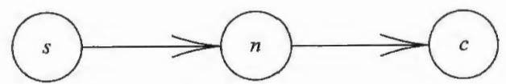
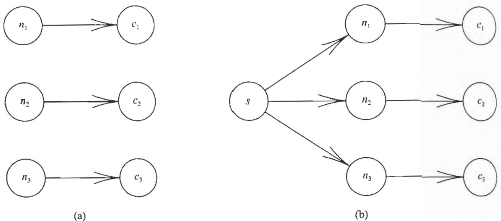

们许多不同的经历联系在了一起,只要成功的假设能起作用,我们就不会放弃它们。改变这些假设的唯一方法是将它们置于无法起作用的情况下。例如,在"埃姆斯房间"中,人们感知到的大小和距离以错误的方式关联,让一个穿过房间的孩子看起来身高翻倍。

这些实验的一般性结论对我们这一代相对主义者来说并不那么令人惊讶,而发现它们的那一代绝对主义者却感到非常惊讶,"眼见"并非像我们通常以为的那样是对现实的直接理解。恰恰相反:"眼见"来自对不完整信息的推断,本质上与我们在这里研究的推断没有什么区别。我们通过眼睛接收的信息不足以确定我们面前"真正存在的"是什么。埃姆斯和坎特里尔的实验揭示的知觉失效不是晶状体、视网膜或视神经的机械失效,只是大脑在接收到与其先验信息不一致的新数据时后续推理过程的反应。在这些情况下,人们不得不"复活"某些备择假设,这就是我们"所看到的"。我们希望对这些案例的详细分析能显示出它们与贝叶斯推断的良好对应,就像我们的特异功能和意见分歧示例一样。

关于视觉感知的研究一直很活跃,积累了许多新知识,但我们几乎没有如何在神经元水平上完成视觉感知的认知。研究者们注意到了在这方面似乎没有任何组织原则,而我们想知道贝叶斯推断的原理是否可以作为起点。我们希望达尔文的自然选择理论会产生这样的结果,毕竟,结果与贝叶斯推断冲突的任何推理形式都必然会使该生物处于生存劣势。确实,正如杰恩斯(Jaynes,1957b)在很久以前指出的那样,基于考克斯定理,否认以贝叶斯方法推理就是断言我们故意以不一致方式推理,我们认为这很难让人相信。出于相同的原因,大概可以发现还有人类和动物感知方向的十几个例子遵循贝叶斯推理方式作为其高层组织原则。考虑到这一点,我们来考察历史上的一个著名案例。

# 5.5 海王星的发现

概率论的另一种潜在应用已被哲学家激烈地讨论了一个多世纪,它涉及科学家的推理过程。通过该推理过程,科学家根据观察到的事实接受或拒绝自己的理论。我们在第1章中提到,这主要包括使用两种形式的三段论。

$$
\left\{\begin{array}{l l}{A\boxplus\boxplus B\boxplus}\\ {\qquad B\boxplus}\\ {\qquad A\boxplus}\end{array}\right\}.\quad\longrightarrow\boxplus:\left\{\begin{array}{l l}{A\boxplus\boxplus B\boxplus}\\ {\qquad B\boxplus}\\ {\qquad A\boxplus\boxplus\boxplus}\end{array}\right\}.\tag{5.33}
$$

在第2章中,我们注意到这对应于贝叶斯定理的两种形式的应用:

$$
P(A|\overline{B} X) = P(A|X)\frac{P(\overline{B}|AX)}{P(\overline{B}|X)},\qquad P(A|BX) = P(A|X)\frac{P(B|AX)}{P(B|X)}. \tag{5.34}
$$

这些形式确实与三段论在定量上是一致的。

这里的兴趣集中在贝叶斯定理的第二种形式是否给出了令人满意的弱三段论定量版本,方便科学家在实践中使用。我们考虑波利亚(Pólya,1954,第二卷,第130~132页)给出的一个具体例子,它将给我们"复活"替代假设提供一个更有用的例子。

1781年,威廉·赫歇尔发现了天王星,在几十年内(即,当天王星绕过其轨道的三分之一时),它很明显并不完全遵循牛顿理论(力学和引力定律)规定的路径运行。在这一点上,强三段论的朴素应用可能导致一个结论,即牛顿理论被推翻了。但是,牛顿理论在许多其他方面的成功使其具有牢固的地位,以至于在天文学家的脑海中,这个假设的可能性很低:"牛顿理论是错误的"这种可能性已经降低了大概- 50dB。因此,对于法国天文学家于尔班·让·约瑟夫·勒韦里耶(1811—1877)和英国剑桥圣约翰学院的学者约翰·库奇·亚当斯(1819—1892)来说,也许降低了- 20dB的另一种假设"复活"了:必定存在天王星以外的另一个行星,其引力引起了这种差异。

勒韦里耶和亚当斯在不知道彼此工作的情况下,独立计算可能导致所观测偏差的行星的质量和轨道,并预测在哪里可以发现这颗新行星。两人的结果几乎相同。1846年9月23日,柏林天文台收到勒韦里耶的预测。在同一天晚上,天文学家约翰·戈特弗里德·加勒(1812—1910)在预测位置的大约1°之内发现了新行星(海王星)。更多详细信息,请参见斯马特(Smart,1947)或格罗瑟(Grosser,1979)的著作。

通过这个插曲,我们会本能地认为牛顿理论的合情性增加了,问题是,增加了多少。将概率论应用于该问题的尝试将为我们提供一个很好的例子,说明科学家所面临的实际情况的复杂性,以及在阅读有关这些问题的混乱文献时需要保持的谨慎态度。

按照波利亚的表示法,假设  $T$  代表牛顿理论,  $N$  代表勒韦里耶经过验证的那部分预测结果。那么,概率论给出  $T$  的后验概率为

$$
P(T|NX) = P(T|X)\frac{P(N|TX)}{P(N|X)}. \tag{5.35}
$$

现在我们尝试计算  $P(N|X)$ 。不管  $T$  是否为真,它都是  $N$  的先验概率。与往常一样,用  $\overline{T}$  表示对  $T$  的否定。由于  $N = N(T + \overline{T}) = NT + N\overline{T}$ ,应用加法规则和乘法规则,我们有

$$
\begin{array}{r l} & {P(N|X) = P(N T + N\overline{{T}} |X)}\\ & {\qquad = P(N T|X) + P(N\overline{{T}} |X)}\\ & {\qquad = P(N|T X)P(T|X) + P(N|\overline{{T}} X)P(\overline{{T}} |X).} \end{array} \tag{5.36}
$$

这样,  $P(N|\overline{T} X)$  进入了这个问题。但是,在所陈述的问题中,这个量没有定义。在我们指定牛顿理论的替代理论之前,命题  $\overline{T} \equiv$  "牛顿理论是错误的"没有明确的意义。

一方面,如果仅存在一个可能的备择理论,而且根据该理论,天王星之外没有行星,那么  $P(N|\overline{T} X) = 0$ 。概率论再次简化为演绎推理,给出  $P(T|N X) = 1$  与先验概率  $P(T|X)$  无关。

另一方面,如果爱因斯坦理论是唯一可能的备择理论,那么对于这一现象,其预测结果与牛顿理论的预测结果不会有显著的差异,将得到  $P(N|\overline{T} X) = P(N|T X)$ ,于是  $P(T|N X) = P(T|X)$ 。

因此,对勒韦里耶- 亚当斯预测结果的验证,既可能会将牛顿理论提升到确定的程度,也可能对其合情性完全没有影响。这完全取决于:我们在检验牛顿定律时使用了哪种特定的替代理论。

现在,对于正在评估自己理论的科学家而言,这个结论是对常识最明显的练习。我们已经在第4章详细了解了其中的数学原理,然而,并不需要任何数学原理,所有科学家都能直观地看到同样的结果。

如果你问一位科学家"齐尔希实验对威尔逊理论的支持程度如何",可能会得到这样的回答:"如果你上周问我,我会说它很好地支持了威尔逊理论。齐尔希的实验结果更接近威尔逊的预测结果,而不是沃森的预测结果。但是,就在昨天,我得知沃夫森有一个基于更合理假设的新理论,他根据该理论得到的曲线正好经过实验点。因此,现在我恐怕要说齐尔希实验很好地否定了威尔逊理论。"

# 5.5.1 关于备择假设

有鉴于此,科学家们可能会沮丧地注意到,统计学家已经制定了接受或拒绝理论(卡方检验等)的特定标准,而没有提及任何备择假设。杰弗里斯(Jeffreys, 1939)指出这样产生的一个实际困难:除非我们可以支持某些更符合事实的确定的备择假设  $H_{1}$ ,否则拒绝任何假设  $H_{0}$  都没有丝毫用处。

当然,我们在这里关注的假设本身并不是对可观察事实的陈述。如果假设  $H_{0}$  只是  $x < y$ ,则证实该不等式的  $x$  和  $y$  直接、无误差的测量值构成了该假设正确性的肯定证据,而与任何其他备择假设无关。我们正在考虑的是可能被称为"科学理论"的假设,因为它们是对无法直接观察到的事物的假设,我们只能观察到其中的某些(逻辑的或因果的)后果。

对于这样的假设,贝叶斯定理告诉我们:除非根据假设  $H_{0}$  绝对不可能产生观察到的事实,否则问这些事实"本身"在多大程度上证明或反驳  $H_{0}$  是没有意

义的. 不仅是数学, 而且我们的常识 (如果我们稍微思考一下) 也告诉我们, 除非指定了  $H_{0}$  的可能备择假设, 我们就没有问任何明确、恰当的问题. 正如我们在第 4 章中看到的那样, 概率论可以揭示, 我们的假设相对于指定的备择假设的可能性. 它没有发明新假设的创造力.

当然, 随着观察到的事实表明假设  $H_{0}$  越来越不可信, 我们会越来越怀疑  $H_{0}$  的正确性. 但是, 无论多么不可信, 也不能成为质疑  $H_{0}$  的理由. 在 (5.7) 后面, 我们注意到了这一点. 现在, 我们再次强调它, 因为它对于以后的显著性检验的一般表述至关重要.

早期设计此类检验的尝试没有考虑到我们刚刚指出的这一点. 阿巴思诺特 (Arbuthnot, 1710) 指出, 在长达 82 年的人口统计数据中, 每年出生的男孩都多于女孩. 根据"零假设"  $H_{0}$ , 即生男孩的概率为  $1 / 2$ , 他认为该结果的概率为  $2^{- 82} = 10^{- 24.7}$  (用我们的证据度量是  $- 247 \mathrm{~dB}$  ), 这个数值小到在他看来  $H_{0}$  几乎是不可能的, 他认为在这个证据中看到了"上帝的旨意". 他可能是第一个根据某假设数据几乎不可能出现而拒绝该统计假设的人. 但是, 我们可以从几个方面批评他的推理.

首先, 备则假设  $H_{1} \equiv$  "上帝的旨意" 似乎并不适用于概率计算, 因为它不确定. 也就是说, 它没有做任何我们已知的确定预测, 所以我们无法以  $H_{1}$  为条件分配条件概率  $P(D|H_{1})$ . (出于同样的原因, 单纯的逻辑否定  $H_{1} \equiv \overline{H_{0}}$  不能作为备择.) 事实上, 很难说清楚为什么上帝的旨意希望生更多的男孩而不是生更多的女孩. 其实, 如果在大量人口中每年出生的男孩和女孩的数量完全相等, 那么在我们看来, 这似乎更能有力地证明某种超自然的控制机制在起作用.

其次, 在零假设 (每次生出男孩或女孩的独立概率相同) 的基础上, 无论数据如何, 找到观测序列数据的概率  $P(D|H_{0})$  都将同样小, 因此, 根据阿巴思诺特的推理, 假设无论如何都将被拒绝! 如果没有关于备择假设的数据的概率  $P(D|H_{1})$  以及该假设的先验概率, 那么就没有问适当的问题, 也没有做出以上判断的合理依据.

最后, 如果连续 10 年观察到出生的男孩比女孩多, 理性推断可能使阿巴思诺特预测在第 11 年也应该是男孩比女孩多. 因此, 他的假设  $H_{0}$  不仅是数值  $p = 1 / 2$ , 还有一个隐含的假设, 即不同年份的数据在逻辑上具有不独立性, 这一点他可能没有意识到. 如果假设 (例如  $H_{\mathrm{ex}}$  ) 允许每年的结果是正相关的, 它会分配可交换的采样分布, 那么数据的概率  $P(D|H_{\mathrm{ex}})$  可能远远大于  $2^{- 82}$ , 因此, 阿巴思诺特在正确的方向上走了一小步, 但要获得可用的显著性检验, 需要对概率论有更深层的概念性理解, 这是拉普拉斯大约 100 年后才完成的.

另一个例子出自丹尼尔·伯努利的一篇关于行星轨道的论文,他为此赢得了1734年的法国科学院院士奖,在这篇论文中,他用单位球面上的极点来表示每个轨道的方向,并且发现它们之间的距离如此之近,以至于其分布不太可能是偶然产生的。尽管他也没有提出具体的备择选择,但我们今天倾向于接受他的结论,因为似乎有一个非常明确的隐含的随机性零假设  $H_{0}$  。根据该假设,这些点应该分布在整个球面上,不会倾向于聚集在一起,而具有"吸引作用"的假设  $H_{1}$  会使它们趋于聚集,证据明显支持  $H_{1}$  。

拉普拉斯(Laplace,1812)对彗星进行了类似的分析,发现它们的极点比行星的极点分散得多,并得出结论,彗星不像行星那样是太阳系的"常规成员"。在这里,我们终于有了两个通过正确应用概率论产生的相当明确的可比较的假设。

这样的检验没有必要是定量的,即使只是定性的,概率论仍然在规范意义上有用。这是我们可以在定性推理中发现不一致之处的方法。它能马上告诉我们,这一点还不是对于所有人在直觉上都显而易见:在我们拥有检验假设的合理标准之前,需要有备择假设。

这意味着,如果科学家要接受任何有意义的假设检验,都需要检查其依据,以查看它是否像丹尼尔·伯努利的检验一样具有未阐明的备择假设。只有在确定有这样的假设之后,我们才能说检验取得了什么成果,即它正在检验什么。但这并不会让读者感到疑惑:统计学家的显著性检验都可以解释为针对特定假设类的特定假设  $H_{0}$  的检验。因此,这仅仅是对第4章中多重假设检验公式(4.31)~(4.49)的数学上的一般化。但是,在正统文献中应用随意的特定工具而不是概率论来处理复合假设时,他们却从未意识到这一点。

# 5.5.2 回到牛顿理论

现在,我们想对牛顿理论得出定量结果,在波利亚(Pólya,1954,第二卷)对勒韦里耶和亚当斯成就的讨论中,仍然没有指出牛顿理论的具体替代理论。但是,根据所使用的数值(第131页),我们可以推断出他心中有一个可能的替代理论  $H_{1}$ ,据此已知天王星以外还存在一颗行星,但它在天球上所有方向上的可能性相同。然后,由于1度角的圆锥体在天空中填充大约  $\pi /57.3^{2} = 10^{- 3}$  球面度,因此  $P(N|H_{1}X) \simeq 10^{- 3} / 4\pi = 1 / 13000$ ,这是海王星将在预测位置  $1^{\circ}$  以内的概率。

遗憾的是,波利亚在计算中没有区分  $P(N|X)$  和  $P(N|\overline{T} X)$ 。也就是说,波利亚实际计算的似然比不是概率论表示的计算(5.35),而是(用我们的记号写出)

$$
\frac{P(N|T X)}{P(N|\overline{{T}} X)} = \frac{P(N|T X)}{P(N|H_{1}X)}. \tag{5.37}
$$

因此,根据第4章的分析,波利亚获得的不是后验概率与先验概率之比,而是后验几率与先验几率之比:

$$
\frac{O(N|T X)}{O(N|X)} = \frac{P(N|T X)}{P(N|\overline{{T}} X)} = 13000. \tag{5.38}
$$

当我们注意到这一点时,得出的结论将更加令人满意,无论我们将牛顿理论的概率  $P(T|X)$  设为多少,如果仅考虑  $H_{1}$ ,则对预测的验证会使牛顿理论的证据增加  $10\log_{10}(13000) = 41\mathrm{dB}$

实际上,根据伯努利和拉普拉斯的上述研究,如果有新行星,则采用不同的替代假设  $H_{2}$  是合情的,根据该假设,新行星的轨道将位于黄道平面内,如波利亚再次通过暗示而不是明确的陈述来说明的那样,如果在假设  $H_{2}$  的基础上所有经度值均被认为具有同等可能性,则可以将其降低大约  $10\log_{10}(180) = 23\mathrm{dB}$  鉴于备择假设到底是什么具有很大的不确定性(即问题尚未明确定义),这些极端值之间的任意值似乎或多或少都是合情的.

有一个困扰波利亚的难题:如果牛顿理论为真的概率增加了13000倍,那么先验概率必然低于1/13000;但这与常识矛盾,因为牛顿理论在勒韦里耶出生之前就已经很成熟了,波利亚在他的书中将其解释为,这揭示了贝叶斯定理的不一致性以及试图对其进行数值化应用的危险,认识到我们在上述计算中处理的是几率而非概率,可以消除这个对贝叶斯定理的异议,使贝叶斯定理在描述科学推断时显得十分令人满意.

这是一个很好的例子,说明了当你更仔细地研究问题时,可以如何消除在文献中发现的对贝叶斯- 拉普拉斯方法的异议,由于计算中的一个失误,波利亚误解了贝叶斯定理的运作方式,但我很高兴能够以令人愉快的个人回忆结束对这个事件的讨论.

1956年,在波利亚的著作出版两年后,我在斯坦福大学就这些问题做了一系列讲座,波利亚参加了讲座,他坐在第一排并极其认真地听了我所说的一切,那时,他已经很好地理解了这一点——实际上,每当听众提出一个问题时,波利亚都会转过身,在我能给出答案之前给出正确答案,得到这样的支持真是令人愉快,我今天仍很怀念他,(乔治·波利亚于1985年9月去世,享年97岁.)

然而,该示例也清楚地表明,科学家在实践中面临的情况如此复杂,以至于几乎没有希望通过应用贝叶斯定理来给出有关理论相对优劣的定量结果,事实上也没有必要这样做,因为科学家面对的真正困难不在于推理过程本身,运用他们的

常识就足够了. 真正的困难在于, 学习如何得到更符合事实的新的代替方案. 通常, 当有人成功地做到这一点时, 新理论的证据很快就会大量涌现, 没有人需要概率论来告诉他得出了什么结论.

练习 5.4 我们的故事有一个奇怪的 "续集". 这一次, 人们注意到海王星并没有完全按照其正确的轨道运行, 因此人们自然地认为是另一颗行星引起了这个现象. 通过类似的计算, 珀西瓦尔·洛厄尔预测了它的轨道, 克莱德·汤博随后找到了新行星 (冥王星), 尽管它距离预测位置不太近. 但是现在情况发生了变化: 有关冥王星卫星运动的现代数据表明, 冥王星的质量太小, 不足以引起促使洛厄尔进行计算的海王星的轨道扰动, 因此无法解释海王星和冥王星运动的差异 (感谢布拉德·谢弗博士提供此信息). 考虑这种新情况, 尝试扩展我们的概率分析. 在这一点上, 牛顿理论处在什么地位? 霍伊特 (Hoyt, 1980) 和怀特 (Whyte, 1980) 的著作给出了更多背景信息. 后来, 人们发现似乎错误估计了冥王星的质量, 海王星和冥王星运动的差异并不真实, 牛顿理论的地位似乎应该恢复到以前的水平. 从概率论的角度讨论这些信息序列. 当每个新事实出现时, 我们是根据贝叶斯定理进行更新, 还是当得知先前的数据为假时就回到起点?

目前, 关于 "最优假设表述" 的过程还没有正式的理论, 我们完全依赖于牛顿、孟德尔、爱因斯坦、魏格纳和克里克 (Crick, 1988) 等人的创造性想象力. 因此我们可以说, 以上述方式应用贝叶斯定理原则上是完全合情的, 但实际上对科学家没有多大用处.

无论如何, 我们不应该假定能为很深的问题提供快捷、轻松的答案. 科学家在实践中如何才能对自己的理论做出判断, 这个问题仍然很复杂, 没有得到很好的分析. 有关牛顿理论有效性的更多评论, 请参见 5.9 节.

# 5.6 赛马和天气预报

前面的示例指出了推断问题共有的两个特点: (a) 在特异功能和心理学的案例中, 我们收到的信息通常不像 (5.21) 中的  $S$  那样是直接命题, 而是间接声明  $S$  为真, 来源本身并不完全可靠; (b) 就像海王星的例子中那样, 人们有误用贝叶斯定理的传统, 并得出贝叶斯定理错误的结论. 普林斯顿大学的哲学家理查德·杰弗里的工作 (Richard C. Jeffrey, 1983) 同时存在这两个特点. 以下以 RCJ 表示哲学家杰弗里, 以避免与剑桥学者哈罗德·杰弗里斯爵士混淆.

RCJ 考虑了以下问题. 仅使用先验信息  $I$ , 我们为  $A$  分配一个概率  $P(A|I)$ .

然后得到新信息  $B$ ,根据贝叶斯定理它会变为

$$
P(A|BI) = P(A|I)P(B|AI) / P(B|I). \tag{5.39}
$$

但是之后,他认为贝叶斯定理还不够一般化,因为我们经常收到不确定的新信息。也许  $B$  的概率不是1,而是  $q$ 。为此,我们会回应:"如果你不接受  $B$  为真,为什么要以这种方式在贝叶斯定理中使用它呢?"但是RCJ遵循了长期以来的传统并得出结论:不是由于错误地应用(5.39)中的不确定信息而误用了贝叶斯定理,而是贝叶斯定理本身是错误的,需要将其一般化以考虑新信息的不确定性。

他提出的一般化方案(以  $B$  表示  $B$  的否定)是将  $A$  的更新概率视为以下加权平均值:

$$
P(A)_{J} = qP(A|BI) + (1 - q)P(A|\overline{B} I). \tag{5.40}
$$

但是,这是一种特定方案,它不会遵守概率论规则,除非我们将  $q$  设为先验概率  $P(B|I)$ ,这正是RCJ想排除的情况(因为这时  $P(A)_{J} = P(A|I)$ ,并没有更新)。

由于(5.40)与概率论规则冲突,我们知道它必然违反了我们在第1章和第2章中讨论过的合情条件之一,问题的根源很容易找到,因为这些合情条件告诉了我们要去哪里寻找。RCJ提出的"一般化"公式(5.40)通常并不成立,因为我们可以学习很多不同的东西,所有这些都表明概率  $q$  对  $B$  而言相同,但对  $A$  具有不同的意义。(5.40)违反了合情条件(1.39b),因为它没有考虑所有新信息,仅考虑了与  $B$  相关的部分。

第2章的分析告诉我们,如果要扭转现状并得到一个有确定答案的良好定义的问题,那么我们绝不能背离贝叶斯定理。相反,我们需要认识到在特异功能示例中所强调的内容:如果不确定  $B$  为真,那么就不能用  $B$  作为新信息。实际收到的信息一定是某个命题  $C$ ,使得  $P(B|CI) = q$ 。此时,我们当然应该考虑以  $C$  而不是  $B$  为条件的贝叶斯定理:

$$
P(A|CI) = P(A|I)P(C|AI) / P(C|I). \tag{5.41}
$$

如果正确应用,贝叶斯定理会自动考虑新信息的不确定性。可以使用概率论的乘法规则和加法规则将结果写为:

$$
\begin{array}{r l} & {P(A|C I) = P(A B|C I) + P(A\overline{{B}}|C I)}\\ & {\qquad = P(A|B C I)P(B|C I) + P(A|\overline{{B}} C I)P(\overline{{B}}|C I).} \end{array} \tag{5.42}
$$

如果我们定义  $q \equiv P(B|CI)$  为  $B$  的更新概率,则可以写成

$$
P(A|CI) = qP(A|BCI) + (1 - q)P(A|\overline{B} CI). \tag{5.43}
$$

这类似于(5.40),但通常不等同于它,除非我们添加概率  $P(A|BCI)$  和  $P(A|\overline{B} CI)$

与  $C$  无关的限制. 直觉上, 这意味着逻辑流是

$$
(C \rightarrow B \rightarrow A), \tag{5.44}
$$

而不是

$$
(C \rightarrow A). \tag{5.45}
$$

也就是说,  $C$  仅通过与  $B$  的中介才与  $A$  相关(  $C$  与  $B$  相关并且  $B$  与  $A$  相关)

RCJ 通过示例表明此逻辑流可能存在于实际问题中, 但没有注意到他提出的解决方案 (5.40) 与贝叶斯结果相同. 没有该逻辑流, (5.40) 通常不被接受, 因为它没有考虑所有新信息. 丢失的信息以缺少一个箭头的逻辑流 (5.45) 直接表示:  $(C \rightarrow A)$ , 即无论  $B$  是否为真,  $C$  与  $A$  直接相关.

如果我们将逻辑流视为类似于光流, 则可以将其可视化. 在晚上, 我们只能通过月球的反射来接收阳光, 这对应于 RCJ 解决方案. 但是在白天, 无论月亮是否在那里, 我们都直接从太阳接收阳光. 这就是 RCJ 的解决方案所没有考虑的. (事实上, 当我们研究统计力学中的最大熵形式和"广义散射"现象时会发现, 这不仅仅是一个松散的类比, 条件信息流的过程在数学上与惠更斯光学原理几乎能完全对应.)

练习 5.5 我们可以凭直觉期望, 当  $q \rightarrow 1$  时, 这种差别将消失, 即  $P(A|BI) \rightarrow P(A|CI)$ . 确定这在一般情况下是否正确. 如果正确, 请指出  $1 - q$  必须小到什么程度, 才会使得差别实际上可以忽略不计. 如果不正确, 请通过口头陈述来说明可能妨碍达成这种一致性的情形.

我们可以通过 RCJ 所说的一种场景来更实际地说明这一点

$A \equiv$  我的马明天将赢得比赛,

$B \equiv$  赛道将变得泥泞,

$I \equiv$  我对自己的马和骑师的特别了解, 以及对马、骑师、比赛和

生活的一般了解,

概率  $P(A|I)$  在接收天气预报的结果后更新. 这样, 命题

$C \equiv$  天气预报员向我们展示今天的天气图, 引用一些当前的气象

数据, 然后通过无法解释的方式分配了明天下雨的概率  $q'$

明显存在, 但 RCJ 没有意识到并加以说明. 确实, 这样做会引入很多新的细节, 远远超出了赛马者感兴趣的命题  $(A, B)$ .

如果我们明确地认识到命题  $C$  的存在, 那么必须回想有关天气预报的所有知识: 导致该天气预报的具体气象数据是什么, 存在此类数据时天气预报的可靠性

如何, 官方公布的概率  $q'$  与预报员的真实信念 (即我们认为预报员认为自己的兴趣所在) 如何关联, 等等.

如果上面定义的  $C$  是新信息, 那么我们还必须根据所有的现有信息, 考虑  $C$  可能如何通过赛道上的泥泞  $B$  以外的其他情况影响比赛  $A$  的结果. 也许骑师会因为耀眼的阳光眼花, 也许 (无论赛道是否潮湿) 马在多云的日子里都跑得不好. 这些将是 (5.40) 无法考虑的  $(C \rightarrow A)$  形式的逻辑关系.

因此, 完整的解决方案必定比 (5.40) 复杂得多, 当然, 本来就应该是这样的. 像以往一样, 贝叶斯定理只是告诉我们常识是什么. 通常,  $A$  的更新概率必须不仅仅依赖于  $B$  的更新概率  $q$ .

# 讨论

这个例子说明了我们在第 1 章中已经提到的内容, 日常生活中的常见问题可能比科学问题复杂得多. 在科学问题中, 我们经常研究精心控制的情况; 而最熟悉的问题可能非常复杂 (仅仅因为结果取决于许多未知且不受控制的因素) 以至于尽管在原则上是正确的, 但是在实践中完全无法进行完整的贝叶斯分析. 后者的计算成本远远超过了我们希望通过赛马赢得的赌注.

那么, 我们必然使用近似技巧. 既然不能精确地应用贝叶斯定理, 我们是否仍需要考虑它? 回答是肯定的, 因为贝叶斯定理仍然是告诉我们应该寻找什么的规范性原则. 没有它, 我们将没有指导选择的依据, 也没有判断其成功与否的标准.

这也说明了我们将在后面的章节中反复遇到的内容: 概率论领域中的几代人并未理解贝叶斯定理是合理性和一致性所要求的有效定理, 还持续进行着令人难以置信的各种尝试, 企图以各种符合直觉的特定方案来代替它. 当然, 我们希望所有真诚的直觉努力都能抓住些许真相. 然而, 所有这些尝试性分析的结果仅在完全和贝叶斯定理一致的情况下是令人满意的.

然而, 我们对这些人反对贝叶斯方法的动机感到困惑, 因为无论从贝叶斯定理的理论基础、直觉推理还是实际结果来看, 我们都看不到任何令人不满意的地方. 我花了大约 40 年的时间通过贝叶斯定理分析成千上万个独立的问题, 仍然对它给我们带来的美妙而重要的结果印象深刻——通常只要几行计算, 就会得到远远超出所有那些特定方案所能产生的效果. 我们还没有发现结果令人不满意的情况 (尽管结果有时乍一看令人惊讶, 但是在进行一些更深入的思考来纠正我们的直觉之后, 会明白这终究还是正确的).

不用说, 我们首先感到惊讶的就是贝叶斯定理对我们最有价值的情况. 因为在这些情况下, 直观的特定方案永远得不到结果. 比较贝叶斯分析与充斥各种文

献的诸多特定方法, 只要最终结论中有任何不一致, 我们就很容易说明特定方法的缺陷, 就像第 2 章的分析使我们期望的那样, 上面的例子也表明了这一点.

过去, 为了化圆为方, 徒然浪费了很多人多年的精力. 如果当时知道林德曼定理 (  $\pi$  是超越数), 并且认识到其意义, 那么所有这些都可以避免. 同样, 如果在 100 年前就知道考克斯定理, 并且认识到它的意义, 那么就可以避免很多无意义的工作, 转而从事更有建设性的活动. 这是我们对那些认为考克斯定理不重要的人的回答, 因为他们只是证实了詹姆斯·伯努利和拉普拉斯很久以前的猜想.

如今, 我们已有 50 多年的经验来确认考克斯定理告诉我们的内容. 显然, 作为扩展逻辑的概率论规则的定量使用是进行推断的唯一合理方法, 没有严格遵守这些规则是多年以来一直导致不必要的错误、悖论和争议的原因.

# 5.7 关于直觉的悖论

关于直觉的悖论有一个著名例子, 称为亨佩尔悖论, 它的前提是"假设的一个示例支持了该假设", 然后的内容是"所有乌鸦都是黑色的假设在逻辑上等价于所有非黑色物体都不是乌鸦的命题, 观察到一只白鞋会支持这个命题." 这种看似正确 (但最终得出令人无法认同的结论) 的论点, 已经有很多记载.

当人们检查应用于前提的概率论公式时, 论证中的错误会立即显现: 前提的真假不能从任何逻辑分析中得出, 它通常不是真的, 亨佩尔通过试图在不考虑任何备择假设的情况下判断假设的真假.

在一篇题为"白鞋是红鲱鱼"的笔记 (Good, 1967) 中, 古德通过一个简单的反例证明了这个前提中的错误. 在世界 1 中有 100 万只鸟, 都是黑乌鸦. 在世界 2 中有 200 万只鸟, 其中有 20 万只黑乌鸦, 180 万只白鸟鸦. 我们观察到一只鸟, 它被证明是黑乌鸦, 请问我们处在哪个世界?

显然, 观察到一只黑乌鸦可以给出

$$
10 \log_{10} \left(\frac{200000 / 2000000}{100 / 1000000}\right) = 30 \mathrm{~dB} \tag{5.46}
$$

的证据, 以 1000:1 的几率反对所有乌鸦均为黑色的假设. 也就是说, 它支持我们处在世界 2, 反对我们处在世界 1. "假设的实例" 是否支持该假设取决于所考虑的替代假设和先验信息. 我们在寻找导致 (5.20) 的推理错误时学到了这一点. 但是令人难以置信的是, 亨佩尔 (Hempel, 1967) 拒绝接受古德明确而有说服力的论据, 理由是引入有关世界 1 和世界 2 的背景信息是不公平的.

在各种文献中, 也许有 100 种类似的"悖论" 和争论, 因为它们来自错误的直觉而不是错误的数学. 有人主张一个在他看来直觉上正确的一般原则, 然后, 当

概率分析揭示了他的错误时,他没有利用这个机会来纠正自己的直觉,而是拒绝概率分析。我们将会看到几个这样的例子,特别是第15章中的边缘化悖论。

正如我的一位同事说过的那样,"哲学家可以自由地做自己喜欢的事,因为他们不需要做对任何事情"。但是,一位负责任的科学家没有这种自由。他不会仅仅依靠自己的直觉就断言一个一般原则是正确的,并要求其他人采纳它。第15章和第17章讨论了这种错误的突出示例,这些示例不仅是RCJ篡改贝叶斯定理与亨佩尔悖论之类的"哲学家玩具",而且对科学和社会产生了实际危害。

# 5.8 贝叶斯法理学

在我们不能总是很好地将条件简化为数值的情况下应用概率论很有趣,仍然可以显示什么样的信息将有助于我们进行合情推理。假设纽约市有人犯了谋杀罪,你起初不知道是谁,但是知道纽约市有1000万人口。在没有其他信息的前提下, $e(\text{有罪} |X) = - 70\mathrm{dB}$  就是任何特定的人有罪的合理信念。

在判定某人有罪之前,需要多少正向证据?也许是  $40\mathrm{dB}$ ,你的反应可能是这样做还不够安全,这个数值应该更高。如果我们增大这个数值,将为无辜者提供更多的保护,但代价是使真正的罪犯更难以被定罪。在某些时候,社会整体的利益是不容忽视的。

例如,如果释放1000名罪犯,我们以大量经验可以知道,其中200或300人会对社会实施更多犯罪活动,而他们逃避司法惩罚将鼓励另外100人犯罪。因此,很明显,让1000名罪犯获得自由对整个社会的损害要远远大于对一名无辜者的错误定罪所造成的损害。

如果你从情感上反对上述说法,我想请你考虑:如果你是法官,你是愿意面对一个被你错误定罪的人,还是本来可以幸免的100名无辜受害者?将阈值设置为  $40\mathrm{dB}$  意味着(粗略地)平均1万次定罪中不超过一次是错误的。要求陪审团遵守该规则的法官可能终其一生不会做出任何错误的定罪。

无论如何,如果我们从  $- 70\mathrm{dB}$  开始需要达到  $40\mathrm{dB}$  的证据,这意味着为了确保定罪,你将不得不提供大约  $110\mathrm{dB}$  的证据证明此人有罪。假设现在我们知道这个人有动机,这对他有罪的可能性有什么影响呢?概率论告诉我们

$$
e(\mathcal{H}\mathbb{H}\mathbb{H}\mathbb{H}\mathbb{H}\mathbb{H}) = e(\mathcal{H}\mathbb{H}\mathbb{H}\mathbb{H}\mathbb{H}) + 10\log_{10}\left[\frac{P(\mathcal{H}\mathbb{H}\mathbb{H}\mathbb{H}\mathbb{H})}{P(\mathcal{H}\mathbb{H}\mathbb{H}\mathbb{H}\mathbb{H}\mathbb{H}\mathbb{H})}\right] \tag{5.47}
$$

由于  $P(\text{有动机} | \text{有罪}) \simeq 1$ ,也就是说,我们认为犯罪者几乎不可能完全没有动机。因此,了解一个人有动机的重要性几乎完全取决于一个无罪的人也有动机的

概率  $P$  (有动机无罪).

如果我们仔细考虑一下,会发现这显然符合常识。如果受害者是善良的,受到所有人的爱戴,那么几乎没有人会有动机去杀害他。有鉴于此,得知我们的嫌疑人确实有动机,这将是非常重要的信息。如果受害者是一个不讨人喜欢的人,做过各种坏事,那么很多人就会有动机,得知我们的嫌疑人就是其中之一并不太重要。这里要说明的是,除非了解受害者的性格,否则我们不知道该如何利用嫌疑人有动机这一点。但是,如果不向陪审团成员指出,他们中有多少人能意识到这一点呢?

假设一位非常开明的法官已经意识到了该事实,在引入嫌疑人动机的证据时,他指示助手为陪审团确定纽约市有多少人有动机。如果有动机的人数是  $N_{m}$ ,那么

$$
P(\text{有动机} \mid \text{无罪}) = \frac{N_{m} - 1}{(\text{纽约市人口}) - 1} \simeq 10^{-7}(N_{m} - 1), \tag{5.48}
$$

(5.47) 将简化为

$$
e(\text{有罪} \mid \text{有动机}) \simeq -10 \log_{10}(N_{m} - 1). \tag{5.49}
$$

你会看到纽约市人口从公式中消失了。一旦我们知道有动机的人数,城市有多大就不再重要了。请注意,即使  $N_{m}$  只有 1 或 2,(5.49) 也仍然正确。

你可以通过这种方式继续思考下去,我们认为你会发现这样做既有启发性,也有娱乐性。例如,我们现在得知不久前有人在犯罪现场附近看到了嫌疑人。根据贝叶斯定理,其意义几乎完全取决于附近还有多少无辜者。如果有人告诉过你不要相信贝叶斯定理,那么你应该进一步关注一些类似的例子,并观察在合情推理中它如何准确无误地告诉你哪些信息是相关的,哪些无关紧要。近年来,已经涌现了大量关于贝叶斯法理学的文献,对于相关参考文献的综述,请参阅维尼奥和罗伯逊的著作(Vignaux & Robertson,1996)。

即使在无法完全确定应该使用数值的情况下,贝叶斯定理仍能定性地再现你的常识(也许经过沉思后)告诉你的内容。这是乔治·波利亚极其详尽地展示的事实,以至于我深信这种联系必然不仅仅是定性的。

# 5.9 评注

关于牛顿理论地位的讨论比我们上面提到的要多得多,例如,查尔斯·米斯纳指出,在知道其有效性的界限(它什么时候失效)之前,我们无法完全充满信心地运用一种理论.

因此,相对论在向我们展示牛顿力学有效性的界限时,也证实了牛顿力学在此界限内的准确性,所以,在牛顿理论的适用领域(低于光速)内应用时,应该会增强我们对牛顿理论的信心,同样,热力学第一定律在向我们展示热质说的有效范围时,也确认了热质说在其适当范围(热量流动但没有做功的过程)内的准确性,乍一看,这似乎是一个吸引人的想法,也许这就是科学家真正应该具备的思考方式.

尽管如此,米斯纳的原理与科学家的实际思维方式截然不同,我们没有见过有人宣称自己对某理论的信心随着该理论被推翻而增加,此外,我们之所以完全有信心运用动量守恒原理,不是因为我们知道它的有效性范围,而是出于相反的原因:我们不知道任何此类界限的存在,科学家认为动量守恒原理是有实际内容的,而不仅仅是对牛顿理论的无谓重复.

带着这个谜团,我们进一步探索,观察到:如果要判断牛顿力学的有效性,我们不能确定相对论是否向我们展示了它的所有局限性,例如,可以想到的是,牛顿力学不仅可能在高速时失效,而且可能在高加速度时失效,确实,有理论上的理由可以期望这一点,因为牛顿的  $F = m a$  和爱因斯坦的  $E = m c^{2}$  可以组合成一个也许更基本的陈述:

$$
F = (E / c^{2})a. \tag{5.50}
$$

为什么加速一堆能量  $E$  所需的力要依赖于光速?

如果采用一个几乎肯定正确的假设,也就是说,所谓的"基本"粒子不能仅在空间上占据数学点,而是具有某种扩展结构,那么我们马上就会看到一个可能的理由:光速决定了结构的不同部分之间可以多快地"通信"所有部分越快地得知有一个正在作用的力,就可以越快地做出反应,我们把它作为一个练习,请读者说明实际上可以从前提中推导出(5.50).(提示:力与粒子在其所有部分开始移动之前必须承受的变形成比例.)

根据这个处于萌芽期的理论立即可以做出进一步的预测,我们期望,当突然施加力时,加速度要达到其牛顿理论值需要短暂的瞬时响应时间,如果是这样,那么牛顿的  $F = m a$  就不是一个精确的关系,只是最终的稳态条件,在光穿过结构所需的时间之后才能达到,可以设想能通过实验来检验这种预测.

因此,除了引证牛顿理论过去的成功预测及其与相对论的关系,我们对牛顿理论的信心问题要微妙和复杂得多,这也取决于我们对牛顿理论的整体展望。

在我们看来,实际的科学实践是以尚未被充分认识(更不用说分析和证明)的本能为指导的。我们不仅必须考虑科学的逻辑,而且要考虑科学社会学(也许还包括科学救赎论)。但这十分复杂,我们甚至无法确定,从长远来看,永远接受新思想的极端疑古主义能起有益的稳定作用还是对进步的阻碍。

# 关于"怪异"

在本章中,我们研究了概率论的某些应用,在今天看来,这些应用对我们来说是"怪异"的,即"偏离常规"。大概任何全新的应用都必须经过这种怪异的探索阶段。但是,在许多情况下,尤其是贝叶斯法理学和比特异功能有更严肃目的的心理测试中,我们认为今天的怪异应用可能会成为明天受人尊敬的有用应用。进一步的思考和经验将使我们更清楚地知道某个问题的正确表述(与现实之间的联系更加紧密),然后,后来人将把贝叶斯分析视为讨论该问题不可或缺的一部分。现在,我们回头讨论已经超出怪异阶段,进入受人尊敬和有用阶段的应用。

# 第6章 初等参数估计

某些作者将实际上没有差异的"点估计"和"区间估计"区别开来,称"点估计"是指不考虑精度进行估计的过程,而"区间估计"则在一定程度上考虑估计的精度.

——费希尔(R.A.Fisher,1956)

作为逻辑的概率论在理念上与费希尔一致,它通过一次计算自动为我们进行点估计和区间估计,假设检验和参数估计之间的区别通常被描述得比费希尔所担心的更大,但在我们看来,它们之间也没有真正的差别,当只考虑少量离散假设 $\{H_{1},\dots,H_{n}\}$  时,我们通常根据先验信息和数据从中选择一个最有可能的假设.在第4章中,我们详细研究了  $n = 2$  和  $n = 3$  的情况.从原则上讲,更大的  $n$  只是对其简单的一般化.

但是,当假设很多时,似乎需要不同的方法,总是可以通过分配一个或多个数值指标来区分一组离散假设,如  $H_{t}$  (  $1\leqslant t\leqslant n$  ).如果假设非常多,则很难避免这么做.这样,选择假设  $H_{t}$  与估计指标  $t$  实际上是一回事,将指标而不是假设视为关注量就是在做参数估计.我们首先考察指标离散的情况.

# 6.1 坛子问题的逆

在第3章中,我们研究了从坛子中抽取球的各种抽样分布.在问题中,坛子中的总球数  $N$  、红球数  $R$  和白球数  $N - R$  已知,我们需要对  $n$  次抽取中取出  $r$  个红球和  $n - r$  个白球的组合概率进行"数据前"推断.现在,我们要按照贝叶斯和拉普拉斯的思路,求解逆问题,将其变成一个"数据后"问题:数据  $D\equiv (n,r)$  已知,但是坛子的内容  $(N,R)$  未知.根据数据和我们关于坛子内容的先验信息,可以对坛子的内容做出怎样的推断?几乎可以肯定地说,每个概率论工作者都会对这个逆问题的结论感到惊讶——该结论从数学上来说几乎微不足道,在概念上却出人意料,也很深刻,下面我们将说明文献中已经提到的一些结果,并补充已知文献没有提到的一些新结果.

在(3.22)中,我们发现描述坛子问题的抽样分布是超几何分布

$$
p(D|N R I)=h(r|N,R,n)={\binom{N}{n}}^{-1}{\binom{R}{r}}{\binom{N-R}{n-r}}, \tag{6.1}
$$

其中  $I$  表示先验信息,即如前所述问题的一般说明.

# 6.2  $N$  和  $R$  均未知

通常, $N$  和  $R$  在开始时都是未知的,机器人需要同时估计这两个值。如果我们成功地从坛子中取出  $n$  个球,当然可以推出  $N \geqslant n$ 。直觉似乎告诉我们,数据无法告诉我们有关  $N$  的更多信息。已取出红球的数量  $r$  或抽取顺序与  $N$  又有什么关系呢?但是这种直觉使用了一个隐含假设,在我们看到机器人的答案之前几乎无法意识到这一点。

$N$  和  $R$  的联合后验概率分布为

$$
p(NR|DI) = p(N|I)p(R|NI)\frac{p(D|NRI)}{p(D|I)}. \tag{6.2}
$$

我们在这里通过乘法规则将联合先验概率做了因子分解: $p(NR|I) = p(N|I)p(R|NI)$ 。归一化分母是一个二重和:

$$
p(D|I) = \sum_{N = 0}^{\infty}\sum_{R = 0}^{N}p(N|I)p(R|NI)p(D|NRI), \tag{6.3}
$$

其中,当  $N< n$ $R< r$  或  $N - R< n - r$  时,因子  $p(D|NRI)$  当然是0。这样, $N$  的边缘后验概率是

$$
p(N|DI) = \sum_{R = 0}^{N}p(NR|DI) = p(N|I)\frac{\sum_{R}p(R|NI)p(D|NRI)}{p(D|I)}. \tag{6.4}
$$

我们也可以直接应用贝叶斯定理:

$$
p(N|DI) = p(N|I)\frac{p(D|NI)}{p(D|I)}. \tag{6.5}
$$

当然,(6.4)和(6.5)必须通过乘法规则和加法规则保持一致。

这些关系对关于  $N$  和  $R$  的任何先验信息  $I$  都必须成立,这些信息将由  $p(NR|I)$  表示。原则上, $p(NR|I)$  可能任意复杂,将口头陈述的先验信息转换为  $p(NR|I)$  没有标准方式,你可以随时更深入地分析你的先验信息。但是,我们的先验信息通常非常简单,这些问题在数学上并不难。

直觉可能使我们进一步预测,无论  $p(N|I)$  是多少,数据只会截断不可能值,而可能值的相对概率不变:

$$
p(N|DI) = \left\{ \begin{array}{ll}A p(N|I), & \text{如果} N \geqslant n, \\ 0, & \text{如果} 0 \leqslant N < n, \end{array} \right. \tag{6.6}
$$

其中  $A$  是归一化常数。的确,由概率论规则可知,如果数据仅告诉我们  $N \geqslant n$  而没有关于  $N$  的其他信息,那么这必须成立。例如,如果

$$
Z\equiv N\geqslant n, \tag{6.7}
$$

那么

$$
p(Z|NI)={\left\{\begin{array}{l l}{1,}&{{\mathrm{~}}{\mathrm{~}}{\mathrm{~}}{\mathrm{~}}{\mathrm{~}}{\mathrm{~}}{\mathrm{~}}{\mathrm{~}}{\mathrm{~}}{\mathrm{~}}{\mathrm{~}}{\mathrm{~}}{\mathrm{~}}{\mathrm{~}}{\mathrm{~}}{\mathrm{~}}{\mathrm{~}}{\mathrm{~}}{\mathrm{~}}{\mathrm{~}}{\mathrm{~}}\end{array}\right.}} \tag{6.8}
$$

贝叶斯定理如下:

$$
p(N|ZI) = p(N|I)\frac{p(Z|NI)}{p(Z|I)} = \left\{ \begin{array}{ll}A p(N|I), & \text {如果} N \geqslant n, \\ 0, & \text {如果} N < n. \end{array} \right. \tag{6.9}
$$

如果数据仅告诉我们  $Z$  为真,则我们有 (6.6),归一化常数为  $A = 1 / p(Z|I)$ 。贝叶斯定理表明,如果仅知道  $N \geqslant n$ ,则此信息不会改变  $N$  的可能值的相对概率,只是归一化常数必须重新调整以弥补现在具有零概率的值  $N < n$ 。拉普拉斯认为该结果在直觉上显而易见,将其作为自己理论的基本原则。

但是,机器人在 (6.5) 中告诉我们,除非在  $N \geqslant n$  的情况下  $p(D|NI)$  与  $N$  无关,否则情况并非如此。经过仔细考虑后我们明白,如果有某种先验信息将  $N$  和  $R$  关联起来,则 (6.6) 不必为真。例如,假设人们可能事先知道  $R < 0.06N$ 。那么,如果观察到数据  $(n, r) = (10, 6)$ ,则我们不仅知道  $N \geqslant 10$ ,而且知道  $N > 100$ 。任何为  $N$  和  $R$  提供逻辑关联的先验信息都会导致数据  $r$  与  $N$  的估计相关。但是,我们通常缺少此类先验信息,因此对  $N$  的估计没有意义,从而得到与 (6.6) 相同的结果。

根据 (6.5),一般条件是:除了截断小于  $n$  的值外,数据无法告诉我们有关  $N$  的任何信息。这是一个关于先验概率  $p(R|NI)$  的非平凡条件:

$$
p(D|NI) = \sum_{R = 0}^{N} p(D|NRI) p(R|NI) = \left\{ \begin{array}{ll}f(n, t), & \text {如果} N \geqslant n, \\ 0, & \text {如果} N < n, \end{array} \right. \tag{6.10}
$$

其中  $f(n, r)$  可能取决于数据,但与  $N$  无关。由于我们使用标准超几何分布 (6.1),写出来就是

$$
\sum_{R = 0}^{N}{\binom{R}{r}}{\binom{N - R}{n - r}}p(R|N I) = f(n,r){\binom{N}{n}},\quad (N\geqslant n). \tag{6.11}
$$

这就是直觉很难告诉我们的隐含假设。它是一类离散积分方程,其中先验概率  $p(R|NI)$  必须满足作为数据对于  $N$  没有感知的充分必要条件。当  $N < n$  时,左侧的总和必须保持为 0。这是因为,当  $R < r$  时,第一个二项式系数为 0;当  $R \geqslant r$  且  $N < n$  时,第二个二项式系数为 0。因此,对  $p(R|NI)$  的合理数学约束只是:当  $N \geqslant n$  时,(6.11) 中的  $f(n, r)$  必须与  $N$  无关。

实际上,大多数"合理"先验确实满足此条件,因此相对而言对  $N$  的估计没有意义.这样,将后验分布(6.2)分解为

$$
p(N R|D I) = p(N|D I)p(R|N D I), \tag{6.12}
$$

我们主要关心的是因子  $p(R|N D I)$  ,得出关于  $R$  或在已知  $N$  时关于比值  $R / N$  的推论.根据贝叶斯定理,  $R$  的后验概率分布为

$$
p(R|D N I) = p(R|N I)\frac{p(D|N R I)}{p(D|N I)}. \tag{6.13}
$$

选择不同的先验概率  $p(R|N I)$  将产生完全不同的结果,下面考察其中的一些先验

# 6.3 均匀先验

令  $I_{0}$  表示先验知识的状态,其中,在知道  $N$  时,我们似乎对  $R$  仍然是无知的.考虑均匀分布

$$
p(R|N I_{0})=\left\{\begin{array}{l l}{{\frac{1}{N+1}},}&{{\mathrm{~}}\mathrm{~}\mathrm{~}\mathrm{~}\mathrm{~}\mathrm{~}\mathrm{~}\mathrm{~}\mathrm{~}\mathrm{~}\mathrm{~}\mathrm{~}\mathrm{~}\mathrm{~}\mathrm{~}\mathrm{~}\mathrm{~}\mathrm{~}\mathrm{~}\mathrm{~}\mathrm{~}\mathrm{~}\mathrm{~}\mathrm{~}\mathrm{~}\mathrm{~}\mathrm{~}}\\ {0,}&{{\mathrm{~}}\mathrm{~}\mathrm{~}\mathrm{~}\mathrm{~}\mathrm{~}\mathrm{~}\mathrm{~}\mathrm{~}\mathrm{~}\mathrm{~}\mathrm{~}\mathrm{~}\mathrm{~}\mathrm{~}\mathrm{~}\mathrm{~}\mathrm{~}\mathrm{~}\mathrm{~}\mathrm{~}\mathrm{~}\mathrm{~}\mathrm{~}}\end{array}\right. \tag{6.14}
$$

然后,消掉一些项,(6.13)变为

$$
p(R|D N I_{0})=S^{-1}{\binom{R}{r}}{\binom{N-R}{n-r}}, \tag{6.15}
$$

其中  $s$  是归一化常数.出于几个目的,我们需要一般求和公式

$$
S\equiv\sum_{R=0}^{N}{\binom{R}{r}}{\binom{N-R}{n-r}}={\binom{N+1}{n+1}}. \tag{6.16}
$$

基于此,  $R$  的归一化后验分布是

$$
p(R|D N I_{0})={\binom{N+1}{n+1}}^{-1}{\binom{R}{r}}{\binom{N-R}{n-r}}. \tag{6.17}
$$

这不是像(6.1)那样的超几何分布,因为现在变量是  $R$  而不是  $r$

使用(6.16),从先验(6.14)可以得到

$$
\sum_{R=0}^{N}{\frac{1}{N+1}}{\binom{R}{r}}{\binom{N-R}{n-r}}={\frac{1}{N+1}}{\binom{N+1}{n+1}}={\frac{1}{n+1}}{\binom{N}{n}}. \tag{6.18}
$$

因此积分方程(6.11)得到满足.有了这个先验,数据也并不能告诉我们除了  $N\geqslant n$  外关于  $N$  的任何信息.

我们检查一下(6.17)是否与一些明显的常识相符.我们看到,当  $R< r$  或  $R>$ $N - n + r$  时,它变为0,这与演绎推理告诉我们的数据一致.如果我们取出了所有球,此时  $n = N$  ,(6.17)化简为克罗内克函数  $\delta (R,r)$  ,再次与演绎推理保持一致.这是作为扩展逻辑的概率论自动包含演绎逻辑作为特殊情况的另一个例证.

如果我们根本没有获得任何数据,则  $n = r = 0$ ,(6.17)化简为先验分布  $p(R|DNI_{0}) = p(R|NI_{0}) = 1 / (N + 1)$ 。如果我们仅取出一个红球,则  $n = r = 1$ ,(6.17)化简为

$$
p(R|DNI_{0}) = \frac{2R}{N(N + 1)}. \tag{6.19}
$$

当  $R = 0$  时,上式变为0,再次与演绎逻辑相符。根据(6.1),取出一个红球的抽样概率  $p(r = 1)n = 1, NRI_{0}) = R / N$ ,这是初始的伯努利坛子结果,与  $R$  成正比;在均匀先验的情况下, $R$  的后验概率也必须与  $R$  成正比。(6.19)中的数值系数使我们无意中得出了基本求和公式

$$
\sum_{R = 0}^{N}R = \frac{N(N + 1)}{2}. \tag{6.20}
$$

这些结果只是成千上万已知结果中的几个,表明作为扩展逻辑的概率论是一个精确的数学系统。也就是说,正确使用我们的概率论规则非近似地得出的结果,在任何情况下从数学上看都是精确的:你可以将它们置于任意极端条件下,它们将继续有意义。

机器人一般会如何估计  $R$  的值呢?令  $p(R^{\prime}) = p(R^{\prime} - 1)$  并求解  $R^{\prime}$ ,可以在一个单位的误差内找到  $R^{\prime}$  的最概然值,其结果是

$$
R^{\prime} = (N + 1)\frac{r}{n}, \tag{6.21}
$$

可以与抽样分布的峰值(3.26)做比较。如果  $R^{\prime}$  不是整数,则  $R^{\prime}$  的最概然值是小于它的最大整数。机器人会估计,坛子中红球的最初比例与观察到的样本中红球的比例大致相等,正如我们根据直觉所估计的一样。

为了更精确地计算,我们找到  $R$  在此后验分布上的平均值(或称期望):

$$
\langle R\rangle = E(R|DNI_{0}) = \sum_{R = 0}^{N}R_{p}(R|DNI_{0}). \tag{6.22}
$$

为了求和,注意到

$$
\left(R + 1\right)\binom{R}{r}=\left(r+1\right)\binom{R+1}{r+1}. \tag{6.23}
$$

这样,再次应用(6.16),可以得到

$$
\langle R\rangle +1=\left(r+1\right)\binom{N+1}{n+1}^{-1}\binom{N+2}{n+2}=\frac{(N+2)(r+1)}{n+2}. \tag{6.24}
$$

当  $(n,r,N)$  很大时,  $R$  的期望值非常接近最概然值 (6.21), 表明后验分布或者是有关峰的, 或者是对称的. 当我们问"在抽取后, 坛子中剩余红球的期望比例  $F$  是多少"时, 结果会变得更加明了:

$$
\langle F\rangle = \frac{\langle R\rangle - r}{N - n} = \frac{r + 1}{n + 2}. \tag{6.25}
$$

# 6.4 预测分布

除了使用概率论来估计坛子中未观察到的内容外, 我们还可以用它来预测未来的观察结果. 我们问一个不同的问题: "在  $n$  次抽取中取出  $r$  个红球的样本之后, 下一次取出红球的概率是多少?" 定义命题:

这个问题就是

$$
p(R_{n + 1}|D N I_{0}) = \sum_{R = 0}^{N}p(R_{n + 1}R|D N I_{0}) = \sum_{R}p(R_{n + 1}|R D N I_{0})p(R|D N I_{0}),
$$

(6.27)

也就是

$$
p(R_{n + 1}|D N I_{0}) = \sum_{R = 0}^{N}{\frac{R - r}{N - n}}{\binom{N + 1}{n + 1}}^{-1}{\binom{R}{r}}{\binom{N - R}{n - r}}. \tag{6.28}
$$

再次应用求和公式 (6.16), 经过一些计算后可以得到

$$
p(R_{n + 1}|D N I_{0}) = \frac{r + 1}{n + 2}, \tag{6.29}
$$

这与 (6.25) 的结果相同. 这种一致性是前面提到的规则 (概率与频率不同) 的另一个例子. 但是, 在相当普遍的条件下, 单个试验中事件的预测概率在数值上等于某些特定试验类别中事件发生的频率的期望.

(6.29) 是一个著名的古老结果, 称为拉普拉斯连续法则. 它在贝叶斯推断的历史以及关于归纳与推断性质的争论中发挥了重要的作用. 我们将发现它会多次出现. 在第 18 章中, 我们将详细研究它, 了解它如何引发争议, 以及今天如何能轻松地解决这些争议.

(6.29) 比我们的推导过程所展示得更具通用性. 拉普拉斯首先得到了这个结果, 方法不是考虑从坛子中抽取球, 而是考虑二项分布的混合, 就像我们在 (6.73) 中所做的那样. 上述关于抽样分布的推导过程, 早在 1799 年就已被发现 (参见 Zabell, 1989), 但直到 1918 年英国剑桥大学的查利·布罗德重新发现它, 以及随后林奇和杰弗里斯 (Wrinch & Jeffreys, 1919)、威廉·约翰逊 (W. E. Johnson,

1924, 1932) 和哈罗德·杰弗里斯 (H. Jeffreys, 1939) 强调, 才广为人知. 人们在最初发现结果 (6.29) 独立于  $N$  时感到非常惊讶.

但这仅仅是点估计, 机器人对  $R$  估计的精度如何呢? 答案包含在给了我们 (6.29) 的同一后验分布 (6.17) 中, 我们可以发现其方差为  $\langle R^{2} \rangle - \langle R \rangle^{2}$ . 扩展 (6.23), 注意到

$$
(R+1)(R+2) \binom{R}{r} = (r+1)(r+2) \binom{R+2}{r+2}. \tag{6.30}
$$

对  $R$  的求和很简单, 得出

$$
\begin{array}{r l r} & {} & {\langle (R + 1)(R + 2)\rangle = (r + 1)(r + 2)\binom{N + 1}{n + 1}^{-1}\binom{N + 3}{n + 3}}\\ & {} & {= \frac{(r + 1)(r + 2)(N + 2)(N + 3)}{(n + 2)(n + 3)}.} \end{array} \tag{6.31}
$$

(6.31)

然后, 注意到  $\operatorname {var}(R) = \langle R^{2} \rangle - \langle R \rangle^{2} = \langle (R + 1)^{2} \rangle - \langle (R + 1) \rangle^{2}$ . 简洁起见, 记作  $p = \langle F \rangle = (r + 1) / (n + 2)$ . 根据 (6.24) 和 (6.31), 得出

$$
\operatorname {var}(R) = \frac{p(1 - p)}{n + 3} (N + 2)(N - n). \tag{6.32}
$$

因此, 结合  $R$  的点估计和区间估计, 我们的 (均值)  $\pm$  (标准差) 结果为

$$
(R)_{\mathrm{est}} = r + (N - n) p \pm \sqrt{\frac{p(1 - p)}{n + 3}} (N + 2)(N - n). \tag{6.33}
$$

平方根内的因子  $(N - n)$  表明, 正如我们所预期的, 随着对坛子内容的抽样率增加, 估计变得更加准确. 实际上, 当  $n = N$  时, 坛子内容就是已知的, (6.33) 化简为  $r \pm 0$ , 与演绎推理一致.

观察 (6.33), 注意到  $R - r$  是坛子中剩余的红球数,  $N - n$  是坛子中剩余的球总数. 因此, 如果要估计抽取样本后留在坛子中红球比例的 (均值)  $\pm$  (标准差), 会发现一个更简单的解析表达式:

$$
(F)_{\mathrm{est}} = \frac{(R - r)_{\mathrm{est}}}{N - n} = p \pm \sqrt{\frac{p(1 - p)}{n + 3}} \frac{N + 2}{n - n}, \qquad 0 \leqslant n < N. \tag{6.34}
$$

随着我们对更大比例的球进行抽样, 该估计的准确性会降低. 在取极限  $N \rightarrow +\infty$  时, 它变成

$$
(F)_{\mathrm{est}} = p \pm \sqrt{\frac{p(1 - p)}{n + 3}}, \tag{6.35}
$$

对应于二项分布的结果. 下面介绍对该结果的一个应用. 在为本章准备材料时, 我们听到了一则新闻报道, 研究者称对 1600 名选民进行了 "随机民意调查", 表明  $41\%$  的选民在下届选举中支持某位候选人, 并声称结果有  $\pm 3\%$  的误差. 接下来

对照我们的理论检查这些数值的一致性.为了获得  $(F)_{\mathrm{est}} = \langle F\rangle (1\pm 0.03)$  ,根据(6.35),我们要求样本量  $n$  满足

$$
n + 3 = \frac{1 - p}{p}\frac{1}{0.03^{2}}\approx \frac{1 - 0.41}{0.41}\times 1111.1 = 1598.9, \tag{6.36}
$$

得到  $n\approx 1596$  ,这种吻合性表明,民意调配研究者使用的正是该理论(或者至少在公开声明的结果中使用了该理论)

通过在  $0\leqslant R\leqslant N$  时使用  $p(R|N I_{0})$  均匀先验得到的这些结果,与我们的直观常识判断非常吻合,先验的选择可能会以某种方式影响结论,这在一开始通常会让人感到惊诠,然后,经过一番沉思,我们会发现它们确实是正确的,接下来考察一些更加令人惊讶的例子,让我们对概率论进行更严格的检验.

# 6.5 截断均匀先验

假设我们的先验信息与上述  $I_{0}$  不同,新的先验信息  $I_{1}$  从一开始就知道  $0<$ $R< N$  ,并且坛子中至少有一个红球和一个白球.那么必须将前面的(6.14)替换为

$$
p(R|N I_{1})=\left\{\begin{array}{l l}{{\frac{1}{N-1},}}&{{\mathrm{~if~}\mathbb{H}\mathbb{H}\mathbb{H}\mathbb{H}\mathbb{H}\mathbb{H}\mathbb{H}\mathbb{H}\mathbb{H}\mathbb{H}\mathbb{H}\mathbb{H}\mathbb{H}\mathbb{H}\mathbb{H}\mathbb{H}\mathbb{H}\mathbb{H}\mathbb{H}\mathbb{H}\mathbb{I}\mathbb{H}\mathbb{H}\mathbb{H}\mathbb{H}\mathbb{H}\mathbb{H}\mathbb{H}\mathbb{H}\mathbb{H}\mathbb{H}\mathbb{H}\mathbb{H}\mathbb{H}\mathbb{H}\mathbb{H}\mathbb{H}\mathbb{H}\mathbb{H}\mathbb{H}\mathbb{A}\mathbb{H}\mathbb{H}\mathbb{H}\mathbb{H}\mathbb{H}\mathbb{H}\mathbb{H}\mathbb{H}\mathbb{H}\mathbb{H}\mathbb{H}\mathbb{H}\mathbb{H}\mathbb{H}\mathbb{H}\mathbb{H}\mathbb{H}\mathbb{H}\mathbb{H}\mathbb{a}\mathbb{H}\mathbb{H}\mathbb{H}\mathbb{H}\mathbb{H}\mathbb{H}\mathbb{H}\mathbb{H}\mathbb{H}\mathbb{H}\mathbb{H}\mathbb{H}\mathbb{H}\mathbb{H}\mathbb{H}\mathbb{H}\mathbb{H}\mathbb{H}\mathbb{H}\mathbb{L}\mathbb{H}\mathbb{H}\mathbb{H}\mathbb{H}\mathbb{H}\mathbb{H}\mathbb{H}\mathbb{H}\mathbb{H}\mathbb{H}\mathbb{H}\mathbb{H}\mathbb{H}\mathbb{H}\mathbb{H}\mathbb{H}\mathbb{H}\mathbb{H}\mathbb{H}\mathbb{J}\mathbb{H}\mathbb{H}\mathbb{H}\mathbb{H}\mathbb{H}\mathbb{H}\mathbb{H}\mathbb{H}\mathbb{H}\mathbb{H}\mathbb{H}\mathbb{H}\mathbb{H}\mathbb{H}\mathbb{H}\mathbb{H}\mathbb{H}\mathbb{H}\mathbb{H}\mathbb{E}\mathbb{H}\mathbb{H}\mathbb{H}\mathbb{H}\mathbb{H}\mathbb{H}\mathbb{H}\mathbb{H}\mathbb{H}\mathbb{H}\mathbb{H}\mathbb{H}\mathbb{H}\mathbb{H}\mathbb{H}\mathbb{H}\mathbb{H}\mathbb{H}\mathbb{H}\mathbb{M}\mathbb{H}\mathbb{H}\mathbb{H}\mathbb{H}\mathbb{H}\mathbb{H}\mathbb{H}\mathbb{H}\mathbb{H}\mathbb{H}\mathbb{H}\mathbb{H}\mathbb{H}\mathbb{H}\mathbb{H}\mathbb{H}\mathbb{H}\mathbb{H}\mathbb{H}\mathbb{S}\mathbb{H}\mathbb{H}\mathbb{H}\mathbb{H}\mathbb{H}\mathbb{H}\mathbb{H}\mathbb{H}\mathbb{H}\mathbb{H}\mathbb{H}\mathbb{H}\mathbb{H}\mathbb{H}\mathbb{H}\mathbb{H}\mathbb{H}\mathbb{H}\mathbb{H}\mathbb{Z}\mathbb{H}\mathbb{H}\mathbb{H}\mathbb{H}\mathbb{H}\mathbb{H}\mathbb{H}\mathbb{H}\mathbb{H}\mathbb{H}\mathbb{H}\mathbb{H}\mathbb{H}\mathbb{H}\mathbb{H}\mathbb{H}\mathbb{H}\mathbb{H}\mathbb{H}\mathbb{X}\mathbb{H}\mathbb{H}\mathbb{H}\mathbb{H}\mathbb{H}\mathbb{H}\mathbb{H}\mathbb{H}\mathbb{H}\mathbb{H}\mathbb{H}\mathbb{H}\mathbb{H}\mathbb{H}\mathbb{H}\mathbb{H}\mathbb{H}\mathbb{H}\mathbb{H}\mathbb{Y}\mathbb{H}\mathbb{H}\mathbb{H}\mathbb{H}\mathbb{H}\mathbb{H}\mathbb{H}\mathbb{H}\mathbb{H}\mathbb{H}\mathbb{H}\mathbb{H}\mathbb{H}\mathbb{H}\mathbb{H}\mathbb{H}\mathbb{H}\mathbb{H}\mathbb{H}\mathbb{U}\mathbb{H}\mathbb{H}\mathbb{H}\mathbb{H}\mathbb{H}\mathbb{H}\mathbb{H}\mathbb{H}\mathbb{H}\mathbb{H}\mathbb{H}\mathbb{H}\mathbb{H}\mathbb{H}\mathbb{H}\mathbb{H}\mathbb{H}\mathbb{H}\mathbb{H}\mathbb{G}\mathbb{H}\mathbb{H}\mathbb{H}\mathbb{H}\mathbb{H}\mathbb{H}\mathbb{H}\mathbb{H}\mathbb{H}\mathbb{H}\mathbb{H}\mathbb{H}\mathbb{H}\mathbb{H}\mathbb{H}\mathbb{H}\mathbb{H}\mathbb{H}\mathbb{H}\mathbb{C}\mathbb{H}\mathbb{H}\mathbb{H}\mathbb{H}\mathbb{H}\mathbb{H}\mathbb{H}\mathbb{H}\mathbb{H}\mathbb{H}\mathbb{H}\mathbb{H}\mathbb{H}\mathbb{H}\mathbb{H}\mathbb{H}\mathbb{H}\mathbb{H}\mathbb{H}\mathbb{D}\mathbb{H}\mathbb{H}\mathbb{H}\mathbb{H}\mathbb{H}\mathbb{H}\mathbb{H}\mathbb{H}\mathbb{H}\mathbb{H}\mathbb{H}\mathbb{H}\mathbb{H}\mathbb{H}\mathbb{H}\mathbb{H}\mathbb{H}\mathbb{H}\mathbb{H}\mathbb{B}\mathbb{H}\mathbb{H}\mathbb{H}\mathbb{H}\mathbb{H}\mathbb{H}\mathbb{H}\mathbb{H}\mathbb{H}\mathbb{H}\mathbb{H}\mathbb{H}\mathbb{H}\mathbb{H}\mathbb{H}\mathbb{H}\mathbb{H}\mathbb{H}\mathbb{H}\mathbb{P}\mathbb{H}\mathbb{H}\mathbb{H}\mathbb{H}\mathbb{H}\mathbb{H}\mathbb{H}\mathbb{H}\mathbb{H}\mathbb{H}\mathbb{H}\mathbb{H}\mathbb{H}\mathbb{H}\mathbb{H}\mathbb{H}\mathbb{H}\mathbb{H}\mathbb{H}\mathbb{F}\mathbb{H}\mathbb{H}\mathbb{H}\mathbb{H}\mathbb{H}\mathbb{H}\mathbb{H}\mathbb{H}\mathbb{H}\mathbb{H}\mathbb{H}\mathbb{H}\mathbb{H}\mathbb{H}\mathbb{H}\mathbb{H}\mathbb{H}\mathbb{H}\mathbb{H}\mathbb{R}\mathbb{H}\mathbb{H}\mathbb{H}\mathbb{H}\mathbb{H}\mathbb{H}\mathbb{H}\mathbb{H}\mathbb{H}\mathbb{H}\mathbb{H}\mathbb{H}\mathbb{H}\mathbb{H}\mathbb{H}\mathbb{H}\mathbb{H}\mathbb{H}\mathbb{H}\mathbb{W}\mathbb{H}\mathbb{H}\mathbb{H}\mathbb{H}\mathbb{H}\mathbb{H}\mathbb{H}\mathbb{H}\mathbb{H}\mathbb{H}\mathbb{H}\mathbb{H}\mathbb{H}\mathbb{H}\mathbb{H}\mathbb{H}\mathbb{H}\mathbb{H}\mathbb{H}\mathbb{O}\mathbb{H}\mathbb{H}\mathbb{H}\mathbb{H}\mathbb{H}\mathbb{H}\mathbb{H}\mathbb{H}\mathbb{H}\mathbb{H}\mathbb{H}\mathbb{H}\mathbb{H}\mathbb{H}\mathbb{H}\mathbb{H}\mathbb{H}\mathbb{H}\mathbb{H}\mathbb{}}\end{array}\right\}\)
$$

必须减去  $R = 0$  和  $R = N$  两项来校正我们的求和公式(6.16).注意,如果  $R = 0$  则有

$$
{\binom{R}{r}}={\binom{R+1}{r+1}}=\delta(r,0); \tag{6.38}
$$

如果  $R = N$  ,则有

$$
{\binom{N-R}{n-r}}=\delta(r,n). \tag{6.39}
$$

所以我们有以下求和公式:

$$
S=\sum_{R=1}^{N-1}{\binom{R}{r}}{\binom{N-R}{n-r}}={\binom{N+1}{n+1}}-{\binom{N}{n}}\delta(r,n)-{\binom{N}{n}}\delta(r,0), \tag{6.40}
$$

$$
\sum_{R=1}^{N-1}{\binom{R+1}{r+1}}{\binom{N-R}{n-r}}={\binom{N+2}{n+2}}-{\binom{N+1}{n+1}}\delta(r,n)-{\binom{N}{n}}\delta(r,0). \tag{6.41}
$$

乍一看,令人惊讶的是,只要观察到的  $r$  满足  $0< r< n$  ,新项就消失了,因此前面的后验分布(6.17)不变:

$$
p(R|D N I_{1}) = p(R|D N I_{0}),\qquad 0< r< n. \tag{6.42}
$$

为什么新的先验信息没有造成差别?确实,在仅使用抽样分布的任何形式的概率论中,肯定会有差别,因为样本空间随着新信息的出现而改变.

然而,经过深入的思考,我们明白结果 (6.42) 是正确的。这是因为,在这种情况下,数据通过演绎推理告诉我们  $R$  不能为 0 或  $N$ 。因此,先验信息是否告诉了我们同样的事情无关紧要:我们对  $R$  的了解状态是相同的,正如作为逻辑的概率论所表明的,我们将在 6.9 节中进一步讨论这一点。

假设我们的数据为  $r = 0$ ,那么 (6.15) 中的和  $S$  变成了

$$
S = \binom{N+1}{n+1} - \binom{N}{n}. \tag{6.43}
$$

经过计算,代替 (6.17) 的  $R$  的后验概率分布是

$$
p(R|r=0, N I_{1})=\binom{N}{n+1}\binom{N-R}{n},\quad 1\leqslant R\leqslant N-1, \tag{6.44}
$$

$R = 0$  超出了该范围。但是,在该范围内,  $R$  的不同值的相对概率没有变化。我们可以随时验证该比率:

$$
\frac{p(R|r = 0, N I_{1})}{p(R|r = 0, N I_{0})} = \frac{N + 1}{N - n},\qquad 1\leqslant R\leqslant N - 1, \tag{6.45}
$$

结果与  $R$  无关。这里发生的情况是,数据  $r = 0$  并没有提供证据反对  $R = 0$  的假设,也没有提供证据支持该假设。因此,对于允许这样做的先验信息  $I_{0}$ ,  $R = 0$  是最概然值。但是现在的先验信息  $I_{1}$  起着决定性的作用,它刚好排除了该值,从而在向上调整归一化系数的同时,将所有后验概率压缩到较小的范围内。从这个例子中我们了解到,根据不同的先验信息未必会得出不同的结论。我们得出的结论是否不同,取决于我们碰巧获取到的数据集——本该如此。

练习 6.1 通过类似以上的推导计算后验概率分布  $p(R|r = n, N I_{1})$ 。然后从该分布中计算  $R$  的新的 (均值)  $\pm$  (标准差) 估计值,并将其与  $p(R|r = n, N I_{0})$  的上述结果比较。解释二者差异,使其直观地看起来很明显。不要计算,口头说明你对这个问题的理解:如果我们有先验信息  $(3\leqslant R\leqslant N)$ ,结果会如何;也就是说,坛子中最初至少有三个红球,但对于至多有多少个红球没有事先限制。

# 6.6 凹先验

基于均匀先验  $p(R|NI)\propto$  常数(  $0\leqslant R\leqslant N$  )的拉普拉斯连续法则,可能会得出令人惊讶的结果:坛子中剩余红球的期望比例(6.25)不是抽取样本观察到的比例  $r / n$  ,而是略有不同的  $(r + 1) / (n + 2)$  ,产生这种微小差异的原因是什么?以下论证绝不算一种推导,只是一种自由的联想,首先请注意,拉普拉斯连续法则可以用以下形式重写:

$$
\frac{r + 1}{n + 2} = \frac{n(r / n) + 2(1 / 2)}{n + 2}, \tag{6.46}
$$

结果为观察比例  $r / n$  和先验期望值  $1 / 2$  的加权平均值,数据的权重为观察次数  $n$ ,先验期望值的权重为2. 看来,均匀先验的权重对应于两次观察.那么,可以将该先验解释为两次观察  $(n,r) = (2,1)$  后所得的后验分布吗?如果是这样,似乎必须从一个比均匀先验更无信息的先验开始.但是,还有更无信息的先验吗?

从数学上讲,这表明我们可以反向应用贝叶斯定理,以发现是否存在会导致均匀后验分布的先验.用  $I_{00}$  表示这种假设更原始的"前先验"信息.贝叶斯定理变为

$$
p(R|D I_{00}) = p(R|I_{00})\frac{p(D|R I_{00})}{p(D|I_{00})} = \frac{\text{常数}}{\text{常数}}, \quad 0 \leqslant R \leqslant N, \tag{6.47}
$$

并且抽样分布仍然是超几何分布(6.1),因为指定  $R$  后,它将使任何模糊的信息(例如  $I_{00}$  )都不相关:  $p(D|R I_{0}) = p(D|R I_{00})$  .对于假定的样本,  $n = 2$  ,  $r = 1$  超几何分布变为

$$
h(r = 1|N, R, n = 2) = \frac{R(N - R)}{N(N - 1)}, \qquad 0 \leqslant R \leqslant N. \tag{6.48}
$$

从中可以看出,在整个范围(  $0 \leqslant R \leqslant N$  )内没有"前先验"能产生常数的后验分布.对于  $R = 0$  和  $R = N$  来说,它是无限大的.但是,我们已经看到截断先验在  $(1 \leqslant R \leqslant N - 1)$  范围内为常数,如果已知坛子最初至少包含一个红球和一个白球,则会产生相同的结果.由于我们的假定数据  $(n,r) = (2,1)$  保证了这一点,所以我们看到,终究还是有一个解的.考虑强调极端值的先验:

$$
p(R|I_{00}) \equiv \frac{A}{R(N - R)}, \qquad 1 \leqslant R \leqslant N - 1, \tag{6.49}
$$

其中  $A$  是归一化常数,在以下公式中不必相同.给定新数据  $D \equiv (n,r)$  ,如果  $1 \leqslant r \leqslant n - 1$  ,使用(6.1)得出后验分布

$$
p(R|D N I_{00}) = \frac{A}{R(N - R)} \binom{R}{r} \binom{N - R}{n - r} = \frac{A}{r(n - r)} \binom{R - 1}{r - 1} \binom{N - R - 1}{n - r - 1}.
$$

(6.50)

根据(6.16),可以得出求和公式

$$
\sum_{r = 1}^{N - 1} \binom{R - 1}{r - 1} \binom{N - R - 1}{n - r - 1} = \binom{N - 1}{n - 1}, \qquad 1 \leqslant R \leqslant N - 1, \tag{6.51}
$$

因此,正确的归一化后验分布是

$$
p(R|D N I_{00})=\binom{N-1}{n-1}^{-1}\binom{R-1}{r-1}\binom{N-R-1}{n-r-1},\qquad1\leqslant R\leqslant N-1, \tag{6.52}
$$

可以将其与(6.17)比较.验证一下,如果  $n = 2$  且  $r = 1$  ,则它化简为所希望的

先验 (6.37):

$$
p(R|D N I_{00}) = p(R|N I_{1}) = \frac{1}{N - 1},\quad 1\leqslant R\leqslant N - 1. \tag{6.53}
$$

至此,我们可以将其作为练习,请读者对凹先验完成类似于(6.22)~(6.35)的推导.

练习6.2使用一般结果(6.52),重复类似于(6.22)~(6.35)的计算,证明以下三个确切的结果.(a)满足积分方程(6.11),因此(6.6)仍然成立.(b)对于与先验相容的一般数据,即  $0\leqslant n\leqslant N$ $1\leqslant r\leqslant n - 1$  (因此,抽取样本至少包括一个红球和一个白球),后验平均估计比例  $R / N$  和  $(R - r) / (N - n)$  都等于样本中观察到的比例  $f = r / n$  ,现在,估计值正好符合数据,因此凹先验(6.49)的权重为0. 最后,(c)(均值)  $\pm$  (标准差)的估计值由

$$
\frac{(R)_{\mathrm{est}}}{N} = f\pm \sqrt{\frac{f(1 - f)}{n + 1}\left(1 - \frac{n}{N}\right)} \tag{6.54}
$$

给出,与以前均匀先验所发现的类似结果(6.33)相比,结果也更简单.

练习6.3现在请注意,如果  $r = 0$  或  $r = n$  ,则步骤(6.50)无效.从头推导这种情况下的后验分布.证明:如果我们取出一个球并发现它不是红球,现在坛子中红球的估计比例从  $1 / 2$  下降到大约  $1 / \ln (N)$  (根据之前的均匀先验,它只下降到  $(r + 1) / (n + 2) = 1 / 3$  )

以上练习表明,凹先验给出的结果比均匀先验的结果要简单得多,但也具有一些近乎不稳定的性质.当  $N$  较大时,该性质变得更加明显.确实,当  $N\rightarrow +\infty$  时,凹先验会接近一个非正常(不可归一化的)先验,必定对于某些问题给出荒谬的答案,尽管它仍然可以为大多数问题提供合理的答案(这些问题中数据的信息量很大,以至于可以消除与先验相关的奇异性)

# 6.7 二项式猴子先验

假设先验信息  $I_{2}$  是:坛子中的球是由一群猴子填充的,它们会随机将球扔进去,每次扔进红球的概率都为  $g$  ,那么我们对  $R$  的先验将是二项分布(3.92),用我们现在的符号表示为

$$
p(R|N I_{2})=\binom{N}{R}g^{R}(1-g)^{N-R},\quad 0\leqslant R\leqslant N. \tag{6.55}
$$

我们对坛子中红球数量的先验估计是该分布的(均值)  $\pm$  (标准差):

$$
(R)_{\mathrm{est}} = N g\pm \sqrt{N g(1 - g)}. \tag{6.56}
$$

根据求和公式 (6.10), 对于该先验, 很容易得到结果是

$$
p(D|N I)={\binom{n}{r}}g^{r}(1-g)^{n-r},\qquad N\geqslant n, \tag{6.57}
$$

由于这与  $N$  无关, 该先验也满足积分方程 (6.11), 所以

$$
p(N R|D I_{2}) = p(N|D I_{2})p(R|N D I_{2}), \tag{6.58}
$$

其中第一个因子是相对无趣的标准结果 (6.6). 我们感兴趣的是  $N$  为已知的因子  $p(R|N D I_{2})$ . 我们也对以下形式的分解感兴趣

$$
p(N R|D I_{2}) = p(R|D I_{2})p(N|N D I_{2}), \tag{6.59}
$$

其中  $p(R|D I)$  告诉我们与  $N$  无关的  $R$  的知识(在查看最终计算结果之前,请尝试直观地猜测  $p(R|D N I)$  和  $p(R|D I)$  对于不同  $I$  会有何差别).同样,  $p(N|R D I_{2})$  和  $p(N|D I_{2})$  的差别告诉我们,如果要了解真实的  $R$  ,我们需要在多大程度上了解  $N$  ,这一次,我们的直觉也很难预测计算结果.

我们有很多计算工作要做.应用 (6.55)和 (6.1), 可以得到

$$
p(R|D N I_{2})=A{\binom{N}{R}}g^{R}(1-g)^{N-R}{\binom{R}{r}}{\binom{N-R}{n-r}}, \tag{6.60}
$$

其中  $A$  是另一个归一化常数.要计算它,我们可以重新排列二项式系数:

$$
{\binom{N}{R}}{\binom{R}{r}}{\binom{N-R}{n-r}}={\binom{N}{n}}{\binom{n}{r}}{\binom{N-n}{R-r}}. \tag{6.61}
$$

因此,归一化公式是

$$
\begin{array}{l}{{1=\sum_{R}p(R|D N I_{2})=A{\binom{N}{n}}{\binom{n}{r}}\sum_{R}{\binom{N-n}{R-r}}g^{R}(1-g)^{N-R}}}\\ {{\quad=A{\binom{N}{n}}{\binom{n}{r}}g^{r}(1-g)^{n-r},\quad r\leqslant R\leqslant N-n+r.}}\end{array} \tag{6.62}
$$

(6.62)

这样,归一化的  $R$  的后验分布是

$$
p(R|D N I_{2})={\binom{N-n}{R-n}}g^{R-r}(1-g)^{N-R-n+r}, \tag{6.63}
$$

从而得出  $R$  的 (均值)  $\pm$  (标准差)估计为

$$
(R)_{\mathrm{est}} = r + (N - n)g\pm {\sqrt{g(1 - g)(N - n)}}. \tag{6.64}
$$

与 (6.33)的相似之处表明,我们可以再次以如下方式看待它:我们估计坛子中剩余红球的比例为

$$
\frac{(R - r)_{\mathrm{est}}}{N - n} = g\pm {\sqrt{\frac{g(1 - g)}{N - n}}}. \tag{6.65}
$$

乍一看,(6.64)和(6.65)看起来很像(6.33)和(6.34),几乎不值得花精力来推导.但是再一看,我们会发现一个惊人的事实:之前公式中的参数  $p$  完全由数据

决定,而当前公式中的  $g$  完全取决于先验信息。实际上,(6.65) 正是我们对坛子中  $N - n$  个球的子集中红球所占比例而做的先验估计,根本没有任何数据。二项式先验似乎具有可以使数据失效的神奇特性!更准确地说,该先验让数据无法告诉我们有关未抽样球的信息。

这样的结果很难让抽样调查人员满意,因为他们的职业基础将不复存在。然而,结果是正确的,我们无法逃避如下结论:如果总体信息已经由二项式先验正确地描述,那么抽样是徒劳的(它几乎没有告诉你关于总体的任何信息),除非你对整个总体进行了抽样。

为什么会发生这种事情?比较二项式先验与均匀先验,我们会假设二项式先验有中等峰值,可以表达有关红球比例  $R / N$  的更多先验信息。因此,使用它可以改善对  $R$  的估计。的确,我们已经发现了这种效果,因为(6.64)和(6.65)中的不确定性比(6.33)和(6.34)中的不确定性小了  $\sqrt{(n + 3)(N + 2)}$ 。有趣的不是不确定性的大小,而是(6.34)依赖于数据,但(6.65)不依赖于数据。

与小样本数据相比,二项式先验能提供更多有关未抽样球的信息,这并不奇怪。实际上,它比任何数量的数据都能提供更多的信息,即使在对  $99\%$  的总体进行抽样之后,我们对剩下  $1\%$  的样本也没有更多的认识。

那么,二项式先验无形的奇异特征是什么?从某种意义上说,这种联系是如此"松弛",以至于破坏了总体中不同成员之间的逻辑关系。但仔细想来,就能明白这正是我们的背景信息所暗示的:坛子是独立地被以  $g$  的概率扔红球的猴子填充的。已知这种填充机制,知道任何给定的球为红球,并不会给出关于任何其他球的信息。也就是说, $P(R_{1}R_{2}|I) = P(R_{1}|I)P(R_{2}|I)$ 。先验的这种逻辑独立性保留在后验分布中。

练习6.4研究这个表面上的"逻辑独立守恒定律"。如果命题"第  $i$  个球是红球, $1 \leqslant i \leqslant N$ "在先验信息上是逻辑独立的,那么,这种分解性质保留在后验分布  $P(R_{1}R_{2}|DI) = P(R_{1}|DI)P(R_{2}|DI)$  中的抽样分布和数据里的充分必要条件是什么?

这引出了需要深层思考的地方。在传统概率论中,二项分布是基于不同次抛掷的因果独立性前提得出的。在第3章中,我们发现一致性需要将其重新解释为逻辑独立性。但是现在,我们可以朝相反的方向推理吗?二项分布的出现是否暗示着不同事件的逻辑独立性?如果是,那么我们可以理解刚刚得出的奇异结果,并且可以预期许多类似的结果。在获取更多线索之后,我们将在第二部分重返这些问题。

# 6.8 变化为连续参数估计

如本章章首引言中所述,如果我们的假设变得如此"密集",以至于相邻假设(即具有几乎相同下标  $t$  值的假设)在可观察到的结果上几乎无法区分,那么,无论数据如何,其后验概率不会相差很大。因此,不可能有一个明确定义的假设明显优于所有其他假设。那么,将  $t$  视为连续变量参数  $\theta$ ,将问题解释为对参数  $\theta$  的估计,并说明估计的准确性可能是恰当而自然的。

一个有用的惯例是使用希腊字母表示连续变量参数,使用拉丁字母表示离散下标或数据值。我们将坚持使用这个惯例,除非它与更根深蒂固的习惯矛盾。

假设检验问题由此变成了参数估计问题。但它同样可以变回来,对于参数  $\theta$  处于某个区间的假设, $a < \theta < b$  当然是第 4 章定义的复合假设。因此,区间估计过程(也就是,我们通过给出参数位于给定区间内的概率给出参数估计精度的过程)自动是一种复合假设检验过程。

确实,我们在第 4 章中遵循了这种方法,在(4.67)中其实是在做参数估计。从检验简单的离散假设到估计连续参数,到最后检验(4.74)中的复合假设,在我们看来是很自然的,因为作为逻辑的概率论会自动做到。就像章首引言中说明的那样,我们不认为参数估计和假设检验在根本上是不同的活动——这是作为逻辑的概率论具有更大统一性的一个方面。

然而,对于另一些人来说,这种统一性似乎并不自然。实际上,在正统统计学中,参数估计和假设检验在数学与概念上都大相径庭,主要是因为没有令人满意的方式来处理复合假设或先验信息。我们将在第 17 章中看到一些具体的结论。当然,参数没有必要是一维的,但我们首先考虑一维参数的一些简单例子。

# 6.9 使用二项分布进行估计

我们已经在第 4 章中看到了一个二项估计问题的示例,但是当时没有注意到它的普遍性。在数百种实际情况下,每次测量或观察只有两个可能的结果。例如,抛掷的硬币正面或反面朝上,电池能或不能启动汽车,婴儿是男孩或女孩,支票今天会或不会寄到,学生通过或没通过考试,等等。正如我们在第 3 章中提到的那样,詹姆斯·伯努利(James Bernoulli,1713)以从坛子中抽取球为例,首次全面地对这种实验进行了抽样论分析,因此这种实验通常称为伯努利试验。

传统上,对于此类二元实验,我们随意地将结果之一称为"成功",将另一

个结果称为"失败".通常,我们的数据将记录成功和失败的次数,它们发生的顺序可能有意义,也可能没有意义;如果有意义,我们可能会知道,也可能不知道;如果已知有意义与否,它可能与我们所问的问题有关,也可能无关.一般假定实验条件将告诉我们顺序是否有意义,而且我们希望概率论能够告诉我们它是否相关.

例如,如果我们同时抛掷10枚硬币,那么就进行了10次伯努利试验,它们的"顺序"没有意义,如果我们抛掷一枚硬币100次并记录每次的结果,那么结果的顺序有意义并且是已知的,但是,在判断硬币是否"有偏"时,常识可能告诉我们顺序并不相关,如果我们正在观察患者从疾病中恢复的状况,并试图判断一个月前引入的新药是否改善了该患者对疾病的抵抗力,就很像从一个内容已经改变的坛子中抽取球的情况,直觉告诉我们,恢复和没有恢复的顺序不仅高度相关,而且是至关重要的信息,没有这些信息,就无法推断出变化.

要设置简单的一般性二项抽样问题,可以定义

归一化常数由欧拉积分确定:

$$
\mathcal{A}^{-1} = \int_{0}^{1}\mathrm{d}\theta \theta^{r}(1 - \theta)^{n - r} = \frac{r!(n - r)!}{(n + 1)!}. \tag{6.70}
$$

归一化后的PDF为

$$
p(\theta |DI) = \frac{(n + 1)!}{r!(n - r)!}\theta^{r}(1 - \theta)^{n - r}, \tag{6.71}
$$

与贝叶斯最初的结果相同,请参见(4.67).它的矩是

$$
\begin{array}{l}{\langle \theta^{m}\rangle = E(\theta^{m}|D I) = A\int_{0}^{1}\mathrm{d}\theta \theta^{r + m}(1 - \theta)^{n - r}}\\ {= \frac{(n + 1)!}{(n + m + 1)!}\frac{(r + m)!}{r!}}\\ {= \frac{(r + 1)(r + 2)\cdots(r + m)}{(n + 2)(n + 3)\cdots(n + m + 1)},} \end{array} \tag{6.72}
$$

这导致下次试验成功的预测概率为

$$
p\equiv (\theta) = \int_{0}^{1}\mathrm{d}\theta \theta p(\theta |DI) = \frac{r + 1}{n + 2}, \tag{6.73}
$$

我们在原始推导中看到了拉普拉斯连续法则.类似地,  $\theta$  的(均值)士(标准差)估计为

$$
(\theta)_{\mathrm{est}} = \langle \theta \rangle \pm \sqrt{\langle\theta^{2}\rangle - \langle\theta\rangle^{2}} = p\pm \sqrt{\frac{p(1 - p)}{n + 3}}. \tag{6.74}
$$

实际上,连续情形的结果(6.73)和(6.74)可以通过对离散结果(6.29)和(6.35)取极限  $N\rightarrow +\infty$  导出.但是,由于后者与  $N$  无关,因此该极限无效.

在此极限下,凹前先验分布(6.49)将成为  $\theta$  的非正常先验:

$$
\frac{A}{R(N - R)}\rightarrow \frac{\mathrm{d}\theta}{\theta(1 - \theta)}, \tag{6.75}
$$

某些和式或积分会发散,但这不是严格正确的计算方法.例如,要计算任意函数  $f(R / N)$  在任意大的  $N$  的极限值下的后验期望,我们应取比值  $\langle f(R / N)\rangle =$  Num/Den的极限,其中

$$
\begin{array}{l}{{\mathrm{Num}=\sum_{R=1}^{N-1}\frac{f(R/N)}{R(N-R)}p(D|N R I),}}\\ {{\mathrm{Den}=\sum_{R=1}^{N-1}\frac{1}{R(N-R)}p(D|N R I).}}\end{array} \tag{6.76}
$$

(6.76)

在一般条件下,此极限是表现良好的,从而会产生有用的结果.在边缘化悖论被注意到之前的大好日子里(当时没人关心这样细致的问题),霍尔丹(Haldanc,1932)和杰弗里斯(Jeffreys,1939)提出了极限形式的非正常前先验(6.75).我

们之前一直很幸运,因为我们的积分在极限处收敛,可以直接使用。实际上,我们计算的是极限的比值,而不是比值的极限,但得到了正确答案。澄清了这个要点之后,所有这些及其明显的扩展似乎都非常简单。然而,请注意下面这一小节,它对当前的争议很重要。

# 关于可选停止

我们没有在  $p(D|\theta I)$  的条件中包括  $n$  ,因为在所定义的问题中,我们是通过数据  $D$  来学习  $n$  和  $r$  的。然而,没有什么可以阻止我们思考一个不同的问题,其中要预先决定进行多少次试验,那么,最好在先验信息上加上  $n$  并将抽样概率写为  $p(D|n\theta I)$  。或者,我们可以预先决定一直进行伯努利试验,直到获得一定数量的成功次数  $r$  或某个对数几率  $u = \ln [r / (n - r)]$  ,那么,将抽样概率写为  $p(D|r\theta I)$  或  $p(D|u\theta I)$  是恰当的,以此类推。这对我们关于  $\theta$  的结论重要吗?

在演绎逻辑(布尔代数)中,  $AA = A$  显而易见。如果你说两次"  $A$  为真",那么在逻辑上与说一次没有什么不同。这个性质在作为逻辑的概率论中得以保留,因为这是我们的基本合情条件之一,也就是说,在给定问题的背景下,具有相同真值的命题会被始终分配相同的概率。实际上,这意味着无须保证提供给机器人的不同信息是独立的,我们的形式系统自动具有不重复计算冗余信息的特性。

因此,在当前的问题中,数据根据定义告诉了我们  $n$  。由于  $p(n|n\theta I) = 1$  ,可以根据乘法规则写出

$$
p(n r\mathbin{\mathbb{H}}\mathbin{\mathbb{H}}|n\theta I) = p(r\mathbin{\mathbb{H}}\mathbin{\mathbb{H}}|n\theta I)p(n|n\theta I) = p(r\mathbin{\mathbb{H}}\mathbin{\mathbb{H}}|n\theta I). \tag{6.77}
$$

如果从先验信息中已经知道了某件事,那么数据是否告诉我们这件事都无关紧要,似然函数也是这样。同样,将乘法规则写为

$$
p(\theta n|DI) = p(\theta |nDI)p(n|DI) = p(n|\theta DI)p(\theta |DI), \tag{6.78}
$$

由于  $p(n|\theta DI) = p(n|DI) = 1$  ,所以我们有

$$
p(\theta n|DI) = p(\theta |DI). \tag{6.79}
$$

在这个论证中,我们可以用数据中已知的任何其他量(例如  $r$  或  $n - r$  或  $u \equiv \ln [r / (n - r)]$ )代替  $n$  。如果数据的任意部分碰巧也包含在先验信息中,则该部分是冗余的,不会影响我们的最终结论。

即便如此,一些只看抽样分布的统计学家[例如阿米蒂奇(Armitage,1960)]还是声称停止规则确实会影响我们的推断。他们似乎相信,如果一个诸如  $r$  之类的统计量事先未知,即使从数据  $D$  可以获知  $r$  的真实值,样本空间中关于  $r$  的错误值的部分仍与我们的推断相关,如果在看到数据之前知道真实值,则它们将

不相关(它们甚至不在样本空间中).当然,这违反了基本逻辑原理  $A A = A$  .令人惊讶的是,这件事情在20世纪竟然引起了争议.

显然,无论我们是否将其作为估计量,该评论同样适用于作用在数据上的任何函数  $f(D)$  .也就是说,事先是否知道  $f$  可能会对我们的样本空间和样本分布产生重大影响.但是,作为余信息,它不会对数据的合理推断产生任何影响.此外,推断必须依赖于实际观察到的数据,而不应该依赖于可能被观察到但没有观察到的数据.这是因为,仅注意未观察到的数据的可能存在性,并不会给我们提供先验信息中尚未存在的信息,尽管这个结论从一开始就显而易见,但并未得到正统统计学家的认可,因为他们不从信息的角度思考.在第8章中,我们不仅将看到一些非理性的结论,还会看到由此得出的一些完全可怕的结果,以及在以后的应用中,这会造成多少实际损害.

如果部分数据确实是由所研究的现象生成的,但是我们出于某种原因没有观察到该怎么办?这是正统统计学的主要困难之一,因为估计量的抽样分布是错误的,必须重新考虑问题.但是,对我们来说,这只是一个很小的细节,很容易考虑到.接下来,我们将说明作为逻辑的概率论会告诉我们处理真实但未观察到的数据的唯一方法.我们的结论必须取决于它们是否被观察到,因此它们的数学状态有点像一组冗余参数.

# 6.10 复合估计问题

现在,我们将更深入地思考一类结构更复杂的问题,其中发生了多个过程,但并非所有结果都是可观察到的,我们不仅要推断模型中的参数,还要推断未观察到的数据.接下来要发展的数学理论适用于大量完全不同的实际问题.为了对该理论的适用范围有基本的概念,我们考虑以下场景.

(A)在一般人群中,任意一个给定的人在下一年度感染某种疾病的概率为  $p$  任何患有该疾病的人在一年内死亡的概率为  $\theta$  .根据观察到的连续多年因该疾病死亡人数的数据  $\{c_{1},c_{2}\dots \}$  (这些数据有公共记录),估计该疾病在一般人群中的发病率  $\{n_{1},n_{2}\dots \}$  如何变化(这些数据没有公共记录)

(B)在校园附近的死水池塘中每周都会繁殖大量蚊子,数量为  $N$  ,我们在校园内安装了一台捕蚊器来捕捉一些蚊子,每只蚊子的生存时间少于一周,在此期间,它有概率  $p$  飞往校园,一旦进入校园,蚊子被捕蚊器捕捉的概率为  $\theta$  ,我们记录每周被捕捉的蚊子数  $\{c_{1},c_{2},\dots \}$  .根据这些数据以及我们拥有的先验信息,可以对每周校园里的蚊子数  $\{n_{1},n_{2},\dots \}$  做怎样的估计?对于  $N$  ,我们能怎样估计?

(C)有一种放射源[比如钠  $22(^{22}\mathrm{Na})$  ]会放射某种粒子(比如正电子).放射性核以每秒  $p$  个的速率往我们的计数器中发送粒子.通过计数器的每个粒子都以  $\theta$  的概率产生计数.我们记录每一秒的计数值  $\{c_{1},c_{2},\dots \}$  对每一秒实际通过计数器的粒子数  $\{n_{1},n_{2},\dots \}$  ,我们能做怎样的估计?对信号源的强度,我们又能了解到什么?

这些问题的共同特点是,我们连续进行了两次"二分试验",但只能观察到后一次试验的结果.由此,我们需要对初始原因和中间条件做出最佳推断.这也可以被描述为试图恢复删失数据问题的一个特例.

我们要特别说明,这些问题的答案会随着先验信息的改变而完全改变.例如,我们对疾病发病率变化的估计不仅受到数据的影响,而且受到我们所知疾病感染过程的先验信息的影响.①

在我们的估计中,我们希望(1)根据数据和先验信息做尽可能"最优"的估计;(2)对估计的准确性进行说明,对费希尔提到的"点估计"和"区间估计"给出自己的答案.我们将通过放射源的场景进行展示,但很明显,相同的论证和计算方法也适用于其他许多情况.

# 6.11 简单贝叶斯估计:定量先验信息

首先,我们讨论参数  $\phi$  ,科学家将其称为计数器的"效率".我们的意思是,如果已知  $\phi$  ,那么通过计数器的每个粒子都将独立地具有产生计数的概率  $\phi$  需要再次强调的是,这不只是因果独立性(正如任何物理学家可以向我们保证的那样,这种因果性在此场景中必定存在),还是逻辑独立性.也就是说,如果  $\phi$  是已知的,那么,了解前面粒子产生的计数值,对于后面粒子产生计数的概率不会增加任何更多的信息.②

我们已经多次强调了逻辑相关性和因果相关性之间的差别.现在,我们又遇到了这种情况,若不理解两者之间的差别,就可能导致严重的错误.要点是因果作用与我们的知识状态无关,总是以相同的方式运作.因此,如果事先不知道  $\phi$  那么每个人仍然会认为粒子计数是因果独立的,但它们不再是逻辑独立的;因为这样的话,知道其他粒子产生的计数值可以告诉我们有关  $\phi$  的一些信息,从而改

变下一个粒子产生计数的概率。这很像第3章中讨论的有放回抽样的情形,取出的每个球都告诉了我们有关坛子内容的更多信息。

根据独立性, $n$  个粒子以任意指定顺序产生  $c$  个计数的概率为  $\phi^{c}(1 - \phi)^{n - c}$  存在  $\binom{n}{c}$  种可能产生  $c$  个计数的序列。因此,不考虑顺序获得  $c$  个计数的概率符合二项分布

$$
b(c|n, \phi) = \binom{n}{c} \phi^{c}(1 - \phi)^{n - c}, \qquad 0 \leqslant c \leqslant n. \tag{6.80}
$$

然而,从现实世界的逻辑表示角度来看,我们必须对  $\phi$  进行一种自助操作,不然我们怎么知道它的值呢?从直觉上看,用计数器从测量中确定  $\phi$  的流程可能没有什么困难。但是,从逻辑上讲,我们需要先计算,然后才能证明该流程的合理性。因此,就目前而言,我们只需要假设  $\phi$  是老师在出题时给定的数值,并相信最终我们将了解老师是如何确定该值的。

现在让我们引入  $r$ ,它是某个特定原子核在每秒内发射通过计数器的粒子的概率。我们假设原子核的数量  $N$  非常大,并且半衰期很长,我们不需要将  $N$  作为该问题的变量。因此,有  $N$  个原子核,每个核独立地具有在每秒内发射通过计数器的粒子的概率  $r$ 。就目前的目的而言, $r$  也是问题陈述中给我们的数值,因为就概率论而言,我们尚未看到将测量值转换为数值  $r$  的推理方式(但是,你还是可以凭直觉立即看出  $r$  是描述源半衰期的一种方式)。

假设给定  $N$  和  $r$ ,根据这些信息,在任意一秒内正好有  $n$  个粒子通过计数器的概率是多少?这是同样的二项分布问题,答案是

$$
b(n|N, r) = \binom{N}{n} r^{n}(1 - r)^{N - n}. \tag{6.81}
$$

但是,在这种情况下,因为  $N$  很大而  $r$  很小,二项分布有一个很好的近似。取极限  $N \rightarrow +\infty$  和  $r \rightarrow 0$  使得  $N r \rightarrow s =$  常数,那么(6.81)会变成怎样呢?为了求出结果,定义  $r = s / N$ ,并取极限  $N \rightarrow +\infty$ 。这样,

$$
\begin{array}{l}{{{\frac{N!}{(N-n)!}}r^{n}=N(N-1)\cdots(N-n+1)\left(\frac{s}{N}\right)^{n}}}\\ {{\qquad=s^{n}\left(1-\frac{1}{N}\right)\left(1-\frac{2}{N}\right)\cdots\left(1-\frac{n-1}{N}\right),}}\end{array} \tag{6.82}
$$

取极限得  $s^{n}$ 。同样,

$$
(1 - r)^{N - n} = \left(1 - \frac{s}{N}\right)^{N - n} \rightarrow \mathrm{e}^{-s}. \tag{6.83}
$$

因此二项分布(6.81)变为更简单的泊松分布:

$$
p(n|N r) \rightarrow p(n|s) = \frac{s^{n}}{n!} \mathrm{e}^{-s}, \tag{6.84}
$$

这对我们来说很方便。 $s$  在本质上就是实验者所说的"源强度",即每秒粒子数的期望。

现在我们有了"规范形式",足以解决实际、有用的问题了,假设开始没有给定计数器中的粒子数  $n$ ,而是仅给定粒子源强度  $s$ 。根据该信息,在任意一秒内我们将准确看到  $c$  个计数的概率是多少。使用我们的方法将命题  $c$  分解为一组互斥的假设,然后应用加法规则和乘法规则可以得到

$$
p(c|\phi s) = \sum_{n = 0}^{\infty}p(c n|\phi s) = \sum_{n}p(c|n\phi s)p(n|\phi s) = \sum_{n}p(c|\phi n)p(n|s), \tag{6.85}
$$

这是因为  $p(c|n\phi s) = p(c|\phi n)$ ,也就是说,如果我们知道计数器中的实际粒子数  $n$ ,则  $s$  是多少并不重要。就像图4- 2中的逻辑流程图一样,通过图6- 1或许可以看得更清楚。在这种情况下,我们认为该图不仅表示逻辑关系,还表示因果关系: $s$  是部分决定  $n$  的物理原因, $n$  又是部分决定  $c$  的物理原因。换句话说, $s$  只能通过对  $n$  的中间作用来影响  $c$ 。在第5章的赛马示例中,我们看到了相同的逻辑情况。

  
图6-1 因果作用

由于已经计算出了  $p(c|\phi n)$  和  $p(n|s)$ ,将它们代入(6.85),经过一些计算得到

$$
p(c|\phi s) = \sum_{n = c}^{\infty}\left[\frac{n!}{c!(n - c)!}\phi^{c}(1 - \phi)^{n - c}\right]\left[\frac{\mathrm{e}^{-s}s^{n}}{n!}\right] = \frac{\mathrm{e}^{-s\phi}(s\phi)^{c}}{c!}. \tag{6.86}
$$

这是具有期望

$$
\langle c\rangle = \sum_{c = 0}^{\infty}c p(c|\phi s) = s\phi \tag{6.87}
$$

的泊松分布。这个结果不足为奇。我们得到了一个泊松分布,其平均值是源强度和计数器效率的乘积。如果不进行分析,这应该就是我们凭直觉做出的对  $c$  的估计,尽管根据直觉不可能有人猜出该分布仍然具有泊松分布的形式。

实际上, $c$  是已知的,而  $n$  未知。如果我们知道源强度  $s$  和计数  $c$  的数值,那么,根据该信息,在这一秒内正好有  $n$  个粒子通过计数器的概率是多少?这个问题一直在物理实验室中出现,这是因为,我们可能将计数器用作"监控器",并进行设置,以使粒子通过计数器后引发其他一些反应,即我们真正研究的现象。获取  $n$  的最优估计很重要,因为这是计算另一个反应的横截面时需要的数值之一。

贝叶斯定理给出

$$
p(n|\phi c s) = p(n|s)\frac{p(c|n\phi s)}{p(c|\phi s)} = \frac{p(n|s)p(c|n\phi)}{p(c|\phi s)}. \tag{6.88}
$$

所有这些项在上面都已求出,因此,我们只需将(6.80)和(6.84)~(6.86)替换进(6.88)。一些项会约去,剩下的是

$$
p(n|\phi c s) = \frac{\mathrm{e}^{-s(1 - \phi)}[s(1 - \phi)]^{n - c}}{(n - c)!}. \tag{6.89}
$$

有趣的是,这仍然具有泊松分布,现在参数是  $s(1 - \phi)$ ,但向上移动了  $c$ ,这是因为  $n$  当然不能小于  $c$ 。这个分布的期望是

$$
\langle n\rangle = \sum_{n}n p(n|\phi c s) = c + s(1 - \phi). \tag{6.90}
$$

对于产生这些  $c$  计数的粒子数,现在机器人能做出的最优猜测是什么?因为这是我们第一次认真思考这个问题,所以再花一些时间讨论。

# 根据后验分布函数进行估计

给定某个通用参数  $\alpha$  (连续或离散)的后验PDF,机器人对  $\alpha$  做出的"最优"估计是什么?精度如何?这些问题没有唯一"正确"的答案。这实际上是决策论中的一个问题:"我们应该做什么?"这涉及价值判断,因此超出了推断原理的范畴,后者仅仅问"我们知道什么"。我们将在第13章和第14章回到这个问题,现在只对所考虑的简单问题进行初步讨论。

拉普拉斯(Laplace,1774)早就遇到了这个问题。参数的未知真实值是  $\alpha$ ,在给定一些数据  $D$  和先验信息  $I$  的情况下,我们将以某种方式计算依赖于它们的估计值  $\alpha^{*}(D,I)$ 。用行业术语来说, $\alpha^{*}$  称为"估计量",没有什么可以阻止我们将  $(D,I)$  的任意函数视为潜在估计量。但是哪个估计量最好呢?我们的估计具有误差  $e = (\alpha^{*} - \alpha)$ 。拉普拉斯给出的准则是,我们应做出使误差期望绝对值  $|e|$  最小的估计。他称此为"最有利"的估计方法。

拉普拉斯的准则被拒绝了150多年,为人们所接受的是高斯和勒让德的最小二乘法——使误差平方的期望最小的估计。在这些早期著作中,并不总是清楚这意味着对  $\alpha^{*}$  的抽样PDF的期望还是对  $\alpha$  的后验PDF的期望。两者之间的差别并不总能被认识到,某些情况下的对称性使我们从两者得出相同的最终结论,从而加剧了这种混乱。在第13章中,我们会注意到使用前者(抽样分布)的一些不良后果。现在很明显,前者忽略了有关  $\alpha$  的所有先验信息,而后者考虑了这一点,因此是我们想要的。取针对  $\alpha$  的后验PDF的期望,估计的平方误差的期望为

$$
\langle (\alpha -\alpha^{*})^{2}\rangle = \langle \alpha^{2}\rangle -2\alpha^{*}\langle \alpha \rangle +(\alpha^{*})^{2} = (\alpha^{*} - \langle \alpha \rangle)^{2} + (\langle \alpha^{2}\rangle -\langle \alpha \rangle^{2}). \tag{6.91}
$$

选择

$$
\alpha^{*} = \langle \alpha \rangle = \int \mathrm{d}\alpha \alpha p(\alpha |DI), \tag{6.92}
$$

也就是说,对于  $\alpha$  的后验PDF,后验均值总是使平方误差的期望最小,这个最小值就是后验PDF的方差.(6.91)右侧第二项是均值偏差平方的期望,其中

$$
\operatorname {var}(\alpha) \equiv \langle (\alpha - \langle \alpha \rangle)^{2} \rangle = (\langle \alpha^{2} \rangle - \langle \alpha \rangle^{2}), \tag{6.93}
$$

它经常被误称为  $\alpha$  的方差,但实际上是机器人为  $\alpha$  分配的概率分布的方差。无论怎样,机器人都无法采取任何措施减小它。然而,将均值作为估计值,令  $\alpha^{*} = \langle \alpha \rangle$ ,就可以完全消去第一项,这是均方误差准则下的最优估计量。

显然,无论后验分布  $p(\alpha |DI)$  的形式如何,该结论一般均成立。只要  $\langle \alpha \rangle$  和  $\langle \alpha^{2} \rangle$  存在,均方误差准则总是导致将均值  $\langle \alpha \rangle$  (即后验分布的"重心")作为"最优"估计。这样,后验(均值)  $\pm$  (标准差)或多或少提供了关于我们所知内容及其准确性的合理陈述,而且几乎总是最容易计算的。此外,如果后验PDF尖锐且对称,均值估计与任何其他合理估计实际上都不会有很大的不同。因此,在实践中,我们会比其他任何估计更多地使用均值估计。在坛子问题的逆问题中,我们未加说明地采用了此流程。

但这可能不是我们真正想要的。我们应该意识到,存在反对后验均值的理由,并且存在其他规则可以更好地实现我们想要的估计情形。在均方误差准则中,2倍误差被认为具有4倍严重性。因此,均值估计实际上将注意力集中在了避免很大(但也更不可能发生)的误差上,代价是在更可能发生的小误差上或许表现不佳。

正因为如此,后验均值估计对PDF尾部发生的情况非常敏感。如果尾部非常不对称,我们的估计值可能会远离中心区域,而实际上几乎所有概率都集中于该中心区域,而且常识告诉我们该参数最有可能在此区域中。例如,在一个贫穷的村庄里,只要出现一位富翁就能使这个村庄的人均财富远离人们实际财富的典型值。如果我们知道这是实际情况,那么均值将是对普通人所拥有财富的非理性估计。

专注于最大限度地减少大误差会导致另一种不理想的特性。当然,"大误差"是指在参数  $\alpha$  尺度上更大的误差。如果将参数重新定义为非线性函数  $\lambda = \lambda (\alpha)$  (例如,  $\lambda = \alpha^{*}$  或  $\lambda = \ln \alpha$ ),那么在  $\alpha$  尺度上较大的误差在  $\lambda$  尺度上可能变得很小,反之亦然。这样,后验均值估计

$$
\lambda^{*} \equiv \langle \lambda \rangle = \int \mathrm{d}\lambda \lambda p(\lambda |DI) = \int \mathrm{d}\alpha \lambda (\alpha)p(\alpha |DI) \tag{6.94}
$$

通常不会满足  $\lambda^{*} = \lambda (\alpha^{*})$ 。最小化  $\alpha$  中的均方误差与最小化  $\lambda (\alpha)$  中的均方误差不是一回事。

因此,在参数变换时,后验均值估计缺乏一致性。当我们更改参数定义时,如果继续使用均值估计,实际上就已经修改了"好"估计的标准。

现在,我们检查拉普拉斯的原始准则。如果以最小化期望绝对值误差

$$
E \equiv \langle \alpha^{+} - \alpha | \rangle = \int_{-\infty}^{\alpha^{+}} \mathrm{d} \alpha \left(\alpha^{+} - \alpha\right) f(\alpha) + \int_{\alpha^{+}}^{+\infty} \mathrm{d} \alpha \left(\alpha - \alpha^{+}\right) f(\alpha) \tag{6.95}
$$

的标准选择估计量  $\alpha^{+}(D, I)$ ,我们要求

$$
\frac{\mathrm{d} E}{\mathrm{d} \alpha^{+}} = \int_{-\infty}^{\alpha^{+}} \mathrm{d} \alpha f(\alpha) - \int_{\alpha^{+}}^{+\infty} \mathrm{d} \alpha f(\alpha) = 0, \tag{6.96}
$$

也就是  $P(\alpha > \alpha^{+} | D I) = 1 / 2$ 。拉普拉斯的"最有利"估计量是后验PDF的中值。

现在,随着参数  $\lambda = \lambda (\alpha)$  的变化会发生什么?假设  $\lambda$  是  $\alpha$  的严格单调递增函数(因此  $\alpha$  是  $\lambda$  的单值函数,变换是可逆的)。从上面的等式可以清楚地看出,一致性得以保存: $\lambda^{+} = \lambda (\alpha^{+})$ 。

更一般地,所有百分位数都具有这种不变性。例如,如果  $\alpha 35$  是  $\alpha$  的第35百分位数,则

$$
\int_{-\infty}^{\alpha 35} \mathrm{d} \alpha f(\alpha) = 0.35, \tag{6.97}
$$

那么我们马上有

$$
\lambda_{35} = \lambda (\alpha 35). \tag{6.98}
$$

因此,如果选择点估计和准确度估计为后验PDF的中值和四分位数间距,则结果将具有参数变换不变性,与我们如何定义参数无关。注意,即使  $\langle \alpha \rangle$  和  $\langle \alpha^{2} \rangle$  发散,均方估计量不存在,这仍然成立。

此外,很明显,从变分推导过程来看,中值估计量将2倍误差视为2倍的重要性。因此,它对后验PDF尾部误差的敏感性小于均值估计量。使用当前技术术语,人们会说,中值对于尾部变化更易健。很明显,中值完全独立于不会将概率从中值的一边移到另一边的所有变化,任何百分位数也适用于类似的属性。贫穷村庄里的一个富翁对人口的财富中值没有影响。

稳健性,从一般意义上说是结论对抽样分布或其他条件的细微变化不敏感的性质,它通常被认为是推断过程的理想属性之一。一些作者批评贝叶斯方法,就是因为他们认为贝叶斯方法缺乏稳健性。然而,只要丢掉有价值的信息,总能获得表面上的稳健性!如果我们意识到这一点,很难相信有人还会真正想这样做。但是,由于仅接受过正统统计训练的人不会从信息的角度思考,因此他们不会意识到自己在浪费信息。显然,这个问题需要更仔细的讨论,我们将在后面(第20章)

结合模型比较对此进行讨论.

这样说来,至少在某些问题上,相对于传统的(均值)  $\pm$  (标准差)方法,拉普拉斯的"最有利"估计确实有两个明显的优势,但是,在计算机时代之前,它们一直难以计算,因此最小二乘法由于实际计算的便利性而得以流行.

今天,计算问题相对而言显得微不足道,我们可以计算所需要的任何东西.很容易编写计算机程序,让我们选择显示一阶矩和二阶矩,还是显示四分位数  $(x_{25}$ $\mathcal{L}_{50},\mathcal{L}_{75})$  .只是长期习惯的力量使我们继续坚持前者.

还有一种估计准则是取峰值  $\hat{\alpha}$  ,或称为后验PDF的"众数"(mode)如果先验PDF是常数(或至少在该峰值附近是常数,而在其他地方不够大),则结果与正统统计的"最大似然估计"(MLE)  $\alpha^{\prime}$  相同.人们通常把这归功于费希尔,是他在20世纪20年代创造了这个名称,尽管拉普拉斯和高斯早在100多年前就习惯使用此方法,而不觉得除了"最概然值"外还需要其他的特殊名称.如第16章所述,费希尔的观念不允许他这样称呼它.第13章将进一步讨论最大似然估计的优缺点,就目前而言,我们不关心哲学上的论证,只想比较最大似然估计与其他估计方法的结果在实用上的差别.正如我们接下来看到的那样,这会导致一些出人意料的结论.

# \* \* \*

现在,我们回到最初的粒子计数问题.这时,一位"正统"思想流派的统计学家拜访了我们的实验室,我们向他描述计数器的特性,并邀请他对粒子的数量给出他认为的最好估计,当然,他会使用最大似然法,因为他使用的教科书(Cramer,1946,第498页)告诉他:"从理论的角度来看,迄今为止已知的最重要的通用估计方法是最大似然法."他的似然函数用我们的符号表示是  $p(c|\phi n)$  ,它依赖于  $n$  使其最大化的  $n$  值在一个单位内应满足

$$
\frac{p(c|\phi n)}{p(c|\phi,n - 1)} = \frac{n(1 - \phi)}{n - c} = 1, \tag{6.99}
$$

或者

$$
(n)_{\mathrm{MLE}} = \frac{c}{\phi}. \tag{6.100}
$$

你可能会发现上面这两个估计值的差异相当惊人,特别是对于我们输入的某些特定值而言。假设计数器的效率为  $10\%$  ,换句话说,  $\phi = 0.1$  ,且源强度为  $s = 100$  个粒子/秒,那么,根据(6.87),期望计数率为  $\langle c \rangle = s\phi = 10$  个计数/秒。但是,在特定的这1秒中,我们得到了15个计数。关于粒子的数量,我们应该得出什么结论?

我们不假思索地给出的第一个答案可能是,如果计数器的效率为  $10\%$  ,那么从某种意义上讲,每个计数都必须由大约10个粒子产生。因此,如果有15个计数,则必须有大约150个粒子。实际上,在这种情况下,最大似然估计(6.100)给出的正是这一估计。但是机器人会告诉我们什么呢?它根据均方误差准则给出的最佳估计仅仅是

$$
\langle n \rangle = 15 + 100 \times (1 - 0.1) = 15 + 90 = 105. \tag{6.101}
$$

更一般地,我们可以这样重写(6.90):

$$
\langle n \rangle = s + (c - \langle c \rangle), \tag{6.102}
$$

因此,根据该机器人的说法,如果在1秒内看到的数量超过"应有数量"的  $k$  个,则表明只有  $k$  个更多的粒子,而不是  $10k$  个。

对于一些从事这种实验的物理学家来说,这个例子是非常令人惊讶的。下面看看是否可以将其与我们的常识相协调。如果这个计数器的平均计数为每秒10次,那么根据众所周知的规则,我们会猜测,计数率的波动大约是这一数值的平方根(即  $\pm 3$ ),这不会令人惊讶,尽管每秒进入的粒子数保持不变。此外,如果粒子的平均流速为  $s = 100$  个/秒,那么流速的波动达到  $\pm \sqrt{100} = \pm 10$  也不会令人惊讶。但这仅相当于计数  $\pm 1$  的波动。

这表明,除非计数器具有很高的效率,否则我们不能使用计数器来衡量粒子到达速度的波动。如果效率很高,那么我们知道几乎每个计数都对应一个粒子,我们正在可靠地测量这些波动。如果效率很低,并且我们知道有确定的固定源强度,那么计数率的波动很可能出自计数器内部,而不是粒子到达速率的实际变化。

在疾病场景中,相同的数学结果意味着,如果疾病比较温和,不太可能导致死亡,那么,观察到的死亡人数变化并不是患病人数变化的可靠指标。如果先验信息告诉我们,该疾病有恒定不变的病源(例如受污染的供水),那么连续两年死亡人数的较大变化并不表示患病人数的较大变化。但是,如果实际上每个感染该疾病的人都会立即死亡,那么,死亡人数当然可以非常可靠地告诉我们患病人数,无论病人是通过何种途径被感染的。

是什么导致了贝叶斯方法与最大似然法答案的差别? 即我们是否有对此源强度  $s$  的先验信息. 在给定  $n$  个粒子的情况下, 最大似然法简单地最大化了获得  $c$  个计数的概率, 得出 150 的答案. 在贝叶斯方法中, 在最大化之前, 我们将其乘以一个先验概率  $p(n|s)$ , 这表示我们对目前情况的了解, 从而获得完全不同的估计值. 正如我们在坛子分布逆问题中所展示的那样, 简单的先验信息可以对我们从数据集中得出的结论产生巨大的影响.

练习 6.5 将以上计算过程一般化以考虑死区时间效应. 也就是说, 如果知道在短时间  $\Delta t$  内入射到计数器上的两个或多个粒子最多只能产生一次计数, 那么我们对  $n$  的估计将如何变化? 这一效应在许多实际情况下都很重要, 有大量关于概率论在其中应用的文献 (参见 Bortkiewicz, 1898, 1913 和 Takács, 1958).

现在我们稍微扩展一下这个问题, 我们将在没有定量先验信息而只有定性信息的四个问题中应用贝叶斯定理, 并再次看到先验信息对结论的巨大影响.

# 6.12 定性先验信息的影响

情况如图 6- 2 所示, 两个机器人, 我们分别拟人化地称其为 A 先生和 B 先生, 具有关于粒子源的不同先验信息. 粒子源藏在 A 先生和 B 先生不准进入的一个房间中. A 先生对粒子源的信息完全无知, 他唯一知道的是, 这可能是一台以随意方式不停开关的加速器, 也可能, 房间里有很多来回奔跑的小人儿, 他们先后拿着两个放射源靠近窗口前. B 先生掌握定性信息: 他知道粒子源是放在固定位置的长半衰期放射性样品. 但是他不知道关于粒子源强度的任何信息 (当然, 它不是无限大的, 毕竟实验室没有因其存在而蒸发. A 先生也能保证他在实验期间不会蒸发). 他们俩都知道计数器效率为  $10\%$ :  $\phi = 0.1$ . 同样, 我们希望他们根据对计数值的了解来估计通过计数器的粒子数量. 我们分别用  $I_{\mathrm{A}}$  和  $I_{\mathrm{B}}$  表示他们的先验信息.

我们开始实验. 在第一秒内,  $c_{1} = 10$  个计数被记录. A 先生和 B 先生对粒子数  $n_{1}$  能说什么呢? A 先生的贝叶斯定理如下:

$$
p(n_{1}|\phi c_{1}I_{\mathrm{A}}) = p(n_{1}|I_{\mathrm{A}})\frac{p(c_{1}|\phi n_{1}I_{\mathrm{A}})}{p(c_{1}|\phi I_{\mathrm{A}})} = \frac{p(n_{1}|I_{\mathrm{A}})p(c_{1}|\phi n_{1}I_{\mathrm{A}})}{p(c_{1}|\phi I_{\mathrm{A}})}. \tag{6.103}
$$

分母只是一个归一化常数, 也可以写成

$$
p(c_{1}|\phi I_{\mathrm{A}}) = \sum_{n_{1}}p(c_{1}|\phi n_{1}I_{\mathrm{A}})p(n_{1}|I_{\mathrm{A}}). \tag{6.104}
$$

现在我们似乎陷入了困境:  $p(n_{1}|I_{\mathrm{A}})$  是什么呢?  $I_{\mathrm{A}}$  中包含的关于  $n_{1}$  的唯一信息

  
图6-2（a）A先生问题的结构：不同的时间间隔在逻辑上是独立的．（b）B先生的逻辑状况：知道  $s$  的存在会使得  $n_{2}$  与  $n_{1}$  相关

是  $n_{1}$  的大小不足以蒸发实验室,我们如何根据这种信息分配先验概率?长期以来,这一直是一个争论点,因为在任何将概率视为真实物理现象的理论中,A先生都根本没有确定"真实"先验概率  $p(n_{1}|I_{\mathrm{A}})$  的依据.

# 6.13 先验的选择

现在,A先生被编程为能意识到不存在"客观上真实"的概率.如符号  $p(n_{1}|I_{\mathrm{A}})$  所示,分配先验的目的是描述他自己的知识状态  $I_{\mathrm{A}}$  ,在这一点上他是最终权威.因此,他无须与任何人争辩其哲学.我们将在第11章和第12章中考虑可将先验信息转化为先验概率的一些一般形式原则,但在当前讨论中,我们只想展示一些实用事实,也就是,先验能合理地表示"  $n_{1}$  并不是无限大的"这一信息,并且,对于小的  $n_{1}$  ,没有先验信息可以表明  $p(n_{1}|I_{\mathrm{A}})$  会有很大的变化.例如,如果作为先验的函数  $p(n_{1}|I_{\mathrm{A}})$  表现出诸如振荡或跳跃之类的特征,那将表明存在A先生没有掌握的关于  $n_{1}$  的一些非常详细的先验信息.

因此,A先生的先验应该避免这种结构,但这不是正式的原则,结果也不是唯一的.这是哈罗德·杰弗里斯(H.Jeffreys,1939)指出的这个例子的要点之一:它不需要是唯一的,因为在某种意义上说,"几乎所有"在高概率区域中平滑的先验都将导致基本相同的最终结论.①

因此,A先生将在一个较大但有限的数  $N$  之内分配均匀分布的先验概率,

$$
p(n_{1}|I_{\mathrm{A}})={\left\{\begin{array}{l l}{1/N,}&{{\mathrm{~}}{\mathrm{~}}{\mathrm{~}}{\mathrm{~}}{\mathrm{~}}{\mathrm{~}}{\mathrm{~}}{\mathrm{~}}{\mathrm{~}}{\mathrm{~}}{\mathrm{~}}{\mathrm{~}}{\mathrm{~}}{\mathrm{~}}{\mathrm{~}}{\mathrm{~}}{\mathrm{~}}{\mathrm{~}}{\mathrm{~}}{\mathrm{~}}{\mathrm{~}}\end{array}\right.}} \tag{6.105}
$$

这似乎可以很好地表征他的知识状态。设定有限上限  $N$  是用于表示实验室没有蒸发这一事实的特定方法。它会有多大?如果  $N$  大到  $10^{60}$ ,那么,不仅实验室,整个星系都会被粒子束中的能量蒸发(实际上,银河系中的原子总数约为  $10^{69}$  )。因此,A先生当然知道  $N$  远小于该数值。当然,如果他的最终结论强烈依赖于  $N$ ,那么A先生将需要分析其确切的先验信息,并更仔细地考虑是否应该对  $p(n_{1}|I_{\mathrm{A}})$  在  $n_{1} = N$  时的突然下降做平滑处理。这样的仔细思考没有错,但事实证明这没有必要,因为我们很快就会发现  $p(n_{1}|I_{\mathrm{A}})$  在  $n_{1}$  值很大时的细节与A先生的结论无关。

# 6.14 关于计算

很好的是,  $1 / N$  在(6.103)和(6.104)中抵消了,我们得到

$$
p(n_{1}|\phi c_{1}I_{\mathrm{A}}) = \left\{ \begin{array}{l l}{A p(c_{1}|\phi n_{1}),} & {\mathrm{~}\not\equiv 0\leqslant n_{1}< N,}\\ {0,} & {\mathrm{~}\not\equiv N\leqslant n_{1},} \end{array} \right. \tag{6.106}
$$

其中  $A$  是归一化因子:

$$
A^{-1} = \sum_{n_{1} = 0}^{N - 1}p(c_{1}|\phi n_{1}). \tag{6.107}
$$

我们注意到,在(6.100)中,作为  $n_{1}$  的函数,  $p(c_{1}|\phi n_{1})$  在  $n_{1} = c_{1} / \phi$  (在这个问题中等于100)时达到最大值。对于  $n_{1}\phi \gg c_{1}$ ,  $p(c_{1}|\phi n_{1})$  以  $n_{1}^{c_{1}}(1 - \phi)^{n_{1}}\simeq n_{1}^{c_{1}}\mathrm{e}^{- n_{1}\phi}$  的幅度下降。因此,和式(6.107)收敛得非常快,只要  $N$  的值达到几百,归一化因子(6.107)与求和到无限大之间就不会有明显的差异。

鉴于此,我们不妨利用简化的好处。在应用贝叶斯定理后,取极限  $N\to +\infty$  但是,我们要清楚这样做的理由。我们之所以取极限,不是因为我们相信  $N$  是无限大的:我们知道事实并非如此。我们之所以取极限,是因为我们知道这将简化计算而不会影响最终结果。在取极限之后,关于这个模型的所有计算都可以借助一般的求和公式

$$
\sum_{m = 0}^{\infty}{\binom{m + a}{m}}m^{n}x^{m} = {\binom{x}{\mathrm{d}x}}^{n}{\frac{1}{(1 - x)^{a + 1}}},\qquad (|x|< 1) \tag{6.108}
$$

来精确地完成.因此,令  $m = n - c$  ,我们将(6.107)替换为

$$
A^{-1}\simeq \sum_{n_{1} = 0}^{\infty}p(c_{1}|\phi n_{1}) = \phi^{c}\sum_{m = 0}^{\infty}{\binom{m + c}{m}}(1 - \phi)^{m} = \phi^{c}{\frac{1}{[1 - (1 - \phi)]^{c + 1}}} = \frac{1}{\phi}.
$$

(6.109)

练习6.6为了更好地理解这种近似的好坏,定义(6.107)中的"缺失项"为

$$
S(N)\equiv \sum_{n_{1} = N}^{\infty}p(c_{1}|\phi n_{1}) \tag{6.110}
$$

证明:(6.107)与(6.109)之差大约是

$$
\delta \equiv S(N) / S(0)\simeq \frac{\mathrm{e}^{-N\phi}(N\phi)^{c_{1}}}{c_{1}!},\quad \mathrm{~}\mathrm{~}\mathrm{~}\mathrm{~}\mathrm{~}\mathrm{~}\mathrm{~}\mathrm{~}\mathrm{~}\mathrm{~}\mathrm{~}\mathrm{~}\mathrm{~}\mathrm{~}\mathrm{~}\mathrm{~}\mathrm{~}\mathrm{~}\mathrm{~}\mathrm{~}\mathrm{~}\mathrm{~}\mathrm{~}\mathrm{~}\mathrm{~}\mathrm{~\mathrm{~}\mathrm{~}\mathrm{~}\mathrm{~}\mathrm{~}\mathrm{~}\mathrm{~}\mathrm{~}\mathrm{~}\mathrm{~}\mathrm{~}\mathrm{~}\mathrm{~}\mathrm{~}\mathrm{~}\mathrm{~}\mathrm{~}\mathrm{~}\mathrm{~}\mathrm{~}\mathrm{~}\mathrm{~}\mathrm{~}\mathrm{~}\mathrm{~} \tag{6.111}
$$

由此证明:除非有先验信息表明上限  $N$  小于一个大约为270的值,否则在当前情况(  $\phi = 0.1$  ,  $c_{1} = 10$  )下,  $N$  的准确值[或者,对于  $n_{1} > 270$  的所有关于 $p(n_{1}|I_{\mathrm{A}})$  的信息]对A先生最终结论的影响不超过  $1 / 10^{4}$  .然而,很难看到有人会认真使用超过三位数精度的最终结果,所以这种差别对最终结果没有影响. $n_{1}\geqslant 340$  的概率对于最终结果的影响不超过  $1 / 10^{6}$  ,  $n_{1}\geqslant 400$  的概率对于最终结果的影响不超过  $1 / 10^{8}$

这就是先验信息在实际问题中起作用的典型方式,它使得有关于此的激烈辩论显得很愚蠢.这原则上是一个有效的问题,但是对实用结果的影响很小,可以忽略不计.实际上,它在严格意义上讲(通常)是0,因为我们只计算有限的小数位.然而,一些作者声称,从  $N = 10^{10}$  到  $N = +\infty$  ,问题会发生质变.作为娱乐,读者可以估计这会对最终的数值结果造成多大的影响.我们需要计算到多少个小数位才能感受到其差别?

当然,如果先验信息一开始就涉及  $n_{1}< 270$  的区间,那么结论将有所不同.在那种情况下,对于所提出的问题,先验信息的确是有力的,事实应该就是如此.如此提供先验信息后,使用近似值(6.109),我们可以得到

$$
p(n_{1}|\phi c_{1}I_{\mathrm{A}}) = \phi p(c_{1}|\phi n_{1}) = \binom{n_{1}}{c_{1}}\phi^{c_{1} + 1}(1 - \phi)^{n_{1} - c_{1}}. \tag{6.112}
$$

因此,对于A先生,  $n_{1}$  的最概然值与最大似然估计

$$
(\hat{n}_{1})_{\mathrm{A}} = \frac{c_{1}}{\phi} = 100 \tag{6.113}
$$

相同,而后验均值估计可以计算如下:

$$
\begin{array}{l}{{\langle n_{1}\rangle_{\mathrm{A}}-c_{1}=\sum_{n_{1}=c_{1}}^{\infty}(n_{1}-c_{1})p(n_{1}|\phi c_{1}I_{\mathrm{A}})}}\\ {{\qquad=\phi^{c_{1}+1}(1-\phi)(c_{1}+1)\sum_{n_{1}}\binom{n_{1}}{n_{1}-c_{1}-1}(1-\phi)^{n_{1}-c_{1}-1}.}}\end{array} \tag{6.114}
$$

根据 (6.108),和式等于

$$
\sum_{m = 0}^{\infty}{\binom{m + c_{1} + 1}{m}}(1 - \phi)^{m} = \frac{1}{\phi^{2 + c_{1}}}, \tag{6.115}
$$

我们得到

$$
\langle n_{1}\rangle_{\mathrm{A}} = c_{1} + (c_{1} + 1)\frac{1 - \phi}{\phi} = \frac{c_{1} + 1 - \phi}{\phi} = 109. \tag{6.116}
$$

那么,另一位机器人B先生呢?他的额外信息对他有帮助吗?他知道存在固定源强度  $s$  ,而且,由于实验室没有蒸发,他知道存在某个上限  $S_{0}$  ,假设他为  $0 \leqslant s < S_{0}$  分配均匀的先验概率密度,那么他将得到

$$
p(n_{1}|\theta I_{\mathrm{B}}) = \int_{0}^{+\infty}\mathrm{d}s p(n_{1}|s)p(s|\theta I_{\mathrm{B}}) = \frac{1}{S_{0}}\int_{0}^{S_{0}}p(n_{1}|s)\mathrm{d}s = \frac{1}{S_{0}}\int_{0}^{S_{0}}\mathrm{d}s\frac{s^{n_{1}}\mathrm{e}^{-s}}{n_{1}!}.
$$

(6.117)

现在,如果  $n_{1}$  明显小于  $S_{0}$  ,则积分上限可以被视为无限大,积分结果就是1. 所以我们有

$$
p(n_{1}|\theta I_{\mathrm{B}}) = p(s|\theta I_{\mathrm{B}}) = \frac{1}{S_{0}} = \frac{\mathrm{H}}{\mathrm{H}}\frac{\mathrm{H}}{\mathrm{H}},\qquad n_{1}< S_{0}. \tag{6.118}
$$

将其代入  $c_{1} = 10$  的贝叶斯定理中,  $n_{1}$  的值的有效范围将为100的数量级.除非先验信息表明  $S_{0}$  的值小于一个大约为300的值,否则我们将得到与之前相同的情况.B先生的额外知识根本没有帮助他,他将得出相同的后验分布和估计值:

$$
p(n_{1}|c_{1}I_{\mathrm{B}}) = p(n_{1}|\phi c_{1}I_{\mathrm{A}}) = \phi p(c_{1}|\phi n_{1}). \tag{6.119}
$$

# 6.15 杰弗里斯先验

哈罗德·杰弗里斯(HaroldJeffreys,1939,第3章)提出了另一种处理此问题的方法.他认为,对已知为正的连续变量表示"完全无知"的正确方法是为其对数分配均匀的先验概率,也就是说,先验概率密度为

$$
p(s|I_{J})\propto \frac{1}{s},\qquad (0\leqslant s< +\infty). \tag{6.120}
$$

当然,我们无法对此先验进行归一化,但这不会阻止我们使用它.在许多情况下,包括目前的情况下,因为涉及的所有积分都收敛,所以可以直接使用它.在几乎所有情况下,都可以将此先验作为正常(可归一化的)先验序列的极限,它在数

学上表现良好. 如果即使这样也不能产生正常后验分布, 那么机器人会警告我们, 对于太太或太小的  $s$  而言, 没有足够信息量, 无法得到任何确定的结论. 因此, 我们需要更多的证据以得到有用的推断.

杰弗里斯以参数变换不变性为依据论证 (6.120) 的合理性. 也就是说, 除了使用参数  $s$ , 还有什么能阻止我们使用  $t \equiv s^{2}$  或  $u \equiv s^{3}$  呢? 显然, 给  $s$  分配均匀先验概率密度和给  $t$  分配均匀先验概率密度完全不同. 但是, 如果我们使用杰弗里斯先验, 那么无论使用  $s$  还是任何次幂  $s^{m}$  作为参数, 作用都是相同的.

这里有一个重要原则的萌芽, 但直到最近人们才对这种情况有了相当的了解. 在第 12 章中讨论变换群理论时, 我们将看到杰弗里斯规则的真正合理性解释不仅在于参数为正, 而且, 是我们的一致性合情条件, 即相同的知识应该由相同的概率表示, 在  $s$  是"比例参数"的情况下唯一确定了杰弗里斯规则. 这样, 不用诉诸除了概率论的基本乘法规则和加法规则之外的任何原理, 边缘化理论就将唯一地推导出此先验作为尺度参数的唯一先验, 该尺度参数对于模型中可能存在的其他参数完全无知.

这些论证和其他同样有说服力的论证都得出了相同的结论: 杰弗里斯先验是表达对尺度参数完全无知的唯一正确方法. 这样, 问题简化为, 是否可以在该问题中将  $s$  视为尺度参数. 然而这已经超出了当前主题的范围. 回到我们当前的问题, 检验 (6.120), 看看它会给出什么结果. 计算都非常容易, 可以得到以下结果:

$$
p(n_{1}|I_{J}) = \frac{1}{n_{1}}, \quad p(c_{1}|I_{J}) = \frac{1}{c_{1}}, \quad p(n_{1}|\phi c_{1}I_{J}) = \frac{c_{1}}{n_{1}} p(c_{1}|\phi n_{1}). \tag{6.121}
$$

这将导致最概然值和均值估计为:

$$
(\hat{n}_{1})_{J} = \frac{c_{1} - 1 + \phi}{\phi} = 91, \quad \langle n_{1}\rangle_{J} = \frac{c}{\phi} = 100. \tag{6.122}
$$

有趣的事情出现了, 杰弗里斯先验概率规则仅将最概然值和后验均值降低了 9 , 而均值估计回到了最大似然估计值!

这些比较是有价值的, 表明没有失峰的不同先验概率的结果在数值上没有多少差别, 并且有助于我们以正确的视角进行论证. 虽然我们的先验有很大的改变, 而且这个问题中的数据只包含很少的信息, 但结果的差别仍不到  $10\%$ . 正如我们将看到的, 与估计中不可避免的误差相比, 这种差别很小. 在我们拥有更多数据的更现实的问题中, 差别会更小.

比较 (6.113) (6.116) (6.122) 可以说明一个有用的经验法则, 那就是将参数的先验概率  $p(\alpha |I)$  改变  $\alpha$  的一次幂, 对于最终结果的影响通常与一条数据的影响大致相同. 这是因为似然函数通常具有  $1 / \sqrt{n}$  的相对宽度, 而  $\alpha$  的更多次幂仅会在最大值附近添加一个额外的小斜率, 从而使最大值略有偏移. 通常, 如果我们

拥有  $n$  个有效的独立观测值,则不可避免的误差约为  $1 / \sqrt{n}$ . 而先验中  $\alpha$  的更多幂次导致的估计变化约为  $1 / n$ .

对于目前的情况,有10次计数,就有10次独立的观察结果,从均匀先验更改为杰弗里斯先验,结果相差不到  $10\%$  .如果有100次计数,则不可避免的误差将是  $10\%$  左右,两种先验导致的差别小于  $1\%$

因此,从实际的角度出发,关于哪种先验能正确表示"完全无知"状态的争论,就像那些超出先验范围的争论,通常无关痛痒.但是,从原理的角度来看,这些争论很重要,需要深人思考,就像在第12章中我们熟悉数值状况之后所做的那样.杰弗里斯先验在理论上是正确的,但在实际上,这只是一个很小的改进,仅在非常小的样本情况下才重要.过去,人们总是在模糊的哲学层面上无休止地争论这些问题,而没有注意到实际中的真实效果,这才是我们在这里试图纠正的错误.

# 6.16 全部要点

现在,我们已经为研究此问题的有趣部分做好了准备.假设下一秒,我们看到  $c_{2} = 16$  个计数.A先生和B先生现在会对与  $c_{1}$  和  $c_{2}$  对应的粒子数  $n_{1}$  和  $n_{2}$  分别知道些什么呢?A先生没理由认为在两个时间间隔内发生的事情之间有任何关联,因此对他而言,计数的增加仅是入射粒子数量增加的证据.他对接下来一秒的计算与以前相同,为我们提供最概然值估计

$$
(\hat{n}_{2})_{\mathrm{A}} = \frac{c_{2}}{\phi} = 160, \tag{6.123}
$$

以及均值估计

$$
\langle n_{2}\rangle_{\mathrm{A}} = \frac{c_{2} + 1 - \phi}{\phi} = 169. \tag{6.124}
$$

$c_{2}$  的知识并不能帮助他对  $n_{1}$  的估计做出任何改进,所以他对于  $n_{1}$  的估计与以前相同.

B先生与A先生的立场完全不同,他的额外信息突然变得非常重要.对  $c_{2}$  的了解使他能够改善先前对  $n_{1}$  的估计.贝叶斯定理现在给出

$$
p(n_{1}|\phi c_{2}c_{1}I_{\mathrm{B}}) = p(n_{1}|\phi c_{1}I_{\mathrm{B}})\frac{p(c_{2}|\phi n_{1}c_{1}I_{\mathrm{B}})}{p(c_{2}|\phi c_{1}I_{\mathrm{B}})} = p(n_{1}|\phi c_{1}I_{\mathrm{B}})\frac{p(c_{2}|\phi n_{1}I_{\mathrm{B}})}{p(c_{2}|\phi c_{1}I_{\mathrm{B}})}. \tag{6.125}
$$

同样,分母是一个归一化常数,可以通过分子对  $n_{1}$  求和来求得.我们看到,重要的是  $p(c_{2}|\phi n_{1}I_{\mathrm{B}})$  .使用将  $c_{2}$  分解为互斥命题的方法,它是

$$
\begin{array}{l}{{p(c_{2}|\phi n_{1}I_{\mathrm{B}})=\int_{0}^{+\infty}\mathrm{d}s p(c_{2}s|\phi n_{1}I_{\mathrm{B}})}}\\ {{\mathrm{~}}}\\ {{\mathrm{~}}}\\ {{\mathrm{~}}}\\ {{\mathrm{~}}}\\ {{\mathrm{~}}}\end{array} \tag{6.126}
$$

我们已经在(6.86)中求出了  $p(c_{2}|\phi s I_{\mathrm{B}})$ ,只需要

$$
p(s|\phi n_{1}I_{\mathrm{B}}) = p(s|\phi I_{\mathrm{B}})\frac{p(n_{1}|\phi s I_{\mathrm{B}})}{p(n_{1}|\phi I_{\mathrm{B}})} = p(n_{1}|\phi s), \tag{6.127}
$$

其中使用了(6.118).我们在(6.84)中已经求出了  $p(n_{1}|s)$ ,因此有

$$
p(c_{2}|\phi n_{1}I_{\mathrm{B}}) = \int_{0}^{+\infty}\mathrm{d}s\frac{\mathrm{e}^{-s\phi}(s\phi)^{c_{2}}}{c_{2}!}\frac{\mathrm{e}^{-s}s^{n_{1}}}{n_{1}!} = \binom{n_{1} + c_{2}}{c_{2}}\frac{\phi^{c_{2}}}{(1 + \phi)^{n_{1} + c_{2} + 1}}.
$$

将(6.119)和(6.128)代入(6.125)并简单求和即可求出分母,结果是(不是二项分布):

$$
p(n_{1}|\phi c_{2}c_{1}I_{\mathrm{B}})=\binom{n_{1}+c_{2}}{c_{1}+c_{2}}\binom{2\phi}{1+\phi}^{c_{1}+c_{2}+1}\binom{1-\phi}{1+\phi}^{n_{1}-c_{1}}. \tag{6.129}
$$

请注意,直接应用分解方法也可以得出这一结论:

$$
\begin{array}{l}{{p(n_{1}|\phi c_{2}c_{1}I_{\mathrm{B}})=\int_{0}^{+\infty}\mathrm{d}s p(n_{1}s|\phi c_{2}c_{1}I_{\mathrm{B}})}}\\ {{\mathrm{~}}}\\ {{\mathrm{~}}}\\ {{\mathrm{~}}}\\ {{\mathrm{~}}}\end{array} \tag{6.130}
$$

我们已经在(6.89)中求出了  $p(n_{1}|\phi s c_{1}I_{\mathrm{B}})$ ,容易证明  $p(s|\phi c_{2}c_{1}I_{\mathrm{B}})\propto p(c_{2}|\phi s I_{\mathrm{B}})$ $p(c_{1}|\phi s I_{\mathrm{B}})$ ,这由泊松分布(6.86)给出.当然,这会导致同样复杂的结果(6.129),从而提供了另一个检验我们规则的(相当严格的)一致性测试.

为了求出B先生的新的最概然值  $n_{1}$ ,令

$$
\frac{p(n_{1}|\phi c_{2}c_{1}I_{\mathrm{B}})}{p(n_{1} - 1|\phi c_{2}c_{1}I_{\mathrm{B}})} = \frac{n_{1} + c_{2}1 - \phi}{n_{1} - c_{1}1 + \phi} = 1, \tag{6.131}
$$

或者

$$
\langle \hat{n}_{1}\rangle_{\mathrm{B}} = \frac{c_{1}}{\phi} +(c_{2} - c_{1})\frac{1 - \phi}{2\phi} = \frac{c_{1} + c_{2}}{2\phi} +\frac{c_{1} - c_{2}}{2} = 127. \tag{6.132}
$$

他的新的后验均值也容易计算,等于

$$
\langle n_{1}\rangle_{\mathrm{B}} = \frac{c_{1} + 1 - \phi}{\phi} +(c_{2} - c_{1} - 1)\frac{1 - \phi}{2\phi} = \frac{c_{1} + c_{2} + 1 - \phi}{2\phi} +\frac{c_{1} - c_{2}}{2} = 131.5.
$$

(6.133)

两个估计值都大大提高了,最概然值和均值的差仅为以前的一半,这表明后验分布变得更窄,正如我们将要确认的那样。如果我们需要B先生对  $n_{2}$  的估计,根据对称性,只需要对换上述等式中的下标1和下标2,则最概然值和均值估计分别为

$$
(\hat{n}_{2})_{\mathrm{B}} = 133, \qquad \langle n_{2} \rangle_{\mathrm{B}} = 137.5. \tag{6.134}
$$

现在,我们了解这里发生了什么吗?直观地讲,B先生的定性先验信息之所以对结果产生了影响,是因为对  $c_{1}$  和  $c_{2}$  的了解使他能够更好地估计源强度  $s$ ,这反过来又与估计  $n_{1}$  有关。图6- 2更清楚地说明了这种情况。根据假设,对于A先生,  $n_{i} \rightarrow c_{i}$  的每个事件序列在逻辑上都是相互独立的,因此,了解一个事件不会帮助他推理其他事件。在每种情况下,他都必须直接从  $c_{i}$  推理  $n_{i}$ ,并且没有其他可用的推理路径。但是,B先生有两条路径可以选择:既可以像A先生那样直接从  $c_{1}$  对  $n_{1}$  推理,如  $p(n_{1} | \phi c_{1} I_{\mathrm{A}}) = p(n_{1} | \phi c_{1} I_{\mathrm{B}})$  所述;由于他知道存在固定的源强度  $s$  同时"控制着"  $n_{1}$  和  $n_{2}$ ,因此也可以沿路径  $c_{2} \rightarrow n_{2} \rightarrow s \rightarrow n_{1}$  推理。如果这是他推理的唯一路径(也就是说他不知道  $c_{1}$ ),那么他将获得分布

$$
p(n_{1} | \phi c_{2} I_{\mathrm{B}}) = \int_{0}^{+\infty} \mathrm{d}s p(n_{1} | s) p(s | c_{2} I_{\mathrm{B}}) = \frac{\phi^{c_{2} + 1}}{c_{2}! (1 + \phi)^{c_{2} + 1}} \frac{(n_{1} + c_{2})!}{n_{1}! (1 + \phi)^{n_{1}}},
$$

(6.135)

比较上述关系,我们看到B先生的最终分布(6.129),除了归一化之外,仅仅是沿着这两条路径推理得到结果的乘积:

$$
p(n_{1} | \phi c_{1} c_{2} I_{\mathrm{B}}) = (\text{常数}) \times p(n_{1} | \phi c_{1} I_{\mathrm{B}}) p(n_{1} | \phi c_{2} I_{\mathrm{B}}) \tag{6.136}
$$

作为  $p(c_{1} c_{2} | \phi n_{1}) = p(c_{1} | \phi n_{1}) p(c_{2} | \phi n_{1})$  的结果。有关  $n_{1}$  的信息(6.135)是沿新路径  $c_{2} \rightarrow n_{2} \rightarrow s \rightarrow n_{1}$  推理得到的,因此引入了从直接路径  $c_{1} \rightarrow n_{1}$  获得的分布的"校正因子",从而使得B先生能够改善其估计。

这表明,如果B先生获得更多秒数  $(c_{3}, c_{4}, \dots , c_{m})$  中计数的数量,他将能够做得越来越好。也许在到达  $m \rightarrow +\infty$  的极限时,他对  $n_{1}$  的估计可能和我们确切知道源强度时的估计一样好。我们现在通过计算来确定这些估计的可靠程度,并将这些分布对任意  $m$  一般化来检验这种推测,从中可以得出渐近形式。

# 6.17 区间估计

在粒子计数器问题中,对A先生与B先生的比较仍然缺少一个重要特征。我们希望对他们估计值的可靠性有一定程度的度量,特别是考虑到他们的估计值差别很大。显然,最好的方法是画出整个概率分布

$$
p(n_{1} | \phi c_{2} c_{1} I_{\mathrm{A}}) \quad \text{和} \quad p(n_{1} | \phi c_{2} c_{1} |_{\mathrm{B}}), \tag{6.137}
$$