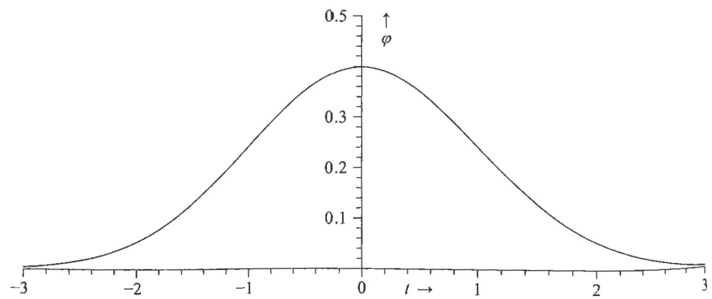

并从中做出类似的陈述:"  $90\%$  的后验概率集中在区间  $\alpha < n_{1}< \beta$  中。"但是,就目前的目的,我们将满意地给出我们发现的各种分布的标准差[即(6.93)定义的方差的平方根]。然后,由切比雪夫不等式可以知道,如果  $\sigma$  是  $n_{1}$  上任意概率分布的标准差,则集中在区间  $\langle n_{1}\rangle \pm t\sigma$  之间的概率  $P$  满足不等式

$$
P \geqslant 1 - \frac{1}{t^{2}}. \tag{6.139}
$$

当  $t \leqslant 1$  时,这什么都告诉不了我们,但是,当  $t > 1$  时,它告诉我们的越来越多。例如,在任何具有有限  $\langle n\rangle$  和  $\langle n^{2}\rangle$  的概率分布中,至少  $3 / 4$  的概率包含在区间  $\langle n\rangle \pm 2\sigma$  中,至少  $8 / 9$  的概率包含在区间  $\langle n\rangle \pm 3\sigma$  中。

# 6.18 方差的计算

我们在上面发现的所有分布的方差  $\sigma^{2}$  都很容易计算。实际上,通过一般公式(6.108)可以轻松地计算这些分布的任何矩。对于A先生和B先生,以及杰弗里斯先验概率分布,我们可以求出方差

$$
\begin{array}{c}{{\mathrm{var}(n_{1}|\phi c_{1}I_{\mathrm{A}})=\frac{(c_{1}+1)(1-\phi)}{\phi^{2}},}}\\ {{\mathrm{var}(n_{1}|\phi c_{2}c_{1}I_{\mathrm{B}})=\frac{(c_{1}+c_{2}+1)(1-\phi^{2})}{4\phi^{2}},}}\\ {{\mathrm{var}(n_{1}|\phi c_{1}I_{J})=\frac{c_{1}(1-\phi)}{\phi^{2}}.}}\end{array} \tag{6.141}
$$

根据对称性可以求出  $n_{2}$  的方差。

这是一个相当长的讨论,因此,我们在表6- 1中总结到目前为止的所有结论。对于问题1(  $c_{1} = 10$  )和问题2(  $c_{1} = 10$  ,  $c_{2} = 16$  ),我们给出A先生和B先生发现的粒子数的最概然值及(均值)  $\pm$  (标准差)估计值。从表6- 1中可以看出,B先生的额外信息不仅使他的估计与A先生的估计相比发生了很大的变化,而且还使他能够明显减少估计的可能误差。即使与频率无关的纯定性先验信息也可以极大地改变我们从给定数据集中得出的结论。现在,在科学推断的几乎每个实际问题中,我们都确实拥有或多或少类似的定性先验信息。因此,任何不考虑先验信息的推断方法都可能误导我们,带来潜在的危险。它虽然可能在一个问题上产生合理的结果,但这并不能保证它在下一个问题中取得成功。

表6-1 先验信息对  $n_{1}$  和  $n_{2}$  估计的影响  

<table><tr><td rowspan="2" colspan="2"></td><td>问题1</td><td colspan="2">问题2</td></tr><tr><td>n1</td><td>n1</td><td>n2</td></tr><tr><td rowspan="2">A先生</td><td>最概然值</td><td>100</td><td>100</td><td>160</td></tr><tr><td>均值±标准差</td><td>109±31</td><td>109±31</td><td>169±39</td></tr><tr><td rowspan="2">B先生</td><td>最概然值</td><td>100</td><td>127</td><td>133</td></tr><tr><td>均值±标准差</td><td>109±31</td><td>131.5±25.9</td><td>137.5±25.9</td></tr><tr><td rowspan="2">杰弗里斯</td><td>最概然值</td><td>91</td><td>121.5</td><td>127.5</td></tr><tr><td>均值±标准差</td><td>109±30</td><td>127±25.4</td><td>133±25.4</td></tr></table>

还有一个有趣的问题是:如果B先生只知道  $c_{2}$ ,他对  $n_{1}$  的估计会有多好?他必须使用分布(6.135)表示沿图6- 2的路径  $c_{2} \rightarrow n_{2} \rightarrow s \rightarrow n_{1}$  进行推理.根据(6.135),我们得到最概然值和(均值)  $\pm$  (标准差)估计为

$$
\hat{n}_{1} = \frac{c_{2}}{\phi} = 160, \tag{6.143}
$$

均值  $\pm$  标准差  $= \frac{c_{2} + 1}{\phi} \pm \frac{\sqrt{(c_{2} + 1)(\phi + 1)}}{\phi} = 170 \pm 43.3.$  (6.144)

在这种情况下,即使计数  $c_{1} = c_{2}$  相同,他也会得到比A先生稍差的估计(即更大的误差),因为直接路径的方差(6.140)包含因子  $(1 - \phi)$ ,如果我们必须通过间接路径推理,则将其替换为  $(1 + \phi)$ 。因此,如果计数器效率低,那么,对于相等的计数率,两条路径将提供几乎相同的可靠性。但是,如果它具有  $\phi \simeq 1$  的高效率,则直接路径  $c_{1} \rightarrow n_{1}$  会更加可靠。常识告诉我们应该是这样的。

# 6.19 泛化与渐近形式

上面推测,获取更多数据  $\{c_{3}, c_{4} \dots , c_{m}\}$  可能会帮助B先生对  $n_{1}$  做出更好的估计。让我们进一步研究这一点。当  $s = 130$  时,准确知道源强度的分布(6.89)的标准差仅为  $\sqrt{s(1 - \phi)} = 10.8$ 。从表6- 1可以看出,B先生对  $n_{1}$  的估计值的标准差现在约为该值的2.5倍。如果给他越来越多其他时间的数据,从而使他的估计接近130,将会发生什么?要回答这个问题,首先注意,如果  $1 \leqslant k \leqslant m$ ,我们有

$$
\begin{array}{l}{{p(n_{k}|\phi c_{1}\cdot\cdot\cdot c_{m}I_{\mathrm{B}})=\int_{0}^{+\infty}\mathrm{d}s p(n_{k}s|\phi c_{1}\cdot\cdot\cdot c_{m}I_{\mathrm{B}})}}\\ {{\mathrm{~}=\int_{0}^{+\infty}\mathrm{d}s p(n_{k}|\phi s c_{k}I_{\mathrm{B}})p(s|\phi c_{1}\cdot\cdot\cdot c_{m}I_{\mathrm{B}}),}}\end{array} \tag{6.145}
$$

其中,我们已经使得  $p(n_{k}|\phi s c_{1}\dots c_{m}I_{\mathrm{B}}) = p(n_{k}|\phi s c_{k}I_{\mathrm{B}})$  .这是因为,根据图6- 2,如果  $s$  已知,则所有  $i\neq k$  的  $c_{i}$  与对于  $n_{k}$  的推断无关.我们可以通过贝叶斯定

理计算 (6.145) 中被积分的第二个因子:

$$
\begin{array}{r l} & {p(s|\phi c_{1}\cdot \cdot \cdot c_{m}I_{\mathrm{B}}) = p(s|\phi I_{\mathrm{B}})\frac{p(c_{1}\cdot\cdot\cdot c_{m}|\phi s I_{\mathrm{B}})}{p(c_{1}\cdot\cdot\cdot c_{m}|\phi I_{\mathrm{B}})}}\\ & {\qquad = (\frac{\mathrm{H}}{\mathrm{H}}\ast \ast \ast \ast \ast \ast \ast \ast \ast \ast \ast \ast \ast \ast \ast \ast \ast \ast \ast \ast \ast \ast \ast \ast \ast \ast \ast \ast \ast \ast \ast \ast \ast \ast \ast \ast \ast \ast \ast \ast \ast \ast \ast \ast \ast \ast \ast \ast \ast \ast \ast} \end{array} \tag{6.146}
$$

应用 (6.86) 并进行归一化, 这简化为

$$
p(s|\phi c_{1}\cdot \cdot \cdot c_{m}I_{\mathrm{B}}) = \frac{(m\phi)^{c + 1}}{c!} s^{c}\mathrm{e}^{-m s\phi}, \tag{6.147}
$$

其中  $c\equiv c_{1}\dots +c_{m}$  是  $m$  秒计数的总数.分布(6.147)的众数、均值和方差分别为

$$
\hat{s} = \frac{c}{m\phi}, \qquad \langle s \rangle = \frac{c + 1}{m\phi}, \qquad \operatorname {var}(s) = \langle s^{2} \rangle - \langle s \rangle^{2} = \frac{c + 1}{m^{2}\phi^{2}} = \frac{\langle s \rangle}{m\phi}. \tag{6.148}
$$

因此, 正如我们预期的那样, 当  $m \rightarrow +\infty$  时, 分布  $p(s|c_{1}\dots c_{m})$  变得越来越尖锐,  $s$  的最概然值和均值估计越来越接近, 似乎在极限时我们只有一个德尔塔函数:

$$
p(s|\phi c_{1}\dots c_{m}I_{\mathrm{B}}) \rightarrow \delta (s - s^{\prime}), \tag{6.149}
$$

其中

$$
s^{\prime} \equiv \lim_{m \rightarrow +\infty} \frac{c_{1} + c_{2} + \cdots + c_{m}}{m\phi}. \tag{6.150}
$$

但是, 极限形式 (6.149) 似乎有些突然, 就像詹姆斯·伯努利的第一极限定理一样. 我们可能想更详细地了解极限是如何被逼近的, 类似于二项式的棣莫弗- 拉普拉斯极限定理 (5.10) 或贝塔分布的极限 (4.72).

例如, 将 (6.147) 的对数在其峰值  $\hat{s} = c / m\phi$  处展开, 仅保留二次项, 我们得到一个高斯分布的渐近公式:

$$
p(s|\phi c_{1}\dots c_{m}I_{\mathrm{B}}) \rightarrow A\exp \left\{-\frac{c(s - \hat{s})^{2}}{2\hat{s}^{2}}\right\} . \tag{6.151}
$$

在所有  $s$  的左右侧之间差异很小的意义上, 这实际上对所有  $s$  都是成立的 (尽管它们的比率并不是对于所有  $s$  都接近 1). 这导出当  $c \rightarrow +\infty$  时的估计

$$
(s)_{\mathrm{est}} = \hat{s}\left(1 \pm \frac{1}{\sqrt{c}}\right). \tag{6.152}
$$

通常, 后验分布随着数据的增加而变为高斯形式. 这是因为, 具有单个最大值的任何平滑函数, 当幂次数越来越高时, 都会变为高斯函数. 在下一章中我们将深入探讨高斯分布的基础.

因此, 在极限情况下, B 先生确实接近源强度的确切知识. 回到 (6.145), 根据 (6.89) 和 (6.147), 可以知道被积数中的两个因子, 因此

$$
p(n_{k}|\phi c_{1}\cdot \cdot \cdot c_{m}I_{\mathrm{B}}) = \int_{0}^{+\infty}\mathrm{d}s\frac{\mathrm{e}^{-s(1 - \phi)}[g(1 - \phi)]^{n_{k} - c_{k}}}{(n_{k} - c_{k})!}\frac{(m\phi)^{c + 1}}{c!} s^{c}\mathrm{e}^{-m s\phi},
$$

或者

$$
p(n_{k}|c_{1}\cdot \cdot \cdot c_{m}I_{\mathrm{B}}) = \frac{(n_{k} - c_{k} + c)!}{(n_{k} - c_{k})!c!}\frac{(m\phi)^{c + 1}(1 - \phi)^{n_{k} - c_{k}}}{(1 + m\phi - \phi)^{n_{k} - c_{k} + c + 1}}, \tag{6.154}
$$

这正是我们承诺推广的(6.135)的一般形式.在取极限  $m\rightarrow +\infty$  ,  $c\rightarrow +\infty$ $(c / m\phi)\rightarrow s^{\prime} =$  非数的情况下,这变成泊松分布

$$
p(n_{k}|c_{1}\cdot \cdot \cdot c_{m}I_{\mathrm{B}})\rightarrow \frac{\exp\{-s^{\prime}(1 - \phi)\}}{(n_{k} - c_{k})!} [s^{\prime}(1 - \phi)]^{n_{k} - c_{k}}, \tag{6.155}
$$

与(6.89)相同.因此,我们确认,如果有足够的附加数据,那么B先生估计的标准差可以从26降到10.8,而A先生估计的标准差仍是31. 对于有限的  $m$  ,(6.154)中  $n_{k}$  的均值估计为

$$
\langle n_{k}\rangle = c_{k} + \langle s\rangle (1 - \phi), \tag{6.156}
$$

其中  $\langle s\rangle = (c + 1) / m\phi$  是根据(6.148)估计的  $s$  的均值.(6.156)可以与(6.90)比较.同样,根据(6.154),  $n_{k}$  的最概然值是

$$
\hat{n}_{k} = c_{k} + \hat{s} (1 - \phi), \tag{6.157}
$$

其中  $\hat{s}$  由(6.148)给出

请注意,B先生对问题2的修正估计仍在A先生给出的估计的合理误差范围内.如果不是这样,那将非常令人不安,因为那意味着,概率论使得A先生对其估计的可靠性过于乐观.然而,没有定理可以保证这一点.例如,如果计数率跃升到  $c_{2} = 80$  ,那么B先生对  $n_{1}$  的修正估计值将远远超出A先生估计的合理误差范围.但是,在这种情况下,B先生的常识将使他怀疑其先验信息  $I_{\mathrm{B}}$  的可靠性.我们在第4章看到过一个类似的例子,其中的一个备择假设在  $- 100\mathrm{dB}$  以下(除非需要这些假设,我们甚至不必花费力气写出来),它被意想不到的新证据"复活"了.

练习6.7以上结果是针对粒子计数器场景得到的.请在疾病场景中总结最终结论,作为对医学研究人员的建议,以便仅根据所提供的相关死亡人数,判断公共卫生措施是否减少了普通人群中的患病人数.当然,这应该包括一些判断模型在什么条件下与现实世界吻合的东西.如果没有这种东西,该怎么办?

现在,我们转向另一种问题,看看使用连续分布(孤立的不连续点除外)时可能会出现的一些新特征.

# 6.20 矩形抽样分布

几十年来,"出租车问题"一直在概率统计领域被广泛讨论,但是正统统计学无法处理此问题,我们也没有看到有正统文献提及此问题.假设你在夜晚乘坐火车,一觉醒来,发现火车停在某个未知城镇,你所看到的只是一辆出租车,上面写着27号.那么,你对此城镇中的出租车数  $N$  的估计是多少?这个问题的答案可以为城镇的大小提供线索.几乎每个人都会凭直觉回答  $N_{\mathrm{est}} = 2\times 27 = 54$  似乎是合理估计,但很少有人能够提供令人信服的理由.在我们脑海中会形成一个显而易见的"模型":有  $N$  辆出租车,分别编号为  $(1,\dots ,N)$  ,给定  $N$  ,我们看到的那辆可能是其中的任何一辆.给定该模型,我们可以推断出  $N\geqslant 27$  ,在这之后的推理则取决于我们所接受的统计教育.

这里,我们将研究该问题的连续版本,其中可能涉及多辆出租车.留给读者作为练习的是,写出上述"出租车问题"离散版本的答案,然后阐明连续问题和离散问题之间的关系.我们考虑  $[0,\alpha ]$  中的矩形抽样分布,其中分布的宽度  $\alpha$  是要估计的参数.最后,建议做进一步的练习,以扩展我们从中学到的知识.

我们有一个具有  $n$  个观测值的数据集  $D\equiv \{x_{1},\dots ,x_{n}\}$  ,这些观测值被认为是从以下分布得出的,也就是说,每个数据  $x_{i}$  被独立地分配以下PDF

$$
p(x_{i}|\alpha I)={\left\{\begin{array}{l l}{\alpha^{-1},}&{{\mathrm{~}}{\mathrm{~}}{\mathrm{~}}{\mathrm{~}}{\mathrm{~}}{\mathrm{~}}{\mathrm{~}}{\mathrm{~}}{\mathrm{~}}{\mathrm{~}}{\mathrm{~}}{\mathrm{~}}{\mathrm{~}}{\mathrm{~}}{\mathrm{~}}{\mathrm{~}}{\mathrm{~}}{\mathrm{~}}{\mathrm{~}}{\mathrm{~}}{\mathrm{~}}\alpha{\mathrm{~}}{\mathrm{~}}{\mathrm{~}}{\mathrm{~}}{\mathrm{~}}{\mathrm{~}}{\mathrm{~}}{\mathrm{~}}{\mathrm{~}}{\mathrm{~}}{\mathrm{~}}{\mathrm{~}}{\mathrm{~}}{\mathrm{~}}{\mathrm{~}}{\mathrm{~}}{\mathrm{~}}{\mathrm{~}}{\mathrm{~}}{\mathrm{~}}}\\ {0,}&{{\mathrm{~}}{\mathrm{~}}{\mathrm{~}}{\mathrm{~}}{\mathrm{~}}{\mathrm{~}}{\mathrm{~}}{\mathrm{~}}{\mathrm{~}}{\mathrm{~}}{\mathrm{~}}{\mathrm{~}}{\mathrm{~}}{\mathrm{~}}{\mathrm{~}}{\mathrm{~}}{\mathrm{~}}{\mathrm{~}}{\mathrm{~}}{\mathrm~}}\end{array}\right.} \tag{6.158}
$$

那么,全抽样分布是

$$
p(D|\alpha I) = \prod_{i}p(x_{i}|\alpha I) = \alpha^{-n},\quad 0\leqslant \{x_{1},\dots ,x_{n}\} \leqslant \alpha , \tag{6.159}
$$

为简洁起见,在本节的其余部分,我们假设,当公式之后的不等式条件未全部满足时,左侧为0. 乍一看,这种情况微不足道,不值得分析.然而,如果事先不能准确看到解的每一个细节如何运作,那么,研究它们总会让我们学到一些东西.在概率论中,看起来很小的问题揭示了深刻而出人意料的道理.

根据贝叶斯定理,  $\alpha$  的后验PDF是

$$
p(\alpha |D I) = p(\alpha |I)\frac{p(D|\alpha I)}{p(D|I)}, \tag{6.160}
$$

其中  $p(\alpha |I)$  是先验PDF.很明显,无论数据如何,只要这些数据本身不与其他任何信息矛盾,具有正常(可归一化的)先验和有限似然函数的贝叶斯问题,都必然导致正常、行为良好的后验分布.如果观察到某个数据是负的,如  $x_{i}< 0$  ,我们根据演绎推理就知道模型(6.159)肯定是错误的(更好的说法是,数据与导致我们选择该模型的先验信息  $I$  矛盾).然后,机器人崩溃了,(6.159)和(6.160)

都不可用. 但是, 根据模型, 满足 (6.159) 中不等式的任何数据集都是可能的. 那么, 是否一定会产生合理的后验 PDF 呢?

不一定! 数据可能虽然与模型兼容, 但仍与其他先验信息不兼容. 考虑正常的矩形先验

$$
p(\alpha |I) = (\alpha_{1} - \alpha_{00})^{-1}, \qquad \alpha_{00} \leqslant \alpha \leqslant \alpha_{1}, \tag{6.161}
$$

其中  $\alpha_{00}$  和  $\alpha_{1}$  是满足  $0 \leqslant \alpha_{00} \leqslant \alpha_{1} < +\infty$  的固定数, 在问题的陈述中给定. 如果发现任何数据超出上界:  $x_{i} > \alpha_{1}$ , 则数据和先验信息在逻辑上又将产生矛盾.

但这正是我们在第 1 章和第 2 章中所预期的. 我们正在尝试根据两种信息  $D$  和  $I$  推理, 而每种信息实际上可能是许多不同命题的逻辑合取. 如果在任何地方隐藏着矛盾, 就不可能有答案 (在集合论的背景下, 我们规定的可能集合是空集), 机器人会以这样或那样的方式崩溃. 因此, 在下文中, 我们假设数据与所有先验信息一致, 包括导致我们选择此模型的先验信息. 那么根据以上规则应该可以得到我们所定义问题的正确且精确的答案.

(6.160) 的分母是

$$
p(D|I) = \int_{R} \mathrm{d} \alpha (\alpha_{1} - \alpha_{00})^{-1} \alpha^{-n}, \tag{6.162}
$$

积分区域  $R$  必须满足两个条件:

$$
R \equiv \left\{ \begin{array}{l} \alpha_{00} \leqslant \alpha \leqslant \alpha_{1} \\ x_{\max} \leqslant \alpha \leqslant \alpha_{1} \end{array} \right\} , \tag{6.163}
$$

其中  $x_{\max} \equiv \max \{x_{1}, \dots , x_{n}\}$  是观察到的最大值. 如果  $x_{\max} \leqslant \alpha_{00}$ , 则在 (6.163) 中仅需要第一个条件, 数据  $x_{i}$  的具体数值完全不相关 (尽管观测值  $n$  仍然相关). 如果  $\alpha_{00} \leqslant x_{\max}$ , 那么我们只需要后一个不等式, 先验的下界  $\alpha_{00}$  已被数据取代, 从此与该问题无关.

将 (6.159) (6.161) (6.162) 代入 (6.160), 消去因子  $(\alpha_{1} - \alpha_{00})$ . 如果  $n > 1$ , 我们的一般解简化为

$$
p(\alpha |DI) = \frac{(n - 1) \alpha^{-n}}{\alpha_{0}^{1 - n} - \alpha_{1}^{1 - n}}, \qquad \alpha_{0} \leqslant \alpha \leqslant \alpha_{1}, \qquad n > 1, \tag{6.164}
$$

其中  $\alpha_{0} \equiv \max (\alpha_{00}, x_{\max})$ .

# 6.21 小样本

一般的推导通常会忽略  $n$  为较小值的情况.正如我们将在第17章中看到的那样,在正统统计中,它们可能导致奇怪的病态结果(就像在参数空间之外的参数估计量一样,根据演绎推理是不可能知道它们的).在数学的其他领域中,当出现这样的矛盾时,人们就会立即得出结论:一定在哪里犯了一个错误.但奇怪的是,在正统统计文献中,这种病态从来没有被解释为揭示了正统统计推理中的错误.相反,人们只是简单地忽略它们,宣称只关心大的  $n$  值.但事实证明,小的 $n$  值对我们来说非常有意义,因为贝叶斯分析没有病态的例外情况.只要我们避免在问题陈述中出现逻辑矛盾,并使用正常先验,解就不会崩溃,始终保持有意义.

看看贝叶斯分析是如何始终保证这一点的.这非常有启发性,也使我们意识到实际计算中的一个微妙之处.在当前情况下,如果  $n = 1$  ,则(6.164)显得不确定,变成  $(0 / 0)$  .但是,如果我们从  $n = 1$  的情形开始推导,则会发现  $\alpha$  的正确归一化后验PDF不是(6.164),而是

$$
p(\alpha |D I) = \frac{\alpha^{-1}}{\ln(\alpha_{1} / \alpha_{0})},\qquad \alpha_{0}\leqslant \alpha \leqslant \alpha_{1},\qquad n = 1. \tag{6.165}
$$

$n = 0$  的情况几乎没有用处.尽管如此,贝叶斯定理仍然给出了正确答案.因为 $D =$  "根本没有数据",并且  $p(D|\alpha I) = p(D|I) = 1$  ,也就是说,如果不接收数据,则无论  $\alpha$  的值如何,都将没有数据.根据常识,后验分布(6.160)会简化为先验分布

$$
p(\alpha |D I) = p(\alpha |I),\qquad \alpha_{0}\leqslant \alpha \leqslant \alpha_{1},\qquad n = 0. \tag{6.166}
$$

# 6.22 数学技巧

现在我们看到了一个微妙之处:最后两个结果已经包含在(6.164)中,而无须从头开始重复推导.我们需要了解现实世界问题与抽象数学之间的区别.尽管在实际问题中,从定义上来说  $n$  是非负整数,但当  $n$  为任何复数时,数学表达式(6.164)都是定义良好且有意义的.此外,只要  $\alpha_{1}< +\infty$  ,它就是  $n$  的整函数(也就是说,除无限远点外,各处都有界且可解析).现在,在纯数学推导中,我们可以自由使用函数的任何解析性质,无论它们在实际问题中是否有意义.由于(6.164)在任何有限点上都没有奇点,我们可以通过取极限  $n\rightarrow 1$  来计算  $n = 1$  时的值.我们有

$$
\begin{array}{r l r}{{\frac{n-1}{\alpha_{0}^{1-n}-\alpha_{1}^{1-n}}=\frac{n-1}{\exp\{-(n-1)\ln\alpha_{0}\}-\exp\{-(n-1)\ln\alpha_{1}\}}}}\\ &{}&{=\frac{n-1}{[1-(n-1)\ln\alpha_{0}+\cdots]-[1-(n-1)\ln\alpha_{1}+\cdots]}}\\ &{}&{\rightarrow\frac{1}{\ln(\alpha_{1}/\alpha_{0})},}\end{array} \tag{6.167}
$$

这就得到了(6.165).同样,将  $n = 0$  代人(6.164),则简化为(6.166),因为现在我们有  $\alpha_{0} = \alpha_{00}$  ,即使在极端、退化的情形中,贝叶斯分析也将继续得到正确的结果.很明显,所有后验分布的矩和百分位数也是  $n$  的函数,因此对于所有  $n$  值,它们都可以被一劳永逸地计算出来,只要将一般表达式简化为(0/0)或  $(\infty /\infty)$  即可,这能始终与我们从头开始根据某个具体  $n$  值推导得到相同的结果.

如果  $\alpha_{1}< +\infty$  ,则后验分布被限制在一个有限区间内,因此它具有所有阶矩.事实上,

$$
\langle \alpha^{m}\rangle = \frac{n - 1}{\alpha_{0}^{1 - n} - \alpha_{1}^{1 - n}}\int_{\alpha_{0}}^{\alpha_{1}}\mathrm{d}\alpha \alpha^{m - n} = \frac{n - 1}{n - m - 1}\frac{\alpha_{0}^{1 + m - n} - \alpha_{1}^{1 + m - n}}{\alpha_{0}^{1 - n} - \alpha_{1}^{1 - n}}. \tag{6.168}
$$

当  $n\to 1$  或  $m\to n - 1$  时,我们将以(6.167)的方式取该表达式的极限,得到更明确的形式:

$$
\langle \alpha^{m}\rangle = \left\{ \begin{array}{l l}{\frac{\alpha_{1}^{m} - \alpha_{0}^{m}}{m\ln(\alpha_{1} / \alpha_{0})},} & {\mathrm{~}\mathcal{H}\mathbb{H}\mathbb{H} n = 1,}\\ {\frac{(n - 1)\ln(\alpha_{1} / \alpha_{0})}{\alpha_{0}^{1 - n} - \alpha_{1}^{1 - n}},} & {\mathrm{~}\mathcal{H}\mathbb{H}\mathbb{H} m = n - 1.} \end{array} \right. \tag{6.169}
$$

在以上结果中,后验分布被限制在有限区域  $(\alpha_{0}\leqslant \alpha \leqslant \alpha_{1})$  中,并且不会有奇异结果.

练习6.8完成此示例,找到  $\alpha$  的估计值及其精确度的显式表达式,讨论这些结果是否符合常识.

最后,作为练习,请读者考虑当  $\alpha_{1}\to +\infty$  时会发生什么,此时我们扩展到了无限区域.

练习6.9当  $\alpha_{1}\to +\infty$  时,某些矩必定不存在,因此某些推断将是不可能的,但其他的仍然可能.检查以上公式,找出在何种条件下后验(均值)  $\pm$  (标准差)或(中值)  $\pm$  (四分位数间距)仍然可能,尤其要考虑  $n$  值较小时的情况.说明结果如何与常识对应.

# 6.23 评注

进行此处的轻松计算[尤其是(6.129)和(6.152)]在不允许使用先验和后验概率的概率论中是无法做到的,因此这种概率论也不允许我们通过积分消去相对于先验的冗余参数.在我们看来,B先生的结果超出了正统方法的范围.但是,在每个阶段,作为逻辑的概率论都遵循由概率论的基本乘法规则和加法规则唯一确定的计算流程,并且产生了行为良好、合理和有用的结果.在某些情况下,即使只是定性信息,先验信息也绝对是必不可少的,稍后,我们将看到更加惊人的例子.

不要认为需要使用先验信息的认识是一个新发现.贝特朗(Bertrand,1889)就着重强调过这一点.他列举了几个例子,我们引用最后一个例子(他用以下短段落写成).

圣马洛(英吉利海峡岸边的一个法国小镇)的居民对此深信不疑:一个世纪以来,在他们的村庄里,涨潮时的死亡人数多于退潮时的死亡人数.我们承认这一事实

在英吉利海峡的海岸上,刮西北风时的沉船数量比刮其他方向的风时都多.假设这两件事的实例数量相同且报告的可靠性相同,人们仍然不会得出相同的结论.

虽然我们肯定能接受风向对沉船的影响,但常识需要更多的证据才会认为潮汐影响圣马洛人的生存是合情的.

这次的两个问题又是等同的,不能接受相同的结论表明有必要考虑该原因的先验概率.

显然,贝特朗不能算是倡导费希尔格言"让数据自己说话"的人,这句格言在那个世纪的统计学中一直占据主导地位.数据不会自己说话,在任何真正的推断问题中,它们都不会.

例如,费希尔提倡使用最大似然法估计参数,从某种意义上讲,这是仅由数据最强烈地指示的值.然而这只注意到了概率论(以及常识)需要考虑的因素之一.因为,如果我们不使用先验信息作为补充以考虑哪些假设是合理的,那么最

大似然法将始终导致我们无条件地偏向完全“确定”的假设  $H_{S}$ ，根据该假设，每条数据都是不可避免的，没有其他事情可能发生。因为数据在  $H_{S}$  上的概率比任何其他假设高得多[即  $p(D|H_{S}) = 1$  ]， $H_{S}$  始终是所有假设中的最大似然解。只有认为  $H_{S}$  的先验概率极低，才可以合理地拒绝此假设。①

正统统计实践部分通过指定模型来处理这一问题，该模型当然是一种融入有关观察到的现象的一些先验信息的手段。但这还不完整，只是定义了我们将在其中寻求最大值的参数空间。如果没有该参数空间上的先验概率，我们就无法融入有关该参数可能值的先验信息——我们几乎总是拥有该信息，并且对于任何合理推断，这些信息通常是非常有力的。例如，尽管参数空间在理论上可以扩展到无限大，但是在几乎每个实际问题中我们都事先知道，参数不太可能超出某个有限值。该信息可能至关重要，也可能不重要，这取决于我们碰巧获得的数据集。

正如我从学生时代就可以证明的那样，费希尔的忠实信徒经常将“让数据自己说话”解释为：一个人让自己受先验信息的影响，就是违反了“科学客观性”，因此应受到谴责。贝特朗通过若干年的经验才意识到，这在实际问题中是个多么有灾难性的错误。费希尔之所以无须提及先验信息，仅仅是因为，在他选择解决的问题中，没有非常重要的先验信息，只有大量数据。如果他致力于处理具有重要先验信息且只有很少数据的问题，我们认为他的观念可能会很快改变。

只要依靠自己的常识而不是正统统计的教义，各个领域的科学家都能很容易地看到这一点。例如，斯蒂芬·古尔德（S.J.Gould，1989）描述了生活在早寒武纪的各种令人迷惑的软体动物，它们完美地保存在加拿大落基山脉著名的伯吉斯页岩中。两位古生物学家检查了名为埃谢栉虫（Aysheaia）的同一种化石，就其正确分类得出了相反的结论。遵循费希尔格言的人将不得不质疑其中一位古生物学家的能力。但古尔德没有犯此错误。在前述著作的第172页，他总结道：“我们在这里进行了一次有良好控制的心理实验。数据没有改变，观点的不同只能源于有关伯吉斯生物最可能状态的先验假设。”

如果我们试图推断是哪种机制在起作用，先验信息也是至关重要的。费希尔可能会像其他科学家一样，坚决主张因果关系需要一种物理机制来实现。但是，就像在圣马洛问题中一样，单独的数据并没有自己说话。只有先验信息可以告诉我

们, 某个假设是否为观察到的事实提供了可能的机制, 并与已知的物理学定律一致. 如果不是这样, 即使数据有很大的似然, 也不能让我们相信它. 我们能幻想出成群看不见的小精灵, 它们辛勤生成的数据可以产生很大的似然, 但是对于科学家来说, 这仍然毫不可信.

不只是正统统计学家在 20 世纪贬低过先验信息的价值. 奇幻作家霍华德·洛夫克拉夫特曾经将"常识"定义为"仅仅是缺乏想象力和思维灵活性的愚蠢表现"。事实上, 正是对关于世界的先验信息的积累, 才能让成熟的人拒绝随意幻想 (尽管我们可能会乐于阅读奇幻作品) 而获得心理稳定性.

今天, 我们的信息是否能提供存在因果关系的可信证据是一个重要的问题, 在法庭和立法机关中引起了有关政治、商业、医疗和环境话题的激烈争论. 然而, 有说服力的先验信息 (没有此信息, 事情将无法得到判断) 在接受正统统计训练的"专家证人"的证词中几乎没有作用, 因为它在他们的标准程序中没有用武之地. 我们注意到, 在费希尔出生的前一年, 贝特朗就对此有了清晰而正确的见解. 科学推断的发展并非总是向前进步的.

因此, 本章以回顾费希尔作为开始和结束, 读者可以在第 16 章中找到更多关于费希尔的内容.

# 第7章 中心分布、高斯分布或正态分布

我自己的印象……是数学结果已经超越了人对它们的诠释，对这个著名积分的力量与意义的简单解释……终有一天会被发现……这将立刻使得迄今为止编写的所有著作变得毫无用处。

——奥古斯塔斯·德摩根（Augustus de Morgan，1838）

这里，德摩根对基于高斯或正态“误差定律”（抽样分布）的推断方法“奇怪地无处不在”的成功表示了困惑，这一定律即使在描述误差的实际频率分布完全不合情的情况下也可以成功使用。但是，解释并没有像他预期得那么快到来。

20世纪50年代中期，我听了威廉·费勒教授的一次餐后演讲，他在讲话中强烈谴责使用高斯概率分布描述误差的做法，理由是实际误差的频率分布几乎从来都不是高斯分布。尽管费勒不赞成，但我们还是继续使用高斯概率分布，而且它们在参数估计方面的普遍成功仍在继续。因此，在德摩根发表此讲话的145年后，情况依然没有改变，乔治·巴纳德（GeorgeBarnard，1983）也表示了同样的惊讶：“为什么我们这么长时间都用正态假设来解决问题？”

今天，我们相信，我们终于可以解释为什么(1)高斯误差定律会得到不可避免的普遍使用，以及(2)高斯误差定律能取得普遍成功．一旦明白，解释确实显而易见.然而，就我们所知，由于从频率角度考虑概率分布的普遍倾向，先前没有任何概率论文献认识这一点，在学会根据可证实的信息而不是想象的（我们将会看到，也是不相关的）频率来思考概率分布之前，我们无法理解正在发生的事情.

对这些特性的一种简单解释（去掉了过去的无关部分）直到最近才被发现，这一进展改变了本书的写作计划．我们认为这种解释非常重要，应该在这里尽早介绍，尽管我们必须引用后面章节中的一些结论．在本章中，我们将回顾高斯分布的历史，初步理解它们在推断中的作用．这种理解将指导我们直接使用对概率论中绝大多数应用有效的计算流程，避免犯常见的错误或进入死胡同.

# 7.1 吸引现象

在前面的章节中，我们多次注意到一个有趣的现象．在概率论中，似乎有一个中心的、普遍的分布

$$
\phi (x) \equiv \frac{1}{\sqrt{2\pi}} \exp \left\{-\frac{x^{2}}{2}\right\} , \tag{7.1}
$$

在各种各样的操作下,所有其他分布都趋于此,而且一旦达到该分布,又会在各种更多的操作下保持不变。著名的"中心极限定理"涉及其中的一种特殊情况。在第4章中,我们注意到当试验次数变多时,二项分布或贝塔分布渐近地趋于高斯分布。在第6章中,我们注意到了一个几乎通用的性质,即当数据量增大时,参数的后验分布变为高斯分布。

在物理学中,这种吸引和稳定的性质使得该分布成为动力学理论和统计力学的统一基础。在生物学中,它是讨论生态和进化中种群动态的自然工具。毫无疑问,它也将成为经济学的基础,因为它已经在经济学中得到了广泛使用,但有些遗憾的是,人们好像对其合理性还有疑问。我们希望证明它的有效应用范围比人们通常认为的要广泛得多,以促进这一发展。

图7- 1展示了这种分布。它的一般形状想必已经为读者所熟知,尽管与它相关的数值可能并非如此。累积高斯分布定义为

$$
\begin{array}{l}{\Phi (x)\equiv \int_{-\infty}^{x}\mathrm{d}t\phi (t)}\\ {= \int_{-\infty}^{0}\mathrm{d}t\phi (t) + \int_{0}^{x}\mathrm{d}t\phi (t)}\\ {= \frac{1}{2} [1 + \mathrm{erf}(x)],} \end{array} \tag{7.2}
$$

它将在本章后面用于解决一些问题。使用误差函数  $\operatorname {erf}(x)$  可轻松计算该函数的数值。

  
图7-1中心分布、高斯分布或正态分布:  $\phi (t) = 1 / \sqrt{2\pi} \exp \{-t^{2} / 2\}$

出于一些历史原因(后面将会讨论),该分布被称为高斯分布或正态分布。这两个名称在今天看来都是不恰当的,并且具有误导性。如果简单地称之为"概率论的中心分布",将传达其所有的正确含义。我们首先考虑在历史与概念上都很重要的该分布的三种推导过程,这会使我们认识到高斯分布的三个重要性质。

# 7.2 赫歇尔-麦克斯韦推导

高斯分布的最有趣的推导之一是由天文学家约翰·赫歇尔(John Herschel, 1850)从假设的简单性角度出发给出的。他研究了测量恒星位置时出现误差的二维概率分布。设  $x$  为经度(东西)方向上的误差,  $y$  为偏角(南北)方向上的误差,求联合概率分布  $\rho (x,y)$ 。赫歇尔提出,根据几何上的同质性条件,似乎直觉地需要两个假设  $(P1, P2)$ 。

$(P1)$  关于  $x$  的信息不会告诉我们关于  $y$  的任何信息。

也就是说,正交方向上的误差概率是独立的,所以未确定的分布应具有如下函数形式:

$$
\rho (x,y)\mathrm{d}x\mathrm{d}y = f(x)\mathrm{d}x\times f(y)\mathrm{d}y. \tag{7.3}
$$

也可以在由  $x = r\cos \theta$  和  $y = r\sin \theta$  定义的极坐标  $(r,\theta)$  中写出同一个分布

$$
\rho (x,y)\mathrm{d}x\mathrm{d}y = g(r,\theta)r\mathrm{d}r\mathrm{d}\theta . \tag{7.4}
$$

$(P2)$  此概率与角度无关:  $g(r,\theta) = g(r)$ 。

这样,根据(7.3)和(7.4)可以得出函数方程

$$
f(x)f(y) = g(\sqrt{x^{2} + y^{2}}), \tag{7.5}
$$

令  $y = 0$ ,这简化为  $g(x) = f(x)f(0)$ ,因此(7.5)变成函数方程

$$
\ln {\frac{f(x)}{f(0)}} + \ln {\frac{f(y)}{f(0)}} = \ln {\frac{f(\sqrt{x^{2} + y^{2}})}{f(0)}}. \tag{7.6}
$$

该方程的一般解是显而易见的:  $x$  的函数加上  $y$  的函数是  $x^{2} + y^{2}$  的函数。唯一的可能是  $\ln [f(x) / f(0)] = a x^{2}$ 。仅当  $a$  为负时,我们才具有可归一化的概率,然后通过归一化确定  $f(0)$ 。因此一般解只能具有以下形式:

$$
f(x) = \sqrt{\frac{\alpha}{\pi}}\exp \{-\alpha x^{2}\} ,\quad \alpha >0, \tag{7.7}
$$

它只有一个不确定的参数。满足赫歇尔不变性条件的唯一二维概率密度是圆对称高斯分布:

$$
\rho (x,y) = \frac{\alpha}{\pi}\exp \{-\alpha (x^{2} + y^{2})\} . \tag{7.8}
$$

10年后,麦克斯韦(J.C.Maxwell,1860)给出了同一论证的三维版本,以求出气体中分子速度的概率分布  $\rho (v_{x},v_{y},v_{z})\propto \exp \{- \alpha (v_{x}^{2} + v_{y}^{2} + v_{z}^{2})\}$  。物理学家称之为"麦克斯韦速度分布律",它是动力学理论与统计力学的基础分布之一。

赫歇尔- 麦克斯韦论证之所以十分优美,是因为通常不相容的两个定性条件只能对一种定量分布变得相容,因此,它们唯一地确定了分布。爱因斯坦(Einstein,1905a,b)使用相同的论证,根据相对论的两个定性假设推导出了洛伦兹变换定律。

赫歇尔- 麦克斯韦推导也是简单的,它实际上没有使用概率论,只使用了在其他情况下同样可以得到很好应用的几何不变性。出于纯粹的数学原因,高斯函数本身就是唯一的对象。现在,我们给出另一种著名的推导,它明确地使用了概率直觉。

# 7.3 高斯推导

我们从  $n + 1$  个观测值  $(x_{0},\dots ,x_{n})$  中根据最大似然法来估计位置参数  $\theta$  。如果抽样分布因子为  $p(x_{0},\dots ,x_{n}|\theta) = f(x_{0}|\theta)\dots f(x_{n}|\theta)$  ,似然方程为

$$
\sum_{i = 0}^{n}{\frac{\partial}{\partial\theta}}\ln f(x_{i}|\theta) = 0, \tag{7.9}
$$

或者定义

$$
\ln f(x|\theta) = g(\theta -x) = g(u), \tag{7.10}
$$

最大似然估计  $\hat{\theta}$  将满足条件

$$
\sum_{i}g^{\prime}(\hat{\theta} -x_{i}) = 0. \tag{7.11}
$$

现在,直觉可能告诉我们,估计值应该是观察数据的算术平均值:

$$
\hat{\theta} = \overline{{x}} = \frac{1}{n + 1}\sum_{i = 0}^{n}x_{i}, \tag{7.12}
$$

但是,(7.11)和(7.12)通常不兼容[(7.12)不是(7.11)的根]。无论如何,考虑一种可能的样本,其中只有一个观测值  $x_{0}$  不为零;如果在(7.12)中令

$$
x_{0} = (n + 1)u,\quad x_{1} = x_{2} = \dots = x_{n} = 0,\quad -\infty < u< +\infty , \tag{7.13}
$$

则  $\hat{\theta} = u$  ,  $\hat{\theta} - x_{0} = - n u$  ,(7.11)变为  $g^{\prime}(- n u) + n g^{\prime}(u) = 0$  ,  $n = 1,2,3,\dots$  由  $n = 1$  的情形可知  $g^{\prime}(u)$  必须是反对称函数:  $g^{\prime}(- u) = - g^{\prime}(u)$  ,因此可简化为

$$
g^{\prime}(n u) = n g^{\prime}(u),\qquad -\infty < u< +\infty ,\qquad n = 1,2,3,\dots . \tag{7.14}
$$

显然,唯一的可能是一个线性函数:

$$
g^{\prime}(u) = a u, \qquad g(u) = \frac{1}{2} a u^{2} + b. \tag{7.15}
$$

根据(7.10)转换回去,可归一化的分布再次要求  $a$  为负,然后通过归一化确定常数  $b$ 。抽样分布必须具有形式

$$
f(x|\theta) = \sqrt{\frac{\alpha}{2\pi}}\exp \left\{-\frac{1}{2}\alpha (x - \theta)^{2}\right\} , \quad 0< \alpha < +\infty . \tag{7.16}
$$

因为(7.16)是在假设特殊样本(7.13)的情况下得出的,所以到目前为止,我们仅表明(7.16)是最大似然估计和样本均值相等的必要条件。相反,如果满足(7.16),则似然方程(7.9)始终具有唯一解(7.12),因此(7.16)是此一致性的充分必要条件。唯一的自由参数是未指定的比例参数  $\alpha$ 。

# 7.4 高斯推导的历史重要性

这个推导是由高斯在一部关于天文学的著作(Gauss,1809)中随意给出的。如果不是拉普拉斯,它可能不会为人所知。拉普拉斯看到了它的优点,并于次年发表了一部巨著,展示(7.16)作为抽样分布的许多有用特征,引起了人们的注意。从那时起,它就被称为"高斯分布"。

为什么高斯推导如此惊人?因为它解决了很长一段时间内困扰当时一些最伟大数学家的问题。在我们今天看来这是有些丢人的。棣莫弗(de Moivre,1733)已经或多或少地偶然发现了分布(7.16),但是他没有意识到它的重要性,也没有使用它。在整个18世纪,它本可以对天文学家根据不同观测值做出最佳估计的问题产生巨大的价值,但是最伟大的思想家并没有发现这一点。更糟糕的是,甚至连数据分析背后的定性事实(通过平均数据来消除误差)也没有被像欧拉这样伟大的数学家意识到。

欧拉(Euler,1749)在试图解决"木星和土星的巨大时差"问题时,发现自己遇到了一个大难题(将在7.27节中简要描述)。为了确定木星和土星的经度在长时间内是如何变化的,他使用了  $1582\sim 1745$  年这164年间的75次观测数据,其中有8个待估计的轨道参数。

如今,一台个人计算机可以通过第19章中给出的算法解决此问题,并能在大约1分钟内算出8个参数及其精度的最佳估计值(主要的计算工作是求  $8\times 8$  矩阵的逆)。欧拉未能解决此问题,并不是因为计算量大——他甚至没有理解解决该问题所需的原理。他没有看出,结合许多观察值会使它们的误差趋于抵消,而是认为这只会导致"成倍增加误差",并使情况变得更糟。换句话说,欧拉专注于

可能发生的最糟糕的事情,好像它肯定会发生一样——他也许是墨菲定律的第一个真正虔诚的信徒.

然而,有实际数据采集经验的工作人员长期以来一直注意到最坏的事情不会发生。恰恰相反,对我们的观察结果求平均值的极大好处是误差倾向于相互抵消。公元前2世纪的喜帕恰斯对几颗恒星的测量值进行平均,估计了分点岁差。在16世纪末,对几个观察值求平均是第谷·布拉赫的常规做法,早在得到数学家的正式理论证明之前,直觉就已经告诉观测天文学家,这种对数据求平均的做法是正确的。

继欧拉的努力之后大约30年后,另一位能干的数学家丹尼尔·伯努利(Daniel Bernoulli,1777)仍然无法理解这一流程。伯努利假定弓箭手瞄准绘制纵线的标记射击,并询问在各个纵向区间带中有多少次射中:

在任何给定的区间中,都必须假设越接近目标,射中次数会多且越稠密,这难道不是不言而喻的吗?如果纵向平面上的所有位置(无论与标记的距离如何)均同样容易被射中,那么最熟练的弓箭手将不会比盲人更有优势。但是,这就是那些在不加区别地对待所有观察值并使用同一规则(算术平均)来估计各种不同观察值的人的默认假设。因此,通过这种方式,每个给定偏差的概率都可以后验地确定。这是因为,毫无疑问,对于大量射击,该概率与距离标记一定长度处的区间带中的击中次数成正比。

我们看到丹尼尔·伯努利(Daniel Bernoulli,1777)和他的叔叔詹姆斯·伯努利(James Bernoulli,1713)一样,清楚地看到了概率和频率之间的差别。在这方面,他的理解超越了100年后的约翰·维恩和200年后的耶日·奈曼。然而,他完全无法理解将观察结果的算术平均值作为真实"标记"估计值的依据。他认为这是理所当然的,如果计算平均值时可观测值赋予相同的权重,则必须为所有的误差分配相同的概率,无论误差有多大(尽管通过一次简单的计算,就会发现情况不是这样的)可以假定,其他人也是这样基于直觉进行猜测的,并没有经过计算检验,从而使之成为当时的一般认识。这样,就可以理解,当高斯在32年后证明条件

唯一地确定高斯误差分布律,而不是均匀分布时,人们有多么震惊

同时,拉普拉斯(Laplace,1783)也研究了该分布律,以此作为二项分布的极限形式,得出其主要特性,并表明它非常重要,应将其值绘制成函数表.但是,由于缺乏高斯所证明的上述特性,他仍然未能看到这是自然误差定律(赫歇尔推导还在77年之后).拉普拉斯坚持试图使用形式  $f(x)\propto \exp \{- a|x|\}$  ,这引起了分析上的无尽困难.但是他确实了解观测的组合可以提高估计准确性的定性原理,这足以使他在1787年解决木星和土星的时差问题,甚至从他出生以前开始,就有许多最伟大的思想家一直在为此奋斗.

22年后,当拉普拉斯看到高斯推导时,他瞬间就明白了一切(而且一定因为以前没有意识到这一点而感到了懊悔),因此他(Laplace,1810,1812)赶忙给出了中心极限定理与关于观测值约简的一般性问题的完整解,这仍然是我们今天的分析方式,如此简单的数学论证对科学实践产生如此巨大的影响,这样的事情直到爱因斯坦时代才再次发生.

# 7.5 兰登推导

一种对高斯分布的推导生动地描述了自然界中的高斯频率分布的建立过程,这是在1941年由研究通信电路噪声特性的电气工程师兰登给出的,我们现在用现代的术语和符号对他的论证进行概括,

该论证是根据经验观察提出的,也就是说,在电路中观察到的时间  $t$  的电噪声电压  $v(t)$  似乎总是具有相同的一般特性,即使它处于不同的级别(例如均方值),对应于不同的温度、放大率、阻抗水平,甚至不同的源[天然的、天体物理的或人为的(由不同设备产生,如真空管、霓虹灯、电容器、用不同材料制成的电阻器,等等)].以前,工程师曾试图以某"统计量"[例如峰值与RMS(均方根)比]来描述由不同源产生的噪声,认为这可以确定噪声源,兰登意识到这些尝试都失败了,由各种不同源产生的电噪声样本"不可能通过任何已知的检测区分开来".①

兰登认为,既然噪声电压的频率分布如此普遍,那么从理论上一定能比从经验上更好地确定它,为了解释除幅度之外的这种普遍性,他不是观察任意给定时间电压的单个分布,而是观察以单个尺度参数  $\sigma^{2}$  (我们将其视为噪声电压的期望平方值)为特征的一类分布  $p(v|\sigma)$  的结构,前面提到的稳定性似乎暗示着,如果通过提高一点儿电压来增加噪声水平  $\sigma^{2}$  ,则概率分布仍具有相同的函数形式,只

会沿层次结构向上移动到新的  $\sigma$  值. 他发现只有  $p(v|\sigma)$  的一种函数形式才具有这样的性质.

假设噪声电压  $\boldsymbol{v}$  具有概率分布  $p(v|\sigma)$  .然后,增加一个小附加量  $\epsilon$  ,变为 $v^{\prime} = v + \epsilon$  .与  $\sigma$  相比,  $\epsilon$  很小,并且具有独立于  $p(v|\sigma)$  的概率分布  $q(\epsilon)\mathrm{d}\epsilon$  .给定一个具体的  $\epsilon$  值,新噪声电压具有值  $\boldsymbol{v}^{\prime}$  的概率将恰好是先前  $\boldsymbol{v}$  应具有值  $(v^{\prime} - \epsilon)$  的概率.因此,根据概率论的乘法规则与加法规则,新的概率分布就是卷积

$$
f(v^{\prime}) = \int \mathrm{d}\epsilon p(v^{\prime} - \epsilon |\sigma)q(\epsilon). \tag{7.18}
$$

对小的  $\epsilon$  进行幂级数展开,去掉主项,我们有

$$
f(v) = p(v|\sigma) - \frac{\partial p(v|\sigma)}{\partial v}\int \mathrm{d}\epsilon \epsilon q(\epsilon) + \frac{1}{2}\frac{\partial^{2}p(v|\sigma)}{\partial v^{2}}\int \mathrm{d}\epsilon \epsilon^{2}q(\epsilon) + \dots , \tag{7.19}
$$

为简洁起见,令  $p\equiv p(v|\sigma)$  ,则

$$
f(v) = p - \langle \epsilon \rangle \frac{\partial p}{\partial v} +\frac{1}{2}\langle \epsilon^{2}\rangle \frac{\partial^{2}p}{\partial v^{2}} +\dots . \tag{7.20}
$$

这是展开的一般形式.现在我们假设增量是正值和负值的可能性一样  ${ }^{\mathfrak{G}}$  :  $\langle \epsilon \rangle = 0$  同时,  $v^{2}$  的期望值增加到  $\sigma^{2} + \langle \epsilon^{2}\rangle$  ,因此,兰登的特征不变性要求  $f(v)$  必须等于

$$
f(v) = p + \langle \epsilon^{2}\rangle \frac{\partial p}{\partial\sigma^{2}}. \tag{7.21}
$$

比较(7.20)和(7.21),我们得到不变性条件为

$$
\frac{\partial p}{\partial\sigma^{2}} = \frac{1}{2}\frac{\partial^{2}p}{\partial v^{2}}. \tag{7.22}
$$

这是大家熟知的微分方程("扩散方程"),根据显然的初始条件  $p(v|\sigma = 0) = \delta (v)$  其解为

$$
p(v|\sigma) = \frac{1}{\sqrt{2\pi\sigma^{2}}}\exp \left\{-\frac{v^{2}}{2\sigma^{2}}\right\} , \tag{7.23}
$$

正是标准高斯分布.通过措词上的微小变化,可以将上述数学论证解释为计算概率分布或估计频率分布.在1941年,除了哈罗德·杰弗里斯和约翰·梅纳德·凯恩斯外,没有人注意到这种差别.正如我们将看到的,从本质上讲,这是中心极限定理的增量形式.不是一次累加所有小的贡献,而是一次只考虑一个,要求新的概率分布在每一步上都具有相同的函数形式(到  $\epsilon$  的二阶).

这正是自然界中产生噪声的过程——将许多小的增量相加,每次只加一个(例如,单个电子与原子的碰撞,每次碰撞都会辐射出一个微小的电磁波脉冲,其总和为我们观察到的噪声).一旦达到高斯形式,该形式就会一直保持下去;此过程可以随时停止,最终的分布仍然具有高斯形式.首先,令人惊讶的是,这种稳

定形式与小增量的分布  $q(\epsilon)$  无关, 这就是为什么在 1941 年无法通过任何已知检测区分不同的噪声源.

今天, 我们可以进一步了解到, 这种独立性的原因是, 只有增量的二阶矩  $\langle \epsilon^{2} \rangle$  对于更新的点分布 (即我们正在寻找的给定时间的电压概率分布) 重要. 连二阶矩的大小对于函数形式而言也无关紧要, 它仅确定我们将  $\sigma^{2}$  移动多远. 但是, 如果我们问一个更详细的问题, 涉及与时间相关的关联函数, 那么不同的噪声源将不再是不可分辨的. 形如  $\langle \epsilon (t) \epsilon (t^{\prime}) \rangle$  的二阶关联通过维纳- 辛钦定理与噪声功率谱关联, 该定理在 1941 年才被发现. 它们能提供有关小增量持续时间的信息. 但是, 如果我们考虑四阶关联  $\langle \epsilon (t_{1}) \epsilon (t_{2}) \epsilon (t_{3}) \epsilon (t_{4}) \rangle$ , 就将获得更详细的信息, 即使不同的源都具有相同的高斯点分布和相同的功率谱, 它们也会有所不同.

练习7.1 以上推导将结果建立到阶数  $\langle \epsilon^{2} \rangle$ . 现在, 假设我们添加  $n$  个这样的小增量, 使方差达到  $\sigma^{2} + n \langle \epsilon^{2} \rangle$ . 证明: 在取极限  $n \rightarrow +\infty$ ,  $\langle \epsilon^{2} \rangle \rightarrow 0$ ,  $n \langle \epsilon^{2} \rangle \rightarrow$  常数时, 高斯分布 (7.23) 变成精确解 (与  $\langle \epsilon^{2} \rangle$  中的项相比, 展开式 (7.19) 中的高阶项变得很小, 可以忽略不计).

练习7.2 不假设 (7.20) 中的  $\langle \epsilon \rangle = 0$ , 重复上述推导过程. 由此产生的微分方程是福克- 普朗克方程. 证明: 现在有一个叠加的稳态漂移, 解的形式为  $\exp \{- (v - a \sigma^{2})^{2} / 2 \sigma^{2} \}$ . 说明该结果可能的应用.

提示: 可以给  $\sigma^{2}$  和  $v$  其他解释, 例如时间和距离.

# 7.6 为什么普遍使用高斯分布?

在本章的开头, 我们注意到德摩根和巴纳德对使用高斯分布进行推断 (尤其是在参数估计中) 所获得的巨大成功感到惊讶, 而费勒不愿相信这种成功是可能的. 令人惊讶的是, 了解这种成功之谜几乎不需要数学知识——只需要使用作为逻辑的概率论思想进行概念重建.

让我们根据方程所传达的信息进行思考。实际上,误差的长期频率分布是否实际上是高斯分布,从经验上看几乎是未知的。科学家对它们的了解(根据过去的经验或理论)几乎总是其一般幅度。例如,现代物理学中最精确的实验都是通过电子方式获取数据,物理学家通常知道这些测量结果的均方误差,因为均方误差通过著名的奈奎斯特热涨落定律与温度关联。但是科学家很少知道噪声的其他性质。如果为了与这些信息保持一致,设定噪声概率分布的前二阶矩,而不施加其他约束,则根据将在第11章讨论的最大熵原理,拟合这些矩的高斯分布将如实地代表科学家对噪声的了解。

然而,我们必须再强调一个有关的逻辑要点。虽然上述高斯分布如实地代表了物理学家对所拥有数据的特定噪声样本的知识状态,但这绝不包括未来测量结果中的噪声!如果假设关于过去一些噪声样本的知识也适用于将要遇到的特定噪声样本,那么我们所做的归纳推理可能合理也可能不合理。诚实性要求我们认识到这一点。只有我们相信将来可以重现噪声特征,过去的噪声样本才与预测未来的噪声有关。

在实践中,常识通常告诉我们,根据过去观察到的噪声的细节无法预测未来噪声的细节,但可以期望,较粗略的特征(例如过去的均方值)会保留下来,因此可以用来预测未来的(均方值)。那么,我们对未来噪声的概率分配应该仅利用过去噪声的这些会保留下来的粗略特征。也就是说,它应该受我们由于期望可重现而保留的粗略特征约束而具有最大熵。以这种关于现实世界的常识性判断为指导,概率论能成为一种更强大的推理工具,表现为对模型的选择与对先验概率的分配。

因此,我们在后面研究最大熵时会发现,使用高斯分布表示噪声实际上是在告诉机器人:"关于噪声的信息,我唯一知道的是它的一阶矩和二阶矩,所以在分配概率分布时,请考虑到这一点,小心不要对关于噪声的任何其他信息做假设。"我们现在将明白机器人如何严格地遵守这一指示。

这并不意味着, 如果碰巧知道过去噪声的完整频率分布, 就可以忽略该信息. 如果我们实际掌握了传统理论所假定的信息 (即关于极限频率的完全信息, 而没有其他信息), 那么作为逻辑的概率论就不会与传统理论冲突, 无论我们拥有什么信息它都一直有效. 在绝大多数实际问题中, 我们缺少这类频率信息, 但具有其他信息 (例如均方值、数字化区间、噪声的功率谱等), 此时, 正确的概率分析会通过使用正统统计所缺乏的技术工具将这些信息考虑在内.

练习 7.3 假设已经通过经验发现噪声的长期频率分布是函数  $f(e)$  (不用关心如何实际获取该信息), 并且没有关于噪声的其他信息. 通过与推导出 (4.55) 类似的推理, 并使用拉普拉斯连续法则 (6.73) 证明, 在大量频率数据的条件下, 我们的噪声概率分布在数值上与观测到的频率分布相等:  $p(e|I) \rightarrow f(e)$ . 这就是丹尼尔·伯努利在 7.4 节中的猜测. 请小心地说明使该结论正确的确切条件.

在其他领域, 例如经济数据分析领域, 关于噪声的知识可能更粗略, 仅有噪声的大致幅度, 而无其他知识. 但是, 出于下面提到的原因 (中心极限定理), 我们仍然有充分的理由期待看到高斯函数形式, 高斯分布与该幅度的拟合仍然可以很好地表示一个人的知识状态. 即使连幅度的知识都缺乏, 我们仍然有充分的理由期待看到高斯函数形式, 因此, 根据数据估计具有待估计冗余参数  $\sigma$  的抽样分布是合适且有用的起点. 确实, 正如布雷特索斯特 (Bretthorst, 1988) 所证明的那样, 即使在物理实验中, 这通常也是最安全的流程, 因为噪声可能不是我们在理论上熟知的奈奎斯特噪声. 虽然我们从未发现过任何会产生低于奈奎斯特值的噪声的源 (根据热力学第二定律, 不可能找到这样的信号源, 因为奈奎斯特定律只是普朗克黑体辐射定律的低频极限), 但是有缺陷的设备可能会产生远远超过奈奎斯特值的噪声. 考虑到更大的噪声幅度, 仍然可以使用这种仪器做实验. 然而, 知道存在这种情况的明智的实验者, 当然会在继续之前尝试改进所用的仪器.

我们将在中心极限定理中找到使用高斯误差分布的另一个强有力的理由. 但是, 如果高斯分布几乎总是可以很好地表示特定数据集误差的知识状态, 则可以得出结论: 从中得出的推断几乎总是从我们实际拥有的信息中得出的最佳推断.

现在, 正如我们注意到的那样, 数据为我们提供了很多我们通常意识不到的噪声信息. 但是, 贝叶斯定理会自动考虑可以从数据中推断出的噪声信息. 据我们所知, 这在以前的文献中还没有得到认可. 因此, 只有当一个人拥有关于其特定数据集中实际误差的更多信息, 即超出一阶矩和二阶矩并且超出数据范围的信息时, 才能改进使用高斯抽样分布的贝叶斯推断.

因此,无论我们的推断是否成功,除非掌握了额外的信息,否则都没有理由采用其他误差分布定律。实际上,也没有原则告诉我们应该采用哪种其他的分布。这解释了高斯分布为什么被普遍使用。自从高斯和拉普拉斯时代以来,绝大多数具有连续概率分布的推断流程已经(必要且正确地)使用了高斯分布。无论反对者提出异议的理由如何,他们都无法提供不会遭到更严重反对的替代分布。因此,在拉普拉斯完成相关研究工作大约25年之后的德摩根时代,高斯分布默认得到了十分普遍的使用,该情况一直延续到今天。

认识到这一点,大大简化了我们对贝叶斯推断的阐述。我们有  $95\%$  的分析可以使用高斯分布,只在特殊情况(异常的先验信息,例如误差是纯数字化误差或可能的误差幅度有上限)才有理由采用另一种分布。但是,即使在那些特殊情况下,基于高斯分布的分析通常仍会得出与精确结论相近的结论,差异通常如此之小,以致不值得付出努力去做额外的分析。

现在我们很清楚,普遍使用高斯分布的原因,不是已知误差频率分布是(或被假定是)高斯分布,而是这些频率分布是未知的。人们发现这与费勒和巴纳德的看法完全不同,"正态"完全不是物理事实的假设,而是对我们知识状态的有效描述。在大多数情况下,如果使用不同的方法,我们就可能会做出不合理且毫无根据的假设(从而违背了第1章中的合理性条件之一)。但这仍不能解释为什么该流程如此成功。

# 7.7 为什么普遍成功?

"普遍成功"是指,在近两个世纪的时间里,在几乎所有问题中,高斯抽样分布一直比任何其他的抽样分布更易于使用并产生更好的结果(更准确的参数估计)。要解释这一点,就必须找到德摩根预测的分析(本章开头引语中的"简单解释")。但为什么需要这么长时间才能找到这种分析呢?

要回答此问题,首先请注意,我们将使用数据的某种函数作为估计值。然后,我们的推断是否成功,将完全取决于该函数是什么,以及针对正在分析的特定数据集所进行的推断中存在的实际误差。因此,要解释其成功,需要研究特定的数据集。我们虽然可能得到但没有得到(因此不进行分析)的其他数据集中误差的频率分布是无关紧要的,除非(a)该数据集是已知的,而不仅仅是想象的;(b)它能告诉我们一些有关特定数据集误差的额外信息。

我们从未在实际问题中见过满足这两个条件的数据集。那些十分强调频率的人只是假定它们存在,而没有给出任何实际测量值。他们试图用从未观察到的假想数据集中的假定频率来证明高斯分布的合理性。因此,他们继续沉迷在幻想之

中, 而不去使用与推断真正有关的信息. 这样, 我们就了解了他们找不到该分布为什么如此成功的任何合理解释.

只考虑估计量的抽样分布, 费勒认为, 除非  $e_{i}$  的抽样分布正确代表了误差的实际发生频率, 否则我们的估计在某种程度上并不能令人满意. 但是, 究竟应该以什么方式估计呢? 费勒及其他人似乎从来没有说过. 这里有一个密切相关的真相: 如果我们的估计量是数据的给定固定函数, 那么所有可能数据集的长期估计值的实际可变性, 的确取决于实际的长期频率误差的分布 (如果存在).

然而, 这是否意味着, 为了进行满意的估计, 我们分配的抽样分布必须等于该频率分布呢? 就我们所知, 正统统计理论从未尝试进行过这样的展示, 甚至没有意识到这样做的必要性. 这使我们意识到了另一个同样严峻的难题.

# 7.8 应该使用什么估计量?

在根据数据  $D$  估计参数  $\mu$  时, 正统统计学几乎肯定会使用最大似然估计量, 也就是使得  $p(D|\mu)$  最大的  $\mu$  值. 如果先验信息不重要 (也就是说, 如果先验概率密度  $p(\mu |I)$  在高似然区域中基本恒定), 则贝叶斯方法可能也会这么做. 然而, 是否有证据表明最大似然估计可以得出最准确的估计呢? 通过选择不同的估计量, 从长远来看 (即更紧密地集中在真实值  $\mu_{0}$  附近),  $\mu$  的估计是否可以变得更好? 这个问题仍然悬而未决. 这里的逻辑有两大断层.

比逻辑断层更根本的是概念上的混乱, 费勒设想的情况并不是科学家面临的真正问题. 正如约翰·梅纳德·凯恩斯 (Keynes, 1921) 早就强调的那样, 他的工作不是幻想一个永远不会实现的"长期频率", 而是在他面临的真实案例中估计参数.

为了表明指出这些问题不是在挑刺, 我们需要证明, 从长期抽样理论标准的角度来看, 实际上也通常存在一个比最大似然估计更好的估计量. 正如我们所看到的, 高斯证明了

$$
(\mathbb{R}^{\mathbb{R}}\times \mathbb{R}^{\mathbb{R}}\times \mathbb{R}^{\mathbb{R}}) = (\mathbb{R}^{\mathbb{R}}\times \mathbb{R}^{\mathbb{R}}\times \mathbb{R}^{\mathbb{R}}) \tag{7.24}
$$

唯一地确定了高斯抽样分布。因此,如果我们的抽样分布不是高斯抽样分布,这两个估计量是不同的。那么,哪个更好呢?

我们使用的所有抽样分布几乎都是"独立均匀同分布"(iid)形式

$$
p(x_{1}\cdot \cdot \cdot x_{n}|\mu E) = \prod_{i = 1}^{n}f(x_{i} - \mu). \tag{7.25}
$$

对于每个数据集,无论其抽样分布如何,贝叶斯分析都具有确定最佳估计所需的理论原理,它将导致我们使用后验均值估计最小化期望误差平方,使用后验中值估计最小化绝对值误差,等等,如果抽样分布不是高斯抽样分布,估计量通常被证明是观测值的线性组合  $(\mu)_{\mathrm{est}} = \sum w_{i}y_{i}$  ,然而,加权系数  $w_{i}$  取决于数据构型 $(y_{i} - y_{j})$  ,  $1\leqslant i,j\leqslant n$  ,因此,估计值通常是观察值的非线性函数.①

相反,我们从正统统计角度来考虑一个典型的实际问题,其中没有先验概率或损失函数,我们尝试估计位置参数  $\mu$  ,数据  $D$  由  $n$  个观测值组成:  $D =$ $\{y_{1},\dots ,y_{n}\}$  ,但是,在某种程度上,它们的误差不受实验者控制,也无法根据实验者的知识状态预测.在下文中,我们用  $\mu_{0}$  表示未知真实值,并将  $\mu$  用作一般变量.这样,我们的模型是

$$
y_{i} = \mu_{0} + \epsilon_{i},\qquad 1\leqslant i\leqslant n, \tag{7.27}
$$

其中  $\epsilon_{i}$  是第  $i$  次测量中的实际误差。现在,如果我们为误差  $e_{i} = y_{i} - \mu_{0}$  分配一个独立高斯抽样分布

$$
p(D|\mu_{0}\sigma I) = \left(\frac{1}{2\pi\sigma^{2}}\right)^{n / 2}\exp \left\{-\frac{\sum(y_{i} - \mu_{0})^{2}}{2\sigma^{2}}\right\} , \tag{7.28}
$$

那么有

$$
\sum_{i = 1}^{n}(y_{i} - \mu_{0})^{2} = n\big[(\mu_{0} - \overline{{y}})^{2} + s^{2}\big], \tag{7.29}
$$

其中

$$
\overline{{y}}\equiv \frac{1}{n}\sum y_{i} = \mu_{0} + \overline{{e}},\quad s^{2}\equiv \overline{{y^{2}}} -\overline{{y}}^{2} = \overline{{e^{2}}} -\overline{{e}}^{2}, \tag{7.30}
$$

这是出现在似然函数中的数据的唯一属性。因此,分配高斯误差分布的结果是,仅将数据的一阶矩和二阶矩用于  $\mu_{0}$  (以及未知的  $\sigma$  )的推断。它们称为充分统计量。

根据 (7.30),只有噪声值  $\{e_{1},\dots ,e_{n}\}$  的一阶矩和二阶矩

$$
\overline{{e}} = \frac{1}{n}\sum_{i}e_{i},\quad \overline{{e^{2}}} = \frac{1}{n}\sum_{i}e_{i}^{2} \tag{7.31}
$$

可能会影响我们的估计误差,从某种意义上说,我们拥有了数据误差和估计误差之间可能存在的最简单联系.

如果我们通过观测值的算术平均值来估计  $\mu$  ,那么在估计中形成的实际误差是特定数据集中各个误差的平均值:①

$$
\Delta \equiv \overline{{y}} -\mu_{0} = \overline{{e}}. \tag{7.32}
$$

注意,  $\overline{{e}}$  不是任何概率分布的平均值,它是实际误差的平均值,无论实际误差  $e_{i}$  如何分布,这一结论都成立.例如,无论  $e_{i}$  的直方图是否与分配的高斯抽样分布(7.28)非常相似,或者所有误差是否恰好都是  $e_{1}$  ,都无关紧要,(7.32)仍然正确.

# 7.9 误差抵消

高斯抽样分布成功的一个重要原因在于它与上述误差抵消现象的关系.假设我们通过数据值的某个线性组合来估计  $\mu$

$$
(\mu)_{\mathrm{est}} = \sum_{i = 1}^{n}w_{i}y_{i}, \tag{7.33}
$$

其中加权系数  $w_{i}$  是满足  $\sum w_{i} = 1$  ,  $w_{i}\geqslant 0$  ,  $1\leqslant i\leqslant n$  的实数.这样,使用模型(7.27),估计误差的平方为

$$
\Delta^{2} = [(\mu)_{\mathrm{est}} - \mu_{0}]^{2} = \left(\sum_{i}w_{i}e_{i}\right)^{2} = \sum_{i,j = 1}^{n}w_{i}w_{j}e_{i}e_{j}. \tag{7.34}
$$

无论我们采用什么抽样分布,其期望值都是

$$
\langle \Delta^{2}\rangle = \sum_{i,j}w_{i}w_{j}\langle e_{i}e_{j}\rangle . \tag{7.35}
$$

如果我们像通常假设的那样,为每个  $e_{i}$  分配独立同分布的概率,那么  $\langle e_{i}e_{j}\rangle =$ $\sigma^{2}\delta_{i j}$  ,从而

$$
\langle \Delta^{2}\rangle = \sigma^{2}\sum_{i}w_{i}^{2}. \tag{7.36}
$$

现在,定义  $w_{i} = n^{- 1} + q_{i}$  ,其中  $\{q_{i}\}$  是仅受  $\sum w_{i} = 1$  约束的实数,从而  $\sum q_{i} = 0$  那么,误差平方的期望值是

$$
\langle \Delta^{2}\rangle = \sigma^{2}\sum_{i}\left(\frac{1}{n^{2}} +\frac{2q_{i}}{n} +q_{i}^{2}\right) = \sigma^{2}\left(\frac{1}{n} +\sum_{i}q_{i}^{2}\right), \tag{7.37}
$$

显然,  $\langle \Delta^{2}\rangle$  达到其绝对最小值

$$
\langle \Delta^{2}\rangle_{\min} = \frac{\sigma^{2}}{n} \tag{7.38}
$$

的充分必要条件是所有  $q_{i} = 0$ 。我们得出的结论是,均匀加权  $w_{i} = 1$  导致观察值的算术平均值作为我们的估计,因此,得出的误差平方的期望值比通过其他任何方法得出的结果都小。换句话说,它为误差抵消提供了最大的可能性。注意,该结果与我们对各个误差使用的采样分布  $p(e_{i}|I)$  无关。然而,关于  $\mu$  的高度可靠的先验信息(即,先验密度  $p(\mu |I)$  在高似然区域中变化很大)将导致我们对此做一些修正。

如果没有重要的先验信息,则使用高斯分布会自动使我们通过观测值的算术平均值来估计  $\mu$ 。高斯证明了高斯分布是唯一能做到这一点的分布。因此,在所有以观测值的算术平均值估计  $\mu$  的抽样分布中,高斯分布是能最大地消除误差的唯一分布。

这最终非常清楚地说明了,相对于其他分布,为什么高斯抽样分布在过去几百年中获得了普遍的成功,从而印证了德摩根的如下预测。

当我们为可加性噪声分配一个独立高斯抽样分布时,我们实现的不是误差频率的正确表示,而是使这些频率在以下两方面与推断无关。

(1)除  $\overline{e}$  和  $\overline{e^{2}}$  外,噪声的所有其他方面对我们的估计值和准确性没有影响。(2)在通过观察值的线性组合估计位置参数时,我们的估计比使用其他抽样分布更准确,因为它能最大可能地消除误差。

练习7.4更一般地,考虑一种抽样分布  $p(e_{1},\dots ,e_{n}|I)$ ,该抽样分布将不同的边缘分布  $p(e_{i}|I)$  分配给不同的  $e_{i}$ ,允许不同  $e_{i}$  之间的任意相关。那么,协方差矩阵  $C$  是一般的  $n\times n$  正定矩阵,其中  $C_{ij}\equiv \langle e_{i}e_{j}\rangle$ 。在这种情况下,请证明最小的  $\langle \Delta^{2}\rangle$  以如下加权系数实现:

$$
w_{i} = \sum_{j}K_{ij}\Big / \sum_{i,j}K_{ij}, \tag{7.39}
$$

其中  $K = C^{- 1}$  是逆协方差矩阵。这样,最小可得的  $\langle \Delta^{2}\rangle$  为

$$
\langle \Delta^{2}\rangle_{\min} = \left(\sum_{i,j}K_{ij}\right)^{-1}. \tag{7.40}
$$

在  $C_{ij} = \sigma^{2}\delta_{ij}$  的情况下,这减少了先前的误差(7.38)。

鉴于德格罗特和戈埃尔(de Groot & Goel, 1980)发现"只有正态分布才具有线性后验期望",也许我们正在讨论一种不可能的情况。我们需要另一个数学问题的解:"通过观测值的线性函数估计位置参数的最一般的抽样分布是什么?"德格罗特和戈埃尔的工作表明(但在我们看来并不能证明),答案同样是高斯分布。注意,我们在这里考虑的是两个不同的问题,(7.38)是抽样分布上的"风险"或误差平方的期望,而德格罗特和戈埃尔考虑的是后验分布的期望。

# 7.10 抽样频率分布之近无关性

换个角度来看这个问题是有帮助的。如我们前面看到的,在重复的情况下,任何事件的概率通常与期望频率相同(当然,两者使用的基本概率分布相同)。然后,给定抽样分布  $f(y|\theta)$ ,它告诉我们, $f_{R}\mathrm{d}y f(y|\theta)$  是知道事件  $y\in R$  数据之前的期望频率。

但是,如果像在初等参数估计中假设的那样,参数在获取数据集的整个过程中保持固定,则数据的可变性必然是该数据集中实际误差的可变性。如果我们将模型定义为  $y_{i} = f(x_{i}) + e_{i}$  的形式,其中噪声是可加的,则从数据到均匀转换  $e_{i} - e_{j} = y_{i} - y_{j}$  的误差的确切分布是已知的。从数据  $y$  可以知道,第  $i$  个观测值误差的精确形式为  $e_{i} = y_{i} - e_{0}$ ,其中  $e_{0}$  是未知常数。从数据可以知道误差的频率分布是否具有高斯函数形式。那么,在正统理论中产生对误差频率的先验期望的抽样分布还有什么用呢?在我们看到数据之前,任何形式的期望频率分布,都与数据中的信息无关!对于推断而言,重要的仍是似然函数——所观测数据集的概率如何随参数  $\theta$  变化。

尽管这些结果在数学上都很简单,但我们还是用不同的词语重复它们来强调它们不平凡的结果。高斯分布与算术平均值的联系比高斯所示得更深。如果我们指定独立的高斯误差分布,则估计中的误差始终是数据集中真实误差的算术平均值。这些误差的频率分布是否为高斯分布完全无关紧要。任何具有相同一阶矩  $\overline{e}$  的误差  $e_{1},\dots ,e_{n}$  都将导致我们得出相同的  $\mu$  估计值。无论单个误差的频率分布如何,任何具有相同一阶矩和二阶矩的误差都会使我们得出相同的  $\mu$  和  $\sigma$  估计值以及相同的精度。这对德摩根、费勒和巴纳德的问题做出了一大部分回答。

这清楚地表明,从功能上对我们而言重要的(即确定我们估计的实际误差的因素)不是高斯误差定律是否正确地描述了误差的极限频率分布,而是该误差定律是否正确地描述了我们有关数据集中实际误差的先验信息。如果是这样,那么上述计算方法就是我们对所拥有信息的最优处理方式,没有什么别的可说了。

我们应该(或者确实可以)使用不同方法的唯一情况是,我们有除了一阶矩和二阶矩之外的其他关于误差的先验信息。例如,如果知道它们是具有数字化间隔  $\delta$  的简单数字化误差,那么就能知道任何误差的大小都有严格的上限: $|e_{i}|\leqslant \delta /2$ 。如果  $\delta < \sigma$ ,则使用适当的截断抽样分布代替高斯分布(7.28)几乎肯定会导致对  $\mu$  的更准确的估计。这种先验信息可能会非常有帮助(尽管也会使解析解复杂化,但这对计算机没有任何难度),我们将在7.17节考虑此类问题。

更接近当前问题的是,高斯误差定律在什么意义上以及在什么条件下"正确描述"了我们关于误差的信息?

# 7.11 出色的信息传输效率

这里再次借用后面章节的一些结果,以便对正在发生的事情获得快速、初步的看法,这将提高我们构建实际问题时的判断力。具有最大熵  $H = - \int \mathrm{d}e p(e)\ln p(e)$  的噪声概率分布  $p(e|\alpha \beta)$ ,受指定期望

$$
\langle e\rangle = \alpha ,\qquad \langle e^{2}\rangle = \alpha^{2} + \beta^{2} \tag{7.41}
$$

的约束,其中的尖括号  $\langle \rangle$  现在表示概率分布  $p(e|\alpha \beta)$  的平均值,  $p(e|\alpha \beta)$  是高斯分布

$$
p(e|\alpha \beta) = \frac{1}{\sqrt{2\pi\beta^{2}}}\exp \left\{-\frac{(e - \alpha)^{2}}{2\beta^{2}}\right\} . \tag{7.42}
$$

因此,先验信息的状态导致我们指定噪声的期望一阶矩和二阶矩(并没有其他信息)唯一决定高斯分布。非常令人满意的是,这导致我们的推断仅通过实际误差的一阶矩和二阶矩依赖于噪声。当我们根据最大熵原理分配误差概率时,在贝叶斯推断中使用的误差性质只是我们为其指定了一些先验信息的性质。这对德摩根、费勒和巴纳德的问题做出了非常重要的第二部分回答。

在这个例子中,我们第一次偶然发现了作为逻辑的概率论的一个基本属性:如果用概率来表示我们的信息,那么对我们而言毫无信息的情况就不会在随后的推断中使用。不仅在这个例子中如此,在研究最大熵时,我们还会发现这是一个普遍适用的定理:任何由最大熵分配的抽样分布都会导致贝叶斯推断,而贝叶斯推断只依赖于我们在熵最大化中作为约束合并的信息。

换句话说,作为扩展逻辑的概率论规则会自动使用我们拥有的所有信息,并避免对我们没有的信息做假设。确实,第1章中的合情条件保证了这一点。尽管作为乘法规则和加法规则,作为逻辑的概率论的形式结构极其简单,它在应用中却

可以非常复杂. 它可以立即洞察几代统计学家和概率学家都没有看到的东西. 为了使概率计算在现实世界中有用和可靠, 它需要概率与频率没有任何关系.  ${ }^{(1)}$

一旦明白了这一点, 无法获得任何信息的情况对我们的推断就显然不会有任何影响. 传统推断规则意识不到这一点, 并试图将误差频率之类的量作为特定假设引入计算, 这实际上是在没有信息时声称拥有某些信息 (实际上, 他们注入的信息是随意的——因此几乎肯定是虚假的). 这样的规则也许在一小类问题中能用, 但是, 如果在该范围外的问题中使用, 得出的结论肯定是错误和/或有误导性的.

在以下意义上, 作为逻辑的概率论始终是安全和保守的: 它始终将概率分布扩展在所用信息允许的整个条件范围内, 我们的基本合情条件就是这样要求的. 因此, 它总是得出由所输入的信息能保证的结论. 如果我们提供模糊或不完整的信息, 则机器人会返回模糊的估计值. 但是, 它会返回范围非常宽、后验分布以至于仍然包含参数的真实值, 来警告我们存在模糊性的事实. 除非我们给了虚假信息, 它实际上不会误导我们——从给错误的结论赋予高概率的意义上.

例如, 如果我们分配一种抽样分布, 其中假设的误差远小于实际误差, 那么我们就将错误信息放入了问题中, 其结果不一定是参数的错误估计, 而是关于这些估计值准确性的错误声明. 此外, (通常更为严重的后果是) 机器人会产生幻觉, 将噪声假象误认为是真实效果. 正如德摩根 (de Morgan, 1872, 第 113 页) 所说, 这是“将从摇晃的望远镜中获得的所有颤动归因于月球运动”一类的错误.

相反, 如果在我们使用的抽样分布中, 假设的误差比实际误差大得多, 则结果不一定是错误的估计, 而是对它们的准确性声明过于保守. 此外, (通常更为严重的后果是) 机器人感知迟钝, 无法识别出真实效应, 反而将它们作为噪声的一部分忽略了. 这将产生一类“将月球偏离其预期轨道这样真实、重要的现象归因于摇晃的望远镜”的相反错误. 如果我们使用反映真实平均误差和均方误差的抽样分布, 将最大程度防止以上两种极端的错误, 从而在两者之间建立最安全的中间路线. 这些性质将在后面详细说明.

# 7.12 其他抽样分布

一旦了解了使用高斯分布进行推断如此成功的原因, 我们还可以看到其他抽样分布能更好地表达我们的知识状态的罕见情况. 例如, 我们知道误差是由于某些小物体不可避免和不可控制的旋转产生的, 在角度为  $\theta$  时误差为  $e = \alpha \cos \theta$ ,

但实际角度未知. 分析表明, 先验概率分布是  $p(e|I) = \left(\pi \sqrt{\alpha^{2} - e^{2}}\right)^{- 1}$ ,  $e^{2} < \alpha^{2}$ , 正确地描述了我们对误差的了解状态. 因此, 应使用它代替高斯分布, 因为它有一个尖锐的上限, 所以可能比高斯分布产生更好的估计——即使  $\alpha$  是未知的, 必须从数据中估计 (或者  $\alpha$  可能就是需要估计的参数).

再例如, 已知误差的形式为  $e = \cot \alpha \tan \theta$ , 但  $\theta$  未知, 我们发现先验概率为柯西分布  $p(e|I) = \pi^{- 1} \alpha /(\alpha^{2} + e^{2})$ . 尽管这种情况很少见, 但我们会发现它具有指导意义, 可以分析柯西抽样分布的推断, 因为可能会发生在性质上不同的情况. 正统统计认为这是"病态的例外情况", 但贝叶斯分析不会遇到任何困难, 还会使我们能够理解它们.

# 7.13 作为保险工具的冗余参数

该原理的一个例子是, 如果我们对误差大小  $\sigma$  没有真正的了解, 那么假设某个任意值可能很危险. 最明智、最安全的方法是采用一个模型, 通过考虑  $\sigma$  的各种可能值来诚实地承认我们的无知. 我们应该指定先验  $p(\sigma |I)$ , 该先验表示与我们的先验信息一致的  $\sigma$  可能具有的合理值范围. 然后, 在贝叶斯分析中, 我们将首先找到这两个参数的联合后验 PDF:

$$
p(\mu \sigma |DI) = p(\mu \sigma |I) \frac{p(D|\mu \sigma I)}{p(D|I)}. \tag{7.43}
$$

现在请注意乘法规则是如何重新整理上式的:

$$
p(\mu \sigma |DI) = p(\sigma |I) p(\mu |\sigma I) \frac{p(D|\sigma I) p(\mu|\sigma DI)}{p(D|I) p(\mu|\sigma I)} = p(\mu |\sigma DI) p(\sigma |DI). \tag{7.44}
$$

因此, 如果将冗余参数  $\sigma$  积分消去, 可以得到仅留下  $\mu$  的边缘后验 PDF:

$$
p(\mu |DI) = \int \mathrm{d}\sigma p(\mu |\sigma DI) p(\sigma |DI), \tag{7.45}
$$

这是关于所有  $\sigma$  值的 PDF  $p(\mu |\sigma DI)$  的加权平均值, 以  $\sigma$  的后验 PDF  $p(\sigma |DI)$  加权, 它代表我们对  $\sigma$  的所有了解.

因此, 当我们通过积分消去一个冗余参数时, 不会丢弃该参数相关的任何信息. 相反, 概率论会从所有可用证据中自动为我们估计出冗余参数, 并在我们真正感兴趣的参数的边缘后验 PDF 中充分考虑该信息 (但这是以巧妙、高效的方式进行的, 以致人们可能没有意识到这正在发生, 反而认为正在丢失一些信息). 在数据能够准确地确定真值  $\sigma = \sigma_{0}$  的极限情况中,  $p(\sigma |DI) \rightarrow \delta (\sigma - \sigma_{0})$  且  $p(\mu |DI) \rightarrow p(\mu |\sigma_{0}DI)$ , 该理论得出的结论与我们在一开始就知道真实值时得出的结论相同.

这个例子说明, 无论我们问什么问题, 作为逻辑的概率论都会自动考虑我们

的模型所允许的所有可能性和我们的信息。当然, 我们有责任明智地选择模型, 使得机器人可以自由地根据其全部信息估计我们不知道的任何参数。如果我们无法识别出会影响数据的冗余参数的存在, 从而将其排除在模型之外, 那么机器人就会受损, 无法为我们做出最优推断。第 15 章中讨论的边缘化悖论和第 8 章中的数据池悖论展示了可能发生的一些事情。机器人的结论仍然是从我们提供的信息中得出的最优结论, 但并不同于根据简单常识所得出的结论——常识会使用我们未提供的其他信息。

我们在实践中发现, 识别出相关但未知且不真正感兴趣的参数, 并将这些参数包含在模型中, 然后通过积分将其作为冗余参数消去, 可以大大提高我们从数据中提取信息的能力——通常是数量级上的提升。通过这种方式, 我们可以预先警告机器人可能出现的复杂情况, 并提请其注意。然后, 概率论的规则将引导机器人为此做出最优估计。

在评估环境危害或新机器、药物或食品添加剂的安全性的一些问题中, 这一点尤为重要。没有意识到科学家们的所有相关先验信息, 并将这些信息包括在模型和先验概率中, 可能导致危险被严重高估或低估。例如, 根据对一台机器的工程设计知识, 人们对它可能的故障模式及其后果有很多了解, 而这些故障模式及其后果是无法通过“随机试验”从任何可靠性测试中获得的。同样, 根据对食品添加剂的化学性质的知识, 人们可以充分了解其生理作用, 而从单纯的毒性试验中却无法知晓这种作用。

当然, 这并不是说不应该进行可靠性测试和毒性测试。关键是, 随机试验是非常低效的信息获取方式 (可以说, 我们只能以试验次数的平方根的速度进行学习), 除非考虑有同等说服力 (通常是更有说服力) 的先验信息, 否则通常不能从中得出合理的结论。我们在第 6 章的 (6.123)~(6.144) 中看到了这种现象的一些示例。随机试验的真正作用是防止完全出人意料的不良影响, 关于这些不良影响, 我们的先验信息不会给出任何警告。

# 7.14 更多一般性质

尽管高斯推导具有重要的历史意义, 但由于它依赖于直觉, 在今天并不能令人满意。为什么位置参数的“最优”估计必须是观测值的线性函数? 显然, 根据高斯推导, 如果我们采用的抽样分布不是高斯抽样分布, 则位置参数的最佳估计值将不是样本均值。它可以有其他很多函数形式。那么, 在什么情况下可以使用拉普拉斯方法?

我们在前面看到了使用高斯抽样分布的实际好处, 非常有说服力。现在, 稍微

借用一下后面章节的结果,我们可以说高斯抽样分布的独特理论地位并非源自高斯论证,而是源自四个与概率论和推断根本没有关系的数学稳定性性质,以及一个与概率论和推断有关的数学稳定性性质,但后者直到20世纪中叶才被发现.

(A)任何具有单一最大值的光滑函数,如果提高到越来越高次幂,将变为高斯函数.我们在第6章中看到了这一点.

(B)两个高斯函数的乘积是另一个高斯函数

(C)两个高斯函数的卷积是另一个高斯函数

(D)一个高斯函数的傅里叶变换是另一个高斯函数

(E)高斯概率分布的高于任何其他具有相同方差的分布的.因此,对概率分布进行丢弃其他信息而保留方差的任何操作都会不可避免地更接近高斯分布.下面得出的中心极限定理就是最著名的例子,其中执行的运算是卷积.

性质(A)(E)解释了为什么各种运算越来越接近高斯分布形式,性质(B)(C)(D)解释了为什么这种形式一经获得就会被保留.

# 7.15 高斯函数的卷积

卷积性质(C)的证明如下所示.现在扩展(7.1)的符号

$$
\begin{array}{l}{\phi (x - \mu |\sigma)\equiv \frac{1}{\sigma}\phi \left(\frac{x - \mu}{\sigma}\right)}\\ {= \sqrt{\frac{1}{2\pi\sigma^{2}}}\exp \left\{-\frac{(x - \mu)^{2}}{2\sigma^{2}}\right\}}\\ {= \sqrt{\frac{w}{2\pi}}\exp \left\{-\frac{w}{2} (x - \mu)^{2}\right\} ,} \end{array} \tag{7.46}
$$

其中,为方便起见,我们引人"权重"  $\omega \equiv 1 / \sigma^{2}$  ,两个这种函数的乘积是

$$
\phi (x - \mu_{1}|\sigma_{1})\phi (y - x - \mu_{2}|\sigma_{2}) = \frac{1}{2\pi\sigma_{1}\sigma_{2}}\exp \left\{-\frac{1}{2}\left[\left(\frac{x - \mu_{1}}{\sigma_{1}}\right)^{2} + \left(\frac{y - x - \mu_{2}}{\sigma_{2}}\right)^{2}\right]\right\} ,
$$

(7.47)

我们重排二次型来展现它对  $x$  的依赖:

$$
\left(\frac{x - \mu_{1}}{\sigma_{1}}\right)^{2} + \left(\frac{y - x - \mu_{2}}{\sigma_{2}}\right)^{2} = (w_{1} + w_{2})(x - \hat{x})^{2} + \frac{w_{1}w_{2}}{w_{1} + w_{2}} (y - \mu_{1} - \mu_{2})^{2}, \tag{7.48}
$$

其中  $\hat{x} \equiv (w_{1}\mu_{1} + w_{2}y - w_{2}\mu_{2}) / (w_{1} + w_{2})$ . 乘积对  $x$  仍然是高斯分布. 对  $x$  积分, 我们有卷积公式:

$$
\int_{-\infty}^{+\infty}\mathrm{d}x \phi (x - \mu_{1}|\sigma_{1})\phi (y - x - \mu_{2}|\sigma_{2}) = \phi (y - \mu |\sigma), \tag{7.49}
$$

其中  $\mu \equiv \mu_{1} + \mu_{2}$ ,  $\sigma^{2} \equiv \sigma_{1}^{2} + \sigma_{2}^{2}$ . 两个高斯函数的卷积形成了另一个高斯函数, 均值  $\mu$  和方差  $\sigma^{2}$  是可加的. 不久, 我们将看到一些仅需卷积公式 (7.49) 的重要应用. 现在来看一个著名的定理, 该定理是通过多次卷积得到的.

# 7.16 中心极限定理

非高斯分布的卷积是否也具有可加性参数的问题使我们想到了附录 C 中讨论的累积量的概念. 尚未对此进行研究的读者最好先阅读一下附录 C.

新编练习 7.5 杰恩斯从未在本节中实际推导出中心极限定理. 相反, 他推导的是中心极限定理唯一已知的例外. 在附录 C 中, 他几乎推导出了中心极限定理. 定义

$$
\phi (\alpha) = \int_{-\infty}^{+\infty}f(x)\mathrm{e}^{\mathrm{i}\alpha x}, \tag{7.50}
$$

多次重复应用卷积得到

$$
h_{n}(y) = f*f*f*\dots *f = \frac{1}{2\pi}\int_{-\infty}^{+\infty}\mathrm{d}y \phi (y)^{n}\mathrm{e}^{-\mathrm{i}\alpha y}, \tag{7.51}
$$

$$
[\phi (\alpha)]^{n} = \exp \left\{n\left(C_{0} + \alpha C_{1} - \frac{\alpha^{2}C_{2}}{2} +\dots\right)\right\} , \tag{7.52}
$$

其中累积量  $C_{n}$  在附录 C 中定义. 如果忽略高于  $C_{2}$  的累积量, 可以得到

$$
\begin{array}{l}{{ h_{n}(y)\approx\frac{1}{2\pi}\int_{-\infty}^{+\infty}\mathrm{d}\alpha\exp\left\{\mathrm{i}n\alpha\langle x\rangle-\frac{n\sigma^{2}\alpha^{2}}{2}-\mathrm{i}\alpha y\right\}}}\\ {{=\frac{1}{2\pi}\int_{-\infty}^{+\infty}\mathrm{d}\alpha\exp\left\{-\frac{n\sigma^{2}\alpha^{2}}{2}\right\}\exp\{-\mathrm{i}\alpha(n\langle x\rangle-y)\}}}\\ {{=\frac{1}{\sqrt{2\pi n\sigma^{2}}}\exp\left\{-\frac{(y-n\langle x\rangle x)^{2}}{2n\sigma^{2}}\right\}.}}\end{array} \tag{7.53}
$$

这就完成了中心极限定理的推导. 这是一个良好近似的条件是什么? 当我们计算的是概率的比例时, 此推导仍然有效吗?

如果应用于该理论的函数  $f_{i}(x)$  是概率分布, 则它们必须非负且已归一化:  $f_{i}(x) \geqslant 0$ ,  $\int \mathrm{d}x f_{i}(x) = 1$ . 这样, 零阶矩都为  $Z_{i} = 1$ , 并且傅里叶变换

$$
\mathcal{F}_{i}(\alpha) \equiv \int_{-\infty}^{+\infty}\mathrm{d}x f_{i}(x)\mathrm{e}^{\mathrm{i}\alpha x} \tag{7.54}
$$

对于实数  $\alpha$  绝对收敛. 请注意, 即使  $f_{i}$  是不连续的, 或者包含狄拉克德尔塔函数, 这些关系也仍然成立. 因此, 以下推导同样适用于连续或离散或两者混合的情况.

考虑两个随机变量, 根据先验信息  $I$  有概率分布

$$
f_{1}(x_{1}) = p(x_{1}|I), \quad f_{2}(x_{2}) = p(x_{2}|I). \tag{7.55}
$$

我们要求  $y = x_{1} + x_{2}$  的概率分布  $f(y)$ . 显然,  $y$  的累积概率密度是

$$
P(y^{\prime} \leqslant y|I) = \int_{-\infty}^{+\infty} \mathrm{d}x_{1} f_{1}(x_{1}) \int_{-\infty}^{y - x_{1}} \mathrm{d}x_{2} f_{2}(x_{2}), \tag{7.56}
$$

积分区域  $R$  由  $(x_{1} + x_{2} \leqslant y)$  定义. 这样,  $y$  的概率密度是

$$
f(y) = \frac{\mathrm{d}}{\mathrm{d}y} P(y^{\prime} \leqslant y|I) \bigg|_{y = y^{\prime}} = \int \mathrm{d}x_{1} f_{1}(x_{1}) f_{2}(y - x_{1}), \tag{7.57}
$$

这正是卷积, 在附录 C 中用  $f(y) = f_{1} * f_{2}$  表示. 这样, 随机变量  $z = y + x_{3}$  的概率密度是

$$
g(z) = \int \mathrm{d}y f(y) f_{3}(z - y) = f_{1} * f_{2} * f_{3}. \tag{7.58}
$$

应用数学归纳法, 我们有:  $n$  个随机变量之和  $y = x_{1} + \dots +x_{n}$  的概率密度为多重卷积  $h_{n}(y) = f_{1} * \dots * f_{n}$ .

在附录 C 中, 我们发现  $x$  空间中的卷积对应于傅里叶变换空间中的简单乘法: 引入  $f_{k}(x)$  的特征函数

$$
\phi (\alpha) \equiv \langle \mathrm{e}^{\mathrm{i} \alpha x} \rangle = \int_{-\infty}^{+\infty} \mathrm{d}x f_{k}(x) \mathrm{e}^{\mathrm{i} \alpha x} \tag{7.59}
$$

和傅里叶逆变换

$$
f_{k}(x) = \frac{1}{2 \pi} \int_{-\infty}^{+\infty} \mathrm{d} \alpha \phi_{k}(\alpha) \mathrm{e}^{-\mathrm{i} \alpha x}, \tag{7.60}
$$

我们发现  $n$  个随机变量  $x_{i}$  之和的概率密度为

$$
h_{n}(q) = \frac{1}{2 \pi} \int \mathrm{d} \alpha \phi_{n}(\alpha) \dots \phi_{n}(\alpha) \mathrm{e}^{-\mathrm{i} \alpha q}, \tag{7.61}
$$

如果诸概率分布  $f_{i}(x)$  都相同, 则有

$$
h_{n}(q) = \frac{1}{2 \pi} \int \mathrm{d} \alpha \left[ \phi (\alpha) \right]^{n} \mathrm{e}^{-\mathrm{i} \alpha q}. \tag{7.62}
$$

根据 (7.62), 算术平均值  $\overline{x} = q / n$  的概率密度显然为

$$
p(\overline{x}) = n h_{n}(n \overline{x}) = \frac{n}{2 \pi} \int \mathrm{d} \alpha \left[ \phi (\alpha) \mathrm{e}^{-\mathrm{i} \alpha \overline{x}} \right]^{n}. \tag{7.63}
$$

容易证明具有此性质的概率分布只有一个. 如果单个观测值  $x$  的概率分布  $p(x|I)$  具有特征函数

$$
\phi (\alpha) = \int \mathrm{d}x p(x|I) \mathrm{e}^{\mathrm{i}\alpha x}, \tag{7.64}
$$

那么,  $n$  个观测值的平均值  $\overline{x} = n^{- 1} \sum x_{i}$  的特征函数为  $\phi^{n}(n^{- 1}\alpha)$ . 因此,  $x$  和  $\overline{x}$  具有相同概率分布的充分必要条件是  $\phi (\alpha)$  满足函数方程  $\phi^{n}(n^{- 1}\alpha) = \phi (\alpha)$ . 现在, 代入  $\alpha^{\prime} = n^{- 1}\alpha$ , 注意到所有哑元参数都一样好, 可得

$$
n\ln \phi (\alpha) = \ln \phi (n\alpha), \qquad -\infty < \alpha < +\infty , \qquad n = 1,2,3, \dots . \tag{7.65}
$$

显然, 这要求在正实数轴上具有线性关系:

$$
\ln \phi (\alpha) = C\alpha , \qquad 0 \leqslant \alpha < +\infty , \tag{7.66}
$$

其中  $C$  是某个复数. 令  $C = - k + \mathrm{i}\theta$ , 满足条件  $\phi (- \alpha) = \phi^{*}(\alpha)$  的最一般的解是

$$
\phi (\alpha) = \mathrm{e}^{\mathrm{i}\alpha \theta - k|\alpha |}, \qquad -\infty < \theta < +\infty , \qquad 0 < k < +\infty , \tag{7.67}
$$

由此可得

$$
p(x|I) = \frac{1}{2\pi} \int_{-\infty}^{+\infty} \mathrm{d}\alpha \mathrm{e}^{-k|\alpha |} \mathrm{e}^{\mathrm{i}\alpha (\theta - x)} = \frac{1}{\pi} \frac{k}{k^{2} + (x - \theta)^{2}}, \tag{7.68}
$$

这是中值为  $\theta$  、四分位数为  $\theta \pm k$  的柯西分布. 现在我们来看看以上数学结果的一些重要应用.

# 7.17 计算准确度

作为中心极限定理的应用, 考虑一名计算机程序员决定要在程序中进行多高精度的计算. 这始终要权衡的是只拿到不准确、有误导性的结果, 还是浪费计算资源以获得超出所需精度的结果.

当然, 相对而言, 浪费计算资源以获得比实际所需更高精度的结果, 总比获取不准确的结果更好一些. 但是, 如果用户总是使用双精度 (16 位小数) 甚至更高精度的浮点数, 用大量计算资源换取最终结果中毫无必要的准确度, 那也是愚蠢的 (但很常见). 如果在编程时考虑好问题所需的合理准确度, 则可能在计算机上用更短的时间完成计算并获得相同的结果.

如果程序员能注意到中心极限定理告诉我们的内容, 就可以加快和简化计算. 在概率计算中, 我们很少需要超过 3 位数精度的最终结果, 因此, 如果在计算中可靠地获得 4 位数精度, 那么我们将不用担忧.

举个简单的例子, 假设我们要计算和式

$$
S \equiv \sum_{n = 1}^{N} a_{n}, \tag{7.69}
$$

即  $N$  个  $a_{n}$ ,每个  $a_{n}$  都是数量级为 1 的正数。为了使总和达到给定的精度,每一项需要多高的精度?

我们的计算程序或查询表必须对  $a_{n}$  以最小增量  $\epsilon$  进行数字化,这实际上是真值加上一些误差  $e_{n}$ 。如果我们将  $a_{n}$  精确到 6 位十进制数字,则  $\epsilon = 10^{- 6}$ ;如果我们使用 16 位二进制数字,则  $\epsilon = 2^{- 16} = 1 / 65536$ 。任何一项的误差都在  $\left(- \epsilon /2 < e_{n} \leqslant \epsilon /2\right)$  的范围内,将这  $N$  项相加的最大可能的误差为  $N \epsilon /2$ 。我们可能会认为程序员应该确保这个最大可能误差足够小。

然而,如果  $N$  较大,则产生最大误差的可能性极小。这正是欧拉没有看到的要点。几乎可以肯定,实际的单个误差会等可能地为正或为负,从而在很大程度上相互抵消,使得净误差只以  $\sqrt{N}$  的数量级增长。

中心极限定理告诉了我们一个简单的组合事实:绝大多数可能产生的误差  $e_{1}, \ldots , e_{N}$  会相互抵消,这是上述  $\sqrt{N}$  法则的原因。如果我们认为每个单独的误差在  $\left(- \epsilon /2, \epsilon /2\right)$  中等可能地分布,则能将其对应于该区间上的一个矩形概率分布,从而得出每个数据的期望平方误差为

$$
\frac{1}{\epsilon} \int_{-\epsilon /2}^{\epsilon /2} \mathrm{d}x x^{2} = \frac{\epsilon^{2}}{12}. \tag{7.70}
$$

根据中心极限定理,总和  $S$  的概率分布将趋于方差为  $N \epsilon^{2} / 12$  的高斯分布, $S$  的值约为  $N$ 。如果  $N$  很大,使得中心极限定理是准确的,那么净误差的大小会超过  $\epsilon \sqrt{N}$  的概率,即  $\sqrt{12} \approx 3.46$  标准差,约为

$$
2[1 - \Phi (3.46)] \simeq 0.0006, \tag{7.71}
$$

其中  $\Phi (x)$  是累积正态分布函数。一个人几乎永远不会观察到这样大小的误差。由于  $\Phi (2.58) \approx 0.0995$ ,所以净误差的大小约有  $1\%$  的可能会超过  $0.74 \epsilon \sqrt{N} \approx 2.58$  标准差。

因此,如果不追求确定性,而是为了  $99\%$  或更大的概率而努力,总和  $S$  在 4 位数字上是正确的,这表明了在我们的算法或查询表中可以容忍的  $\epsilon$  值。我们要求  $0.74 \epsilon \sqrt{N} \leqslant 10^{- 4} N$ ,也就是

$$
\epsilon \leqslant 1.35 \times 10^{-4} \sqrt{N}. \tag{7.72}
$$

可能令人惊讶的结果是,如果我们将  $N = 100$  个大致相等的数相加,要实现总和中 4 位数精度的确定性,只需单项中有 3 位数精度!在有利的条件下,相互抵消的现象可能远远超出欧拉的想象。因此,我们可以对单项进行相当快的计算,或者使用相对较小的查询表。

如练习 7.5 所示,这种简单的计算可以大大地推广。但是,我们注意到练习 7.6 中有一个重要的条件要研究:这仅当单项的误差  $e_{n}$  在逻辑上独立时才成立。事

先给定  $\epsilon$ ,如果知道  $e_{1}$  然后告诉我们关于其他任何  $e_{n}$  的所有信息,则我们分配的误差概率是相关的,中心极限定理不再适用,需要进行不同的分析。幸运的是,这在实践中几乎绝不是一个严重的限制,因为单独的项  $a_{n}$  由某种连续变量算法确定,彼此之间的差异比  $\epsilon$  要大,无法在给定任何其他  $e_{j}$  时确定任何  $e_{i}$ 。

练习7.6 假设我们要计算傅里叶级数  $S(\theta) = \sum a_{n} \sin n \theta$ 。现在,各个单独项的大小在数量级上不同,并且本身有正有负。为了以高概率计算出4位数精度的  $S(\theta)$ ,需要  $a_{n}$  和  $\sin n \theta$  分别达到什么精度?

练习7.7 证明:如果分配给  $e_{i}$  的概率存在正相关,那么总和的误差可能比中心极限定理表明的大得多。尝试在考虑关联性的情况下进行更复杂的概率分析,对于具有某些导致这种关联性的误差共有的相关信息,但仍要为给定的精度争取最高效率的计算机程序员而言,这很有帮助。

关于数值计算的准确性,正统统计文献中包含了一些与我们截然不同的建议。例如,麦克拉夫和本森的教科书(McClave & Benson,1988,第99页)考虑通过  $s^{2} = \overline{x^{2}} - \overline{x}^{2}$  计算  $n = 50$  个观测值  $\{x_{1}, \dots , x_{n}\}$  的样本标准差  $s$  的问题。麦克拉夫和本森指出:"你在  $s^{2}$  中保留的小数位数应为  $s$  中的两倍。例如,如果要计算保留2位小数的  $s$ ,你应该计算保留4位小数的  $s^{2}$ 。"我们在很多年前学习微积分时,通常认为小增量以如下关系关联: $\delta (s^{2}) = 2s \delta s$ ,也就是  $\delta s / s = (1 / 2) \delta (s^{2}) / s^{2}$ 。因此,如果要计算有4位有效数字的  $s^{2}$ ,则  $s$  不是要有2位有效数字,而是要多于4位有效数字。无论如何,麦克拉夫和本森在他们用"  $s^{2}$ "表示的符号中插入多余的额外因子  $n / (n - 1)$  假装具有4位数精度的做法在  $n = 100$  时是一种玩笑。

# 7.18 高尔顿的发现

单卷积公式(7.49)导致了概率论在生物学中最重要的应用之一。尽管从我们目前的角度来看,(7.49)只是一个简单的积分公式,但是出于当前的目的,可以将其写为

$$
\int_{-\infty}^{+\infty} \mathrm{d}x \phi (x | \sigma_{1}) \phi (y - a x | \sigma_{2}) = \phi (y | \sigma), \tag{7.73}
$$

其中,我们进行了尺度变换  $x \rightarrow a x$ , $\sigma_{1} \rightarrow a \sigma_{1}$ 。现在,

$$
\sigma = \sqrt{a^{2} \sigma_{1}^{2} + \sigma_{2}^{2}}, \tag{7.74}
$$

它在弗朗西斯·高尔顿(FrancisGalton,1886)手中,对生物变异与稳定性机制提供了重大启示.我们在此遵循那个时代的传统,不加区分地使用概率和频率的概念.这个问题并不严重,因为他使用的数据实际上是频率,正如我们将在第9章中看到的那样,严格应用作为逻辑的概率论将导致概率分布基本上等于频率分布(在我们拥有大量频率数据而没有其他先验信息的极限情况下,两者严格相等)例如,考虑英格兰人口中成年男性身高  $h$  的频率分布.高尔顿发现这可以用高斯分布

$$
\phi (h - \mu |\sigma)\mathrm{d}h = \phi \left(\frac{h - \mu}{\sigma}\right)\frac{\mathrm{d}h}{\sigma} \tag{7.75}
$$

很好地表示,其中,  $\mu = 68.1$  英寸,  $\sigma = 2.6$  英寸.然后,他研究了高个子父母的孩子是否倾向于更高.为了使得变量数为2,尽管每个人都有一父一母,但他确定男性的平均身高大约是女性的1.08倍,并将一个人的"中父母"(midparent)身高定义为一个虚构的身高

$$
h_{\mathrm{mid}}\equiv \frac{1}{2} (h_{\mathrm{father}} + 1.08h_{\mathrm{mother}}). \tag{7.76}
$$

他收集了205个中父母所生的928个孩子成年后的身高数据,发现正如预期的那样,高个子父母的孩子的确会更高.但是,高个子父母孩子的身高仍然具有离散性,尽管低于全体人口的平均离散水平  $(\pm \sigma)$

如果每个选定父母组中的孩子身高持续扩散,为什么整个人口的身高离散水平没有从一代到下一代连续增强?由于出现"回归"现象,高个子父母的孩子往往比普通人高,但比父母低.同样,矮个子父母的孩子通常比普通人矮,但比父母高.如果要使总体人口身高稳定,这种"系统化"回归到整个人口均值的趋势,就必须准确地平衡"随机"扩散的趋势.在身高总体分布不变的表象背后,不断发生着与时间相关的选择、漂移和扩散等错综复杂的博弈.

实际上,高尔顿(在数学家的帮助下)可以从理论上预测必要的回归率,并用他的数据进行验证.如果  $x\equiv (h - \mu)$  是与中父母平均身高的偏差,令人口总体具有身高分布  $\phi (x|\sigma_{1})$  ,高度为  $(x + \mu)$  的中父母子群体倾向于产生具有频率分布  $\phi (y - a x|\sigma_{2})$  的孩子身高  $(y + \mu)$  .那么,下一代的身高分布由(7.73)给出.如果人口要在总体上稳定,则有必要使得  $\sigma = \sigma_{1}$  ,也就是说,回归率必须为

$$
a = \pm \sqrt{1 - \frac{\sigma_{2}^{2}}{\sigma_{1}^{2}}}, \tag{7.77}
$$

这表明  $a$  不需要为正.如果高个子父母倾向于通过生出异常矮小的孩子来"补

偿",这将导致每代人之间的身高差异很大,但总体上仍然存在平衡。

我们看到,如果  $|a| > 1$  则不可能达到平衡,人口会爆炸。尽管对于所有  $a$  来说(7.73)都是正确的,但平衡性要求  $\sigma_{2}^{2}< 0$ 。在  $\sigma_{2} = 0$  且  $|a| = 1$  时会达到稳定性边界条件,这时每个子群体都会生育出身高相同的孩子,无论身高的初始分布如何,并且此后将一直保持不变。经济学家可能将条件  $a = 1$  称为"单位根"情况:没有回归也没有扩散。①

当然,这种分析在几个方面来说显然只是人类社会中实际情形的简化模型。但是使用更复杂的模型涉及很多细节。从历史上看,高尔顿的分析对于我们总体了解人类社会的运作机制至关重要。为此,不受不必要细节的影响是一个重要的优点。

练习7.8 高尔顿创造"中父母"概念,只是为了将问题减少到两个变量(中父母和孩子),以减轻计算负担,该负担在19世纪80年代是不可承受的。但如今,计算资源如此丰富且廉价,人们可以轻松分析真正的四变量问题,考虑父亲、母亲、儿子和女儿的身高。重新阐述高尔顿的问题以利用这一点。今天我们可能会考虑并检验关于扩散和回归的哪些假设?作为一个课程项目,人们可能会收集新数据(也许是关于果蝇等速生生物的数据)并编写计算机程序进行分析,估算新的扩散系数和回归系数。你认为类似的程序适用于植物吗?一些人反对研究这种项目,认为这对物理课来说太"生物"了,对生物课来说太"数学"了。我们建议在一门专门讨论科学推断的课程中进行研究,该课程应同时包括物理学和生物学的学生,两者一起工作。

约20年后,爱因斯坦(Einstein,1905a,b)在物理学上独立地意识到在基本平衡中存在相同的选择、漂移和扩散现象。在温度  $T$  下具有能量  $E$  的分子的稳态热玻尔兹曼分布为  $\mathrm{e}^{- E / kT}$ 。指数中的能量  $E = u + (m|v|^{2} / 2)$ ,其中  $u(x)$  为势能,是粒子速度  $v$  的高斯分布。这产生一个随时间变化的位置漂移,在时间  $t = 0$  处于位置  $x$  的粒子在时间  $t$  处于位置  $y$  的条件概率是

$$
p(y|xt)\propto \exp \left\{-\frac{|y - x|^2}{4Dt}\right\} , \tag{7.78}
$$

它只能由随机漂移产生,但可以通过外力  $F = - \nabla u$  的稳定漂移效应来抵消,这对应于高尔顿的回归率。

尽管细节差异很大, 高尔顿公式 (7.77) 与爱因斯坦关系  $D = \lambda k T$  在逻辑上是等价的. 爱因斯坦关系连接扩散系数  $D$  (表示粒子随机扩散)、温度  $T$  和迁移率  $\lambda$  (每单位力的速度, 表示抵消扩散的系统回归率). 两者都将平衡条件表示为"随机扩散"趋势与阻止这种趋势的系统反向漂移之间的均衡.

# 7.19 种群动力学与达尔文进化

高尔顿类型的分析可以解释的不只是生物学平衡. 假设回归率不满足高尔顿公式 (7.77), 这样总体的身高分布将不是静态的, 而是会缓慢变化. 再假设矮个子倾向于比高个子生育更少的孩子, 那么总体的平均身高将缓慢向上漂移. 这里有达尔文进化论的机制吗? 鉴于弗朗西斯·高尔顿是查尔斯·达尔文的表弟, 这个问题很难不被问及.

在拉普拉斯和高斯的著作中并不明显的一个概率论新特征在这里出现了. 作为天文学家, 他们的兴趣在于掌握天文学事实, 而望远镜只是实现这一目标的工具. 对于他们来说, 望远镜本身的变化只是"观察误差", 其影响应尽可能消除, 因此他们将其抽样分布称为"误差律".

但是望远镜制造商的看法可能会有所不同. 对他们来说, 望远镜产生的误差是研究对象, 恒星只是便于利用的固定物体, 可以将仪器聚焦在其上以确定这些误差. 因此, 一个给定的数据集可能有两个完全不同的目的: 对一方来说是"噪声", 而对另一方来说却是"信号".

但是, 在任何科学中, "噪声"都可能不只是要消除的东西, 还可能是重要的研究现象. 至少物理学家似乎会感到奇怪: 这竟然不是首先在物理学中发现的, 而是在生物学中发现的. 在 19 世纪后期, 许多生物学家认为他们面临的主要任务是通过展示进化发生的详细机制来确认达尔文理论. 为此, 卡尔·皮尔逊和沃尔特·韦尔登于 1901 年创办了《生物计量学》(Biometrika) 杂志. 在一篇阐述该杂志计划的社论 (第 1 卷第 1 页) 中, 韦尔登写道:

达尔文进化论的出发点恰好是种族或物种的个体成员之间存在这些差异, 形态学家在很大程度上正确地忽略了这些差异. 为了使自然选择过程可以在一个种族或物种之间开始, 第一个必要条件是其成员之间存在差异. 要研究选择过程对物种任何特征的可能影响, 必须首先对在该特征上表现出任何程度异常的个体的出现频率进行估计.

韦尔登在这里已经达到了非常高的理解水平。形态学家与天文学家一样，认为个体变异只是“噪声”，其效应必须通过求平均才能消除，以获得整个物种的重要“真实”特性。韦尔登以高尔顿为榜样学到了很多，他的观点恰恰相反：这些个体变化是驱动进化过程的引擎，最终将反映在形态学平均水平的变化中。确实，没有个体差异，自然选择的机制就无法起作用。因此，要从源头上证明进化的机制，而不仅仅是最终结果，就必须研究各种变化的频率分布。

当然，那时科学家还没有认识到放射性引发突变的物理机制（更不用说DNA复制中的错误了），他们期望进化过程是通过近乎连续的变化逐渐发生的。然而，无论如何，研究个体变异的程序都将是找到进化基本机制的正确方法。该场景大致如下所示。

# 7.20 蜂鸟和花的进化

设想有一群蜂鸟，其中的“噪声”由不同喙长度的分布组成。鸟类的生存很大程度上依赖于寻找足够的食物。一只异常长喙变异的鸟将能够从更深的花朵中吸取花蜜。如果能找到这样的花，它就能比其他蜂鸟更好地滋养自己和幼鸟，因为它有其他鸟无法获得的食物。因此，长喙突变的鸟将生存下来，并或多或少像达尔文想象的那样成为蜂鸟种群中较大的一部分。

这种影响在两个方向上起作用。鸟会通过将花粉从一个地方运到另一个地方而无意中使花受粉。恰好具有异常深变种的花更容易被长喙鸟找到，因为不需要与其他鸟竞争。因此，深花的花粉将被有效地带到相同物种的其他花朵上并进行有效的变异，而不是被浪费在不同的物种上。随着长喙鸟数量的增加，深花也具有越来越大的生存优势，从而确保了它们的变异在越来越大比例的花中出现。这反过来又给长喙鸟提供了更大的优势，依此类推。这是一种正向反馈的情况。

在数百万年的时间里，这种反复的变异增强经历了数百个周期，最终导致了一种特殊的共生关系（某种特定的鸟和某种特定的花似乎是专门为彼此而设计的），以至于至少对于那些没有达尔文和高尔顿那样深刻思考的人来说，这是对自然界中的进化存在特定目的的奇迹般的证明。然而，短喙鸟并没有消亡，因为光顾

深花的鸟会将浅花留给它们. 该过程本身趋于使短喙鸟和长喙鸟的种群均衡分布, 配合浅花和深花的均衡分布. 但是, 如果它们独立繁殖, 则在很长一段时间内, 这两种类型的其他变异都会独立发生, 最终它们将被视为两个不同的物种.

如前所述, "噪声" 作为驱动系统缓慢变化的机制, 其作用是由爱因斯坦独立认识到的 (当然, 他了解达尔文的理论, 但我们认为 1905 年在瑞士的他不太可能了解高尔顿和韦尔登的工作). 由单个原子的运动引起的 "随机" 热运动不是在我们预测的集体行为中要平均掉的 "噪声", 它们是驱动物理学中不可逆过程的引擎, 最终会实现热平衡. 今天, 这在统计力学的许多 "波动- 耗散定理" 中有非常具体的表达, 我们将在第 11 章中一般性地根据最大熵原理导出这些定理. 这一般化了高尔顿和爱因斯坦的结果. 历史上, 之前提到的奈奎斯特波动定律是在物理学中发现的第一个这种定理.

韦尔登和爱因斯坦的远见卓识代表着思想上的重大进步, 在 100 多年后的今天, 许多人还没有理解它们, 也没有意识到它们在生物学或物理学中的重要性. 仍然有生物学家试图通过热力学第二定律来解释进化, 也有物理学家试图通过对运动方程做出修改来解释热力学第二定律, 这些都是没有必要的. 进化的运作机制肯定是达尔文原创的自然选择理论, 第二定律的任何作用都只会阻碍它.

自然选择是一个完全不同于热力学第二定律的过程. 人类有目的的干预可以中止或逆转自然选择, 正如我们在战争、医学实践和犬只繁殖中所观察到的那样, 但是几乎不会影响第二定律. 此外, 正如斯蒂芬·古尔德所强调的那样, 第二定律总是遵循相同的过程, 但自然界中的进化并非如此. 给定的变异能使生物更好

地适应环境，还是使其适应性降低，这取决于环境。一种导致生物更快失去热量的突变在巴西是有益的，在芬兰则是致命的。因此，相同的实际变异顺序可能会导致不同环境中完全不同的生物——每个生物似乎都在有目的地适应其环境。

# 7.21 在经济学中的应用

在物理学和生物学之间实现平衡的过程具有惊人的（几乎是精确的）相似性，这无疑具有另外的重要意义，特别是对于经济学中尚未得到充分利用的平衡和稳定性理论而言。例如，经济行为中个体变化的“动荡”（turbulence）似乎是朝着亚当·斯密所设想的均衡方向推动宏观经济变化的引擎。约翰·梅纳德·凯恩斯（Keynes，1936）认识到这种动荡的存在，并将其称为使人们的行为无规律的“动物精神”。但是他没有从中看到防止经济停滞不前并保持经济发展的真正原因。

在进一步的理解中，我们看到，由于物理学家所说的“外部扰动”或经济学家所说的“外生变量”在同一时间尺度上变化的存在，现实世界中亚当·斯密的平衡从未真正达到过。也就是说，战争、干旱、税收、关税、银行准备金、贴现率及其他干扰因素的变化在同一时间尺度上不断发生，仿佛无法在一个完全“平静”的社会中实现平衡。

小扰动的影响可能远远大于仅根据上面提到的“单位根”假设所预期的影响。如果个人做出的小决定（例如是购买新车还是开立储蓄账户）是独立的，它们对宏观经济的影响应该会被按照  $\sqrt{N}$  规则平均掉，仅显示小的涟漪且没有明显的周期性。但看似轻微的影响（例如一个月的恶劣天气或利率变化  $1\%$  ）可能会促使许多人采取相同的行动。也就是说，一个很小的影响可能会使许多看似独立的个体的行为彼此同相，从而产生巨大、有组织的波动，而不是小的涟漪。

这样的锁相波一旦开始，本身就可以对其他个人（购买者、零售商和制造商）的决策产生巨大影响，如果这些二级作用与原始作用处于适当的相位上，可能会形成正向反馈。波浪可能会通过相互加强而变大并且持续存在，就像蜂鸟和花一样。因此，人们可以明白，为什么宏观经济可能具有固有的不稳定性，与资本主义或社会主义无关。古典均衡理论之所以失败，可能不仅是因为没有“回复力”使系统恢复平衡；小的偶然事件可能会掀起一波大浪，反而会进入一个振荡周期——也许我们会在商业周期中看到这种情况。为使振荡停止并回到古典理论所预测的平衡状态，宏观经济将取决于个人的无规律行为，从而使得相位扩散。叛逆者的存在可能是经济稳定的必要条件！

正如我们所看到的，存在很难解释经济数据的基本原因．即使容易收集相关且可信的数据，游戏规则和博弈条件也在不断变化．但是我们认为，通过利用嫡

理论和作为逻辑的概率论作为工具, 仍然可以取得重要进展. 尤其是, 应该通过这种分析来预测造成不稳定的条件, 就像在物理学、气象学和工程学中所做的那样. 一个明智的政府也许能够制定和执行防止相位锁定的法规, 就像现在通过暂停交易防止股票市场的剧烈振荡一样. 在理论经济学上, 我们还有很多重要的工作可以做.

# 7.22 木星和土星的巨大时差

1676年, 埃德蒙·哈雷注意到18世纪科学面临的一个重要问题: 观测表明, 木星的平均运行速度 (30.35度/年) 正在缓慢加快, 土星的平均运行速度 (12.22度/年) 正在减慢. 这对天文学家来说并不只是件有趣的事: 这意味着木星正在向太阳靠近, 土星正在远离太阳. 如果这种趋势一直持续下去, 最终木星将带着地球和所有其他内层行星落入太阳. 这似乎预示着世界末日的到来——与《圣经》的预言惊人地一致.

很容易理解, 这种情况不只引起了一般的关注, 而且不只是天文学家对此感兴趣. 18世纪一些最伟大的学者试图从数学上解决该难题, 或者证实这一最终结局, 或者展示牛顿定律将如何阻止木星的漂移并拯救我们.

欧拉、拉格朗日和兰伯特对此问题发起了英勇的冲击, 但没能解决它. 上面提到了欧拉如何被大量超定方程所阻碍: 75个不一致的方程, 涉及8个未知轨道参数. 如果所有方程都是一致的, 则可以选择其中的任意8个来求解 (这仍将涉及  $8 \times 8$  矩阵的求逆), 并且, 无论选择哪8个方程, 结果都是相同的. 然而, 观察结果都有未知的测量误差, 因此有

$$
{\binom{75}{8}}\simeq 1.69\times 10^{10} \tag{7.79}
$$

种可能的选择, 也就是说, 有超过160亿种不同的参数估计值组合, 显然无法从中进行选择. 欧拉 (Euler, 1749) 设法对两个未知参数进行了合理的良好估计 (已经比先前的知识有所进步), 简单地放弃了其他未知数. 由于这项工作, 他获得了法国科学院奖.

在1787年, 这个问题终于由在欧拉获奖那一年出生的一个人解决了. 拉普拉斯 (1749—1827) 使用概率论准确估计了这些参数, 并"拯救了世界", 表明木星运动的漂移与宗教预言无关. 目前的观察只涵盖周期约为880年的大振荡周期

的一小部分. 这是由它们轨道周期中的"偶然"近共振引起的:

实际上,根据以上平均运动数据,我们有

在哈雷时代,它们之间的差异仅为  $0.66\%$  左右,并且在不断减小

因此,早在对我们构成危险之前,木星的漂移确实会发生反转(正如拉普拉斯所预测的那样),并且会返回其旧轨道.据推测,自太阳系形成以来,木星和土星之间这种跷跷板式的比赛已经重复了数百万次.人类观察到的振荡的前半周期在2012年左右完成.

# 7.23 分解为高斯分布

概率分布有趋于高斯形式的趋势表明,我们可能将高斯分布或正态分布的出现看作已经达到某种平衡的不确定性证据(但远非证明).这种观点也与高尔顿和爱因斯坦的结果一致(但绝非必需条件).在将概率论应用于生物学和社会科学的最初尝试中(例如Quetelet,1835,1869),人们的以下两个假设已经犯了严重错误:首先,数据中正态分布的出现表明正从同质样本中抽样;其次,任何偏离正态分布的现象都表明存在非同质性,需要解释,通过将非正态分布分解为高斯分布,凯特尔认为人们会发现种群中存在的不同亚种或变种,如果这种方法确实可靠,那么,我们将确实拥有一种对许多不同领域中的研究有用的强大工具.但是后来的研究表明情况并非如此简单.

我们已经看到高尔顿(Galton,1886)最终如何纠正了第一个错误,表明正态频率分布绝不能证明同质性.根据(7.73)可知,宽度为  $\sigma$  的高斯分布可以不均匀地(并且以许多不同方式)从不同宽度  $\sigma_{1}$  和  $\sigma_{2}$  的较窄高斯分布交叠产生.但是,这些亚种群通常只是数学假象,正如博里叶变换中的正弦波.除非有人能够证明一组特定的亚种群确实存在,并分别在稳定和变化的机制中发挥真正的作用,否则它们对这种现象没有个体意义.通过测量这些宽度,高尔顿能够从他的数据中证明这一点.

第二个假设"可以将非正态分布分解为若干高斯子分布",实际上并没有错(除非从严格的数学意义上来说).但是,如果没有其他先验信息,它告诉我们的关于该现象的知识就是不明确的.

这里有一个有许多应用的有趣问题:非高斯分布可以解释为多个高斯分布的混合吗?从数学上讲,如果观察到的数据直方图能用分布  $g(y)$  很好地描述,我们

就可以找到一个混合函数  $f(x) \geqslant 0$ ,使得  $g(y)$  被视为高斯分布的混合:

$$
\int \mathrm{d}x \phi (y - x|\sigma) f(x) = g(y), \qquad -\infty \leqslant y \leqslant +\infty . \tag{7.82}
$$

无论是凯特尔还是高尔顿都没有解决这个问题,我们在今天明白了原因。从数学上讲,该积分方程有解或有唯一解吗?根据(7.73),我们一般不能期望有唯一解,因为对于高斯分布  $g(y)$ ,许多不同的混合( $a, \sigma_{1}$  和  $\sigma_{2}$  的许多不同值)都将导致相同的  $g(y)$ 。但是,如果在(7.82)中指定高斯核的宽度  $\sigma$ ,则  $f(x)$  可能有唯一解。

这类积分方程的解在数学上相当精巧。我们给出两种论证:第一种依赖于埃尔米特多项式的性质,产生一类精确解;第二种诉诸傅里叶变换,产生对更一般情况的理解。

# 7.24 埃尔米特多项式解

重缩放的埃尔米特多项式  $R_{n}(x)$  可以通过高斯分布  $\phi (x)$  的平移来定义,这给出生成函数

$$
\frac{\phi(x - a)}{\phi(x)} = \mathrm{e}^{x a - a^{2} / 2} = \sum_{n = 0}^{\infty} R_{n}(x) \frac{a^{n}}{n!}, \tag{7.83}
$$

或者通过求解  $R_{n}$ ,我们得到罗德里格斯形式

$$
R_{n}(x) = \frac{\mathrm{d}^{n}}{\mathrm{d}a^{n}} \mathrm{e}^{x a - a^{2} / 2} \Big|_{a = 0} = (-1)^{n} \mathrm{e}^{x^{2} / 2} \frac{\mathrm{d}^{n}}{\mathrm{d}x^{n}} \mathrm{e}^{-x^{2} / 2}. \tag{7.84}
$$

这些多项式中的前几个是:  $R_{0} = 1$  ,  $R_{1}~ = ~x$  ,  $R_{2}~ = ~x^{2} - 1$  ,  $R_{3}~ = ~x^{3} - 3x$ $R_{4} = x^{4} - 6x^{2} + 3$  ,传统的埃尔米特多项式  $H_{n}(x)$  仅在缩放上有所不同:  $H_{n}(x) =$ $2^{n / 2}R_{n}(x\sqrt{2})$

将(7.83)乘以  $\phi (x) \mathrm{e}^{x b - b^{2} / 2}$ ,积分消去  $x$ ,我们得到正交关系

$$
\int_{-\infty}^{+\infty} \mathrm{d}x R_{m}(x) R_{n}(x) \phi (x) = n! \delta_{mn}, \tag{7.85}
$$

所以,这些多项式具有非凡的性质,与高斯函数的卷积可简化为

$$
\int_{-\infty}^{+\infty} \mathrm{d}x \phi (y - x) R_{n}(x) = y^{n}. \tag{7.86}
$$

因此,如果  $g(y)$  由幂级数表示为

$$
g(y) = \sum_{n} a_{n} y_{n}, \tag{7.87}
$$

我们立即得到(7.82)的形式解:

$$
f(x) = \sum_{n} a_{n} \sigma^{n} R_{n} \left(\frac{x}{\sigma}\right). \tag{7.88}
$$

由于  $R_{n}(x)$  中  $x_{n}$  的系数为 1, 所以展开式 (7.87) 和 (7.88) 同样收敛得很好. 因此, 如果  $g(y)$  是任何多项式或整函数 (即一个可以由幂级数 (7.87) 表示的具有无限收敛半径的函数), 则积分方程具有唯一解 (7.88).

如果我们通过对 (7.83) 进行  $x$  的幂级数展开  $\mathrm{e}^{x a - a^{2} / 2}$  来得出  $R_{n}$  的展开式, 则可以把解 (7.88) 看得更清楚:

$$
R_{n}\left(\frac{x}{\sigma}\right) = \sum_{m = 0}^{M}(-1)^{m}\frac{n!}{2^{m}m! (n - 2m)!}\left(\frac{x}{\sigma}\right)^{n - 2m}. \tag{7.89}
$$

如果  $n$  为奇数, 则  $M = (n - 1) / 2$ ; 如果  $n$  为偶数, 则  $M = n / 2$ . 然后, 注意到

$$
\frac{n!}{(n - 2m)!}\left(\frac{x}{\sigma}\right)^{n - 2m} = \sigma^{2m - n}\frac{\mathrm{d}^{2m}}{\mathrm{d}x^{2m}} x^{n}, \tag{7.90}
$$

我们得到形式展开式

$$
f(x) = \sum_{m = 0}^{\infty}\frac{(-1)^{m}\sigma^{2m}}{2^{m}m!}\frac{\mathrm{d}^{2m}}{\mathrm{d}x^{2m}} g(x) = g(x) - \frac{\sigma^{2}}{2}\frac{\mathrm{d}^{2}g(x)}{\mathrm{d}x^{2}} +\frac{\sigma^{4}}{8}\frac{\mathrm{d}^{4}g(x)}{\mathrm{d}x^{4}} -\ldots \tag{7.91}
$$

解析函数可以任意次微分. 如果  $g(x)$  是整函数, 它将收敛到唯一解. 如果  $g(x)$  是非常平滑的函数, 它会非常迅速地收敛, 因此展开式 (7.91) 的前两项或前三项已经很好地近似了该解. 这使得我们对上节提到的积分方程的性质有了一些认识: 当  $\sigma \rightarrow 0$  时, 解 (7.91) 根据需要松弛为  $f(x)\rightarrow g(x)$ . 展开式 (7.91) 的前两项在图像重建中称为"边缘检测", 对于较小的  $\sigma$ , 解只接近前两项.  $\sigma$  越大, 高阶导数越重要, 也就是说,  $g(y)$  结构的更多细节对于解有贡献. 直观地讲, 高斯核越宽, 用该核表示  $g(y)$  的精细结构就越困难.

显然, 我们可以通过更多的分析来继续这一思路. 问题似乎已经解决. 但现在微妙之处开始了. (7.88) 和 (7.91) 之类的解虽然在数学意义上形式是正确的, 但它们忽略了现实世界中的某些事实. 当  $g(y)$  非负时,  $f(x)$  也是非负的吗? 解稳定 (即  $g(y)$  的小变化仅引起  $f(x)$  的小变化) 吗? 如果  $g(x)$  不是整函数而是分段连续的, 比如是矩形函数, 会怎么样?

# 7.25 傅里叶变换关系

为了对这些问题有所了解, 让我们从傅里叶变换的角度来看前面的积分方程. 对 (7.82) 做如下变换

$$
\mathcal{F}(k)\equiv \int_{-\infty}^{+\infty}\mathrm{d}x f(x)\mathrm{e}^{\mathrm{i}k x}, \tag{7.92}
$$

则 (7.82) 简化为

$$
\exp \left\{-\frac{k^{2}\sigma^{2}}{2}\right\} \mathcal{F}(k) = \mathcal{G}(k), \tag{7.93}
$$

这说明高斯函数的傅里叶变换是另一个高斯函数,并向我们展示了找到比解(7.88)更一般的解有多困难。如果  $g(y)$  是分段连续的,则当  $k \rightarrow +\infty$  时,根据黎曼- 勒贝格引理, $\mathcal{G}(k)$  仅以  $1 / k$  的速度下降。那么, $\mathcal{F}(k)$  必须以  $\exp \{- k^{2} \sigma^{2} / 2\} / k$  的速度剧烈爆炸,人们很难想像函数  $f(x)$  的样子。(无限高频的无限剧烈振荡?)如果  $g(y)$  是连续的,但具有不连续的一阶导数(如三角形分布),那么  $\mathcal{G}(k)$  的下降速度为  $k^{- 2}$ ,我们处于同样糟糕的境地。显然,如果  $g(y)$  在任何导数上都具有不连续性,那么就没有物理问题上可接受的解  $f(x)$ 。从展开式(7.91)也可以看出这一点。形式解将退化为狄拉克德尔塔函数的无限高阶导数。

为了能将  $g(y)$  解释为可能的高斯分布的混合, $f(x)$  必须为非负函数。但是我们必须允许以下可能性:所寻求的  $f(x)$  是狄拉克德尔塔函数的和。的确,将  $g(y)$  分解为高斯分布的离散混合  $g(y) = \sum a_{j} \phi (x - x_{j})$  是凯特尔和高尔顿的真正目标。如果这有唯一解,则他们的解释可能是有效的。那么  $\mathcal{F}(k)$  根本不会随着  $k \rightarrow \pm \infty$  而减少,因此  $\mathcal{F}(k)$  必须以  $\exp \{- k^{2} \sigma^{2} / 2\}$  的速度下降。简而言之,为了能分解为带正混合函数  $f(x)$  的宽度为  $\sigma$  的高斯分布,函数  $g(y)$  本身必须至少和宽度为  $\sigma$  的高斯分布一样平滑。这是一个形式上的困难。

还有一个更严峻的实际困难。如果  $g(y)$  是仅凭经验确定的函数,那么我们就没有函数的解析形式。我们仅有在离散点  $y_{i}$  上有限数量的近似值  $g_{i}$ 。我们可以找到许多似乎能很好逼近经验函数的解析函数。但是,由于解(7.88)和(7.91)的明显不稳定性,它们将导致最终结果  $f(x)$  大大不同。没有稳定性及选择光滑函数的标准,我们实际上就没有积分方程反演问题的确定解。①

换句话说,找到合适的混合  $f(x)$  来解释经验分布  $g(y)$  不是常规的数学反演问题。它本身就是一个推断问题,需要概率论的工具。这样,概率论中的问题可以生成具有层次结构的子问题,每个子问题又都再次涉及概率论,但是处于不同的级别。

# 7.26 终有希望

沿着7.25节的思路,通过将解积分方程的问题作为贝叶斯推断而不是数学反演问题,我们现在已经接近实现凯特尔的最初目标,找到了用这种方法分析实际数据的有用示例。西维亚和卡莱尔(Sivia & Carlile,1992)报告,他们通过贝叶斯计算机程序成功地将噪声数据分解为代表分子激发态谱线的9个不同的

高斯分量.①

凯特尔和高尔顿在19世纪没有解决这个问题不足为奇.令人惊讶的是,如今的许多科学家、工程师和数学家仍然看不到反演与推断之间的区别,在没有演绎解、只有推断解的此类问题中挣扎.然而,这种问题在当前的应用中非常普遍,被称为"广义反演"问题.今天,我们可以通过指定(重要但迄今未提及的)先验信息,将未良好定义的问题转化为简单的贝叶斯推断问题,为此类问题提供唯一且有用的推断解.

这提出了另一个有趣的数学问题:对于给定的整函数  $g(y)$  ,解(7.88)在  $\sigma$  的哪个范围内非负?有一些明显的线索:当  $\sigma \rightarrow 0$  时,我们有  $\phi (x - y|\sigma)\rightarrow \delta (x - y)$  因此如上所述,  $f(x)\rightarrow g(x)$  ,从而对于足够小的  $\sigma$  ,若  $g(y)$  非负则  $f(x)$  非负.但是,当  $\sigma \rightarrow +\infty$  时,(7.82)中的高斯分布变得非常宽且平滑.因此,如果  $f(x)$  非负,则(7.82)中的积分至少必须一样宽.这样,当  $g(y)$  具有小于  $\sigma$  尺度的精细结构时,就不可能有非负  $f(x)$  的解.为什么根本没有任何解并不显而易见.

练习7.9根据以上论证,我们推测会有一个上限  $\sigma_{\mathrm{max}}$  ,使得当且仅当  $0\leqslant \sigma <$ $\sigma_{\mathrm{max}}$  时解  $f(x)$  非负.它是  $g(y)$  的某个函数  $\sigma_{\mathrm{max}}[g(y)]$  .证明或反驳这一猜想:如果为真,请给出口头论证,据此我们无须计算即可看到这一点;如果为假,请给出反例并说明原因.

提示:展开式(7.91)可能有用.

这表明凯特尔和高尔顿的最初目标是模糊不清的,任何足够平滑的非高斯函数都可以由不同宽度的不同高斯函数以不同方式叠加而成,因此,即使在数学上找到给定的一组亚种群也几乎没有生物学意义,除非有其他先验信息指出该特定宽度  $\sigma$  的高斯分布具有"真实的"意义,并在现象中起积极的作用.当然,这一警告同样适用于上述贝叶斯方法,不过西维亚和卡莱尔确实有这种先验信息.