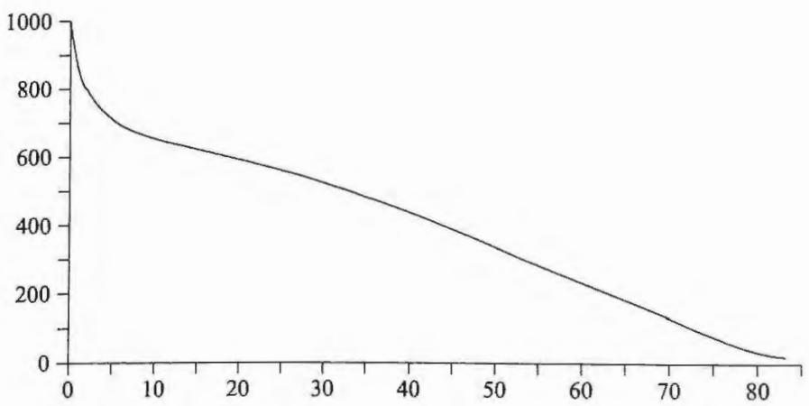

即无论我们在 10000 次抛掷中观察到什么, 总会有一个假设  $H_{S}$  相对于  $H$  得到如此巨大的证据支持. 如果在观察 10000 次抛掷之后, 我们仍然认为骰子是无偏的, 那只能是因为我们认为  $H_{S}$  的先验概率低于  $- 77815 \mathrm{~dB}$ , 否则, 我们的推理就会不一致.

以上论证虽然令人吃惊, 却是完全正确的.  $H_{S}$  的先验概率确实比  $6^{- n}$  低得多, 这是因为在观察到数据  $D$  之前, 有  $6^{n}$  个不同的"确定性"假设都是等可能的. 但是在实践中, 我们显然不愿意使用  $H_{S}$ . 尽管它得到数据的支持最大, 但它的先验概率非常低, 所以我们提前知道自己永远不会接受它.

实际上, 我们没有兴趣将  $H$  与所有可能的假设相比较, 而只是将其与某个有限集合  $\Omega$  中的假设进行比较, 这个集合中的假设在某种意义上被认为是"合情的". 让我们说明相对于这种有限假设集合的一个检验的例子 (到目前为止它也是最常见和最有用的).

再次考虑上述每次试验有  $m$  种可能结果  $\{A_{1}, \dots , A_{m}\}$  的实验

那么每个  $x_{i}$  都可以独立取值  $1,2, \dots , m$ . 现在我们只考虑属于"伯努利类"  $B_{m}$  中的假设: 其中每次试验都有  $m$  种可能结果, 并且连续重复试验  $A_{k}$  的概率相互独立且为常数. 因此, 当  $H$  属于  $B_{m}$  时, 以  $H$  为条件的任何指定观测序列  $\{x_{1}, \dots , x_{n}\}$  的概率都具有形式

$$
p(x_{1} \dots x_{n} | H) = p_{1}^{n_{1}} \dots p_{m}^{n_{m}}, \tag{9.91}
$$

其中  $n_{k}$  是试验结果为  $A_{k}$  的次数.  $B_{m}$  中的每个假设都对应一组数  $\{p_{1}, \dots , p_{m}\}$ , 使得  $p_{k} \geqslant 0$ ,  $\sum_{k} p_{k} = 1$ , 这组数可以完全代表这一假设. 反过来说, 每组这样的数都定义了属于伯努利类  $B_{m}$  的一个假设.

现在我们说明吉布斯(J.WillardGibbs,1902)给出的一个重要引理.令 $x = n_{k} / n p_{k}$  ,并应用以下性质:由在正实数轴上  $\ln x\geqslant 1 - x^{- 1}$  ,当且仅当  $x = 1$  时等号成立,我们马上可以得到

$$
\sum_{k = 1}^{m} n_{k} \ln \left(\frac{n_{k}}{n p_{k}}\right) \geqslant 0, \tag{9.92}
$$

当且仅当对所有  $k$  有  $p_{k} = n_{k} / n$  时等号成立. 这个不等式等价于

$$
\ln p(x_{1} \dots x_{n} | H) \leqslant n \sum_{k = 1}^{m} f_{k} \ln f_{k}, \tag{9.93}
$$

其中  $f_{k} = n_{k} / n$  是结果  $A_{k}$  的观测频率. (9.88) 的右侧仅取决于观察到的样本数据  $D$ , 因此如果我们考虑  $B_{m}$  中的各种假设  $\{H_{1}, H_{2}, \dots \}$ , 量 (9.88) 使我们可以衡量不同假设与数据的拟合程度: 越接近于相等, 拟合程度就越高.

为了方便进行数值运算,像第4章一样,我们以分贝为单位表示(9.88):

$$
\psi_{B} \equiv 10 \sum_{k = 1}^{m} n_{k} \log_{10} \left(\frac{n_{k}}{n p_{k}}\right). \tag{9.94}
$$

为了理解  $\psi_{B}$  的含义,假设我们以(9.79)的形式应用贝叶斯定理.只要考虑两种假设:  $H = \{p_{1},\dots ,p_{m}\}$  和  $H^{\prime} = \{p_{1}^{\prime},\dots ,p_{m}^{\prime}\}$  .根据  $H$  和  $H^{\prime}$  得出的  $\psi_{B}$  值分别为  $\psi_{B}$  和  $\psi_{B}^{\prime}$  .然后,贝叶斯定理可以表示为

$$
\begin{array}{r l} & {e(H|x_{1}\cdot \cdot \cdot x_{n}) = e(H|I) + 10\log_{10}\left[\frac{p(x_{1}\cdot\cdot\cdot x_{n}|H)}{p(x_{1}\cdot\cdot\cdot x_{n}|H^{\prime})}\right]}\\ & {\qquad = e(H|I) + \psi_{B}^{\prime} - \psi_{B}.} \end{array} \tag{9.95}
$$

现在我们总能在  $B_{m}$  中找到假设  $H^{\prime}$  ,其中  $\boldsymbol{p}_{k}^{\prime} = n_{k} / n$  ,因此  $\psi_{B}^{\prime} = 0$  ,因此  $\psi_{B}$  具有以下含义:

给定假设  $H$  和观测数据  $D \equiv \{x_{1},\dots ,x_{n}\}$  ,根据(9.94)计算  $\psi_{B}$  然后,给定在  $0 \leqslant \psi \leqslant \psi_{B}$  范围内的任何  $\psi$  ,有可能在  $B_{m}$  中找到备择假设  $H^{\prime}$  ,使得数据对  $H^{\prime}$  的支持比对  $H$  的支持多  $\psi \mathrm{d} \mathrm{B}$  ,因此在  $B_{m}$  中没有任何  $H^{\prime}$  能比  $H$  得到超过  $\psi_{B} \mathrm{d} \mathrm{B}$  的证据支持.

因此,尽管  $\psi_{B}$  没有提及任何特定的备择假设,但相对于伯努利备择假设类  $B_{m}$  它仍然是"拟合优度"的良好度量.它搜索整个  $B_{m}$  并找到该类中的最佳备择假设.

现在,我们可以理解在开始讨论显著性检验时看似矛盾的东西了.  $\psi$  检验就是对我们的直觉在无意识中所做事情的定量描述.我们已经在5.4节中指出,由于以贝叶斯方式推理的生物更具生存竞争优势,根据达尔文的自然选择理论,往往会进化出这样的生物.

我们还可以这样解释  $\psi_{B}$  :将观测结果  $\{x_{1},\dots ,x_{n}\}$  视为  $n$  个字符组成的"消息",其中每个字符是包含  $m$  个字母的字母表中的一个字母.在每一次重复试验中,大自然都会向我们多发送一个字符的消息.在伯努利概率分布下,此消息传输了多少信息?注意到

$$
\psi_{B} = 10 n \sum_{k = 1}^{m} f_{k} \log_{10} \left(f_{k} / p_{k}\right), \tag{9.96}
$$

其中  $f_{k} = n_{k} / n$  .因此  $- \psi_{B} / n$  是频率分布  $\{f_{1},\dots ,f_{m}\}$  相对于"期望分布" $\{p_{1},\dots ,p_{m}\}$  的相对  $H(f;p)$  .这表明的概念是概率论中固有的,与香农定理无关.任何想使用贝叶斯定理进行假设检验的人,都自然会发现或的单调函数.

历史上,卡尔·皮尔逊在20世纪初提出了一个不同的准则.我们知道,如果假设  $H$  为真,那么  $n_{k}$  将接近  $n p_{k}$  ,这意味着差  $\left|n_{k} - n p_{k}\right|$  将随着  $n$  仅以  $\sqrt{n}$  的数量级增大.我们称之为"条件A"使用展开式  $\ln x = (x - 1) - (x - 1)^{2} / 2 + \dots$  我们可以得到

$$
\sum_{k = 1}^{n}n_{k}\ln \left[\frac{n_{k}}{n p_{k}}\right] = \frac{1}{2}\sum_{k}\frac{(n_{k} - n p_{k})^{2}}{n p_{k}} +O\left(\frac{1}{\sqrt{n}}\right), \tag{9.97}
$$

如果观察到样本确实满足条件A,则指定量以  $O(1 / \sqrt{n})$  的数量级趋于0. 量

$$
\chi^{2}\equiv \sum_{k = 1}^{m}\frac{(n_{k} - n p_{k})^{2}}{n p_{k}} = n\sum_{k}\frac{(f_{k} - p_{k})^{2}}{p_{k}} \tag{9.98}
$$

几乎与  $\psi_{B}$  成正比,前提是只要抽样频率接近期望值

$$
\psi_{B} = \left[10\log_{10}\mathrm{e}\right]\times \frac{1}{2}\chi^{2} + O\left(\frac{1}{\sqrt{n}}\right) = 2.171\chi^{2} + O\left(\frac{1}{\sqrt{n}}\right). \tag{9.99}
$$

皮尔逊建议以  $\chi^{2}$  作为"拟合优度"的标准,这就是"卡方检验",目前最常用的正统统计技术之一.在描述这一检验方法之前,我们将检查其理论基础以及它是否适合作为统计标准.显然,  $\chi^{2}\geqslant 0$  ,当且仅当观测频率与期望的假设频率完全一致时等号成立.因此,更大的  $\chi^{2}$  值对应着预测和观测之间的更大偏差,而太大的  $\chi^{2}$  值会使我们怀疑假设的真实性.但是这些定性性质也为  $\psi_{B}$  以及我们可以定义的任何其他统计量所拥有.我们已经看到了概率论可以直接说明  $\psi_{B}$  的理论基础与定量意义,因此也可以问:是否存在相关的理论解释认为,根据一些明确定义的标准,  $\chi^{2}$  可以作为拟合优度的最优度量?

寻求相关解释的结果令人失望.查看许多正统的统计教科书,我们发现  $\chi^{2}$  通常是从天而降的.但是克拉默(Cramer,1946)确实尝试对其思想进行解释,他说:

采用  $\sum c_{i}(n_{i} / n - p_{i})^{2}$  的形式作为偏差的度量,其中的  $c_{i}$  多少可以较为随意地选择,这符合最小二乘的一般原理.皮尔逊的研究表明,如果我们选择  $c_{i} = n / p_{i}$  ,则可以得到一个具有特别简单性质的偏差度量.

换句话说,之所以使用  $\chi^{2}$  ,不是因为根据什么准则可以证明它具有良好的性能,而是因为它具有简单的性质!

我们已经看到,在某些情况下,  $\chi^{2}$  大约是  $\psi_{B}$  的倍数,因此两种方法会得出基本相同的结论.但是,让我们尝试通过我(Jaynes,1976)在1976年引入的技术来理解这两个准则的定量差别,该技术是我们从伽利略那里借用来的.人们之所以能通过伽利略的望远镜看到木星的卫星,是因为它可以放大无法用肉眼观察到的很小的东西.同样,我们经常发现贝叶斯统计和正统统计得出的结果存在的

数值差异很小,以至于无法凭常识判断哪个结果更好。当发生这种情况时,我们可以找一些极端的情况,其中两种结果的差异被放大,以致可以凭常识判断孰优孰劣。

我们将通过这种放大技术的一个示例来比较  $\psi_{B}$  和  $\chi_{2}$ ,看看哪个是拟合优度更合理的度量指标。

# 9.12  $\psi$  和  $\chi_{2}^{2}$  的比较

抛硬币会产生三种结果:(1)正面朝上,(2)反面朝上,(3)如果硬币足够厚,可能会侧立。假如根据关于硬币的背景知识,地球人A为这些不同结果分配的概率为  $p_{1} = p_{2} = 0.499$ , $p_{3} = 0.002$ 。假设我们尝试与火星人B进行通信,他从未见过硬币,对硬币没有什么概念。因此,当被告知每次试验有三种可能结果时,他会对三者分配相等的概率  $p_{1}^{\prime} = p_{2}^{\prime} = p_{3}^{\prime} = 1 / 3$ 。

现在我们想通过随机试验来检验A和B的假设。我们抛29次硬币并观察到结果  $(n_{1} = n_{2} = 14$ , $n_{3} = 1)$ 。如果使用  $\psi$  准则,对于这两种假设,我们有

$$
\begin{array}{l}{\psi_{A} = 10\left[28\log_{10}\left(\frac{14}{29\times0.499}\right) + \log_{10}\left(\frac{1}{29\times0.002}\right)\right] = 8.34\mathrm{dB},}\\ {\psi_{B} = 10\left[28\log_{10}\left(\frac{14\times3}{29}\right) + \log_{10}\left(\frac{3}{29}\right)\right] = 35.19\mathrm{dB}.} \end{array} \tag{9.100}
$$

火星人B从实验结果中学到了两点:(a)存在一种关于硬币的假设比他的假设要好35.2dB(相当于3300:1的几率),因此,除非他能证明另一种假设的先验概率很低,否则他无法合理地坚持相信自己的假设正确。(b)地球人A的假设比他的假设好26.8dB,并且实际上与伯努利类  $B_{3}$  的最佳假设的相差大约8dB。这里, $\psi$  检验的结果几乎与我们的常识告诉我们的相同。

假设火星人B只知道正统统计原理,因此他会相信  $\chi^{2}$  是拟合优度的适当标准。这时他会发现

$$
\begin{array}{l}{{\chi_{A}^{2}=2\frac{(14-29\times0.499)^{2}}{29\times0.499}+\frac{(1-29\times0.002)^{2}}{29\times0.002}=15.33,}}\\ {{\chi_{B}^{2}=2\frac{(14-29\times0.333)^{2}}{29\times0.333}+\frac{(1-29\times0.333)^{2}}{29\times0.333}=11.66,}}\end{array} \tag{9.101}
$$

然后他会兴奋地报告:"根据公认的统计检验,我的假设比你们的假设更可取!"

许多因接受过正统统计训练而使用  $\chi^{2}$  进行检验的人会觉得以上比较结果令人吃惊,并会立即试图从以上数值计算中寻找错误。其实,这里还有一个考克斯定理所能预测的结论: $\psi$  标准是从概率论规则严格推导出来的,因此,任何只是与之近似的准则都一定存在内在不一致性或者违背常识,这可以通过特例来验证。

通过更仔细观察, 我们可以得到实际使用  $\chi^{2}$  的重要教训. 在假设 A 中, 29 次抛掷产生正面或反面的期望次数为  $n p_{1} = 14.471$ . 实际的观测次数一定为整数, 我们假设在每种情况下, 它都是最接近的整数 14. 但是这种期望次数与实际观察次数之间的小差别, 几乎可以说是可能的最小差别, 仍然对  $\chi^{2}$  有巨大的影响. 其他数值似乎并不出人意料, 真正令人惊讶的是  $\chi_{A}^{2}$  看起来比合理值大得多. 显然, 这是  $\chi_{A}^{2}$  中的最后一项在起作用. 它是指硬币在 29 次抛掷中出现了一次侧立, 这导致了问题. 在假设 A 中,  $n$  次抛掷中恰好发生  $r$  次的概率是二项分布 (9.57). 对于  $n = 29$ ,  $p = 0.002$ , 我们发现在抛硬币时看到一次或多次侧立的概率为  $1 - b(0|n, p) = 1 - 0.998^{29} = 1 / 17.73$ . 也就是说, 我们观测到一次侧立的事实是有点出乎意料的, 这构成了反对假设 A 的一定证据. 但是, 该证据的大小显然并没有压倒一切. 如果旅行指南告诉我们伦敦平均每 18 天中有 1 天有雾, 那么在到达时遇上大雾天气一点儿也不会让我们感到震惊. 但是这对  $\chi_{A}^{2} = 15.33$  贡献了 15.30 的数值, 几乎是其全部.

导致这一异常情况的原因是  $\chi^{2}$  求和中的  $1 / p_{i}$  加权因子.  $\chi^{2}$  准则会将注意力集中在极不可能发生的假设上. 对于不太可能发生的事件, 期望样本数与实际观察样本数之间的微小差异会奇怪地过度惩罚这一假设.  $\psi$  检验中也包含此效应, 但由于  $1 / p_{i}$  项仅出现在对数中, 惩罚更为温和.

为了更清楚地看清这种效应, 现在假设实验结果是  $n_{1} = 14$ ,  $n_{2} = 15$ ,  $n_{3} = 0$ . 显然, 无论是根据  $\chi^{2}$  标准还是  $\psi$  标准, 相对于前面的结果, 这都应该使假设 A 看起来更可信, 使假设 B 看起来更糟. 重复前面的计算, 我们可以得到

$$
\begin{array}{r l r l} & {\psi_{A} = 0.30\mathrm{dB},} & & {\chi_{A}^{2} = 0.0925,}\\ & {\psi_{B} = 51.2\mathrm{dB},} & & {\chi_{B}^{2} = 14.55.} \end{array} \tag{9.102}
$$

(9.102)

可以看到相对变化最大的是  $\chi_{A}^{2}$ . 现在两个准则都一致认为假设 A 远优于假设 B.

这表明了不加评判地使用  $\chi^{2}$  会发生什么. 假设 Q 教授相信特异功能, 并决心向我们这些愚昧无知且顽固的怀疑者证明这一点. 所以他开始让受试者表演猜纸牌游戏. 正如第 5 章中那样, 若根据只有偶然性在起作用的"零假设", 受试者不可能猜对很多牌. 但是, Q 教授决心避免他的前辈们所犯的战术错误, 并且对第 5 章中讨论的欺骗假设现象保持警惕. 因此他通过录像把所有的实验细节记录下来. 前几百次的实验结果令人失望, 但是这很容易解释, 原因是受试者没有进入"接受"(receptive)状态. 当然, 记录这些实验的录像带会被销毁.

一天, 上天终于开始眷顾 Q 教授. 受试者猜对了牌, 他的记录也无可争议. 他立即召集统计学家、数学家、公证人和媒体记者开会. 最终, 发生了一件极不可能的事件, 此时的  $\chi^{2}$  值很大. 现在, 他可以发表结果并断言: "数据的有效性

可以由信誉良好、没有偏见的人证明,统计分析是在著名统计学家的监督下进行的,计算结果已经由数学家检查过。经过公认的统计检验,原假设被确定地拒绝了。"而他所说的一切都是绝对正确的!

# 教训

如果要检验涉及中等大小概率的假设,并且假设与观察结果适度相符,那么无论使用  $\psi$  还是  $\chi^{2}$  都不会有太大区别。但是要检验涉及小概率事件的假设,我们最好使用  $\psi$ 。否则生活对我们来说可能会充满太多惊喜。

# 9.13 卡方检验

下面简单考察一下实践中的卡方检验。我们说明了待检验的所谓"原假设"  $H$  而没有说明备择假设。原假设会预测相对频率  $\{f_{1},\dots ,f_{m}\}$  及相应样本数  $n_{k} = n f_{k}$ ,其中  $n$  是试验数。我们观测到的实际样本数为  $\{n_{1},\dots ,n_{m}\}$ 。但是如果  $n_{k}$  很小,我们会将多个类别合并,以使得每个  $n_{k}$  至少为5。例如,如果当  $m = 6$  时,观测到的样本数为  $\{6,11,14,7,3,2\}$ ,我们会将最后两类合为一类,使得每次试验都有  $m = 5$  种不同的结果,不同类别的样本数变为  $\{6,11,14,7,5\}$ ,并且给原假设  $H$  分配概率  $\{p_{1},p_{2},p_{3},p_{4},p_{5} + p_{6}\}$ 。然后我们计算  $\chi^{2}$  的观测值

$$
\chi_{\mathrm{obs}}^{2} = \sum_{k = 1}^{n}\frac{(n_{k} - n p_{k})^{2}}{n p_{k}} \tag{9.103}
$$

作为对观测与预测之间偏差的度量。显然,即使原假设为真,我们也极不可能发现  $\chi_{\mathrm{obs}}^{2} = 0$ 。因此,遵循正统统计思想,我们应该计算  $\chi^{2}$  具有各种可能值的概率,如果发现产生大于等于  $\chi_{\mathrm{obs}}^{2}$  的偏差的概率  $P(\chi_{\mathrm{obs}}^{2})$  足够小,则拒绝  $H$ 。这就是"尾区间"准则,拒绝阈值概率通常取  $5\%$  (即  $P(\chi_{\mathrm{obs}}^{2}) = 0.05$ )。

由于  $n_{k}$  是整数,所以  $\chi^{2}$  只能取离散值。如果  $p_{k}$  都不同且不可共约,则  $\chi^{2}$  的不同取值最多有  $(n + m - 1)! / n!(m - 1)!$  种。因此, $\chi^{2}$  的真实分布一定是离散的,只在有限点集合上有定义。但是,如果  $n$  足够大,集合上点的数量和密度变得很大,我们就可以使用连续分布来近似真实的离散  $\chi^{2}$  分布。克拉默提到的"简单性质"是指——乍看之下令人惊讶——在大  $n$  的极限下,我们会得到一个普遍分布定律: $\chi^{2}$  处于  $\mathrm{d}(\chi^{2})$  区间的采样概率是

$$
g(\chi^{2})\mathrm{d}(\chi^{2}) = \frac{\chi^{f - 2}}{2^{f / 2}(f / 2 - 1)!}\exp \left\{-\frac{1}{2}\chi^{2}\right\} \mathrm{d}(\chi^{2}), \tag{9.104}
$$

其中  $f$  称为分布的"自由度"。如果原假设  $H$  是完全确定的(即它不包含任何变化参数),那么  $f = m - 1$ ,其中  $m$  是(9.98)中的类别数。但是如果  $H$  包含必须

根据数据估计的不确定参数,那么  $f = m - 1 - r$  ,其中  $r$  是待估计的参数个数.①

容易计算卡方分布的均值和方差分别为  $\langle \chi^{2}\rangle = f$  和  $\operatorname {var}(\chi^{2}) = 2f$  ,所以  $\chi^{2}$  的 (均值)  $\pm$  (标准差)估计是

$$
(\chi^{2})_{\mathrm{est}} = f\pm {\sqrt{2f}}. \tag{9.105}
$$

样本数量较小的类别通常会被合并,否则(9.104)的近似会很差.但是合并难免会丢弃数据中的一些有用信息,由于  $\psi$  是精确的,使用它就可以避免合并.

这样,我们能观察到偏差大于等于  $\chi_{\mathrm{obs}}^{2}$  的概率是

$$
P(\chi_{\mathrm{obs}}^{2}) = \int_{\chi_{\mathrm{obs}}^{2}}^{+\infty}\mathrm{d}(\chi^{2})g(\chi^{2}) = \int_{q_{\mathrm{obs}}}^{+\infty}\mathrm{d}q\frac{q^{k}}{k!}\mathrm{e}^{-q}, \tag{9.106}
$$

其中  $q\equiv (1 / 2)\chi^{2}$ $k\equiv (f - 2) / 2$  .如果  $P(\chi_{\mathrm{obs}}^{2})< 0.05$  ,则说我们以  $5\%$  的"显著性水平"拒绝原假设.大多数正统教科书和统计手册,例如克罗、戴维斯和马克斯菲尔德的著作(Crow,Davis & Maxfield,1960),会给出针对各种自由度的 $P = 0.01,0.05,0.10,0.50$  的  $\chi^{2}$  值.

注意传统统计的推断流程:我们随意地选择一个显著性水平,然后报告原假设在该显著性水平上是否被拒绝.显然,这并不能告诉我们很多真正由数据导入的信息.如果你告诉我该假设在  $5\%$  的显著性水平上被拒绝,那么我无法确定该假设是否也会在  $1\%$  或  $2\%$  的水平上被拒绝.如果你告诉我它在  $5\%$  的显著性水平上未被拒绝,那么我不知道它是否会在  $10\%$  或  $20\%$  的显著性水平上被拒绝.如果正统统计学家能告诉我们原假设刚好被拒绝的显著性水平  $P(\chi^{2})$  值,他们就会告诉我们更多数据的真实信息,因为这样我们就知道结论在什么程度上成立.这就是所谓的报告"  $P$  值"的做法,是对原始方式的一项重大改进.不幸的是,正统 $\chi^{2}$  和其他统计值表格仍然是以之前的方式构造的,以至于我们不能以这种更有信息量的方式来报告结论,因为它们只在非常分散的显著性水平上给出数值,不太可能进行插值求出其他点的值.

如果不使用卡方表,如何得到  $P$  值呢?令  $q = q_{0} + t$  ,(9.106)变成

$$
\begin{array}{l}{{P=\int_{0}^{+\infty}\mathrm{d}t\frac{(q_{0}+t)^{k}}{k!}\mathrm{e}^{-(q_{0}+t)}}}\\ {{=\frac{1}{k!}\sum_{k=0}^{m}\binom{m}{k}\int_{0}^{+\infty}\mathrm{d}t q_{0}^{k}t^{m-k}\mathrm{e}^{-(q_{0}+t)}}}\\ {{=\sum_{k=0}^{m}\mathrm{e}^{-q_{0}}\frac{q_{0}^{k}}{k!}.}}\end{array} \tag{9.107}
$$

这是累积泊松分布, 很容易计算.

但是, 如果使用  $\psi$  检验, 则不需要任何表格. 仅通过  $\psi$  的数值就可以描述样本的证据大小, 而不需要通过其他随意构造的统计量 (例如尾区间面积). 当然,  $\psi$  的数值本身并不能告诉我们是否拒绝该假设 (尽管我们也可以像卡方检验一样规定一定的"拒绝水平"). 从贝叶斯的观点来看, 除非我们有一个确定更好的备择假设来代替它, 否则拒绝任何假设都毫无用处. 显然, 这是否合理不仅取决于  $\psi$ , 还取决于备择假设的先验概率以及做出错误决定的后果. 常识告诉我们, 这不仅是一个推断问题, 还是一个决策论问题.

尽管视角差别很大, 实际得出的结论却未必有很大的差别. 例如, 随着自由度  $f$  的增加, 正统统计学家将接受较高的  $\chi^{2}$  值 (如 (9.105) 所示, 大致正比于  $f$ ). 原因是, 如果假设是真的, 则这么大的  $\chi^{2}$  值很有可能产生. 但是贝叶斯主义者 (仅在支持确定的备择假设时才拒绝原假设) 也一定会接受成比例的更高的  $\psi$  值, 因为合理的备择假设的数量随  $f$  呈指数级增加, 并且其中任何一个的先验概率相应地降低. 因此, 无论对于哪种情况, 只要  $\psi$  或  $\chi^{2}$  超过某个临界值, 我们最终都会拒绝该假设. 虽然在如何选择该临界值的哲学上存在巨大差别, 但是实际值未必有很大的差别.

有关卡方检验的更多详细信息见兰开斯特的著作 (Lancaster, 1969), 关于贝叶斯方法无法给出适当的显著性检验的一些新颖的观点, 见博克斯和刁锦寰的著作 (Box & Tiao, 1973).

# 9.14 推广

从上一节可以看出,  $\chi^{2}$  并非对于所有可能的备择假设都是拟合优度的度量, 它仅对于同一伯努利类的备择假设是如此. 这一点在正统文献中没有提到, 因为其中根本没有提及备择假设. 如果意识不到这一点, 人们实际上并不知道  $\chi^{2}$  检验是在检验什么.

我们构造  $\psi$  检验的过程可以马上推广为为了构造比较原假设与任意定义明确的备择假设类  $C$  而构造精确检验的规则. 只需要应用贝叶斯定理通过以下形式描述数据  $D$  对该类中两个假设  $H_{1}$  和  $H_{2}$  的相对合情性的影响

$$
e(H_{1}|DI) - e(H_{2}|DI) = \psi_{2} - \psi_{1}, \tag{9.108}
$$

其中  $\psi_{i}$  只依赖于数据和  $H_{i}$ , 在  $C$  上为非负值, 并且对于  $C$  中的某些  $H_{i}$  为 0. 那么我们总是可以在  $C$  中找到一个  $H_{2}$  使得  $\psi_{2} = 0$ . 这样就构造了用于相对于备择假设类  $C$  度量拟合优度的合适指标  $\psi_{1}$ . 这与 (9.95) 之后的定义具有相同的含义.  $\psi_{1}$  是数据  $D$  相对于  $H_{1}$  而言, 对  $C$  中的任意假设所能支持的最大值.

因此，如果我们想要一个与正统显著性检验类似的精确的贝叶斯检验方法，就能很容易地得到它．但是我们将在第17章中看到，另一种观点更有优势：正如拉普拉斯所做的那样，可以把正统显著性检验替换为一种参数估计方法，从而产生更有用的信息.

安斯科姆（Anscombe，1963）认为，必须引入特定的备择假设类是贝叶斯方法的一个不足之处．我们已经在这里以及第4章和第5章中充分地回答了这一点．我们认为这是贝叶斯方法的一个极大优势，它迫使我们认识到推理的本质特征．但是并非所有正统统计学家都清楚这一点．我们对显著性检验的讨论是如下总体状况的一个好例子：如果在某些问题上可以使用正统统计方法，那么贝叶斯推断方法可以为其提供缺失的理论基础，并且通常能对其进行改进．所有的显著性检验都只是第4章中给出的多元假设检验方法的小变体.

# 9.15 哈雷的死亡率表

在比赌博更有用、更庄重的场景下将观察到的频率作为概率使用的一个早期例子来自以发现“哈雷彗星”闻名的天文学家埃德蒙·哈雷（1656—1742）．他使用的方法相当正确，以至于直到今天我们也无法对其进行明显的改进．除了天文学，哈雷还对很多领域感兴趣．他于1693 年编写了第一张现代死亡率统计表．由于其巨大的历史意义，我们来详细介绍一下这项工作的细节

这项工作并不是哈雷发起的. 在英国,大概是由于人口密度的增大,从16 世纪起直到19 世纪中叶采用公共卫生政策和措施为止,各种瘟疫流行. 伦敦从1591 年开始断断续续, 并从1604 年开始连续几十年每周出版一次《死亡率法案》, 其中列出了每个教区出生和死亡人数的统计数据. 这是由一群主教编撰的, 他们主要负责检查尸体, 会通过物证和根据询问所能得出的其他信息, 尽量判断每个人的死亡原因.

1662 年，约翰·格兰特（1620—1674）（Grunt，1662）呼吁人们注意以下事实：这些法案总体上包含非常有价值的人口统计学信息，除了判断公共卫生现状外，还可以被政府和学者用于许多其他的目的.①他将1632 年的数据汇总到一个更有用的表中，并且观察到：在足够多的出生数据中，男孩总是比女孩略多．这在以后的150 年中引起了概率论者的许多猜测和计算．格兰特不是一位学者，而是一名自学成才的店主，然而他的短篇作品中包含非常有价值的判断，引起了国王查尔斯

二世的注意. 作为嘉奖, 他命令不久前成立的英国皇家学会接收格兰特为会员. ①

埃德蒙·哈雷受过高等教育, 数学能力很强. 他后来于 1703 年接替沃利斯担任牛津大学数学教授, 并于 1720 年接替弗拉姆斯蒂德担任皇家天文学家和格林威治天文台台长. 他是牛顿的朋友, 也是说服牛顿发表《自然哲学的数学原理》的人. 哈雷还为此放弃了自己的工作, 努力促进其出版, 并且资助了相当多的钱. 他显然能比格兰特得到更多人口统计数据.

为了确定人口中的实际年龄分布, 哈雷获取了伦敦和都柏林的大量出生和死亡数据. 但是, 这些数据通常缺少对死亡年龄的记录. 他注意到伦敦和都柏林的人口随着移民数量增加而迅速增长, 这使得数据因包含很多在那里死亡而并不在那里出生的人而变得有偏. 这些数据受到了严重的污染, 以至于他无法提取所需的信息. 因此, 他转而找到一个人口稳定的城市: 西里西亚 (现在称为弗罗茨瓦夫, 属于波兰) 的布雷斯劳, 并收集了它五年 (1687~1691 年) 的数据. 西里西亚人在记录保存上一丝不苟, 且更不愿意迁移, 因此生成了更好的数据.

当然, 布雷斯劳的营养、卫生和医疗状况可能与英国不同. 但是无论如何, 哈雷制作了一张对布雷斯劳肯定有效, 而对英国来说误差也不会太大的死亡率统计表. 我们已经将其转化为图形, 如图 9- 1 所示.

  
图 9-1  $n(y)$ : 在年龄区间  $(y, y + 1)$  中的估计人数

在 17 世纪, 即使像哈雷这样的饱学之士也没有养成我们在今天的学术著作

中所能看到的那种详尽、清晰的表达习惯。在阅读他的著作时,我们会因其模糊与遗漏之处而感到恼火,因为这使得我们无法确定有关数据和处理流程的一些重要细节。我们知道他的数据中包括每月出生和死亡人数的数据以及每个人的死亡年龄。不幸的是,他没有向我们展示未经处理的原始数据。如果我们有这些原始数据,就能在今天从中获得更大的价值。因为利用现代概率论和计算机,我们可以轻松地自己处理数据,并能从数据中提取远超哈雷所能提供的更多信息。

哈雷展示了两个从数据中导出的表格,分别是给出了每个年龄段  $x$  人口的年度死亡估计数  $d(x)$  (总数/5) 的表 9- 1 (但是其中莫名其妙地包含了一些不是总数/5 的条目),以及给出了按年龄划分的估计人口分布  $n(x)$  的表 9- 2。因此,第一张表大致是第二张表的负导数。但是(同样莫名其妙地),他在第一张表中忽略了非常小的年龄段 (<7 岁) 的数据,在第二张表中忽略了非常老的年龄段 (>84 岁) 的数据,从而隐藏了在许多方面最有趣的部分,即曲率大的区域。

表9-1 哈雷的第一张表  

<table><tr><td>年龄</td><td>d(y)/5</td><td>年龄</td><td>d(y)/5</td><td>年龄</td><td>d(y)/5</td><td>年龄</td><td>d(y)/5</td></tr><tr><td>0</td><td>348</td><td>28</td><td>8</td><td>:</td><td>10</td><td>90</td><td>1</td></tr><tr><td>:</td><td>198</td><td>:</td><td>7</td><td>63</td><td>12</td><td>91</td><td>1</td></tr><tr><td>7</td><td>11</td><td>35</td><td>7</td><td>:</td><td>9.5</td><td>98</td><td>0</td></tr><tr><td>8</td><td>11</td><td>36</td><td>8</td><td>70</td><td>14</td><td>99</td><td>0.5</td></tr><tr><td>9</td><td>6</td><td>:</td><td>9.5</td><td>71</td><td>9</td><td>100</td><td>3/5</td></tr><tr><td>:</td><td>5.5</td><td>42</td><td>8</td><td>72</td><td>11</td><td></td><td></td></tr><tr><td>14</td><td>2</td><td>:</td><td>9</td><td>:</td><td>9.5</td><td></td><td></td></tr><tr><td>:</td><td>3.5</td><td>45</td><td>7</td><td>77</td><td>6</td><td></td><td></td></tr><tr><td>18</td><td>5</td><td>:</td><td>7</td><td>:</td><td>7</td><td></td><td></td></tr><tr><td>:</td><td>6</td><td>49</td><td>10</td><td>81</td><td>3</td><td></td><td></td></tr><tr><td>21</td><td>4.5</td><td>54</td><td>11</td><td>:</td><td>4</td><td></td><td></td></tr><tr><td>:</td><td>6.5</td><td>55</td><td>9</td><td>84</td><td>2</td><td></td><td></td></tr><tr><td>27</td><td>9</td><td>56</td><td>9</td><td>:</td><td>1</td><td></td><td></td></tr></table>

尽管如此,如果我们知道哈雷从原始数据构造这些表的具体过程,也许能完整地重做这两张表。但是他根本没有提供任何信息,只是说:

根据这些考虑,我形成了这一张表,它有多种用途,并且能比我所知道的其他数据更能客观地表述人口的状态和情况。

他没有告诉我们"这些考虑"具体是指什么,因此我们只能猜测他的实际做法。

尽管我们找不到与哈雷表中的所有数值一致的猜想,但是可以在某种程度上

<table><tr><td>年龄</td><td>n(y)</td><td>年龄</td><td>n(y)</td><td>年龄</td><td>n(y)</td><td>年龄</td><td>n(y)</td><td>年龄</td><td>n(y)</td><td>年龄</td><td>n(y)</td><td>年龄</td><td>n(y)</td></tr><tr><td>0</td><td>1000</td><td>13</td><td>640</td><td>25</td><td>567</td><td>37</td><td>472</td><td>49</td><td>357</td><td>61</td><td>232</td><td>73</td><td>109</td></tr><tr><td>2</td><td>855</td><td>14</td><td>634</td><td>26</td><td>560</td><td>38</td><td>463</td><td>50</td><td>346</td><td>62</td><td>222</td><td>74</td><td>98</td></tr><tr><td>3</td><td>798</td><td>15</td><td>628</td><td>27</td><td>553</td><td>39</td><td>454</td><td>51</td><td>335</td><td>63</td><td>212</td><td>75</td><td>88</td></tr><tr><td>4</td><td>760</td><td>16</td><td>622</td><td>28</td><td>546</td><td>40</td><td>445</td><td>52</td><td>324</td><td>64</td><td>202</td><td>76</td><td>78</td></tr><tr><td>5</td><td>732</td><td>17</td><td>616</td><td>29</td><td>539</td><td>41</td><td>436</td><td>53</td><td>313</td><td>65</td><td>192</td><td>77</td><td>68</td></tr><tr><td>6</td><td>710</td><td>18</td><td>610</td><td>30</td><td>531</td><td>42</td><td>427</td><td>54</td><td>302</td><td>66</td><td>182</td><td>78</td><td>58</td></tr><tr><td>7</td><td>692</td><td>19</td><td>604</td><td>31</td><td>523</td><td>43</td><td>417</td><td>55</td><td>292</td><td>67</td><td>172</td><td>79</td><td>49</td></tr><tr><td>8</td><td>680</td><td>20</td><td>598</td><td>32</td><td>515</td><td>44</td><td>407</td><td>56</td><td>282</td><td>68</td><td>162</td><td>80</td><td>41</td></tr><tr><td>9</td><td>670</td><td>21</td><td>592</td><td>33</td><td>507</td><td>45</td><td>397</td><td>57</td><td>272</td><td>69</td><td>152</td><td>81</td><td>34</td></tr><tr><td>10</td><td>661</td><td>22</td><td>586</td><td>34</td><td>499</td><td>46</td><td>387</td><td>58</td><td>262</td><td>70</td><td>142</td><td>82</td><td>28</td></tr><tr><td>11</td><td>653</td><td>23</td><td>579</td><td>35</td><td>490</td><td>47</td><td>377</td><td>59</td><td>252</td><td>71</td><td>131</td><td>83</td><td>23</td></tr><tr><td>12</td><td>646</td><td>24</td><td>573</td><td>36</td><td>481</td><td>48</td><td>367</td><td>60</td><td>242</td><td>72</td><td>120</td><td>84</td><td>20</td></tr></table>

对其进行理解.首先,第一张表中的实际死亡人数从一个年龄段到另一个年龄段自然呈现出相当大的"统计涨落".由于这种涨落没有出现在第二张表中,哈雷一定对此进行过某种平滑处理.

根据他文章中的其他证据,我们推断他的推理过程如下.如果人口分布稳定(明年与今年的分布完全相同),则25岁与26岁之间的数字差异  $n(25) - n(26)$  一定等于  $d(25)$  :现年25岁,将于明年之前死亡的人数.因此,我们估计第二张表可能是通过如下方式构造的:以估计的每年出生人数(1238)为  $n(0)$  ,然后通过递归取  $n(x) = n(x - 1) - \overline{d} (x)$  ,其中  $\overline{d} (x)$  是  $d$  的平滑估计.最后,布雷斯劳总人口估计为  $\sum_{x}n(x) = 34000$  .这种猜测很好地解释了表9- 2的后面部分,但是与前面部分(  $0< x< 7$  )并不相符.我们甚至无法对他确定表9- 2中前6个条目的方法做出猜测.

我们在自己的表中将年龄下移了一年,因为年龄的一般意义似乎在300年后发生了变化.今天,当我们说一个男孩"8岁"时,意思是他的确切年龄  $x$  在 $(8\leqslant x< 9)$  的范围内,也就是说,他是在出生后的第9年.但是对于哈雷的数值,只有我们假定8岁时在其出生后第8年,即  $7< x\leqslant 8$  才有意义.格林伍德(Greenwood,1942)也注意到了这一点,他的分析证实了我们关于年龄含义的结论.但是,当我们尝试遵循他的推理进一步向前时,这只会使我们比以前感到更加困惑.因此我们只好放弃,只接受哈雷的判断,不管它的意义是什么.

在图9- 1中,我们给出了使用哈雷的第二张表做出的位移函数  $n(y)$  的图形.因此,在哈雷的表中读取(25567)时,我们将其设为  $n(24) = 567$  ,意思是年龄段  $(24\leqslant x< 25)$  内估计有567人.因此,我们认为  $n(y)$  是哈雷在  $(y,y + 1)$  岁

年龄段内估计的人数.

哈雷的第二张表在(84 20)处就停止了,但第一张表中包含的数据超出了该年龄.他使用该数据估算了布雷斯劳的总人口.他的第一张表显示了在未来五年中,(85 100)区间内将有19人死亡,其中3人刚好是在100岁时死亡.他估计该年龄区间内的总人口为107人.我们根据这些少量信息,及对两张表的其他比较结果,对哈雷的第二张表进行了平滑外推处理(生成了我们的条目 $n(84),\dots ,n(99)$ ),该曲线显示尾部一定有大的曲率.

图9- 1最令人震惊的方面是极高的婴儿死亡率.哈雷在其他地方指出:只有 $56\%$  的孩子可以活到6岁(尽管这与表9- 2不符),而只有  $50\%$  的人可以活到17岁(这与表9- 2相符)第二引人注目的方面是35岁和80岁之间的几乎完美的线性.

哈雷注意到他的第二张表可以有多种用途,包括估计该城市可以召集的军队规模以及养老金的价值等,让我们只考虑一种用途:估计未来的预期寿命,我们认为一个  $y$  岁的人活到  $z$  岁的概率可以很准确地分配为  $p = n(z) / n(y)$

实际上,哈雷并没有使用"概率"一词,而是用与我们今天完全相同的方式称之为"几率"(odds):"……将任意年龄段中一年后的剩余人数除以该年龄段总人数与剩余人数的差值就得到了该年龄段中的一个人未在当年死亡的几率."因此,哈雷给出的年龄为  $y$  岁的人再生活  $m$  年以上的几率是  $O(m|y) = n(y + m) / [n(y) - n(y + m)] = p / (1 - p)$ ,与我们现在的计算一致.

令人气愤的还有,哈雷合并了男性和女性的数据,因此不能画出不同性别的不同死亡率函数,由于缺少原始数据,我们无法修复此问题.

让哈雷工作中令我们感到恼火的事情成为我们今天的教训吧,科学数据分析的第一诚命应该是:"你要提供未经任何处理的完整原始数据."就像我们今天能用哈雷的原始数据做比他更多的分析一样,如果我们不根据自己的目的和偏见破坏原始数据,未来的读者也许能使用原始数据做更多的分析.至少,他们将通过不同的先验知识来处理我们的数据,我们已经看到了这会对结论产生多大的影响.

练习9.3 假设你有与哈雷相同的原始数据,今天你将如何充分利用概率论来处理它们?实际结论会有何不同?

# 9.16 评注

# 9.16.1 非理性主义者

几个世纪以来,哲学家们一直在争论归纳的本质,尽管所有科学知识都是通过归纳获得的,一些哲学家[从18世纪中叶的大卫·休谟(1711—1776)到20世纪中叶的卡尔·波普尔(例如Popper&Miller,1983)]却试图否认归纳的可能性.斯托韦(D.Stove,1982)将他们及其间道称为"非理性主义者",并试图解释(1)为什么会出现如此荒谬的观点,(2)非理性主义者通过什么话语成功地打动了读者,但是,由于不相信有很多这样的读者存在,我们并不受这种情况的困扰.

在否认归纳的可能性时,波普尔认为理论永远不可能获得很高的置信概率但该结论的前提是,我们要针对无数替代理论检验该理论,我们会观察到,已知宇宙中的原子数是有限的,因此,替代理论的个数也是有限的,只需要有限的笔墨就可以写出来,贝叶斯推断所确定的不是整个宇宙中所有可能的理论假设的绝对状态,而是针对一组特定的替代理论假设的相对合情性.

正如我们在第4章中的多重假设检验、第5章中的牛顿理论以及上面关于显著性检验的讨论中所展示的那样:在一组定义明确的备择理论假设集合中,一种假设可以达到很高或很低的概率,在所有可能的理论集合中,一种假设的概率既不是很高,也不是很低;这种概率是未定义的,因为所有可能的理论集合没有定义,换句话说,贝叶斯推断处理的是确定性问题(不是波普尔的未定义问题),否则我们也不会使用它.

人们通常以不同的方式表示对归纳的反对,有一种观点是:如果一种理论不能比所有替代理论获得更高的绝对概率,就没有办法证明根据该理论归纳而得的结论是正确的,但是这种观点完全错失了要点,归纳的作用不是保证"正确",而且实际上科学家也不会将其用于此目的(即使我们想也不能这么做),归纳在科学中的作用不是告诉我们什么预测一定是正确的,而是告诉我们:当前假设和当前信息最强烈地支持什么预测结果.

更详细地说:我们输入计算中的信息最强烈地支持什么预测结果?完全可以根据我们不相信甚至知道是错误的假设进行归纳,以了解其预测结果.事实上,除非实验者知道某种替代理论做出了什么预测,否则他在寻找对自己最偏好的理论的证据支持时其实不知道在找什么,即使他并不十分相信某个替代理论,也必须暂时为其提供服务,以便得到其预测结果.

如果某个理论的预测被将来的观察所证实,那么我们将对得出这些预测的理

论假设更加有信心。如果这些预测在大量检验中从未失败过，那么我们最终将这些理论假设称为“物理定律”。当然，成功的归纳对于未来的策略规划具有很大的实用价值。但是我们并没有从成功的归纳中学到新知识，只是对已经知道的东西更有信心。

此外，如果预测被证明是错误的，那么归纳也已经达到了其真正的目的：我们了解到我们的假设是错误的或者是不完整的，并且根据错误的性质对如何改进假设有了线索。因此，那些以归纳结果可能不正确为由而批评归纳的人，实在大错特错。正如哈罗德·杰弗里斯早就解释的那样：归纳对科学家来说最有价值的就是它出错的时候，只有这时我们才能获得新的知识。

生物学历史中有一些引人注目的归纳案例，其中的因果关系通常非常复杂和微妙，以至于完全揭开它们之间的联系是非常不易且惊人的。例如，在20世纪，有些新的流感病毒出现。现在看来，原因可能是农民将鸭子和猪养在一起。人类不会直接感染鸭病毒，即使处理和食用鸭子也不会。但是猪可以携带鸭病毒，并将鸭病毒的某些基因转移到其他病毒中，然后将它们传染给人类。这些病毒能存活下来是因为它们以全新的形式出现，而人类的免疫系统对此尚未做好准备。

同样重要的因果链出现在醋栗作为宿主转化并传播白松疱锈病的例子中．在路易斯·巴斯德和现代医学研究人员的经典著作中，还可以发现因果链的许多其他例子，他们不断成功地找到了导致各种疾病的特定基因.

我们强调，所有这些非常重要的探索工作的胜利都是通过使用波利亚（Pólya，1954）定义的定性的合情推理方式取得的。现代贝叶斯分析只是这种推理方式的定量表述。这正是休谟和波普尔认为不可能有效的归纳推理。的确，这种推理方式不能保证结论一定正确，但是直接检验可以确认或否认它。如果没有准备性的归纳推理阶段，我们就不知道应该尝试哪些检验。

# 9.16.2 迷信

还有一种奇怪的情况是，尽管归纳难以理解并在逻辑上难以证明，人类却有不受约束、不加检验地进行归纳的倾向，这需要大量的教育来克服。正如我们已经在第5章中简要指出的那样，没有接受过任何心理训练的人既不熟悉演绎逻辑也不熟悉概率论，他们进行的推理大多是不合情的归纳。

尽管有现代科学，但是人类对世界的普遍理解并没有比古时的迷信进步多少正如我们在新闻评论和纪录片中经常看到的那样，未受过训练的头脑会毫不犹豫地将每一种相关性都解释为因果作用，并预测它在将来会重复出现。对于不了解什么是科学的人，这种因果作用能否用物理机制解释无关紧要。的确，因果作用

需要一种物理机制来实现的思想对于对未受过训练的人来说是很陌生的。对于超自然作用的信念使得他们认为这种假设没有必要。①

因此,许多关于自然的电视纪录片的解说员在向我们展示野外动物的行为时,总会自然地在每种随机突变中看到某些目的:环境生态就在那里,动物有目的地变异以适应它。他们根据目的对羽毛、喙和爪子的每一种构造进行解释,但从未暗示过非实质性的目的如何导致动物的物理变化。②

我们在这里似乎有一个说明和解释进化的好机会,但是解说员(通常是失业的演员)对达尔文100年前指出的简单且易于理解的因果机制并不了解。尽管我们现在有明显的证据且能对其进行简单的解释,但是令人难以置信的是,之前的所有人都能借助从未见过的超自然力量来解释它。解说员从未想过,突变是首先发生的,因此动物不得不寻找合适的环境,以便能够生存并且尽可能地利用其身体结构。我们只看到了那些成功的动物,当摄影师到场时,无法看到失败了的动物,而且它们的数量很少,古生物学家不可能找到它们的进化证据。这些纪录片是非常漂亮的摄影作品,也应该提供有意义的解说。

的确,对于动物总是有目的地让其身体结构适应环境的理论,有许多强有力的反例。在安第斯山脉,没有树木的地方却发现了啄木鸟。显然,它们并没有通过让身体适应环境来变成啄木鸟;相反,它们首先是啄木鸟,只是偶然身处一个陌生的环境中,然后通过将其身体结构用于其他用途而得以生存。确实,某种生态环境中的生物很少能完全适应环境,它们通常只是勉强适应而生存。但是,在这种有压力的情况下,不良突变的消失速度比平常更快,因此自然选择的速度也比平常更快,可以使得它们更好地适应环境。

# 第10章 随机试验物理学

我相信很难说服一位聪明的物理学家相信当前的统计方法是合乎情理的，但是通过使用似然与贝叶斯定理的方法会让困难小很多。

乔治·爱德华·佩勒姆·博克斯（G.E.P.Box，1962）

正如我们已经多次指出的那样，认为“概率是基于随机变量的观测频率的真实物理实体”的思想，是大多数最近的概率论阐释的基础。这似乎使得概率论成为实验科学的一个分支。在第8章的末尾，我们看到了这种观点导致的一些困难。在某些实际物理实验中，随机量和非随机量之间的区别非常模糊而且是人为的，以至于必须诉诸“黑魔法”才能将这种区别强加于问题中。但是，这种讨论并未涉及实际场景中的物理学。本章会考虑一些物理因素作为插曲，以显示“随机”实验概念的根本性困难。

# 10.1 有趣的关联

在拉普拉斯看来，概率论应该被视为“归纳推理的演算逻辑”，从根本上与随机试验无关。对于这一点，始终有来自“频率派”阵营的人持不同意见。本书的主要目的之一是阐明概率论可以一致且有用地解决比估计随机试验中的频率更多的问题。根据这种观点，随机试验只是概率论的一种特殊应用，甚至不是最重要的一种应用。作为逻辑的概率论能解决更多的一般性推理问题。这些问题与偶然性或随机性无关，与现实世界却有很大关系。在本章中，我们进一步进行研究，并表明“频率派”概率论在处理随机试验时有很大的逻辑困难，尽管“频率派”概率论原本就是为处理随机试验而发明的。

研究相关历史文献的人会看到以下强关联性：近来主张非频率派观点的人往往是物理学家，而此前，数学家、统计学家和哲学家几乎都倾向于频率派的观点。因此，这个问题看来不仅仅是哲学或数学问题，而且还以某种尚不清楚的方式涉及物理学。

数学家倾向于认为随机试验是一种抽象——实际上只不过是一个数字序列。为了定义随机试验的“性质”，他们引入各种陈述（称为假设、公设或公理）来指定样本空间并断言极限频率和某些其他性质的存在。但是，在现实世界中，随机试验不是可以被随意定义其性质的一种抽象存在。它一定要服从物理定律。然

而,概率论的频率阐述中明显缺乏关于这一点的意识,其中甚至找不到"物理定律"一词。此外,将概率定义为频率的问题不仅在于忽略了物理定律,还会导致比这更严重的后果。我们想表明,要坚持一种频率解释而将所有其他因素排除在外,需要人们忽略几乎所有科学家对实际物理现象的专业知识。如果目的是对真实现象进行推断,那么这几乎不可能是正确的开始。

一旦描述了特定的随机试验,物理学家就自然而然地开始思考所观察现象的物理机制,而不是所定义的抽象样本空间。想知道通常的概率论假设是否与已知的物理定律一致,可以进行逻辑分析,其分析结果直接关系到该问题的性质,不是与频率或非频率概率论的数学一致性,而是对于实际情况的适用性。在本章开头的引语中,统计学家博克斯指出了这一点。让我们从历史和物理学的角度来分析他的陈述。

# 10.2 历史背景

众所周知,概率论起源于16世纪的吉罗拉莫·卡尔达诺、17世纪的帕斯卡和费马对赌博问题的研究。但是到了18和19世纪,受到天文学和物理学应用的推动,其发展远远超出了最初的水平。参与这部分工作的有詹姆斯·伯努利和丹尼尔·伯努利、拉普拉斯、泊松、勒让德、高斯、玻尔兹曼、麦克斯韦、吉布斯,其中的大多数在今天可以称为数学物理学家。

对拉普拉斯的反对始于19世纪中叶,当时库尔诺(Cournot,1843)、埃利斯(Ellis,1842,1863)、布尔(Boole,1854)和维恩(Venn,1866)(他们都没有接受过物理训练)无法理解拉普拉斯的逻辑,无视拉普拉斯结果的成功而抨击他的工作。尤其是,哲学家约翰·维恩没有一点儿拉普拉斯那种对物理学或数学的了解,却认为自己能对拉普拉斯的作品进行严厉的讽刺性攻击。在第16章中,我们注意到他以后对年轻的费希尔可能产生的影响。布尔(Boole,1854,第20章和第21章)反复申明,他不理解拉普拉斯先验概率的作用(代表一种知识状态而不是物理事实)。换句话说,他也陷入了思维投射谬误。在第380页中,他认为均匀先验概率分配很"随意"而拒绝使用它,并明确拒绝考察其结果。这样,他没能使自己了解拉普拉斯实际上做了什么及其原因。

拉普拉斯的工作得到了数学家奥古斯塔斯·德摩根(Augustus de Morgan,1838,1847)和物理学家斯坦利·杰文斯的坚定支持,他们理解拉普拉斯的动

机，而且拉普拉斯的精巧数学对他们来说是一种愉悦而不是痛苦。然而，布尔和维恩对于拉普拉斯的攻击在英国的非物理学家中得到了支持。也许这是因为生物学家在物理和数学方面的训练大多没有维恩好，而他们又试图寻找支持达尔文理论的经验证据，并且意识到有必要收集和分析大量数据，以便检测微小、缓慢的变化趋势——他们认为这是进化的方式。他们发现拉普拉斯的数学著作太难消化了，而专业统计学家那时尚不存在，因此当然非常高兴有人说他们根本不需要阅读拉普拉斯的书。

大约在20世纪初，随着一群新的非物理背景工作者的进入，该领域发生了根本性的变化。他们主要关心的是生物学问题，因受到维恩的鼓励而几乎拒绝了拉普拉斯的所有工作。为了填补这片空白，他们基于完全不同的原理重新发展该领域。根据该原理，只能给数据分配概率。事实上，因为拉普拉斯方法可以解决的许多问题超出了他们方法的范畴，这确实在开始时简化了数学。只要他们只考虑这些相对简单的问题（具有充分统计量而没有冗余参数，且没有重要的先验信息），新方法的缺陷并不会造成麻烦。这个极富侵略性的学派很快就完全统治了该领域，以至于他们使用的方法被称为“正统”统计学。现代统计学家的职业主要就是从这一运动中演变而来的。与此同时，物理学家（哈罗德·杰弗里斯爵士几乎是唯一的例外）悄然地从该领域退出，统计分析也从物理学课程表中消失了。这种消失非常彻底，以至于如果今天有人对物理学家进行调查，大概只有不到百分之一的人知道诸如费希尔、奈曼、沃尔德之类的名字，或诸如最大似然、置信区间、方差分析之类的术语。

这一系列事件——物理学家在原始贝叶斯方法发展中的领导作用，以及后来他们在正统统计发展中的缺席——绝非偶然。有进一步的证据表明，正统统计学与物理学之间存在某种根本性的冲突。我们可能会注意到20世纪初两位最雄辩的非频率定义的支持者——庞加莱和杰弗里斯。正如拉普拉斯一样，他们都是卓越的数学物理学家。因此，博克斯教授的陈述有明确的历史事实作为依据。

但是这种冲突的本质是什么？物理学家掌握的什么知识使他们拒绝接受他人眼中给概率论带来“客观性”的东西？为了了解困难所在，我们将从物理学的角度研究一些简单的随机试验。我们要指出的事实非常基础，人们无法相信这些东西对于概率论的现代作者来说确实是未知的。层出不穷的教科书都忽略了这些事实，这仅仅说明我们这些物理学教师一直都知道：你可以教学生物理学定律，但是无法教他意识到知识之间关联的艺术，更不用说养成在日常问题中实际应用的习惯了。

# 10.3 如何在抛硬币与掷骰子中作弊

克拉默(Cramér,1946)将"任意随机变量具有唯一的概率分布"视为一条公理.从上下文可以看出,他真正的意思是具有唯一的频率分布.如果假定掷骰子获得的数是一个随机变量,则可以得出这样的结论:某一面出现的频率是骰子的物理性质,正如质量、惯性矩和化学成分一样.因此,克拉默(Cramér,1946,第154页)指出:

实际上,应该将数  $p_{r}$  视为我们正在使用的特定骰子的物理常数.它的数值不能由概率论公理来确定,正如骰子的大小和重量不能由几何公理与力学公理确定一样.但是经验表明:制作精良的骰子在一系列抛掷中出现任何事件  $r$  的频率通常接近1/6. 因此,我们通常会假设所有  $p_{r}$  都等于  $1 / 6\dots$

对于物理学家来说,这种说法似乎完全是对已知力学定律的蔑视.多次掷骰子的结果并不只是告诉我们该骰子的明确数值特征,还会告诉我们一些有关掷骰子方法的信息.如果以不同的方式掷"灌了铅的"骰子,则可以轻松改变各面出现的相对频率.哪怕骰子本身完全没有猫腻,仍然可以做到这一点,尽管这会更困难一些.

尽管原理是相同的,但是讨论只有两种可能结果的随机试验会更简单.因此,我们将考虑一枚有偏硬币,古德(Good,1962)曾就此发表评论:

我们大多数人可能会认为有偏硬币似乎具有物理概率.无论根据频率还是另一种理论来定义,我都认为确实是这样的.我怀疑即使是如德菲内蒂这样最极端的主观主义者有时也会这样认为,尽管他们可能会避免在出版著作时明确写出来.

我们虽然不知道德菲内蒂的真正想法,但是会发现,正是德菲内蒂著名的可交换性定理向我们展示了如何对有偏硬币进行概率分析,而无须按照建议的方式进行思考.

无论如何,都可以很容易地说明一名物理学家将如何分析此问题.让我们假设该硬币的重心位于其中心轴上,但与其几何中心的距离为  $x$  ,如果我们认为抛硬币的结果是一个"随机变量",那么根据克拉默所说并由古德暗示的公理,正面朝上的频率和  $x$  之间一定存在确定的函数关系:

$$
p_{H} = f(x). \tag{10.1}
$$

但是,这种断言远远超出了数学家可以发明任意公理的传统自由范围,侵犯了物理学领域,因为力学定律能告诉我们这种函数关系是否存在.

事实证明, 最容易分析的是决定诸如足球比赛发球方等实际问题的常见游戏. 首先让对方随意选择"正面"或"反面". 然后, 你将硬币抛向空中, 再用手接住, 将其直接展示给对方, 如果对方开始选择的与展示的一致, 则对方获胜. 大家会一致同意所谓"无偏"抛掷是指硬币的抛掷高度至少有 2.7 米, 留在空中的时间至少有 1.5 秒.

现在, 力学定律会告诉我们以下内容. 薄盘的惯性椭球是偏心率为  $1 / \sqrt{2}$  的扁椭球, 位移  $c$  不会影响该椭球的对称性. 因此, 根据普安索的构造, 如关于刚性动力学的教科书中所述 [例如罗斯 (Routh, 1905) 或戈德斯坦 (Goldstein, 1980, 第 5 章) 的著作], 硬币的本体瞬心迹仍然与轴线是同心圆. 因此, 在飞行过程中, 有偏硬币的旋转运动特性与无偏硬币完全相同, 只是有偏硬币的旋转中心是重心, 而不像无偏硬币那样是几何中心. 重心的运动轨迹是"自由粒子"的抛物线.

这种翻转运动的一个重要特征是角动量守恒: 在飞行过程中, 硬币的角动量在空间上保持固定的方向 (但角速度不固定, 因此硬币翻转看起来似乎很无序). 让我们用单位向量  $n$  表示这个固定的方向, 它可以是任何方向, 取决于抛掷硬币瞬间的特殊扭转力. 不管硬币是否有偏, 如果从  $n$  方向观察, 硬币在整个运动中都会始终保持相同的面 (当然,  $n$  完全垂直于硬币轴的情况除外, 在这种情况下, 它根本不显示任何一面).

因此, 为了知道你手中的硬币最终哪面朝上, 只需执行以下步骤. 用  $k$  表示沿硬币轴线通过硬币指向"正面"一侧的单位向量. 抛硬币时使  $k$  和  $n$  形成一个锐角, 然后将手掌平放在  $n$  所在的平面上接住它. 连续抛掷时, 可以使  $n$  的方向、角动量的大小以及  $n$  与  $k$  之间的角度发生很大的变化. 这样, 不同次投掷下的翻转看起来完全不一样, 需要几乎超人的观察力才能发觉你使用了作弊策略.

因此, 任何熟悉角动量守恒定律的人都可以通过一段时间的练习在普通的抛硬币游戏中作弊, 并以  $100\%$  的准确度得到自己需要的面. 你能获得任意正面朝上的频率——硬币是否有偏对于结果完全没有影响!

当然, 一旦发现这个秘密, 有人可能会抗议说我们所分析的实验太"简单"了. 换句话说, 虽然没有说明, 但是那些假设有偏硬币存在物理概率的人实际上想的是一个更复杂的实验, 其中某种"随机性"有更多的机会显现.

尽管可以接受这种批评, 但我们不能不进行评论: 在这么多概率论文献中, 这么多数学家 (通常比物理学家更加谨慎, 会列出正确陈述所需的所有条件) 竟然

没有看到这里需要一些限制性条件, 这不是很奇怪吗? 但是, 为了更具建设性, 我们可以分析一个更复杂的实验.

假设我们不用手接硬币, 而是把硬币抛在桌子上, 让它以各种方式旋转、弹跳, 直到在桌子上静止为止. 这个实验是否足够"随机", 以至于真正的"物理概率"会显现出来呢? 毫无疑问, 如果只把硬币抛到桌面上 15 厘米高, 这是不够随机的, 但是如果我们将它抛得更高, 这将成为一个"公平"实验.

那么, 要测量出真实的物理概率, 我们必须抛多高呢? 这不是一个容易回答的问题, 我们在这里也不尝试回答. 然而, 看来任何断言存在硬币物理概率的人都应该准备好回答它, 否则很难看出这种断言有什么实际内容 (也就是说, 这种断言具有神学而不是科学的性质, 因为无法证明或证伪它).

我们不否认硬币是否有偏会对正面朝上的频率产生一定的影响, 只是认为这种影响很大程度上取决于如何抛硬币. 因此在这种实验中, 没有一个描述硬币物理性质的确切函数  $p_{H} = f(x)$ . 实际上, 甚至可以通过以下不同的抛掷方法反转影响的方向.

无论硬币抛得有多高, 都仍然会遵守角动量守恒定律. 因此, 我们可以通过方法 A 进行抛掷: 为了确保硬币首次碰到桌面时正面朝上, 我们只需要一开始正面朝上拿着它, 并在向上抛起时使其角动量垂直向上即可. 同样, 我们可以改变角动量的大小以及  $n$  与  $k$  之间的角度, 使得不同的抛掷下看起来完全不同, 并且需要非常仔细地观察才能注意到硬币正面在整个自由运动期间都保持向上. 尽管在硬币碰到桌子后情况会很复杂, 但一开始正面朝上的事实对结果会有很大的影响. 对于较大的角动量, 这一点尤为明显.

许多人使用方法 B 抛硬币: 硬币会经历一个垂直于桌面并围绕垂直轴快速旋转的阶段, 最终倒向一面或另一面. 如果以这种方式抛硬币, 则硬币重心的偏心位置将起主要作用, 并且可以确定它会始终倒向相同的一面. 通常, 人们会认为硬币更倾向于倒向重心最低的位置, 即如果重心偏向反面, 则硬币应该倾向于出现正面. 但是, 出于一个有趣的力学原因, 根据刚体动力学原理, 方法 B 会产生相反的作用: 硬币倒下后重心较高. 我们将导致该现象的原因留给读者去研究.

另外, 如果我们通过方法 C 抛硬币, 则硬币的偏心位置对于最终哪一面朝上的影响很小: 硬币绕垂直于硬币轴线的水平轴旋转, 落地后反弹直到不能再翻身.

在该实验中, 熟悉力学定律的人同样可以抛掷有偏硬币, 按照自己的意愿产生主要是正面或反面的结果. 此外, 无论硬币是否有偏, 方法 A 始终有效. 因此, 甚至可以使用完美的"无偏"硬币来做到这一点. 最后, 尽管我们只考虑了硬币, 但本质上由于相同的力学因素, 这也适用于抛掷其他任何物体 (比如骰子), 尽管

会有更复杂的细节.

我从未有过有偏硬币"似乎有物理概率"的想法,因为作为一名物理学家,我知道它没有物理概率。根据硬币大量的抛掷结果是正面朝上的事实,我们不能得出该硬币有偏的结论。它既可能是有偏的,也可能是被以系统地偏向正面的方式抛掷了。同样,看到正面和反面朝上的数量相等,不能得出该硬币无偏的结论。它既可能是无偏的,也可能是以某种方式抛掷消除了其有偏的影响。

# 实验证据

由于前面的结论与概率论的普遍假设有直接矛盾,因此值得注意的是,我们在厨房中进行几分钟的实验就可以轻松地验证这些结论是否正确。小型泡菜坛的金属盖是一个很好的"有偏硬币"。这种坛盖没有花边,边缘内卷,因此外表面是光滑的圆形。它也很对称,以至于从侧面看,看不出哪面是顶面。想到很多没有经过物理学训练的人根本不会相信没有实验证明的东西,我们用直径  $d = 7$  厘米、厚度  $h = 1$  厘米的坛盖进行实验。假设用来制作坛盖的金属厚度均匀,则重心与几何中心的距离应为  $x = dh / (2d + 8h) \approx 0.318$  厘米。这可以通过将盖子边缘悬挂起来并测量其静止角度来验证。人们通常会认为这种有偏的盖子更倾向于出现底面(即内侧),因此我们将这一侧称为"正面"。盖子将被扔出约1.8米高,然后掉在光滑的油地毡地面上。上述三种方法中的每种方法我都会练习10次,然后记录通过以下不同方法多次抛掷的结果:故意倾向正面的方法A(H),故意倾向反面的方法A(T),方法B和方法C。结果如表10- 1所示。

表10-1 以四种方式掷“有偏硬币”的结果  

<table><tr><td>方法</td><td>抛掷次数</td><td>正面朝上数</td></tr><tr><td>A(H)</td><td>100</td><td>99</td></tr><tr><td>A(T)</td><td>50</td><td>0</td></tr><tr><td>B</td><td>100</td><td>0</td></tr><tr><td>C</td><td>100</td><td>54</td></tr></table>

在方法A中,抛掷方式完全控制了结果(如果将"硬币"抛掷到摩擦系数更大的表面上,这对有偏的影响可能更大)。在方法B中,有偏性完全控制了结果(在其中的大约30次抛掷中,结果看起来似乎会像有人天真地期望的那样正面朝上,但是每次"硬币"最终都会自行纠正并转向反面,正如刚性动力学定律所预测的那样)。在方法C中,没有任何明显的证据可证明"硬币"有偏会对结果产生影响。根据以上数据,结论是非常清楚的。

不同意以上结论的人总是可以声称上述四种特定的抛硬币方式都是在"作弊",并且坚持存在一种"公平"的抛掷方式,会使硬币的"真实"物理概率在实验中显现.但是,这样声称的人应该准确地定义这种所谓"公平"的方法是什么,否则该陈述并没有实际内容.一种公平的抛掷方法大概应该是方法A(H)、方法A(T)、方法B和方法C等的随机混合,但是它们之间"公平"的相对权重是多少?除非条件是应该导致一定的正面频率,否则很难看到如何定义一种"公平"的抛掷方法.但是这样就进入了一种循环论证.

我们会在下面做进一步的分析.目前也许已经足够清楚的是:对抛硬币和掷骰子的分析不是抽象的统计问题,不可以随意地提出忽略物理定律的关于"物理概率"的假设.这是一个高度复杂的力学问题,与概率论无关.它迫使我们更加仔细地思考,如果概率论要适用于这种实际情况,问题应该如何表述.用硬币进行随机试验并不能告诉我们正面朝上的物理概率是多少,它既可能告诉我们一些关于硬币是否有偏的信息,也可能告诉我们硬币是如何抛掷的.确实,除非我们知道它是如何抛掷的,否则不能从实验中得出任何有关它是否有偏的可靠推断.

以上讨论可能尚不能清楚地表明,这种类型的结论对于随机试验而言是普遍的,而不取决于硬币和骰子的特定力学性质.为了说明这一点,让我们像物理学家那样考虑一种完全不同的随机试验.

# 10.4 一手牌

我们在其他的章节中引用了威廉·费勒教授关于在质量控制检测中使用贝叶斯定理(第17章)、拉普拉斯连续法则(第18章)以及丹尼尔·伯努利的决策理论效用函数概念(第13章)的论述.关于本节的主题,他也有论述.在一本有趣的教科书(Feller,1950)中,他写道:

在打桥牌时,一手牌的可能种数大约是  $10^{30}$  .通常,我们约定把它们作为等概率的.要想对这个约定进行一次验证,就必须进行  $10^{30}$  次以上的试验——如果一个人日夜不停地每秒玩一局,大约要玩一百亿亿年(  $10^{14}$  年).

在这里,我们看到他认为桥牌具有"物理概率",均匀的概率分配是一种"约定",验证其正确性的最终标准一定是在随机试验中观察到的频率.

此处的错误在于,我们所有人(包括费勒在内)都不愿意在真正的桥牌游戏中使用此验证标准.因为如果我们知道这套牌是普通的牌,那么常识告诉我们的东西比  $10^{30}$  次随机试验的优先级更高.实际上,只有当随机试验的结果与我们分

布均匀的先验观念一致时, 我们才愿意接受随机试验的结果.

在许多人看来, 以上说法简直是对概率论的一种亵渎——这与我们学到的所有关于概率论的正确观念背道而驰. 但是, 为了弄清楚为什么它是对的, 只需要想象我们已经进行了  $10^{30}$  次实验, 并且发现没有出现均匀分布. 如果所有纸牌组合具有相等的频率, 则在指定的一手牌中, 两张指定纸牌的组合一起出现的情况将平均每  $(52 \times 51) / (13 \times 12) = 17$  手发生一次. 但是, 假如这种组合 (比如红桃 J- 梅花 7) 在每手牌中出现的频次是前面所计算频次的 3 倍, 那么我们是否会将其视为既定事实, 认为这种特定组合 (红桃 J- 梅花 7) 中存在某种东西, 使其固有地比其他组合更有可能出现呢?

不会. 我们会拒绝该实验, 称没有正确地洗牌. 我们再次陷入了循环论证, 因为除了产生等可能频率分布的条件外, 无法定义"正确的"洗牌方法!

任何试图找到这一定义的尝试都会陷入更深层的逻辑困难. 我们不敢详细描述洗牌的流程, 因为这会破坏"随机性", 并使得结果可预测且始终相同. 为了保持实验的"随机性", 必须对洗牌流程进行不完全的描述, 以使得不同的执行过程得到不同的结果. 但是, 如何证明不完全定义的流程会产生具有相等频率的分布呢? 在我们看来, 任何坚持费勒关于每手牌的物理概率假设的尝试都不免陷入逻辑矛盾.

传统的教育认为概率分配从根本上必须基于频率, 任何其他依据都至少是可疑的, 在最坏的情况下是不合情理的, 会造成灾难性后果. 然而以上示例清楚地表明: 存在一种与频率无关的确定概率分配的原理. 该原理非常有说服力, 以至于它会胜过任何数量的频率数据. 如果目前的概率论教育不承认该原理的存在, 只是因为我们的直觉已经远远领先于逻辑分析 (就像在初等几何中一样), 我们从未不辞劳苦地以数学上严谨的形式进行逻辑分析. 但是, 如果我们学会做到这一点, 可能会发现这个数学公式可以应用于更广泛的问题, 而仅凭直觉很难解决这些问题.

在进行桥牌的概率分析时, 我们真正关心的是物理概率还是归纳推理呢? 为了回答这个问题, 请思考以下场景: 时间是 1956 年, 当时我遇见了威廉·费勒, 并与他讨论了这些问题. 假设我已经告诉他我抽了 1000 手牌, 每次抽之前都充分地洗牌, 而且每次我手中都有梅花 7. 他的反应将是什么呢? 我想他会在脑海中看到数值

$$
\left(\frac{1}{4}\right)^{1000} \approx 10^{-602}, \tag{10.2}
$$

并立即得出结论, 我没有说实话. 我无论说什么都不会动摇他的判断. 但是, 如

何解释他如此坚定的信念呢?显然,如果我们对所有牌分配均匀的概率(因此每手牌中有梅花7的概率为1/4)仅仅是一种"约定",可以随着实验结果而改变,他拒绝我报告的实验证据是没有道理的。很显然,他没有利用涉及  $10^{30}$  手牌的实验结果的任何知识。

那么他究竟还有什么额外证据呢?常识告诉他的这些证据与任何数量的随机试验相比具有更大的说服力,但他在编写教科书时拒绝承认其影响。为了坚持认为概率论是一门实验科学,从根本上不是基于逻辑推理而是基于随机试验中的频率,有必要掩盖一些可用的信息。然而,这些被掩盖的信息正是使得我们的推理能够在当前及其他示例中接近演绎推理的确定性的原因。

当然,被掩盖的证据只是我们对该场景对称性的认识。7和8之间的唯一区别是,牌的正面印有不同的数字。常识告诉我们,洗牌时牌的位置仅取决于施加于牌的力,而与牌上面印有哪个数字无关。如果我们观察到任意一张牌在发牌人手中有系统性趋势,并且这种趋势在实验的无限次重复中持续存在,那么只能得出结论:在洗牌过程中存在某种系统性因素决定了洗牌的结果。

因此,我们再一次看到,进行实验并不会告诉我们不同手牌的"物理概率",而是会告诉我们有关洗牌的信息。但是在以上论证中,对称性作为强大证据的全部力量还没有得到充分的展现,我们很快会回过头来讨论它。

# 10.5 一般随机试验

对于上述论证,有人仍然可能持有以下观点(就像在我的一次演讲之后,一位听众所说的那样):"你展示的只是硬币、骰子和纸牌代表的特殊情况,其中的物理因素会消除通常的概率假设。也就是说,它们并不是真正的'随机试验'。但这并不重要,因为它们只是作为说明之用。在值得科学家关注的更为正式的随机试验中,物理概率是存在的。"

为了回答这个问题,我们要注意以下两点。首先,我们重申,当任何人断言在实验中存在物理概率时,他就有责任说明可以测量该物理概率的确切条件,否则这种断言是没有意义的。

需要强调:断言存在物理概率的人认为这样就为他们的观点提供了一种"客观性",而这种"客观性"是那些只谈及"知识状态"的人所缺乏的。然而,将无法通过观测事实证明或证否的东西断言为事实是违背客观性原则的。这等同于断言我们不可能知道真假的东西为真。这种断言甚至没有资格被称为对"知识状态"的描述。

其次,注意任何断言存在物理概率的特定实验都可以像前面一样进行物理分

析. 这最终将导致对其物理机制的理解. 但是, 一旦有了这种理解, 这个新实验也会像上面的实验一样成为例外——物理上的考虑会消除通常的物理概率假设.

因为我们一旦了解了任何实验  $E$  的物理机制, 那么逻辑上就没有理由假设各种结果具有物理概率. "各种结果  $(O_{1}, O_{2}, \dots)$  的概率是多少" 的问题马上变为"相应的初始条件  $(I_{1}, I_{2}, \dots)$  导致这些结果的概率是多少".

我们可以假设实验  $E$  的可能初始条件  $\{I_{k}\}$  本身具有物理概率, 但是接下来要考虑一个先验的随机试验  $E^{\prime}$ , 该实验以  $I_{k}$  作为可能结果:  $I_{k} = O_{k}^{\prime}$ . 我们可以分析实验  $E^{\prime}$  的物理机制, 一旦理解了它, 问题就会回到: "实验  $E^{\prime}$  的各种初始条件  $I_{k}^{\prime}$  的概率是多少?"

显然, 我们将会无限回溯  $\{E, E^{\prime}, E^{\prime \prime}, \dots \}$ . 试图引入物理概率的努力在每个层次都会受挫, 因为我们对物理定律的了解使得我们能对其物理机制进行分析. 随着知识的进步, "物理概率" 的概念必须不断地从一个层次退回到下一个层次.

这非常像早期的"科学与神学之争". 有好几个世纪, 对天文学、物理学、生物学和地质学完全无知的神学家们都认为自己能做出教条式的事实断言. 这种断言侵入了这些专门科学领域——随着知识的进步, 他们后来不得不一一地撤回了这些断言.

显然, 概率论应该避免断言属于其他科学领域的事实, 免得以后需要撤回 (正如文献中有关硬币、骰子和纸牌的许多断言一样). 在我们看来, 唯一能做到这一点, 同时具有解决当前科学问题能力的表述形式, 是拉普拉斯和杰弗里斯凭直觉看到并阐述的形式. 它的有效性是一个逻辑问题, 而不依赖于任何物理假设.

正如我们在第 2 章中看到的那样, 考克斯 (Cox, 1946, 1961) 对这种逻辑做出了重大贡献. 他证明了那些直觉上的基础可以由定理表示. 我们认为这并非偶然. 考克斯是一位物理学家 (约翰·霍普金斯大学物理学教授兼研究生院院长), 我们在这里指出的内容对他来说从一开始就显而易见.

概率论的拉普拉斯- 杰弗里斯- 考克斯表述形式并不需要我们在无限回溯中一步步走下去. 它认识到, 经过详细检查就会消失的任何东西, 只能存在于我们的想象之中, 正如孩子心中的鬼一样. 那些坚定地相信物理概率的人, 和相信占星术的人一样, 似乎从来没有问过通过什么受控实验能够肯定或否定他们坚持的信念.

确实, 硬币和纸牌的例子应该能说明, 这种受控实验原则上不可能存在. 进行任何所谓的随机试验都不会告诉我们"物理概率" 是什么, 因为不存在"物理概率"之类的东西. 我们还不如去找一个正方形的圆. 随机试验以一种非常粗略和不完整的方式告诉我们有关初始条件如何变化的信息.

获取此类信息的更有效的方法是直接观察初始条件. 但是在许多情况下, 这

超出了我们的能力, 比如确定新药的安全性和有效性. 这里, 唯一完全令人满意的方法是在各种可能的健康状态下, 分析服用该药物后发生的详细化学反应. 在进行这种分析之后, 就可以为每名患者预测药物的确切功效.

目前进行这种分析是完全不可能的. 获取药物有效性信息的唯一可行方法是进行“随机”实验. 没有任何两名患者的健康状况完全相同, 并且该未知因素的变化构成了实验的初始条件, 而样本空间则是对药物的可区分的不同反应. 在这种情况下使用的概率论是归纳推理的标准示例, 其含义如下.

如果实验的初始条件 (即患者的生理条件) 将来会与过去一样在相同的未知范围内变化, 那么将来被治愈的相对频率会近似地等于我们过去观察到的频率. 在缺乏为什么未来会发生变化以及朝哪个方向变化的正向证据的情况下, 我们没有理由预测任何方向的变化, 因此只能假设情况会大致与过去相同. 当观察到治愈与产生副作用的相对频率在越来越长的时间内保持稳定时, 我们会对结论越来越有信心. 但是, 这只是归纳推理——没有任何演绎证明能表明未来的频率不会与过去不同.

现在假设人们的饮食习惯或其他生活方式发生改变, 那么计入实验的患者的健康状况将与以前不同, 而相同治疗方法的治愈率可能提高也可能降低. 可以想象, 监测这一频率的变化可能是对人们的生活习惯是否改变的指示器. 这反过来又可以帮助我们制订医疗和公共卫生教育方面的新政策.

我们看到这里使用的逻辑与第4章中讨论的工业质量控制的逻辑实际上是相同的. 但是从这种更普遍的角度, 我们能以与哲学家不同的方式看待归纳在科学中的作用.

# 10.6 再论归纳

正如我们在第9章中指出的那样, 一些哲学家以没有办法证明归纳是“正确的” (理论永远不可能获得很高的置信概率) 为由而拒绝使用它. 但是这没有抓住重点. 归纳的作用不是告诉我们哪种预测是正确的, 而是告诉我们现有的知识更倾向于支持哪种预测. 如果预测成功了, 那么我们将对当前的知识感到满意并对它更有信心. 但是, 我们没有从中学到很多.

哈罗德·杰弗里斯 (Jeffreys, 1931, 第1章) 在60多年前就明确指出了归纳在科学中的真正作用. 然而据我们所知, 还没有数学家或哲学家对他所说的话有丝毫的印象:

关于归纳的一个常见论点是: 归纳在过去一直有效, 因此有望在将来继续有效. 有人反对说, 这本身就是一个归纳论证, 不能用于支

持归纳法．几乎没有人指出，归纳在过去经常失败，而科学的进步在

很大程度上是直接关注归纳导致了错误预测的情况的结果

更严格地说，只有当我们的归纳推理发生错误时，我们才会学习关于现实世界的新知识．因此，对于科学家而言，导致新发现的最快方法是检查那些根据现有知识进行归纳最有可能失败的情况．但是这些推断必须是我们所能做出的最好的推断，必须充分利用我们拥有的所有知识．只要忽略真正有价值的信息，人们总是可以错误地进行无用的归纳推理

确实，这正是波普尔所做的．他试图将概率本身解释为物理因果关系，正如我们在第3章中所看到的那样．这不仅大大地限制了概率论的应用范围（这将阻止我们获得大约一半的条件概率，因为它们表达的是逻辑关系而不是因果关系），而且会导致人们凭想象构造因果关系，忽略实际已知的物理作用．即使我们拥有很好的数据，这也可以将我们的推断变成前科学时代的迷信

为什么物理学家比其他人更容易明白这一点？因为建立了物理定律之后，我们有了既得利益，并希望看到它得到保留和使用．频率或有倾向的解释一开始就抛弃了我们花了几个世纪才获得的所有专业知识．那些不了解这一点的人没有资格跟我们讨论科学哲学或者恰当的推理方法

# 10.7 但是量子理论呢？

那些坚信“物理概率”存在的人可能会诉诸量子理论对上述论证进行反驳.在量子理论中，物理学的最基本定律似乎是通过物理概率的方式表达的．因此，让我们解释一下为什么这又是一种循环论证．我们需要了解的是，当前量子理论使用的逻辑标准与其他科学领域完全不同.

在生物学或医学上，如果我们注意到除非存在条件C（比如神经冲动、光、胃蛋白酶），否则不会发生结果E（比如肌肉收缩、向光性、消化蛋白质），那么我们会推断C是E的原因．在所有科学领域中，大多数已知的因果关系来自这种推理方式．但是，如果条件C并不总是会导致结果E，科学家应该如何进一步推理呢？在这一点上，生物学和量子理论的推理方式大相径庭.

在生物学中，人们理所当然地认为，除了C之外，一定存在某个其他尚未确定的原因F．人们会寻找它，通过消除其他可能性以确定可能的原因．这个过程可能极其烦琐．但是这种坚持不懈也会有回报．医学一再获得重大突破，推测的未知原因最终被确定为某种化合物．大多数酶、维生素、病毒和其他生物活性物质的发现要归功于这种推理过程.

在量子理论中，人们不以这种方式推理．例如光电效应（光照射到金属表面

上, 发现有电子从金属表面射出), 实验事实是: 除非存在光, 否则电子不会出现. 因此光必定是原因. 但是光并不总是会导致电子射出, 即使来自单模激光器的光以绝对稳定的幅度存在, 电子也只会在特定的时间出现, 而这又不为任何已知的光参数决定. 那么为什么我们不推断, 一定存在其他的未知原因, 而物理学家的工作就是找到它呢?

今天, 量子理论中的做法正好相反. 当没有明显的原因时, 只是简单假设不存在任何原因——所以, 物理学定律是不确定的, 只能以概率形式表示. 核心教条是, 光不决定是否会出现光电子, 而仅决定它会出现的概率. 在当前量子理论的数学形式 (与我们当前的知识一样, 是不完全的) 中甚至没有提供可以询问事件真正原因的词汇.

生物学家保持机械论的世界观, 因为受过相信因果的训练, 他们继续全力去搜索因果关系——所以能找到它们. 量子物理学家只有概率定律, 因为已经有两代人被灌输不能相信因果——所以已停止去寻找因果关系. 确实, 任何在微观现象中寻找原因的尝试都会遭到嘲笑, 被认为在专业上无能以及持"过时的机械唯物主义"态度. 因此, 要解释当前量子理论中的不确定性, 我们不需要假设自然界中真的存在不确定性, 量子物理学家的态度就足以解释了. ①

这一点也需要强调, 因为大多数人没有完整地研究过量子理论, 当被教导现代量子理论不关心因果时是持怀疑态度的. 实际上, 现代量子理论甚至没有"物理实在"的概念. 目前的数学解释是由尼尔斯·玻尔提出的, 他曾任哥本哈根理论物理研究所所长, 因此这种解释被称为"哥本哈根解释".

正如玻尔在其著作和演讲中反复强调的那样, 当前的量子理论只能回答如下形式的问题: "如果进行此实验, 可能的结果及其概率是什么?" 原则上, 它不能回答如下形式的问题: "实验时真正发生了什么?" 在此重申, 当今的量子理论的数学形式, 正如奥威尔式的新闻话语, 甚至没有给人们提供可以这样提问的词汇. 我在一系列文章 (Jaynes, 1986d, 1989, 1990a, 1992a) 中详细解释了这些观点.

我们认为那些试图通过量子理论来证明"物理概率"概念合理的人陷入了循环论证. 这与上面对硬币和一手牌的讨论没有根本的不同. 在当前的量子理论中, 概率表达的是人类知识的不完全性, 正如在经典的统计力学中那样, 只是起源不同.

在经典统计力学中，概率分布表示我们对真实微观坐标的无知。这种无知原则上是可以避免的，但在实践中不可避免。不过这并不妨碍我们预测可重复的现象，因为这些现象与微观细节无关。

在当前的量子理论中，概率表达了由于我们未能找到物理现象的真正原因而造成的无知。更糟糕的是，我们甚至没有认真思考过这个问题。这种无知在实践中可能不可避免，但是根据我们目前的知识状态，我们不知道它是否在原则上不可避免。“核心教条”只是简单地做了断言，并得出结论，信仰因果关系并进行探索在哲学上是天真的。如果每个人都接受并遵守这一教条，就不可能更深入地理解物理定律。事实上，自从1927年的索尔维大会将这种态度固化进物理学中①以来，在这方面的确没有取得任何进展。在我们看来，这种态度是对愚蠢的奖赏，因缺乏创造性而无法想到合理的物理解释就等同于支持超自然的观点。

对许多人来说，这些想法几乎是不可理解的，因为这与我们从小就被教导的知识完全不同。因此，让我们展示一下，如果经典物理学家使用与量子理论中相同的逻辑，那么在抛硬币时可能会发生什么。

# 10.8 云层下的力学

幸运的是，牛顿力学原理可以通过研究天文现象得到发展并进行精度很高的验证。天文学现象不会因受摩擦和湍流效应影响而变得复杂。但是如果地球像金星一样一直被包裹在厚厚的云层中，那么外部宇宙的存在在很长一段时间内都是未知的。要发展力学定律，我们还是要依赖本地观测。

抛掷小物件几乎是每个孩子学会的第一件事，因此孩子很小就明白，物体并非总是朝同一面倒下，而且企图控制结果的所有努力都是徒劳。一个自然的假设是：决定结果的是被抛掷物体的意志，而不是抛掷者的意志。的确，这就是小孩子被询问时会提出的假设。

然后会有一个重大发现：硬币一旦制造出来，抛掷时会大约以相同频率倒向任何一面，而且随着抛掷次数的增加，均衡性似乎会变得更好。于是正反面相等出现会被视为物理学的基本定律，即对称物体在下落时具有对称的意志（事实上，这似乎正是克拉默和费勒所想的）

从此，我们可以发展抛掷物体的数学理论，发现二项分布、时间相关性的缺失、极限定理、一次抛数枚硬币的组合频率定律，以及扩展到更复杂的对称物体（例如骰子）。该理论可以通过越来越多的抛掷实验来验证，并在越来越复杂的场

景中通过测量频率来验证. 根据这样的实验, 找不到任何理由质疑物体存在意志. 它们只能使人们确信这种意志的存在, 并越来越准确地对其进行衡量.

假如有一个人很愚蠢, 认为被抛物体的运动不是由其自身意志决定的, 而是由像牛顿力学中那样的定律决定的, 结果由其初始位置和速度决定. 他将遭到讥讽和嘲笑, 因为根据所有已知的实验, 丝毫没有证据表明有这种作用存在. 权威机构将宣布, 由于所有可观察到的事实都可以由意志理论解释, 因此任何假定或寻找更深层原因的尝试在哲学上都是幼稚的, 是专业上无能的表现. 在这方面, 基础物理教科书将与我们目前的量子理论教科书相似.

确实, 任何试图检验力学理论的人都不会成功. 无论他如何小心翼翼地抛硬币 (如果他不知道我们知道的知识), 硬币都将以相同的频率出现正面与反面. 要找到任何因果关系而不是统计理论的证据, 需要控制抛掷的初始条件. 控制的精度要比任何人简单地用手抛掷高得多. 我们几乎可以永远对物理概率定律感到满意, 并否认存在被抛物体之外的原因——就像今天的量子理论一样——因为这些概率定律正确地解释了我们使用当前技术可以重复观察到的一切.

在统计理论获得成功的数千年之后, 终于有人制造出了一种抛币机器. 这种机器可以在绝对静止的空气中抛掷硬币, 并且能对初始条件进行非常精确的控制. 神奇的是, 硬币的正反面数量不再相等了. 正面朝上的频率部分地由机器控制. 随着越来越精密的机器的产生, 人们终于达到了能以  $100\%$  的精度预测抛掷结果的程度. 相信"物理概率"表示硬币意志的信念最终被认为是毫无根据的迷信. 基础力学理论的存在是毋庸置疑的. 从前统计理论之所以能在很长的时间内获得成功, 仅仅是因为缺乏对抛掷初始条件的控制.

最近的实验技术取得了令人瞩目的进步, 对单个原子的初始状态的控制越来越精确, 例如, 见伦珀、沃尔特和克莱因的著作 (Rempe, Walter & Klein, 1987). 多年以后在量子理论中也会发生同样的事情, 我们相信这一阶段一定会到来. 一个世纪之后, 每个学生都会知道微观现象的真正原因. 他们会感到悲哀并觉得难以置信的是, 这样简单明了的事实竟然在整个 20 世纪 (以及 21 世纪初期) 都被忽视了.

# 10.9 关于硬币与对称性的更多讨论

现在, 我们将对一些要点进行更仔细、详尽的讨论, 其中包括必须进行更充分说明的技术问题. 以下内容不适合那些不求甚解的读者, 而是适合那些想深入理解的人. 对拉普拉斯的许多攻击出于未能理解以下几点.

对于某些问题, 直觉会强迫我们分配均匀先验概率, 而在这些问题中不能仅

仅应用“同等无知分布”原则。因此，以“我们没有一面比另一面更有可能出现的理由”来解释对正反面分配相等概率，完全不能解释我们所做的推理。关键是，我们不仅仅是“同等无知”的。我们还对问题的对称性有明确的知识。我们可以反思一下，当缺乏这种明确的知识时，我们直觉上做均匀分配的强迫感也将消失。为了找到令人信服的数学形式，我们首先需要找到一个令人信服的说法。我们觉得以下语言描述确实能使推理合理化，并且说明了如何概括该原理。

我在这里看到了两个不同的问题：一个涉及硬币的确定问题称为  $P_{1}$  ，将正反面互换会将问题转化为另一个问题——称为  $P_{2}$  ．如果我对硬币的对称性有明确的知识，那么我知道在两个问题中，所有相关的动力学或统计因素无论多么复杂都完全相同．因此，无论在  $P_{1}$  中具有何种知识状态，我都一定在  $P_{2}$  中具有完全相同的知识状态，除了正反面的互换之外．因此，无论我为  $P_{1}$  中的正面分配多少概率，一致性都要求我为  $P_{2}$  中的反面分配相同的概率

为  $P_{1}$  中的正面分配概率2/3，为反面分配概率1/3可能是非常合理的，但是根据对称性，  $P_{2}$  中的反面概率必须为2/3，正面概率必须为1/3．例如，  $P_{1}$  指将硬币正面朝上地放在手指之间，并且仅将硬币抛到桌子上2.5厘米高，则可能是这种情况．因此，硬币的对称性并不会迫使我们为正反面分配相等的概率．概率分配必然涉及该问题的其他条件

但是，假设问题的陈述在某一点发生了变化：我们没有被告知硬币拿在手上的时候是正面朝上还是反面朝上的．在这种情况下，我们的直觉突然发生了很大的变化．直觉告诉我们必须为正反面分配相等的概率，并且无论我们在先前的重复实验中观察到什么频率，都必须这样做

对称性论证的强大之处在于，不受任何复杂细节的影响．物理学的守恒定律就是这样产生的．因此，对于复杂的粒子系统而言，角动量守恒是拉格朗日因子在空间旋转下不变的简单后果．在当前的理论物理学中，几乎唯一已知的原子和核结构的精确结果是使用群论方法通过对称性论证得出的

如果传统理念不禁止使用这一方法，那么它在概率论中也可能是最重要的.例如，这一方法使我们能够在许多情况下扩展无差别原则，使得在连续的参数空间  $\Theta$  中能进行一致的先验概率分配.连续参数空间中的先验概率一直被认为是不清晰的．要点是，分配先验概率的一致性原则必须具有以下性质：对于相等的知识状态分配相等的先验.

因此，在问题的对称群中，先验分布必须是不变的，先验只能在该群的所谓

"基本域"中任意指定(Wigner,1959).这是一个满足以下条件的子空间  $\Theta_{0}\subset \Theta$  (1)将两个不同的群元素  $g_{i}\neq g_{j}$  应用于  $\Theta_{0}$  ,子空间  $\Theta_{i}\equiv g_{i}$ $\Theta_{0}$ $\Theta_{j}\equiv g_{j}$ $\Theta_{0}$  不相交;(2)对  $\Theta_{0}$  进行所有群运算正好生成完整的假设空间:  $\bigcup_{j}\Theta_{j} = \Theta$

假设平面上的点由其极坐标  $(r,\alpha)$  定义,如果群是由平面旋转  $90^{\circ}$  生成的四元组,那么任何  $90^{\circ}$  的扇形区域(比如  $\beta \leqslant \alpha < \beta +\pi /2$  )都是基本域.指定任意此扇区域中的先验后,群对称性将确定平面中其他地方的先验.

如果该群包含连续的对称运算,则基本域的维数小于参数空间的维数,因此只需在零测度点集上指定概率密度就可以确定其他点的密度.如果连续对称运算的个数等于空间的维数,则基本域退化为一个点,这时先验概率分布由对称性唯一确定,正如无偏硬币的情况一样.稍后我们将对这些对称性论证进行形式化和一般化.

关于对称性在概率论中的作用,还有一个要点.要明白这一点,让我们回过头来仔细研究一下抛硬币问题.力学定律决定了硬币的运动.它描述了12维相空间(描述质心位置的3个坐标  $(q_{1},q_{2},q_{3})$  ,描述方向的3个欧拉角坐标  $(q_{4},q_{5},q_{6})$  以及描述动量的6个坐标  $(p_{1},\dots ,p_{6})$  ).抛硬币的结果难以预测的原因在于,初始相位点位置的微小变化会完全改变最终结果.

假设根据最终结果,可能的初始相位点标记为  $H$  或  $T$  .标记为  $H$  的连续点集合在12维相空间中大概是非常复杂卷曲的形状,并且被同样复杂卷曲的  $T$  集合分开.

现在考虑一个相空间的区域  $R$  ,代表着人手所能控制的初始相位点的精度.由于人的控制技术有限,我们只能确定起始点在  $R$  中的某个位置,  $R$  具有相体积

$$
\Gamma (R) = \int_{R}\mathrm{d}q_{1}\cdot \cdot \cdot \mathrm{d}q_{6}\mathrm{d}p_{1}\cdot \cdot \cdot \mathrm{d}p_{6}. \tag{10.3}
$$

如果区域  $R$  同时包含  $H$  域和  $T$  域,我们将无法预测抛掷的结果.但是应该分配多少正面朝上的概率呢?如果我们给  $R$  中相等的相体积分配相等的概率,则显然这是  $H$  域占据的  $R$  相体积的比例  $p_{H}\equiv \Gamma (H) / \Gamma (R)$  .该相体积  $\Gamma$  是相空间的"不变测度"。概率论中不变测度的作用将在后面说明.我们注意到,根据运动方程,该测度  $\Gamma$  在大量"规范"坐标及时间变换下是不变的,这就是刘维尔定理,是统计力学的基础.在引人概率之前,吉布斯在他的著作(Gibbs,1902)的前3章中专门讨论了这一定理.

现在,如果我们对硬币无偏有明确的知识,那么显然比例  $\Gamma (H) / \Gamma (R)$  几乎等于  $1 / 2$  ,并且随着  $H$  域和  $T$  域相比  $R$  变得更小而变得更精确.因为,如果我们在硬币下落过程中整整翻转了50次的区域  $R$  中抛掷,那么初始角速度的  $1^{\circ}$

变化将使得硬币在到达地面时正反面发生交换。在其他条件(涉及正反面的硬币的所有动力学性质)相同的情况下,这应该会改变最终结果。

如果硬币的初始"径向"速度发生  $1\%$  的变化(这将导致飞行时间变化  $1\%$  )也应该导致同样结果(严格来说,这些结论只是近似的,但我们可以预期它们是高度准确的,并且会随着变化小于  $1\%$  变得更准确)。因此,如果所有其他初始相坐标保持不变,只改变初始角速度  $\dot{\theta}$  和径向速度  $\dot{z}$ ,则  $H$  域和  $T$  域将像斑马身上的条纹一样分布成细带状。根据对称性,相邻色带的宽度一定非常接近。

$H$  域和  $T$  域的这种"平行带"形状在整个相空间中大概都是如此。这让人想到吉布斯关于在水中混入彩色墨水的细粒度和粗粒度概率密度的说明。在足够精细的尺度上,每个相区域都是  $H$  或  $T$ ,正面朝上的概率为0或1。但是,在与普通抛掷技巧相对应的"宏观"区域  $R$  的大小尺度上,概率密度是粗粒度的。如果我们知道硬币是无偏的,那么根据对称性,概率密度一定非常接近  $1 / 2$ 。

如果我们不认为  $R$  中所有相等体积的相空间都具有相同的可能性会怎样? $H$  域和  $T$  域是否足够小并不重要。"几乎任何"在  $R$  中的一个光滑连续函数的概率密度,将赋予  $H$  域和  $T$  域几乎相等的权重,因此正面朝上的概率仍然非常接近  $1 / 2$ 。这是庞加莱讨论的一种普遍现象的一个例子。在初始条件的微小变化将导致最终结果发生较大变化的情况下,从实际效果来看,我们的最终概率分配将与初始值无关。

只要知道硬币正反面之间具有完美的动力学对称性,即其拉格朗日函数

$$
L(q_{1},\dots ,p_{6}) = (动能) - (势能) \tag{10.4}
$$

在正反面互换的对称操作下是不变的,那么我们就能知道确切的结果。无论初始区域  $R$  位于相空间中的哪个位置,对于每个  $H$  域都有大小且形状相同的正反面互换的  $T$  域。如果  $R$  足够大,会同时包含两者,我们将坚持分配概率  $1 / 2$  给正面。

现在假设硬币有偏。以上论证不再有效, $R$  中  $H$  域和  $T$  域的相空间体积不再相等。在这种情况下,"频率主义者"认为仍然存在确定的"客观"的正面频率  $p_{H} \neq 1 / 2$ ,并认为这是硬币可测量的物理性质。让我们清晰地理解这意味着什么。断言正面频率是硬币的物理性质,等同于断言比率  $v(H) / v(R)$  与区域  $R$  的位置无关。如果这一断言为真,将是全新的力学定律,对物理学的意义将远远超出抛硬币本身。

当然,这不是真的.根据10.3节讨论的三种抛硬币的具体方法(对应于区域  $R$  的不同位置)可以看出,正面朝上的频率很大程度上取决于抛硬币的方式.方法A使用的相空间区域中,单个  $R$  域和  $T$  域比  $R$  大,因此人可以控制结果.在方法B使用的相空间区域中,对于有偏硬币,  $T$  域远比  $R$  域或  $H$  域大得多.仅方法  $c$  使用的是  $H$  域和  $T$  域与  $R$  相比较小的相空间区域,这使得根据  $R$  的知识无法预测结果.

如何根据力学定律作为位置  $R$  的函数计算比率  $\nu (H) / \nu (R)$  的问题很有趣,但这似乎是一个非常困难的问题,注意硬币的初始势能和动能必须先转移到其他物体上或通过摩擦消耗,硬币才会静止下来,因此必须考虑到所有细节才能得到答案.当然,通过受控实验以测量相空间各个区域中的该比率值是完全可行的.但是似乎唯一可以使用此信息的人是职业赌徒.

显然,我们之所以在硬币无偏时给正面朝上分配概率  $1 / 2$ ,并非仅仅是因为观察到了这样的频率,我们中有多少人可以想到一个实验,其中能在显著的条件下得到频率  $1 / 2$  呢?然而我们都毫不犹豫地选择了数  $1 / 2$ ,真正原因是对对称性的常识性认识,即使在这种最简单的随机试验中,不含频率的先验信息对于概率分配也具有决定性作用.

那些公开对概率进行严格频率解释的人私下里也会像其他人一样凭直觉迅速得出结论,但是这样做违反了他们的基本前提(概率  $\equiv$  频率).因此,为了证明自己所做选择的正确性,他们必须禁止提及任何对称性,转而诉诸随机试验中的假定频率,而这种实验实际上从未实际进行过.

下面是一个这样的例子,我们无法根据掷骰子的结果判断它是否对称,但是如果我们根据直接的物理测量得知骰子是完全对称的,并且接受力学定律是正确的,那么这就不再是合情推理,而是演绎推理,这将告诉我们:不同面朝上频率的任何不均匀性是抛掷方法中相应不均匀性的表现,我们从随机试验中得出的结论的定性性质取决于我们是否知道骰子是对称的.

这种基于对称性的论证已经导致物理学在过去60年中取得了巨大的进展.如前所述,毫不夸张地说,数学物理学中所有已知的精确结果是通过群论方法根据对称性得出的结果,尽管这种力量只要注意到就很明显,并且在概率论中被每位工作者直观地使用,但是它尚未广泛被认可是概率论中的合法正式工具之一.

我们已经看到, 在最简单的随机试验中, 只要尝试分析实验的物理机制, 任何仅以频率来定义概率的尝试都会使我们陷入逻辑矛盾. 在许多可以识别对称性的情况下, 我们的直觉很容易占据上风并得到答案. 当然, 这与根据我们的基本合情条件 (即等同的知识状态应由相等的概率分配表示) 所得到的答案是一致的.

但是, 我们对对称性有确定知识的情况在科学家所面临的所有情况中是非常特殊的. 在没有看到明显对称性的情况下, 我们要如何进行一致的归纳推理呢? 这是一个开放式问题, 因为各种不同的可能情况无穷无尽. 正如我们将会看到的, 最大熵原理为许多此类问题提供了有用且通用的工具. 但是, 为了了解这一点, 让我们回到起点, 再考察一下以另一种方式抛硬币的情况.

# 10.10 抛掷的独立性

"抛硬币时正面朝上的概率是二分之一." 这句话的意思是什么? 在过去两个世纪中, 关于这一简单问题的讨论已经留下了数以百万计的文字. 最近的一篇文章 (Edwards, 1991) 表明, 在一些人心中这个问题仍然是令人迷惑的. 但是总的来说, 答案在以下两种解释之中:

(A) "已知信息使我没有理由期望正面或反面朝上——我完全无法预测哪一面会朝上." 
(B) "如果我抛硬币很多次, 总体来说, 大约有一半是正面朝上——换句话说, 正面朝上的频率将接近于  $1 / 2$ ."

我们不得不再次讨论之前已经多次强调过的内容. 命题 (A) 并未描述硬币的任何性质, 仅仅描述了机器人的知识状态 (或者说无知状态). 命题 (B) 断言 (至少是暗示) 了有关硬币的某些方面. 因此, 命题 (B) 比命题 (A) 要强得多. 但是请注意, (A) 与 (B) 并不矛盾; 相反, (A) 可能是 (B) 的一种结果. 因为如果我们的机器人被告知在过去的实验中该硬币的正反面具有相同的频率, 那么这对预测下一次抛掷的结果毫无帮助.

那么, 为什么解释 (A) 几乎被两代概率与统计学家普遍拒绝呢? 我们认为有两个原因. 首先, 人们普遍认为, 如果概率论要有用, 我们必须以 (B) 的意义来解释我们的计算. 但是正如我们在前面八章中所展示的那样, 这完全是不真实的. 我们已经看到了频率概率论中的几乎所有已知应用, 以及频率概率论范围之外的许多应用, 能够使用作为逻辑的概率论轻松解决.

其次, 一种普遍的误解是, 概率论的数学法则 ("大数定律") 将导致 (B) 会作为 (A) 的结果. 这似乎是 "无中生有". 因为, 我们对硬币完全无知的事实显

然不足以使硬币以同样频率出现正反面!

这种误解的产生是由于未能区分以下两个命题:

(C)"单次抛掷硬币的正反面朝上的可能性相同."

(D)"如果将硬币抛  $N$  次,那么  $2^{N}$  种可能的结果都是等可能的."

要明白命题(C)与(D)之间的区别,可以考虑一种情况,即已知硬币有偏,但不知道偏向正面还是反面,这时命题(C)适用,但命题(D)不适用,因为在这种知识状态下,正如拉普拉斯已经指出的那样,序列HH和TT分别比HT和TH更有可能,更一般地说,常识告诉我们,任何有利于一次抛出正面的未知作用都可能会导致在其他次倾向于抛出正面,除非我们的机器人具有确定的知识(硬币和抛掷方法的对称性)明确地排除所有这些可能性,否则命题(D)并不是对其真实知识状态的正确描述,它做了太多假设.

命题(D)意味着命题(C),但是表达出的东西要多得多.命题(C)只是说:"我对情况不了解,无法帮助我预测抛掷的结果",而命题(D)似乎在说:"我知道硬币是无偏的,并且它以不偏向正面或反面的方式抛出,并且硬币的抛掷方法和磨损不会使一次抛掷的结果影响另一次的结果."但是概率论是微妙的,在第9章中,我们遇到了一位孤陋寡闻的机器人,该机器人在没有任何信息的情况下提出了命题(D).

从数学上讲,大数定律成立的条件要远远多于命题(C).确实,如果我们同意抛硬币会产生可交换序列(即在  $N$  次试验中获得  $n$  次正面朝上的概率仅取决于  $N$  和  $n$ ,而不取决于正反面的顺序),那么应用第9章所述的德菲内蒂定理表明,只有当命题(D)成立时,大数定律才成立,在这种情况下,分配正面的概率等于硬币显示正面的频率的说法几乎是正确的,因为对于任何  $\epsilon \rightarrow 0$ ,观测到的频率  $f = n / N$  处于区间  $(1 / 2 \pm \epsilon)$  内的概率随着  $N \rightarrow +\infty$  趋于1,让我们通过说概率和频率之间有紧密联系来描述这一点,我们将在第18章中对此进行更深入的分析.

在最近的概率论研究中,我感到担心的是概率与频率之间的紧密联系被视为是理所当然的一一实际上,这通常被认为对概率这个概念至关重要,然而,这种紧密联系的存在显然只在理想的极限情况下存在,不可能在任何实际应用中展现.因此,概率论的大数定律和极限定理可能会严重误导科学家或工程师,他们可能会天真地将其视为实验事实,并试图在问题中以表面意义解释它们,以下是两个简单的例子.

(1) 假设在一个随机试验中, 你为某一特定结果  $A$  分配了概率  $p$ . 在接下来的 100 万次试验中准确估计  $A$  为真的比例  $f$  很重要. 如果你尝试使用大数定律, 它将告诉你有关  $f$  的各种信息. 例如, 它与  $p$  的差异很可能不到  $0.1\%$ , 而与  $p$  的差异极不可能超过  $1\%$ . 但是现在想象一下, 在前 100 次试验中, 观察到的  $A$  的频率与  $p$  完全不同. 这会导致你怀疑哪里出了什么问题吗? 你是否会修改第 101 次试验的概率分配? 如果会, 那么你的知识状态就不同于大数定律的有效性所要求的状态. 你不确定不同试验之间的独立性以及数值  $p$  的正确性. 你对 100 万次试验的  $f$  预测可能不比对 100 次的预测更可靠.

(2) 即使没有概率论, 一位好的实验科学家的常识也会告诉他同样的事情. 假设有人正在测量光速. 在考虑了已知的系统误差后, 他可以根据电子设备中的噪声水平、振动幅度等来计算其他各种误差的概率分布. 在这一点上, 幼稚地应用大数定律会导致他认为, 只需将其重复 100 万次并取平均结果, 便可以使得自己的测量达到 3 位有效数字. 但是, 他实际做的是重复 100 万次未知的系统误差. 希望通过重复进行大量物理测量并通过好的统计消去误差是无济于事的, 因为我们无法知道系统误差怎么样. 这是第 8 章中讨论的"皇帝"谬误.

确实, 除非我们知道系统误差的所有来源——不论是已知的还是未知的——贡献的误差不到总误差的  $1 / 3$ , 否则我们无法确定 100 万次测量的平均值是否比 10 次测量的平均值更可靠. 我们的时间最好花在设计新实验上, 这样可以减少每次试验的可能误差. 正如庞加莱所说, "一次好的测量比很多次不好的测量更能说服一位物理学家". 换句话说, 科学家的常识告诉他, 他为各种误差分配的概率跟频率没有很强的联系, 而以概率与频率紧密联系为前提的推断方法可能会带来灾难性的误导.

那么, 在高级应用中, 我们理应考虑: 如果我们偏离正统统计的一般习惯, 并且放宽概率与频率之间紧密联系的假设, 最终结论将如何改变呢? 我们将在后面看到, 哈罗德·杰弗里斯用一种非常简单的方法来回答了这一问题. 正如常识告诉我们的那样, 结论的最终准确性不是由数据或正统统计原理决定的, 而是由我们对系统误差的了解程度决定. 当然, 正统理论的支持者可能会反驳说: "我们非常了解这一点, 而在我们的分析中, 我们假设是已找到并消除了系统误差." 但是他没有告诉我们如何执行这一过程, 以及如果 (实际上每个真实的实验都是如此) 它们是未知的、无法消除, 该怎么办? 这时所有通常的"渐近"法则都不能使用, 只有作为逻辑的概率论才能得出可靠的结论.

# 10.11 无知者的傲慢

现在我们来看一个非常微妙而重要的观点,这从一开始就在概率论的使用中造成了麻烦,我们在文献中发现的对拉普拉斯观点的许多异议可以归因于作者没有意识到这一点,假设我们不知道硬币是否有偏,并且没有注意到这种无知状态允许某种未知作用可能会造成抛硬币时倾向于同一面,我们说:"好吧,我看不出有什么理由使  $N$  次抛掷的  $2^{N}$  种结果中的任何一种比其他结果更有可能,所以我将根据无差别原则分配均匀的概率."

我们将得出命题(D)并假定概率和频率之间存在紧密联系,但这是荒谬的——在这种不确定的状态下,我们不可能对正面朝上的频率做出可靠的预测。命题(D)包含了有关硬币和抛掷方法的大量确定知识,也可能是由于未能充分利用所有可用信息而得出的!在其他数学应用中,如果我们未能使用问题的所有相关信息,结果将不是得到错误的答案,而是我们根本得不到答案。但是在概率论中没有这样的内置安全装置,因为原则上,无论我们的不完全信息是什么,概率论都必须能够运用。即使我们未能包括所有相关数据,或者没有考虑到数据和先验信息所允许的所有可能性,概率论仍将为我们提供明确的答案。根据我们实际提供给机器人的信息,答案仍将是正确的结论。但是,答案可能与我们考虑了所有(哪怕只是粗略的)信息的常识性判断相矛盾。使用所有信息的责任始终在用户身上,也有责任使用常识告诉的所有与问题有关的信息,将其实际融入方程式,并且保证他的无知程度也得到充分表征。如果没有这么做,那么就不应该将所得到的荒谬答案归咎于贝叶斯和拉普拉斯。

稍后,我们将在各种对连续法则的异议中看到这种滥用概率论的例子。看起来似乎荒谬的是,对问题进行更仔细的分析可能会导致预测正面朝上的频率的确定性降低。但是,可以如此看待这一现象:愚者对于各种问题都感到很确定,而这种确定性却为智者所否认。这是很常见的。文化程度较低的人可能会傲慢地为你提供绝对的保证,告诉你如何解决世界上的所有问题,而研究毕生的学者则根本不确定如何做到这一点。确实,我们在第9章中看到了这种现象,这是在孤陋寡闻的机器人的情况下发生的。出于无知而不是出于知识,该机器人断言了频率概率论中的所有极限定理。

在几乎所有推理问题中,对情况进行更仔细的研究,发现新的事实,可能会使我们对所得出的结论感到更加确定或不确定。这取决于我们所学到的东西。新的事实可能会支持我们之前的结论,也有可能否定它们。我们在第5章中看到了其中的一些细微之处。如果我们的数学推理模型不能重现这种现象,那可能就不是恰当的"归纳推理演算逻辑"。

第二部分高级应用

# 第11章 离散先验概率：熵原理

现在我们回到设计推理机器人的工作。我们已经设计了它大脑的一部分，并且看到在一些简单的假设检验和参数估计问题中它会如何推理。到目前为止，在它解决的每个问题中，结果要么与“正统”统计文献中的结果相同，要么明显优于“正统”统计的结果。但它仍然不是一种通用的推理机器，因为它只掌握了一种将原始信息转换为概率的方法，即无差别原则(2.95)。一致性要求它认识到先验信息的作用，因此在几乎所有问题中，它都会碰到分配初始概率的问题，无论这种初始概率被称为先验概率还是抽样概率。如果它能将情况分解为互斥、完备的可能情况的集合，并且没有一种情况比另一种情况更有可能，那么它就可以使用无差别原则。但是它通常会有先验信息，这些信息不会改变可能情况的集合，但确实会给出一种情况比另一种情况更有可能的理由。在这种情况下我们该怎么办？

正统方法简单地忽略固定参数的先验信息，并坚持采样概率是已知频率的虚假假设，从而规避了这个问题。然而，在大约40年的该领域过程中，我从未见过人们在真正的问题中实际拥有抽样频率的先验信息！在实践中，抽样概率总是根据某种标准理论模型（二项分布等）分配的，该模型基于无差别原则。如果要使机器人超越这种虚假假设，我们必须通过对先验信息进行逻辑分析，赋予机器人更多分配初始概率的原则。在本章及之后的章节中，我们将介绍两种新原则，每种原则都有无限的应用范围。这个领域在各个方向都是开放的，我们希望将来会发现更多原则，从而扩展到更广泛的应用范围。

# 11.1 一种新的先验信息

让我们想象一类问题，其中机器人的先验信息是某种平均值。例如，有人在最近的一次地震中收集到了统计数据，发现100扇破碎的窗户总共有976块碎片。但是我们没有被告知具体数字100和976，而只是被告知“平均每扇窗户碎成  $\overline{m} = 9.76$  块”。根据此信息，一扇窗户准确地碎成  $m$  块的概率是多少？到目前为止，没有什么理论可以回答这个问题。

再举一个例子，假设桌子上盖着黑布，还放有一些骰子．骰子是黑色的，上面有白点．将骰子掷到黑色桌子上．桌子上方有一个相机，每次掷骰子时，我们都会拍照．相机只会记录白点．我们不会在两次抛掷之间换底片，所以一张底片

会进行多次曝光。数千次抛掷后,我们会冲洗底片。根据已知的点密度和抛掷次数,我们可以推断出骰子朝上那面的白点的平均数,但不知道不同面出现的频率。假设白点的平均数为4.5,而不是3.5。仅根据此信息(即除了它有6个面外,不使用我们可能知道的关于骰子的其他任何信息),机器人应该如何估计每面出现的频率?假设连续抛掷形成了第3章中定义的可交换序列,那么它应该赋予下一次抛掷出现第  $n$  面的概率是多少?

第三个例子是,假设有  $N = 1000$  辆汽车,头尾相接后,总共有  $L = 3$  英里长。当它们驶上一艘相当大的渡船时,船沉入水中的深度决定于汽车的总重量  $W$ 。但是我们不知道  $N$ 、 $L$ 、 $W$  的值,只知道平均长度  $L / N$  和平均重量  $W / N$ 。我们可以从汽车制造商那里查看所有品牌的统计数据,以了解比如大众汽车有多长、多重,凯迪拉克汽车有多长、多重,等等。仅从这些汽车的平均长度和平均重量的信息,我们可以推断出这些汽车中每种品牌的比例吗?

如果我们知道  $N$ 、 $L$ 、 $W$  的值,则可以通过直接应用贝叶斯定理来解决问题;如果没有这些信息,仍然可以引入未知数  $N$ 、 $L$ 、 $W$  作为冗余参数并使用贝叶斯定理,最后将它们消除。我们将在第15章的非聚集性问题中给出此过程的例子。但是贝叶斯方法并没有真正解决我们的问题,它只是将其转化为给  $N$ 、 $L$ 、 $W$  分配先验概率的问题。这使我们回到了相同的问题:如何分配有信息的先验概率?

现在并不清楚我们的机器人应该如何处理这类问题。实际上我们定义了两个不同的问题:估计频率分布和分配概率分布。但是对于可交换序列,这两个问题在数学上几乎是等价的。因此,让我们考虑一下在这种情况下希望机器人如何表现。当然,我们希望它充分考虑所拥有的所有种类的信息,但是不希望它跳到没有证据支持的结论。我们已经看到,均匀概率分配代表着一种对所有可能性完全不置可否的心态。它不倾向于任何一种可能性,而将整个决策留给了后续数据。平均值信息确实使机器人有理由倾向于某些可能性,但是我们希望它分配尽可能均匀并且与已知信息保持一致的概率分布。最保守与不置可否的分布是尽可能"离散"的分布。特别是,除非先验信息确实排除了某种可能性,机器人不得忽略任何可能性并为其分配零概率。

这听起来很像定义一个变分问题,已知信息在初始概率分布的固定的某些属性(但不是全部属性)的条件下定义约束。剩下的不确定性必须被诚实面对:通过考虑已知信息允许的所有可能性坦诚地承认自己的无知程度。为了将其映射

为数学形式, 要避免得出没有证据支持的结论, 我们提出问题: 是否存在衡量概率分布均匀性的合理度量, 机器人可以在其可用信息的约束条件下最大化该概率分布? 让我们以解决大多数问题的方式来尝试解决这一问题: 使用试错法. 我们只需要发明一些不确定性度量, 然后对其进行检验, 看看它们能给我们带来什么.

初始分布的离散程度的一种度量是其方差. 如果机器人根据最大化方差为原则分配概率, 是否有意义呢? 考虑给定  $\overline{m}$  的最大方差分布, 如果  $m$  的可能值基本上是无限的, 如窗户破碎问题, 那么为了最大化方差, 机器人可以给没有破碎的解分配非常大的概率, 而给窗户碎成数十亿块碎片的解分配很小的可能性. 通过这种方式可以获得任意高的方差, 同时将平均值保持在 9.76. 在骰子问题中, 方差最大的解是将所有概率分配给 1 和 6, 这样  $p_{1} + 6p_{6} = 4.5$ , 或者  $p_{1} = 0.3$ ,  $p_{6} = 0.7$ . 显然, 这不是我们希望的分配方式. 机器人会得出毫无根据的结论, 因为已知信息并没有表明不可能出现 2 到 5.

# 11.2 最小化  $\sum p_{i}^{2}$

统计中另一种广泛使用的衡量概率分布离散程度的度量, 是分配给每种可能性的概率平方和. 在固定平均值约束时, 最小化该值的分布有可能是我们期待的合理行为方式. 让我们看看这将带来什么样的解. 我们想在所有  $p_{m}$  的和为 1 且整个分布的平均值为  $\overline{m}$  的约束下最小化

$$
\sum_{m} p_{m}^{2}, \tag{11.1}
$$

由变分问题

$$
\delta \left[\sum_{m} p_{m}^{2} - \lambda \sum_{m} m p_{m} - \mu \sum_{m} p_{m}\right] = \sum_{m} (2p_{m} - \lambda m - \mu) \delta p_{m} = 0 \tag{11.2}
$$

立刻可以得到形式解,其中  $\lambda$  和  $\mu$  是拉格朗日乘子,因此  $p_{m}$  将是  $m$  的线性函数:  $2p_{m} - \lambda m - \mu = 0$  ,这样,  $\mu$  和  $\lambda$  可以通过

$$
\begin{array}{c}{{\sum_{m}p_{m}=1,}}\\ {{\sum_{m}m p_{m}=\overline{{{m}}}}}\\ {{\sum_{m}m p_{m}=\overline{{{m}}}}}\end{array} \tag{11.4}
$$

得到,其中  $\overline{m}$  是问题陈述中给定的  $m$  的平均值

假设  $m$  只能取值 1、2 和 3, 那么形式解是

$$
p_{1} = \frac{4}{3} - \frac{\overline{m}}{2}, \quad p_{2} = \frac{1}{3}, \quad p_{3} = \frac{\overline{m}}{2} - \frac{2}{3}. \tag{11.5}
$$

这对于  $\overline{m}$  的某些值至少是可用的. 但是原则上,  $\overline{m}$  可以是  $1 \leqslant \overline{m} \leqslant 3$  的任意值,

当  $\overline{m} > 8 / 3 = 2.667$  时  $p_{1}$  变为负值, 当  $\overline{m} < 4 / 3 = 1.333$  时  $p_{3}$  变为负值. 最小化  $\sum p_{i}^{2}$  的形式解不满足概率的非负性. 我们可以尝试以特定方式对此进行修改, 比如通过将负值替换为 0 , 并且调整其他概率值来满足约束条件. 但这使得机器人在  $\overline{m}$  的不同取值范围内使用了不同的推理原则, 并且它仍然为未被其先验信息排除的情况分配了零概率. 这种表现是不可接受的. 这种方法是对最大化方差方法的改进, 但是机器人的行为仍然会不一致, 并且会得出毫无根据的结论. 我们之所以花费力气来验证这个准则, 是因为一些作者拒绝了下面将给出的最大熵解, 并出于直觉提出最小化  $\sum p_{i}^{2}$  将是一个更合理的准则. 他们没有检查这样做的实际后果.

但是, 变分法背后的思想仍然是不错的. 应该对概率分布的均匀性或"不确定性程度"有某种一致的度量. 我们可以在受约束的条件下最大化该度量, 并且该度量将具有迫使机器人对其所知道的一切保持完全诚实的性质, 特别是除非能被已有的证据证实, 否则它不允许机器人得出任何结论.

# 11.3 熵: 香农定理

现在我们转向香农的信息论论文 (Shannon, 1948) 中被引用最多的定理. 如果存在对概率分布的"不确定性程度"的一致性度量, 它必须满足某些条件. 我们将以一种与第 2 章的论证类似的方式来陈述它们. 事实上, 这是对概率论基本理论的发展.

(1) 假设存在某一数值量度  $H_{n}(p_{1}, \dots , p_{n})$ , 也就是说, 可以在"不确定性程度"和实数之间建立某种关联.

(2) 假设存在连续性:  $H_{n}$  是  $p_{i}$  的连续函数. 否则, 概率分布的微小变化将导致不确定性程度发生较大变化.

(3) 我们要求该度量应与常识定性对应, 在存在多种可能性时比在只有少数可能性时感到更不确定. 此条件采用以下形式: 在  $p_{i}$  都相等的情况下, 量

$$
h(n) = H_{n}\left(\frac{1}{n}, \frac{1}{n}, \ldots , \frac{1}{n}\right) \tag{11.6}
$$

是  $n$  的单调递增函数. 这建立了不确定性的"方向感".

(4) 我们要求度量  $H_{n}$  (在与以前相同的意义上) 具有一致性, 也就是说, 如果有多种确定其值的方法, 所有可能的方法必须得到相同的答案.

以前我们的一致性条件采用函数方程 (2.13) 和 (2.45) 的形式. 现在我们有了一个函数方程式的层次结构将不同的  $H_{n}$  相互关联. 假设机器人知道有两种可能性, 并为其分配了概率  $p_{1}$  和  $q \equiv 1 - p_{1}$ . 那么由该分布表示的"不确定性程度"

为  $H_{2}(p_{1},q)$  .但是现在机器人了解到第2种可能其实包含两种可能性,并为它们分配了概率  $p_{2}$  和  $p_{3}$  ,满足  $p_{2} + p_{3} = q$  ,对于这3种可能性,机器人的总体不确定性  $H_{3}(p_{1},p_{2},p_{3})$  是多少?选择其中之一的过程可以分为两个步骤.首先,确定第1种可能性是否成立.该决定消除的不确定性是原始  $H_{2}(p_{1},q)$  .然后,机器人以概率  $q$  遇到事件2和事件3的附加不确定性,从而导致

$$
H_{3}(p_{1},p_{2},p_{3}) = H_{2}(p_{1},q) + q H_{2}\left(\frac{p_{2}}{q},\frac{p_{3}}{q}\right). \tag{11.7}
$$

为了满足一致性条件,两种计算方法必须有相同的不确定性.一般地,函数  $H_{n}$  能以许多不同的方式分解,通过大量的等式将其与低阶函数相关联.

注意,(11.7)所讲的内容比我们以前的函数方程要多.它不仅说  $H_{n}$  在上述意义上是一致的,而且还说它们是可加的,因此,这实际上是一个附加假设,我们应该将其包括在条件列表中.

练习11.1从直觉上看,一致性的最一般条件将是  $H_{n}$  的任何单调递增函数满足的函数方程.但是除非我们说出不同  $n$  的单调函数之间的关系,这样说是模棱两可的.是否可能对于所有  $n$  存在相同的函数?请对此进行一些新的研究,尝试找到新函数方程的可能形式,或者解释为什么不能做到这一点.

无论如何,下一步完全是简单的数学.让我们看看香农定理的完整证明,其中我们将去掉  $H_{n}$  的不必要的下标.

对于存在  $n$  个互斥命题  $(A_{1},\dots ,A_{n})$  并为其分配概率  $(p_{1},\dots ,p_{n})$  的情况,我们尝试找到复合法则(11.7)的最一般形式.除了直接给出  $(A_{1},\dots ,A_{n})$  的概率,我们也可以将前  $k$  个命题组成复合命题  $(A_{1} + A_{2} + \dots +A_{k})$  并分配概率  $w_{1} =$ $(p_{1} + \dots +p_{k})$  ,然后将接下来的  $m$  个命题组成复合命题  $(A_{k + 1} + \dots +A_{k + m})$  并分配概率  $w_{2} = (p_{k + 1} + \dots +p_{k + m})$  ,依此类推.复合命题的不确定性为  $H(w_{1},\dots ,w_{r})$

接下来,假设复合命题  $(A_{1} + \dots +A_{k})$  为真,则给出命题  $(A_{1},\dots ,A_{k})$  的条件概率  $(p_{1} / w_{1},\dots ,p_{k} / w_{1})$  .以概率  $w_{1}$  遇到的附加不确定性为  $H(p_{1} / w_{1},\dots ,p_{k} / w_{1})$  对于复合命题  $(A_{k + 1} + \dots +A_{k + m})$  等执行此操作,最终我们得到的知识状态就好像直接给出了  $(p_{1},\dots ,p_{n})$  一样.因此,无论选择如何分解,一致性要求这些计算最终产生相同的不确定性.因此,我们有

$$
\begin{array}{r l} & {H(p_{1},\dots ,p_{n}) = H(w_{1},\dots ,w_{r}) + w_{1}H\left(\frac{p_{1}}{w_{1}},\dots ,\frac{p_{k}}{w_{1}}\right)}\\ & {\qquad +w_{2}H\left(\frac{p_{k + 1}}{w_{2}},\dots ,\frac{p_{k + m}}{w_{2}}\right) + \dots ,} \end{array} \tag{11.8}
$$

这是函数方程 (11.7) 的一般形式. 例如

$$
H\left(\frac{1}{2}, \frac{1}{3}, \frac{1}{6}\right) = H\left(\frac{1}{2}, \frac{1}{2}\right) + \frac{1}{2} H\left(\frac{2}{3}, \frac{1}{3}\right). \tag{11.9}
$$

由于  $H(p_{1}, \dots , p_{n})$  是连续的, 因此对于所有有理值 (其中  $n_{i}$  是整数)

$$
p_{i} = \frac{n_{i}}{\sum n_{i}} \tag{11.10}
$$

确定它就足够了. 但是 (11.8) 已经根据量  $h(n) \equiv H(1 / n, 1 / n, \dots , 1 / n)$  确定了函数  $H$ , 该量度量了  $n$  种同样可能的情况的"不确定性程度". 因为我们可以在第 1 步考虑选择  $(A_{1}, \dots , A_{n})$  中的一种可能性作为

$$
\sum_{i = 1}^{n} n_{i} \tag{11.11}
$$

种同等可能选择之一, 所以第 2 步也是在同样可能的选择  $n_{i}$  之间进行选择. 例如, 在  $n = 3$  的情况下, 我们可以选择  $n_{1} = 3, n_{2} = 4, n_{3} = 2$ . 在这种情况下, 复合法则 (11.8) 变为

$$
h(9) = H\left(\frac{3}{9}, \frac{4}{9}, \frac{2}{9}\right) + \frac{3}{9} h(3) + \frac{4}{9} h(4) + \frac{2}{9} h(2). \tag{11.12}
$$

对于  $n_{i}$  的一般值, (11.8) 变为

$$
h\left(\sum n_{i}\right) = H(p_{1}, \dots , p_{n}) + \sum_{i} p_{i} h(n_{i}). \tag{11.13}
$$

现在我们可以选择所有  $n_{i} = m$ , 于是 (11.13) 变为

$$
h(m n) = h(m) + h(n). \tag{11.14}
$$

显然, 它的解为

$$
h(n) = K \ln n, \tag{11.15}
$$

其中  $K$  是一个常数. 但是这种解是否是唯一的? 如果  $m$  和  $n$  是连续变量, 这很容易回答. 对于  $m$  求微分, 并令  $m$  等于 1 , 然后将所得的微分方程根据从 (11.14) 中得出的初始条件  $h(1) = 0$  进行积分, 将证明 (11.15) 是唯一解. 但是在我们的例子中, (11.14) 只需要对于整数  $m$  和  $n$  成立. 这就把问题从不重要的分析问题变成了有趣的数论小练习.

首先注意 (11.15) 不再唯一, 实际上 (11.14) 对于整数  $m$  和  $n$  有无数解. 每个正整数  $N$  都有唯一的素因数分解, 因此通过反复应用 (11.14), 我们可以将  $h(N)$  表示为  $\sum_{i} m_{i} h(q_{i})$ , 其中  $q_{i}$  是素数,  $m_{i}$  是非负整数. 我们可以为素数  $q_{i}$  任意指定  $h(q_{i})$ , 因此 (11.14) 足以确定所有正整数的  $h(N)$ .

为了得到  $h(n)$  的唯一解, 我们必须添加定性条件, 即  $h(n)$  对于  $n$  单调递

增. 为了说明这一点, 首先注意 (11.14) 可以通过归纳来扩展:

$$
h(n m r \dots) = h(n) + h(m) + h(r) + \dots . \tag{11.16}
$$

在  $k$  阶扩展中设置相同的因子, 可以得到

$$
h(n^{k}) = h h(n). \tag{11.17}
$$

现在令  $t$  和  $s$  为不小于 2 的任意整数, 那么对于任意大小的  $n$ , 我们可以找到整数  $m$  使得

$$
\frac{m}{n} \leqslant \frac{\ln t}{\ln s} < \frac{m + 1}{n} \quad \text{或者} \quad s^{m} \leqslant t^{n} < s^{m + 1}. \tag{11.18}
$$

由于  $h$  是单调递增的, 因此  $h(s^{m}) \leqslant h(t^{n}) \leqslant h(s^{m + 1})$ . 或者, 根据 (11.17),

$$
m h(s) \leqslant n h(t) \leqslant (m + 1) h(s), \tag{11.19}
$$

这可以写成

$$
\frac{m}{n} \leqslant \frac{h(t)}{h(s)} \leqslant \frac{m + 1}{n}. \tag{11.20}
$$

比较 (11.18) 和 (11.20), 我们看到

$$
\left| \frac{h(t)}{h(s)} - \frac{\ln t}{\ln s} \right| \leqslant \frac{1}{n} \quad \text{或者} \quad \left| \frac{h(t)}{\ln t} - \frac{h(s)}{\ln s} \right| \leqslant \epsilon , \tag{11.21}
$$

其中

$$
\epsilon \equiv \frac{h(s)}{n \ln t} \tag{11.22}
$$

任意小. 因此  $h(t) / \ln t$  必须为常数, 这样就证明了 (11.15) 的唯一性.

现在, (11.15) 中  $K$  的不同选择等价于对数取不同的底数. 因此, 如果暂时任意指定底数, 我们也可以写成  $h(n) = \log n$ . 将其代入 (11.13), 得到香农定理: 满足我们对"不确定性程度"的合理度量所施加条件的唯一函数  $H(p_{1}, \dots , p_{n})$  是

$$
H(p_{1}, \dots , p_{n}) = -\sum_{i = 1}^{n} p_{i} \log p_{i}. \tag{11.23}
$$

根据这种解释可以得出, 在可用信息施加的约束条件下, 最大化 (11.23) 的分布  $(p_{1}, \dots , p_{n})$  将代表机器人对命题  $(A_{1}, \dots , A_{n})$  了解程度的"最诚实"描述. 唯一的任意性是我们可以选择任意对数底数, 该底数对应于  $H$  中的一个乘法常数. 这当然不会影响最大化  $H$  的  $(p_{1}, \dots , p_{n})$  的值.

就像在第 2 章中一样, 我们注意到了目前为止已经证明和尚未证明的逻辑结论. 虽然我们已经证明使用度量 (11.23) 是保持一致性的必要条件, 但是根据哥德尔定理, 除非我们进入证明所在领域之外的未知领域, 否则无法证明它实际上是一致的. 以上论证最初是在杰恩斯的论文 (Jaynes, 1957a) 中给出的, 并严重依赖于香农的理论. 我们推测, 如果选择其他任何方式的"信息量度"与现在的

差别很大, 则会导致不一致性. 肖尔和约翰逊 (Shore & Johnson, 1980) 随后使用完全独立于我们的论证方法找到了一个直接证明. 多年来我们在使用最大熵原理 (不同作者将其缩写为 PME、MEM、MENT 或 MAXENT) 的过程中并未发现任何不一致之处. 当然, 我们也不相信有人能找到不一致之处.

函数  $H$  称为熵, 更好的名称是分布  $\{p_{i}\}$  的信息熵. 选择使用这一名称是不幸的, 然而现在似乎已经无法纠正. 我们必须从一开始就警告大家, 该领域的主要问题之一一直是无法区分信息熵和热力学实验熵: 前者是概率分布的属性, 后者是热力学状态的属性. 热力学状态通过某些物理系统的观测值 (例如压力、体积、温度、磁化强度) 来定义. 两种情况绝对不应该使用相同的名称: 实验熵不涉及任何概率, 而信息熵不涉及热力学. 许多教科书和研究论文由于未能区分这两种完全不同的东西而存在致命缺陷, 从而证明了无意义的定理.

我们已经在前面几章中看到数学表达式  $\sum p \log p$  通常是与多项分布相关联出现的. 现在它已经获得了新的含义, 作为衡量概率分布均匀程度的基本度量.

练习11.2 证明在概率和相等的条件下对两个概率做任何更改都会增加信息熵. 也就是说, 如果  $p_{i} < p_{j}$ , 则  $p_{i} \rightarrow p_{i} + \epsilon$ ,  $p_{j} \rightarrow p_{j} - \epsilon$  的变化, 其中  $\epsilon$  是无限小正数, 它将使  $H(p_{1}, \dots , p_{n})$  增加与  $\epsilon$  成比例的量. 反复应用这一点, 可以得出最大可达到的熵是使得所有差  $|p_{i} - p_{j}|$  尽可能小的值. 这也表明信息熵是一个全局属性, 而不是局部属性. 无论  $|i - j|$  等于 1 还是 1000, 差  $|p_{i} - p_{j}|$  对于熵具有相同的影响.

尽管上面的阐述从数学上看起来令人满意, 但是从概念上看它还不能完全令人满意. 函数方程 (11.7) 似乎不像我们前面的方程那样直观. 在这种情况下, 问题可能是我们还没有学会如何以完全令人信服的方式对导致 (11.7) 的论证进行口头表达. 也许这会激发其他人尝试改善我们在 (11.7) 之前的表述方式. 令人欣慰的是, 还有其他可能的论证方式. 例如上述肖尔和约翰逊的论证也唯一地得出了相同的结论 (11.23). 我们下面来看另一种论证方式.

# 11.4 沃利斯推导

这一推导源于格雷厄姆·沃利斯在 1962 年给我的建议 (尽管我们这里给出的论证与他的论证略有不同). 给定信息  $I$ , 我们将使用该信息分配概率  $\{p_{1}, \dots , p_{m}\}$

给  $m$  种不同的可能性. 我们在其中分配的总概率为

$$
\sum_{i = 1}^{m}p_{i} = 1. \tag{11.24}
$$

现在,在判断任何特定分配的合理性时,我们仅考虑  $I$  和概率论法则.寻求其他证据就是承认我们没有使用所有的可用信息.

问题也可以陈述如下.选择某一整数  $n\gg m$  ,并假设我们有  $n$  小份概率,大小为  $\delta = n^{- 1}$  ,以我们认为合适的任何方式分布.为了确保能合理分配(根据信息  $I$  ,我们不会向  $m$  种可能性中的任何一种分配过多或过少的小份数),我们可以进行如下操作.

假设我们将这  $n$  小份概率随机散发在  $m$  种选择中——如果愿意,你可以玩蒙眼扔硬币的游戏,将  $n$  个硬币放入  $m$  个相同的盒子中.如果我们只是简单、随机地扔这些"小份"概率,使每个盒子都有相等的概率得到它们,那么没人会说任何盒子受到区别对待.如果这样做,则第1个盒子恰好收到  $n_{1}$  小份,第2个盒子恰好收到  $n_{2}$  小份,依此类推.我们将说随机试验已生成概率分配

$$
p_{i} = n_{i}\delta = \frac{n_{i}}{n},\quad i = 1,2,\dots ,m. \tag{11.25}
$$

发生这种情况的概率是多项分布

$$
m^{-n}\frac{n!}{n_{1}!\cdots n_{m}!}. \tag{11.26}
$$

现在想象一下,一个蒙着眼睛的朋友在  $m$  个盒子中反复随机散发  $n$  小份概率.每次他这样做时,我们都会检查所得的概率分配.如果碰巧与我们的信息相符,我们就接受它;否则就拒绝它,并让他再试一次.这样做直到某一概率分配  $\{p_{1},\dots ,p_{m}\}$  被接受.

该游戏最有可能产生的概率分布是什么?根据(11.26),它是在信息  $I$  约束下的最大化

$$
W = \frac{n!}{n_{1}!\cdots n_{m}!}. \tag{11.27}
$$

我们可以通过选择更小份的概率即更大的  $n$  来完善该过程.极限时,使用斯特林近似公式

$$
\ln n! = n\ln n - n + \ln {\sqrt{2\pi n}} + \frac{1}{12n} +O\left(\frac{1}{n^{2}}\right), \tag{11.28}
$$

其中  $O(1 / n^{2})$  表示随着  $n\to +\infty$  以  $(1 / n^{2})$  数量级或更快趋于0的项.应用这一结果,并令  $n_{i} = n p_{i}$  ,我们可以很容易地确定当  $n\to +\infty$  时  $n_{i}\to +\infty$  ,从而使