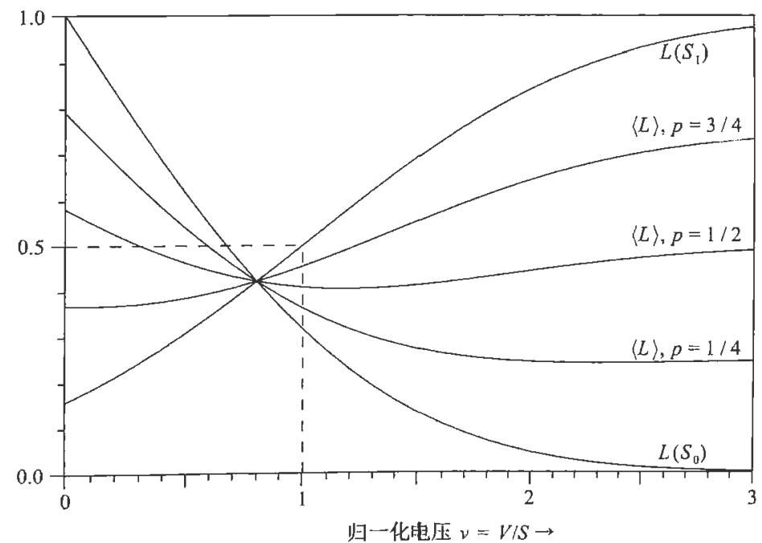

标准，因为它们仅使用抽样分布。沃尔德用抽样论的术语思考，认为很明显，最优策略仅应在可允许的策略中寻找。

沃尔德理论的主要目标是使用数学术语描述可容许策略的类别，以便可以通过执行确定的流程找到所有此类策略。与此相关的基本定理是沃尔德完全类定理，根据此定理得出的结果让抽样理论学家（包括沃尔德本人）感到震惊。伯杰（Berger，1985，第8章）用沃尔德的术语对此进行了讨论。“完全类”一词的定义相当笨拙。沃尔德真正想要的只是所有可容许规则的集合，伯杰称之为“最小完整类”。在沃尔德看来，证明这样的类存在，并找到一种可以构造该类中任何规则的算法是一个非常不平凡的数学问题。

但是在我们看来，这些都是不必要的复杂化，仅仅表明“可容许”一词定义不当。我们将在第17章中回到这个问题，并得出不同的结论：“不可容许”的决策可能比“可容许”的决策具有压倒性的优势，因为可容许性准则忽略了先验信息——即使此信息如此有力，以至于在重大医疗、公共卫生或航空安全领域中，忽略该信息的决策将危及生命，并受到刑事指控。

可容许性的概念在另外一方面也存在缺陷．根据以上定义，一种简单忽略数据的估计规则，只要  $\theta = 5$  在参数空间中是可容许的，就始终估计参数  $\theta^{*} = 5$ 很明显，在这种情况下，几乎所有“不可容许”的规则都将优于“可容许”的规则.

这说明了发明诸如“可容许”和“无偏”这些听起来高深的名字作为准则的愚蠢．这些准则实际上一点也不高深，甚至不完全理性．将来我们应该从中得到教训，并注意使用道德上中立的名称来描述技术状况，这样不至于像这些名称一样产生错误的暗示，可能误导他人数十年.

在实际应用中，我们无论如何都不想（也不能）将自己限制在可容许规则之中，因此我们将不遵循这个颇为复杂的论证方式．我们给出不同的推理方式，从而得出适合现实世界的规则，同时使我们对使用它们的理由有了更好的理解.

是什么使决策过程变得困难呢？如果我们知道哪种自然状态是真的，那就没有问题了．如果  $\theta_{3}$  是真实的自然状态，则最优决策  $D_{i}$  是使  $L_{i3}$  最小的决策．换句话说，一旦确定了损失函数，我们对最优决策的不确定性就完全取决于我们对自然状态的不确定性．最小化  $L_{i3}$  的决策是否最优依赖于：我们相信  $\theta_{3}$  是真实自然状态的信念有多强，以及  $\theta_{3}$  为真有多大的可能性.

对于我们的机器人来说，这似乎是微不足道的一步——实际上只是重新描述一下问题——然后问：“根据所有现有证据，  $\theta_{3}$  是真实自然状态的概率  $P_{3}$  是多少?”抽样理论学家无法这样做，因为他认为“概率”一词与“某一随机试验中的长期相对频率”是同义词．按照这一定义，谈论  $\theta_{3}$  的概率是没有意义的，因为自

然状态不是"随机变量".因此,如果始终如一地坚持抽样论的概率论观点,我们将得出结论:概率论不能应用于决策问题,至少不能用这种直接的方式.

正是这种推理促使统计学家在20世纪初期将参数估计和假设检验问题委托给一个新的领域——统计推断.这一领域被认为与概率论不同,并且基于完全不同的原则.让我们从抽样理论的角度研究一个典型的问题,并了解引入损失函数的概念如何改变结论.

# 13.8 最小损失参数估计

假定有一个未知参数  $\alpha$  ,我们对受此未知参数影响的某个量进行  $n$  次重复观测,得到样本  $x\equiv \{x_{1},\dots ,x_{n}\}$  .我们用符号  $x$  表示  $n$  维"样本空间"中的样本集,并假设单个观测值的可能结果  $x_{i}$  为实数,并且认为该实数是在某区间中的连续变量(  $a\leqslant x_{i}\leqslant b$  ).根据样本  $x$  ,我们能对未知参数  $\alpha$  说些什么呢?我们已经根据从贝叶斯角度出发的作为逻辑的概率论研究了这一问题.现在,我们从抽样论的角度来考虑它们.

为了更透彻地说明问题,假设我们必须根据观察到的样本  $x$  和可能拥有的其他先验信息,选定一个数值作为  $\alpha$  的"最优"估计,然后按照这一估计值似乎为真而行动.这是我们每个人在每天的专业和日常生活中都需要面对的决策情况.驶向无红绿灯的十字路口的汽车驾驶员不能确定地知道他是否有足够的时间安全地驶过马路,但是他仍然被迫根据自己所看到的情况做出决定并采取行动.

很明显,在估计  $\alpha$  时,除非我们能看到  $\alpha$  与  $x$  之间存在某种逻辑(不一定是因果)关系,否则观察到的样本  $x$  对我们并没有用.换句话说,如果我们知道  $\alpha$  但不知道  $x$  ,那么分配给各种可观察到的样本的概率在一定程度上取决于  $\alpha$  的值.如果我们将不同观测值视为独立的,就像参数估计的抽样理论中几乎总是认为的那样,那么抽样密度函数将可以分解为

$$
f(x|\alpha) = f(x_{1}|\alpha)\cdot \cdot \cdot f(x_{n}|\alpha). \tag{13.14}
$$

但是,从决策论的角度来讨论参数估计的一般原理时,这种限制性很强的假设是不必要的(实际上不会导致任何形式上的简化).

假设  $\beta = \beta (x_{1},\dots ,x_{n})$  是某个估计量,即数据值的任意函数,用来作为  $\alpha$  的估计量.同样,假设  $L(\alpha ,\beta)$  为当  $\alpha$  为真时猜测值为  $\beta$  引起的"损失".那么对于任何给定的估计量,风险是"数据前"的期望损失,即对于已经知道  $\alpha$  的真实值但不知道将观察到什么数据的人的损失:

$$
R_{\alpha}\equiv \int \mathrm{d}x L(\alpha ,\beta)f(x|\alpha), \tag{13.15}
$$

其中  $\int \mathrm{d}x(\mathbf{\xi})$  是指  $n$  重积分

$$
\int \dots \int \mathrm{d}x_{1}\dots \mathrm{d}x_{n}(\mathbf{\xi}). \tag{13.16}
$$

我们可以将这种表示法解释为同时包括连续和离散的情况.在离散情况中,  $f(x|\alpha)$  是狄拉克德尔塔函数的和.

在使用概率的频率定义的人看来,上述说法"对于已经知道  $\alpha$  真实值的人"是具有误导性且不必要的."对于具有一定知识状态的人来说,样本  $x$  的概率"这一概念对于他来说完全是陌生的.他认为  $f(x|\alpha)$  并不是对样本知识状态的描述,而是对事实的客观陈述,认为它是"长期来看"不同样本的相对频率.

不幸的是,严格且始终如一地持这种观点会使得概率论的合法应用变得几乎不存在,因为一个人可能(而且我们大多数人会)在这一领域工作一辈子,却从未真正遇到过实际上知道无数次试验的"真实"极限概率的问题,我们怎么可能获得这种知识呢?确实,除了概率论之外,没有一名科学家能够确定什么是"真正的真实"我们唯一可以肯定地知道的是:我们的知识状态是怎样的.

那么一个人怎么能分配概率等于现实世界中的极限频率呢?在我们看来,认为概率是自然界中真实存在的信念纯属思维投射谬误,真正的"科学客观性"要求我们摆脱这种幻觉,认识到在进行推断时,我们的方程式并没有描述现实,我们在描述和处理的是关于现实的信息.

无论如何,"频率主义者"认为,  $R_{\alpha}$  不仅是当前情况下的"期望损失",而且以概率为1是实际平均损失的极限,这可以通过无限次使用估计值  $\beta$  来逼近,即通过固定值  $\alpha$  重复抽取  $n$  个观察值的样本,此外,找到"对于当前特定样本的最优估计值"的思想对他来说很陌生,因为他认为概率的概念是指样本的集合,而不是单个样本,所以他被迫去寻找"长期来看,平均起来最优"的估计量.

因此,从频率主义者的角度来看,最优估计量似乎将是使  $R_{\alpha}$  最小的估计量.这是一个变分问题吗?估计量的小变化  $\delta \beta (x)$  将以如下大小改变风险:

$$
\delta R_{\alpha} = \int \mathrm{d}x\frac{\partial L(\alpha,\beta)}{\partial\beta} f(x|\alpha)\delta \beta (x). \tag{13.17}
$$

如果我们要求它对于所有  $\delta \beta (x)$  变为0,这将意味着

因此,除了损失函数与估计值  $\beta$  无关的无用情况外,上述问题没有真正的稳定解.如果存在最小风险准则的"最优"估计量,那么它无法通过变分方法找到.

但是,我们可以通过考察损失函数(13.15)的某些特定选择来了解所发生的

事情. 假设我们采用二次损失函数  $L(\alpha , \beta) = (\alpha - \beta)^{2}$ , 则 (13.15) 约化为

$$
R_{\alpha} = \int \mathrm{d}x(\alpha^{2} - 2\alpha \beta + \beta^{2}) f(x|\alpha), \tag{13.19}
$$

或者

$$
R_{\alpha} = (\alpha - \langle \beta \rangle)^{2} + \operatorname {var}(\beta), \tag{13.20}
$$

其中  $\operatorname {var}(\beta) \equiv \langle \beta^{2} \rangle - \langle \beta \rangle^{2}$  是  $\beta$  的抽样 PDF 的方差, 并且

$$
\langle \beta^{n} \rangle \equiv \int \mathrm{d}x [\beta (x)]^{n} f(x|\alpha) \tag{13.21}
$$

是该 PDF 的  $n$  阶矩. 风险 (13.20) 是两个正项的和, 通过最小风险准则所得到的好的估计值应该具有两个性质:

(1)  $\beta = \alpha$

(2)  $\operatorname {var}(\beta)$  最小.

这是抽样理论认为最重要的两个条件. 具有性质 (1) 的估计量称为无偏的 (一般来说, 函数  $b(\alpha) = \langle \beta \rangle - \alpha$  称为估计量  $\beta (x)$  的偏差), 同时具有性质 (1) 和性质 (2) 的估计量被费希尔称为有效的. 现在它通常被称为无偏最小方差 (UMV) 估计量,

在第 17 章中, 我们将研究消除偏差和最小化方差的相对重要性, 并得出克拉默- 拉奥不等式, 该不等式对  $\operatorname {var}(\beta)$  的可能值设置了下限. 就目前而言, 我们关心的只是 (13.17) 不能为给定的损失函数提供任何最优估计量. 抽样理论用于参数估计的方法的缺点在于, 它不能告诉我们如何找到最优估计量, 而只能告诉我们如何比较不同的猜测结果. 这可以通过以下方式来克服: 我们给出沃尔德的完全类定理的一个简单替代版本.

# 13.9 问题的重新表述

虽然很容易明白为什么最小风险准则一定会产生问题, 但是我们无法提供任何构造估计量的一般规则. 对应的数学问题是: 给定  $L(\alpha , \beta)$  和  $f(x|\alpha)$ , 什么函数  $\beta (x_{1}, \dots , x_{n})$  会最小化  $R_{\alpha} 3$ .

尽管这不是一个变分问题, 但它可能有唯一解, 但更根本的困难在于解通常仍将取决于  $\alpha$ . 那么最小风险准则将导致不可接受的情况——即使能从数学上解决最小化问题, 并且对于每个  $\alpha$  值都有最优估计量  $\beta_{\alpha}(x_{1}, \dots , x_{n})$ , 我们也只能在已经知道  $\alpha$  值时使用该结果, 但是这时其实无须估计. 我们将问题弄反了!

这让我们可以明白如何解决问题. 对于  $\alpha$  的特定值询问哪个估计量"最优"是没有用的. 显然, 无论数据是什么, 该问题的答案总是  $\beta (x) = \alpha$ , 但是使用估

计量的唯一原因是  $\alpha$  未知. 因此估计量必须对于允许的  $\alpha$  阈值范围内的所有可能性做出某种加权. 在此阈值范围内, 无论  $\alpha$  的真实值是多少, 它都必须尽量避免损失.

因此, 我们真正需要最小化的是  $R_{\alpha}$  的某种加权平均

$$
\langle R \rangle = \int \mathrm{d}\alpha g(\alpha) R_{\alpha}, \tag{13.22}
$$

其中函数  $g(\alpha) \geqslant 0$ , 以某种方式度量对于  $\alpha$  的各种可能值, 最小化  $R_{\alpha}$  的相对重要性.

采用 (13.22) 作为准则, 问题的数学性质完全改变了. 现在我们有了一个可以解决的变分问题, 它具有表现良好且有用的唯一解.  $\langle R \rangle$  由于任意变化  $\delta \beta (x_{1}, \dots , x_{n})$  引起的一阶变分是

$$
\delta (R) = \int \dots \int \mathrm{d}x_{1} \dots \mathrm{d}x_{n} \left\{\int \mathrm{d}\alpha g(\alpha) \frac{\partial L(\alpha, \beta)}{\partial \beta} f(x_{1}, \dots , x_{n}|\alpha) \right\} \delta \beta (x_{1}, \dots , x_{n}). \tag{13.23}
$$

如果对于所有可能的样本  $\{x_{1}, \dots , x_{n} \}$  有

$$
\int \mathrm{d}\alpha g(\alpha) \frac{\partial L(\alpha, \beta)}{\partial \beta} f(x_{1}, \dots , x_{n}|\alpha) = 0, \tag{13.24}
$$

(13.23) 将独立于  $\delta \beta$  变为 0.

(13.24) 是根据我们的新准则确定"最优"估计量的基本积分方程. 考虑二阶变分, 我们发现如果

$$
\int \mathrm{d}\alpha g(\alpha) \frac{\partial^{2} L}{\partial \beta^{2}} f(x_{1}, \dots , x_{n}|\alpha) > 0, \tag{13.25}
$$

则 (13.24) 产生了一个实际的最小值. 因此获得最小值的一个充分条件是  $\partial^{2} L / \partial \beta^{2} \geqslant 0$ , 这一条件比必要条件要强.

如果我们采用二次损失函数  $L(\alpha , \beta) = K(\alpha - \beta)^{2}$ , 则 (13.24) 变为

$$
\int \mathrm{d}\alpha g(\alpha)(\alpha - \beta) f(x_{1}, \dots , x_{n}|\alpha) = 0, \tag{13.26}
$$

或者说二次损失函数的最优估计为

$$
\beta (x_{1}, \dots , x_{n}) = \frac{\int \mathrm{d}\alpha g(\alpha) \alpha f(x_{1}, \dots , x_{n}|\alpha)}{\int \mathrm{d}\alpha g(\alpha) f(x_{1}, \dots , x_{n}|\alpha)}. \tag{13.27}
$$

但是如果我们将  $g(\alpha)$  解释为先验概率密度, 这只是根据贝叶斯定理所得到的  $\alpha$  的后验 PDF

$$
f(\alpha |x_{1}, \dots , x_{n}, I) = \frac{g(\alpha) f(x_{1}, \dots , x_{n}|\alpha)}{\int \mathrm{d}\alpha g(\alpha) f(x_{1}, \dots , x_{n}|\alpha)} \tag{13.28}
$$

的均值! 这一论证也许比我们给出的任何其他论证方式都更清楚地表明, 为什么贝叶斯定理的数学形式会不可避免地进入参数估计之中.

如果我们使用绝对误差  $L(\alpha ,\beta) = |\alpha - \beta |$  作为损失函数,那么积分 (13.24) 变为

$$
\int_{-\infty}^{\beta}\mathrm{d}\alpha g(\alpha)f(x_{1},\dots ,x_{n}|\alpha) = \int_{\beta}^{+\infty}\mathrm{d}\alpha g(\alpha)f(x_{1},\dots ,x_{n}|\alpha), \tag{13.29}
$$

这表明  $\beta (x_{1},\dots ,x_{n})$  将是  $\alpha$  的后验PDF的中值:

$$
\int_{-\infty}^{\beta}\mathrm{d}\alpha f(\alpha |x_{1},\dots ,x_{n},I) = \int_{\beta}^{+\infty}\mathrm{d}\alpha f(\alpha |x_{1},\dots ,x_{n},I) = \frac{1}{2}. \tag{13.30}
$$

类似地,如果我们采用损失函数  $L(\alpha ,\beta) = (\alpha - \beta)^{4}$ ,则积分 (13.24) 导致估计  $\beta (x_{1},\dots ,x_{n})$  是方程

$$
f(\beta) = \beta^{3} - 3\langle \alpha \rangle \beta^{2} + 3\langle \alpha^{2}\rangle \beta -\langle \alpha^{3}\rangle = 0, \tag{13.31}
$$

的实根,其中

$$
\langle \alpha^{n}\rangle = \int \mathrm{d}\alpha \alpha^{n}f(\alpha |x_{1},\dots ,x_{n},I) \tag{13.32}
$$

是  $\alpha$  的后验PDF的  $n$  阶矩.(方程(13.31)只有一个实根,可以根据以下判别式得到:对于所有实数  $\beta$ ,条件  $f^{\prime}(\beta)\geqslant 0$  只是  $\langle \alpha^{2}\rangle - \langle \alpha \rangle^{2}\geqslant 0.$  )

如果我们取  $L(\alpha ,\beta) = |\alpha - \beta |^{k}$ ,并取极限  $k\rightarrow 0$ ,或者只是取

$$
L(\alpha ,\beta) = \left\{ \begin{array}{ll}0, & \alpha = \beta , \\ 1, & \text{其他}, \end{array} \right. \tag{13.33}
$$

(13.24)告诉我们,我们应该选择  $\beta (x_{1},\dots ,x_{n})$  为"最概然值"或者后验PDF  $f(\alpha |x_{1},\dots ,x_{n},I)$  的众数.如果  $g(\alpha)$  在高似然区域是常数,而在其他地方不太大,那么这只是费希尔提出的最大似然估计.

在这一结果中,我们明白了最大似然估计实际做了什么,以及在什么情况下使用它是合适的.最大似然准则是我们只关心完全正确的情况、一错就全错的准则.这正是我们朝着一个小靶子射击时的情况,即"错过一点跟错过一英里是一样的"但是很明显,只有在极少的特殊情况下,这将是一种理性的行为方式.我们几乎总是关心错误的大小,这时最大似然不是最优的估计准则.

注意在所有情况下,涉及的都是后验PDF,  $f(\alpha |x_{1},\dots ,x_{n},I)$ .我们的"基本积分方程"(13.24)毕竟不是那么深奥,可以看出情况总是如此.它可以同样写成

$$
\frac{\partial}{\partial\beta}\int \mathrm{d}\alpha g(\alpha)L(\alpha ,\beta)f(x_{1},\dots ,x_{n}|\alpha) = 0. \tag{13.34}
$$

但是如果将  $g(\alpha)$  解释为先验概率密度,那么这仅仅是我们要最小化  $L(\alpha ,\beta)$  的期望的陈述:这不是对  $\beta$  的抽样PDF的期望,它始终是对  $\alpha$  的贝叶斯后验PDF的期望!

这里有一个有趣的"殊途同归"的例子.如果抽样理论学家一直思考估计问题,他将发现自己不得不使用贝叶斯主义的数学形式,即使他在意识形态上仍然拒绝贝叶斯理论.但是在得出这些不可避免的结果时,贝叶斯方法具有以下优点:(1)它会立即导致我们得出结论;(2)很明显,它的有效和适用范围远远大于抽样理论学家所认为的范围.仅仅出于简单的逻辑原因,我们也需要贝叶斯主义的数学形式,而这与所有"哪些量是随机的"或"概率的真正含义"等哲学难题无关.

沃尔德的完全类定理使他得出了基本相同的结论:如果  $\theta_{j}$  是离散的,并且我们约定在自然状态中不包含任何已知不可能的  $\theta_{j}$  ,那么可容许策略类就是贝叶斯策略(即在后验PDF上将期望损失最小化的策略)类.如果可能的  $\theta_{j}$  形成一个连续体,则可容许的规则是正常的贝叶斯规则,即贝叶斯规则来自正常的(可标准化的)先验概率.但是很少有人尝试遵循沃尔德的证明.伯杰(Berger,1985)并未尝试展示它,而是给出了一些孤立的特殊结果.

正如伯杰指出的,当人们试图直接从无限参数空间中跳入非正常先验而不是作为正常先验的极限时,有很多数学上的可挑剔之处,但是对我们来说,这样的问题是没有意义的,因为在极端的情况下,可容许性概念本身就是有缺陷的.由于没有考虑任何先验信息,因此必须考虑无限区域的所有点,所得到的奇异数学结果只是一个幻象,在对应的实际问题中没有任何奇异之处,因为先验信息始终会排除无限大区域.

对于给定的抽样分布和损失函数,我们可以简单地说,合乎情理的决策规则只是贝叶斯规则对应于不同的正常先验及其表现良好的极限.这一结论让抽样理论学家(包括沃尔德本人)感到震惊.沃尔德本人曾是冯·米泽斯"集合"概率论的拥护者之一,集合概率论是从心理上引发我们目前在统计学上的"贝叶斯革命"的主要动力.值得称赞的是沃尔德具有理智上的诚实,在看到这一不可避免的结果后,他在最后的著作(Wald,1950)中将可容许决策规则称为"贝叶斯策略".

# 13.10 不同损失函数的影响

由于这里所阐述理论的新特征仅仅在于引入了损失函数,因此通过一些数值示例来了解损失函数如何影响最终结果非常重要.假设先验信息  $I$  和数据  $D$  导致参数  $\alpha$  的后验PDF为

$$
f(\alpha |D I) = k\mathrm{e}^{-k\alpha},\quad 0\leqslant \alpha < +\infty . \tag{13.35}
$$

该PDF的  $n$  阶矩为

$$
\langle \alpha^{n}\rangle = \int_{0}^{+\infty}\mathrm{d}\alpha \alpha^{n}f(\alpha |D I) = n!k^{-n}. \tag{13.36}
$$

对于损失函数  $(\alpha - \beta)^{2}$ , 最优估计量是均值

$$
\beta = \langle \alpha \rangle = k^{-1}. \tag{13.37}
$$

对于损失函数  $|\alpha - \beta |$ , 最优估计值是中值, 由下式决定:

$$
\frac{1}{2} = \int_{0}^{\beta} \mathrm{d}\alpha f(\alpha |D I) = 1 - \mathrm{e}^{-k\beta}, \tag{13.38}
$$

或者

$$
\beta = k^{-1} \ln 2 = 0.693 \langle \alpha \rangle . \tag{13.39}
$$

为了最小化  $\langle (\alpha - \beta)^{4}\rangle$ , 我们应该选择  $\beta$  满足 (13.31), 即  $y^{3} - 3y^{2} + 6y - 6 = 0$ , 其中  $y = k\beta$ . 其实根为  $y = 1.59$ , 因此最优估计量为

$$
\beta = 1.59\langle \alpha \rangle . \tag{13.40}
$$

对于损失函数  $(\alpha - \beta)^{s + 1}$ , 其中  $s$  为奇数, 基本方程 (13.34) 变为

$$
\int_{0}^{+\infty} \mathrm{d}\alpha (\alpha - \beta)^{s} \mathrm{e}^{-k\alpha} = 0, \tag{13.41}
$$

可以简化为

$$
\sum_{m = 0}^{s} \frac{(-k\beta)^{m}}{m!} = 0. \tag{13.42}
$$

在  $s = 3$  的情况下得出 (13.40), 在  $s = 5$  的情况下损失函数为  $(\alpha - \beta)^{6}$ , 我们得到

$$
\beta = 2.025\langle \alpha \rangle . \tag{13.43}
$$

当  $s \rightarrow +\infty$  时,  $\beta$  也无限地增加. 但是最大似然估计是  $\beta = 0$ , 对应于损失函数  $L(\alpha , \beta) = - \delta (\alpha - \beta)$ , 或等于

$$
\lim_{k \rightarrow 0} |\alpha - \beta |^{k}. \tag{13.44}
$$

这些数值示例只是说明了在直观上已经清楚的内容. 当后验 PDF 没有尖峰时, 对  $\alpha$  的最优估计在很大程度上取决于我们使用的特定损失函数.

人们可能会认为损失函数一定总是误差  $|\alpha - \beta |$  的单调递增函数. 当然, 通常是这样的. 但是理论上并没有任何东西让我们一定局限在这种函数上. 你可以想到一些令人沮丧的情况, 其中你宁愿选择犯大错误而不是小错误. 威廉·退尔的例子就是这样. 如果研究这种情况的方程, 你会发现实际上根本没有非常令人满意的决策 (即没有一种决策的期望损失很小), 而且人们对此无能为力.

注意,在损失函数的任何正常线性变换下,决策规则都是不变的。即如果损失函数是  $L(D_{i},\theta_{j})$  ,那么无论先验概率和数据怎样,新的损失函数

$$
L^{\prime}(D_{i},\theta_{j})\equiv a + b L(D_{i},\theta_{j})\left\{ \begin{array}{c}{{-\infty< a< +\infty,}}\\ {{0< b< +\infty,}} \end{array} \right. \tag{13.45}
$$

都将导致相同的决策。因此,在二元决策问题中,给定损失矩阵

$$
L = (L_{ij}) = \begin{pmatrix} 10 & 19 \\ 100 & 10 \end{pmatrix} \tag{13.46}
$$

我们同样可以使用

$$
L^{\prime} = (L_{ij}^{\prime}) = \begin{pmatrix} 0 & 1 \\ 10 & 0 \end{pmatrix} \tag{13.47}
$$

这对应于  $a = - 10 / 9$ ,  $b = 1 / 9$ 。这可以大大简化期望损失的计算。

# 13.11 通用决策论

前面我们仅通过一种特定的应用参数估计来研究决策论,但是实际上已经掌握了整个流程。用于构造最优估计量的准则(13.34)可以推广到寻找任何种类的最优决策的准则。最终的规则很简单,解决推断问题需要四个步骤。

(1)视情况列举出离散的或连续的所有自然状态  $\theta_{j}$

(2)分配先验概率  $p(\theta_{j}|I)$ ,这些概率表示你所拥有的关于自然状态的任何先验信息  $I$ 。

(3)分配抽样概率  $p(E_{i}|\theta_{j})$ ,该概率表示你对获得可能数据集  $E_{i}$  的测量过程物理机制的先验知识。

(4)通过应用贝叶斯定理,对任何其他证据  $E = E_{1}E_{2}\dots$  进行归纳,得到后验概率  $p(\theta_{j}|EI)$ 。

这就是解决所有推断问题的步骤, $p(\theta_{j}|EI)$  表示先验信息和数据中包含的所有关于  $\theta_{j}$  的信息。为了解决决策问题,还需要三个步骤。

(5)列举可能的决策  $D_{i}$ 。

(6)确定损失函数  $L(D_{i},\theta_{j})$ ,该函数会告诉你要完成的工作。

(7)以该决策使  $\theta_{j}$  的后验概率上的期望损失最小的原则做出决策  $D_{i}$ 。

归根结底,根据考克斯、沃尔德和香农的定理所得出的最终计算规则只是拉普拉斯和丹尼尔·伯努利在18世纪已经基于直觉给出的那些规则,除了最大熵原理推广了步骤(2)中的无差别原则。

从理论上讲, 这些规则现在由合理性和一致性的基本定性合情条件唯一确定. 有人可能会反对说他们没有任何先验概率或损失函数. 该定理是说合理性和一致性要求你表现得就像拥有它们一样. 对于每个遵循合情条件的策略, 都有一个先验概率和损失函数会导致该策略; 相反, 如果一种策略是从某种先验概率和损失函数中得出的, 则可以确保符合合理性和一致性合情条件.

从实用角度来说, 这些规则包括或改进了用于假设检验和点估计的几乎所有已知的统计方法. 如果你掌握了这些知识, 那么你就几乎已经掌握了整个领域. 它们的突出特点在于其直观性和简单性——如果我们撇开过去困扰该领域的所有争论与错误, 而只考虑直接导致这些规则的建设性论证过程, 那么显然其理论基础可以在一学期的本科课程中得到充分讲述.

然而, 尽管规则本身在形式上很简单, 但要在复杂问题中方便地应用它们, 涉及的复杂数学知识和精细概念是如此之多, 以至于该领域的几代工作者都错误地使用了它们, 并得出结论说这些规则都是错误的, 因此我们仍然需要大量的引导才能发展出使用该理论的工具. 这就像学习演奏乐器一样, 任何人都可以用乐器制造噪声, 但是要想很好地演奏该乐器则需要多年的练习.

# 13.12 评注

# 13.12.1 决策论的“客观性”

决策论在讨论统计的逻辑基础时具有独特的地位, 因为正如我们在 (13.24) 和 (13.34) 中所看到的那样, 决策过程可以从关于概率论本质的两种截然相反的角度中得出. 尽管大家似乎对于应该遵循的实际过程有普遍的共识, 但对于其根本原因仍然存在根本分歧, 根源在于频率与非频率的概率定义的老问题.

从实际的角度来看, 这些考虑起初看起来并不重要, 但是在尝试将决策论应用于实际问题的过程中, 人们很快认识到这些问题在以数学方式构建问题的初始阶段就已经介入了. 特别是我们对决策论的普遍性与有效性范围的判断取决于如何解决这些概念性问题. 我们的目标是阐明这样的视角, 使得根据这一视角导出的方法具有最大可能的应用范围.

这样, 我们发现这里争论的主要根源在于先验概率的问题. 从抽样论的角度来看, 如果问题涉及使用贝叶斯定理, 那么除非先验概率是已知频率, 否则这种方法并不适用. 但是, 坚持这一立场将意味着合法应用的范围将受到极大的限制; 确实, 我们怀疑是否存在一个真正实际的问题, 其中先验概率是已知频率. 但是, 最终方程式的数学形式能否使得这个问题被充分理解呢?

首先请注意 (13.24) 和 (13.34) 中仅涉及乘积  $g(\alpha)L(\alpha ,\beta)$ , 因此我们可以用三种不同的方式来解释.

(1)先验概率为  $g(\alpha)$ , 损失函数为  $L(\alpha ,\beta) = (\alpha -\beta)^{2}$ .

(2)我们有均匀先验概率,损失函数为  $g(\alpha ,\beta) = g(\alpha)(\alpha -\beta)^{2}$ .

(3)先验概率为  $h(\alpha)$ , 损失函数为  $g(\alpha)(\alpha -\beta)^{2} / h(\alpha)$ .

对于这三种解释方式, 最优决策是一样的. 对于任何损失函数同样都可以做类似的不同解释.

我们之所以强调这一看似微不足道的数学事实是因为注意到了一种奇怪的心理现象. 从抽样论角度对决策论进行阐述 [例如, 切尔诺夫和摩西 (Chernoff & Moses, 1959) 的观点] 时, 作者不愿引入先验概率的概念. 他们尽可能地推迟这一过程, 直到在数学上, 他们认识到先验概率是在不同可容许决策规则中进行选择的唯一基础时, 才会最终让步. 即使那样, 他们对使用先验概率仍然不满意, 以至于他们总是需要发明一种 (通常是高度人为的) 情况, 使得先验概率看起来像是频率. 他们不会将这种理论用于他们不明白该如何这样做的任何问题.

但是, 这些作者会毫不犹豫地凭空引入随意的损失函数, 并继续进行计算! 我们的方程表明, 如果最终决策很强地依赖于使用的先验概率, 那么它将同样强烈地依赖于所使用的特定损失函数. 如果人们担心先验概率的随意性, 那么为了保持一致, 人们应该同样担心损失函数的随意性. 如果有人主张 (正如抽样理论学家已经做了几十年, 现在仍然有人这么做一样), 先验概率选择的不确定性使得拉普拉斯- 贝叶斯理论变得无效, 那么为了保持一致, 他还必须主张损失函数选择的不确定性使得沃尔德的决策论变得无效.

产生这种奇怪的偏心态度的原因在某种程度上与被称为行为主义或实证主义的哲学密切相关. 这种哲学希望我们将陈述和概念限制在可客观验证的事物内. 因此, 可观察的决策是被强调的事情, 而合情推理的过程和根据先验概率所做出的判断则必须弃置不用. 但是我们看不出有什么这么做的必要性, 因为在我们看来, 理性行动显然只能是理性思考的结果.

我们如果仅仅由于它不是"客观的"而拒绝考虑理性思考的问题, 就不会获得一种更具"客观"的推断或决策理论. 结果将是我们根本不能得到任何令人满意的理论, 因为我们拒绝了任何描述在决策过程中实际发生过程的方式. 而且, 损失函数当然也只是纯粹主观价值判断的表述, 绝不能认为它比先验概率更具"客观性".

实际上, 无论是在数学理论还是在日常现实决策问题中, 先验概率通常比损

失函数更具"客观性"。在数学理论中,我们具有通用形式原则——最大熵、变换群、边缘化——来消除许多重要问题中先验概率的随意性,其中包括教科书中讨论的大多数问题。但是我们没有确定损失/效用函数的此类原则。

这并不是说这个问题没有被讨论过。德格罗特(de Groot,1970)指出,很弱的抽象条件(偏好的可传递性等)足以保证效用函数的存在。很久以前,吉米·萨维奇考虑过通过反思构造效用函数的问题。切尔诺夫和摩西(Chernoff & Moses,1959)对此进行了描述:假设存在两种可能的回报  $r_{1}$  和  $r_{2}$ ,那么对于怎样的回报  $r_{3}$ ,你将不会区分(肯定得到  $r_{3}$  的回报)和(由抛硬币决定的  $r_{1}$  或  $r_{2}$  的回报)之间的区别?大概这样的  $r_{3}$  在  $r_{1}$  和  $r_{2}$  之间。如果人们做出足够直观的判断并设法纠正所有的不可传递性,就会产生一种粗略的效用函数。伯杰(Berger,1985,第2章)给出了发生这种情况的场景。

但是,这几乎不是一种实际的流程,更不用说是正式的原则了,结果就像徒手画一条曲线一样随意。的确,徒手画要容易得多,并且不会陷入不可传递性的困难。当然,人们可以像吉米·萨维奇经常表明的那样,用同样的方法发明一种粗糙的先验。这种构造出的先验,如果能传送到计算机中,总比没有好。但是它们显然是不得已而为之的行为,不能代替真正令人满意的形式理论,例如我们对于根据最大熵和变换群构建先验的原理。

注意到决策仅取决于损失函数与先验的乘积,这初看起来似乎有一种吸引人的可能性。我们是否可以简化该理论的基础,使得显然只需要一种函数?我曾对此进行了一段时间的思考,但最终认为这不是未来的正确发展方向,因为(1)先验和损失函数在数学理论和"实际"中都发挥着非常不同——几乎是相反——的作用,(2)涉及先验的推断理论比损失函数的理论更为基础,后者需要进一步发展,才能与先验结合成单个数学量。

是什么决定了这一理论的有效性?我们会毫不犹豫地说是"逻辑一致性"。但是,长期存在的一种错误是,根据人们是否真的一致地进行推理来判断,如果常人并不总是这样推理,那么该理论就被认为是无效的。这在我们看来是一种倒退。一致性才是人们在现实世界中应努力追求的标准目标。

一些作者在探讨决策论时遇到了更为陌生的问题。吉米·萨维奇(L.J.Savage,1954)面临了许多莫名其妙的困难。他认为(第16页)谚语"三思而后行"和"船到桥头自然直"是矛盾的。我们觉得我们通常会遵从这两者,并且看不到它们之间有什么冲突。也就是说,我们不会不考虑可能的后果就采取行动;但是与此同时,我们也不会浪费时间和精力来为未来极不可能发生的偶然事件做准备。

沃尔德的原始表述遵循正统统计的思路,认为在看到数据之前,我们需要对

每种可能的意外情况进行事先考虑，并列出在获取所有可能的数据集之后要做出的决定。这样做的问题在于这种数据集的可能数量通常是天文数字，没有人拥有执行此操作所需的计算能力。但是吉米·萨维奇（L. J. Savage，1954）认为，事先为每种可能的意外事件进行规划是决策论的正确流程，因为正统统计实践仅限于一小类简单的人为问题。我们采取的是完全相反的观点：通过延迟决策到我们知道实际数据之后，才有可能从根本上解决复杂的问题。合乎情理的推断是数据后推断。

正如切尔诺夫和摩西（Chernoff & Moses，1959）非常有说服力地说明的那样，贝叶斯方法使我们避免这么做．无论实际观察到的数据集是什么，我们都将其输入到计算机程序中，并为该数据集计算恰当的响应．为没有观察到的任何数据集计算响应既浪费时间又没有紧要．这不是小事，在紧要关头涉及的计算量可能有数量级的不同．因此，我们要在格言列表中添加“除非必要，永远不要做出不可撤销的决定”

# 13.12.2 人类社会中的损失函数

我们注意到，在人类关系中，先验概率与损失函数的作用形成了鲜明的对比因为对世界和生活的看法基本相同，具有相似先验概率的人们相处融洽．先验概率截然不同的人无法相处，这是历史上不少战争的根本原因.

损失函数的作用恰恰相反．具有相似损失函数的人都追逐着同一个目标，并且彼此竞争．具有不同损失函数的人相处得很好，因为每个人都愿意付出对方想要的东西．对所有人都有利的友好贸易或商业交易只有在损失函数截然不同的交易方之间才有可能．我们之前通过保险的例子说明了这一点.

在“现实生活”的决策问题中，每个人都非常清楚自己的先验概率是什么，并且由于他的信念基于他过去的所有经验，很难被一点儿更多的经验轻易改变，因此相当稳定．但是，在激烈的争辩中，他可能看不清自己的损失函数.

因此，劳动仲裁者必须与意识形态截然相反的人打交道．一方认为是好的政策可能被另一方认为是邪恶的．成功的调解人会意识到，仅仅通过交谈不会改变双方原有的信念．因此，他的角色必须是将双方的注意力转移到该领域之外，并向每个参与者清楚地解释其损失函数．从这种意义上讲，我们可以断言，在现实生活的决策问题中，损失函数通常比先验概率更具“主观性”（从它在我们脑海中固定程度较低的意义上来说）

确实，无法正确判断自己的损失函数是人类面临的主要危险之一．有了一点儿智能，人们就能从自己的想象中创造出神话，并相信它们．更为糟糕的是，一些

灾难性黑暗历史表明,一个人可能会说服成千上万的人相信他自己的个人神话。

我们认为这些考虑与其他社会问题有关。例如,一些心理学家总是不遗余力地试图从罪犯幼儿期的经历来解释其犯罪行为。可以想象,这可能会产生某种普遍的犯罪"倾向",但是具有相同经历的绝大多数人不会成为犯罪分子这一事实表明,一定存在更重要和直接的原因。犯罪行为可能有一个更简单的解释:推理能力差,导致错误地感知到损失函数。不论幼儿期的经历如何,守法公民的动机与罪犯是一样的。我们所有人都有可能会感到实施抢劫、攻击或谋杀的冲动。不同的是,罪犯没有足够的前瞻思考能力来想到其行为的可预见后果。大多数暴力犯罪分子的智商非常低,我们对此并不感到惊讶。

无法感知自己的损失函数可能以其他方式给个人带来灾难性的后果。考虑一下拉马努金的例子。在特定领域中,拉马努金被认为是有史以来最伟大的数学天才之一。他32岁去世可能是由他自己荒谬的饮食观念所致。他拒绝吃剑桥三一学院食堂提供的食物(尽管这无疑比他来英国之前吃过的任何食物更有益健康),并试图靠从印度运来的没有冷藏的烂水果维持生活。

一个惊人的相似例子是库尔特·哥德尔。许多人认为他是所有逻辑学家中最伟大的——当然也是最著名的。他在一家拥有最好食物供应的医院里饿死了,因为他沉浸于医生试图毒死他的想法。令人感到奇怪的是,有时最伟大的天才却无法感知对傻瓜来说也是显而易见的简单现实。

我们强调,现实世界比沃尔德的理论所假设的要复杂得多,而且许多现实的决策问题也未涵盖在其中。例如,明天的自然状态可能会受到我们今天决策的影响(就像人们决定接受教育一样)。认识到这一点是朝着博弈论或动态规划方向迈出的一步。但是,处理此类问题并不需要脱离作为逻辑的概率论原理,而只需要对我们的以上做法进行推广。

实际上,人类的直觉在做出看似没有理性依据的决策时表现良好。根本没有数学理解能力的人仍然可以做出明智的决定。"直觉"可能利用了人们并不了解的深藏在潜意识中的事实和记忆。但是如果没有数学上的理解,它也可能导致灾难性的失败。例如,有一些尝试将概率论和决策论运用于提升运动成绩的策略中的有趣例子,说明人们可以通过将一点儿数学知识与大量迷信相结合而生成谬论。马乔尔、拉达尼和莫里森的著作(Machol, Ladany & Morrison, 1976)包含很多这方面的案例。

# 13.12.3 杰弗里斯先验的新视角

我们注意到,最优决策仅取决于先验概率和损失函数的乘积,这能引发一些其他的思路.正如我们在第12章中提到的那样,杰弗里斯(Jeffreys,1939)提出,在已知连续参数  $\alpha$  为正的情况下,我们应该不是通过均匀先验而是  $1 / \alpha$  成比例的先验来表达先验无知的.长期以来,我们并不清楚该规则的理论依据,但它在实践中会产生非常合理的结果,这导致杰弗里斯在他的显著性检验中将其作为基础.

我们曾经了解到,在  $\alpha$  是尺度参数的情况下,杰弗里斯先验是由尺度变换群下的不变性唯一确定的,但是现在我们可以看到一个完全不同的理由.如果在已知  $\alpha$  为正数时使用绝对误差损失函数  $|\beta - \alpha |$  ,那么在(13.24)和(13.34)中分配 $g(\alpha) =$  常数等于说我们对于  $0< \alpha < +\infty$  的所有  $\alpha$  值需要一个尽可能产生常数绝对精度的估计量.显然,这对于较大的  $\alpha$  要求太高,并且我们必须为小  $\alpha$  付出较差估计的代价.但是,杰弗里斯后验分布的中值在数学上与用于均匀先验和损失函数  $|\beta - \alpha | / \alpha$  的最优估计量相同,我们要求在所有  $\alpha$  值上尽可能地保持常数的百分比精度.当然,这是在我们在知道  $0< \alpha < +\infty$  的大多数情况下想要的.如果我们重新解释说  $1 / \alpha$  因子是损失函数的一部分,那么就可以清楚地看出杰弗里斯规则具有良好表现的另一个原因.这仅要求  $\alpha$  为正数,而不一定是比例参数,这正是杰弗里斯最初所说的.

# 13.12.4 决策论并不基础

在这里所阐述的理论中,哪些将是人类思维的永久部分,哪些将来可能演变为不同的形式?对此我们只能推测,但是我很清楚,这里发展的推断方法中有必要且永恒的成分:不仅是在第1章和第2章中解释的它们令人信服的理论基础,①而且是在以后所有各章中它们在实践中所表现出的解决问题的优美方式——无论我们问什么问题,它们总是给出正确的答案.而正统方法似乎同样可能给出合情合理或无意义的结果——这使我们相信,这些方法的表现不可能有任何实质性的改变.

但是,对于这些方法的基础的看法可能会改变,例如,正如泽尔纳的工作(Zellner,1988)所建议的那样,未来的工作者可能会选择最优信息处理,而不是逻辑上的一致性作为合情条件.确实,更普遍的认识是,推断从根本上与"随机性"或"机会"无关,而与信息的最优处理有关,这种看法将带来许多好处.我们在第2章结尾处指出,一旦我们意识到数学的信息处理方面,哥德尔定理将是一种老生常谈而不是悖论.

但是, 我们无法对推断的决策论补充感到如此确定. 首先, 当前的许多应用已经需要扩展博弈论、动态规划或其他方面. 自然状态可以由另一个人选择, 或者可能无须有意识中介的干预受到我们决策的影响. 可能涉及两个以上的中介, 他们可能是敌人或朋友. 这些比我们在这里考虑的情况更为复杂. 我们认为这样的扩展不适用于当前的科学推断主题, 因为我们不认为自己是在与大自然对抗. 但是, 未来的科学家可能会找到考虑更一般理论的充分理由.

出于本章中提到的原因, 现在看来, 从根本上讲, 损失函数没有先验概率那么牢固的基础. 这与 20 世纪 50 年代沃尔德受启发发展决策论时的观点恰好相反, 当时先验概率被认为含糊不清、没有良好定义, 但似乎没有人注意到损失函数更是如此. 出于我们无法解释的原因, 损失函数对于那时的工作者来说似乎是"真实"和确定的. 尽管没有给出确定损失函数的原则, 除了如果我们检查一个足够小的区域, 则具有连续导数的函数看起来都是线性的老套原则之外.

与此同时, 通过先验信息的逻辑分析来分配先验的技术已经取得了若干进展. 但是, 据我们所知, 我们还没有正式的原则来确定损失函数. 即使是纯粹的经济标准也不行, 因为货币的效用仍然没有良好定义.

# 13.12.5 另一维度?

损失函数还有一个方面没有先验概率那样具有牢固基础. 我们认为推断中的"客观性"是一个重要方面——几乎是一种道德原则——我们不应让自己的观点受到欲望的影响, 我们相信的东西应该独立于我们想要的东西. 但是反过来不一定正确. 反思一下, 我们可能会同意, 我们想要的东西在很大程度上取决于我们知道什么, 我们对于这种陈述不会觉得有什么不一致或不理性的地方. ①

确实, 很明显, 分配损失函数的行为本身仅仅是描述有关所感兴趣现象的某些先验信息的一种手段, 现在关注的不仅仅是其合情性, 而且还包含其后果. 因此, 影响先验概率的先验信息的变化也很可能引起损失函数的变化.

但是, 在承认了这种可能性之后, 价值判断似乎不需要以损失函数的形式引入. 在第 1 章末尾, 我们已经指出未来人类心理活动的"多维"模型的可能性. 根据上述考虑, 现在似乎朝着这个方向的新发展敞开了大门. 代表一个命题或行动的精神状态, 不是像现在的概率论那样, 只由一个坐标 (合情性) 来表示, 而是由两个坐标 (合情性和价值) 来表示. 因此, 虽然"一维"推断的原理似乎是永

恒的, 但是在未来仍然可以在价值判断的表示中有许多变化, 而这些变化根本不需要类似于当前的决策论. 但这反过来又对概率论的基础问题做出了回应.

托马斯·贝叶斯 (Thomas Bayes, 1763) 认为有必要从期望的角度解释概率的概念, 这一概念一直延续到近代沃尔德 (Wald, 1950) 和德菲内蒂 (de Finetti, 1972, 1974b) 的工作. 乍一看, 德菲内蒂关于概率论基础的工作似乎和沃尔德的决策论在形式上非常不同. 然而, 这两种理论都通往贝叶斯方法的共同前提是认为价值判断在某种程度上是推断的基础.

德菲内蒂将概率论建立在"连贯性"概念的基础上, 这意味着在博弈中人们应该表现得好像他为所博弈的事件 (掷骰子等) 分配了概率, 但是应该选择这些概率, 以便无论这些事件的最终结果如何, 他都不会确定地成为失败者.

包括作者在内的一些人似乎总是反对将概率论建立在诸如赌博、期望收益之类的庸俗事物上. 我们认为逻辑原理应该在一个更高的层面上. 但这仅仅是一种基于美学的直觉. 现在, 在认识到损失函数的不确定性和暂时性后, 我们有更充分的理由不将概率论建立在决策或赌博的基础上. 在实践中, 任何被认为是连贯但不一致的规则都将无法使用, 因为一个正常提出的问题将有多个"正确"答案, 而且没有选择的方式. 我们认为, 这是理查德·考克斯方法优越性的另一个方面, 后者强调逻辑一致性, 正因为如此, 它更有可能在概率论中具有持久的地位.

# 第14章 决策论的简单应用

现在,我们将详细研究前面建立的一般决策理论的两个最简单的应用,并将第一个应用与老的奈曼- 皮尔逊方法进行比较.从噪声中检测信号的问题与拉普拉斯在天体力学中检测未知的系统性影响问题,以及休哈特(Shewhart,1931)在工业质量控制中检测机器特性的系统性漂移问题实际上是相同的.统计学家将该流程称为"显著性检验".不幸的是,这些问题的基本性质没有被广泛地意识到,它迫使几个不同领域的工作者们一再去重新发现相同的事情——取得了不同程度的成功.

我们现在很清楚,要解决此问题,要做的只是采用第2章和第4章中提出的推断原理,并为它们补充损失函数的准则,以将概率转化为最终决策(如果需要,可以通过最大原理分配先验).但是,这一领域的很多文献是在意识到这一点之前从原始决策论的视角出发的.因此,现有文献使用的词汇和概念与我们到目前为止使用的词汇和概念有所不同.既然这方面的文献已经存在,那么如果想阅读它们,我们别无选择,只能学习这些文献中的术语和观点.这方面的材料出现在米德尔顿和范米特的文章(Middleton&VanMeter,1955,1956)以及米德尔顿具有里程碑意义的论文(Middleton,1960)中.这些材料非常多,初学者可能会在其中迷失数月,找不到真正的基本原理.因此,我们需要对20世纪50年代关于这些问题的文献进行非常简要的回顾,为了得到完整、自足的概述,我们将重复前几章中的一些内容,以引人这种不同的语言.

# 14.1 定义和基础

我们使用以下记号:

$p(A|B) =$  给定  $B$  时  $A$  的条件概率, (14.1)  $p(A B|C D) =$  给定  $C$  和  $D$  时,  $A$  和  $B$  的联合条件概率,等等. 对于我们而言,一切都可以根据以下乘法规则得到:

$$
p(A B|C) = p(A|B C)p(B|C) = p(B|A C)p(A|C). \tag{14.2}
$$

如果命题  $B$  和  $C$  不相互矛盾,则以上式子可以重新排列,以得出"经验学习"规则(贝叶斯定理):

$$
p(A|B C) = p(A|C)\frac{p(B|A C)}{p(B|C)} = p(A|B)\frac{p(C|A B)}{p(C|B)}. \tag{14.3}
$$

如果存在几个互斥且穷尽的命题  $B_{i}$ ,则对(14.2)求和将获得链式法则

$$
p(A|C) = \sum_{i} p(A|B_{i}C) p(B_{i}C), \tag{14.4}
$$

或者,使用更简单的记号表示为

$$
p(A|C) = \sum_{B} p(A|B C) p(B|C). \tag{14.5}
$$

现在定义

$X =$  任何形式的先验知识,

$S =$  信号,

$N =$  噪声, (14.6)

$V = V(S, N) =$  观察电压,

$D =$  关于信号性质的决策.

那么我们有

$$
\begin{array}{r l} & {p(S|X) = \mathbb{H}\mathbb{H}\mathbb{H}\mathbb{H}\mathbb{H}\mathbb{H}\mathbb{H}\mathbb{H}\mathbb{H}\mathbb{H}\mathbb{H}\mathbb{H}\mathbb{H}\mathbb{H}\mathbb{H}\mathbb{H}\mathbb{H}\mathbb{H}\mathbb{H}\mathbb{H}\mathbb{H}}\\ & {p(N|X) = W(N) = \mathbb{H}\mathbb{H}\mathbb{H}\mathbb{H}\mathbb{H}\mathbb{H}\mathbb{H}\mathbb{H}\mathbb{H}\mathbb{H}\mathbb{H}\mathbb{H}\mathbb{H}\mathbb{H}\mathbb{H}\mathbb{H}\mathbb{H}\mathbb{H}\mathbb{H}\mathcal{H}\mathbb{H}\mathbb{H}\mathbb{H}\mathbb{H}\mathbb{H}\mathbb{H}\mathbb{H}\mathbb{H}\mathbb{H}\mathbb{H}\mathbb{H}\mathbb{H}\mathbb{H}\mathbb{H}\mathbb{H}\mathbb{H}\mathbb{H}\mathbb{H}\mathbb{H}\mathcal{H}} \end{array} \tag{14.7}
$$

我们知道,不管我们是否明确写出,先验信息  $X$  始终存在于所有概率符号的右侧.因此,在线性系统中,  $V = S + N$  并且

$$
p(V|S) \equiv p(V|SX) = W(V - S). \tag{14.8}
$$

读者可能会为其中缺少密度函数  $\mathrm{d}S$ 、 $\mathrm{d}N$  等感到困扰.他们可能会觉得在  $S$ 、 $N$  连续的情况下应该有它们.但是请注意,我们的方程对于这些量是齐次的,因此它们会相互抵消.我们只是在试图传达基本的概念,而无须使得记号非常精确.因此,记号  $\sum_{A}$  的意义:如果  $A$  是离散的,是指对可能值求和;如果  $A$  是连续的,则是对恰当密度函数的积分.

决策规则  $p(D_{i}|V_{j})$  或者简单记号  $p(D|V)$  表示根据观察到的电压推断信号的过程.如果决策始终以确定的方式产生,则对于  $D$  和  $V$  的任何选择,  $p(D|V)$  只能具有值0和1,但是我们也可能有"随机"的决策规则,其中  $p(D|V)$  是真实的概率分布.保持这种更普遍的观点对构建理论是有帮助的.

任何决策规则——尤其是任何可以内置到自动化装置中的决策规则——的核心都是必须仅仅基于  $V$  得到.根据定义,  $V$  是包含了在做出决策时实际使用的所有信息(除了永远存在的  $X$  之外)的量.因此,如果  $Y \neq D$  是任何其他命题,我们有

$$
p(D|V) = p(D|VY). \tag{14.9}
$$

在存在  $V$  的情况下可以忽略  $Y$  的事实,可能与我们先前的忠告——即希望机器人始终考虑其拥有的所有相关信息——有所偏离。但是,如果我们认为性质 (14.9) 是先验信息  $X$  的一部分,则这里没有任何矛盾。换句话说,(14.9)表达了存在  $D$  唯一地由  $V$  确定的逻辑关系的先验知识。如果这种关系是已知的物理定律,那么 (14.9)没有什么可奇怪的。唯一的区别是,在当前情况下,这种关系不表示任何自然法则,而是表示我们自己对于自动化装置的设计。那么忽略  $Y$  并不是因为机器人放松了规则,而是因为我们的设计使得  $Y$  变得无关。

一种等价的陈述是,做出决策  $D$  的概率,仅仅通过  $Y$  对  $V$  的直接作用依赖于任意命题  $Y$

$$
p(D|Y) = \sum_{V} p(D|V) p(V|Y), \tag{14.10}
$$

这是逻辑上的"惠更斯原理"。为了进行类比,可以将  $Y$  视为  $D$  不能直接看到的光源,但是  $Y$  照亮了各个点  $V$ 。那么最终到达  $D$  的光是振幅为  $p(V|Y)$  的惠更斯小波  $p(D|V)$  之和。在条件信息流和光学中遵从惠更斯原理的光流之间的几乎精确的数学类比出现在不可逆过程的统计力学中。

# 14.2 充分性和信息

(14.9)能产生有趣的结论。假设我们希望根据  $V$  和  $D$  的知识来判断某个命题  $Y$  的合情性。根据乘法规则 (14.2),

$$
p(DY|V) = p(Y|VD) p(D|V) = p(D|VY) p(Y|V), \tag{14.11}
$$

使用 (14.9) 可以简化为

$$
p(Y|VD) = p(Y|V). \tag{14.12}
$$

因此,如果  $V$  是已知的,则  $D$  的信息是多余的,无法帮助我们估计任何其他量。反过来却并非如此。我们同样可以通过另一种方式使用 (14.9):

$$
p(VY|D) = p(Y|VD) p(V|D) = p(Y|D) p(V|YD). \tag{14.13}
$$

结合 (14.12),可以得到以下定理:

# 定理

给定  $V$  ,令  $D$  是一种可能的决策,那么  $p(V|D)\neq 0$  且

$$
p(V|D) = p(V|YD) \tag{14.14}
$$

用语言描述是:给定  $D$  ,当且仅当  $Y$  与对  $V$  的判断无关时,  $D$  的知识与  $V$  的知识是等价的。换种说法是:在  $D$  的知识所产生的"环境"中,  $Y$  和  $V$  的概率

是独立的, 即

$$
p(Y V | D) = p(Y | D) p(V | D). \tag{14.15}
$$

在统计学文献中, 这时  $D$  被认为是用于判断  $Y$  的充分统计量. 我们想知道这是否与在第 8 章中根据完全不同的视角提出的关于充分性的早期定义一致.

显然, 使  $D$  成为判断信号  $S$  的充分统计量的决策规则优于不具有此性质的决策规则, 因为前者可以告诉我们关于信号的更多信息. 但是, 这样的规则不一定存在. (14.15) 是一个非常严格的条件, 因为它必须对于所有  $Y, V$  值以及所有  $p(D | V) \neq 0$  的  $D$  成立.

你可能会由此猜想到, 充分性的概念与信息的概念紧密相关. 以上充分性定义可以等价地陈述为: 如果  $D$  包含  $V$  中所有有关  $Y$  的信息, 那么  $D$  对于  $Y$  的判断是充分统计量. 由于  $D$  是根据  $V$  确定的, 如果它不是充分统计量, 则它一定包含比  $V$  少的有关  $Y$  的信息. 在此陈述中, "信息"一词是在松散的直观意义上使用的. 如果我们采用香农的信息度量, 这仍然适用吗?

假设有若干互斥的命题  $Y_{i}$ , 其中一定有一个为真. 为简洁起见, 如上所述, 我们使用记号  $\sum_{Y} f(Y) \equiv \sum_{i} f(Y_{i})$ . 在给定  $D$  的条件下, 衡量我们关于命题  $Y_{i}$  的信息的确是

$$
H_{D}(Y) = -\sum_{Y} p(Y | D) \ln [p(Y | D)]. \tag{14.16}
$$

对于所有  $D$  值, 其期望为

$$
\overline{H}_{D}(Y) = \sum_{D} p(D | X) H_{D}(Y). \tag{14.17}
$$

如果

$$
\overline{H}_{C}(Y) < \overline{H}_{D}(Y), \tag{14.18}
$$

我们通常会说"平均而言",  $C$  比  $D$  包含更多关于  $Y$  的信息. 但是请注意, 对于  $C$  和  $D$  的特定值而言, 结论可能是相反的.

获取新信息永远不会增加  $\overline{H}$ . 现在假定  $\{Z_{i}\}$  是任何命题集合且形成表达式

$$
\begin{array}{r l} & {\overline{{H}}_{V}(Z) - \overline{{H}}_{D V}(Z) = \sum_{D V Z}p(D V|X)p(Z|D V)\ln [p(Z|D V)]}\\ & {\qquad -\sum_{V Z}p(V|X)p(Z|V)\ln [p(Z|V)]}\\ & {\qquad = \sum_{D V Z}p(D V|X)p(Z|D V)\ln \left[\frac{p(Z|D V)}{p(Z|V)}\right].} \end{array} \tag{14.19}
$$

利用对于正实数  $x$  有  $\ln x \geqslant 1 - x^{- 1}$  且当且仅当  $x = 1$  时等号成立的事实,这变成

$$
\overline{H}_{V}(Z) - \overline{H}_{DV}(Z) \geqslant \sum_{DVZ} p(DV|X) [p(Z|DV) - p(Z|V)] = 0. \tag{14.20}
$$

因此  $\overline{H}_{DV}(Z) \leqslant \overline{H}_{V}(Z)$ ,当且仅当(14.12)对所有  $D, V, Z$  在  $p(DV|X) \neq 0$  成立时等号成立.

但是现在由于无论  $D$  和  $V$  的含义如何(14.20)都成立,我们可以同样得出结论,对于所有  $D, V, Z$

$$
\overline{H}_{D}(Y) \geqslant \overline{H}_{DV}(Z) \leqslant \overline{H}_{V}(Z). \tag{14.21}
$$

选择  $Z = Y$ ,则作为(14.12)的结论有  $H_{V}(Y) = H_{DV}(Y)$ ,因此

$$
\overline{H}_{V}(Y) \leqslant \overline{H}_{D}(Y), \tag{14.22}
$$

当且仅当(14.15)成立时——即当且仅当  $D$  是刚刚定义的充分统计量时——等号成立。因此,如果用"信息"来表示减去先验分布为  $D$  或  $V$  的  $Y$  幅值期望,那么从  $V$  到  $D$  的零信息损失等价于  $D$  的充分性。请注意,(14.20)仅对  $\overline{H}$  的期望成立,而不是对  $H$  的期望成立。在某些情况下,获取特定信息(例如以前认为不太可能发生的事件实际发生了)可能会增加  $Y$  的熵。但是,这是不太可能发生的情况,平均而言,附加信息只能降低熵。这再次表明,"信息"一词并不是描述熵的好的选择。尽管熵增加了,但从该词的普通意义上讲,上述情况很难被称为信息减少,而是确定性减少。

# 14.3 损失函数和最优性能准则

为了说明哪个决策规则更好,我们需要确定检测系统要完成工作的一些明确准则。该准则随着应用不同而不同,显然没有唯一的决策规则对于所有目标都是最优的。但是对于这种稍微不同的语言,第13章中的讨论几乎完全适用。一类通用的准则可以通过分配损失函数  $L(D, S)$  得到,该损失函数表示我们在判断实际信号为  $S$  时做出决策  $D$  的后果有多严重。

在只有两种可能的信号  $S_{0} = 0$  (即无信号)和  $S_{1} > 0$  的情况下,关于该信号的两种可能决策  $D_{0}$  和  $D_{1}$  存在两种类型的错误,即误告警  $A = (D_{1}, S_{0})$  和漏告警  $R = (D_{0}, S_{1})$ 。在某些应用中,一种错误可能比另一种错误严重得多。

假设漏告警比误告警的后果严重10倍,而任何正确决策都不会造成"损失",

那么我们可以得出  $L(D_{0},S_{0}) = L(D_{1},S_{1}) = 0,L(D_{0},S_{1}) = 10,L(D_{1},S_{0}) = 1.$  当可能的信号和可能的决策是离散集合时,损失函数成为损失矩阵.在上面的例子中,

$$
L = (L_{i j}) = \left( \begin{array}{c c}{0} & {10}\\ {1} & 0 \end{array} \right). \tag{14.23}
$$

我们可以通过分配  $L(D,S) = - \ln [p(S|D)]$  来考虑信息损失,而不是为每种可能的检测错误类型随意地分配某一损失值.由于  $L(D,S)$  现在依赖于决策规则,因此这在某种程度上更难处理.使信息损失最小化的决策规则是使决策在某种意义上尽可能接近用于判断信号的充分统计量的决策规则.但确切是在什么意义上似乎从未被澄清过.条件损失  $L(S)$  是存在特定信号  $S$  时的期望损失:

$$
L(S) = \sum_{D}L(D,S)p(D|S), \tag{14.24}
$$

这反过来也可以通过根据决策规则(14.10)的噪声性质来表达.通常说的"平均损失"是对所有可能信号的条件损失的期望:

$$
\langle L\rangle = \sum_{S}L(S)p(S|X). \tag{14.25}
$$

现在自然有两种不同的最优性能准则:

最小最大准则.对于给定的决策规则  $p(D|V)$  ,考虑所有可能信号的条件损失  $L(S)$  并令  $[L(S)]_{\mathrm{max}}$  为  $L(S)$  达到的最大值.我们寻求  $[L(S)]_{\mathrm{max}}$  尽可能小的决策规则.正如我们在第13章中提到的那样,该准则将注意力集中在最坏情况下,而不考虑这种情况发生的概率,因此从某种意义上来说,它过于保守.但是,能给人带来些许安慰的是,由于不涉及不同信号的先验概率  $p(S|X)$  ,它可以由受正统统计训练桔而反对先验概率的人使用.

贝叶斯准则.我们寻求使期望损失  $\langle L\rangle$  最小的决策规则.为了应用它,必须有先验分布  $p(S|X)$

在沃尔德决策论问世之前,还有人提出过其他准则.在奈曼- 皮尔逊理论中,我们将一类错误的发生概率固定在一个很小的值  $\epsilon$  上,然后最小化受此条件约束的另一类错误的概率  $\delta$ 。阿诺德·西格特的"理想观察者"试图最小化错误的总概率  $\epsilon + \delta$ 。

在从不同的角度发明许多不同的特定准则,并从哲学的角度争论它们的相对优缺点之后,所有这些准则的基本数学性质令该领域的早期工作者感到惊讶。我们将在下面看到,它们都是对应于不同先验概率的贝叶斯准则的特例。

我们来寻找贝叶斯解,这是决策论能合理解释的。依次将(14.24)(14.10)(14.9)替换进(14.25)中,我们得到期望损失为

$$
\langle L\rangle = \sum_{D V}\left[\sum_{S}L(D,S)p(V S|X)\right]p(D|V). \tag{14.26}
$$

如果  $L(D,S)$  是独立于  $p(D|V)$  的确定函数(此假设暂时不包括信息损失函数),那么在变分计算的意义上不存在该表达式为常数的函数  $p(D|V)$ 。这样,我们只是通过为每个可能的  $V$  选择(14.26)的决策系数  $D_{1}(V)$  最小来最小化  $\langle L\rangle$

$$
K(D,V)\equiv \sum_{S}L(D_{1},S)p(V S|X). \tag{14.27}
$$

因此,我们采用决策规则

$$
p(D|V) = \delta (D,D_{1}). \tag{14.28}
$$

通常只有一个这样的  $D_{1}$ ,最优决策规则不是随机的。然而,在"简并"情况下, $K(D_{1},V) = K(D_{2},V)$ ,如下形式的任何随机规则

$$
p(D|V) = a\delta (D,D_{1}) + b\delta (D,D_{2}),\qquad a + b = 1, \tag{14.29}
$$

按照所使用的准则都同样好,这种简并情况发生在从一种决策变为另一个决策  $V$  的"阈值"处。

# 14.4 离散例子

考虑一种已经提到的情况,其中有两种可能的信号  $S_{0}$  和  $S_{1}$  及损失矩阵

$$
L = (L_{ij}) = \begin{pmatrix} L_{00} & L_{01} \\ L_{10} & L_{11} \end{pmatrix} = \begin{pmatrix} 0 & L_{r} \\ L_{a} & 0 \end{pmatrix} , \tag{14.30}
$$

其中  $L_{a}$  和  $L_{r}$  分别是由误告警和漏告警引起的损失。那么

$$
\begin{array}{r}K(D_{0},V) = L_{01}p(V S_{1}|X) = L_{r}p(V S_{1}|X), \\ K(D_{1},V) = L_{10}p(V S_{0}|X) = L_{a}p(V S_{0}|X), \end{array} \tag{14.31}
$$

使  $\langle L\rangle$  最小的决策规则是

$$
\begin{array}{r l} & {\frac{p(V S_{1}|X)}{p(V S_{0}|X)} >\frac{L_{a}}{L_{r}}\quad \frac{\mathrm{if}\mathbb{H}}{\mathrm{if}\mathbb{H}}\mathbb{H}D_{1},}\\ & {\frac{p(V S_{1}|X)}{p(V S_{0}|X)} < \frac{L_{a}}{L_{r}}\quad \frac{\mathrm{if}\mathbb{H}}{\mathrm{if}\mathbb{H}}\mathbb{H}D_{0},} \end{array} \tag{14.32}
$$

在相等情况下随机选择一个。

如果有信号和无信号的先验概率分别为

$$
p(S_{1}|X) = p,\quad p(S_{0}|X) = q = 1 - p, \tag{14.33}
$$

那么决策规则变为

(14.34)的左侧是似然比,它仅取决于分配给噪声的PDF,并且是根据贝叶斯准则由最优接收器计算出的量.

无论假定的损失函数是什么,信号出现的概率是多少,该量都是必不可少的,这些仅影响检测的阈值.此外,如果接收器仅计算此似然比,并且在不做出任何决定的情况下将其输出,那么它为我们提供了在贝叶斯意义上做出最优决策所需的所有信息.注意此结果的一般性,这对于应用很重要,无须对信号类型、系统的线性或噪声性质做任何假设.

作为说明,我们现在针对上述几个准则,对最简单的问题得出决策规则及其可靠性程度.假设有一个线性系统,可以在某一个瞬间观察到电压,我们要确定噪声中是否仅存在振幅  $S_{1}$  的信号.我们为噪声分配方差为  $\sigma^{2}$  的高斯PDF:

$$
W(N) = \frac{1}{\sqrt{2\pi\sigma^{2}}}\exp \left\{-\frac{N^{2}}{2\sigma^{2}}\right\} . \tag{14.35}
$$

那么(14.34)中的似然比变为

$$
\frac{p(V|S_{1})}{p(V|S_{0})} = \frac{W(V - S_{1})}{W(V)} = \exp \left\{\frac{2V S_{1} - S_{1}^{2}}{2\sigma^{2}}\right\} . \tag{14.36}
$$

由于它是  $V$  的单调函数,因此贝叶斯决策规则  $V_{b}$  可以写成

其中

$$
\frac{V_{b}}{\sigma} = \frac{1}{2s}\left[2\ln \left(\frac{q L_{a}}{p L_{r}}\right) + s^{2}\right] = v_{b}, \tag{14.38}
$$

其中

$$
\begin{array}{l}{{s\equiv\frac{S_{1}}{\sigma}\stackrel{\mathrm{~\scriptstyle~\equiv~}}{\equiv}\mathrm{~\scriptstyle~\equiv~}\mathrm{~\scriptstyle~\equiv~}\mathrm{~\scriptstyle~\equiv~}\mathrm{~\scriptstyle~\equiv~}\mathrm{~\scriptstyle~\equiv~}\mathrm{~\scriptstyle~\equiv~}\mathrm{~\scriptstyle~\equiv~}\mathrm{~\scriptstyle~\equiv~}\mathrm{~\scriptstyle~\equiv~}\mathrm{~\scriptstyle~\equiv~}}}}\\ {{v\equiv\frac{V}{\sigma}\stackrel{\mathrm{~\scriptstyle~\equiv~}}{\equiv}\mathrm{~\scriptstyle~\equiv~}\mathrm{~\scriptstyle~\equiv~}\mathrm{~\scriptstyle~\equiv~}\mathrm{~\scriptstyle~\equiv~}\mathrm{~\scriptstyle~\equiv~}\mathrm{~\scriptstyle~\equiv~}\mathrm{~\scriptstyle~\equiv~}\mathrm{~}}}}\end{array} \tag{14.39b}
$$

现在我们得到漏告警的概率

$$
\begin{array}{l}{{p(R|X)=p(D_{0}S_{1}|X)}}\\ {{\quad=p\sum_{V}p(D_{0}|V)p(V|S_{1})}}\\ {{\quad=p\int_{-\infty}^{V_{b}}\mathrm{d}V W(V-S_{1})}}\\ {{\quad=p\Phi(v_{b}-s),}}\end{array} \tag{14.40}
$$

以及误告警的概率

$$
\begin{array}{l}{p(A|X) = p(D_{1}S_{0}|X)}\\ {= q\sum_{V}p(D_{1}|V)p(V|S_{0})}\\ {= q\int_{V_{b}}^{+\infty}\mathrm{d}V W(V)}\\ {= q[1 - \Phi (v_{b})].} \end{array} \tag{14.41}
$$

这里  $\Phi (x)$  是累积正态分布函数,如(7.2)所示,它可以根据误差函数计算:

$$
\Phi (x) = \frac{1}{\sqrt{2\pi}} \int_{-\infty}^{x} \mathrm{d}t \exp \{-t^2 / 2\} = \frac{1}{2} [1 + \operatorname {erf}(x)]. \tag{14.42}
$$

对于  $x > 2$ ,一个很好的近似是

$$
1 - \Phi (x) \approx \frac{\exp \{-x^2 / 2\}}{x \sqrt{2\pi}}. \tag{14.43}
$$

作为数值示例,如果  $L_{r} = 10L_{a}, q = 10p$ ,这些表达式可简化为

$$
p(A|X) = 10p(R|X) = \frac{10}{11} \left[1 - \Phi \left(\frac{s}{2}\right)\right]. \tag{14.44}
$$

对于  $s > 4$ ,误告警的概率小于0.027,漏告警的概率小于0.0027。对于  $s > 6$ ,这两个数分别变为  $1.48 \times 10^{- 3}$  和  $1.48 \times 10^{- 4}$ 。

我们看一下最小最大准则对此问题将给出什么结论。条件损失是

$$
\begin{array}{l}{{{\cal L}(S_{0})=L_{a}\sum_{V}p(D_{1}|V)p(V|S_{0})=L_{a}\int_{-\infty}^{+\infty}\mathrm{d}V p(D_{1}|V)W(V),}}\\ {{{\cal L}(S_{1})=L_{r}\sum_{V}p(D_{0}|V)p(V|S_{1})=L_{r}\int_{-\infty}^{+\infty}\mathrm{d}V p(D_{0}|V)W(V-S_{1}).}}\end{array} \tag{14.45}
$$

令  $f(V) \equiv p(D_{1}|V) = 1 - p(D_{0}|V)$ ,对  $f(V)$  的唯一限制是  $0 \leqslant f(V) \leqslant 1$ 。因为  $L_{a}, L_{r}, W(V)$  都是正数,所以在任何给定点  $V$  附近的变化  $\delta f(V)$  总是会增加(14.45)中一个量的值、减少另一个量的值,因此当使最大  $L(S)$  尽可能小时肯定有  $L(S_{0}) = L(S_{1})$ ,问题就是在此约束条件下最小化  $L(S_{0})$ 。

假设对于某一特定的  $p(S|X)$ ,贝叶斯决策规则碰巧给出  $L(S_{0}) = L(S_{1})$ 。那么这一特定解一定与最小最大解相同,因为对于上述约束有  $\langle L \rangle = [L(S)]_{\max}$ ,并且如果贝叶斯解相对于所有决策规则的变化  $\delta f(V)$  最小化  $\langle L \rangle$ ,就更加会对于  $L(S_{0}) = L(S_{1})$  的较小类别的变化最小化  $\langle L \rangle$ 。因此决策规则将与以前的形式相同:存在最小最大阈值  $V_{m}$  使得

$$
f(V) = \left\{ \begin{array}{ll}0, & V < V_{m}, \\ 1, & V > V_{m}. \end{array} \right. \tag{14.46}
$$

使得  $L(S_{0}) = L(S_{1})$  的任何  $V_{m}$  值的变化必然会增加这两个量之一,因此确定  $V_{m}$  的方程为

$$
L_{a}\int_{V_{m}}^{+\infty}\mathrm{d}V W(V) = L_{r}\int_{-\infty}^{V_{m}}\mathrm{d}V W(V - S_{1}), \tag{14.47}
$$

或者使用归一化形式为

$$
L_{a}[1 - \Phi (v_{m})] = L_{r}\Phi (v_{m} - s). \tag{14.48}
$$

注意,(14.40)和(14.41)能给出任何(14.46)类型的决策规则的漏告警和误告警的条件概率,无论阈值是否由(14.38)确定.对于任意阈值  $V_{0}$

$$
\begin{array}{l}{{p(R|S_{1})=p(V< V_{0}|S_{1})=\Phi(v_{0}-s),}}\\ {{p(A|S_{0})=p(V>V_{0}|S_{0})=\frac{1}{2}[1-\Phi(v_{0})].}}\end{array} \tag{14.49}
$$

根据(14.38)可以看到,总是存在一个特定比率  $p / q$  使得贝叶斯阈值  $V_{b}$  等于最小最大阈值  $V_{m}$  .对于最差值之外的  $p / q$  值,尽管条件损失  $L(S_{0}),L(S_{1})$  之一将大于最小最大阈值,但是贝叶斯准则给出的期望损失低于最小最大阈值.

这些关系和一些先前的说明如图14- 1所示,其中对于  $L_{a} = (3 / 2)L_{r},p = q =$ $1 / 2$  ,我们画出了条件损失  $L(S_{0}),L(S_{1})$  和期望损失  $\langle L\rangle$  作为阈值  $V_{0}$  的函数.最小最大阈值位于这些曲线的公共交点,而贝叶斯阈值位于  $\langle L\rangle$  曲线的最低点.

  
图14-1当  $L_{r} = 1,L_{a} = 2,p = 1 / 4,1 / 2,3 / 4$  时,各种风险随电压的变化

我们看到贝叶斯阈值如何随着比率  $p / q$  的变化而变化,尤其是使得  $V_{b} = V_{m}$  的  $p / q$  值也等于通过贝叶斯准则得到的  $\langle L\rangle_{\min}$  的最大值.因此我们还可以定义一个"最大最小"准则:首先找到给定  $p(S|X)$  给出最小  $\langle L\rangle$  的贝叶斯决策规则,然后改变先验概率  $p(S|X)$  直到  $\langle L\rangle_{\min}$  的最大值.这样获得的决策准则与由最小最大准则得出的准则相同.从最悲观的准则最好的意义上来说,这是可能的最坏先验概率.

在此例中很容易讨论奈曼- 皮尔逊准则.假设误告警的条件概率  $p(D_{1}|S_{0})$  固定为某个值  $\epsilon$  ,并且我们希望在此约束条件下最小化漏告警的条件概率  $p(D_{0}|S_{1})$  这样,贝叶斯准则会对于决策规则中的任何变化  $\delta p(D|V)$  将期望损失最小化

$$
\langle L\rangle = p L_{r}p(D_{0}|S_{1}) + q L_{\alpha}p(D_{1}|S_{0}). \tag{14.50}
$$

因此,尤其是对于使  $p(D_{1}|S_{0})$  在最终获得的值处保持常数的较小类别的变量,将期望损失最小化.因此它相对于这些变化最小化  $p(D_{0}|S_{1})$  ,并解决了奈曼- 皮尔逊问题.我们只需要选择根据(14.38)和(14.41)得出的假定值  $\epsilon$  的比率的特定值  $q L_{\alpha} / p L_{\tau +}$

根据(14.49)得出奈曼- 皮尔逊闻值,

$$
\Phi (v_{\mathrm{np}}) = 1 - \epsilon , \tag{14.51}
$$

以及检测的条件概率为

$$
p(D_{1}|S_{1}) = 1 - p(D_{0}|S_{1}) = \Phi (s - v_{\mathrm{np}}). \tag{14.52}
$$

如果  $\epsilon = 10^{- 3}$  ,则  $s > 6$  的检测概率为  $99\%$  或更高.

重要的是要注意到,这些数值严重依赖于噪声PDF的分配.如果我们有关于噪声的一阶矩和二阶矩以外的先验信息,则表示该噪声的PDF可能不是高斯的,实际情况可能比以上关系所指示的更好或更坏.

众所周知,从某种意义上讲,具有高斯频率分布的噪声是最坏的一种:由于其最大嫡特性,它可以比任何其他具有相同平均功率的噪声更完整地掩盖弱信号.另外,因为噪声超过RMS值  $\sigma = \sqrt{\langle N^{2}\rangle}$  数倍的可能性变得很小,高斯噪声是从中可提取相当强信号的一种好的噪声.因此随着信号强度的增大,对信号存在或不存在做出错误决定的概率会非常快地变为0. 以上发现的在  $s > 6$  时的高可靠性对于具有更宽尾部频率分布的噪声是不存在的.

当然,任何特定情况下预期的噪声频率分布的类型取决于引起噪声的物理机制.当噪声是大量小的独立作用的结果时,第7章中的兰登推导和中心极限定理都告诉我们,无论各个噪声源的性质如何,最有可能发现的总噪声分布是高斯频率分布.

所有这些看似不同的决策准则都会导致概率比检验。在二元决策的情况下,采用简单形式 (14.32)。当然,任何决策过程都可以分解为连续的二元决策,因此这种情况实际上包含了所有情况。在最终分析中,所有不同准则仅仅对应于关于如何选择决策阈值的不同哲学。

# 14.5 我们的机器人将如何做?

现在,让我们从机器人的角度来看待这个问题。为了得到结果,我们不得不经过相当长的论证(即使已经对原始文献进行了高度浓缩),这只能归结于坚持反着看问题——即将注意力集中在最终决策上,而非在逻辑上一定先于决策的推理过程上——的正统统计观点。

对于机器人来说,如果我们的工作是对信号是否存在做出最优判断,那么要做的显然是以目前已知的所有证据为条件计算信号存在的概率。如果只考虑两种可能性  $S_{0}$  和  $S_{1}$ ,那么在看到电压  $V$  之后,根据 (4.7),  $S_{1}$  的后验几率为

$$
O(S_{1}|V X) = O(S_{1}|X)\frac{p(V|S_{1})}{p(V|S_{0})}. \tag{14.53}
$$

如果我们为机器人提供损失函数 (14.31),并要求它做出使期望损失最小的决策,则它显然会使用决策规则

但是根据乘法规则有  $p(V S_{1}|X) = p(S_{1}|V)p(V|X)$ ,  $p(V S_{0}|X) = p(S_{0}|V)p(V|X)$ , (14.54) 与 (14.32) 是相同的。因此仅从这个问题来看,我们的机器人会根据两种方式获得相同的最终结果!

你会发现,对策略、可容许性、条件损失等所有这些的讨论都是不必要的。除了最后引入损失函数外,沃尔德决策论的实际运算中的所有东西都包含在基本概率论中,只要我们能完全按照拉普拉斯和杰弗里斯给出的通用方式使用它。

# 14.6 历史评述

这种比较表明,为什么决策论的发展比其他任何单一因素都更有力地引起了统计思想上的"贝叶斯革命"。在大约 50 年的时间里,哈罗德·杰弗里斯勇敢地向统计学家解释拉普拉斯方法的巨大优势,而他的努力却遭到不断的否认和嘲笑。有讽刺意味的是,当时最受尊敬的"正统"统计学家之一(亚伯拉罕·沃尔德)的工作被推崇为统计学实践中的一大进步,但实际上只是在繁冗的论证之后得到与拉普拉斯方法相同的结果。沃尔德以极大的一般性说明了我们通过一个简单例子所说明的内容。

正如一些人马上意识到的那样, 唯一正确的结论是, 统计推断和概率论之间的假定区别完全是人为的. 这是悲剧性的判断错误, 由于追求错误的目标, 这可能每年浪费 1000 个数学天才的宝贵精力.

在前面提到的写给电气工程师的著作中, 米德尔顿和范米特采用与奈曼- 皮尔逊和沃尔德决策理论相同的观点. 大约在同一时间, 赫伯特·西蒙向经济学家阐述了奈曼- 皮尔逊的观点. 在戴维·米德尔顿撰写其大型著作期间, 我与他合作了很短的时间, 并试图说服他相信直接的贝叶斯方法的优越性. 通过比较戴维·米德尔顿的著作 (Middleton, 1960, 第 18 章) ——尤其是其篇幅——与本书的论述 (14.54), 可以判断这一努力是否成功. 看起来受过正统统计训练的人受到了如此强烈的反贝叶斯主义的灌输, 以致他们陷入了永远从头开始的境地. 尽管他们不能否认贝叶斯解决特定问题的结果, 但他们永远无法相信贝叶斯方法可以解决下一个问题, 直到看到下一个解为止.

# 经典匹配滤波器

在这方面曾有一件有趣的事情. 在 20 世纪 30 年代, 电气工程师们对概率论一无所知, 他们只知道信噪比. 接收器输入电路的设计基础多年来是信噪比通过经验试错方法最大化. 电气工程师们发现了一般的理论结果: 如果使用峰值信号的平方与均方噪声的比作为变分原理, 求接收器输入阶段最大化该值的设计, 那么结果有一个分析上非常漂亮且有用的解. 现在称其为经典匹配滤波器, 它曾经被数十人各自独立地发现.

据我们所知, 最早获得这种匹配滤波器解的人是斯坦福大学的汉森教授. 从 1942 年 5 月起, 我曾与他合作研究雷达探测问题. 那之前不久 (1941 年), 汉森教授曾发布了一份小备忘录, 其中给出了用于设计接收机第一阶段最优响应曲线的解. 多年后, 当我最终得到一个完全不同的问题 [一种用于最大化雷达 (信号) / (地物杂波响应) 比的雷达系统的最佳天线方向图] 的解时, 我意识到这与汉森多年前给我看的结果相同.

在整个 20 世纪 50 年代, 几乎每次打开一本关于这些问题的期刊时, 总有论文宣布发现相同的解. 彼得·埃里亚斯在一篇名为 "两篇著名论文" 的期刊社论 (Peter Elias, 1958) 中曾讽刺过这种情况. 他认为, 现在是人们停止重新寻找最简单问题的解的时候了, 应该开始思考还未解决的许多难题.

还是在 20 世纪 50 年代, 人们对检测问题的处理方式也变得越来越复杂, 他们开始使用出色的新工具——统计决策理论——以了解是否还有更好方法来处理这些设计问题. 这时发生了一件奇怪的事情, 在具有高斯噪声的线性系统的情况

下, 统计决策理论得到的最优解竟然与老的经典匹配滤波器完全相同! 初看起来, 概念上完全不同的两种方法竟然导致了相同的解, 这是非常令人惊讶的. 但是请注意, 在我们的机器人看来, 这两种论证方式显然必须给出相同的结果.

很明显, 对于我们的机器人来说, 我们对问题所能进行的最优分析始终是通过贝叶斯定理计算各种信号存在的概率. 让我们以第 4 章的对数形式应用贝叶斯定理. 如果现在令  $S_{0}$  和  $S_{1}$  作为  $V$  的函数, 代表两种可能信号的振幅值, 那么  $S_{1}$  的证据增加了

$$
\ln \left[\frac{p(V|S_{1})}{p(V|S_{0})}\right] = \frac{(V - S_{0})^{2} - (V - S_{1})^{2}}{2\langle \sigma^{2}\rangle} = \frac{\text{常数}}{\langle \sigma^{2}\rangle} V. \tag{14.55}
$$

在具有高斯噪声的线性系统中, 观察到的电压本身只是以分贝为单位的后验概率的线性函数. 因此, 它们本质上只是阐述同一问题的两种不同方式. 我们实际上已经在第 4 章讨论贝叶斯假设检验时基本上解决了这个问题.

在英国, 伍德沃德在 20 世纪 40 年代已经意识到了这其中的大部分内容——但是他比他所处的时代超前了很多年. 那些接受过正统统计训练的人看不到他的工作有什么优点, 所以只是简单忽略他的工作. 强烈建议阅读他 1953 年的著作 (Woodward, 1953), 尽管它不能解决我们当前的任何问题, 但其思想即使是对于现在的某些文献和实践也很超前.

我们已经看到, 决策论的非贝叶斯方法归结为如何选择决策阈值的不同准则. 由于它们都导致相同的概率比检验, 因此都可以从贝叶斯定理中导出.

当然, 刚刚通过几种不同的决策准则考察的问题只是最简单的一种. 在更现实的问题中, 可能观察到电压  $V(t)$  是时间的函数, 可能在不同通道有不同电压  $V_{1}(t), V_{2}(t), \dots$ , 可能需要区分许多不同的可能信号  $S_{a}(t), S_{b}(t), \dots$ , 并相应地做出不同的决策. 可能不仅需要判断是否存在给定信号, 还需要对一个或多个信号参数 (例如强度、开始时间、频率、相位、频率调制率等) 做出最优估计. 因此就像在第 4 章中讨论的质量控制问题一样, 细节可能会变得任意复杂. 但是从贝叶斯的角度来看, 这些扩展很简单, 因为不需要任何新原理, 而只是数学上的推广.

当我们进行频率/形状估计时, 将回到一些更复杂的检测和滤波问题. 但现在让我们看看另一种基本的决策问题. 在上述讨论中, 我们需要贝叶斯定理, 但不需要最大熵. 现在我们研究一种需要最大熵而不需要贝叶斯定理的决策问题.

# 14.7 小部件问题

这个问题最初是 1960 年 11 月在普渡大学举行的一次研讨会上提出的——但是当时尚不知道完整的解. 我在后面的一篇文章 (Jaynes, 1963c) 中对这一问

题进行了分析, 其中的一些数值近似在特里布斯和菲茨的计算机工作 (Tribus & Fitts, 1968) 中得到了改进.

事实证明, 小部件问题比人们一开始意识到的要有趣得多. 这是一个决策问题, 其中没有机会使用贝叶斯定理, 因为没有获取到 "新" 信息. 因此, 根据切诺夫和摩西 (Chernoff & Moses, 1959) 的定义, 这应该称为 "无数据" 决策问题. 但是, 在问题的各个阶段, 我们会掌握越来越多的先验信息, 通过最大熵来吸收这些先验信息会导致一系列不同的先验概率, 从而导致做出不同的决策. 因此, 这是一个单纯使用最大熵的例子, 就像在统计力学中一样. 很难看到在不使用最大熵或与最大熵等价的其他工具 [例如统计力学中的达尔文- 福勒方法 (Fowler, 1929), 或者可以追溯到玻尔兹曼 (Boltzmann, 1871) 的 "最概然分布方法" ] 如何阐述这个问题.

这个问题的有趣之处在于, 我们可以看到从简单到复杂的渐变. 一开始问题似乎是如此简单, 以至于常识可以迅速告诉我们答案, 也无须任何数学理论; 随后问题会变得越来越复杂, 凭常识很难做出决策; 直到最后没有人能根据直觉做出正确的决策, 需要让数学告诉我们该怎么做.

最后, 小部件问题非常接近于石油勘探者面临的重要实际问题. 真正问题的细节出于专利原因不宜说明, 但是说以下这些没有透漏任何秘密: 若干年前, 我在一家大型石油公司的研究实验室待了一周, 就小部件问题讲了 20 多个小时. 我们对计算的每一部分都进行了极其详细的检查, 一屋子配备了计算器的工程师检查了每一部分的计算结果.

问题是这样的: A 先生负责一家小部件生产工厂, 该工厂自豪地宣传它可以在 24 小时内对任意大小的订单交货. 当然, 这不是真的. A 先生的工作就是尽最大努力保护广告经理的声誉. 这意味着他在每天早晨必须决定当天生产的 200 个小部件需要涂成红色、黄色还是绿色. (与当前问题无关的是, 出于复杂的技术原因, 每天只能生产一种颜色的小部件. ) 我们根据知识不断增加的多个阶段来分析他的决策问题.

# 阶段 1

上班时, A 先生检查了储藏间, 发现现在有 100 个红色小部件、150 个黄色小部件和 50 个绿色小部件. 他不知道白天每种类型的小部件会有多少订单. 显然, 在这种状态下, A 先生将极其重视今天出现的所有订单信息. 如果没有这种信息, 我们就不会羡慕 A 先生的工作. 不过, 如果现在必须在没有更多信息的情况下做出决定, 常识可能会告诉他, 最好生产更多的绿色小部件.

# 阶段2

A先生感觉需要更多信息,便打电话给前台问:"你能给我一些关于今天可能有多少红色、黄色和绿色小部件的订单信息吗?"前台回答:"好吧,我们目前没有每天订单的详细数据,需要一周时间才能从文件中统计这些信息.但是,我们确实有去年总销售量的总体信息.在过去一年中,我们总共售出了13000个红色、26000个黄色和2600个绿色小部件.按260个工作日计算,这意味着去年我们每天平均售出了50个红色、100个黄色和10个绿色小部件."如果A先生仔细考虑一下这条新信息,我想他会改变主意并决定今天要生产黄色小部件.

# 阶段3

前台给A先生打了个电话,说:"我突然发现我们确实掌握了一些可能对您有用的信息.我们不仅拥有去年售出的小部件总数,而且还有处理订单的总数.去年我们总共获得了红色小部件的173个订单、黄色小部件的2600个订单和绿色小部件的130个订单.这意味着需要红色小部件的客户平均每个订单需要  $13000 / 17 =$  75个小部件,而黄色和绿色小部件的平均订单分别需要  $26000 / 2600 = 10$  个和 $2600 / 130 = 20$  个."这些新数据不会改变平均的每日需求,但是,如果A先生足够机灵,并且非常努力地思考,我想他可能会再次改变主意,决定今天要生产红色小部件.

# 阶段4

正当A先生即将下令生产红色小部件时,前台再次给他打电话说:"我们刚刚得到消息,有一个订单紧急订购40个绿色小部件."现在他应该怎么办?在此之前,A先生的决策问题是足够简单的,以至于合情的常识将告诉他该怎么做.但是现在他遇到麻烦了,定性常识不足以解决他的问题,他需要一种数学理论来帮助他做出最优决策.

让我们在表14- 1中总结以上所有数据.在最后一栏中,我们凭直觉给出了建立数学模型之前似乎是最好的决定.其他人是否同意这种直觉的判断呢?迈伦·特里布斯教授就此问题举行了讨论,并在给出解之前让听众进行投票测试.我们引用特里布斯和菲茨(Tribus &Fitts,1968)给出的发现.他们使用  $D_{1},D_{2},D_{3},D_{4}$  分别代表第  $1\sim 4$  阶段的最优决策:

在开始得到正式解之前,可以告诉你们,杰恩斯的小部件问题已经多次在工程师聚会中被呈现,并且要求参与者对  $D_{1},D_{2},D_{3},D_{4}$  进行投票.关于  $D_{1}$  大家几乎完全一致;关于  $D_{2}$  的一致率约占  $85\%$  ;关于  $D_{3}$  的一致率大约有  $70\%$  ;关于  $D_{4}$  几乎没有一致意见.从这些非正式测试中可以得出结论:一般工程师对这类问题有着很好的直觉.  $D_{1},D_{2},D_{3}$

的多数票与正式的数学解一致, 但是在如何为直觉解辩护方面几乎存在普遍的分歧. 也就是说, 尽管许多工程师可以就最优做法达成共识, 但他们对这是最优做法的原因无法达成一致.

表14-1 小部件问题四个阶段的总结  

<table><tr><td>阶段</td><td>红色</td><td>黄色</td><td>绿色</td><td>决策</td></tr><tr><td>1. 库存</td><td>100</td><td>150</td><td>50</td><td>绿色</td></tr><tr><td>2. 平均每天订单总数</td><td>50</td><td>100</td><td>10</td><td>黄色</td></tr><tr><td>3. 平均单个订单</td><td>75</td><td>10</td><td>20</td><td>红色</td></tr><tr><td>4. 特殊订单</td><td></td><td></td><td>40</td><td>?</td></tr></table>

# 14.7.1 阶段2的解

现在, 我们如何从数学上构建这个问题? 在现实情况下, 这个问题显然要比到目前为止表明的要复杂一些, 因为A先生今天的决策将影响到明天的状况. 这将使我们进入动态规划的主题. 但是为了使问题保持简单, 我们现在将仅解决该问题的一部分, 即只考虑他每天的决策而不考虑后一天.

我们只需要执行13.11节中列举的步骤即可. 因为阶段1太容易处理, 所以我们直接考虑阶段2的问题. 首先, 我们通过列举可能的"自然状态"  $\theta_{j}$  来定义基本假设空间. 这些对应于所有可能出现的订单情况. 如果A先生提前确切地知道今天要订购多少个红色、黄色和绿色小部件, 那么他的决策问题将是微不足道的. 令  $n_{1} = 0,1,2,\dots$  是今天订购的红色小部件数量, 类似地,  $n_{2}$  和  $n_{3}$  分别代表黄色和绿色小部件的订购数量. 那么, 通过指定三个非负整数  $\{n_{1},n_{2},n_{3}\}$  就可以给出任何可能的订单情况. 反之, 任何一个非负整数的有序三元组都代表一种可能的订单情况.

接下来, 我们需要给自然状态分配先验概率  $p(\theta_{j}|X) = p(n_{1}n_{2}n_{3}|X)$ . 这需要在我们先验知识的约束下最大化概率分布的熵. 我们已经在第11章通过 (11.39)~(11.50) 的推导一般性地解决了这个问题, 因此只需要将结果转化为我们现在的记号即可. 第11章中  $x_{i}$  的指标  $i$  现在对应于3个整数  $n_{1},n_{2},n_{3}$ , 因为此阶段的先验信息将用于确定红色、黄色和绿色小部件的期望值  $\langle n_{1}\rangle ,\langle n_{2}\rangle ,\langle n_{3}\rangle$  分别为50,100,10, 所以函数  $f_{k}(x_{i})$  也对应于  $n_{i}$ . 在3个约束条件下, 我们将具有3个拉格朗日乘子  $\lambda_{1},\lambda_{2},\lambda_{3}$ , 并且分拆函数 (11.45) 变为

$$
Z(\lambda_{1},\lambda_{2},\lambda_{3}) = \sum_{n_{1} = 0}^{\infty}\sum_{n_{2} = 0}^{\infty}\sum_{n_{3} = 0}^{\infty}\exp \{-\lambda_{1}n_{1} - \lambda_{2}n_{2} - \lambda_{3}n_{3}\} = \prod_{i = 1}^{3}\left(1 - \mathrm{e}^{-\lambda_{i}}\right)^{-1}
$$

$\lambda_{i}$  由(11.46)确定:

$$
\langle n_{i}\rangle = \frac{\partial\ln Z}{\partial\lambda_{i}} = \frac{1}{\mathrm{e}^{\lambda_{i}} - 1}. \tag{14.57}
$$

对于自然状态  $\theta_{j} = \{n_{1}n_{2}n_{3}\}$  的最大熵概率分配(11.41)可以分解为

$$
p(n_{1}n_{2}n_{3}) = p_{1}(n_{1})p_{2}(n_{2})p_{3}(n_{3}), \tag{14.58}
$$

其中对于  $n_{i} = 1,2,3,\dots$  有

$$
p_{i}(n_{i}) = \left(1 - \mathrm{e}^{-\lambda_{i}}\right)\mathrm{e}^{-\lambda_{i}n_{i}} = \frac{1}{\langle n_{i}\rangle + 1}\left[\frac{\langle n_{i}\rangle}{\langle n_{i}\rangle + 1}\right]^{n_{i}}. \tag{14.59}
$$

因此,在阶段2,A先生对今天订单的知识状态由3个指数分布确定:

$$
p_{1}\langle n_{1}\rangle = \frac{1}{51}\left(\frac{50}{51}\right)^{n_{1}},\qquad p_{2}(n_{2}) = \frac{1}{101}\left(\frac{100}{101}\right)^{n_{2}},\qquad p_{3}(n_{3}) = \frac{1}{11}\left(\frac{10}{11}\right)^{n_{3}}. \tag{14.60}
$$

因为没有新的证据,所以没法使用贝叶斯定理来吸收新的证据  $E$  ,因此,正如在统计力学中一样,必须直接根据先验概率(14.60)做出决策.

因此,我们现在继续列举可能的决策.它们是  $D_{1}\equiv$  生产红色,  $D_{2}\equiv$  生产黄色,  $D_{3}\equiv$  生产绿色.为此,我们要引入损失函数  $L(D_{i},\theta_{j})$  .A先生的判断是,如果今天完成所有订单,就不会有损失;否则,损失将与未完成订单的小部件总数成正比.正如我们已在第13章末尾指出的那样,由于决策规则在正常的线性变换下的不变性,我们也可以认为损失等于这一总数.

红色、黄色和绿色小部件的当前库存分别为  $S_{1} = 100,S_{2} = 150,S_{3} = 50.$  当做出决策  $D_{1}$  (生产红色小部件)时,当日红色小部件的可用库存  $S_{1}$  将增加200个,而损失为

$$
L(D_{1};n_{1},n_{2},n_{3}) = R(n_{1} - S_{1} - 200) + R(n_{2} - S_{2}) + R(n_{3} - S_{3}), \tag{14.61}
$$

其中  $R(x)$  是斜坡函数

$$
R(x)\equiv \left\{ \begin{array}{l l}{x,} & {x\geqslant 0,}\\ {0,} & {x\leqslant 0.} \end{array} \right. \tag{14.62}
$$

同样,根据决策  $D_{2},D_{3}$  ,损失为

$$
\begin{array}{r}{L(D_{2};n_{1},n_{2},n_{3}) = R(n_{1} - S_{1}) + R(n_{2} - S_{2} - 200) + R(n_{3} - S_{3}),}\\ {L(D_{3};n_{1},n_{2},n_{3}) = R(n_{1} - S_{1}) + R(n_{2} - S_{2}) + R(n_{3} - S_{3} - 200).} \end{array} \tag{14.64}
$$

因此,如果做出决策  $D_{1}$ ,则期望损失为

$$
\begin{array}{l}{{\langle L\rangle_{1}=\sum_{n_{i}}p(n_{1}n_{2}n_{3})L(D_{1};n_{1},n_{2},n_{3})}}\\ {{=\sum_{n_{1}=0}^{\infty}p_{1}(n_{1})R(n_{1}-S_{1}-200)}}\\ {{+\sum_{n_{2}=0}^{\infty}p_{2}(n_{2})R(n_{2}-S_{2})}}\\ {{+\sum_{n_{3}=0}^{\infty}p_{3}(n_{3})R(n_{3}-S_{3}).}}\end{array} \tag{14.65}
$$

类似地,可以对  $D_{2}, D_{3}$  计算期望损失。计算很简单,可以得到

$$
\begin{array}{r l} & {\langle L\rangle_{1} = \langle n_{1}\rangle \mathrm{e}^{-\lambda_{1}(S_{1} + 200)} + \langle n_{2}\rangle \mathrm{e}^{-\lambda_{2}S_{2}} + \langle n_{3}\rangle \mathrm{e}^{-\lambda_{3}S_{3}},}\\ & {\langle L\rangle_{2} = \langle n_{1}\rangle \mathrm{e}^{-\lambda_{1}S_{1}} + \langle n_{2}\rangle \mathrm{e}^{-\lambda_{2}(S_{2} + 200)} + \langle n_{3}\rangle \mathrm{e}^{-\lambda_{3}S_{3}},}\\ & {\langle L\rangle_{3} = \langle n_{1}\rangle \mathrm{e}^{-\lambda_{1}S_{1}} + \langle n_{2}\rangle \mathrm{e}^{-\lambda_{2}S_{2}} + \langle n_{3}\rangle \mathrm{e}^{-\lambda_{3}(S_{3} + 200)},} \end{array} \tag{14.66}
$$

或者,代入数值得到

$$
\begin{array}{r l} & {\langle L\rangle_{1} = 0.131 + 22.48 + 0.085\approx 22.70,}\\ & {\langle L\rangle_{2} = 6.902 + 3.073 + 0.085 = 10.06,}\\ & {\langle L\rangle_{3} = 6.902 + 22.48 + 4\times 10^{-10}\approx 29.38.} \end{array} \tag{14.67}
$$

正如常识所预期的那样,结果显示出对 " $D_{2} \equiv$  生产黄色"的强烈倾向。

物理学家将意识到A先生阶段2的决策问题在数学上与量子统计力学中的谐振子理论相同。当我们使用通信理论时,谐振子理论在消息编码的某些问题中还有另外的工程应用。我们试图强调这一理论的普遍性。这一理论在数学上相当古老并且广为人知,但过去仅仅在热力学的一些特殊问题中得到了应用。只有从正统的概率观点中解放出来后,才能看到这种普遍适用性。

# 14.7.2 阶段3的解

在A先生阶段3的问题中,我们又有了其他信息:平均单个订单所需的红色、黄色和绿色小部件的数量。为了考虑这一新信息,我们需要进入更深的假设空间。我们需要更详细地列举自然状态,不仅要考虑每种类型的总订单,还要考虑单个订单的情况。虽然我们也可以在阶段2中做到这一点,但是由于在阶段2没有可用的信息做这种细化,因此不会为该问题增加任何东西(这最终也将产生细微的差别,稍后将予以说明)。

在阶段3中,可能的自然状态可以描述如下。我们分别收到  $u_{1}$  个需要1个

红色小部件订单、  $u_{2}$  个需要2个红色小部件的订单、…、  $u_{r}$  个需要  $r$  个红色小部件的订单.此外,我们分别收到  $v_{y}$  个需要  $y$  个黄色小部件的订单和  $w_{g}$  个需要  $g$  个绿色小部件的订单.因此,自然状态由无限数量的非负整数指定:

$$
\theta = \{u_{1}\cdot \cdot \cdot ;v_{1}\cdot \cdot \cdot ;w_{1}\cdot \cdot \cdot \} . \tag{14.68}
$$

反之,每一个这样的整数集合都代表一种可能的自然状态,为此我们分配概率  $p(u_{1}\dots ;v_{1}\dots ;w_{1}\dots)$

今天对红色、黄色和绿色小部件的总需求分别为

$$
n_{1} = \sum_{r = 1}^{\infty}r u_{r},\qquad n_{2} = \sum_{y = 1}^{\infty}y v_{y},\qquad n_{3} = \sum_{g = 1}^{\infty}g w_{g}, \tag{14.69}
$$

在阶段2中,它们的期望值分别为  $\langle n_{1}\rangle = 50,\langle n_{2}\rangle = 100,\langle n_{3}\rangle = 10$  ,单个订单所需的红色、黄色和绿色小部件的总数分别为

$$
m_{1} = \sum_{r = 1}^{\infty}u_{r},\quad m_{2} = \sum_{y = 1}^{\infty}v_{y},\quad m_{3} = \sum_{g = 1}^{\infty}w_{g}, \tag{14.70}
$$

阶段3的新特点是  $\langle m_{1}\rangle ,\langle m_{2}\rangle ,\langle m_{3}\rangle$  也是已知的.例如,平均单个订单所需的红色小部件数为75的声明表示  $\langle n_{1}\rangle = 75\langle m_{1}\rangle$

给定6个平均值,我们将有6个拉格朗日乘子  $\{\lambda_{1},\mu_{1};\lambda_{2},\mu_{2};\lambda_{3},\mu_{3}\}$  .最大 摘概率分配将具有以下形式:

$$
p(u_{1}\cdot \cdot \cdot ;v_{1}\cdot \cdot \cdot ;w_{1}\cdot \cdot \cdot) = \exp \{-\lambda_{0} - \lambda_{1}n_{1} - \mu_{1}m_{1} - \lambda_{2}n_{2} - \mu_{2}m_{2} - \lambda_{3}n_{3} - \mu_{3}m_{3}\} , \tag{14.71}
$$

这可以分解为

$$
p(u_{1}\cdot \cdot \cdot ;v_{1}\cdot \cdot \cdot ;w_{1}\cdot \cdot \cdot) = p_{1}(u_{1}\cdot \cdot \cdot)p_{2}(v_{1}\cdot \cdot \cdot)p_{3}(w_{1}\cdot \cdot \cdot). \tag{14.72}
$$

分拆函数也可以分解为

$$
Z = Z_{1}(\lambda_{1}\mu_{1})Z_{2}(\lambda_{2}\mu_{2})Z_{3}(\lambda_{3}\mu_{3}), \tag{14.73}
$$

其中

$$
\begin{array}{l}{{ Z_{1}(\lambda_{1}\mu_{1})=\sum_{u_{1}=1}^{\infty}\sum_{u_{2}=1}^{\infty}\cdots\exp\{-\lambda_{1}(u_{1}+2u_{2}+3u_{3}+\cdots)-\mu_{1}(u_{1}+u_{2}+u_{3}+\cdots)\}}}\\ {{=\prod_{r=1}^{\infty}\frac{1}{1-\exp\{-r\lambda_{1}-\mu\}},}}\end{array} \tag{14.74}
$$

$Z_{2}$  和  $Z_{3}$  的表达式也类似.为了得到  $\lambda_{1}$  和  $\mu_{1}$  ,我们应用一般规则(14.57):

$$
\begin{array}{l}{{\langle n_{1}\rangle=\frac{\partial}{\partial\lambda_{1}}\sum_{r=1}^{\infty}\ln(1-\exp\{-r\lambda_{1}-\mu_{1}\})=\sum_{r=1}^{\infty}\frac{r}{\exp\{r\lambda_{1}+\mu_{1}\}-1},}}\\ {{\langle m_{1}\rangle=\frac{\partial}{\partial\mu_{1}}\sum_{r=1}^{\infty}\ln(1-\exp\{-r\lambda_{1}-\mu_{1}\})=\sum_{r=1}^{\infty}\frac{1}{\exp\{r\lambda_{1}+\mu_{1}\}-1}.}}\end{array} \tag{14.76}
$$

结合 (14.69) 和 (14.70), 我们得到

$$
\langle u_{r} \rangle = \frac{1}{\exp\{r\lambda_{1} + \mu_{1}\} - 1}, \tag{14.77}
$$

现在秘密已经揭晓——A 先生阶段 3 的决策问题只是量子统计力学中理想玻色- 爱因斯坦气体的理论!

如果我们应用吉布斯大正则系综的方法处理理想玻色- 爱因斯坦气体, 也会得到这些方程, 其中数  $r$  对应于第  $r$  个单粒子能级, 而  $u_{r}$  等于在第  $r$  态下的粒子数,  $\lambda_{1}$  和  $\mu_{1}$  表示温度和化学势.

在本问题中, 很明显对于所有  $r$  有  $\langle u_{r} \rangle \ll 1$ , 并且  $\langle u_{r} \rangle$  不可能明显减少, 直到其达到平均单个订单 75 个的数量级. 因此, 与 1 相比,  $\mu_{1}$  的值较大, 而  $\lambda_{1}$  的值较小. 这意味着级数 (14.75) 和 (14.76) 收敛得非常慢, 并且除非编写计算机程序来完成, 否则对数值计算没有什么用处. 但是, 如果将它们转换为如下所示的快速收敛的和, 我们就可以进行解析计算:

$$
\sum_{r = 1}^{\infty} \frac{1}{\exp\{\lambda r + \mu \} - 1} = \sum_{r = 1}^{\infty} \sum_{n = 1}^{\infty} \exp \{-n (\lambda r + \mu) \} = \sum_{n = 1}^{\infty} \frac{\mathrm{e}^{-n \mu}}{1 - \mathrm{e}^{-n \lambda}}. \tag{14.78}
$$

第一项已经是很好的近似. 同样,

$$
\sum_{r = 1}^{\infty} \frac{r}{\exp\{\lambda r + \mu \} - 1} = \sum_{n = 1}^{\infty} \frac{\exp \{-n (\lambda r + \mu) \}}{(1 - \exp \{-n \lambda \})^{2}}. \tag{14.79}
$$

因此, (14.75) 和 (14.76) 变为

$$
\begin{array}{c}{{\langle n_{1}\rangle=\frac{\mathrm{e}^{-\mu_{1}}}{\lambda_{1}^{2}},}}\\ {{\langle m_{1}\rangle=\frac{\mathrm{e}^{-\mu_{1}}}{\lambda_{1}},}}\end{array} \tag{14.80}
$$

$$
\lambda_{1} = \frac{\langle m_{1} \rangle}{\langle n_{1} \rangle} = \frac{1}{75} = 0.0133, \tag{14.82}
$$

$$
\mathrm{e}^{\mu_{1}} = \frac{\langle n_{1} \rangle_{1}}{\langle m_{1} \rangle} = 112.5, \tag{14.83}
$$

$$
\mu_{1} = 4.723. \tag{14.84}
$$

特里布斯和菲茨使用计算机计算, 得出  $\lambda_{1} = 0.0131, \mu_{1} = 4.727$ . 因此, 至少是对于红色小部件, 我们的近似值 (14.80) 和 (14.81) 非常好.

$u_{r}$  的概率有一个特定值, 根据 (14.72) 或 (14.74) 是

$$
p(u_{r}) = (1 - \exp \{-r \lambda_{1} - \mu \}) \exp \{(-r \lambda_{1} + \mu_{1}) \mu_{r} \} , \tag{14.85}
$$

它有均值 (14.77) 和方差

$$
\operatorname {var}(u_{r}) = \langle u_{r}^{2}\rangle -\langle u_{r}\rangle^{2} = \frac{\exp\{r\lambda_{1} + \mu_{1}\}}{\exp\{r\lambda_{1} + \mu_{1}\} - 1}. \tag{14.86}
$$

红色小部件的总体需求是

$$
n_{1} = \sum_{r = 1}^{\infty}r u_{r}, \tag{14.87}
$$

表示为大量独立项的和.  $n_{1}$  的PDF具有均值(14.80)和方差

$$
\operatorname {var}(n_{1}) = \sum_{r = 1}^{\infty}r^{2}\operatorname {var}(u_{r}) = \sum_{r = 1}^{\infty}\frac{r^{2}\exp\{r\lambda_{1} + \mu_{1}\}}{(\exp\{r\lambda_{1} + \mu_{1}\} - 1)^{2}}. \tag{14.88}
$$

我们将其转换为快速收敛的和

$$
\sum_{r,n = 1}^{\infty}n r^{2}\exp \{-n(r\lambda +\mu)\} = \sum_{n = 1}^{\infty}n\frac{\exp\{-n(\lambda + \mu)\} + \exp\{-n(2\lambda + \mu)\}}{(1 - \exp\{-n\lambda\})^{3}}, \tag{14.89}
$$

(14.89)

或者,近似的

$$
\operatorname {var}(n_{1}) = \frac{2\mathrm{e}^{-\mu_{1}}}{\lambda_{1}^{3}} = \frac{2}{\lambda_{1}}\langle n_{1}\rangle . \tag{14.90}
$$

到这里,我们可以使用有关中心极限定理的一些事实.因为  $n_{1}$  是我们为其分配了独立概率的大量小项的和,所以对于那些比较大的  $n_{1}$  值,  $n_{1}$  的概率分布将非常接近高斯分布:

$$
p(n_{1})\approx A\exp \left\{-\frac{\lambda_{1}(n_{1} - \langle n_{1}\rangle)^{2}}{4\langle n_{1}\rangle}\right\} , \tag{14.91}
$$

$n_{1}$  的这些值能够以多种不同的方式出现.例如,情况  $n = 2$  只能以两种方式出现:  $u_{1} = 2$  或  $u_{2} = 1$  ,其他所有的  $u_{k}$  为0. 另外,  $n_{1} = 150$  的情况可能以多种不同的方式出现,中心极限定理的"平滑"机制将起作用.因此,(14.91)对于我们感兴趣的大  $n_{1}$  值将是一个很好的近似值,但对于小  $n_{1}$  则不是.

正如我们在(14.66)中所看到的,各种决策的期望损失分别是由于未能满足红色、黄色或绿色小部件的订单而产生的三个项的总和.如果我们今天不生产红色小部件,则可能无法满足红色小部件的订单,导致预计损失

$$
\begin{array}{r l r}{{\sum_{n_{1}=0}^{\infty}p(n_{1})R(n_{1}-S_{1})\simeq\sqrt{\left[\frac{\lambda_{1}}{4\pi\langle n_{1}\rangle}\right]}\int_{S_{1}}^{+\infty}\mathrm{d}n_{1}(n_{1}-S_{1})\exp\left\{-\frac{\lambda_{1}(n_{1}-\langle n_{1}\rangle)^{2}}{4\langle n_{1}\rangle}\right\}}}\\ &{}&{=\left(\langle n_{1}\rangle-S_{1}\right)\Phi\left[\alpha_{1}\sqrt{2}(\langle n_{1}\rangle-S_{1})\right]\qquad(14.92)}\\ &{}&{+\frac{1}{2\alpha_{1}\sqrt{\pi}}\exp\left\{-\alpha_{1}^{2}(\langle n_{1}\rangle-S_{1})^{2}\right\},}\end{array} \tag{14.92}
$$

其中  $\alpha_{1}^{2} = \lambda_{1} / 4\langle n_{1}\rangle$  ,  $\Phi (x)$  是累积正态分布函数(14.42).

如果我们今天决定生产红色小部件,则无法满足红色订单的可能性会导致上述表达式(14.92)的期望损失,只是  $S_{1}$  被替换为  $S_{1} + 200$

类似的等式同样适用于黄色和绿色小部件.尽管得出的近似值并非在所有情况下都一样好,让我们对部分损失使用(14.92)并根据以下数值3次应用它

$$
\begin{array}{c c c}{{S_{1}=100,}}&{{S_{2}=150,}}&{{S_{3}=50,}}\\ {{\langle n_{1}\rangle=50,}}&{{\langle n_{2}\rangle=100,}}&{{\langle n_{3}\rangle=10,}}\\ {{\alpha_{1}=0.0082,}}&{{\alpha_{2}=0.0160,}}&{{\alpha_{3}=0.035.}}\end{array} \tag{14.93}
$$

通过计算,我们发现在决策  $D_{1},D_{2},D_{3}$  上期望损失为

$$
\langle L\rangle_{2} = 14.9 + (0) + 0.18\approx 15.1 \tag{14.94}
$$

$\langle L\rangle_{3} = 14.9 + 2.86 + (0)\approx 17.8$  未完成的订单,

其中(0)代表比其他项小几个数量级的项,这种情况可以解读如下:如果做出了决策  $D_{1}$  (制造红色小部件),则由于可能未能满足红色小部件的订单而造成的损失可以忽略不计,而可能的黄色小部件的订单失败则导致了2.86的期望损失,而绿色小部件的订单的期望损失仅为0.18.

这些结果表明,由于平均单个订单小部件数量的附加信息而导致对  $D_{1}$  的高度偏爱,这与阶段2生产黄色小部件看上去更安全的直觉效果是类似的.

# 14.7.3 阶段4的解

从阶段3到阶段4(新信息是有一个40个绿色小部件的特定订单)的过程中,我们的常识首次失效了.现在,红色和绿色小部件的情况似乎都非常危险,而且我们的常识缺乏判断哪一种情况更为严重的分辨力.奇怪的是,这种使得我们的常识很难判断的新知识,在数学上一点儿也不会造成困难.前面的方程仍然成立,只是绿色小部件的库存  $S_{3}$  从50个减为10个.我们现在有  $\langle n_{3}\rangle - S_{3} = 0$  所以(14.92)简化为

$$
\frac{1}{2\alpha_{3}\sqrt{\pi}}\approx 8.08, \tag{14.95}
$$

代替(14.94),我们有

$$
\begin{array}{r l} & {\langle L\rangle_{1} = (0) + 2.86 + 8.08\approx 10.9\mathrm{~}\mathcal{K}\mathcal{K}\mathcal{K}\mathcal{K}\mathcal{K}\mathcal{K}\mathcal{K}\mathcal{K}\mathcal{K}\mathcal{K}\mathcal{K}\mathcal{K}\mathcal{K}\mathcal{K}\mathcal{K}\mathcal{K}\mathcal{K}\mathcal{K}\mathcal{K}\mathcal{K}\mathcal{L}\mathcal{L}\mathcal{L}\mathcal{L}\mathcal{L}\mathcal{L}\mathcal{L}\mathcal{L}\mathcal{L}\mathcal{L}\mathcal{L}\mathcal{L}\mathcal{L}\mathcal{L}\mathcal{L}\mathcal{L}\mathcal{L}\mathcal{L}\mathcal{L}\mathcal{L}\mathcal{E}\mathcal{L}\mathcal{L}\mathcal{L}\mathcal{L}\mathcal{L}\mathcal{L}\mathcal{L}\mathcal{L}\mathcal{L}\mathcal{L}\mathcal{L}\mathcal{L}\mathcal{L}\mathcal{L}\mathcal{L}\mathcal{L}\mathcal{L}\mathcal{L}\mathcal{L}\mathcal{S}\mathcal{L}\mathcal{L}\mathcal{L}\mathcal{L}\mathcal{L}\mathcal{L}\mathcal{L}\mathcal{L}\mathcal{L}\mathcal{L}\mathcal{L}\mathcal{L}\mathcal{L}\mathcal{L}\mathcal{L}\mathcal{L}\mathcal{L}\mathcal{L}\mathcal{L}\mathcal{W}\mathcal{L}\mathcal{L}\mathcal{L}\mathcal{L}\mathcal{L}\mathcal{L}\mathcal{L}\mathcal{L}\mathcal{L}\mathcal{L}\mathcal{L}\mathcal{L}\mathcal{L}\mathcal{L}\mathcal{L}\mathcal{L}\mathcal{L}\mathcal{L}\mathcal{L}\mathcal{H}\mathcal{L}\mathcal{L}\mathcal{L}\mathcal{L}\mathcal{L}\mathcal{L}\mathcal{L}\mathcal{L}\mathcal{L}\mathcal{L}\mathcal{L}\mathcal{L}\mathcal{L}\mathcal{L}\mathcal{L}\mathcal{L}\mathcal{L}\mathcal{L}\mathcal{L}\mathcal{F}\mathcal{L}\mathcal{L}\mathcal{L}\mathcal{L}\mathcal{L}\mathcal{L}\mathcal{L}\mathcal{L}\mathcal{L}\mathcal{L}\mathcal{L}\mathcal{L}\mathcal{L}\mathcal{L}\mathcal{L}\mathcal{L}\mathcal{L}\mathcal{L}\mathcal{L}\mathcal{V}\mathcal{L}\mathcal{L}\mathcal{L}\mathcal{L}\mathcal{L}\mathcal{L}\mathcal{L}\mathcal{L}\mathcal{L}\mathcal{L}\mathcal{L}\mathcal{L}\mathcal{L}\mathcal{L}\mathcal{L}\mathcal{L}\mathcal{L}\mathcal{L}\mathcal{L}\mathcal{P}\mathcal{L}\mathcal{L}\mathcal{L}\mathcal{L}\mathcal{L}\mathcal{L}\mathcal{L}\mathcal{L}\mathcal{L}\mathcal{L}\mathcal{L}\mathcal{L}\mathcal{L}\mathcal{L}\mathcal{L}\mathcal{L}\mathcal{L}\mathcal{L}\mathcal{L}\mathcal{A}\mathcal{L}\mathcal{L}\mathcal{L}\mathcal{L}\mathcal{L}\mathcal{L}\mathcal{L}\mathcal{L}\mathcal{L}\mathcal{L}\mathcal{L}\mathcal{L}\mathcal{L}\mathcal{L}\mathcal{L}\mathcal{L}\mathcal{L}\mathcal{L}\mathcal{L}\mathcal{G}\mathcal{L}\mathcal{L}\mathcal{L}\mathcal{L}\mathcal{L}\mathcal{L}\mathcal{L}\mathcal{L}\mathcal{L}\mathcal{L}\mathcal{L}\mathcal{L}\mathcal{L}\mathcal{L}\mathcal{L}\mathcal{L}\mathcal{L}\mathcal{L}\mathcal{L}\mathcal{C}\mathcal{L}\mathcal{L}\mathcal{L}\mathcal{L}\mathcal{L}\mathcal{L}\mathcal{L}\mathcal{L}\mathcal{L}\mathcal{L}\mathcal{L}\mathcal{L}\mathcal{L}\mathcal{L}\mathcal{L}\mathcal{L}\mathcal{L}\mathcal{L}\mathcal{L}\mathcal{D}\mathcal{L}\mathcal{L}\mathcal{L}\mathcal{L}\mathcal{L}\mathcal{L}\mathcal{L}\mathcal{L}\mathcal{L}\mathcal{L}\mathcal{L}\mathcal{L}\mathcal{L}\mathcal{L}\mathcal{L}\mathcal{L}\mathcal{L}\mathcal{L}\mathcal{L}\mathcal{R}\mathcal{L}\mathcal{L}\mathcal{L}\mathcal{L}\mathcal{L}\mathcal{L}\mathcal{L}\mathcal{L}\mathcal{L}\mathcal{L}\mathcal{L}\mathcal{L}\mathcal{L}\mathcal{L}\mathcal{L}\mathcal{L}\mathcal{L}\mathcal{L}\mathcal{L}\mathcal{M}\mathcal{L}\mathcal{L}\mathcal{L}\mathcal{L}\mathcal{L}\mathcal{L}\mathcal{L}\mathcal{L}\mathcal{L}\mathcal{L}\mathcal{L}\mathcal{L}\mathcal{L}\mathcal{L}\mathcal{L}\mathcal{L}\mathcal{L}\mathcal{L}\mathcal{L}\mathcal{Z}\mathcal{L}\mathcal{L}\mathcal{L}\mathcal{L}\mathcal{L}\mathcal{L}\mathcal{L}\mathcal{L}\mathcal{L}\mathcal{L}\mathcal{L}\mathcal{L}\mathcal{L}\mathcal{L}\mathcal{L}\mathcal{L}\mathcal{L}\mathcal{L}\mathcal{L}\mathcal{J}\mathcal{L}\mathcal{L}\mathcal{L}\mathcal{L}\mathcal{L}\mathcal{L}\mathcal{L}\mathcal{L}\mathcal{L}\mathcal{L}\mathcal{L}\mathcal{L}\mathcal{L}\mathcal{L}\mathcal{L}\mathcal{L}\mathcal{L}\mathcal{L}\mathcal{L}\mathcal{I}\mathcal{L}\mathcal{L}\mathcal{L}\mathcal{L}\mathcal{L}\mathcal{L}\mathcal{L}\mathcal{L}\mathcal{L}\mathcal{L}\mathcal{L}\mathcal{L}\mathcal{L}\mathcal{L}\mathcal{L}\mathcal{L}\mathcal{L}\mathcal{L}\mathcal{L}\mathcal{B}\mathcal{L}\mathcal{L}\mathcal{L}\mathcal{L}\mathcal{L}\mathcal{L}\mathcal{L}\mathcal{L}\mathcal{L}\mathcal{L}\mathcal{L}\mathcal{L}\mathcal{L}\mathcal{L}\mathcal{L}\mathcal{L}\mathcal{L}\mathcal{L}\mathcal{L}\mathcal{ L}\mathcal{L}\mathcal{L}\mathcal{L}\mathcal{L}\mathcal{L}\mathcal{L}\mathcal{L}\mathcal{L}\mathcal{L}\mathcal{L}\mathcal{L}\mathcal{L}\mathcal{L}\mathcal{L}\mathcal{L}\mathcal{L}\mathcal{L}\mathcal{L}\mathcal{L}\mathcal{ \tag{14.96}
$$

因此,A先生应该坚持自己的决定,生产红色小部件!我们的常识失效只是因为现在  $\langle L\rangle_{1}$  和  $\langle L\rangle_{3}$  之间的差异很小.

# 14.8 评注

我们在上面试图证明,在拉普拉斯意义上使用概率论,并通过最大熵原理确定先验概率,可以得到处理决策问题的合理方法,并且与常识有着良好的对应。从数学上讲,我们的方程不过是统计力学中的吉布斯形式,唯一的新特征是认识到吉布斯方法的适用性远比想象的要广泛。

这里的教训是,"形式体系的解释"问题在实证主义哲学中被认为是毫无意义和无用的,但这一问题其实在科学工作中具有至关重要的意义。当然,在已经建立的应用中,对方程的不同解释不会导致任何新的结果。但是我们对于形式体系有效范围的判断完全依赖于我们如何解释它。(概率)  $\equiv$  (频率)的解释导致对可以应用概率论的问题范围做出极大不必要的限制。今天,科学家、工程师和经济学家面临的许多问题需要更为广泛的拉普拉斯- 杰弗里斯解释。

# 第15章 概率论中的悖论

我反对将无限大作为已经完成的东西使用,这在数学中是绝对不允许的。无限只是一种形象化的说法,其真正意义是一种极限。

——卡尔·弗里德里希·高斯(C.F.Gauss)

"悖论"一词似乎有几种不同的常见含义。塞凯伊(Székely,1986)将悖论定义为任何真实但令人惊讶的东西。按照这个定义,每一个科学事实和数学定理都可以被视为某些人的悖论。我们使用这一词语时的意思几乎相反:它是一种荒谬或有逻辑矛盾的东西,但是初看起来似乎是合理推理的结果。在概率论甚至所有数学中,大多数悖论是由于粗心大意地使用无限集合以及无限大或无限小量产生的。

在我们看来,悖论与错误之间没有什么显著的区别。悖论只是一种失去控制的错误,它是一种让众多疏忽大意的人上当受骗,以至于被公开并在文献中常例化,并被当作真理来教导的错误。这种事情发生在数学领域表面上看起来似乎令人难以置信,但我们其实能够理解其背后的心理机制。

# 15.1 悖论如何生存和发展?

正如我们反复强调的那样,从一个错误命题或者一种导致错误命题的错误论证出发,可以推出任何命题,无论这一命题是真还是假。但是,这只是一种可能的风险,如果错误的推理总是导致荒谬的结论,那么它将被立即发现并加以纠正。但是,一旦一种简单快捷的推理模式导致了一些正确的结果,几乎每个人都会接受它,那些试图警告这种推理模式的人的意见就没有人愿意听了。

当谬论到达这一阶段时,它就有了自己的生命,在面对批评时会非常有效地为自己辩护。伟大的数学家亨利·庞加莱和赫尔曼·外尔曾经反复警告无限集合理论中使用的那种推理方式,但是没有成功。详细信息请参见附录B和克莱因的著作(Kline,1980)。我也曾多年徒然地做出过这种警告,为此还非常内疚。直到这些荒谬的结果再也无法忽略,我被迫以一种简单的推理方式找出其中的错误所在。

要在概率论中消除悖论,至少需要对结果及其推理过程进行详细分析,并表明:

(1) 结果确实是荒谬的;

(2)导致结果的推理过程违背了第2章建立的合情推理规则;

(3)当遵守这些合情推理规则时悖论消失,我们会得到合理的结果.我们无法一一分析当前文献中存在的众多悖论.因此,这里试图深入地研究一些有代表性的例子,希望读者能够对导致这些悖论的推理方式保持警惕.

# 15.2 序列求和的简单方式

为了介绍通过无限集合进行的错误推理,我们来回顾一个古老的客厅游戏,你可以通过它证明给定的无穷级数  $S = \sum_{i} a_{i}$  可以收敛到随便一个客人选择的任一数字  $x$ . 前  $n$  项的和为  $s_{n} = a_{1} + a_{2} + \dots + a_{n}$ . 然后定义  $s_{0} \equiv 0$ ,我们有

$$
a_{n} = \left(s_{n} - x\right) - \left(s_{n - 1} - x\right), \quad 1 \leqslant n \leqslant +\infty , \tag{15.1}
$$

这样序列变成

$$
\begin{array}{c}{{S=(s_{1}-x)+(s_{2}-x)+(s_{3}-x)+\cdots}}\\ {{-(s_{0}-x)-(s_{1}-x)-(s_{2}-x)-\cdots.}}\end{array} \tag{15.2}
$$

项  $(s_{1} - x), (s_{2} - x), \dots$  全部抵消,因此级数之和变成

$$
S = -(s_{0} - x) = x \qquad \text{证毕}. \tag{15.3}
$$

乍一看感觉这种推理有效的读者不在少数,但请仔细研究一下这个例子.如果我们遵循本书从第2章开始就强调的建议,就可以避免这样的错误论证:

仅对有限  $n$  项的表达式应用普通的算术和分析计算过程.在完成计算

后,观察得到的有限表达式在参数  $n$  无限增加时的行为.

简而言之,取极限的操作应该总是放在最后一步,而不是第一步.如果有疑问,这是唯一安全的方法.如果其创建者——阿贝尔、柯西、达朗贝尔、狄利克雷、高斯、魏尔斯特拉斯等——没有认真遵循此建议,那么当前的无穷级数收敛理论根本不可能建立.在前布尔巴基时代的数学中[例如惠特克和沃森的著作(Whittaker & Watson, 1927)],这种策略被认为是显而易见的,因此无须强调它.由此而获得的结果从未发现有问题.

如果遵循上述建议,我们将不会试图一次消去无限数量的项.我们会发现在任何有限的第  $n$  阶段,如果  $s_{i}$  抵消并剩下一个  $x$ ,则  $x$  值将被抵消,最后剩下一个  $s$ ,从而导致该序列的正确求和.

然而今天,在概率论中使用无限集合的情况下,人们反复发现基本等价于(15.2)的推理.作为例证,我们将检查忽略此建议的另一个结果,其流行程度远远超过了以上客厅游戏.

# 15.3 非聚集性

如果  $(C_{1},\dots ,C_{n})$  表示给定先验信息  $I$  的有限的两两互斥且穷尽的命题集合,那么对于任何命题  $A$  ,根据概率论的加法和乘法规则有

$$
P(A|I) = \sum_{i = 1}^{n}P(A C_{i}|I) = \sum_{i = 1}^{n}P(A|C_{i}I)P(C_{i}|I), \tag{15.4}
$$

其中先验概率  $P(A|I)$  被写为条件概率  $P(A|C_{i}I)$  的加权平均值.有一个基本定理是一组实数的加权平均值不能超出这些数的阈值,即如果

$$
L\leqslant P(A|C_{i}I)\leqslant U,\quad 1\leqslant i\leqslant n, \tag{15.5}
$$

那么必然有

$$
L\leqslant P(A|I)\leqslant U, \tag{15.6}
$$

这是德菲内蒂(de Finetti,1972)称为"可聚集性"—或者更确切地说是"划分  $\{C_{i}\}$  中的可聚集性"—的一种性质.这一性质似乎显而易见,不值得用一个特别的名字.显然,如果对有限集合正确应用概率论法则,不可能产生非聚集性.因此,它也不可能出现在作为有限集合的定义良好的极限的无限集合中.

然而,随着文献不断增多,非聚集性研究已成为一个小行业.有些作者认为这是真实的现象,他们正在证明实际的定理,对于概率论基础很重要.从字面上看,非聚集性在当前文献中的介绍已经例行化,并被作为真理教导.

尽管在数学上很简单,但我们仍然需要研究一些声称存在非聚集性的情况我们不尝试引用所有这些浩瀚的文献,而是引用其中卡登、舍维什和塞登菲尔德的一篇文章(Kadane,Schervish & Seidenfeld,1986).这一文献以下用KSS表示,其中可以找到一些关于非聚集性的例子及其他相关工作.

示例1:矩形数组.首先,我们看看产生非聚集性的典型方式,以及最经常被引用的说明性示例.我们从二维  $M\times N$  概率集合开始:

$$
p(i,j),\quad 1\leqslant i\leqslant M,\quad 1\leqslant j\leqslant N, \tag{15.7}
$$

并假设  $i$  沿水平方向,  $j$  沿垂直方向,所以样本空间是第一象限中  $MN$  个点的矩形数组.取一些概率相同的先验信息  $I$  就足够了:  $p(i,j) = 1 / MN$  .那么通过直接计数发现事件  $(A:i< j)$  的概率为

$$
P(A|I) = \left\{ \begin{array}{c c}{(2N - M - 1) / 2N,} & {M\leqslant N,}\\ {(N - 1) / 2M,} & {N\leqslant M.} \end{array} \right. \tag{15.8}
$$

让我们以(15.4)的形式将其分解为以命题集合  $(C_{1},\dots ,C_{M})$  为条件的概率,其中

$C_{i}$  是在数组中的第  $i$  列上的命题.那么  $P(C_{i}|I) = 1 / M$  且

$$
P(A|C_{i}I) = \left\{ \begin{array}{ll}(N - i) / N, & 1\leqslant i\leqslant M\leqslant N, \\ (N - i) / N, & 1\leqslant i\leqslant N\leqslant M, \\ 0, & N\leqslant i\leqslant M. \end{array} \right. \tag{15.9}
$$

这些条件概率达到上限和下限的条件为

对于所有  $M,N$  有  $U = (N - 1) / N$

$$
L = \left\{ \begin{array}{ll}1 - R, & M\leqslant N, \\ 0, & N\leqslant M. \end{array} \right. \tag{15.10}
$$

其中  $R$  表示比率  $R = M / N$  ,将(15.8)和(15.10)代入(15.6),很明显,无论  $(M,N)$  的值如何,总能满足可聚集性的条件.那么,如何才能由此造出非聚集性呢?

只需要取极限  $M\rightarrow +\infty ,N\rightarrow +\infty$  ,并且对  $i = 1,2,\dots$  问概率  $P(A|C_{i}I)$  是多少.但是我们不考察给出所有  $(M,N)$  的精确值的(15.9)的极限,而是尝试直接在无限集合上计算这些概率.

然后我们论证:对于任何给定的  $i$ $A$  为真的情况存在无限多个点,而  $A$  为假的情况只有有限个点,因此所有  $i$  的条件概率  $P(A|C_{i}I) = 1$  ,但是  $P(A|I)< 1$  我们在这里看到与(15.2)相同的推理方式,尝试执行非常简单的算术运算(计数),但是直接在无限集合上进行.

现在考虑命题集合  $(D_{1},\dots ,D_{N})$  ,其中  $D_{j}$  是位于数组倒数第  $j$  行的命题.现在通过相同的论证,对于任何给定的  $j$  ,都有无数个点  $A$  为假,而只有有限个点  $A$  为真.因此所有  $j$  的条件概率  $P(A|D_{j}I) = 0$  ,但是  $P(A|I) > 0$  ,根据这种推理,根据相同的模型(即相同的无限集合)产生了方向相反的两个非聚集性.

更为神奇的是:在(15.8)中,如果我们固定  $i$  取极限,那么对所有  $i$  而言,条件概率  $P(A|C_{i}B)$  趋于1;但是如果我们固定  $N - i$  取极限,则它趋于0. 因此,如果我们按升序考虑  $(i = 1,i = 2,\dots)$  ,那么所有  $i$  的概率  $P(A|C_{i}B)$  似乎都是1. 但是同样能以降序考虑它们  $(i = N,i = N - 1,\dots)$  ,这样,基于同样的推理,对于所有  $i$  ,它们似乎都为0. (注意我们可以通过从每个指标中减去  $N + 1$  来重新定义指标,从而对它们进行编号  $(i = - N,\dots ,i = - 1)$  ,以便当  $N\rightarrow +\infty$  时,最高的指标保持固定,这将不会影响推理的有效性.)

因此,为了产生两个相反的非聚集性,我们不需要引入两个不同的划分  $\{C_{i}\}$ $\{D_{j}\}$  ,它们可以从单个划分的两种同等有效的论证中产生.产生它们的原因是,

人们假设在进行算术运算之前已经完成了无限的极限,从而颠倒了我们上面建议的高斯策略中的次序。但是,如果我们遵循高斯策略,首先进行算术运算,则指标  $\{i\}$  的任意重新定义不会对结果有影响,对于任何  $N$  的计数是相同的。

一旦人们理解了(15.2)中的谬误,那么每当有人声称通过直接对无限集合进行算术或分析运算证明某一结论时,他们就知道,只要愿意,通过轻松而合理的论证也可以证明相反的结果。因此,没有理由对我们刚刚发现的东西感到惊讶。

假设我们严格遵循开始制定的规则来进行计算,首先对有限集合进行算术运算以获得精确解(15.8),然后取极限,那么无论如何逼近无穷极限,条件概率的取值范围都会很宽,其下限为0或  $1 - R$ ,上限趋于1。结果始终满足条件(15.5),并且永远不会产生非聚集性。

导致这种非聚集性的推理中还有另一种谬误。显然,除非论证时也已经计算出"无条件"概率  $P(A|I)$ ,否则不能声称在无限集合上产生了非聚集性。但是随着  $M$  和  $N$  的增大,根据(15.8),极限  $P(A|I)$  仅取决于比率  $R = M / N$

$$
P(A|I) \rightarrow \left\{ \begin{array}{ll} 1 - R / 2, & R \leqslant 1, \\ 1 / (2R), & R \geqslant 1. \end{array} \right. \tag{15.11}
$$

如果我们在没有指定此比率的情况下取极限,则无条件概率  $P(A|I)$  变得不确定。我们可以根据取极限的方式得到  $[0,1]$  中的任何值。换句话说,比率  $R$  包含与  $A$  的概率有关的所有信息,但是过早取极限使得这些信息被丢弃了。与条件概率一样,无条件概率  $P(A|I)$  不能在无限集合上直接求值。

因此,矩形数组上的非聚集性不是概率论中的正常现象,它只是不遵守第2章中提出的概率论规则所产生的幻象。但是,仅仅通过研究单个示例,我们看不出非聚集性的所有共同特征。

# 15.4 翻滚的四面体

现在,我们检查以下主张是否正确:即使在一维无限集合  $n \rightarrow +\infty$  中也会产生非聚集性,其中似乎没有像上述  $M / N$  那样可以忽略的任何极限比率(Stone, 1979)。我们现在也考虑推断问题,而不是上面的抽样分布的例子。这种情况似乎等价于"强不一致"问题(Stone, 1976)。我们暂时遵循KSS的记号法——直到我们知道为什么不能这样做。

重复抛掷各面标为  $e^{+}$  (正电子)、  $e^{- }$  (电子)、  $\mu^{+}$  (  $\mu$  介子)、  $\mu^{- }$  (反  $\mu$  介子)的规则四面体,并记录每次抛掷的结果。特别之处在于,每当记录中包含  $e^{+}$  之后紧跟  $e^{- }$  (或者  $e^{- }$  之后紧跟  $e^{+}$ ,或者  $\mu^{+}$  之后紧跟  $\mu^{- }$ ,或者  $\mu^{- }$  之后紧

跟  $\mu^{+}$  )时,粒子将相互湮灭,删除这对记录.在某一时刻,玩家(不知道迄今为止发生了什么)被要求再抛一次,然后给他显示最终记录  $x\in X$  ,此后他必须对命题  $A\equiv$  "在最后一次抛掷中发生灭"的真假下注.他应该分配多大的概率给 $P(A|x)$  呢?

当我们尝试通过概率论来解决这一问题时,会遇到这样的困难:在所述问题中,解依赖于冗余参数,即未指定的原始抛掷序列的长度  $n$  .希尔(Hill,1980)指出了这一点,但KSS对此并没有说明.事实上,除了字里行间的暗示外,他们根本没有提到  $n$  ,只是顺便说了一句骰子"抛掷了很多次"我们从后面的话中(例如"可数集合  $S^{\prime \prime}$  和  $^{66}S$  的每个有限子集")推断出他们的意思是极限  $r\rightarrow +\infty$

换句话说,无限集合再一次被假定是已经完成的东西,人们试图直接通过对无限集合进行推理来寻找概率之间的关系.通过询问对于划分  $x$  ,先验概率  $P(A)$  是否可聚集,非聚集性再次产生,对应于等式

$$
P(A) = \sum_{x\in X}P(A|x)p(x). \tag{15.12}
$$

KSS用  $\theta \in S$  表示最后一次抛掷之前的单条记录(被认为是玩家不知道的"参数"),其中  $s$  是所有可能记录的集合,并通过简单论证得出结论:

(a)对于所有  $\theta \in S$  有  $0\leqslant p(A|\theta)\leqslant 1 / 4$

(b)对于所有  $x\in X$  有  $3 / 4\leqslant p(A|x)\leqslant 1$

这似乎又产生了一种明显的非聚集性,因为如果  $P(A)$  对于最终记录的划分  $\{x\}$  是可聚集的,那么必须满足  $3 / 4\leqslant P(A)\leqslant 1$  ;如果对于前一记录的划分  $\{\theta \}$  是可聚集的,那么必须有  $0\leqslant P(A)\leqslant 1 / 4$  ,两种情况中不可能都可聚集,那么这次错误发生在哪里呢?

我们接受声明(a).的确,鉴于不同次抛掷之间的独立性,对前面抛掷结果的了解不会使我们获得最后一次抛掷的任何信息,因此对于最后一次抛掷的4种可能结果,1/4的均匀先验概率分配仍然成立.因此p(A|θ)=1/4,除了记录θ为空之外,这时没有什么可以灭的,所以p(A|θ)=0. 但是这种论证不适用于声明(b).由于最后一次抛掷的结果会影响最终记录  $x$  ,因此知道  $x$  一定会提供有关最后一次抛掷的一些信息,从而使均匀分配的概率1/4无效.

KSS对于声明(b)的论证假定的先验信息也不同于声明(a)的先验信息.这一点在记号p(A|θ),p(A|x)中被掩盖起来,其中没有指出先验信息I.让我们用恰当的记号来重新表示(15.12):

$$
P(A|I) = \sum_{x\in X}P(A|xI)P(x|I). \tag{15.13}
$$

现在随着  $I$  的变化,所有这些量通常会变化。所谓"可聚集性",当然是指"对于某一特定的先验信息  $I$  的可聚集性"。意识到这一点之后,我们用足以表明这种差别的恰当记号来重新表示声明(a)和(b):

(a)对于所有  $\theta \in S$  有  $0\leqslant p(A|\theta I_{a})\leqslant 1 / 4$

(b)对于所有  $x\in X$  有  $3 / 4\leqslant p(A|x I_{b})\leqslant 1$

在阅读KSS时,我们发现先验信息  $I_{a}$  实际上是在  $n$  次抛掷的  $4^{n}$  种可能结果的集合  $T$  上分配了均匀概率,这对于问题陈述中假定的独立重复"随机试验"的情况是合适的。但是先验信息  $I_{b}$  是在不同的先前记录  $\theta$  的集合  $S$  上分配了均匀概率。这是非常不同的, $S$  (或  $X$ )的一个元素可能对应于  $T$  的一个元素,也可能对应于  $T$  的数百万个元素,因此在  $n$  次抛掷上均匀的概率分配在记录集合上是非常不均匀的。因此,尚不清楚这里是否存在矛盾,但它们是关于两个截然不同的问题的陈述。

练习15.1在  $n = 40$  次抛掷中,集合  $T$  有  $4^{n} = 1.21\times 10^{24}$  种可能的结果。试证明,如果这些抛掷产生期望为  $m = 10$  次的湮灭,从而导致记录  $x\in X$  的长度为20,那么某一特定记录  $x$  对应于  $T$  的大约  $10^{14}$  个元素。另外,如果没有湮灭,则长度为40的结果记录  $x$  仅对应于  $T$  的一个元素。

我们近乎狂热地坚持要在每一形式概率符号  $P(A|BI)$  中明确指出先验信息  $I$ ,也许以上例子使得其中的原因更明显。那些不这么做的人根据实际背景来判断方程的意义,也许在一段时间内不会产生问题。但是当他们不经意地使用完全不同的先验信息对同一方程进行论证时,肯定会发现自己会得出无意义的结果。他们的记号法会掩盖这一点。我们将看到由于未能指出两个概率依赖于不同先验信息而导致的一种更严重的错误(边缘化悖论)。

为了表明  $n$  在问题中所起的关键作用,让  $I$  等于  $I_{a}$ ,即给  $n$  次抛掷的  $4^{n}$  种结果中的每个分配相等的先验概率。那么如果已知  $n$ ,则  $p(A|nI)$ , $p(x|nI)$ , $p(A|nxI)$  的计算是有限集合上的确定组合问题(即在每种情况下只有一个正确答案),其解显然取决于  $n$ 。因此,让我们尝试计算  $P(A|xI)$ ,将对  $0\leqslant n< +\infty$  中所有  $n$  的求和表示为  $\sum$ ,我们有先验概率

$$
\begin{array}{l}{{p(A|I)=\sum p(A n|I)=\sum p(A|n I)p(n|I),}}\\ {{p(x|I)=\sum p(x n|I)=\sum p(x|n I)p(n|I),}}\end{array} \tag{15.14}
$$

以及条件概率

$$
p(A|xI) = \sum p(A|nxI)p(n|xI) = \frac{\sum p(A|nxI)p(x|nI)p(n|I)}{\sum p(x|nI)p(n|I)}, \tag{15.15}
$$

其中我们根据贝叶斯定理展开了  $p(n|xI)$ . 显然, 在分配先验概率  $p(n|I)$  之前, 这个问题是不确定的. 一般来说, 不指定先验信息就像不指定数据一样, 会使得推断问题变得不适定.

那么取无限大的  $n$  对应于对越来越大的  $n$  不为 0 的先验概率  $p(n|I)$  取极限. 这显然可以通过许多不同的方式完成, 最终结果依赖于我们取极限的过程, 除非  $p(A|nI), p(x|nI), p(A|nxI)$  都与  $n$  无关地趋于极限.

正如上述练习所示, 许多包含湮灭的不同结果可能会产生相同的最终记录, 可能的不同记录数  $x$  小于  $4^{n}$  (渐近地大约为  $3^{n}$  ). 因此, 对于任何  $n < +\infty$ , 都有一个可能的最终记录  $x$  的有限集合  $X$ , 以及一个先前记录  $\theta$  的有限集合  $S$ , 因此最终湮灭的先验概率可以用以下两种形式之一来表示:

$$
p(A|nI) = \sum_{x \in X} p(A|xnI) p(x|nI) = \sum_{\theta \in S} p(A|\theta nI) p(\theta |nI). \tag{15.16}
$$

加权平均的一般性定理保证了在任何有限  $n$  的划分中, 或者这些有限集合序列的定义良好的极限生成的无限集合中, 都不会产生非聚集性.

不需要任何计算就可以看出条件概率  $p(A|nxI)$  的实际范围变化. 我们知道, 对于任何  $n$ , 都有可能有长度为  $n$  的记录, 其中没有湮灭发生. 下界对于某些  $x$  总是能达到, 其值  $p(A|nxI) = 0$ , 不是  $3 / 4$ . 只要将无限集合作为有限集合序列的极限, 声明 (b) 的下限对于任何先验信息都是不成立的. 此外, 对于任何偶数  $n$ , 都有可能存在长度为 0 的记录, 我们知道最终一次抛掷也湮灭了, 对于某些  $x$  总是能达到上限, 即  $p(A|nxI) = 1$ .

同样, 对于偶数  $n$ ,  $\theta$  也不可能为空, 因此根据 (15.16), 对于所有  $\theta \in S$ , 我们都有  $p(A|nI) = p(A|\theta nI) = 1 / 4$ . 因此, 如果  $n$  为偶数, 甚至不需要应用加权平均定理, 对于划分  $\{x\}$  或  $\{\theta \}$  的任何一种情况, 都不可能产生非聚集性.

到此为止, 非聚集性问题显然可以与第一个示例一样处理掉, 它是试图直接在无限集合上而不是对有限集合的极限计算概率的人工产物. 因此, KSS 从未对他们的原始问题"我们可以根据最终记录  $x$  对最终的湮灭做出什么推断"找到任何具体答案就不足为奇了. 但是我们仍然希望得到答案 (特别是由于它揭示了问题的一个更加惊人的特征).

# 15.5 有限次抛掷的解

如果  $n$  已知, 那么通过合理应用概率论规则很容易获得准确的解析解. 这是一个简单的贝叶斯推断问题, 我们需要求的是最后一次湮灭  $A$  发生的后验概率. 但是这使得我们可以对问题做简化: 无须对先前记录  $\theta$  的每个细节进行推断.

如果在第  $n$  次抛掷中存在湮灭,那么记录的长度减1:  $y(n) = y(n - 1) - 1$  如果在第  $n$  次抛掷中没有湮灭,则长度加1:  $y(n) = y(n - 1) + 1$  .唯一的例外是 $y(n)$  不允许变为负数,因为如果  $y(n - 1) = 0$  ,则第  $n$  次抛掷不会湮灭.由于记录  $x$  告诉了我们长度  $y(n)$  而没有告诉  $y(n - 1)$  ,关于最终湮灭的任何推理都可以通过参数  $\alpha \equiv y(n - 1)$  来进行.

同样,在  $x(n)$  中让  $y(n)$  保持相同的符号  $\{e^{\pm}, \mu^{\pm}\}$  的任何排列会导致关于  $A$  的相同推论.这样  $n$  和  $y(n)$  是充分统计量,记录  $x$  的所有其他详细信息与所提出的问题无关.因此,四面体的情况非常复杂,难以定义成标准的数学问题(实际上,它是如此复杂,以至于似乎无法识别它是标准教科书中的随机游走问题)

在每第  $n$  次抛掷中都会有  $1 / 4$  的概率湮灭.这与前面发生的情况无关(除了 $y(n - 1) = 0$  的简单情况之外).因此如果用  $x$  轴表示  $n$  ,用  $y$  轴表示  $y(n)$  ,那么这就是最简单的一维随机游走问题:在水平轴上有完全反射边界  $y = 0$  ,在每一水平步上,如果  $y > 0$  ,则有  $3 / 4$  的概率向上移动一个单位,  $1 / 4$  的概率向下移动一个单位;如果  $y = 0$  ,则只能向上移动.从  $y(0) = 0$  开始,不会在第1步发生湮灭,而在第  $n$  步之后,如果有  $m$  次湮灭,那么记录的长度是  $y(n) = n - 2m$

在第  $n$  步之后,  $y(n) = i$  的先验概率分布:

$$
p_{i}^{(n)} \equiv p(i|nI), \qquad 0 \leqslant i \leqslant n, \tag{15.17}
$$

初始向量为

$$
\pmb{p}^{(0)} = \left( \begin{array}{c}1 \\ 0 \\ 0 \\ \vdots \end{array} \right), \tag{15.18}
$$

以及通过马尔可夫链关系连接的相继分布

$$
p_{i}^{(n)} = \sum_{j = 0}^{n - 1} M_{ij} p_{j}^{(n - 1)}, \qquad 0 \leqslant i \leqslant n, \qquad 1 \leqslant n < +\infty , \tag{15.19}
$$

其转移矩阵为(以0开始对行和列进行编号)

$$
M\equiv\left(\begin{array}{c c c c c}{{0}}&{{1/4}}&{{0}}&{{0}}&{{\cdots}}\\ {{1}}&{{0}}&{{1/4}}&{{0}}&{{\cdots}}\\ {{0}}&{{3/4}}&{{0}}&{{1/4}}&{{\cdots}}\\ {{0}}&{{0}}&{{3/4}}&{{0}}&{{\cdots}}\\ {{\vdots}}&{{\vdots}}&{{\vdots}}&{{\vdots}}&{{\ddots}}\end{array}\right). \tag{15.20}
$$

$y = 0$  处的反射边界由元素  $M_{10} = 1$  表示,如果没有反射,则为  $3 / 4$